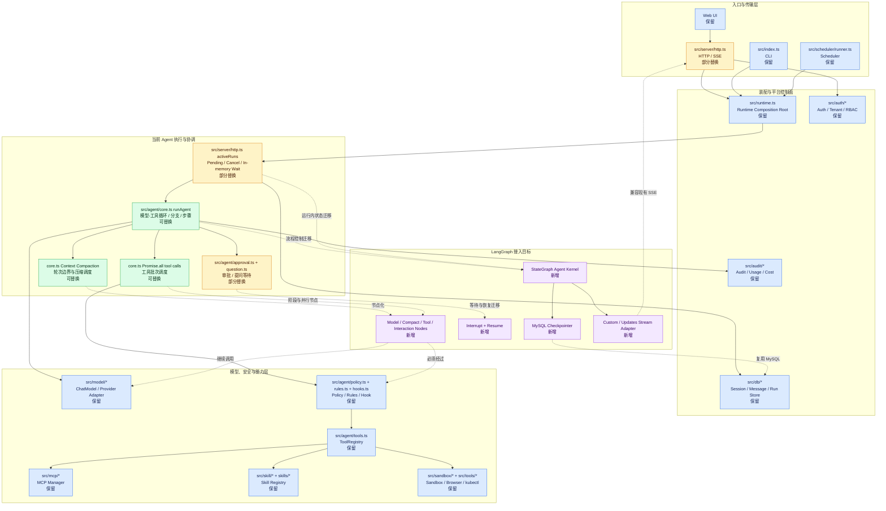
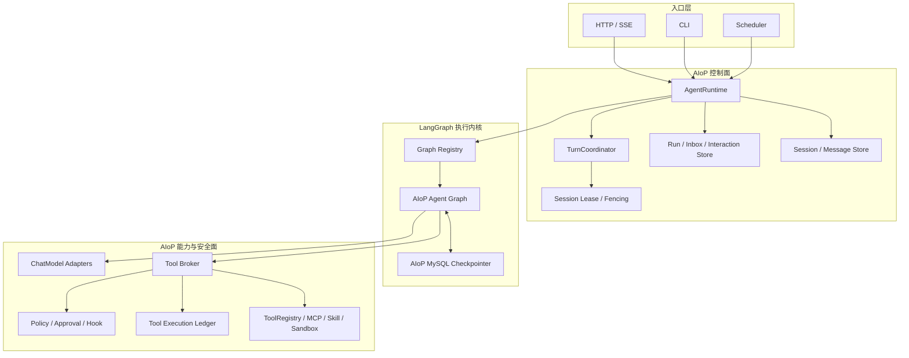
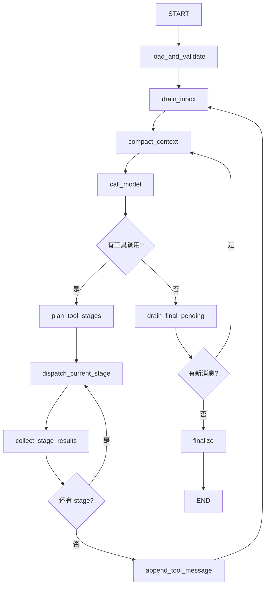
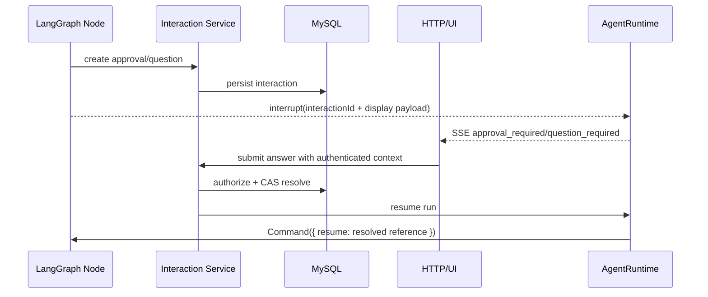

# LangGraph 与 AIoP 集成最佳方案

> 状态：技术调研与集成设计稿
> 日期：2026-07-21
> 目标仓库：`/home/opt/develop/aicoding/aiop`
> 调研基线：AIoP `feature/langgraph-dev` / `751ac62`；`@langchain/langgraph` `1.4.8`

---

## 1. 执行摘要

### 1.1 最终结论

AIoP 不应直接替换为 LangChain Agent，也不应把 LangSmith Agent Server 作为新的平台控制面。推荐采用：

> **AIoP 保持企业级控制面，LangGraph 作为进程内、可替换、受约束的 Agent 执行内核。**

具体边界如下：

| AIoP 保持权威 | LangGraph 负责 |
|---|---|
| Tenant/User/RBAC、认证、可信 `RequestContext` | 图节点、条件边、循环与动态分支 |
| Session、Message、Run、Lease、Inbox 的产品语义 | 单次 Run 内的状态演进和恢复游标 |
| ToolRegistry、Policy、Approval、Hook、Audit | 工具阶段编排和安全并行调度 |
| Sandbox、MCP、Skill、凭据和资源隔离 | Interrupt、子图、状态快照和 pending writes |
| 副作用工具账本、幂等与人工恢复判断 | 节点失败后从最近稳定 super-step 恢复 |
| HTTP/SSE、CLI、Scheduler 和最终消息提交 | `updates/custom` 等执行流输出 |
| MySQL、加密、保留策略、合规与可观测性 | Checkpointer 抽象和图状态读取能力 |

推荐的核心映射是：

- 一个 AIoP `session` 可以包含多个 `run`；
- **一个 AIoP `run` 对应一个 LangGraph `thread_id`**，而不是一个 session 对应一个 thread；
- AIoP `messages` 表是跨 turn 会话历史的唯一事实源；
- LangGraph checkpoint 是单次 run 的执行恢复数据，不替代会话消息库；
- Run 成功提交后，checkpoint 按短期保留策略清理；等待审批、失败或需恢复的 run 保留；
- LangGraph 不直接 dispatch 工具，所有工具仍经过 AIoP Tool Broker。

### 1.2 为什么这是最佳方案

AIoP 已经具备完整的模型适配、工具、安全、存储和平台能力，当前短板主要是：

1. `runAgent()` 是一个较大的命令式循环，复杂流程难以表达和测试；
2. HTTP、CLI、Scheduler 分别承担运行协调和持久化职责；
3. 同轮工具调用当前无条件 `Promise.all()`；
4. 审批和提问依赖进程内 Promise，重启后不能恢复；
5. 工具执行后、消息提交前中断存在副作用重复风险；
6. 后续多 Agent、子流程、条件回退会继续放大自研状态机成本。

LangGraph 正好擅长图编排、持久状态、interrupt、子图、流式更新和失败恢复。但它不提供 AIoP 所需的租户安全、数据库 lease、工具业务幂等、凭据治理或产品级 session 事务。因此，把 LangGraph 放在执行内核层，而不是替代整个平台，收益最大、风险最小。

### 1.3 建议决策

| 决策项 | 推荐结论 |
|---|---|
| 接入形态 | 进程内使用开源 `@langchain/langgraph`，不依赖 LangSmith Deployment |
| API 风格 | 主要使用 Graph API；不以 Functional API 承载核心 Run |
| 模型接入 | 保留 AIoP `ChatModel`，在节点中调用，不强制迁移 LangChain Model |
| 工具接入 | 保留 AIoP `ToolRegistry + Policy + Approval + Hook`，通过 Tool Broker 节点调用 |
| Checkpointer | 基于现有 Kysely/MySQL 实现 AIoP 自有 `BaseCheckpointSaver` |
| 会话映射 | 每个 run 一个 `thread_id`，session 消息仍由 AIoP Store 管理 |
| 人机协同 | LangGraph `interrupt()` + AIoP durable interaction record |
| 工具恢复 | LangGraph pending writes + AIoP tool execution ledger 双层保障 |
| 流式输出 | LangGraph `custom/updates` 映射到现有 SSE 事件，前端先保持兼容 |
| 多副本协调 | 继续实现 AIoP AgentRuntime/Lease/Fencing；不能只依赖 checkpointer |
| 可观测性 | 默认 AIoP Audit/日志/指标；LangSmith 仅作为可选开发工具 |
| 版本策略 | 固定小版本、记录 `graphVersion`、保留旧图直到在途 run 排空 |

---

## 2. 调研范围与事实

### 2.1 LangGraph 定位

LangGraph 官方将其定位为低层 Agent orchestration framework/runtime，重点能力包括：

- durable execution；
- persistence；
- human-in-the-loop；
- streaming；
- short-term / long-term memory；
- subgraphs；
- time travel；
- fault tolerance。

LangGraph 不要求使用 LangChain 的模型和工具封装。图节点本质上是普通函数，因此 AIoP 可以继续使用现有 `ChatModel`、`ToolRegistry`、Policy 和 Sandbox。

截至 2026-07-21，npm 最新版本为 `@langchain/langgraph@1.4.8`：

- MIT License；
- Node.js `>=18`；
- 依赖 `@langchain/core`；
- peer dependency 支持 Zod 3.25+ 或 4.2+；
- AIoP 当前 Node.js 20、Zod 4.4.3 满足要求。

### 2.2 LangGraph 执行模型

Graph API 的核心概念是：

- **State**：共享的运行状态；
- **Node**：执行逻辑并返回局部状态更新；
- **Edge**：决定下一节点；
- **Super-step**：一批可并行节点的执行边界；
- **Checkpoint**：super-step 完成后的完整状态快照；
- **Pending writes**：同一 super-step 中已经成功节点的独立写入。

当一个并行节点失败时，已成功节点的 pending writes 可以保留，恢复时无需全部重跑。这对 AIoP 的并行工具调用有直接价值。

### 2.3 持久化能力

LangGraph 区分：

| 类型 | 作用 | AIoP 对应关系 |
|---|---|---|
| Checkpointer | 单 thread 图状态、恢复、interrupt、time travel | 单次 AIoP run 的执行快照 |
| Store | 跨 thread 长期数据 | AIoP 现有 Store、未来长期记忆 |

官方 JavaScript checkpointer 主要提供 PostgreSQL、SQLite、MongoDB、Redis 实现，没有官方 MySQL 实现。基础接口 `BaseCheckpointSaver` 包含：

- `getTuple()`；
- `list()`；
- `put()`；
- `putWrites()`；
- `deleteThread()`。

官方同时发布 `@langchain/langgraph-checkpoint-validation`，可用于验证自定义 saver 的协议兼容性。因此 AIoP 适合基于 Kysely/MySQL 实现自有 saver，而不是为 LangGraph 单独引入第二套 PostgreSQL。

### 2.4 Interrupt 语义

`interrupt()` 会保存图状态并返回 JSON 可序列化的等待信息；恢复时使用相同 `thread_id` 和 `Command({ resume })`。

需要特别注意：

- 恢复不是从 JavaScript 函数调用栈中间继续；
- 包含 interrupt 的 node 会从头重新执行；
- interrupt 之前的逻辑必须无副作用或幂等；
- 多个 interrupt 或 task 的顺序属于持久协议，不能随意重排；
- 审批身份、权限、过期和审计不是 LangGraph 自动提供的。

因此 AIoP 必须把审批与提问建模为显式节点，并把安全校验放在 AIoP durable interaction 层。

### 2.5 恢复语义的边界

LangGraph 能避免重新运行已经成功并写入 pending writes 的并行节点，但不能消除以下窗口：

```text
外部系统副作用已经发生
→ 工具 node 尚未返回
→ 进程崩溃
→ 没有成功 pending write
→ 恢复时 node 可能重跑
```

所以 LangGraph 的 checkpoint 不能替代 AIoP 已设计的：

- `tool.started` 记录；
- `tool.completed` 记录；
- idempotency key；
- 非幂等工具 unknown 状态；
- `recovery_required` 人工处理。

### 2.6 图版本兼容性

LangGraph 恢复旧 checkpoint 时会执行当前代码。以下变化可能破坏在途 run：

- 删除或重命名等待中的 node；
- 删除或重命名 State 字段；
- 收紧旧 checkpoint 不满足的 schema；
- 重排 Functional API 中 interrupt/task 调用；
- 改变有业务含义的路由，而没有保存 flow version。

AIoP 必须记录 `graphName + graphVersion`，通过图注册表选择对应版本，不能让全部旧 run 无条件使用最新图。

---

## 3. AIoP 当前架构评估

### 3.1 已具备的关键能力

AIoP 当前已经具备：

- TypeScript/ESM/Node.js 20；
- Anthropic/OpenAI provider-neutral `ChatModel`；
- `Msg`、`ToolCall`、`ToolResult`、`StreamEvent`；
- 模型流式输出、重试、thinking、usage；
- 上下文预算、图片治理、摘要压缩；
- `ToolRegistry` 和动态 MCP/Skill 工具；
- Policy、Approval、PermissionRules、Hook；
- ask-user 和 change-plan 交互；
- Sandbox、Browser、kubectl 和下载导出；
- HTTP/SSE、CLI 和 Scheduler 三类入口；
- MySQL/Kysely Store 与 MemoryStore；
- Tenant/User/RBAC、OIDC/AIOS/local auth；
- 审计、成本、定时任务和 Kubernetes 部署。

这些能力不应因为引入 LangGraph 而被重复实现。

### 3.2 当前 AIoP 模块架构与 LangGraph 替换范围

下图按当前源码模块展示 AIoP 的主要运行链路，并标记 LangGraph 的适用边界：

- **可替换**：现有模块的核心职责可迁移到 LangGraph；
- **部分替换**：只迁移流程协调或等待/恢复机制，业务决策权仍留在 AIoP；
- **保留**：属于 AIoP 平台控制面或能力适配层，不应交给 LangGraph；
- **新增**：为 LangGraph 接入增加的适配与持久化模块。



#### 3.2.1 模块替换边界表

| 当前模块/职责 | 替换程度 | LangGraph 承接内容 | AIoP 必须保留内容 |
|---|---|---|---|
| `src/agent/core.ts` 的 `runAgent()` | 高，可替换 | 循环、条件边、步骤推进、终止判断、节点状态 | `ChatModel`、消息协议、重试细节和工具安全入口 |
| `runAgent()` 内上下文压缩调度 | 高，可替换 | 将压缩检查和摘要变成显式节点及 checkpoint 边界 | token 估算、摘要实现、图片治理策略 |
| `Promise.all()` 工具批次调度 | 高，可替换 | 动态并行节点、super-step、pending writes、失败后局部恢复 | ToolExecutionPlanner、资源键、工具副作用分类和结果顺序 |
| HTTP `activeRuns` 中的运行内状态 | 中，部分替换 | 单 run 图状态、暂停位置、恢复游标 | 跨副本 Lease/Fencing、durable inbox、cancel owner 路由 |
| `approval.ts`、`question.ts` 的进程内等待 | 中，部分替换 | `interrupt()`、checkpoint、`Command({ resume })` | 审批权限、交互记录、过期、CAS、审计和可信决策读取 |
| 模型流事件协调 | 中，部分替换 | `custom/updates` 流、节点级事件来源 | 现有 `StreamEvent`、RuntimeEvent、SSE 对外兼容协议 |
| Session/Message 持久化 | 低，不替换 | 仅保存单 run checkpoint | 会话历史事实源、revision、最终事务提交和数据生命周期 |
| `ChatModel` 与 Anthropic/OpenAI Adapter | 不替换 | 在 model node 中调用 | Provider 协议翻译、thinking、usage、重试和模型配置 |
| ToolRegistry/MCP/Skill/Sandbox | 不替换 | 在 tool node 中经 Broker 调用 | 工具发现、生命周期、资源隔离、凭据和真实 dispatch |
| Policy/Rules/Hook/Audit | 不替换 | 在节点执行路径中调用 | 所有授权、审批决策、安全底线和审计事实 |
| Auth/Tenant/RBAC | 不替换 | 无 | 可信身份、多租户边界和权限判断 |

图中的“可替换”不是删除对应业务能力，而是把其**流程状态机职责**迁移到 LangGraph；模型、工具、安全和存储实现继续作为 LangGraph 节点调用的 AIoP 能力。

### 3.3 当前执行链路

```text
HTTP / CLI / Scheduler
        │
        ├─ 加载 session history
        ├─ 拼装 model / tools / policy / approval / context
        ▼
    runAgent()
        ├─ 上下文压缩
        ├─ model.stream()
        ├─ 收集 tool calls
        ├─ policy / approval / hook
        ├─ Promise.all(tool dispatch)
        └─ 循环直到无 tool call
        │
        ▼
appendMessages() / replaceMessages()
```

### 3.4 最适合 LangGraph 接管的部分

LangGraph 应接管：

- `runAgent()` 内的循环和分支；
- 模型轮次、压缩、工具规划、工具执行、交互等待的节点边界；
- 同一 run 的 checkpoint 和恢复游标；
- 可恢复的并行工具 super-step；
- 未来子 Agent/子流程的组合。

LangGraph 不应接管：

- 认证与 `RequestContext` 构造；
- 租户边界和 RBAC；
- Session/Message 产品 API；
- Policy、Approval 决策权；
- Sandbox/MCP/Skill 生命周期；
- 凭据获取与注入；
- 跨副本 session lease；
- 工具业务幂等；
- 审计、计费和数据保留策略；
- HTTP/SSE 对外协议。

### 3.5 与现有 Agent Runtime 设计的关系

仓库已有 `docs/DESIGN-agent-runtime.md`，其 AgentRuntime、TurnCoordinator、Message Envelope、Runtime Event、Lease、Fencing、Tool Ledger 等设计仍然有效。

集成后职责调整为：

```text
AgentRuntime / TurnCoordinator
    ├─ run/session/lease/inbox/identity/commit
    ├─ graph selection and version
    └─ invoke/resume/cancel LangGraph

LangGraph Agent Kernel
    ├─ model/compact/tool/interaction nodes
    ├─ conditional edges and subgraphs
    ├─ run-local state/checkpoint
    └─ stream updates

AIoP Tool Broker
    ├─ policy/approval/hook
    ├─ execution planning
    ├─ tool ledger/idempotency
    └─ registry/sandbox/MCP/Skill dispatch
```

也就是说，LangGraph 替代的是 `runAgent()` 的流程控制和一部分 checkpoint mechanics，不替代 AgentRuntime 的服务端协调职责。

---

## 4. 三种集成路线对比

### 4.1 路线 A：全面迁移到 LangChain/LangGraph 预构建 Agent

做法：

- 使用 LangChain model/tool 类型；
- 使用 prebuilt React Agent；
- 将 AIoP 工具全部包装成 LangChain Tool；
- 将 session、stream 和 approval 迁移到 LangGraph/LangSmith 体系。

优点：

- 示例和生态最多；
- 初期 demo 速度快；
- 可直接使用部分预构建 Agent 能力。

缺点：

- 重写现有 provider adapter 和消息模型；
- 工具安全链路容易被双重封装或绕过；
- AIoP 与 LangSmith Agent Server 形成双控制面；
- 多租户、审批、审计和凭据模型不自然；
- 迁移范围大，回归风险高；
- 对私有化部署和数据主权不友好。

结论：**不推荐。**

### 4.2 路线 B：把现有 `runAgent()` 包成单个 LangGraph Node

做法：

```text
START → run_existing_agent → END
```

优点：

- 改动很小；
- 可以快速验证依赖和基本 streaming；
- 适合作为短期 spike。

缺点：

- checkpoint 只能落在整个 `runAgent()` 前后；
- 工具调用、审批和压缩仍不可单独恢复；
- 并行工具 pending writes 无法发挥作用；
- 基本没有获得 LangGraph 的核心价值。

结论：**只适合 1～2 周验证，不应成为生产架构。**

### 4.3 路线 C：渐进式 Graph Kernel，复用 AIoP 适配器和控制面

做法：

- 保留 AIoP `ChatModel`；
- 保留 ToolRegistry/Policy/Approval/Hook；
- 将 `runAgent()` 拆为明确图节点；
- 使用自有 MySQL checkpointer；
- 每个 run 独立 thread；
- AgentRuntime 负责图外运行协调。

优点：

- 获得 checkpoint、interrupt、并行恢复和子图能力；
- 最大限度复用现有代码；
- 安全、租户、审计和产品协议不迁移；
- 可按入口和场景灰度；
- LangGraph 可替换，不成为不可逆基础设施锁定。

缺点：

- 需要实现并长期维护 MySQL checkpointer；
- 需要把现有循环拆成节点；
- 工具副作用仍需 AIoP ledger；
- 图版本治理成为新运维要求。

结论：**推荐路线。**

### 4.4 替换部分模块到 LangGraph 的收益

| 替换对象 | 当前问题 | LangGraph 提供的机制 | 主要好处 | 仍需 AIoP 补齐 |
|---|---|---|---|---|
| `runAgent()` 命令式循环 | 模型、工具、压缩、pending message 和终止逻辑集中在一个循环中，扩展分支容易互相影响 | State、Node、Conditional Edge、循环图 | 流程边界清楚；节点可独立测试；增加回退、分支和子流程时不必继续扩大单函数 | 节点内的模型与工具业务实现 |
| 模型轮次和工具轮次的恢复 | 当前完整 `runAgent()` 返回前缺少细粒度稳定恢复点 | 每个 super-step checkpoint、StateSnapshot | 进程重启后从最近稳定节点恢复，减少整轮任务丢失和重复模型调用 | MySQL saver、图版本和恢复权限校验 |
| 并行工具执行 | 当前同轮调用无条件 `Promise.all()`，无法表达串行屏障或同资源互斥 | 动态节点、并行 super-step、pending writes | 安全工具可并行；同批部分成功时保留成功结果；失败恢复不必重跑全部工具 | execution metadata、stage planner、资源键和副作用账本 |
| 审批与提问等待 | 依赖进程内 Promise，Pod 重启或请求断开后等待状态丢失 | `interrupt()`、持久 checkpoint、`Command({ resume })` | 等待状态可跨进程恢复；审批和提问成为显式流程节点；更容易查询当前暂停位置 | durable interaction 表、RBAC、过期、CAS 和审计 |
| 上下文压缩调度 | 压缩判断嵌在循环边界，后续引入不同压缩策略时耦合较高 | 独立 compact node、条件边、checkpoint | 压缩前后状态可观测；策略更容易灰度和测试；失败回退路径更明确 | 现有 token 预算、摘要模型和图片保留策略 |
| 运行状态可观测性 | 当前事件以模型/工具流为主，缺少统一节点级生命周期 | `updates`、`custom`、`debug` stream | 可看到节点进入、状态更新和暂停点；更容易定位长任务卡点和失败阶段 | RuntimeEvent、指标、脱敏与 SSE 适配 |
| 多流程复用 | 训练、推理、诊断、报告等流程若继续写条件分支，会重复编排代码 | Subgraph、共享节点、显式输入输出 State | 公共审批、模型、工具和恢复节点可复用；业务流程可独立演进 | 子图版本治理和业务边界定义 |
| 测试与故障注入 | 大循环测试需要构造完整运行，难以稳定覆盖中间状态 | 节点单测、状态快照、指定 checkpoint 恢复 | 可针对单节点、单边和特定恢复点测试；故障注入定位更精确 | saver 合同测试和外部副作用模拟 |
| 渐进式演进 | 直接替换 Agent 栈风险大 | 普通函数节点、可选 checkpointer、图注册表 | 可以复用 AIoP 模型和工具适配器，按入口/租户灰度；旧 kernel 可保留回退 | feature flag、差异测试和双版本维护窗口 |

总体收益可以归纳为四类：

1. **可维护性**：把大循环拆成有明确输入输出的节点和边；
2. **可靠性**：通过 checkpoint、pending writes 和 interrupt 获得可恢复执行；
3. **扩展性**：为子图、多流程和后续多 Agent 提供统一编排模型；
4. **低迁移风险**：保留 AIoP 已成熟的模型、安全、工具、租户和存储能力，只替换最适合图运行时的部分。

同时需要保持预期准确：LangGraph 不自动提供跨 Pod Lease、租户授权、工具 exactly-once 或外部副作用事务，这些仍由 AIoP AgentRuntime 和 Tool Ledger 负责。

---

## 5. 推荐总体架构



### 5.1 关键原则

1. **一个 run 一个权威状态机**：同一 run 不能同时由旧 `runAgent()` 和 LangGraph 执行。
2. **Host owns authority**：图只能使用宿主注入的可信上下文，不能从 State 中的用户文本恢复身份。
3. **Checkpointer 不是锁**：跨副本同 session 串行仍由 Lease/Fencing 保证。
4. **Session 与 checkpoint 分离**：会话消息是产品记录，checkpoint 是运行记录。
5. **工具永不绕过 Broker**：LangGraph node 不直接访问 MCP、kubectl、Sandbox Provider。
6. **失败关闭**：graph version、租户上下文、tool execution mode 或 recovery 状态不明时停止执行。
7. **可回退**：旧 Agent Kernel 保留 feature flag，按租户/场景灰度切换。

---

## 6. Graph State 设计

建议使用显式、版本化的 State，不直接把 `Runtime`、数据库连接、模型实例或凭据放入 checkpoint。

```ts
interface AgentGraphStateV1 {
  schemaVersion: 1;
  graphName: 'aiop-agent';
  graphVersion: 'v1';

  runId: string;
  turnId: string;
  sessionId: string;
  baseHistoryRevision: number;

  messages: Msg[];
  pendingInputs: MessageEnvelope[];

  step: number;
  maxSteps?: number;
  compacted: boolean;
  compactionWatermarkTokens: number;

  currentAssistant?: Msg;
  pendingToolCalls: ToolCall[];
  toolPlan?: ToolExecutionPlan;
  currentToolStage: number;
  toolResults: Record<string, ToolResult>;

  interaction?: {
    interactionId: string;
    kind: 'approval' | 'question' | 'change_plan';
    status: 'waiting' | 'resolved';
  };

  usage: Usage;
  finalText?: string;
  outcome?: 'completed' | 'failed' | 'cancelled' | 'recovery_required';
  error?: SerializedRunError;
}
```

### 6.1 不进入 State 的内容

以下对象由运行时依赖注入，不能序列化进 checkpoint：

- `RequestContext` 中的 token/credential 原文；
- `ChatModel` 实例；
- `ToolRegistry` 实例；
- Store/Kysely 连接；
- Sandbox handle 或浏览器连接对象；
- AbortController；
- SSE response；
- Approval Promise；
- API key、Bearer token 和环境变量。

### 6.2 可信 Runtime Context

节点依赖通过 graph invocation context 注入：

```ts
interface AgentGraphRuntimeContext {
  request: RequestContext;
  model: ChatModel;
  tools: ToolBroker;
  compactor: ContextCompactor;
  interactions: InteractionService;
  events: RuntimeEventSink;
  signal: AbortSignal;
}
```

恢复时 AgentRuntime 必须重新根据 `runId` 读取并验证可信上下文，不能信任 checkpoint 内的 tenantId/userId/role 来授权。

---

## 7. 图节点与数据流

### 7.1 主图



### 7.2 Node 职责

| Node | 责任 | 禁止事项 |
|---|---|---|
| `load_and_validate` | 校验 state/schema/graph/run 状态和 revision | 不从消息推断身份 |
| `drain_inbox` | 领取 durable pending input，按边界注入 messages | 不直接读 HTTP 进程内队列 |
| `compact_context` | 执行当前上下文治理和摘要逻辑 | 不提交 session 历史 |
| `call_model` | 调用现有 `ChatModel.stream()`，收集 assistant/tool calls/usage | 不执行工具 |
| `plan_tool_stages` | 根据工具 execution metadata 生成并行/串行 stage | 未知工具不能默认并行 |
| `execute_tool` | 经 Tool Broker 执行单个工具 | 不直接 registry.dispatch |
| `collect_stage_results` | 按模型 tool call 原顺序聚合结果 | 不按完成顺序回填模型 |
| `append_tool_message` | 生成完整 tool result message | 不提交半截 provider 消息 |
| `finalize` | 形成 terminal state 和待提交消息 | 不直接绕过 AgentRuntime 事务提交 |

### 7.3 模型流节点

`call_model` 复用当前能力：

- `buildSystemPrompt()`；
- `contextBudgetTokens`；
- model retry/backoff；
- thinking block；
- usage；
- provider-neutral `Msg/ToolCall`；
- `filterToolDefs()`。

现有 `StreamEvent` 通过 LangGraph custom writer 输出：

```text
ChatModel StreamEvent
→ Graph custom event
→ AgentRuntime RuntimeEvent
→ HTTP SSE compatibility adapter
```

因为 AIoP 使用自有模型接口，不应依赖 LangChain `messages` stream mode 自动采集 token；`custom` 是更稳定的边界。

### 7.4 工具动态并行

建议扩展 `ToolHandler`：

```ts
interface ToolExecutionMetadata {
  mode: 'parallel' | 'serial' | 'resource';
  resourceKey?: (call: ToolCall, ctx: ToolContext) => string;
  sideEffect: 'none' | 'idempotent' | 'non_idempotent';
  supportsIdempotencyKey?: boolean;
}
```

默认值：

```text
mode = serial
sideEffect = non_idempotent
supportsIdempotencyKey = false
```

`plan_tool_stages` 将同一模型轮次的 calls 编排成多个 stage：

- `parallel`：同 stage 并行；
- `serial`：单独 stage；
- `resource`：不同资源键可并行，同资源键按原顺序跨 stage 串行；
- resource key 解析失败：降级为 serial；
- 结果最终按原 tool call 顺序写回。

每个并行工具作为独立 graph task/node 执行。若一个工具失败，其他成功节点的 pending writes 可保留，恢复时不必重跑成功节点。

### 7.5 Tool Broker

统一调用链必须是：

```text
execute_tool node
→ validate trusted run context
→ check existing tool ledger
→ policy.check
→ durable interaction / interrupt if needed
→ pre-tool hook
→ save tool.started
→ dispatch with idempotency key
→ save tool.completed
→ audit
→ return ToolResult
```

任何 LangGraph tool node 都不能直接调用具体 handler。

---

## 8. Checkpointer 与数据模型

### 8.1 为什么选择 MySQL 自定义 Checkpointer

备选方案：

| 方案 | 优点 | 缺点 | 结论 |
|---|---|---|---|
| 新增 PostgreSQL 官方 Saver | 实现成熟、维护少 | 引入第二数据库、事务和运维割裂 | 不推荐作为默认 |
| Redis Saver | 性能高 | 数据保留、成本、恢复事实源和合规复杂 | 可作未来优化，不作一期事实源 |
| 自定义 MySQL Saver | 复用现有数据库、备份、租户治理和 Kysely | 需要维护协议兼容 | 推荐 |
| 不使用 Checkpointer | 改动小 | 失去 interrupt/恢复/pending writes | 不接受 |

### 8.2 建议表结构

命名可与 `docs/DESIGN-agent-runtime.md` 最终 schema 合并，避免重复 run 表。

#### `agent_graph_checkpoints`

```text
thread_id_hash       binary(32) / char(64)
checkpoint_ns        varchar(512)
checkpoint_id        varchar(64)
parent_checkpoint_id varchar(64) null
run_id               varchar(64)
graph_name           varchar(128)
graph_version        varchar(32)
checkpoint_blob      longblob
metadata_blob        longblob
created_at           datetime(3)

PK(thread_id_hash, checkpoint_ns, checkpoint_id)
INDEX(run_id, created_at)
```

#### `agent_graph_writes`

```text
thread_id_hash       binary(32) / char(64)
checkpoint_ns        varchar(512)
checkpoint_id        varchar(64)
task_id              varchar(128)
write_idx            int
channel              varchar(255)
type                  varchar(64)
value_blob            longblob
created_at            datetime(3)

PK(thread_id_hash, checkpoint_ns, checkpoint_id, task_id, write_idx)
```

#### `agent_tool_executions`

```text
run_id               varchar(64)
tool_call_id         varchar(255)
attempt               int
tool_name             varchar(255)
args_digest           char(64)
idempotency_key       varchar(255) null
side_effect_class     varchar(32)
status                started|completed|failed|unknown
result_blob           longblob null
started_at            datetime(3)
completed_at          datetime(3) null

UNIQUE(run_id, tool_call_id, attempt)
```

### 8.3 Thread ID 设计

不直接使用用户可控 sessionId。建议：

```text
raw = tenantId + "\0" + userId + "\0" + sessionId + "\0" + runId
thread_id = base64url(HMAC-SHA256(serverSecret, raw))
```

数据库额外保存 `run_id` 便于关联，但 saver 的任何读写仍需由 AgentRuntime 提供的 trusted run guard 校验租户和 lease。

### 8.4 加密和序列化

Checkpoint、metadata、pending writes 和工具结果可能包含：

- 用户输入；
- 工具参数；
- 模型输出；
- 文件路径；
- 集群和资源信息；
- thinking 内容。

因此：

1. 所有 blob 使用 AIoP SecretBox/AES-GCM 信封加密；
2. AAD 至少绑定 `runId/threadHash/checkpointNs/checkpointId/blobKind`；
3. 表中不保存明文工具参数和消息；
4. serializer 版本独立于 graph state schema version；
5. 支持密钥轮换和旧 key 解密；
6. metadata 同样加密，不能认为 metadata 天然无敏感信息；
7. 解密或 schema 校验失败进入 `recovery_required`，禁止空状态重跑。

### 8.5 Retention

建议默认：

| Run 状态 | Checkpoint 保留 |
|---|---|
| completed | 7 天，或成功提交后仅保留最终 checkpoint 24 小时 |
| cancelled 且无副作用不确定性 | 24 小时 |
| failed | 7～30 天 |
| waiting_approval / waiting_input | 等待期间持续保留 |
| recovery_required | 人工关闭前保留 |

长期会话历史由 `messages` 表负责，不通过无限 checkpoint 历史实现。

### 8.6 Saver 验证

自定义 saver 必须：

- 通过官方 checkpoint validation package；
- 验证并发 `putWrites()` 幂等；
- 验证 checkpoint parent chain；
- 验证 namespace/subgraph；
- 验证 list/before/limit；
- 验证 thread deletion；
- 做 MySQL 8 事务和死锁重试测试；
- 做加密 round-trip 和密钥轮换测试。

---

## 9. Run、Session 与事务边界

### 9.1 为什么不采用“一个 session 一个 LangGraph thread”

这样做会产生：

- LangGraph checkpoint 和 AIoP messages 两套会话真相；
- 同 session 并发、append、scheduler 和压缩时状态冲突；
- checkpoint 无限增长；
- session 删除、导出、审计语义变复杂；
- graph 版本升级影响全部历史会话。

### 9.2 推荐映射

```text
AIoP session
  ├─ run A → LangGraph thread A
  ├─ run B → LangGraph thread B
  └─ run C → LangGraph thread C
```

Run 开始：

1. AgentRuntime 获取 session lease；
2. 读取 canonical messages 和 `historyRevision`；
3. 创建 run，记录 `graphName/graphVersion`；
4. 生成 thread ID；
5. 将历史和本次输入作为初始 graph state；
6. 执行 graph。

Run 完成：

1. graph 进入 terminal state；
2. AgentRuntime 校验 lease/fencing token；
3. 校验 `baseHistoryRevision`；
4. 在事务内提交新增消息、usage、run terminal status；
5. 发布完成事件；
6. 按策略清理 checkpoint。

### 9.3 冲突处理

如果 history revision 已变化：

- 不允许覆盖提交；
- run 进入 `commit_conflict` 或 `recovery_required`；
- 对纯追加且可证明无冲突的消息可重新基于最新历史合并；
- 涉及 compaction/replace 时必须人工或确定性重算；
- 旧 lease owner 的提交由 fencing token 在数据库侧拒绝。

---

## 10. 审批、提问与 Interrupt

### 10.1 设计原则

LangGraph interrupt 负责“图暂停在哪里”，AIoP Interaction Service 负责“谁有权回答、回答是否有效”。



### 10.2 Interaction Record

至少包含：

- interactionId；
- tenantId/userId/sessionId/runId；
- kind；
- toolCallId 或 planId；
- prompt/payload 加密字段；
- allowed action/answer schema；
- status/version；
- expiresAt；
- resolvedBy/resolvedAt；
- decision digest；
- audit fields。

### 10.3 安全要求

- resume endpoint 必须重新认证；
- interaction 必须与 run/thread/tenant 匹配；
- 使用 CAS 防止重复批准；
- 过期审批不能恢复执行；
- 旧 attempt 的审批不能作用于新 attempt；
- 前端提交的 tool args 不能覆盖 checkpoint 中待审批 args；
- resume value 只传 interaction resolution reference，节点重新从 DB 读取可信决策；
- 已批准不代表绕过后续 Policy，执行前应复核资源和权限仍有效。

---

## 11. 工具副作用与恢复

### 11.1 双层恢复模型

| 层 | 解决的问题 | 不能解决的问题 |
|---|---|---|
| LangGraph checkpoint/pending writes | 节点级状态、并行成功节点免重跑 | 外部副作用完成但 node 未返回的崩溃窗口 |
| AIoP tool ledger/idempotency | 工具调用事实、重复保护、unknown 分类 | 任意外部系统的绝对 exactly-once |

### 11.2 恢复规则

恢复 `execute_tool` 时：

1. `completed` 且 args digest 一致：直接返回已保存结果；
2. `started` 且工具无副作用：允许重试；
3. `started` 且支持 idempotency key：使用相同 key 重试；
4. `started` 且幂等：按工具策略重试并审计；
5. `started` 且非幂等/状态未知：进入 `recovery_required`；
6. args digest 不一致：视为状态损坏，禁止执行；
7. tool definition/version 已变化：执行兼容性检查，不兼容则人工恢复。

### 11.3 不承诺 exactly-once

AIoP 可以承诺：

- 有 `completed` 结果的工具不重复执行；
- 支持幂等键的工具用固定 key 重试；
- 非幂等工具状态未知时不自动重放；
- 所有恢复决策可审计。

不能承诺所有外部系统副作用 exactly-once，除非目标 API 本身支持幂等键或事务。

---

## 12. Streaming 与前端兼容

### 12.1 内部事件分层

建议保留三层：

1. `StreamEvent`：模型和工具原始流；
2. LangGraph stream：`custom`、`updates`、必要时 `debug`；
3. `RuntimeEvent`：run/turn/checkpoint/interaction 生命周期。

### 12.2 兼容策略

第一阶段不改前端协议：

| LangGraph/Runtime 事件 | 现有 SSE |
|---|---|
| model custom `text_delta` | `text_delta` |
| model custom `thinking_delta` | `thinking_delta` |
| tool start/output/result | 现有 tool 事件 |
| interaction waiting | `approval_required` / question 事件 |
| run completed | `done` |
| cancelled | `terminated` |
| model retry | `model_retry` |

新增 run/turn/checkpoint 事件先用于日志、测试和后台 API，不要求前端立即消费。

### 12.3 断线语义

- SSE 断开不等于 run 取消；
- run 是否继续由显式 `DisconnectPolicy` 决定；
- token delta 不保证重放；
- 客户端重连通过 run status + final result +当前 interaction 恢复 UI；
- 生命周期事件必须有 `eventId/sequence/runId/turnId`；
- 慢消费者不能阻塞 graph/checkpointer。

---

## 13. 多副本、取消与 Lease

### 13.1 LangGraph Checkpointer 不能替代 Lease

开源 LangGraph 在进程内被调用时，不负责 AIoP 的：

- 同 session run 冲突；
- 跨 Pod owner 选举；
- pending message 路由；
- cancel 命中 owner；
- 旧 owner 写入隔离；
- history revision 提交。

因此继续采用 `DESIGN-agent-runtime.md` 的：

- session lease；
- ownerId + generation fencing token；
- 数据库时间续租；
- durable inbox；
- CAS run state；
- owner-only checkpoint mutation guard。

### 13.2 取消语义

取消流程：

1. run 状态 CAS 为 `cancelling`；
2. 通知 owner 的 AbortSignal；
3. 停止启动新 graph node/tool stage；
4. 等待已启动工具到 quiesce deadline；
5. 保存已返回工具结果；
6. 若存在非幂等 unknown tool，进入 `recovery_required`；
7. 否则进入 `cancelled`；
8. 旧 owner 后续写入被 fencing 拒绝。

不能简单把 JavaScript AbortError 映射为“已安全取消”。

---

## 14. Graph Version 与发布治理

### 14.1 图注册表

```ts
interface AgentGraphDescriptor {
  name: string;
  version: string;
  stateSchemaVersion: number;
  build(): CompiledStateGraph;
  canResume(checkpoint: CheckpointMetadata): boolean;
}
```

Run 创建时固定：

- graphName；
- graphVersion；
- stateSchemaVersion；
- toolCatalogVersion；
- modelConfig revision；
- policy revision（如适用）。

### 14.2 兼容策略

- node 名称视为持久 API；
- state 字段先新增可选字段，再经过 drain window 删除；
- 新行为通过 `flowVersion` 条件边启用；
- 保留最近至少两个 graph version；
- 部署前用生产脱敏 checkpoint 在 staging 做 resume 测试；
- 删除旧图前确认无 waiting/running/recovery run；
- LangGraph npm 升级不与业务图大改同批发布。

### 14.3 依赖固定

建议：

- 初次使用精确版本，不使用宽松 `^`；
- `@langchain/langgraph`、`@langchain/core`、checkpoint base/validation 作为一组升级；
- 升级必须跑 saver contract、graph resume、interrupt 和并发工具测试；
- 关注 checkpoint format 和 beta API，避免直接依赖内部 Pregel 实现。

---

## 15. 安全与合规

### 15.1 多租户

- `thread_id` 仅是定位键，不是授权凭据；
- 所有 saver 访问必须经 trusted run guard；
- run、interaction、tool ledger、checkpoint 查询必须按 tenant/user 约束；
- admin 跨用户查询也必须显式走 RBAC；
- subgraph namespace 不能绕过 tenant 条件。

### 15.2 凭据

- API key/token 不进入 State、checkpoint、stream、LangSmith trace；
- 节点按需从 UserCredentials 获取短期凭据；
- 工具结果和错误必须脱敏；
- 恢复时重新获取当前凭据，不能使用 checkpoint 中旧 secret；
- 凭据变化可能导致恢复失败，应返回可解释错误而不是降权或跨用户回退。

### 15.3 LangSmith

LangGraph 开源库是 MIT，但 LangSmith Observability/Deployment 是独立产品。AIoP 默认方案：

- 生产不要求 LangSmith；
- 不设置全局 `LANGSMITH_TRACING=true`；
- 如开发环境启用，必须使用专用环境、脱敏、采样和出口审批；
- 私有化客户默认关闭外部 trace；
- 不把 LangSmith API key 作为运行必需配置。

---

## 16. 可观测性

### 16.1 指标

至少包括：

- run accepted/queued/running/waiting/completed/failed；
- graph node duration/error/retry；
- checkpoint put/get/write latency 和大小；
- checkpoint 加密/解密失败；
- thread resume 次数与成功率；
- interaction 等待时长；
- tool stage 并行度；
- tool ledger cache hit/unknown/recovery_required；
- lease acquire/renew/lost；
- history revision conflict；
- graphVersion 分布。

### 16.2 日志关联字段

```text
tenantIdHash
userIdHash
sessionId
runId
turnId
threadIdHash
graphName
graphVersion
nodeName
checkpointId
toolCallId
interactionId
leaseGeneration
```

敏感 ID 是否明文记录按现有日志规范执行；外部日志系统优先哈希化。

---

## 17. 测试策略

### 17.1 单元测试

- State reducer 和 schema migration；
- conditional edge；
- tool stage planner；
- result 原顺序聚合；
- policy/approval mapping；
- StreamEvent → custom event → SSE mapping；
- graph registry/version selection；
- recovery classification。

### 17.2 Saver 合同测试

- 官方 validation suite；
- put/get/list/delete；
- parent checkpoint；
- pending writes；
- namespace/subgraph；
- 并发写幂等；
- transaction rollback；
- deadlock retry；
- encrypted payload round-trip；
- key rotation；
- retention cleanup。

### 17.3 故障注入

在以下位置 kill 进程：

1. input accepted 后；
2. model stream 中；
3. assistant message 形成后；
4. tool.started 前；
5. tool.started 后、dispatch 前；
6. 外部副作用后、tool.completed 前；
7. tool.completed 后、graph write 前；
8. 并行工具部分完成时；
9. interrupt 保存后；
10. resume 后；
11. final graph checkpoint 后、session commit 前；
12. session commit 后、run terminal 前。

验收重点不是“都能自动继续”，而是：不会静默重复副作用、不会跨租户、不会丢失已确认结果、未知状态会明确进入人工恢复。

### 17.4 兼容测试

- Anthropic thinking blocks 跨工具轮次保持；
- OpenAI tool call/result 格式保持；
- context compaction 结果与现有逻辑一致；
- HTTP SSE 前端零破坏；
- CLI/Scheduler 输出和审计一致；
- ask_user/change_plan/approval 重启后可恢复；
- 旧 `runAgent()` 与 LangGraph shadow 结果差异报告。

### 17.5 性能测试

- 首 token 延迟；
- 每 super-step MySQL 写放大；
- checkpoint blob 大小；
- 100/500/1000 并发 session；
- 多副本 lease + saver 争用；
- 大消息/图片状态；
- 20+ tool calls 的 stage 编排；
- checkpoint cleanup 对数据库影响。

---

## 18. 分阶段落地计划

### Phase 0：技术 Spike（1～2 周）

目标：验证技术兼容，不改生产入口。

- 引入固定版本依赖；
- 用 MemorySaver 构建最小图；
- 将现有 `runAgent()` 暂时包装为单 node；
- 验证 custom streaming、AbortSignal、Anthropic/OpenAI；
- 验证 Zod 4/TypeScript 6 构建；
- 输出性能和依赖体积基线。

退出标准：

- typecheck/test 通过；
- 两类模型基本对话与工具调用通过；
- 证明不需要迁移 LangChain model/tool。

### Phase 1：MySQL Checkpointer（2～3 周）

- 实现 saver schema、serde、加密；
- 接入 validation suite；
- 支持 checkpoint/pending writes/namespace；
- 增加 retention worker；
- 建立 run→thread 映射。

退出标准：

- saver 合同测试通过；
- 重启后可从稳定 node 恢复；
- 跨租户读取测试全部拒绝。

### Phase 2：拆分模型循环（2～4 周）

- 提取 `compact_context`；
- 提取 `call_model`；
- 提取 `plan_tool_stages`；
- 提取 `execute_tool` 和 `collect`；
- 保持现有消息和 SSE 协议；
- 与旧 `runAgent()` 做回归对照。

退出标准：

- 核心 agent 测试迁移；
- provider 行为一致；
- 同轮工具结果顺序一致；
- feature flag 可一键回退。

### Phase 3：Durable Interaction（2～3 周）

- interaction 表和服务；
- approval/question/change-plan 改为 interrupt；
- resume API；
- interaction expiry/CAS/audit；
- 重启恢复。

退出标准：

- Pod 重启后仍可继续审批和提问；
- 伪造/重复/跨租户回答被拒绝。

### Phase 4：Tool Ledger 与安全并行（3～4 周）

- execution metadata；
- stage planner；
- tool started/completed ledger；
- idempotency key；
- unknown/recovery_required；
- 并行 pending writes 故障注入。

退出标准：

- 已完成并行工具不重跑；
- 非幂等 unknown 工具不自动重放；
- browser/sandbox/resource 工具顺序正确。

### Phase 5：AgentRuntime 多入口迁移（3～5 周）

顺序建议：

1. Scheduler；
2. CLI；
3. HTTP 灰度租户；
4. 全量 HTTP。

同时接入：

- run/turn lifecycle；
- durable inbox；
- lease/fencing；
- final commit；
- cancel/recovery；
- status/resume API。

### Phase 6：子图与高级能力（后续）

在基础运行时稳定后再引入：

- 训练任务子图；
- 推理部署子图；
- 故障诊断子图；
- 报告生成子图；
- 多 Agent supervisor；
- long-term memory；
- time travel 管理 UI。

不要把多 Agent 作为首期目标。

---

## 19. 建议代码结构

```text
src/
├── agent-runtime/
│   ├── runtime.ts
│   ├── coordinator.ts
│   ├── run-store.ts
│   ├── interaction.ts
│   ├── events.ts
│   └── graph-registry.ts
├── langgraph/
│   ├── state-v1.ts
│   ├── graph-v1.ts
│   ├── context.ts
│   ├── nodes/
│   │   ├── load.ts
│   │   ├── inbox.ts
│   │   ├── compact.ts
│   │   ├── model.ts
│   │   ├── tool-plan.ts
│   │   ├── tool-execute.ts
│   │   ├── tool-collect.ts
│   │   └── finalize.ts
│   └── checkpoint/
│       ├── mysql-saver.ts
│       ├── serde.ts
│       ├── schema.ts
│       └── retention.ts
├── agent/
│   ├── tool-broker.ts
│   ├── tool-planner.ts
│   ├── tool-ledger.ts
│   └── ... existing policy/hooks/tools
└── server/
    └── runtime-sse-adapter.ts
```

`src/agent/core.ts` 在迁移期保留，最终变成兼容 facade 或删除。不要让新图节点继续反向调用完整 `runAgent()`。

---

## 20. 主要风险与缓解

| 风险 | 影响 | 缓解 |
|---|---|---|
| 自定义 MySQL saver 协议漂移 | 恢复错误、升级受阻 | validation suite、固定版本、适配层隔离 |
| checkpoint 写放大 | MySQL 压力 | 每 run thread、短保留、blob 监控、压缩与清理 |
| 图状态包含敏感数据 | 合规风险 | 全 blob 加密、AAD、脱敏日志、LangSmith 默认关闭 |
| LangGraph 被误当成分布式锁 | 并发覆盖 | AgentRuntime lease/fencing 独立实现 |
| 外部副作用重放 | 重复变更 | tool ledger、idempotency key、unknown 人工恢复 |
| 图版本变更破坏旧 run | 无法恢复 | graph registry、版本固定、兼容窗口、resume 测试 |
| 双重消息事实源 | 会话漂移 | session canonical、一个 run 一个 thread、终态事务提交 |
| 过早引入多 Agent | 复杂度失控 | 首期只迁移单 Agent loop |
| 迁移期间两套 kernel 行为不同 | 回归风险 | feature flag、shadow/differential tests、入口分期迁移 |
| LangChain 生态依赖扩大 | 包体/升级风险 | 只引入 langgraph/core，不引入完整 langchain |

---

## 21. 验收标准

生产切换前必须满足：

### 功能

- HTTP、CLI、Scheduler 均可通过 AgentRuntime 运行同一 graph；
- 现有 Anthropic/OpenAI、MCP、Skill、Sandbox、kubectl 能力保持；
- SSE 前端无破坏；
- 审批、提问可跨进程重启恢复；
- pending message 在稳定边界注入。

### 安全

- 所有工具经过 Policy/Approval/Hook/Audit；
- checkpoint/interaction/tool result 加密；
- 跨租户和旧 lease owner 写入被拒绝；
- token/API key 不进入 checkpoint、stream 或外部 trace；
- 非幂等 unknown 工具不自动重试。

### 可靠性

- saver contract 全部通过；
- 故障注入场景结果符合恢复规则；
- 完成工具不会因兄弟节点失败而重复执行；
- final commit 使用 revision + fencing；
- 旧 graph version 在在途 run 排空前可用。

### 运维

- 可按 tenant/role/entry feature flag 灰度；
- 一键回退旧 kernel；
- checkpoint retention 生效；
- 有 graph/node/checkpoint/tool/recovery 指标和告警；
- 不依赖外部 LangSmith 服务即可生产运行。

---

## 22. 明确不建议做的事

1. 不要把 LangSmith Agent Server 直接放到 AIoP Server 前面取代现有 HTTP/Auth/Store。
2. 不要为了使用 LangGraph 全量迁移到 LangChain Model/Tool。
3. 不要用 sessionId 直接作为无租户保护的 thread_id。
4. 不要把一个 session 的全部生命周期长期存成单个 LangGraph thread。
5. 不要认为 checkpoint 等于 exactly-once。
6. 不要在 interrupt 前执行无法重放的副作用。
7. 不要让 graph node 直接执行 MCP、kubectl 或 Sandbox 工具。
8. 不要把 `RequestContext`、credential 或运行时对象写入 State。
9. 不要用 MemorySaver 进入生产。
10. 不要在首期同时引入多 Agent、长期记忆、LangSmith Deployment 和 UI 重构。

---

## 23. 最终推荐顺序

如果只能先做三件事，建议依次为：

1. **完成 MySQL Checkpointer spike 和合同测试**，先确认最关键的基础设施可行性；
2. **将 `runAgent()` 拆成 model/tool graph nodes，但保持现有 Tool Broker 和 SSE**；
3. **实现 durable interaction + tool ledger**，再开始生产灰度。

这一顺序先验证不可替代的持久化基础，再获得编排收益，最后解决真正影响生产安全的审批和副作用恢复。

---

## 24. 参考资料

### LangGraph 官方

- Overview：<https://docs.langchain.com/oss/javascript/langgraph/overview>
- Graph API：<https://docs.langchain.com/oss/javascript/langgraph/graph-api>
- Persistence：<https://docs.langchain.com/oss/javascript/langgraph/persistence>
- Checkpointers：<https://docs.langchain.com/oss/javascript/langgraph/checkpointers>
- Interrupts：<https://docs.langchain.com/oss/javascript/langgraph/interrupts>
- Streaming：<https://docs.langchain.com/oss/javascript/langgraph/streaming>
- Subgraphs：<https://docs.langchain.com/oss/javascript/langgraph/use-subgraphs>
- Backward compatibility：<https://docs.langchain.com/oss/javascript/langgraph/backward-compatibility>
- npm：<https://www.npmjs.com/package/@langchain/langgraph>
- GitHub：<https://github.com/langchain-ai/langgraphjs>

### AIoP 仓库内关联设计

- `docs/DESIGN-aiop-overview.md`
- `docs/DESIGN-agent-runtime.md`
- `docs/DESIGN-shared-agent-sdk.md`
- `docs/DESIGN-boclaw-reference.md`
- `docs/RESEARCH-aiop-boclaw-technical-selection.md`

---

## 25. 一句话结论

> **把 LangGraph 用作 AIoP 单次 Agent Run 的可持久化图执行内核，而不是新的平台控制面；AIoP 继续掌握身份、租户、会话、工具安全、Lease、副作用恢复和最终数据提交。**
