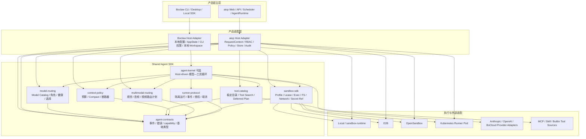
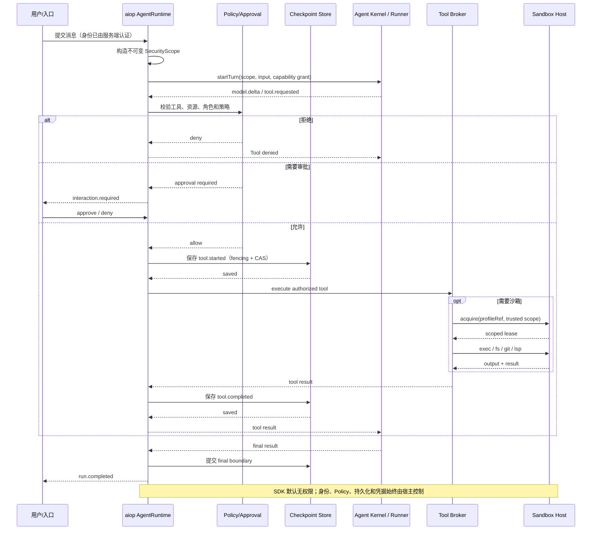

# Shared Agent SDK 体系详细设计

> 文档状态：方案设计稿
>
> 设计对象：从 Boclaw / BoBot 现有实现中抽取可复用 Agent 能力，形成 Boclaw 与 aiop 共同依赖的共享 SDK 体系
>
> 目标宿主：`/home/opt/develop/aicoding/boclaw/bocloud-ai-boclaw`、`/home/opt/develop/aicoding/aiop`
>
> 范围：SDK 抽象、宿主契约、沙箱集成、隔离 Runner、迁移与治理；不修改业务代码
>
> 源码基线：Boclaw `0.2.71`；aiop 当前 `feature/aios-integration` 分支
>
> 关联文档：`docs/DESIGN-agent-runtime.md`、`docs/DESIGN-boclaw-reference.md`

---

## 1. 概述

### 1.1 背景

Boclaw 当前已经发布 `@bocloud/bobot-agent-sdk`，同一源码同时支撑 CLI 和进程内 SDK。其优势集中在编码 Agent、模型能力路由、Tool Search、上下文压缩、多模态和本地开发工作区工具；但当前 SDK 仍携带较多产品级和进程级假设：

- `QueryEngine` 持有 conversation 内可变消息、文件缓存、usage、权限拒绝和取消状态；
- `Agent` 默认装配全部内置工具和 MCP；
- 构造过程仍可能写入 `process.env`；
- `QueryEngine.submitMessage()` 仍调用 `setCwd(cwd)`；
- 本地 transcript、`$HOME/.bobot`、AppState、CLI 配置和 feature flag 深度参与运行；
- 当前 SDK 默认权限路径不适合作为多租户服务端的安全边界；
- SDK、CLI、桌面和原生依赖位于同一发布面，依赖体积和副作用较大。

aiop 已经具备企业 Web Agent 平台所需的主要控制面：

- JWT、OIDC、AIOS token exchange、Tenant/User/RBAC；
- HTTP/SSE、会话和消息持久化、Scheduler；
- Policy、Approval、Hook、Audit；
- Skill 所有权和可见性；
- MCP 管理；
- E2B、OpenSandbox、Local Sandbox；
- 用户凭据加密、用户 Home 挂载和沙箱生命周期；
- Kubernetes、多集群和运维工具；
- 已设计的 Agent Runtime、Lease、Checkpoint 和安全恢复。

因此，合理方向不是让 aiop 直接依赖当前完整 Boclaw Runtime，也不是分别维护两套相似能力，而是：

> 将 Boclaw 中可复用的协议、算法和宿主无关能力下沉为共享 SDK；Boclaw 和 aiop 分别作为宿主接入；完整 Boclaw 编码 Agent 通过可选隔离 Runner 提供，而不是默认嵌入 aiop Server 进程。

### 1.2 设计目标

1. 建立 Boclaw 与 aiop 可共同依赖的版本化 Agent SDK 体系。
2. 抽取模型目录、工具目录、Tool Search、上下文治理、多模态和沙箱编排等成熟能力。
3. 提供完整而安全的沙箱集成契约，支持 Local、E2B、OpenSandbox、Kubernetes Pod 等后端。
4. 保留 aiop 对身份、租户、Policy、Approval、Store、Checkpoint、Audit 和凭据的控制权。
5. 保留 Boclaw 对本地编码体验、CLI、工作区工具、Subagent、Plan、Worktree 和 LSP 的产品控制权。
6. 允许同一套 SDK 被不同 Agent Kernel 使用，避免协议和算法重复建设。
7. 支持可选的完整 Boclaw Coding Runner，以隔离进程或容器方式接入 aiop。
8. 通过默认拒绝、无隐式工具、无隐式网络和无进程全局状态形成安全默认。
9. 通过语义版本、能力协商、契约测试和跨团队治理控制长期升级成本。

### 1.3 成功标准

- aiop 可以独立引入模型、工具、上下文、沙箱等 SDK，而不需要引入 Ink、CLI、本地 transcript 或 Boclaw AppState。
- Boclaw 可以反向依赖同一批 SDK，现有 CLI/SDK 行为通过兼容测试保持稳定。
- 纯能力 SDK 导入时不访问文件系统、网络、环境变量或全局状态。
- 沙箱 SDK 可以由 aiop 现有 `SandboxManager` 和 Boclaw 本地 sandbox-runtime 分别适配。
- 所有真实工具执行均经过宿主 Policy、Approval、Hook、Checkpoint 和 Audit，SDK 无法绕过。
- 完整 Boclaw Agent 在 aiop 中运行时，默认位于独立 Runner，不与其他租户共享 cwd、环境变量、MCP、凭据或文件系统。
- SDK 升级能够通过兼容矩阵、契约测试和灰度开关独立回退。

### 1.4 范围

本方案覆盖：

- SDK 包划分与依赖关系；
- 公共类型和错误模型；
- 模型能力目录与路由；
- 稳定 Tool Catalog、Tool Search 和延迟工具发现；
- 上下文预算、压缩策略和恢复判断；
- 多模态翻译路由；
- MCP、Skill 和动态工具接入；
- 沙箱能力、生命周期、文件/命令执行、网络、挂载和凭据边界；
- Host-driven Agent Kernel；
- 隔离 Runner Protocol；
- 事件、持久化、权限、审批和可观测性；
- 版本发布、跨团队治理、迁移、测试和验收。

### 1.5 非目标

- 不以共享 SDK 取代 aiop 的 `Runtime` composition root。
- 不在第一阶段替换 aiop 的 `runAgent()` 或已设计的 `AgentRuntime`。
- 不把 Boclaw 的 Ink UI、CLI 命令、快捷键、主题或本地设置变成共享 SDK。
- 不统一 Boclaw 和 aiop 的产品数据库。
- 不在 SDK 中实现租户认证、JWT 校验或 RBAC 数据源。
- 不让 SDK 接受聊天文本、请求 body 或 LLM 输出作为身份来源。
- 不承诺任意外部副作用工具 exactly-once。
- 不直接复制未经许可确认的源码到新仓库；代码级复用需先完成许可证和知识产权审查。

---

## 2. 现状分析

### 2.1 Boclaw 当前可复用能力

| 能力 | 当前模块 | 可复用价值 | 当前耦合问题 |
|---|---|---|---|
| Agent conversation loop | `src/QueryEngine.ts`、`src/query.ts` | 多轮模型、工具、compact、重试和 fallback | AppState、本地 transcript、cwd、全局配置和产品消息类型耦合 |
| Agent SDK | `src/sdk.ts`、`src/agent.ts` | 已有 `createAgent/query/forkAgent` 入口 | 完整引入全部工具、MCP、本地配置和进程副作用 |
| 模型能力 | `src/utils/model/`、`services/bocloud-auth/storage.ts` | capability、角色、健康、视觉和辅助模型路由 | 部分为进程全局缓存和平台注入状态 |
| Tool Catalog | `src/tools.ts`、`src/Tool.ts` | 稳定排序、工具别名、搜索提示、并发元数据 | Tool 类型包含大量 Ink/AppState/产品上下文 |
| Tool Search | `src/utils/toolSearch.ts`、`ToolSearchTool` | 精确选择、关键词评分、MCP 前缀和 deferred tools | 与当前 Tool 类型、feature gate 和 Provider 细节耦合 |
| Context Policy | `src/services/compact/` | 动态窗口、压缩失败断路器、reactive compact | 与 Boclaw 消息、模型调用和本地记忆耦合 |
| 多模态路由 | `src/utils/model/visionRouting.ts` 等 | 主模型能力不足时选择视觉/媒体模型 | 模型可见性和数据边界由 Boclaw 平台状态决定 |
| MCP | `src/services/mcp/` | 多 transport、动态连接、工具发现 | 本地进程、OAuth callback、CLI 状态和连接生命周期耦合 |
| Skill | `src/skills/` | bundled/project/user/MCP Skill | 本地目录、CLI 配置和用户 Home 语义 |
| Sandbox | `src/utils/sandbox/sandbox-adapter.ts` | 文件系统、网络和命令限制策略 | 当前 adapter 大量读取 Boclaw settings、cwd 和本机路径 |

### 2.2 aiop 当前可复用能力

| 能力 | 当前实现 | 作为 SDK 宿主的价值 |
|---|---|---|
| Provider-neutral 模型接口 | `src/model/types.ts`、Provider Adapter | 可以承载共享 Model Catalog 和多模态计划 |
| Agent loop | `src/agent/core.ts` | 第一阶段继续作为 aiop 权威模型—工具循环 |
| Tool Registry | `src/agent/tools.ts` | 可投影为共享 Tool Catalog，并保留最终 dispatch |
| Policy/Approval/Hook | `src/agent/policy.ts` 等 | 作为共享 SDK 的安全宿主和 Tool Broker |
| RequestContext | `src/auth/types.ts` | 服务端验证后的可信身份来源 |
| Sandbox abstraction | `src/sandbox/types.ts` | 已有 Provider/Handle/Spec 基础，可适配共享 Sandbox SDK |
| Sandbox lifecycle | `src/sandbox/lifecycle.ts` | 已有创建去重、复用、续期、GC、凭据污染标记和销毁 |
| Sandbox profiles | `src/sandbox/profiles.ts` | 已有 image/domain/namespace/SA/capability/profile 选择 |
| Credentials | `src/auth/credentials.ts` | AES-256-GCM 加密、按 tenant/user/provider 管理 |
| Agent Runtime 设计 | `docs/DESIGN-agent-runtime.md` | Run、Lease、Checkpoint、Recovery 和 Runtime Event 权威方案 |

### 2.3 当前主要问题

#### 2.3.1 当前 Boclaw SDK 的边界过宽

当前 `src/sdk.ts` 同时导出：

- QueryEngine；
- 全部基础工具和具体文件/Shell 工具；
- 模型客户端；
- MCP 客户端；
- context、history、plan、模型平台状态；
- cwd/session context；
- graceful shutdown 和 cleanup registry。

这使宿主无法只使用 Tool Search 或 Context Policy，而不引入大部分 Boclaw 运行时。

#### 2.3.2 Tool 类型混合产品 UI、执行和权限状态

Boclaw `ToolUseContext` 同时包含：

- commands、tools、model、MCP；
- AppState getter/setter；
- Ink JSX；
- 通知、主题、文件历史、attribution；
- Agent/Subagent、compact、permission 和任务状态。

它适合作为 Boclaw 产品内部上下文，不适合作为跨产品公共工具协议。

#### 2.3.3 两个产品不能共享进程全局状态

以下状态不得进入共享 SDK：

- `process.env` 请求级写入；
- global cwd、bootstrap cwd；
- 全局模型列表和健康表；
- 全局 session ID；
- 全局 MCP 连接；
- 本地 `$HOME/.bobot`；
- 进程内用户凭据；
- 产品级 feature gate。

#### 2.3.4 沙箱抽象尚未覆盖统一安全语义

aiop 当前沙箱抽象已经支持 Provider、Handle、Spec、Profile、Volume、命令和代码执行，但共享 SDK 还需要进一步统一：

- 租户/用户/会话/Workspace 绑定；
- 能力协商；
- 网络出口；
- 资源配额；
- 秘密引用和临时凭据；
- 挂载来源解析；
- 文件读写接口；
- 流式输出；
- 快照和恢复能力；
- 污染标记；
- 池化和回收规则；
- 审计元数据；
- Runner 与 Sandbox 的组合关系。

### 2.4 问题归因

当前问题不是 Boclaw 缺少 SDK，也不是 aiop 缺少 Agent Loop，而是共享边界尚未形成：

```text
当前状态：
Boclaw 产品能力 + Agent 内核 + 本地宿主 + 工具 + UI 状态
打包在同一 SDK 发布面

目标状态：
共享协议/算法/宿主接口
        ↑
Boclaw 本地宿主     aiop 企业宿主
        ↑                ↑
各自负责产品状态、安全和交付
```

---

## 3. 总体设计

### 3.1 设计原则

| 原则 | 具体要求 |
|---|---|
| 一个 Run 一个权威状态机 | 同一 Run 不允许 aiop `runAgent()` 和 Boclaw QueryEngine 互相嵌套 |
| Host owns authority | 身份、Policy、Approval、Store、Checkpoint、Audit 和凭据由宿主掌控 |
| SDK 默认无权限 | 默认无模型、无工具、无网络、无文件系统、无沙箱、无 bypass |
| Pure first | 优先抽取无状态协议和算法，再抽 Agent Kernel |
| Capability-driven | 模型、工具、Sandbox 和 Runner 均通过 capability 协商，不按产品名硬编码 |
| Fail closed | 能力未知、权限缺失、协议不兼容或资源键解析失败时拒绝或降级，不自动放宽 |
| No ambient authority | 不通过 `process.env`、cwd、用户 Home 或全局单例获得请求级权限 |
| Provider neutral | 公共层不依赖 Anthropic/OpenAI/E2B/OpenSandbox 的 wire type |
| Explicit side effects | 文件、Shell、MCP、网络、凭据和外部变更必须通过显式 Host Port |
| Stable contracts | 公共事件、错误、工具和 Runner 协议版本化并有兼容测试 |
| Product adapters stay local | aiop RBAC/Store、Boclaw Ink/AppState 等适配器留在各自仓库 |
| Least common mechanism, not least common product | 共享稳定机制，不强行统一两个产品全部行为 |

### 3.2 推荐包结构

建议建立独立 monorepo，例如 `bocloud-agent-sdk`：

```text
packages/
├── agent-contracts/           # L0：基础类型、事件、错误、版本和 capability
├── model-routing/             # L1：模型目录、能力选择、健康和角色路由
├── tool-catalog/              # L1：稳定目录、搜索、deferred tool 规划
├── context-policy/            # L1：预算、压缩决策、断路器和恢复分类
├── multimodal-routing/        # L1：视觉/音频/视频预处理路由计划
├── sandbox-sdk/               # L2：Sandbox Host、Provider、生命周期和安全契约
├── agent-kernel/              # L3：可选 Host-driven Agent Kernel
├── runner-protocol/           # L3：隔离 Runner 协议、事件和能力授权
├── runner-client/             # L4：Runner 客户端、重连、取消和流适配
└── test-kit/                  # 公共 mock、契约测试和兼容性测试工具
```

第一阶段不建议把 MCP、Skill、每种 Provider 或每种 Sandbox 后端都拆成独立公共包。它们通过公共 Port 接入，各产品保留自己的实现。只有出现第三个稳定使用方后，再将具体 Adapter 独立发布。

### 3.3 分层架构

> 当前环境未提供 draw.io 导出工具，本文使用可直接渲染和版本管理的 Mermaid 图。



### 3.4 两种消费模式

#### 模式 A：aiop-native

```text
aiop AgentRuntime
→ aiop runAgent()
→ Shared Model/Tool/Context/Multimodal/Sandbox SDK
→ aiop Policy/Approval/Checkpoint/ToolRegistry
```

特征：

- aiop 保持权威 Agent Runtime；
- 不引入 Boclaw QueryEngine；
- 逐包获取 Boclaw 成熟能力；
- 风险最低，是默认模式。

#### 模式 B：boclaw-coding Runner

```text
aiop AgentRuntime
→ Runner Client
→ 独立 Boclaw Coding Runner
→ Shared Agent Kernel + Boclaw coding adapters
→ 当前用户 Workspace Sandbox
```

特征：

- 用于完整编码 Agent、Git、LSP、Worktree、Plan、Subagent 等场景；
- Runner 绑定单一安全作用域；
- aiop 仍掌控身份、Run 状态、审批、凭据、Checkpoint 和审计；
- 不在 aiop Server 进程直接运行完整当前 Boclaw SDK。

### 3.5 关键取舍

| 决策 | 选择 | 收益 | 代价 | 未选方案 |
|---|---|---|---|---|
| SDK 粒度 | 6 个核心包 + 可选 Kernel/Runner | 边界清晰、可独立升级 | 需要 release train | 单一超大 SDK 会重新产生现有耦合 |
| aiop 首期 Agent Core | 保留 `runAgent()` | 改动小、稳定 | 共享 Kernel 暂不能统一两端 | 立即替换会扩大恢复和安全风险 |
| 完整 Boclaw 能力 | 独立 Runner | 故障和全局状态隔离 | 增加协议和调度 | 同进程嵌入存在串租户和宿主污染风险 |
| 沙箱接口 | Host + Provider 两层 | 产品策略与后端实现解耦 | 接口较现有 aiop 更丰富 | 直接暴露 E2B/OpenSandbox SDK 会锁定后端 |
| MCP/Skill | 作为 Tool Source Adapter | 复用 Tool Catalog，保留产品权限 | 两端各写适配器 | 统一连接管理会混合 OAuth、租户和本地语义 |
| Persistence | Port，不定义公共数据库 | 两产品可独立存储 | 需要契约测试 | 共享表结构会造成产品级耦合 |
| 身份 | Host 构造不可变 SecurityScope | 防止模型切换身份 | SDK 不独立认证 | SDK 解析 body/chat 身份不可接受 |

---

## 4. 公共协议：`@bocloud/agent-contracts`

### 4.1 职责

该包是所有 SDK 的唯一基础依赖，包含：

- JSON 基础类型；
- Schema 和协议版本；
- Agent Run/Turn/Message/Tool/Event ID；
- Model、Tool、Sandbox、Runner capability 名称；
- 安全作用域的宿主输入类型；
- 稳定错误码；
- 事件信封；
- Usage 和成本基础结构；
- 序列化、校验和版本协商辅助函数。

### 4.2 依赖约束

该包必须：

- 零运行时网络；
- 零文件系统；
- 零数据库；
- 零 Provider SDK；
- 零 UI 框架；
- 零进程环境读取；
- 支持 ESM；
- 可在 Node 和浏览器类型检查环境使用；
- 所有公共类型通过明确 export surface 暴露。

### 4.3 安全作用域

```ts
export interface SecurityScope {
  tenantId: string;
  userId: string;
  sessionId: string;
  runId: string;
  attempt: number;
  leaseGeneration?: number;
  role?: string;
  workspaceId?: string;
}
```

约束：

1. `SecurityScope` 只能由宿主在认证后构造。
2. aiop 中 `tenantId/userId/role` 只来自服务端验证后的 JWT `RequestContext`。
3. SDK 不提供从 prompt、message metadata、HTTP body 或 Tool args 创建/覆盖身份的函数。
4. Tool Schema 不得暴露 `tenantId/userId` 作为身份切换参数。
5. Runner 接收的是宿主签名或受信通道传递的 scope，不接受模型声明的 scope。
6. Host Adapter 对外只提供只读 scope；Runner capability grant 必须绑定其规范化编码或 hash，防止字段被替换。
7. aiop 进入 running/recovery attempt 后必须填充 `leaseGeneration`；纯本地 Boclaw Run 可省略，但不得把无 generation 的 scope 当作 aiop Store mutation guard。
8. scope 的序列化格式、字段顺序和字符规范必须版本化；tenant/user/session/run/workspace 的资源键统一由 Host 派生，不由模型拼接。
9. 日志默认只记录不可逆 scope hash 或受控 ID，不记录凭据。

### 4.4 通用事件信封

```ts
export interface AgentEventV1<T = unknown> {
  schemaVersion: 1;
  eventId: string;
  sequence: number;
  timestamp: string;
  scope: Pick<SecurityScope, 'sessionId' | 'runId' | 'attempt' | 'leaseGeneration'>;
  type: AgentEventType;
  durability: 'ephemeral' | 'boundary' | 'terminal';
  data: T;
}
```

事件至少覆盖：

- `run.started`；
- `model.requested`、`model.delta`、`model.completed`、`model.retry`；
- `tool.requested`、`tool.authorizing`、`tool.started`、`tool.output`、`tool.completed`；
- `interaction.required`、`interaction.resolved`；
- `context.compaction_started`、`context.compacted`、`context.compaction_failed`；
- `sandbox.acquiring`、`sandbox.ready`、`sandbox.released`、`sandbox.failed`；
- `runner.heartbeat`、`runner.disconnected`；
- `run.completed`、`run.failed`、`run.cancelled`、`run.recovery_required`。

事件不等同于 aiop Runtime Event 的事实源。aiop Adapter 负责将共享事件映射为 `DESIGN-agent-runtime.md` 中的 Runtime Event，并决定哪些落库。

### 4.5 错误模型

```ts
export interface AgentSdkErrorShape {
  code: AgentSdkErrorCode;
  message: string;
  retryable: boolean;
  category:
    | 'validation'
    | 'authorization'
    | 'capability'
    | 'model'
    | 'tool'
    | 'sandbox'
    | 'runner'
    | 'persistence'
    | 'protocol';
  details?: Record<string, unknown>;
  causeCode?: string;
}
```

稳定错误码示例：

- `CAPABILITY_NOT_SUPPORTED`；
- `MODEL_NOT_AUTHORIZED`；
- `TOOL_NOT_VISIBLE`；
- `TOOL_POLICY_DENIED`；
- `APPROVAL_REQUIRED`；
- `SANDBOX_PROFILE_NOT_ALLOWED`；
- `SANDBOX_CAPABILITY_MISSING`；
- `SANDBOX_CREDENTIAL_SCOPE_MISMATCH`；
- `RUNNER_PROTOCOL_MISMATCH`；
- `RUNNER_LEASE_LOST`；
- `CHECKPOINT_CONFLICT`；
- `RECOVERY_REQUIRED`。

SDK 错误中不得包含 API Key、Token、完整环境变量、秘密内容或未经脱敏的工具输出。

---

## 5. 模型能力 SDK：`@bocloud/model-routing`

### 5.1 功能清单

1. Provider-neutral Model Descriptor。
2. 模型角色：primary、vision、summary、fast、embedding、rerank、generation。
3. 模型能力：text、tool-use、vision、audio、video、prompt-cache、deferred-tools 等。
4. Context Window、Max Output、输入限制和价格元数据。
5.候选过滤和稳定排序。
6.角色路由和 capability-complete 选择。
7.辅助模型健康状态、失败计数、冷却和会话亲和。
8.主模型保护和受控 failover 决策。
9. Capability Manifest 和来源 revision。
10.选择原因和可解释决策结果。

### 5.2 核心类型

```ts
export type ModelCapability =
  | 'text-generation'
  | 'tool-use'
  | 'image-understanding'
  | 'audio-understanding'
  | 'video-understanding'
  | 'image-generation'
  | 'video-generation'
  | 'speech-to-text'
  | 'text-to-speech'
  | 'prompt-cache'
  | 'deferred-tools';

export type ModelRole =
  | 'primary'
  | 'vision'
  | 'summary'
  | 'fast'
  | 'embedding'
  | 'rerank'
  | 'generation';

export interface ModelDescriptor {
  id: string;
  providerId: string;
  protocol: string;
  displayName?: string;
  roles: ModelRole[];
  capabilities: ModelCapability[];
  contextWindowTokens: number;
  maxOutputTokens?: number;
  pricing?: {
    input: number;
    output: number;
    cacheRead?: number;
    cacheWrite?: number;
  };
  dataBoundary?: string;
  source: 'host' | 'config' | 'platform' | 'discovery' | 'heuristic';
  revision?: string;
  enabled: boolean;
}
```

### 5.3 宿主接口

```ts
export interface ModelCatalogSource {
  listModels(scope: SecurityScope): Promise<readonly ModelDescriptor[]>;
}

export interface ModelHealthStore {
  get(modelId: string, scope: SecurityScope): Promise<ModelHealth>;
  recordSuccess(modelId: string, scope: SecurityScope): Promise<void>;
  recordFailure(modelId: string, failure: ModelFailure, scope: SecurityScope): Promise<void>;
}
```

SDK 不从 Store、环境变量或远端平台主动拉取模型。Boclaw 和 aiop 分别实现 `ModelCatalogSource`。

### 5.4 选择流程

```text
宿主先取得当前 tenant/user 可见模型
→ 宿主应用数据驻留、成本和产品策略
→ SDK 过滤 required capabilities
→ SDK 过滤 role 和健康状态
→ SDK 使用 priority/weight/stable-id 排序
→ 返回选择结果和原因
→ 宿主 Provider Adapter 实际调用
```

### 5.5 安全边界

- SDK 不保存或读取 API Key。
- SDK 不自行跨 Provider failover。
- 主模型 failover 默认关闭，只有宿主策略显式允许才产生候选计划。
- vision/summary 等辅助模型也必须来自当前 scope 可见目录。
- `dataBoundary` 不匹配时必须在路由前过滤。
- 未知 capability 不按“可能支持”处理，应视为不支持。

---

## 6. 工具目录 SDK：`@bocloud/tool-catalog`

### 6.1 功能清单

1. 工具统一描述符。
2. 工具来源：builtin、skill、mcp、sandbox、cluster、runner、dynamic。
3.确定性分区和排序。
4.名称冲突检测和 fail-closed。
5.alias、searchHint、tag 和 capability。
6. Tool Search：精确选择、多选、关键词、required term、MCP server prefix。
7.工具描述 token 估算和 deferred discovery 决策。
8.目录 revision/hash 和缓存失效。
9.已发现工具集合的序列化。
10.Provider-neutral Tool Projection Plan。
11.工具并发和恢复元数据。

### 6.2 工具描述符

```ts
export type ToolSource =
  | 'builtin'
  | 'skill'
  | 'mcp'
  | 'sandbox'
  | 'cluster'
  | 'runner'
  | 'dynamic';

export interface ToolCatalogEntry {
  name: string;
  description: string;
  inputSchema: Record<string, unknown>;
  source: ToolSource;
  sourceId?: string;
  aliases?: string[];
  searchHint?: string;
  tags?: string[];
  deferredEligible?: boolean;
  requiredSandboxCapabilities?: string[];
  execution: {
    concurrency:
      | { mode: 'parallel' }
      | { mode: 'serial' }
      | { mode: 'resource'; resolverId: string };
    retrySafe: boolean;
    sideEffect: 'none' | 'local' | 'external' | 'unknown';
  };
}
```

### 6.3 目录顺序

建议稳定顺序：

```text
builtin
→ skill
→ sandbox
→ cluster
→ mcp
→ runner
→ dynamic
```

每个分区按：

```text
sourceId
→ canonical name
→ schema hash
```

稳定排序。相同 canonical name 不允许静默覆盖，必须返回 `TOOL_NAME_CONFLICT`。

### 6.4 Tool Search

```ts
export interface ToolSearchRequest {
  query: string;
  limit?: number;
  alreadyDiscovered?: string[];
}

export interface ToolSearchMatch {
  name: string;
  score: number;
  matchedBy: Array<'exact' | 'alias' | 'name' | 'searchHint' | 'description' | 'server'>;
}
```

搜索顺序：

1. `select:<tool>` 精确匹配；
2. alias 精确匹配；
3. MCP/来源前缀匹配；
4. required term；
5. name/token；
6. searchHint；
7.低权重 description。

### 6.5 权限链

```text
宿主获取全部工具
→ tenant/user/role/Skill visibility/MCP ACL 过滤
→ SDK 构建可见目录
→ SDK 搜索
→ 宿主再次验证搜索结果仍可见
→ Policy
→ Approval
→ PreToolUse Hook
→ tool.started checkpoint
→ Tool Broker 执行
→ tool.completed checkpoint
```

任何阶段无权工具都不得返回名称、别名、描述、server ID 或 searchHint。

### 6.6 Deferred Tool Projection

SDK 只输出计划：

```ts
export type ToolProjectionPlan =
  | { mode: 'inline'; tools: ToolCatalogEntry[] }
  | { mode: 'deferred'; bootstrapTools: ToolCatalogEntry[]; deferredNames: string[] };
```

Provider Adapter 决定如何投影：

- 明确支持 deferred tool 的 Anthropic 类协议：使用对应 wire capability；
- OpenAI 或未知网关：回退 inline；
- 未知支持状态：必须 inline；
- discovered tool 状态需进入宿主 checkpoint，但恢复时重新校验权限。

### 6.7 MCP 和 Skill 接入

共享包定义来源接口，不直接管理连接或文件目录：

```ts
export interface ToolSourceAdapter {
  readonly source: ToolSource;
  snapshot(scope: SecurityScope, signal?: AbortSignal): Promise<ToolCatalogSnapshot>;
}
```

aiop Adapter：

- 从 `ToolRegistry`、`SkillRegistry`、`McpManager`、Sandbox、ClusterRegistry 投影；
- Skill 展示和执行均调用当前可见性检查；
- MCP 连接按 tenant/user 配置和权限过滤。

Boclaw Adapter：

- 从本地 built-in、project/user Skill、插件、MCP 和 feature gate 投影；
- 保留本地权限规则，但不进入公共包。

---

## 7. 上下文策略 SDK：`@bocloud/context-policy`

### 7.1 功能清单

1.按模型计算输入预算。
2.动态 Max Output 预留。
3.精确/近似 Tokenizer 安全缓冲。
4.自动 compact 触发。
5. compact 后复检。
6.连续失败断路器。
7. Prompt-too-long 后单次 reactive compact。
8.工具调用/结果配对完整性检查。
9.历史保留计划。
10.恢复时上下文安全判断。
11.压缩决策的可解释原因。

### 7.2 决策类型

```ts
export interface ContextPolicyInput {
  contextWindowTokens: number;
  maxOutputTokens?: number;
  estimatedInputTokens: number;
  estimator: 'exact' | 'approximate';
  consecutiveCompactionFailures: number;
  lastFailureReason?: string;
  hasUnknownInFlightSideEffect: boolean;
}

export type ContextAction =
  | { action: 'continue'; budgetTokens: number }
  | { action: 'compact'; budgetTokens: number; reason: string }
  | { action: 'hard-trim'; budgetTokens: number; reason: string }
  | { action: 'fail'; code: string; reason: string };
```

### 7.3 默认算法

```text
reservedOutput = min(model.maxOutputTokens ?? hostDefault, hostSummaryCap)
effectiveWindow = contextWindowTokens - reservedOutput

exact estimator:
  threshold = effectiveWindow - fixedSafetyBuffer

approximate estimator:
  threshold = effectiveWindow - min(maxApproxBuffer, floor(effectiveWindow * ratio))
```

默认值由宿主配置传入，SDK 不硬编码 Provider 名称。

### 7.4 断路器

- 连续 3 次 compact 失败后默认打开 circuit；
- 失败分类：summary_error、summary_empty、still_over_budget、prompt_too_long、aborted；
- circuit 打开后不再自动消耗摘要模型；
- 用户显式 compact、模型切换或历史显著增长可由宿主决定重置；
- 断路器状态由宿主持久化。

### 7.5 Reactive Compact

仅在以下条件同时满足时建议一次 reactive compact：

1. Provider 错误已明确分类为 context overflow；
2. 本次模型请求尚未产生已接受的工具调用；
3. 不存在未知 in-flight 外部副作用；
4. 本 attempt 尚未执行 reactive compact；
5. compact circuit 未打开。

SDK 输出建议，宿主决定执行和持久化。

### 7.6 与 aiop Checkpoint 的关系

- SDK 不保存消息和摘要。
- aiop AgentRuntime 在 `context.compacted` 稳定边界保存 checkpoint。
- 恢复时由 aiop 先检查 tool execution ledger，再调用 Context Policy。
- 不得为了缩短上下文删除已完成工具结果与对应 tool call 的配对关系。

---

## 8. 多模态路由 SDK：`@bocloud/multimodal-routing`

### 8.1 功能清单

- 检测输入模态；
- 判断主模型能力；
- 选择 vision/audio/video 辅助模型候选；
- 生成结构化翻译计划；
- 内容 hash 和缓存键；
- 批量/并发上限计划；
- 失败降级建议；
- 数据边界和成本约束输入；
- 翻译结果的标准内容块。

### 8.2 路由计划

```ts
export interface MultimodalRouteRequest {
  primaryModel: ModelDescriptor;
  visibleModels: readonly ModelDescriptor[];
  inputs: readonly MediaInput[];
  policy: {
    allowedProviderIds: string[];
    requiredDataBoundary?: string;
    maxParallelTranslations: number;
    allowFallbackToTextOnly: boolean;
  };
}

export type MultimodalRoutePlan =
  | { mode: 'direct' }
  | { mode: 'translate'; modelId: string; items: TranslationItem[] }
  | { mode: 'reject'; reason: string };
```

### 8.3 翻译执行 Port

```ts
export interface MediaTranslator {
  translate(
    request: MediaTranslationRequest,
    signal?: AbortSignal,
  ): Promise<MediaTranslationResult>;
}
```

SDK 不直接调用模型；aiop/Boclaw 分别通过 Provider Adapter 实现。

### 8.4 安全规则

- 主模型已支持输入模态时不额外外发；
- 不能用纯 `text-to-image` 模型承担图片理解；
- 只从当前 scope 可见模型中选择；
- 必须满足 Provider allowlist 和数据驻留；
- 缓存按 tenant/user 或等价强隔离分区；
- 事件和日志只记录 hash、尺寸、mime 和模型 ID，不记录原始媒体；
- 翻译内部 prompt 和 Provider metadata 不注入最终对话；
- 失败时不得静默改用未授权 Provider。

---

## 9. 沙箱 SDK：`@bocloud/sandbox-sdk`

### 9.1 定位

沙箱 SDK 是共享体系的一等能力，不是工具实现细节。它统一：

- Sandbox Profile 和 capability；
- 安全作用域绑定；
- 后端 Provider；
- 创建、连接、复用、续期、释放、销毁；
- 代码、命令、文件、Git、LSP、浏览器等操作接口；
- 网络、挂载、资源、凭据和审计约束；
- 流式输出；
- 池化、污染和回收；
- Runner 与 Workspace Sandbox 的关系。

### 9.2 分层

```text
Agent / Tool
   │
   ▼
SandboxHost                 宿主策略层
- authorize profile
- bind scope/workspace
- resolve secret/mount
- audit/checkpoint
   │
   ▼
SandboxManager              通用生命周期层
- acquire/deduplicate
- lease/renew/release
- warm pool/GC
- contamination
   │
   ▼
SandboxProvider             后端适配层
- Local
- sandbox-runtime
- E2B
- OpenSandbox
- Kubernetes Pod
```

### 9.3 Capability

```ts
export type SandboxCapability =
  | 'exec.shell'
  | 'exec.code'
  | 'fs.read'
  | 'fs.write'
  | 'git.read'
  | 'git.write'
  | 'lsp'
  | 'browser'
  | 'desktop'
  | 'mcp.stdio'
  | 'network.egress'
  | 'snapshot'
  | 'stream.output';
```

Profile 必须声明 capability，调用前必须验证。未知 capability 不允许推断。

### 9.4 公共请求与宿主内部计划分离

面向 Agent/Tool 的请求只能引用逻辑资源：

```ts
export interface SandboxAcquireRequest {
  scope: SecurityScope;
  profileRef: string;
  workspaceRef?: string;
  requiredCapabilities: SandboxCapability[];
  purpose: 'code' | 'browser' | 'ops' | 'runner' | 'tool';
}
```

只有宿主可以把逻辑引用解析为后端计划：

```ts
export interface SandboxResourceLimits {
  cpuMillis: number;
  memoryBytes: number;
  ephemeralDiskBytes: number;
  maxProcesses?: number;
  maxConcurrentExecutions?: number;
}

export interface SandboxLaunchPlan {
  isolationKey: string;
  providerId: string;
  imageRef?: string;
  namespaceRef?: string;
  serviceAccountRef?: string;
  workspaceRoot: string;
  resourceLimits: SandboxResourceLimits;
  networkPolicy: SandboxNetworkPolicy;
  mounts: SandboxMountPlan[];
  secretRefs: SandboxSecretRef[];
  timeoutMs: number;
  privileged: boolean;
  metadata: Record<string, string>;
}
```

`SandboxLaunchPlan` 是宿主在完成认证、Profile 解析、Policy 和资源授权后生成的内部对象。`privileged=true` 仅用于少量受管 Profile；必须由平台管理员预配置并经过产品级策略，SDK 默认和普通用户请求均为 `false`。

LLM、聊天请求和普通 Tool args 不得直接指定：

- hostPath；
- image digest；
- namespace；
- ServiceAccount；
- privileged；
- provider domain；
- API Key；
- secret value；
- 任意网络 allowlist。

### 9.5 隔离键

默认隔离键必须至少包含：

```text
(tenantId, userId, sessionId, profileRef, workspaceRef)
```

如果 Sandbox 注入用户凭据、用户 Home 或私有 Workspace，则不得跨 user 复用。

aiop 当前只按 session/profile 构造缓存键，接入共享 SDK 时应由 Host Adapter 将可信 tenant/user 纳入内部 isolation key；对外展示可继续使用产品级 ID。

### 9.6 核心接口

```ts
export interface SandboxHost {
  acquire(
    request: SandboxAcquireRequest,
    signal?: AbortSignal,
  ): Promise<SandboxLease>;
}

export interface SandboxLease {
  readonly leaseId: string;
  readonly sandboxId: string;
  readonly capabilities: ReadonlySet<SandboxCapability>;
  readonly expiresAt: string;
  exec(request: SandboxExecRequest, signal?: AbortSignal): AsyncIterable<SandboxExecEvent>;
  fs: SandboxFileSystem;
  renew(ttlMs: number): Promise<void>;
  release(disposition?: 'reuse' | 'destroy'): Promise<void>;
}

export interface SandboxFileSystem {
  read(path: string, options?: SandboxReadOptions): Promise<Uint8Array>;
  write(path: string, data: Uint8Array, options?: SandboxWriteOptions): Promise<void>;
  list(path: string, options?: SandboxListOptions): Promise<SandboxDirEntry[]>;
  stat(path: string): Promise<SandboxFileStat>;
  remove(path: string, options?: SandboxRemoveOptions): Promise<void>;
}

export interface SandboxExecRequest {
  kind: 'shell' | 'code';
  command?: string;
  code?: string;
  language?: string;
  cwd?: string;
  envRefs?: Record<string, string>;
  timeoutMs?: number;
  outputLimitBytes?: number;
}
```

### 9.7 执行事件

```ts
export type SandboxExecEvent =
  | { type: 'started'; executionId: string; startedAt: string }
  | { type: 'stdout'; text: string }
  | { type: 'stderr'; text: string }
  | { type: 'resource'; cpuMs?: number; memoryBytes?: number }
  | { type: 'completed'; exitCode: number; durationMs: number }
  | { type: 'failed'; code: string; message: string };
```

宿主负责：

- 输出上限；
- 敏感值脱敏；
- 大输出转对象存储；
- 事件映射；
- 取消和超时；
- 审计和 checkpoint。

`cwd` 必须为空或位于 `workspaceRoot` 下；禁止 `..`、符号链接和挂载组合逃逸。`envRefs` 的值是宿主环境/Secret 的逻辑引用而非明文，Provider Adapter 只能解析已授权引用。命令终止后若后端不能确认进程和子进程均已停止，Lease 必须标记为 `tainted` 并销毁，不能回池。

### 9.8 网络策略

```ts
export interface SandboxNetworkPolicy {
  mode: 'deny-all' | 'allowlist' | 'platform-managed';
  allowedHosts?: string[];
  allowedPorts?: number[];
  dnsPolicy?: 'restricted' | 'default';
}
```

规则：

- 默认 `deny-all`；
- 模型 API、Git、包仓库、MCP 和业务平台分别授权；
- 不允许 Tool args 临时扩大网络范围；
- 私有地址、metadata service、控制面地址默认拒绝；
- 动态域名授权必须经过宿主 Policy；
- 所有出口写审计，但不记录秘密 header；
- Host 必须在启动前对 host/端口规则做 IDNA、大小写、尾点和通配符规范化；
- 只校验初始 URL 不足以授权后续重定向，HTTP/DNS 代理必须对每次连接和重定向重新执行 allowlist；
- 解析出的 IP 若落入 loopback、link-local、私网、集群控制面或 metadata 网段，除非平台显式管理，否则拒绝，以降低 DNS rebinding/SSRF 风险。

### 9.9 挂载和 Workspace

共享 SDK 使用逻辑 mount source：

```ts
export type SandboxMountSource =
  | { kind: 'workspace'; ref: string }
  | { kind: 'user-home'; ref: string }
  | { kind: 'artifact'; ref: string }
  | { kind: 'ephemeral'; sizeBytes?: number }
  | { kind: 'provider-volume'; ref: string };
```

Host Adapter 才能解析为 hostPath、PVC、E2B volume 或 OpenSandbox volume。

安全规则：

- 所有目标路径必须是沙箱内绝对路径；
- 所有 `cwd` 和文件 API 相对路径都以规范化后的 `workspaceRoot` 为根，不允许调用方切换根目录；
- 禁止路径重叠导致只读挂载被可写挂载覆盖；
- 用户 Home 默认只挂载当前用户；
- Workspace 必须校验 tenant/user ownership；
- `workspaceRef`、`user-home ref` 和 `provider-volume ref` 绑定 scope，不能在另一个 user/run 中直接复用；
- 符号链接逃逸由 Provider Adapter 和文件工具双层校验，使用 openat/等价后端约束防止校验与打开间的 TOCTOU；
- 凭据目录不得作为普通文件结果导出；
- Snapshot/Artifact 导出前必须排除 secret mount、用户凭据目录和运行时 socket。

### 9.10 凭据注入

```ts
export interface SandboxSecretRef {
  provider: string;
  reference: string;
  injection: 'env' | 'file' | 'agent-forwarding';
  expiresAt?: string;
}
```

要求：

- 公共请求只包含 secret reference，不包含明文；
- 宿主在 acquire 后按 scope 解密并短期注入；
- Secret Resolver 必须同时验证 tenant、user、run/workspace、用途、过期时间和允许的 injection mode；
- Secret reference 必须不可被调用方枚举，Runner/Sandbox 只能兑换绑定当前 audience 的短期凭据；
- 明文不进入 SDK event、checkpoint、日志或 Tool Result；
- 注入凭据后 Sandbox 标记 `credential-contaminated`；
- 污染 Sandbox 不进入 warm pool，不跨用户复用；
- 用户禁用、登出或凭据轮换后必须终止或刷新关联 Sandbox；
- Runner 只获得最小范围、短 TTL、可撤销凭据；
- Secret 注入、轮换和撤销失败时 Sandbox 进入 `tainted`，只能销毁。

### 9.11 Warm Pool

只有同时满足以下条件的 Sandbox 可进入预热池：

- 从创建开始就是 pool-eligible，或 Provider 能证明完成强隔离 reset；
- 无用户凭据；
- 无用户 Home；
- 无私有 Workspace；
- 无未清理文件；
- 无用户 MCP 子进程；
- 无持久网络会话；
- 后端支持可信 reset；
- 完成污染扫描和健康检查；
- 无未知状态的执行、未确认终止的子进程或撤销失败的 Secret。

以下标记是单调的：`credential-contaminated`、`private-workspace-bound`、`user-home-mounted`、`tainted`。一旦出现，在 Sandbox 实例整个生命周期内不得清除，也不得通过“清理后复用”重新进入池。否则只能销毁。

### 9.12 Provider 接口

Provider capability 必须区分：

- `supported`：后端可执行且契约测试已覆盖；
- `unsupported`：明确不支持；
- `emulated`：由 Adapter 模拟，必须声明语义差异；
- `unknown`：不可用，按 fail-closed 处理。

连接已有 Sandbox 时，Provider 必须验证后端返回的 scope binding、profile/image digest、workspace/volume identity、污染状态和 capability 不弱于 Launch Plan；不能只凭可猜测 `sandboxId` 连接。

```ts
export interface SandboxProvider {
  readonly id: string;
  capabilities(): Promise<SandboxProviderCapabilities>;
  create(plan: SandboxLaunchPlan, signal?: AbortSignal): Promise<SandboxBackendHandle>;
  connect(reference: string, plan: SandboxLaunchPlan, signal?: AbortSignal): Promise<SandboxBackendHandle>;
}
```

建议适配关系：

| 后端 | 主要宿主 | 说明 |
|---|---|---|
| Local | 开发和测试 | 默认无生产多租户承诺 |
| Boclaw sandbox-runtime | Boclaw CLI | 本机 OS 级文件/网络限制，保留本地配置适配 |
| E2B | aiop | 远程隔离代码执行 |
| OpenSandbox | aiop | 自托管/多集群 Sandbox，支持卷和控制面 |
| Kubernetes Runner Pod | aiop / Boclaw Runner | 完整编码工作区、LSP、Git、MCP 和资源策略 |

### 9.13 与 aiop 现有 Sandbox 的适配

aiop 第一阶段不重写 Provider：

```text
Shared SandboxHost
→ AiopSandboxHostAdapter
→ 现有 SandboxManager
→ E2bProvider / OpenSandboxProvider / LocalSandboxProvider
```

该适配是迁移兼容层，不表示现有 `SandboxManager` 已完整满足共享契约。当前实现按逻辑 key 缓存、`setTimeout()` 续期，并以 session/profile 构造 key；共享 Lease 的 `leaseId/expiresAt/release disposition`、完整文件系统、资源限制、强 reset 和 scope-aware isolation 需要由 Adapter 补齐，无法安全映射的能力必须声明不支持并 fail-closed。现有 `profile.privileged` 只有经服务端配置和 Policy 批准才可映射为内部 Launch Plan，不能由 Agent/Tool 请求开启。

映射：

- `SandboxAcquireRequest.profileRef` → `SandboxProfile`；
- 可信 scope →内部 isolation key 和 metadata；
- `requiredCapabilities` → profile capability 校验；
- workspace/user-home ref →现有 volume resolver；
- secret ref → `UserCredentials` +注入工具；
- lease.release →现有复用或 `dispose`；
- credential contamination → `markCredentialInjected`；
- exec stream →现有 `onOutput`；
- 共享 FS 扩展能力按 Provider 分阶段补齐。

### 9.14 与 Boclaw Sandbox 的适配

Boclaw 保留现有 settings 和 sandbox-runtime 转换逻辑，但适配到公共 Host：

```text
Shared SandboxHost
→ BoclawLocalSandboxAdapter
→ Boclaw permissions/settings
→ @anthropic-ai/sandbox-runtime 或本地进程
```

必须移出公共层的内容：

- settings source 路径；
- `.bobot` 目录；
- managed settings；
- CLI prompt/ask callback；
- feature gate；
- 本地 cwd；
- Ink UI。

---

## 10. Host-driven Agent Kernel：`@bocloud/agent-kernel`

### 10.1 定位

该包是中后期可选能力，用于从 Boclaw `QueryEngine/query.ts` 抽取真正宿主无关的模型—工具循环。它不是第一阶段 aiop 的替换项。

### 10.2 功能

- 多轮模型流；
- 工具调用收集和结果回填；
- 上下文策略调用；
- Tool Catalog 投影；
- 多模态预处理计划；
- 模型重试；
- Usage 汇总；
- 取消；
- 结构化事件；
- 显式恢复输入；
- 稳定消息格式。

### 10.3 Host Ports

```ts
export interface AgentKernelHost {
  model: ModelPort;
  tools: ToolBrokerPort;
  context: ContextPort;
  persistence?: AgentPersistencePort;
  interaction?: InteractionPort;
  events: EventSink;
  sandbox?: SandboxHost;
  clock: ClockPort;
  ids: IdPort;
}
```

Kernel 不允许直接：

- 读取 JWT；
- 读取数据库；
- 加载 `$HOME`；
- 连接 MCP；
- 扫描 Skill；
- 执行 Shell；
- 写 transcript；
- 修改 cwd；
- 写 `process.env`；
- 发送遥测；
- 创建未授权 Sandbox。

### 10.4 Tool Broker

```ts
export interface ToolBrokerPort {
  catalog(scope: SecurityScope): Promise<ToolCatalogSnapshot>;
  execute(
    scope: SecurityScope,
    request: ToolExecutionRequest,
    signal?: AbortSignal,
  ): AsyncIterable<ToolExecutionEvent>;
}
```

所有 Policy、Approval、Hook、Checkpoint 和真实 Tool dispatch 在 Broker 宿主侧完成。

### 10.5 Persistence Port

```ts
export interface MutationGuard {
  expectedAttempt: number;
  expectedStateVersion: number;
  expectedStatuses: string[];
  leaseGeneration?: number;
}

export type SaveBoundaryResult =
  | { kind: 'saved'; stateVersion: number }
  | { kind: 'stale' | 'lease_lost' };

export interface AgentPersistencePort {
  loadContext(scope: SecurityScope): Promise<AgentContextSnapshot>;
  saveBoundary(
    scope: SecurityScope,
    boundary: AgentBoundarySnapshot,
    guard: MutationGuard,
  ): Promise<SaveBoundaryResult>;
}
```

Boclaw CLI 可实现 JSONL Adapter；aiop 可映射至 Store/Checkpoint。共享 SDK 不规定数据库表。aiop Adapter 必须把该最小 guard 转换为 `DESIGN-agent-runtime.md` 中包含完整 `SessionLeaseToken` 的 `AgentRunMutationGuard`；`leaseGeneration` 只是跨进程协议字段，不能替代 tenant/user/session/run/owner/generation 全量 fencing 校验。任何 `stale/lease_lost` 都必须停止当前写入者继续执行。

### 10.6 与 aiop Agent Runtime 的关系

```text
aiop AgentRuntime：
Run、Turn、Lease、Checkpoint、恢复、身份和提交

Shared Agent Kernel：
单 attempt 内的模型—工具循环
```

即使未来 aiop 采用 Shared Kernel，`AgentRuntime` 仍然保留。

### 10.7 提取前置条件

- 消除 `@ts-nocheck` 公共核心；
- TypeScript strict 通过；
- 所有全局状态变为 Host Port 或实例状态；
- 默认 tools 为空；
- 默认权限拒绝；
- 本地 transcript 可关闭且无隐式写入；
- cwd 全链路实例化；
- Provider、MCP、Skill、UI 和 settings 不在核心 import graph；
- 具备 golden event 和 message compatibility tests。

---

## 11. 隔离 Runner：`runner-protocol` 与 `runner-client`

### 11.1 使用场景

完整 Boclaw Coding Runner 用于：

- 代码仓库理解；
- 文件编辑；
- Git diff/commit 辅助；
- LSP；
- 测试和构建；
- Worktree；
- Plan；
- Subagent；
- 项目级 Skill/MCP；
- 长时间编码任务。

不默认用于：

- 用户管理；
- 租户管理；
- aiop 设置；
- Scheduler 管理；
- Kubernetes 高权限运维；
- 跨租户平台操作。

### 11.2 Runner 架构

```text
aiop AgentRuntime
→ RunnerClient
→ mTLS/受控内网协议
→ Runner Gateway/Pod
→ Shared Agent Kernel
→ Boclaw Coding Adapters
→ Workspace Sandbox
```

### 11.3 协议能力

- 版本和 capability negotiation；
- start/resume/cancel/close；
- Agent event stream；
- heartbeat 和 lease；
- Tool request；
- Interaction request；
- Sandbox output；
- Artifact reference；
- Usage；
- Checkpoint boundary acknowledgement；
- 终态和 recovery classification。

### 11.4 Runner Start

```ts
export interface RunnerStartRequest {
  protocolVersion: string;
  scope: SecurityScope;
  engineProfile: string;
  workspaceRef: string;
  sandboxProfileRef: string;
  modelRef: string;
  toolCatalogRevision: string;
  input: AgentMessageInput;
  capabilityGrant: RunnerCapabilityGrant;
  resume?: RunnerResumeInput;
}
```

`modelRef/toolCatalogRevision/workspaceRef` 均由 aiop 服务端解析和授权，不接受聊天文本覆盖。

### 11.5 Capability Grant

```ts
export interface RunnerCapabilityGrant {
  schemaVersion: 1;
  grantId: string;
  issuer: string;
  audience: string;
  runId: string;
  attempt: number;
  leaseGeneration: number;
  tenantId: string;
  userId: string;
  workspaceRef: string;
  modelRef: string;
  toolCatalogRevision: string;
  allowedToolNames: string[];
  allowedSandboxCapabilities: SandboxCapability[];
  approvalRefs?: string[];
  issuedAt: string;
  notBefore: string;
  expiresAt: string;
  nonce: string;
  keyId: string;
  signature: string;
}
```

要求：

- 短 TTL；
- 绑定 run、attempt、lease generation、user、workspace、model 和 tool catalog revision；
- 不可扩权；
- 服务端使用非对称密钥签名，并通过 `keyId` 支持轮换；Runner 只持有公钥；
- Runner 校验 issuer、audience、notBefore、expiresAt、nonce、scope 和协议版本；
- one-shot grant 的 nonce 必须在受信存储中原子消费，普通 grant 也必须具备明确的 replay policy；
- 审批后的单次高风险操作使用更窄的 one-shot grant，并绑定 `approvalRefs`；
- Grant 不包含长期明文凭据；
- 旧 attempt/lease generation、已撤销 grant 和不匹配的 workspace/model/catalog 一律拒绝。

### 11.6 工具执行模式

#### Host-dispatch

Runner 只产生 tool request：

```text
Runner
→ aiop Tool Broker
→ Policy/Approval/Hook
→ tool.started checkpoint
→ aiop ToolRegistry/Sandbox
→ tool.completed checkpoint
→ Runner
```

适合：kubectl、Scheduler、平台 API、企业 Skill、受控 MCP。

#### Runner-local

aiop 预先授权一组 Workspace 内能力，Runner 在隔离 Sandbox 内执行：

- 文件读写；
- 测试；
- LSP；
- Git 只读或受控写；
- 限定 Shell；
- 项目级工具。

Runner-local 仍要：

- 验证 capability grant；
- 在真正 dispatch 前把 `tool.started` boundary 发送给 aiop，并等待 aiop 使用当前 Lease/CAS 持久化确认；
- 完成后发送 `tool.completed`，由 aiop 持久化确认后才进入下一模型步骤；
- 输出结构化结果；
- 遵守 Sandbox policy；
- 不执行未授权平台工具。

若 Runner 在无法联系 aiop 时继续执行 runner-local 副作用，aiop 无法保证 recovery ledger 正确，因此协议默认禁止这种“离线执行”。只有明确声明 `sideEffect=none` 且结果可丢弃的本地只读操作可以由 profile 允许短暂离线，重新连接后不得把未持久化结果伪装成已完成 boundary。

### 11.7 核心时序



### 11.8 断线和恢复

- Runner heartbeat 超时后，aiop 关闭新工具授权；
- 已有 in-flight 工具按 Checkpoint ledger 分类；
- 已保存 completed 的结果不重放；
- `retrySafe=true` 的 in-flight 工具只能在显式恢复中重试；
- 未知副作用进入 `recovery_required`；
- Runner 不得自行续租失效的 capability grant；
- 旧 Runner 的 late event 通过 attempt、lease generation 和 sequence 拒绝；
- Event sequence 只在 `(runId, attempt, leaseGeneration)` 内单调递增，aiop 持久化最高接受值并幂等去重 `eventId`；
- Runner 重新连接时先完成版本/capability 协商，再由 aiop 返回可恢复的最后 boundary 和 tool ledger，不接受 Runner 单方面声明终态；
- 当 `tool.started` 已保存但 Runner/沙箱状态不可确认时，不删除 checkpoint，不以 cancel 伪装终态。

---

## 12. 权限、审批和交互

### 12.1 权威边界

共享 SDK 只定义 Port，不定义产品授权规则：

```ts
export interface AuthorizationPort {
  authorize(
    scope: SecurityScope,
    action: AgentAction,
    signal?: AbortSignal,
  ): Promise<AuthorizationDecision>;
}
```

决策：

- allow；
- deny；
- require-approval；
- require-question；
- require-plan。

### 12.2 aiop 链路

```text
JWT verify
→ RequestContext
→ Tool visibility
→ PermissionRules
→ OpsPolicy
→ Approval/Plan
→ Hook
→ Checkpoint
→ Dispatch
→ Audit
```

共享 SDK 不得简化或绕过该链路。

### 12.3 Boclaw 链路

Boclaw CLI 可继续使用本地 allow/deny/ask、path validation 和 sandbox policy，但公共 Kernel 默认必须调用 Host Authorization Port。当前 `permissionMode ?? bypassPermissions` 不得作为共享 Kernel 默认值。

### 12.4 无交互场景

Scheduler、后台任务和断线恢复必须显式选择 profile：

- deny-on-interaction；
- pre-approved-policy；
- durable-interaction；
- fail-and-resume。

默认 `deny-on-interaction`。

---

## 13. 持久化与状态

### 13.1 不共享数据库

共享 SDK 不定义 MySQL/PostgreSQL 表，也不要求 Boclaw CLI 使用数据库。

各宿主实现：

- aiop：Store、Agent Run、Inbox、Checkpoint、Message、Audit；
- Boclaw CLI：本地 JSONL/文件或后续独立 adapter；
- Runner：临时状态，不作为产品主事实源。

### 13.2 稳定边界

公共 Boundary 类型建议覆盖：

- input accepted；
- model completed；
- context compacted；
- tool started；
- tool completed；
- tool batch completed；
- interaction waiting/resolved；
- final completed。

### 13.3 Tool Execution Ledger

```ts
export interface ToolExecutionRecord {
  toolCallId: string;
  toolName: string;
  status: 'never_started' | 'in_flight' | 'completed' | 'failed' | 'unknown';
  retrySafe: boolean;
  sideEffect: 'none' | 'local' | 'external' | 'unknown';
  resultRef?: string;
  startedAt?: string;
  completedAt?: string;
}
```

恢复规则与 `DESIGN-agent-runtime.md` 一致：

```text
never_started → 正常执行
in_flight + retrySafe → 仅显式恢复允许重试
in_flight + 非 retrySafe → recovery_required
completed → 复用结果，不再执行
```

### 13.4 敏感数据

- checkpoint payload 由宿主加密；
- Tool args/result 按策略脱敏；
- 大输出保存对象存储引用；
- 媒体只保存受控引用；
- 秘密引用不解析进公共事件；
- Runner 临时磁盘按策略销毁。

---

## 14. MCP、Skill 和扩展体系

### 14.1 统一为 Tool Source，不统一产品存储

MCP 和 Skill 最终都向 Tool Catalog 提供条目，但各自保留生命周期：

```text
MCP Manager / Skill Registry
→ Product Adapter
→ ToolSourceAdapter.snapshot()
→ Shared Tool Catalog
```

### 14.2 MCP 规则

- 连接配置由宿主管理；
- 远程 OAuth/token 不进入公共 catalog；
- stdio MCP 必须位于可信宿主或隔离 Runner；
- MCP server ID 纳入 Tool sourceId；
- 工具名称冲突 fail-closed；
- 动态连接变化产生新 catalog revision；
- Runner 内 MCP 仅能连接 grant 允许的 server；
- MCP Tool 执行仍需最终授权；
- 未知 MCP 工具默认 serial、retrySafe=false、sideEffect=unknown。

### 14.3 Skill 规则

- Skill 描述、文件和脚本是宿主资源；
- aiop 必须在展示、搜索、加载和执行四处校验 visibility；
- Boclaw 可保留 project/user/bundled Skill；
- 共享 Catalog 只接收已经过滤的 Skill 工具条目；
- Skill 内脚本进入 Sandbox 前再次校验 Workspace 和 capability；
- Skill 内容变更更新 catalog revision；
- 恢复时重新校验 Skill 是否禁用、删除或变更所有权。

### 14.4 插件

第一阶段不定义跨产品插件 ABI。插件通过宿主转换为：

- Tool Source；
- Model Catalog Source；
- Sandbox Provider；
- Event Sink；
- Policy Extension。

只有出现稳定的第三方需求后再定义公共插件 manifest。

---

## 15. 可观测性和遥测治理

### 15.1 Event Sink

```ts
export interface EventSink {
  emit(event: AgentEventV1): void | Promise<void>;
}
```

SDK 不直接发送 Datadog、Anthropic、GrowthBook、GCS 或其他外部请求。

### 15.2 字段治理

允许字段：

- run/session 的受控 ID；
- model/tool/sandbox profile ID；
- token、duration、result status；
- 错误码；
- capability 和版本；
- 输出字节数；
- 成本估算。

禁止字段：

- API Key、JWT、refresh token；
- 完整 prompt；
- 完整工具输入输出；
- 原始媒体；
- 用户 Home/hostPath；
- secret environment；
- MCP Authorization header。

### 15.3 指标

建议：

- model selection success/fallback；
- tool catalog size/schema tokens/cache stability；
- tool search precision/recall/no-match；
- context compact success/failure/circuit-open；
- multimodal translation latency/cost/failure；
- sandbox cold start/reuse/contamination/kill failure；
- runner heartbeat/disconnect/recovery-required；
- tool authorization allow/deny/approval latency；
- SDK/protocol version distribution。

---

## 16. 性能和容量

### 16.1 Tool Catalog

- snapshot 应按 `(scope visibility revision, source revisions)` 缓存；
- 只缓存过滤后的 scope 目录或不可泄漏的中间结构；
- 目录 hash 使用稳定序列化；
- 动态 MCP/Skill 变化精准失效；
- 大目录搜索限制候选和输出数量。

### 16.2 Model Catalog

- 模型元数据可按 tenant/revision 缓存；
- 健康状态单独存储，不修改 descriptor；
- 选择算法必须确定性；
- 同一候选集和健康快照输出相同结果。

### 16.3 Sandbox

- 并发 acquire 同 isolation key 去重；
- 冷启动、续期和回收均有超时；
- 输出流背压；
- 文件读取和导出有大小限制；
- 资源配额在 Provider 后端强制；
- warm pool 只服务无污染 profile；
- 大规模 Runner 使用队列和租约，不依赖 API Pod 内存。

### 16.4 Runner

- 文本 delta 可批量转发；
- boundary/terminal 事件不得丢失；
- heartbeat 和业务事件分离；
- 协议支持 event sequence；
- 断线重连只重放持久边界，不重放任意 token delta；
- 单 Runner 默认绑定一个 Run 或一个用户 Workspace，不做跨用户多路复用。

---

## 17. 安全设计

### 17.1 身份

必须持续满足：

> 身份只来自服务端验证过的 JWT `RequestContext.userId`，永远不来自聊天文本、请求 body 或 LLM 输出。

补充：

- SDK 不实现身份切换工具；
- Runner scope 由服务端签发；
- Webhook/Channel sender 必须先验签和账户绑定；
- 用户禁用后不得 start/resume；
- resume 时重新验证用户、角色、Policy、Skill 和凭据。

### 17.2 默认配置

| 项目 | 默认值 |
|---|---|
| 工具 | 空 |
| Tool 权限 | deny |
| Sandbox | 无 |
| Sandbox privileged | false，且公共请求不可修改 |
| 网络 | deny-all |
|主模型 failover | disabled |
|未知 deferred support | inline fallback |
|未知工具并发 | serial |
|未知工具重试 | retrySafe=false |
|未知副作用 | recovery_required |
|遥测外发 | disabled |
|本地 transcript |由宿主显式提供 |

### 17.3 供应链

- 内部 Registry；
- lockfile 和 integrity；
- SBOM；
- 许可证扫描；
- 依赖漏洞扫描；
- release provenance；
- 发布签名；
- 禁止未审查 postinstall 下载二进制；
- Runner 镜像使用 digest；
- 原生依赖与纯能力包隔离。

---

## 18. 仓库和跨团队治理

### 18.1 仓库归属

推荐独立共享仓库，由平台基础团队或联合 CODEOWNERS 管理。

```text
CODEOWNERS 建议：
agent-contracts       平台架构 + aiop + Boclaw
model-routing         Boclaw 模型负责人 + aiop Provider 负责人
tool-catalog          Boclaw Tool Search 负责人 + aiop Tool/Skill 负责人
context-policy        双方 Agent Runtime 负责人
sandbox-sdk           aiop Sandbox/安全负责人 + Boclaw 本地沙箱负责人
runner-protocol       aiop Runtime 负责人 + Boclaw Agent Kernel 负责人
security-sensitive    安全负责人强制审批
```

### 18.2 变更流程

1. RFC 描述问题、兼容性和迁移。
2.契约变更先更新 schema 和 compatibility test。
3.安全边界变更需双方和安全负责人审批。
4.至少一个 Boclaw fixture 和一个 aiop fixture 通过。
5.发布 candidate 版本。
6.双方预发布环境验证。
7.进入 release train。
8.保留前一 LTS 的安全修复窗口。

### 18.3 决策权

- 共享协议由联合团队维护；
- 产品策略由各宿主维护；
- Boclaw 不能通过公共包默认开启 aiop 工具；
- aiop 不能要求公共包依赖其 Store/RBAC；
- 争议功能先以可选 extension/adapter 落地，不污染核心契约。

---

## 19. 版本和发布

### 19.1 版本策略

各包独立 SemVer，但用 release train 声明验证组合：

```json
{
  "releaseTrain": "2026.09",
  "packages": {
    "@bocloud/agent-contracts": "1.0.0",
    "@bocloud/model-routing": "1.0.0",
    "@bocloud/tool-catalog": "1.1.0",
    "@bocloud/context-policy": "1.0.1",
    "@bocloud/multimodal-routing": "1.0.0",
    "@bocloud/sandbox-sdk": "1.0.0",
    "@bocloud/runner-protocol": "0.3.0"
  }
}
```

### 19.2 稳定级别

- Stable：contracts、model、tool、context、sandbox 基础契约；
- Beta：multimodal；
- Experimental：agent-kernel、runner-protocol 初期；
- 产品不得默认依赖 Experimental 行为作为唯一运行路径。

### 19.3 兼容性

- 新增可选字段：minor；
- 新增 event type：minor，消费者必须安全忽略未知类型；
- 新增 Tool/Sandbox capability 默认只表示“可协商”，不得让旧宿主自动获得权限；
- 删除字段/改义/改变安全默认：major；
- 改变默认授权、网络、重试、污染或恢复行为即使类型不变也按 major 或安全版本迁移处理；
- 协议以 capability negotiation 代替版本字符串猜测；
- 至少保留当前和前一 major 的升级说明；
- aiop 固定精确版本或受控范围，不自动跨 major。

### 19.4 构建要求

- TypeScript strict；
- 构建错误不得使用 `|| true` 吞掉；
- 生成 `.d.ts`；
- API diff；
- tree-shaking；
- 纯能力包无 install script；
- 测试、lint、typecheck 为发布闸门；
- 包导入 smoke test 验证无网络/FS/环境副作用。

---

## 20. 分阶段实施

### 阶段 0：治理和基线

内容：

- 确认 Boclaw 代码许可证、内部再分发和二次开发边界；
- 确定共享仓库和 CODEOWNERS；
- 固定 Boclaw/aiop 行为基线；
- 建立 API/event/tool/context golden fixtures；
- 定义 release train。

验收：

- 许可证结论明确；
- 双方负责人明确；
- 基线测试可重复；
- 不复制未知授权源码。

### 阶段 1：`agent-contracts` 与 `test-kit`

内容：

- 基础 JSON、事件、错误、capability、SecurityScope；
- schema validation；
- mock Model/Tool/Sandbox/Event；
- 兼容性测试框架。

验收：

- 纯包副作用测试通过；
- aiop/Boclaw 均可编译引用；
- 未知事件安全忽略；
- 身份不能由 message 覆盖。

### 阶段 2：Tool Catalog 和 Context Policy

内容：

- 从 Boclaw 提取稳定排序、Tool Search 和 context 决策算法；
- Boclaw 改为依赖共享包；
- aiop Adapter 从 ToolRegistry 投影；
- aiop 接入动态上下文预算和断路器。

验收：

- 工具顺序跨重启稳定；
- 隐藏工具不可搜索；
- 不支持 deferred 时 inline 回退；
- compact 失败不无限重试。

### 阶段 3：Model Routing

内容：

- Model Descriptor、角色、能力、健康和选择；
- aiop tenant-scoped source；
- Boclaw 平台模型 source；
- 辅助模型受控 failover。

验收：

- 租户模型不串用；
- 无 capability 匹配时 fail-closed；
- 选择可解释且确定性；
- 主模型不静默切换。

### 阶段 4：Sandbox SDK

内容：

- Sandbox Host/Manager/Provider/Lease；
- profile/capability/network/mount/secret；
- aiop Adapter；
- Boclaw local sandbox Adapter；
- 污染和 warm pool 规则；
- Provider contract tests。

验收：

- isolation key 包含 tenant/user/session；
- 凭据、私有 Workspace、用户 Home 和 tainted 标记均为单调状态，实例不回池；
- Tool 无法指定 hostPath/privileged/SA；
- 网络默认拒绝，redirect、DNS rebinding 和 metadata/private range 绕过测试通过；
- connect 必须验证 scope/profile/workspace binding；
- E2B/OpenSandbox/Local 至少各通过契约测试；
- 取消、超时、续期、GC 和 kill 失败有明确状态。

### 阶段 5：Multimodal Routing

内容：

- 视觉/音频/视频计划；
- aiop Provider Adapter；
- Boclaw Adapter；
- 缓存和数据边界。

验收：

- 主模型支持时不重复外发；
- 未授权 Provider 不被选择；
- 媒体缓存跨用户隔离；
- 失败策略可配置且可见。

### 阶段 6：Agent Kernel 提取

内容：

- 从 QueryEngine/query.ts 提取 Host-driven Kernel；
- 消除 cwd/env/transcript/AppState 依赖；
- Boclaw CLI 用 Adapter 保持行为；
- aiop 仅实验性接入。

验收：

- 默认无工具/deny；
- 无进程全局请求状态；
- 严格类型通过；
- Boclaw golden behavior 达标；
- Kernel 可使用 mock Host 完整运行。

### 阶段 7：隔离 Boclaw Coding Runner

内容：

- runner-protocol/client/server；
- Kubernetes Runner Profile；
- capability grant；
- host-dispatch 和 runner-local 工具；
- heartbeat、取消、恢复和 artifact。

验收：

- Runner 不与 aiop Server 共享进程；
- 跨租户隔离验证通过；
- 旧 lease 的 late event 被拒绝；
- Runner-local 在 `tool.started` 未获持久化确认前不执行副作用；
- capability grant 的 issuer/audience/nonce/key rotation/replay 校验通过；
- 未知副作用进入 recovery_required；
- Runner 可独立灰度和回滚。

---

## 21. 测试方案

### 21.1 单元测试

- Model capability 和 stable selection；
- Tool ordering、conflict、alias、search scoring；
- Context budget、circuit breaker、reactive compact；
- Multimodal route planning；
- Sandbox capability 和 launch plan validation；
- Sandbox scope binding、connect 验证、单调污染标记和 warm-pool eligibility；
- 错误序列化和 event schema；
- capability grant 验签和过期。

### 21.2 契约测试

每个 Adapter 必须运行共享契约套件：

- ModelCatalogSource contract；
- ToolSourceAdapter contract；
- SandboxProvider contract；
- SandboxHost contract；
- ModelPort contract；
- ToolBroker contract；
- Persistence contract；
- Runner protocol contract。

### 21.3 安全测试

1. prompt/body 尝试伪造 tenant/user。
2. Tool args 尝试指定 hostPath、namespace、SA、privileged。
3.隐藏 Skill/MCP 工具搜索泄漏。
4.不同用户并发 cwd、env、MCP、model 和 Sandbox 串扰。
5.凭据注入后 Sandbox 回池，以及污染/tainted 标记被 reset 清除。
6.符号链接、路径穿越、TOCTOU 和重叠挂载逃逸。
7.网络访问 metadata service 和私网控制面，以及 redirect/DNS rebinding 绕过。
8.Runner grant 重放、篡改、过期、旧 lease generation、跨 Workspace 和 key rotation。
9.伪造 sandboxId/connect 到另一 scope 的后端实例。
10.禁用用户 resume。
11.日志、事件、checkpoint 和 artifact 泄密。
12.Runner-local 在 `tool.started` 未持久化时离线执行副作用。

### 21.4 故障注入

- 模型流中断；
- Provider 429/5xx/context overflow；
- compact 连续失败；
- Sandbox create/connect/renew/kill 失败；
- Runner 心跳丢失；
- tool.started 后进程退出；
- tool 完成但 checkpoint 前断线；
- MCP 连接中断；
- Store CAS/lease lost；
- 凭据过期和轮换。

### 21.5 跨产品回归

Boclaw：

- CLI 对话、工具、Plan、Worktree、MCP、Skill、compact；
- 当前 SDK 常用 API；
- 本地 Sandbox 行为。

aiop：

- Web SSE；
- 审批和问题；
- Scheduler；
- Skill visibility；
- MCP；
- Sandbox/E2B/OpenSandbox；
- kubectl Policy；
- AIOS 登录和凭据注入；
- Agent Runtime checkpoint/resume。

### 21.6 性能测试

- 1k/5k 工具目录搜索；
- catalog revision 和 cache invalidation；
- 长上下文 compact；
- 100 并发 Sandbox acquire；
- warm/cold start；
- Runner event throughput；
- 大 stdout backpressure；
- 多租户模型目录和健康查询。

---

## 22. 灰度、回滚和降级

### 22.1 功能开关

建议宿主按 tenant/model/run profile 控制：

- sharedToolCatalog；
- sharedContextPolicy；
- sharedModelRouting；
- sharedMultimodalRouting；
- sharedSandboxHost；
- sharedAgentKernel；
- boclawCodingRunner。

### 22.2 降级

| 能力 | 降级策略 |
|---|---|
| Tool Search | 回退全部可见工具 inline |
| Deferred Tools | 回退 inline schema |
| Model Routing | 回退宿主明确默认模型，不跨 Provider |
| Context Policy | 回退 aiop 当前静态预算，同时记录告警 |
| Multimodal | 主模型支持则直传；否则明确失败，不未授权外发 |
| Shared Sandbox Adapter | 回退 aiop 当前 SandboxManager 路径 |
| Agent Kernel | 回退 aiop `runAgent()` 或 Boclaw 原 QueryEngine |
| Boclaw Runner | 回退 aiop-native，保留已保存边界 |

### 22.3 回滚要求

- 数据库和 checkpoint schema 先向后兼容；
- 事件消费者忽略未知字段；
- Runner 镜像按 digest 回滚；
- 公共包不跨 major 自动升级；
- 回滚不得自动重试未知副作用工具；
- 降级后重新验证 Tool/Model/Sandbox 权限。

---

## 23. 验收标准

### 23.1 架构验收

- 共享包无 Boclaw Ink/AppState 和 aiop Store/RBAC 反向依赖；
- 依赖图无环；
- 纯能力包无 import-time 副作用；
- 同一 Run 只有一个权威 Agent Kernel；
- aiop AgentRuntime 继续作为企业运行状态权威。

### 23.2 功能验收

- Model、Tool、Context、Multimodal、Sandbox API 完整；
- MCP/Skill 可通过 Tool Source Adapter 接入；
- Sandbox 支持 profile、capability、exec、FS、network、mount、secret、lease 和 lifecycle；
- 完整 Boclaw Coding 能力可通过 Runner 方式接入；
- 事件、错误、取消、持久边界和恢复可映射。

### 23.3 安全验收

- 身份仅由可信宿主构造；
- 默认 tools 空、permission deny、network deny；
- 隐藏工具不泄漏；
- 凭据不进入日志/事件/checkpoint；
- Sandbox 不跨用户复用，污染/tainted 状态不可回退；
- Runner grant 不可扩权、不可跨 attempt/lease/workspace 重放；
- Runner-local 副作用受 aiop durable `tool.started` 前置确认约束；
- 未知副作用不自动重试；
- 禁用用户不能恢复。

### 23.4 工程验收

- TypeScript strict；
- 测试、lint、typecheck、API diff 均为发布闸门；
- 无 `tsc || true`；
- 有 SBOM、许可证和漏洞扫描；
- 有 Boclaw/aiop 双宿主兼容矩阵；
- 关键包具备 SemVer 和 Changelog。

---

## 24. 风险与缓解

| 风险 | 影响 | 缓解 |
|---|---|---|
| 抽象过度 | SDK 难以落地 | 从现有双宿主共同需求提取，不提前统一产品 UI/存储 |
| 包过多 | 版本矩阵复杂 | 核心包数量受控，使用 release train |
| Boclaw 行为回归 | CLI/SDK 用户受影响 | golden fixtures、双轨 Adapter、逐包迁移 |
| aiop 安全链被绕过 | 越权和副作用 | Tool Broker 是唯一执行入口，默认 deny |
| Sandbox 抽象过宽 | 后端难实现 | capability negotiation，接口按可选能力分层 |
| Sandbox 抽象过窄 | Git/LSP/Browser 无法接入 | 基础 exec/fs + capability extension |
| Runner 变成第二控制面 | 状态分裂 | aiop 保持 Run/Lease/Checkpoint 权威，Runner 只执行 |
| 全局状态残留 | 并发串扰 | import graph 审计、并发隔离测试、独立 Runner |
| SDK 所有权不清 | 长期无人维护 | 联合 CODEOWNERS、RFC 和安全审批 |
| 许可证不明确 | 发布阻塞 | 阶段 0 完成法律和内部授权确认 |
| Provider 特性泄漏 | 公共 API 被协议绑死 | 公共层输出计划，Provider Adapter 处理 wire format |
| MCP/Skill 泄漏 | 暴露隐藏能力 | 搜索前后和 dispatch 前多阶段鉴权 |
| 恢复重放副作用 | 重复变更 | tool.started/completed ledger 和 recovery_required |

---

## 25. 最终建议

推荐正式采用：

> **共享能力 SDK + 双产品宿主 + 可选 Host-driven Agent Kernel + 隔离 Boclaw Coding Runner。**

推荐依赖方向：

```text
agent-contracts
      ↑
model-routing
 tool-catalog
context-policy
multimodal-routing
 sandbox-sdk
      ↑
 ┌────┴─────┐
Boclaw     aiop
      ↑
agent-kernel（可选）
      ↑
runner-protocol（完整编码能力隔离接入）
```

实施优先级：

1. `agent-contracts` 和 `test-kit`；
2. `tool-catalog` 和 `context-policy`；
3. `model-routing`；
4. `sandbox-sdk`；
5. `multimodal-routing`；
6. `agent-kernel`；
7. 隔离 `boclaw-coding-runner`。

最重要的边界是：

- 共享协议、算法和宿主接口；
- 不共享进程全局状态和产品控制权；
- aiop 继续负责企业身份、权限、持久化、审计、Sandbox 策略和恢复；
- Boclaw 继续负责本地编码体验和产品级能力；
- 完整 Boclaw Agent 只通过受控 Runner 接入 aiop；
- 所有 SDK 默认无权限并 fail-closed。
