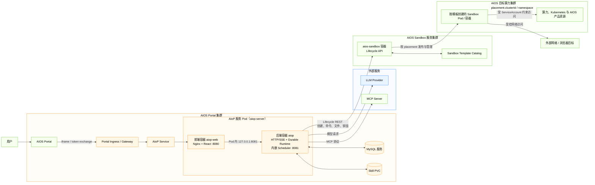
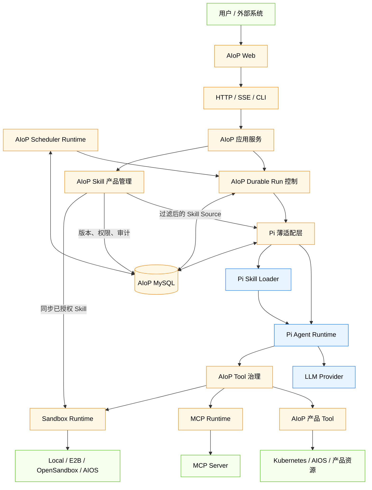

# AIoP 系统总览

本文描述 2026-07-31 移除旧兼容层后的当前架构。当前构建只有 Durable Pi Runtime，不包含 Legacy/LangGraph Kernel、运行时选择器或旧 checkpoint 兼容路径。

## 1. 平台定位

AIoP 是多租户 Agent 平台。HTTP/SSE、CLI 与 Scheduler 共享同一套 Durable Pi Runtime；Web 提供会话、Run Center、Skill、MCP、Sandbox、Scheduler 与管理页面。

系统边界分为三层：

- **Pi 复用**：模型 Provider、Agent loop、Turn、Session Tree、上下文压缩、基础 Tool 执行和 Skill 加载。
- **AIoP 薄适配**：产品输入到 Pi message 的映射、event codec、模型配置映射、SessionStorage、Tool bridge 与 Skill resource 映射。
- **AIoP 自研**：Durable Run、Attempt、Lease/Fencing、Inbox、取消与恢复、Tool Governance、MCP 管理、Sandbox、Scheduler、认证、审计、产品 API 与 MySQL Projection。

## 2. 五个工作区包

| 包 | 当前职责 |
| --- | --- |
| `@aiop/control-contracts` | 身份、Durable Run、Interaction、Tool、Event 与错误契约；无运行时依赖 |
| `@aiop/pi-runtime` | Pi AgentHarness/Session 适配、Durable Run、Tool Governance、Memory/MySQL Store 与装配 |
| `@aiop/mcp-runtime` | MCP client、连接管理、租户/actor 作用域、凭据解析与 Tool 映射 |
| `@aiop/sandbox-runtime` | Local/E2B/OpenSandbox/AIOS 生命周期、Profile、Warm Pool、Desktop 与 Tool adapter |
| `@aiop/scheduler-runtime` | Cron、Fire、领取租约、Run 绑定、过期恢复与 MySQL Store |

应用层位于 `src/`：`src/runtime.ts` 是 composition root；`src/server/` 提供 API；`src/agent/` 提供产品投影和 Run Center；`src/skill/` 提供产品目录与治理；`src/tools/` 提供 AIoP 产品工具；`src/scheduler/` 将应用配置接到 scheduler package。

### 2.1 带职责注释的目录树

```text
aiop/
├── src/                         # 产品应用层：入口、装配、HTTP、身份、产品治理
│   ├── index.ts                 # serve / scheduler / seed-admin / CLI 进程入口
│   ├── runtime.ts               # Composition Root，选择并连接具体实现
│   ├── server/                  # HTTP/SSE、认证请求上下文、下载与 Run API
│   ├── agent/                   # Run Center、产品投影、规则、Interaction 与工具注册
│   ├── tools/                   # AIoP 内置工具及产品治理适配
│   ├── skill/                   # Skill 导入、审核、可见性、凭据与 Sandbox 同步
│   ├── scheduler/               # scheduler-runtime 的产品装配与进程循环
│   ├── db/                      # 产品 Store、Memory/MySQL 与 baseline migration
│   └── auth/                    # Local、OIDC、AIOS 与 RBAC
├── packages/
│   ├── control-contracts/       # 跨包控制契约，不实现执行流程
│   ├── pi-runtime/              # Durable Run、Pi adapter、Tool Governance 与 Store
│   ├── mcp-runtime/             # MCP 连接、作用域、重连与 Tool 映射
│   ├── sandbox-runtime/         # Provider、生命周期、Profile、Desktop 与 Tool adapter
│   └── scheduler-runtime/       # Cron Fire、claim、Run 绑定与恢复
├── web/src/                     # React 控制台，通过 HTTP/SSE 使用产品 API
├── tests/                       # 契约、运行时、HTTP、存储、工具与前端回归
└── deploy/                      # staging、通用 Kubernetes 与 OpenSandbox 资源
```

依赖方向是“根产品层依赖工作区包”，工作区包不得反向 import `src/`。`control-contracts` 是共享语言，不依赖任何具体运行时。

## 3. 架构图

### 3.1 系统架构图

系统架构图只描述部署单元、集群边界和跨系统网络调用，不展开后端程序内部模块。AIoP 直接部署在 AIOS Portal 集群，通过 AIOS Sandbox 服务把 Sandbox 工作负载发布到目标算力集群。下图以 AIOS Lifecycle 生产集成为主；通用 Kubernetes 清单默认连接 OpenSandbox，二者位于同一个 Sandbox Provider 边界。



AIoP 的 `aiop-server` Deployment 位于 AIOS Portal 集群，通用清单默认运行 2 个副本。`aiop-web` 与 `aiop` 部署在同一个 Pod，Nginx 通过 `127.0.0.1:8081` 代理 API/SSE，Scheduler 内嵌在后端进程。AIOS Lifecycle 调用携带平台配置的固定 `clusterId/namespace` 和已授权模板 ID；Sandbox 实例由 `aios-sandbox` 侧发布到目标算力集群，AIoP 不直接创建目标集群中的 Pod。通用清单默认使用 OpenSandbox，其控制服务承担相同的创建、命令和销毁边界。

### 3.2 程序架构图

程序架构图只描述 AIoP 程序内的大模块与主要调用链，不展开文件、类或 Provider 实现。箭头表示运行时调用或数据访问，指向 Store 的箭头表示持久化读写。



| 模块 | 负责 | 是否自研 |
| --- | --- | --- |
| AIoP Web 与应用服务 | Web 页面、HTTP/SSE/CLI 接入、认证、产品 API、Run Center 和运行时装配 | **部分自研。** 产品页面和服务自研；复用 React、Node.js 与 Nginx |
| Scheduler Runtime | Cron Fire、Run 绑定、领取租约和过期恢复 | **是。** 调度一致性与 Durable Run 绑定属于 AIoP 控制面 |
| Durable Run 与 Pi 薄适配 | Run/Attempt/Turn、lease/fencing、Session、事件、取消和恢复 | **部分自研。** 复用 Pi 0.82.1 的 AgentHarness/Session，自研 durable 与持久化适配 |
| Tool 治理与产品 Tool | capability、Policy、Approval、Ledger、Audit、并发和真实工具分发 | **是。** 平台必须掌握权限、副作用与恢复责任 |
| Skill 产品管理 | 导入、审核、共享、Pi resource 投影和 Sandbox 同步 | **部分自研。** 复用 Pi Skill Loader，自研产品治理与租户边界 |
| MCP Runtime | MCP 连接、作用域、重连、凭据解析和 Tool 映射 | **部分自研。** 复用 MCP SDK 1.29.0，自研多租户与治理接入 |
| Sandbox Runtime | Local/E2B/OpenSandbox/AIOS Provider、生命周期、Profile、Desktop 和 Tool adapter | **部分自研。** 复用外部 Sandbox 基础设施，自研统一契约和控制层 |
| Store 与 MySQL | 产品 Store、Durable Store、Pi SessionStorage、Scheduler Store 与事务/fencing | **部分自研。** 数据模型和一致性自研；复用 MySQL、Kysely 与 mysql2 |

### 3.3 调用关系与箭头含义

- `Web → HTTP/SSE` 是网络调用；浏览器不直接依赖工作区包。
- `HTTP/CLI → 应用服务 → Durable Run` 与 `Scheduler → Durable Run` 是两类运行时入口。
- `Durable Run Manager → Pi Adapter` 是控制面调用：前者管理跨请求生命周期，后者管理会话内 Agent loop。
- `Pi Agent Runtime → Tool Governance → 产品 Tool/MCP/Sandbox` 是受治理的 Tool 执行链，不允许直接旁路。
- 指向 Store 的箭头是数据持久化；Store 不会反向驱动 Agent loop。
- 指向外部系统的箭头跨越信任边界，返回值必须经过裁剪、校验或治理后才能持久化和展示。

Pi Session Tree 是会话内上下文事实源；AIoP MySQL 是产品 Run、跨进程协调、治理记录和兼容查询事实源。`src/agent/projections.ts` 只从已提交 Pi leaf 重建产品消息视图。

## 4. 端到端请求路径

以“用户从 Web 发起一条需要 Sandbox Tool 的消息”为例：

1. `web/src/` 通过 `POST /v1/agent` 发送认证请求，`src/server/http.ts` 从 Token 构建可信 tenant/actor/role。
2. HTTP handler 调用 `DurableRunRuntime.run()`；`packages/pi-runtime/src/run/manager.ts` 创建 Run、claim Attempt 并启动 lease heartbeat。
3. `packages/pi-runtime/src/pi/agent.ts` 创建或打开 Pi Session，由 `AgentHarness` 调用模型。
4. 模型产生 Sandbox Tool Call 后，调用先进入 `packages/pi-runtime/src/tools/governance.ts`，完成 capability、Policy、Approval、Ledger、并发和审计检查。
5. 通过治理的调用才进入 `packages/sandbox-runtime/src/tool-adapter.ts` 和具体 Provider；返回结果重新进入 Pi Session。
6. `packages/pi-runtime/src/pi/event-codec.ts` 将 Harness 事件裁剪为 durable event；Turn commit 原子写入 Run/Interaction/Ledger/Event，并推进 committed Pi leaf。
7. HTTP 将 live event 投影为 SSE；`src/agent/projections.ts` 只从 committed leaf 重建产品消息。SSE 断开不会自动取消 Run。

## 5. 外部系统与信任边界

- 客户端输入、模型输出、MCP 结果和 Sandbox 输出都不是授权依据。
- tenant、actor、role、Run ownership 与 Tool capability 由服务端上下文和持久化状态决定。
- Secret 只通过批准的 Secret 管理流程提供；ConfigMap、文档、日志、命令参数和镜像不得携带凭据。
- 非幂等 Tool 出现未知结果时进入 `recovery_required`，不能自动重放。

## 6. 真实入口

- Runtime 装配：`src/runtime.ts`
- Durable Pi：`packages/pi-runtime/src/run/`
- Pi 适配：`packages/pi-runtime/src/pi/`
- 产品 Tool：`src/tools/`
- 产品 Skill：`src/skill/`
- API：`src/server/http.ts`
- 数据库：`src/db/` 与 `src/db/migrations/`
- 测试环境：`deploy/dev-k8s/`
- 构建、部署、回滚：`Makefile`
