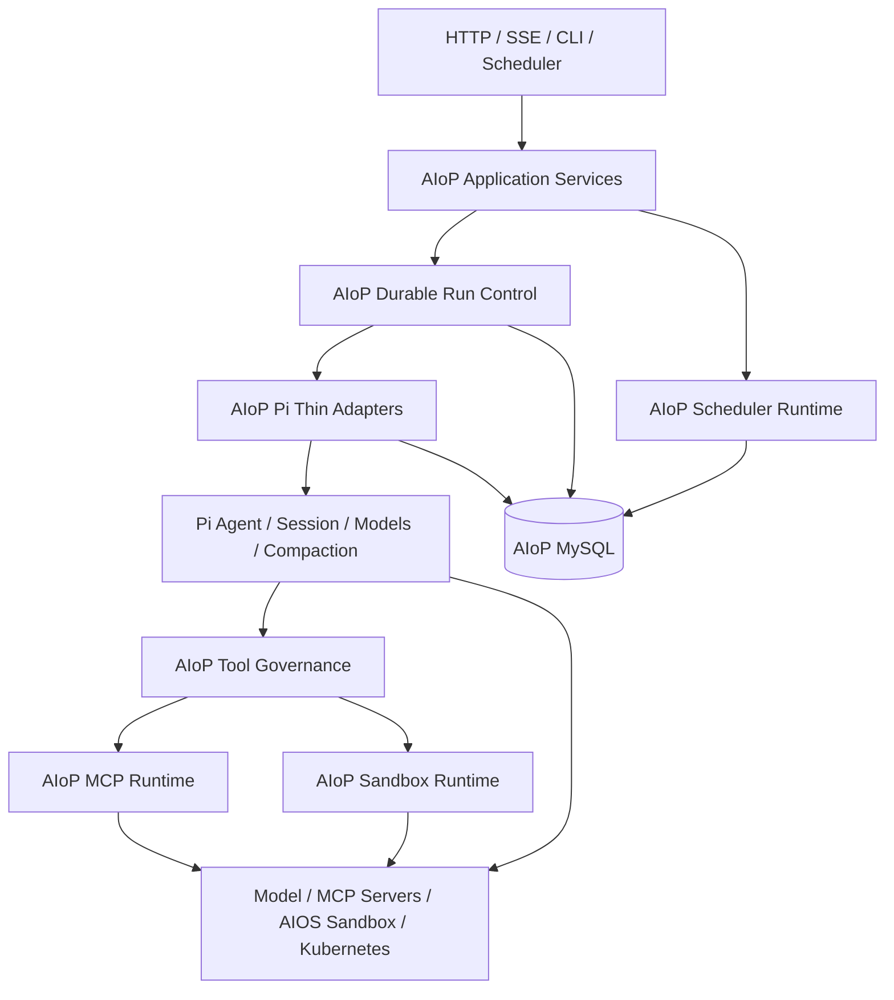

# AIoP 系统总览

本文描述 2026-07-29 完成 Pi-first runtime 收敛后的当前架构。历史方案只用于理解迁移背景，不能作为源码路径、部署命令或运行行为的依据。

## 1. 平台定位

AIoP 是多租户 Agent 平台。HTTP/SSE、CLI 与 Scheduler 共享同一套 Durable Pi Runtime；Web 提供会话、Run Center、Skill、MCP、Sandbox、Scheduler 与管理页面。

系统边界分为三层：

- **Pi 复用**：模型 Provider、Agent loop、Turn、Session Tree、上下文压缩、基础 Tool 执行和 Skill 加载。
- **AIoP 薄适配**：Pi message/event codec、模型配置映射、SessionStorage、Tool bridge、Skill prompt 映射。
- **AIoP 自研**：Durable Run、Attempt、Lease/Fencing、Inbox、取消与恢复、Tool Governance、MCP 管理、Sandbox、Scheduler、认证、审计、产品 API 与 MySQL Projection。

## 2. 五包架构

| 包 | 当前职责 |
| --- | --- |
| `packages/control-contracts` | 身份、Run、Interaction、Tool、Event 与错误契约；不包含执行引擎 |
| `packages/pi-runtime` | Pi 薄适配、Durable Run、Tool Governance、Memory/MySQL Store 与运行时装配 |
| `packages/mcp-runtime` | MCP client、连接管理、租户可见性、凭据解析与 Tool 映射 |
| `packages/sandbox-runtime` | Local/E2B/OpenSandbox/AIOS 生命周期、Profile、Warm Pool、Desktop 与 Tool adapter |
| `packages/scheduler-runtime` | Cron、Fire、领取租约、Run dispatch、失败恢复与 MySQL Store |

应用层位于 `src/`：`src/runtime.ts` 是 composition root；`src/server/` 提供 API；`src/agent/` 提供产品投影和 Run Center；`src/skill/` 提供产品目录与治理；`src/tools/` 提供 AIoP 产品工具；`src/scheduler/` 将应用配置接到 scheduler package。

## 3. 当前组件图

Pi Session Tree 是会话内上下文事实源；AIoP MySQL 是产品 Run、跨进程协调、治理记录和兼容查询事实源。`src/agent/projections.ts` 只从已提交 Pi leaf 重建产品消息视图。

## 4. 主要请求路径

1. `src/index.ts` 启动 HTTP、CLI 或 Scheduler。
2. `src/runtime.ts` 创建 Store、Durable Pi Runtime、Tool Registry、MCP、Sandbox、Skill 和 Auth。
3. HTTP/CLI/Scheduler 通过 `packages/pi-runtime/src/run/manager.ts` 创建或恢复 Run。
4. `packages/pi-runtime/src/pi/agent.ts` 调用 Pi 公开 API；codec 位于同包 `pi/` 目录。
5. Tool call 先经过 `packages/pi-runtime/src/tools/governance.ts`，再进入 AIoP、MCP 或 Sandbox adapter。
6. Turn commit 同时推进 Durable Run 水位线和已提交 Pi leaf；产品消息随后投影。

## 5. 外部系统与信任边界

- 客户端输入、模型输出、MCP 结果和 Sandbox 输出都不是授权依据。
- tenant、actor、role、Run ownership 与 Tool capability 由服务端上下文和持久化状态决定。
- Secret 只通过批准的 Secret 管理流程提供；ConfigMap、文档、日志、命令参数和镜像不得携带凭据。
- 非幂等 Tool 出现未知结果时进入 `recovery_required`，不能自动重放。

## 6. 真实入口

- Runtime 装配：`src/runtime.ts`
- Durable Pi：`packages/pi-runtime/src/run/`
- Pi 适配：`packages/pi-runtime/src/pi/`
- 产品 Tool：`src/tools/`
- 产品 Skill：`src/skill/`
- API：`src/server/http.ts`
- 数据库：`src/db/` 与 `src/db/migrations/`
- 测试环境：`deploy/dev-k8s/`
- 构建、部署、回滚：`Makefile`
