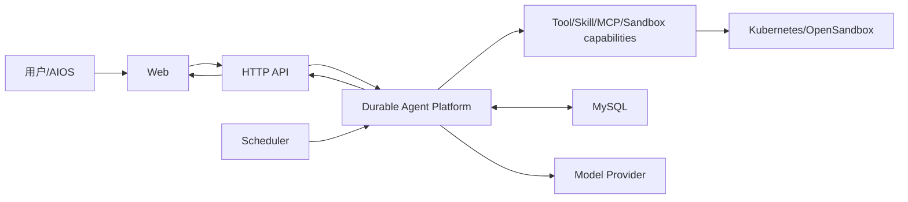
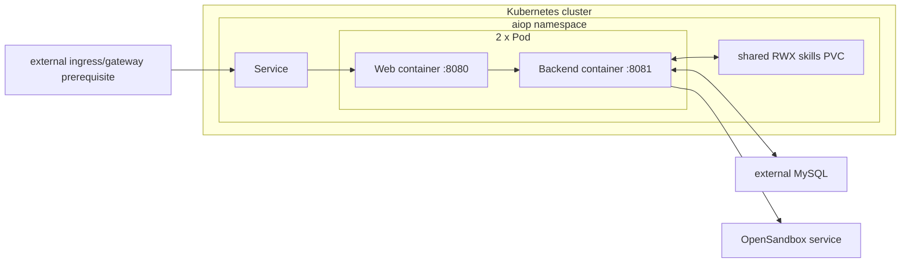
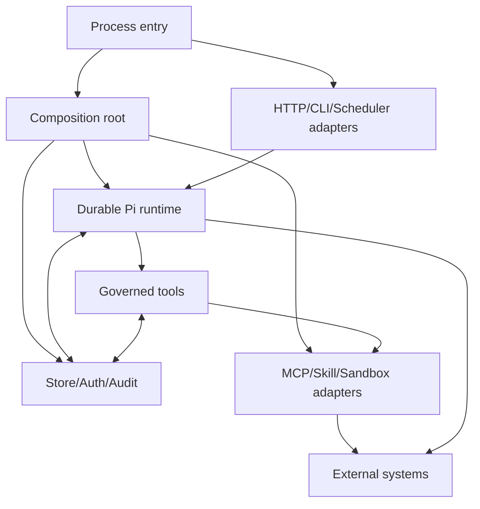
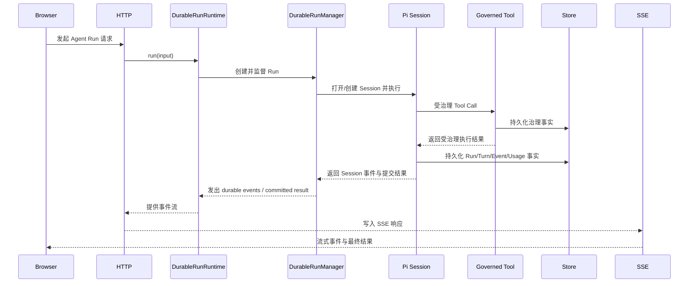

# AIoP 系统总览

> 状态：当前设计
> 验证基线：`b5425a0d2ae3ddc23ada4d3184d4a95e3a717bae`
> 最后核对：2026-08-03
> 适用范围：`pi-agent-platform-integration` 当前实现

## 1. 背景与系统边界

AIoP 后端是运行于 Node.js 的 TypeScript 模块化单体，`src/index.ts` 提供 HTTP、CLI 和 Scheduler 进程入口，`src/runtime.ts` 是 Composition Root。前端是 `web/` 下独立构建的 React/Vite 工程，通过 HTTP/SSE 使用后端能力。

仓库包含五个版本为 `0.1.0-preview.1` 的 `@aiop/*` workspace 发布边界：

- `@aiop/control-contracts`：跨包控制契约。
- `@aiop/pi-runtime`：Durable Pi Run、Pi Session 与治理桥接。
- `@aiop/mcp-runtime`：MCP 连接和 Tool adapter。
- `@aiop/sandbox-runtime`：Local、E2B、OpenSandbox、AIOS 等 Sandbox adapter。
- `@aiop/scheduler-runtime`：Cron、Scheduler Fire、claim 和 Run 绑定。

当前生产 assembly/manager 是 **Pi-only Agent runtime**，不存在运行时 kernel 选择开关；控制契约仍保留可扩展的 kernel 字段形状，不代表当前支持其他内核。生产/通用 Kubernetes 与生产 Scheduler 以 MySQL `MysqlStore` 为持久化前提；未配置 `MYSQL_HOST` 时应用可回退到进程重启即丢失的 `MemoryStore`。证据见 `src/runtime.ts`、`src/db/index.ts`、`src/config/mysql.ts`、`src/scheduler/runner.ts`。

外部能力包括 Model Provider、MCP Server、Kubernetes/OpenSandbox，以及可替换的 E2B、Local、AIOS Sandbox Provider。各边界详见 [02 Agent Runtime](./02-agent-runtime.md)、[04 工具、Skill 与 MCP](./04-tools-skills-mcp.md)、[05 Sandbox 与运维](./05-sandbox-and-ops.md)、[06 认证、安全与多租户](./06-auth-security-tenancy.md)、[07 数据与持久化](./07-data-and-persistence.md)、[08 Scheduler](./08-scheduler.md)、[09 HTTP API 与 Web](./09-api-and-web.md)、[10 部署与可观测性](./10-deployment-observability.md)。

## 2. 三层架构

### 2.1 系统架构图

该图只表达用户到平台及外部能力的系统关系，不表示部署对象或源码结构。



系统事实：HTTP、CLI、Scheduler 的 **Agent Run entries** 共享 `DurableRunRuntime`；直接 Tool、Sandbox、Browser 等 HTTP 路由不属于统一 Agent Run 入口。`Pi Session Tree` 是 Durable Pi 的 context/commit source；成功 Pi Run 后可重建 Web 的 product session projection，但 idle session append 仍可直接写产品消息。证据见 `src/index.ts`、`src/server/http.ts`、`src/runtime.ts`、`src/agent/projections.ts`。

### 2.2 通用部署架构图

该图对应 `deploy/k8s/` 的通用清单，不等同于 `deploy/dev-k8s/` 的单副本 NodePort 开发拓扑。



通用 Deployment 声明 2 replicas，每个 Pod 包含 Web `:8080` 和 Backend `:8081`；ClusterIP Service 只转发到 Web，skills PVC 为 RWX，MySQL 地址来自 Secret，仓库通用清单未提供 Ingress。2 replicas 是部署事实，不足以证明端到端高可用、SLA、故障转移或 RTO/RPO。证据见 `deploy/k8s/deployment-server.yaml`、`deploy/k8s/service.yaml`、`deploy/k8s/pvc-skills.yaml`、`deploy/k8s/secret.example.yaml`。

### 2.3 程序架构图

该图表达模块依赖方向；工作区包不应反向依赖根目录产品层。



| 模块 | 负责 | 是否自研 |
| --- | --- | --- |
| Process entry | 启动 HTTP、CLI、独立或内嵌 Scheduler、管理进程生命周期；入口为 `src/index.ts` | **自研产品入口。** 复用 Node.js 进程模型；命令形态可调整但不承载 durable 语义 |
| Composition root | 读取配置，选择 Store、认证、模型、五个 workspace runtime 和具体 Adapter；入口为 `src/runtime.ts` | **自研装配。** 复用各 workspace 与第三方 SDK；Adapter 可按配置替换 |
| HTTP/CLI/Scheduler adapters | 将网络、命令行和 Scheduler Fire 转为共享 `DurableRunRuntime` 调用；见 `src/server/http.ts`、`src/index.ts`、`src/scheduler/runner.ts` | **自研适配。** HTTP/SSE、CLI 与调度触发可独立演进，不复制执行引擎 |
| Durable Pi runtime | 实现 `DurableRunRuntime`/`DurableRunManager`、Run/Attempt/Turn、lease/fencing、取消、提交与已证实的恢复路径；见 `packages/pi-runtime/src/run/`、`packages/pi-runtime/src/pi/` | **部分自研。** 复用 Pi Core/Pi AI 的 AgentHarness、Session 和 agent loop；自研 durable、多租户与持久化边界 |
| Governed tools | capability、策略、Interaction、fenced ledger、并发和审计，输出 `result`/`waiting`/`recovery_required`；见 `src/tools/governance.ts`、`packages/pi-runtime/src/tools/` | **自研治理。** 真实工具实现与 Adapter 可替换；治理链不能被旁路 |
| MCP/Skill/Sandbox adapters | MCP 连接与重连、Skill 产品治理和 Pi resource 映射、Sandbox Provider 生命周期与 Tool adapter | **部分自研。** 复用 MCP SDK、Pi Skill 能力、OpenSandbox/E2B；Local/OpenSandbox/E2B/AIOS 为可替换 Adapter |
| Store/Auth/Audit | MySQL/Memory Store、事务和投影、Local/OIDC/AIOS 认证、RBAC 与审计；见 `src/db/`、`src/auth/`、`src/audit/` | **部分自研。** 数据模型和安全边界自研；复用 MySQL、Kysely、mysql2、OIDC/JWT 组件 |
| External systems | Model Provider、MCP Server、MySQL、Kubernetes/OpenSandbox、E2B、AIOS 等平台能力 | **非自研系统。** AIoP 通过稳定 Adapter 集成；可替换性受协议、凭据和产品语义约束 |

## 3. 全量目录树

以下是本设计集唯一全量目录树；覆盖实际一级目录和关键二级职责，不枚举生成依赖目录。

```text
aiop/
├── src/                         # Node.js/TypeScript 模块化单体产品层
│   ├── index.ts                 # HTTP、CLI、Scheduler、seed-admin 进程入口
│   ├── runtime.ts               # Composition Root 与 Pi-only runtime 装配
│   ├── agent/                   # Run Center、Interaction、投影、规则与产品桥接
│   ├── auth/                    # Local、OIDC、AIOS、会话与 RBAC
│   ├── audit/                   # 审计事件 sink 与产品审计写入边界
│   ├── config/                  # 配置 schema、加载、MySQL 与集群配置
│   ├── db/                      # Memory/MySQL Store、schema 与 baseline migration
│   ├── llm/                     # Model Provider factory、协议适配、上下文与成本统计
│   ├── net/                     # 外部网络访问的 SSRF 校验边界
│   ├── ops/                     # 运维命令与操作风险分类
│   ├── scheduler/               # scheduler-runtime 产品装配、ticker 与恢复入口
│   ├── security/                # 敏感设置与 Secret 加解密
│   ├── server/                  # HTTP/SSE、请求上下文与下载
│   ├── skill/                   # Skill 导入、治理、凭据、可见性与 Sandbox 同步
│   └── tools/                   # 产品 Tool、Governed Tool Execution 与导出
├── packages/                    # 五个 @aiop/* workspace 发布边界
│   ├── control-contracts/       # Run、Tool、Interaction、Event、身份与错误契约
│   ├── pi-runtime/              # Durable Pi runtime、Session、Tool bridge 与 Store
│   ├── mcp-runtime/             # MCP client、作用域、重连与 Tool adapter
│   ├── sandbox-runtime/         # Sandbox Provider、Generation、Desktop 与 Tool adapter
│   └── scheduler-runtime/       # Cron、Scheduler Fire、claim、绑定与 Store
├── web/                         # 独立 React/Vite Web 工程及 Nginx 容器配置
│   └── src/                     # 页面、组件、API/SSE 客户端和前端状态
├── skills/                      # 内置/导入 Skill 资源、脚本与参考材料
│   └── aios-request/            # AIOS 请求与产品操作 Skill 集
├── deploy/                      # 部署清单与 Sandbox 镜像/资源
│   ├── k8s/                     # 通用 2 副本、外部 MySQL、RWX skills 部署
│   ├── dev-k8s/                 # 单副本 NodePort、仓库内 MySQL/Dex 开发拓扑
│   └── opensandbox/             # OpenSandbox 模板、镜像、ServiceAccount 与说明
├── tests/                       # 契约、运行时、HTTP、存储、调度、Sandbox 与前端测试
│   └── contracts/               # 工作区契约、发布面和旧兼容移除约束
├── scripts/                     # 构建、验证、冒烟、基准和辅助服务脚本
├── docs/                        # 当前设计、操作手册、公共 API snapshot 与历史记录
│   ├── design/                  # 当前设计文档（01～13；旧第 12 篇已删除）
│   │   ├── 12-http-api-reference.md # HTTP API 字段级参考
│   │   └── 13-configuration-reference.md # 配置字段级参考
│   ├── guide/                   # 开发者代码走读
│   ├── public-api/              # generated 公共 API snapshot
│   └── superpowers/             # historical specs/plans
└── ui-design/                   # UI 设计规范与 AIOS 设计系统资料
```

## 4. 技术选型

版本由 `package-lock.json`、`web/package-lock.json`、包 manifest 或 Dockerfile 核对；npm 依赖的 License 由对应 lockfile 核对，Node.js License 未在本基线核实。Star 不作为本基线事实。

| 技术 | 锁定版本 | License | Star | 选择与边界 |
| --- | --- | --- | --- | --- |
| Node.js | `>=22.19.0`；image Node `24` | 未核实（本基线） | 未核实（2026-08-03） | 后端和前端构建运行基线；镜像见根目录及 `web/Dockerfile` |
| TypeScript | `6.0.3` | Apache-2.0 | 未核实（2026-08-03） | 后端与 workspace 类型系统；Web 自身 manifest 仍为 TypeScript 5.9.x 工具链，不能混称为同一锁定版本 |
| Pi Core / Pi AI | `0.82.1` | MIT | 未核实（2026-08-03） | 复用 AgentHarness、Session、agent loop 和模型抽象；AIoP 不复制第二套执行引擎 |
| MCP SDK | `1.29.0` | MIT | 未核实（2026-08-03） | 标准 MCP 协议实现；多租户作用域、治理和重连由 AIoP adapter 补充 |
| Kysely | `0.29.2` | MIT | 未核实（2026-08-03） | 类型化 SQL 与事务接入；不替代 migration 事实源 |
| mysql2 | `3.22.5` | MIT | 未核实（2026-08-03） | MySQL 驱动；MySQL 是生产/通用 K8s 与 Scheduler 的持久化前提 |
| React | `19.2.7` | MIT | 未核实（2026-08-03） | 独立 Web 控制台渲染层 |
| Vite | `7.3.5` | MIT | 未核实（2026-08-03） | Web 开发与构建工具，不进入后端运行时 |
| Mermaid | `11.16.0` | MIT | 未核实（2026-08-03） | Web Markdown 图表渲染能力；设计文档仍应保持标准 Mermaid 语法 |
| OpenSandbox | `0.1.9` | Apache-2.0 | 未核实（2026-08-03） | 通用 Sandbox Provider 集成；外部服务可用性不由 AIoP 进程保证 |
| E2B code-interpreter | `2.6.0` | MIT | 未核实（2026-08-03） | 可替换的托管 Sandbox Adapter，不是通用 K8s 默认拓扑的必选组件 |

## 5. 主请求时序

该时序描述一次进入 Agent Run 主链并产生受治理工具调用的请求。等待、恢复和 interaction-specific resume 的细节见 [02 Agent Runtime](./02-agent-runtime.md) 与 [09 HTTP API 与 Web](./09-api-and-web.md)。



`ToolExecutionOutcome` 仅有 `result`、`waiting`、`recovery_required` 三类。已证实的恢复路径是 Scheduler Fire 的 bound Run recovery 和 interaction-specific HTTP resume；没有通用 expired-run scanner。Hook 配置与实现存在，但当前源码未显示其接入 Durable Tool 主链，因此本图不声明 Hook 必经。

## 6. 关键事实与限制

- `MysqlStore` 是生产持久化方案；`MemoryStore` 仅是未配置 MySQL 时的易失回退，见 `src/db/index.ts`、`src/db/memory.ts`、`src/db/mysql.ts`。
- `/healthz` 与 `/readyz` 当前都直接返回 `{ ok: true }`，`readyz` 不验证 MySQL、模型或 Sandbox，不能作为依赖就绪证明，见 `src/server/http.ts`。
- 通用 K8s 的 2 replicas、RWX skills PVC 和外部 MySQL 只表明多副本部署意图；HA、SSE 协调、Scheduler 多副本正确性及灾备指标仍需独立设计和演练，见 [10 部署与可观测性](./10-deployment-observability.md) 与 [11 演进路线](./11-evolution-roadmap.md)。
- 认证、租户、Tool capability 和审计边界见 [06 认证、安全与多租户](./06-auth-security-tenancy.md)；数据模型与投影边界见 [07 数据与持久化](./07-data-and-persistence.md)。
