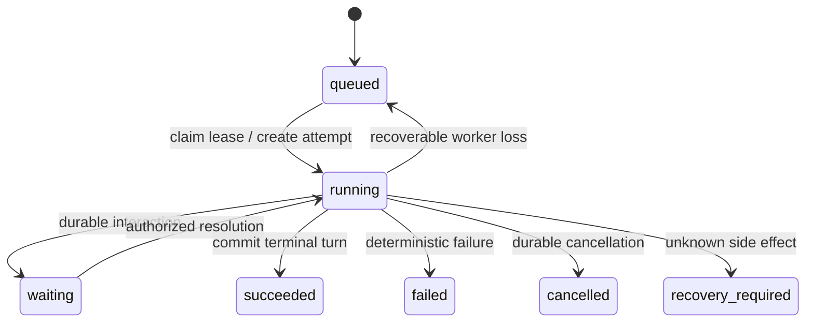

# Agent Runtime 设计

## 1. 当前结论

AIoP 当前只有一条 Agent 执行路径：Durable Run 包装 Pi。Pi 是会话内 Agent loop 和 Session 的事实源，AIoP 不维护第二套 Agent loop，也不存在运行时 Kernel 选择。

| 层次 | 所有权 | 实现 |
| --- | --- | --- |
| Model stream、Agent loop、Turn、Session、Compaction | Pi 复用 | `@earendil-works/pi-agent-core`、`@earendil-works/pi-ai` |
| Agent/Session/Codec/Tool bridge | AIoP 薄适配 | `packages/pi-runtime/src/pi/` |
| Run、Attempt、Lease、Turn commit、Inbox、取消、恢复 | AIoP 自研 | `packages/pi-runtime/src/run/` |
| Tool policy、approval、ledger、audit、并发 | AIoP 自研 | `packages/pi-runtime/src/tools/` |
| Memory/MySQL product store 与 Pi SessionStorage | AIoP 自研 | `packages/pi-runtime/src/store/` |

## 2. Durable Run 状态流

`packages/pi-runtime/src/run/manager.ts` 负责主流程；`attempt.ts`、`lease.ts`、`cancellation.ts`、`inbox.ts`、`limits.ts`、`recovery.ts` 分别封装状态边界。Memory 与 MySQL 装配位于 `memory-assembly.ts` 和 `mysql-assembly.ts`。

## 3. Turn 与 Session 提交

Pi Session 可以产生未提交分支。AIoP 只有在 Durable Turn 提交成功后才推进 `committed_leaf_id`：

1. Pi 在当前 Session leaf 上执行 Turn。
2. Tool Governance 记录审批、ledger 和审计结果。
3. Durable Store 以 lease token/fencing 校验所有权。
4. Turn commit 写入 Pi session id、leaf id 与 entry sequence。
5. `src/agent/projections.ts` 从 committed leaf 重建产品 message projection。

失租、取消或提交冲突时不能发布终态，也不能把未提交 Pi 分支投影为产品历史。

## 4. Append、steer 与 follow-up

- 同 Worker 的活跃 Run 可使用 Pi `steer()` 或 `followUp()`。
- 跨 Worker 消息写入 `agent_run_inbox_messages`，由持有 lease 的 Attempt 领取。
- Inbox 使用 idempotency key、sequence、claim token 和过期时间；消息消费凭证与 Pi Session entry 对账。
- Run 终态或 append cutoff 后拒绝新消息。

## 5. Tool 副作用与恢复

基础 Tool schema 校验和执行事件由 Pi 提供。AIoP wrapper 在调用前后增加：

- tenant/actor capability 与产品规则；
- approval/question/plan Interaction；
- 幂等键、Tool Ledger 和结果摘要；
- tenant/tool/resource 并发限制；
- 审计与敏感字段裁剪。

可安全重试的调用可恢复执行；非幂等调用只有在已持久化确定结果时才能复用，否则进入 `recovery_required`。

## 6. 并发与 fencing

- 同一 Run 只有持有当前 lease token 的 Attempt 能提交 Turn 或终态。
- 旧 supervisor、旧 Attempt、过期 transaction context 和迟到 Tool result 都必须被拒绝。
- Memory Store 的 transaction overlay 与 MySQL transaction 保持合同一致；嵌套事务只有在父上下文仍 active 时才能合并。
- 模型并发位于 `packages/pi-runtime/src/model/concurrency.ts`；Tool 并发位于 `packages/pi-runtime/src/tools/concurrency.ts`。

## 7. 入口与测试

- 应用装配：`src/runtime.ts`
- HTTP Run/append/cancel/recover：`src/server/http.ts`
- Run Center：`src/agent/run-center.ts`
- Durable tests：`tests/pi-runtime/durable-run.test.ts`、`tests/pi-runtime/recovery.test.ts`
- Codec/Session tests：`tests/pi-runtime/`
- HTTP tests：`tests/http-agent-runs.test.ts`
