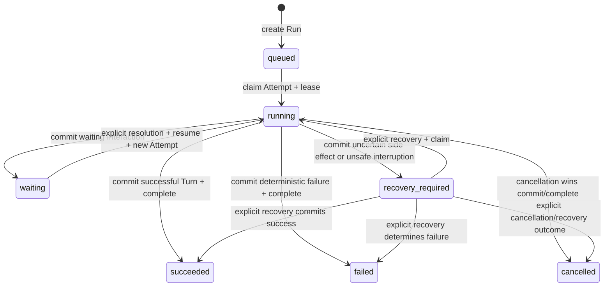
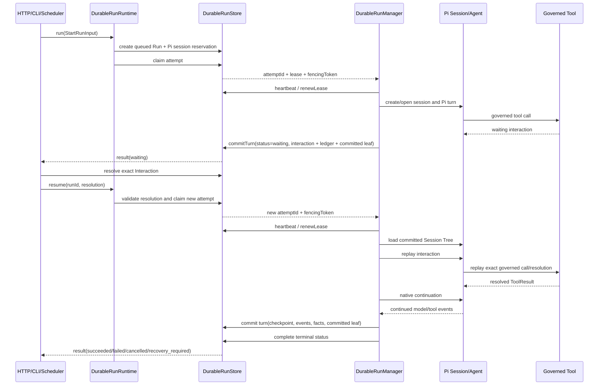

# Agent Runtime 设计

> 状态：当前设计
> 验证基线：`b5425a0d2ae3ddc23ada4d3184d4a95e3a717bae`
> 最后核对：2026-08-03
> 适用范围：`pi-agent-platform-integration` 当前实现

## 1. 边界与核心结论

`DurableRunRuntime` 是 HTTP、CLI、Scheduler 的 Agent Run entries 共享的执行控制契约；直接 Tool、Sandbox、Browser 等 HTTP 路由不属于该入口。`DurableRunManager` 是当前 Durable Run 生命周期、Attempt、Lease/Fencing、等待、恢复和 Turn 提交的 Pi 实现。

控制契约保留可扩展 kernel 形状：`AgentKernelName = 'pi' | (string & {})`，`StartRunInput.kernel?` 仍存在；当前 `DurableRunManager.run()` 创建记录时固定写入 `kernel: 'pi'`、`kernelVersion: '0.82.1'`，应用装配也只创建 Durable Pi runtime。因此应区分：

- **extensible kernel contract**：公共契约允许未来扩展 kernel 名称。
- **Pi-only implementation**：当前 assembly/manager 不提供运行时 kernel 选择能力，也没有其他 kernel 实现。

证据：`packages/control-contracts/src/run.ts`、`packages/pi-runtime/src/run/manager.ts`、`src/runtime.ts`。

| 层次 | 职责 | 当前实现 |
| --- | --- | --- |
| Pi Core / Pi AI | Model stream、Agent loop、Session Tree、原生 continuation、compaction | `@earendil-works/pi-agent-core@0.82.1`、`@earendil-works/pi-ai@0.82.1` |
| Pi adapter | `AgentHarness`/`Session` 封装、事件裁剪、受治理工具桥接、interaction replay | `packages/pi-runtime/src/pi/` |
| Durable control | Run、Attempt、Lease/Fencing、Turn commit、Inbox、取消与显式恢复 | `packages/pi-runtime/src/run/` |
| Durable persistence | RunStore 扩展、Pi session repository、Memory/MySQL 实现 | `packages/pi-runtime/src/store/` |

工具等待与副作用结果见 [04 工具、Skill 与 MCP](./04-tools-skills-mcp.md)，持久化事务与表结构见 [07 数据与持久化](./07-data-and-persistence.md)，HTTP/SSE 与交互恢复入口见 [09 HTTP API 与 Web](./09-api-and-web.md)。

## 2. `DurableRunRuntime` 公共契约

源码接口如下；类型名以当前 `packages/control-contracts/src/run.ts` 为准：

```typescript
export interface DurableRunRuntime {
  run(input: StartRunInput): Promise<RunHandle>;
  resume(input: ResumeRunInput): Promise<RunHandle>;
  cancel(input: CancelRunInput): Promise<void>;
  append(input: AppendRunMessageInput): Promise<void>;
}
```

`RunHandle` 暴露 `runId`、调用时状态快照、`AgentRunEvent` 的 live `AsyncIterable`、当前 Attempt 身份和最终 `result()`。该事件流可在 Pi 执行期间实时发出，只有随后被 `commitTurn()` 接受并写入 Store 的 events 才是 durable event facts；客户端已收到但 Turn 未提交的 live event 不能用于恢复或证明 Run 成功。SSE 写出成功与否同样不决定 Run 是否提交。

### 2.1 方法责任

| 方法 | 身份与授权边界 | 幂等/并发语义 | 取消与恢复语义 | 事务责任 |
| --- | --- | --- | --- | --- |
| `run(StartRunInput)` | 必须携带 `IdentityContext` 与产品 `sessionId`；Store 以 tenant、actor、session 约束活跃 Run。公共 `input` 是 `readonly AgentInputMessage[]`，但当前 manager 只消费 `input[0]`，其余元素被忽略；空数组降级为 `{ role: 'user', text: '' }`，这是当前实现限制 | 显式 `runId` 重复会冲突；同一 tenant/actor/session 同时只允许一个 `queued`/`running`/`waiting` Run。当前实现不消费 `input.kernel` 选择实现，始终持久化 `pi` | `signal` 控制本次调用；durable cancel 仍以 Store 中的 cancellation request 为准 | 先创建 `queued` Run/Pi session reservation，再 claim Attempt；每次 Turn 由 Store 原子提交 events、usage、interaction/tool facts、checkpoint 与 committed leaf；成功 Turn 后另行调用 `complete()` 终态化 |
| `resume(ResumeRunInput)` | 先按 tenant/run 读取 Run；等待态必须提供已持久化且与 Run、Interaction、tool call、resolution 一致的可信 resolution | 同进程重复恢复由 execution guard 拒绝；Store 还以 lease 和 session active-run 约束跨 Worker 竞争 | 显式 claim 可把 `waiting`、`failed`、`recovery_required` 重新置为 `running`；`succeeded`、`cancelled` 不可恢复 | claim 创建新 Attempt/fencing token；从 committed Pi session 打开，interaction replay 后继续，最终仍走 fenced `commitTurn()` |
| `cancel(CancelRunInput)` | 仅允许可管理该 Run 的身份请求取消 | cancellation request 持久化为一次性事实；重复请求保留首次时间/原因 | 本地活跃执行同时触发 AbortController 和 Pi session abort；无活跃 lease 的 `queued`/`waiting` 可直接变为 `cancelled`；提交竞争中 cancellation 优先 | `requestCancellation()` 先写 durable intent；最终状态由 Store 在 lease/fencing 与状态校验下提交 |
| `append(AppendRunMessageInput)` | 身份必须可管理目标 Run；消息带 `mode: steer | follow_up` | `idempotencyKey` 是 durable inbox 去重键；消息有 sequence、claim token、claim expiry 和 consumed marker | 活跃 Attempt 轮询并投递至 Pi；终态或 inbox 关闭后拒绝。若产品 session 没有 appendable Run，HTTP 的 idle append 例外会直接写产品消息，不调用本方法 | `append()` 只负责 durable enqueue；消费由持 lease 的 Attempt claim，并以 Pi custom entry `aiop.inbox_consumed` 对账后确认 |

证据：`packages/control-contracts/src/run.ts`、`packages/pi-runtime/src/run/manager.ts`、`packages/pi-runtime/src/run/inbox.ts`、`packages/pi-runtime/src/store/memory.ts`、`packages/pi-runtime/src/store/mysql.ts`、`src/server/http.ts`。

## 3. Run、Attempt 与提交事实

这些对象不能混为同一个“运行状态”：

| 事实 | 含义 | 关键约束/路径 |
| --- | --- | --- |
| Run status | 产品可见的 Durable Run 生命周期 | `AgentRunStatus` 精确为 `queued`、`running`、`waiting`、`succeeded`、`failed`、`cancelled`、`recovery_required`；`packages/control-contracts/src/run.ts` |
| Attempt | 一次 Worker 对 Run 的执行所有权 | 每次 claim 创建新 `attemptId`；状态为 `running`、`succeeded`、`failed`、`cancelled`、`lost_lease` |
| Lease | 有时效的 Worker 所有权 | `leaseOwner`、`leaseExpiresAt` 由 heartbeat 续租；不是业务终态 |
| Fencing token | 单调递增的提交代次 | Store 对 renew、inbox claim/consume、Turn/终态提交校验 token，拒绝旧 Worker 和迟到结果 |
| Turn commit | 可恢复的最小提交边界 | `CommitTurnInput` 原子携带 checkpoint、events、status、usage、ledger/interaction updates；推进 Pi `committedLeafId` |
| Interaction | `approval`、`question`、`plan` 等等待事实 | resolution 必须与 tenant、run、interaction、kind、toolCallId 和持久化 value 匹配 |
| Tool ledger | 工具副作用及重放判断事实 | 不确定的非幂等结果进入 `recovery_required`，不得自动重放 |

Pi Session 可以先产生 `currentLeafId` 和未提交 entries；只有持有当前 lease/fencing token 的 Attempt 成功执行 `commitTurn()`，才推进 `committedLeafId`。实时 event 可以先输出，但只有 `commitTurn()` 接受的 events 才成为 durable facts，不能用 live stream 替代 Turn commit。对成功路径，Manager 先调用 `commitTurn(status: 'succeeded')`，再单独调用 `Store.complete(status: 'succeeded')`；两次调用不是一个跨方法原子事务，存在 Turn 已提交而 complete 失败、终态化未完成的故障窗口。上下文与 committed path 见 [03 模型与上下文](./03-model-and-context.md)。

## 4. Run 状态机



补充边界：

- `failed -> running` 是当前显式 Run Center 恢复允许的实现路径，但不是后台自动重试。
- `queued` 或 `waiting` 在没有活跃 lease 时可因 durable cancellation 直接进入 `cancelled`。
- lease 过期本身不等于状态自动变为 `queued`，也不会触发全局恢复；它只使后续授权 claim 有机会获得新的 fencing token。
- `waiting` 是已提交 Turn 状态：Store 会释放 lease、完成当前 Attempt，并保留 pending Interaction；恢复必须先得到可信 resolution。
- `recovery_required` 表示结果不确定或需要人工判断，不是“可安全自动重试”的同义词。

已证实的恢复入口只有：Scheduler Fire 的 **bound Run recovery**，以及 interaction-specific/Run Center 发起的 HTTP 显式恢复。当前没有遍历所有过期 Run 并自动恢复的 generic scanner。证据：`src/scheduler/runner.ts`、`src/server/http.ts`、`src/agent/run-center.ts`、`tests/pi-runtime/recovery.test.ts`。

## 5. Run、等待与恢复时序



### 5.1 等待提交

1. Governed Tool 返回 `waiting`，其中包含 reason、Interaction 及可选 ledger updates。
2. Manager 同步 Pi entries，读取当前 leaf，并将 `status: waiting`、`waitingReason`、Interaction、ledger、events、usage 和 Pi checkpoint 一次提交。
3. Store 推进 committed leaf，释放 lease，并把当前 Attempt 记为完成；Run 保持可显式恢复。

### 5.2 resolution 校验与 replay

1. 产品交互服务先将 Interaction 持久化为 `resolved`。
2. `resume()` 再读取并验证 resolution，不能仅相信请求体。
3. `PiAgentSession.replayInteraction()` 从 committed branch 精确定位原 assistant tool call 和紧随其后的 waiting tool result；校验 toolCallId、interaction kind、ledger、capability、schema、参数 digest 及 payload binding。
4. 解析后的 ToolResult 替换 waiting 结果；失败或无法提交到 Pi Session 时进入 fail-safe 路径，而不是伪造继续提示。
5. 设置 `nativeContinuationPending` 后，Pi 以已解析 ToolResult 构建 context，直接执行原生 continuation；不会插入虚构的“继续上次状态”用户消息。

证据：`packages/pi-runtime/src/pi/agent.ts`、`tests/pi-runtime/interaction-replay.test.ts`。

## 6. Lease、fencing、取消与 Inbox

### 6.1 Lease/Fencing

- claim 决定 Worker、Attempt 和 fencing token；heartbeat 只续当前 token 的 lease。
- Store 在 Turn commit、complete、inbox close/claim/consume 等写路径重新校验 lease/token。
- 旧 Attempt、过期 transaction context、旧 supervisor 或迟到 Tool result 即使得到成功值，也不能提交。
- Turn commit 的重复调用语义在两个 Store 实现间并不完全相同，不能承诺比源码更强的冲突检测：
  - `MemoryRunStore.commitTurn()`：若 `turnNo === lastTurnNo` 且序列化后的 checkpoint 相同则直接返回；相同 turnNo 但 checkpoint 不同或更旧 turnNo 会报非单调冲突。它不比较 events、status、usage、Interaction 或 ledger 内容。
  - `MysqlRunStore.commitTurn()`：以 `(tenant_id, run_id, attempt_id, turn_no)` 查询已有 `agent_turn_commits`；只要记录存在就直接返回，不比较 checkpoint 或其他提交内容。
- 因此幂等保证应理解为“Store 对已识别的重复 Turn key/位置短路”，不能泛化为两种 Store 都会检测同 key 下的内容冲突。

### 6.2 取消

- `cancel()` 先持久化 cancellation request，再中止本 Worker 的模型/Pi 执行。
- control pump 即使没有 Pi event，也持续检查跨 Worker cancellation、deadline 与 abort。
- cancellation 与成功提交竞争时，Store 拒绝非 `cancelled` commit；不能在取消已生效后发布成功终态。

### 6.3 Append/Inbox

- `append()` 不直接调用任意 Worker 内存中的 Pi 对象，而是写入 durable inbox。
- 持 lease Attempt 按顺序 claim 消息，调用 `steer()` 或 `followUp()`，并在 Pi Session 写入消费 custom entry。
- Worker 在 Pi 已消费、Store 尚未 ack 时崩溃，下一 Attempt 可通过 committed inbox marker 对账，避免再次投递。
- HTTP 在 session 没有 appendable Run 时允许 **idle append product messages**：直接调用产品 Store 的 `appendMessage()`。这是产品消息写入的明确例外，不属于 Durable Run inbox，也不能据此把 `sessions/messages` 当作 Agent 上下文权威事实。

## 7. 恢复边界与 trade-off

| 决策 | 获得 | 代价/限制 |
| --- | --- | --- |
| 只从 committed Pi leaf 恢复 | 不把失败 Attempt 的未提交分支带入下一 Attempt | live event stream 中已见内容可能未被 `commitTurn()` 接受，因而不进入 durable event facts 或恢复历史 |
| `commitTurn(succeeded)` 后再 `complete(succeeded)` | Turn checkpoint、events 与 committed leaf 可先形成明确提交边界 | 两次 Store 调用不是同一事务；complete 失败时可能留下已提交成功 Turn、但 lease/Attempt/Run 终态化未完成的窗口 |
| 以 lease + fencing 控制提交 | 跨 Worker 故障后拒绝旧执行者写入 | 外部副作用仍需 Tool ledger 判断，fencing 不能撤销已发生的外部操作 |
| waiting 先提交再释放 lease | Interaction、ToolResult 和上下文形成一致恢复点 | 每次 resolution 都产生新 Attempt，必须做严格 replay 校验 |
| 不提供 generic scanner | 避免未知副作用被盲目自动重放 | 非 Scheduler Run 的恢复依赖明确的产品/人工入口 |
| durable inbox + Pi marker 对账 | 支持跨 Worker append 与崩溃后去重 | “exactly once”只限于已定义的持久化协议，不能泛化为所有外部效果恰好一次 |

## 8. 关键源码与测试

- 契约：`packages/control-contracts/src/run.ts`、`packages/control-contracts/src/interaction.ts`、`packages/control-contracts/src/tool.ts`
- Manager：`packages/pi-runtime/src/run/manager.ts`
- Lease/取消/Inbox：`packages/pi-runtime/src/run/lease.ts`、`cancellation.ts`、`inbox.ts`、`recovery.ts`
- Pi replay/continuation：`packages/pi-runtime/src/pi/agent.ts`
- Store：`packages/pi-runtime/src/store/types.ts`、`memory.ts`、`mysql.ts`
- 产品入口：`src/server/http.ts`、`src/agent/run-center.ts`、`src/scheduler/runner.ts`
- 测试：`tests/pi-runtime/durable-run.test.ts`、`recovery.test.ts`、`interaction-replay.test.ts`、`append-message.test.ts`、`tests/http-agent-runs.test.ts`
