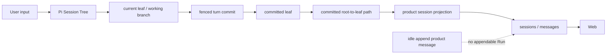

# 模型与上下文设计

> 状态：当前设计
> 验证基线：`b5425a0d2ae3ddc23ada4d3184d4a95e3a717bae`
> 最后核对：2026-08-03
> 适用范围：`pi-agent-platform-integration` 当前实现

## 1. 所有权与能力边界

AIoP 不自建第二套 Agent loop。Durable Pi runtime 复用 Pi Core/Pi AI 的 `AgentHarness`、`Session`、Session Tree、模型流和 compaction；AIoP 负责配置映射、durable session repository、committed leaf、事件裁剪、产品投影、并发与预算边界。

| 能力 | 所有权 | 当前路径 |
| --- | --- | --- |
| Provider 抽象、模型流、retry/stream 语义 | Pi AI/Pi Core | `@earendil-works/pi-ai`、`@earendil-works/pi-agent-core` |
| AIoP 模型配置 schema 与产品 Model adapter | AIoP | `src/llm/factory.ts`、`src/llm/anthropic.ts`、`src/llm/openai.ts` |
| 配置到 Pi `Provider`/`Model` 的映射 | AIoP 薄适配 | `src/runtime.ts`、`packages/pi-runtime/src/pi/models.ts` |
| Agent 输入、Session、事件与原生 continuation | Pi 复用 + AIoP adapter | `packages/pi-runtime/src/pi/agent.ts`、`event-codec.ts` |
| Pi Session Tree 持久化与 committed leaf | AIoP | `packages/pi-runtime/src/store/pi-session-mysql.ts`、`memory.ts`、`mysql.ts` |
| Product session projection | AIoP | `src/agent/projections.ts`、`src/server/http.ts` |
| Compaction | Pi Core；AIoP 仅薄包装/事件投影 | `packages/pi-runtime/src/pi/compaction.ts`、`event-codec.ts` |
| 产品侧 token/image 估算辅助 | AIoP 产品 Store 辅助 | `src/llm/context.ts`、`src/db/memory.ts`、`src/db/mysql.ts` |

Run、Attempt、等待与恢复见 [02 Agent Runtime](./02-agent-runtime.md)，数据表与事务边界见 [07 数据与持久化](./07-data-and-persistence.md)，Web/API 投影使用见 [09 HTTP API 与 Web](./09-api-and-web.md)。

## 2. 模型配置边界

### 2.1 AIoP 当前支持的配置协议

AIoP 配置层的 `ModelConfig.protocol` 精确支持：

```typescript
protocol: 'anthropic' | 'openai';
```

配置还包括 `baseURL`、`apiKey`、模型 id、上下文窗口、保留图片数、reasoning effort 和可选价格。产品侧 `createModel()` 分别创建 Anthropic/OpenAI adapter；Durable Pi assembly 则把协议映射为 Pi API：

- `anthropic` → `anthropic-messages`
- `openai` → `openai-completions`

随后从 Pi builtin providers 取得模板，创建 AIoP 专属 provider id、credential store 和单模型 provider，并交给 Pi `Models`。证据：`src/llm/factory.ts`、`src/runtime.ts`。

### 2.2 不应扩大解释的范围

- 这是 **AIoP 配置层当前支持 Anthropic/OpenAI 协议**，不是 Pi AI 全部 provider/provider API 能力清单。
- Pi 库可能拥有更多 provider；未进入 AIoP 配置 schema 和 assembly 的能力不构成当前产品支持。
- `packages/pi-runtime/src/pi/models.ts` 只导出 Pi 类型与版本常量，并明确不拥有 retry policy；模型调用由 Pi `Models` 驱动。
- AIoP 增加 tenant/model 并发、Run usage/limits、成本投影和产品错误映射，但不复制 Provider-neutral Agent loop。
- API key 经 credential/settings 边界提供，不应写入 Pi Session entries、durable event detail 或产品消息。

## 3. 双事实源模型

这里的“双事实源”是针对不同职责，而不是两个可互换 transcript：

| 数据 | 权威职责 | 当前行为 |
| --- | --- | --- |
| `pi_sessions` / `pi_session_entries` | **Agent 上下文与 commit 的权威事实** | 保存 Session Tree entries、`current_leaf_id`、`committed_leaf_id`；恢复从 committed path 打开 |
| `sessions` / `messages` | **面向产品 Web 的视图** | 成功 Pi Run 后从 committed path 重建；用于产品展示、查询及兼容 DTO |

必须保留一个例外：当 HTTP session 没有 active/appendable Durable Run 时，append endpoint 会直接调用产品 Store 的 `appendMessage()`。因此 `sessions/messages` 通常是 committed Pi Session Tree 的 product session projection，但不是无条件、唯一由 Pi projection 写入；idle append product messages 可以先存在于产品视图。它们不会因此成为 Durable Pi 恢复上下文。

证据：`src/agent/projections.ts`、`src/server/http.ts`、`packages/pi-runtime/src/store/types.ts`、`src/db/migrations/0001_baseline.sql`。

## 4. Pi Session Tree 与 committed path

### 4.1 核心字段

- `pi_sessions.current_leaf_id`：Session 当前工作 leaf，可能包含当前或失败 Attempt 产生的未提交分支。
- `pi_sessions.committed_leaf_id`：最后一次 fenced `commitTurn()` 接受的 leaf，是后续恢复与产品投影基线。
- `pi_session_entries.entry_seq`：同 tenant/session 内稳定递增的持久化序号。
- `pi_session_entries.parent_id` 与 entry JSON：表达树分支、消息、compaction、summary、custom entry 和 leaf movement。
- Turn checkpoint 当前写入 `{ piSessionId, piLeafId }`；Store 在同一 Turn commit 中校验 leaf 存在并推进 committed leaf。

MySQL `PiMysqlSessionStorage` 在普通写入时读取/更新 current leaf；`PiMysqlSessionRepo.open()` 默认以 `openFromCommitted = true` 打开，首次读取 leaf 时返回 committed leaf，首次写入后才转到新的 current leaf。Memory Store 保持同一契约。证据：`packages/pi-runtime/src/store/pi-session-mysql.ts`、`packages/pi-runtime/src/store/memory.ts`、`packages/pi-runtime/src/store/mysql.ts`。

### 4.2 一条输入进入上下文

1. 产品入口提交 `AgentInputMessage`，只允许 user text/image blocks；不由产品层伪造 assistant 或 toolResult。
2. `PiAgentSession` 将输入转换为 Pi user message，交给 `AgentHarness.prompt()`；恢复 interaction 时则先 replay exact ToolResult，再启动 native continuation。
3. Pi Session Tree 保存 user、assistant、thinking、toolCall、toolResult、image、compaction/custom 等原生 entry。
4. `context` hook 在发送模型前清理不应长期进入请求的浏览器预览内容。
5. Manager 同步 entries，并通过 fenced `commitTurn()` 提交 checkpoint；只有此时 committed leaf 才推进。
6. 下一 Attempt 从 committed leaf/path 恢复，而不是从可能污染的 current leaf 恢复。

因此 Pi Session Tree、durable events 与产品 message DTO 是三种视图：

- Session Tree 保存 Agent 可继续执行的结构与分支。
- durable events 保存限长、可审计/流式消费的事件事实，不是完整 transcript。
- product messages 保存 Web 展示投影及 idle append 例外，不是恢复 checkpoint。

## 5. Session Tree projection flow



更精确的数据流是：

```text
User input
  -> Pi session tree entries
  -> current leaf
  -> commitTurn(checkpoint.piLeafId, events, usage, interactions, ledger)
  -> committed leaf
  -> committed root-to-leaf path
  -> projectCommittedPiSession()
  -> replaceMessages() + touchSession()
  -> Web sessions/messages
```

### 5.1 投影触发与算法

HTTP Agent Run 得到 `result.status === 'succeeded'` 后，调用 `projectCommittedPiSession()`：

1. 以 `piSessionStorageId(userId, productSessionId)` 定位 Pi session。
2. 若不存在 `committedLeafId`，不投影。
3. 读取 `committedOnly: true` entries。
4. 从 committed leaf 沿 `parentId` 回溯到根，检测 cycle/缺失 entry，再反转为 root-to-leaf path。
5. 将 message、compaction、branch summary、可展示 custom message 映射为产品 `Msg`。
6. 使用 `replaceMessages()` 整体重建消息，并 `touchSession()` 更新时间。

这意味着 projection 是可重复重建的产品视图，而不是 Pi Session Tree 的写入前置步骤。投影失败会记录 warning，但不能反向改变已经成功提交的 Durable Run。证据：`src/agent/projections.ts`、`src/server/http.ts`。

### 5.2 未提交分支与等待态

- `current_leaf_id` 可以领先于 committed leaf，不能直接用于 Web 历史或下一 Attempt。
- waiting Turn 本身会通过 `commitTurn(status=waiting)` 提交 waiting tool result 和 Interaction，因此恢复能从该 committed waiting leaf 精确 replay。
- 成功 Run 后执行产品投影；当前 HTTP 路径不在 waiting 结果后调用成功投影函数。等待交互的产品展示还依赖 Interaction/Run API，而不能假定所有 waiting tree 内容已刷新到 `messages`。

## 6. Compaction、估算与上下文清理

这些机制位于不同层，目的不同，不能合并为另一个 Agent runtime。

### 6.1 Pi Core compaction

`packages/pi-runtime/src/pi/compaction.ts` 只对 Pi Core 的 `prepareCompaction()` 与 `compact()` 提供薄包装：

- preparation 根据 Session Tree 和 `CompactionSettings` 选择待摘要消息、保留尾部、token 统计和 first kept entry。
- compact 通过 Pi `Models`/`Model` 生成 summary，形成 Pi compaction entry。
- Session storage 的 `getPathToRootOrCompaction()` 理解 compaction/retained tail，用于构造有效路径。
- `EventCodec` 将 compaction lifecycle 投影为限长 durable detail，例如 before/after token、summary 长度和 summarized message 数；不持久化完整 prompt。
- compaction entry 位于 Pi Session Tree 中，只有其所在 leaf 经 Turn commit 后，才进入 committed context 与产品 projection。

compaction summary 是上下文内容，不是 Interaction、审批、审计、Tool ledger 或 Run 状态的事实源。失败恢复边界仍是最后 committed leaf。

### 6.2 产品侧 token/image 估算辅助

`src/llm/context.ts` 提供产品消息 DTO 的辅助逻辑：

- 文本按字符近似估算 token，PNG/JPEG 图片结合像素和 base64 长度估算。
- `compactMessages()` 可保留最近 K 条带图消息、替换旧图、截断超大消息并按预算丢弃旧消息。
- `planCompaction()`/`renderForSummary()` 可规划产品消息摘要输入。
- 当前 Store 在不能读取 Pi Session stats 时，使用 `estimateTokens(listMessages())` 返回 `estimated: true` 的上下文占用；若 Pi session stats 可用，则 projection 返回 `estimated: false`。

这些是产品展示、兼容路径和容量估算辅助；Durable Pi Agent 主链的 Session compaction 仍由 Pi Core 承担。不要把 `src/llm/context.ts` 描述为第二套 Agent loop 或第二个 durable context authority。证据：`src/llm/context.ts`、`src/db/memory.ts`、`src/db/mysql.ts`、`src/agent/projections.ts`、`src/server/http.ts`。

### 6.3 `desktop_stream_url` 大型 data URL 清理

`PiAgentSessionFactory` 注册 `context` hook，`sanitizeBrowserPreviewMessages()` 在模型请求上下文中检查 `desktop_stream_url` 的 toolResult；若文本包含 `data:text/html`，替换为简短说明“浏览器预览已加载到右侧沙箱栏。”。native continuation 也通过 `transformContext` 使用同一清理函数。

该机制：

- 防止大型浏览器 preview data URL 长期反复进入模型上下文。
- 不等于删除 Pi Session Tree 或产品数据库中的原始 entry；它是 model-facing context transformation。
- 不提供通用敏感数据清理器，只处理当前明确的 tool/result 形状。

证据：`packages/pi-runtime/src/pi/agent.ts`、`tests/pi-runtime/pi-agent.test.ts`、`tests/browser.test.ts`。

## 7. 设计 trade-off 与限制

| 决策 | 优点 | 代价/限制 |
| --- | --- | --- |
| Pi Session Tree 作为 Agent context/commit authority | 保留原生 tool/result、branch、compaction 与 continuation 语义 | 产品 DTO 不能独立恢复 Agent，需维护 repository 与 committed leaf 一致性 |
| 产品消息采用 committed path 重建 | 可丢弃失败 Attempt 的未提交分支，投影可重复生成 | Run 成功与 Web projection 刷新不是同一事务；投影失败需单独修复 |
| 保留 idle append 产品写入例外 | 无活跃 Run 时仍可让用户编辑/追加会话 | 产品 messages 不是 Pi Tree 的无条件镜像，后续 Run/投影覆盖语义需谨慎理解 |
| Pi Core compaction + 产品估算辅助并存 | Agent 语义使用原生 compaction，Web 仍能估算容量 | 两层 token 数可能口径不同，必须标记 `estimated`，不能把估算当 provider usage |
| model-facing browser preview 清理 | 显著降低大型 data URL 的上下文污染 | 原始持久化内容未被统一清除，且清理规则是 tool-specific，不是通用 DLP |
| AIoP 配置只暴露两种协议 | 产品支持面明确、映射简单 | 不能自动继承 Pi 的所有 provider；新增协议需同步 schema、assembly、测试和 projection |

## 8. 关键源码与测试

- 模型配置：`src/llm/factory.ts`、`src/llm/anthropic.ts`、`src/llm/openai.ts`、`src/runtime.ts`
- Pi 模型/Agent：`packages/pi-runtime/src/pi/models.ts`、`agent.ts`、`event-codec.ts`
- Pi Session repository：`packages/pi-runtime/src/store/pi-session-mysql.ts`、`types.ts`、`memory.ts`、`mysql.ts`
- 投影：`src/agent/projections.ts`、`src/server/http.ts`
- Compaction/估算：`packages/pi-runtime/src/pi/compaction.ts`、`src/llm/context.ts`
- 测试：`tests/pi-runtime/pi-agent.test.ts`、`mysql-session-storage.test.ts`、`session-projection.test.ts`、`event-codec.test.ts`、`interaction-replay.test.ts`
