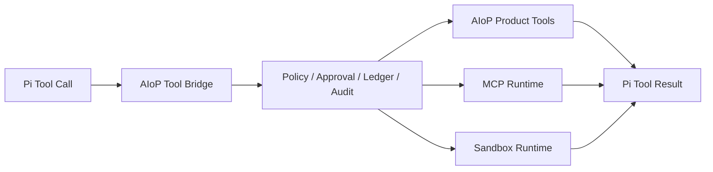

# 工具、Skill 与 MCP 设计

## 1. 统一执行链

Pi 负责参数校验、Tool 事件、基础 dispatch 和输出截断。AIoP 不重复这些基础能力，只在 `packages/pi-runtime/src/tools/` 保留产品治理差异。

## 2. Tool Registry 与治理

- Pi adapter：`packages/pi-runtime/src/pi/tool-bridge.ts`
- 统一 registry：`packages/pi-runtime/src/tools/registry.ts`
- Governance：`packages/pi-runtime/src/tools/governance.ts`
- Policy/Approval/Ledger/Audit：同目录对应文件
- 产品工具：`src/tools/`
- 应用注册：`src/agent/tools.ts` 与 `src/runtime.ts`

每次调用必须绑定 tenant、actor、run、attempt、turn、tool call 和 logical call。模型提供的同名字段不具有授权效力。

## 3. Skill 边界

Pi 复用范围：解析 `SKILL.md`、加载 sourced skills、生成 prompt 摘要和 invocation 格式。

AIoP 自研范围位于 `src/skill/`：

- 产品导入、升级、锁和 digest cache；
- tenant/user 可见性与发布治理；
- Credential 目标与运行期注入；
- Sandbox 文件同步与审计。

Skill 内容不得持久化真实 Credential。Pi loader 只接收已通过 AIoP 可见性检查的来源。

## 4. MCP Runtime

`packages/mcp-runtime` 基于官方 `@modelcontextprotocol/sdk`，负责：

- stdio/HTTP 等 client 连接；
- tenant/actor 维度的 server snapshot；
- 连接重建与过期 actor fencing；
- Credential provider；
- MCP tool 到 Pi Tool 的名称和 schema 映射。

`src/runtime.ts` 从启动配置和持久化租户设置合并 server 配置。单个 MCP Server 失败不能阻断其他 Server；Tool 调用仍经过统一 Governance。

## 5. Approval 与未知副作用

- `approval`、`question`、`plan` 是 Durable Interaction，不是进程内 promise 的唯一事实源。
- resolution 必须匹配 tenant、run、interaction、tool call 和 pending state。
- 只读或确定幂等调用可按策略恢复。
- 非幂等调用在结果未知时进入 `recovery_required`，人工确认后才能继续。

## 6. 测试入口

- `tests/pi-runtime/tool-governance.test.ts`
- `tests/pi-runtime/tool-bridge.test.ts`
- `tests/pi-runtime/tool-sources.test.ts`
- `tests/durable-interaction.test.ts`
- `tests/mcp-runtime/`
- `tests/skill.test.ts`
- `tests/policy.test.ts`、`tests/rules.test.ts`、`tests/hooks.test.ts`
