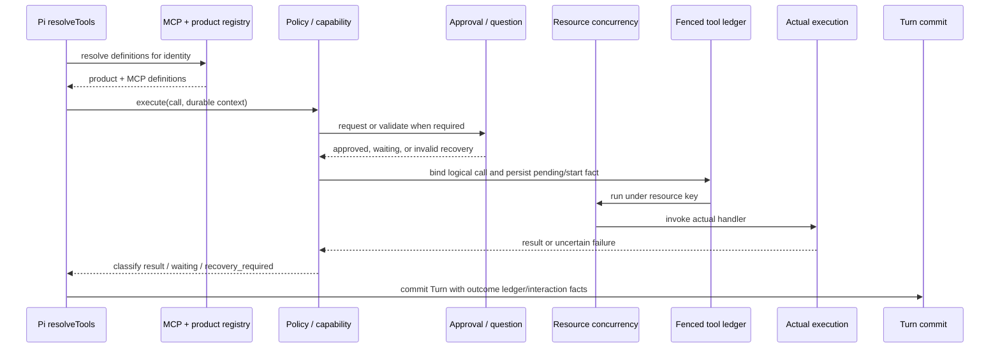
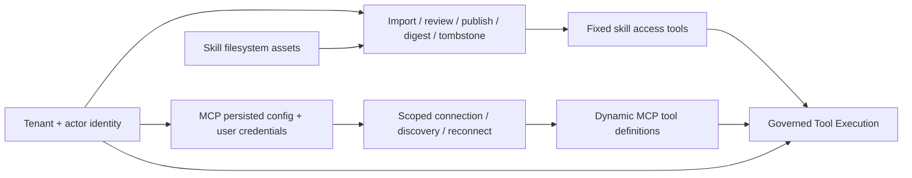

# Tool、Skill 与 MCP 设计

> 状态：当前设计
> 验证基线：`b5425a0d2ae3ddc23ada4d3184d4a95e3a717bae`
> 最后核对：2026-08-03
> 适用范围：`pi-agent-platform-integration` 当前实现

## 1. 设计边界

本章定义 AIoP 扩展能力的三类边界：

- **Tool** 是模型可调用的受治理执行单元；Durable Pi 通过 `ToolRuntime` 获得确定的 outcome 分类语义。
- **Skill** 是文件系统中的知识、指令和附带文件资产，具有导入、审核、发布、可见性与按需读取生命周期。
- **MCP** 是外部 Tool transport，负责按身份建立连接、发现工具并调用远端 Server。

Skill 资产向模型提供知识，由固定注册的 `load_skill`、文件读取和 Sandbox 同步等产品工具访问；Skill 资产本身不会动态变成 Tool definition。MCP discovery 则会产生动态外部工具定义。两类能力进入真实执行时都必须服从当前身份和 Governed Tool Execution，但二者不是同一种 registry，也不共享资产生命周期。

相关安全与租户边界见[认证、安全与多租户](06-auth-security-tenancy.md)，持久事实见[数据与持久化](07-data-and-persistence.md)，Sandbox 工具后端见[Sandbox 与运维](05-sandbox-and-ops.md)。

## 2. `ToolRuntime` 权威契约

当前契约位于 `packages/control-contracts/src/tool.ts`：

```typescript
export interface ToolRuntime {
  execute(call: ToolCall, context: ToolExecutionContext): Promise<ToolExecutionOutcome>;
}

export type ToolExecutionOutcome = (
  | { kind: 'result'; result: ToolResult }
  | { kind: 'waiting'; reason: WaitingReason; interactionId: string }
  | { kind: 'recovery_required'; correlationId?: string; message: string }
) & DurableExecutionFacts;
```

输入字段同样属于契约，不应由模型伪造或从工具参数反推：

- `ToolCall`：`id`、`logicalCallId`、`name`、`arguments`。
- `ToolExecutionContext`：`identity`、`runId`、`attemptId`、`turnNo`，以及可选的 `sessionId`、`interactionResolution`、`signal`。
- `DurableExecutionFacts`：可附带 `ledgerUpdates` 与 `interactionUpdates`，由 Turn 提交路径持久化。

三种 outcome 的语义如下：

| kind | 精确语义 | Durable Run 行为 |
| --- | --- | --- |
| `result` | 执行完成或治理层返回确定错误，携带 `ToolResult` | 结果及附带 facts 可进入 Turn commit |
| `waiting` | 等待 `approval`、`question` 或 `plan` 等 Durable Interaction，携带 `reason` 与 `interactionId` | 当前 Turn 进入等待；恢复时必须绑定原 interaction 和 tool call |
| `recovery_required` | 结果未知、调用身份不一致或恢复绑定无效，携带 `message`，可选外部 `correlationId` | 不自动重放不安全调用，要求恢复决策 |

`ToolResult` 的字段是 `callId`、`content`、可选 `isError` 与 `digest`。`waiting` 并不携带 interaction 对象；持久化 interaction 内容通过 `interactionUpdates` 表达。`recovery_required` 使用 `message`，不是 `reason`。

## 3. Governed Tool Execution

Durable Pi 的 `resolveTools` 在每次运行上下文中取得 MCP definitions，并与产品 registry definitions 合并；随后为当前 tenant、actor、run、attempt、turn 创建受 fenced ledger 约束的 `ToolRuntime`，再桥接为 Pi 可调用工具。



关键不变量：

1. **身份由运行时绑定**：授权身份来自 `ToolExecutionContext.identity`，不是模型参数。
2. **逻辑调用稳定**：ledger 以 tenant、run、`logicalCallId` 识别调用，并校验工具名、参数 digest 与 capability；跨 Attempt 发生变化时进入 `recovery_required`。
3. **能力决定恢复策略**：`read`、`retryable_write`、`non_idempotent_write` 是治理输入。已有非幂等写处于非完成状态时不得自动重放。
4. **交互是持久事实**：approval/question/plan 不是仅存在于内存中的 Promise；resolution 必须匹配 tenant、run、attempt、turn、interaction 与 tool call。
5. **并发按资源治理**：策略可给出 `resourceKey`，`ResourceConcurrencyController` 在真实执行前限流。
6. **账本写入受 fencing 保护**：Durable 主链通过当前 Attempt lease 校验来保护执行前 ledger mutation，过期 Attempt 不得继续提交。
7. **审计是 best-effort，执行 facts 不是**：审计失败不能改写 durable outcome；ledger/interaction updates 则随 Turn commit 保持一致性。

Pi bridge 将 `result` 转换为 Harness tool result；`waiting` 与 `recovery_required` 以可冒泡的 outcome error 暂停正常工具返回，并保留对应 durable facts。

## 4. Hook 当前状态

`HookSchema`、`HooksConfigSchema`、`HookRunner` 实例和 `HookRunner.preTool` 仍存在，支持 command/webhook、工具名匹配、webhook SSRF 检查及 fail-open 行为。

但是，当前 Durable Tool 装配中的 `resolveTools`、`createAIOPToolRuntime` 与 `bridgeDurableGovernedTools` 没有显示 `HookRunner` 被传入或 `preTool` 被调用。因此，当前主链不存在已证实的 Hook 安全控制。现行硬性边界是 policy/capability、Durable Interaction、resource concurrency、fenced ledger 与身份绑定。

若未来接入 Hook，必须明确其位于 policy 前还是后、失败策略、超时、审计和重放语义；在此之前，不应把 Hook 配置等同于已生效的执行拦截。

## 5. Skill：文件系统资产与发布治理

### 5.1 目录与事实源

Skill registry 读取只读内置 roots 与可变产品 root。产品 root 的主要目录层次为：

| 层次 | 典型目录 | 边界 |
| --- | --- | --- |
| 内置 | 配置的 `builtinRoots` | 镜像或只读来源；启停、审核、可见性和删除使用产品 root 下的 governance overlay，不直接改内置文件 |
| 公共 | 默认租户 `_public/<name>`；其他租户 `tenants/<tenantId>/_public/<name>` | 目录记录必须声明 `public`；租户管理员导入落入本租户公共目录 |
| 租户 | `tenants/<tenantId>/...` | 隔离非默认租户的公共与用户资产 |
| 用户 | 默认租户 `users/<userId>/<name>`；其他租户 `tenants/<tenantId>/users/<userId>/<name>` | 上传始终落入当前租户当前用户目录，初始为 private、未审核 |
| 已发布 | `_published/<scope>/<artifactVersion>/<name>` | 仅存在 commit marker 的不可变发布 artifact 才被枚举 |

registry 枚举 authoritative product sidecar，不通过扫描 `SKILL.md` 推导 tenant、owner、review 或 visibility。上传包中的治理字段不受信任，服务端用认证上下文覆盖。

### 5.2 可见性与管理权

可见性首先要求 tenant 命中：记录属于当前 tenant，或 `allowedTenantIds` 包含当前 tenant/`*`；之后再检查 `allowedRoles`。

- `private`：通常仅 owner/submitted user 可见；租户内无 owner 资产可由管理员管理。
- `shared`：通过 tenant 与 role 检查后可见。
- `public`：仍必须经过 tenant allowance 与 role 检查；全局发布通过 `allowedTenantIds=['*']` 表达。
- 未审核资产：同租户管理员可见以完成治理，但不会进入普通可用 Skill 集合。
- 可执行集合还要求 `enabled && reviewed`，且同一查看者范围内名称唯一；不可见资产对调用方等同不存在。

列表、`load_skill`、文件读取和同步到 Sandbox 都重新执行服务端可见性检查，不能依赖提示词或模型遵守边界。

### 5.3 Digest、publication journal 与 tombstone

审核发布采用“复制后计算 digest，再提交可见性”的流程：

1. 将可变上传源复制到 staging。
2. 对 staging 中实际字节计算 SHA-256 content digest；拒绝符号链接。
3. 用版本与 digest 生成不可变 `artifactVersion`，写入产品记录。
4. 写 publication journal 和 source marker。
5. 原子 rename 到发布路径，写 published commit marker；该 marker 是授权可见的 commit point。
6. commit 后把原上传源移动到 publication tombstone，再清理 journal 与 tombstone。

启动或扫描时会 reconcile 遗留 journal：有 commit marker 则完成清理，没有则回滚未提交 artifact。删除普通 Skill 也先 rename 到 tombstone，再删除，避免直接递归删除形成部分可见状态。已发布记录在加载前校验 content digest；不匹配或校验失败的资产被隐藏。内置资产用 source digest/version 绑定 governance overlay，源发生变化时只继承保守限制。

### 5.4 配额与 mutation lock

待审核上传受以下配额控制：用户/租户数量、用户/租户字节数、最小剩余磁盘空间及 staging/tombstone 保留时间。导入并发默认全局 4、单租户 2。

多副本环境通过 `MysqlSkillMutationLock` 使用独占 MySQL connection 上的 `GET_LOCK`/`RELEASE_LOCK`：

- 名称、发布、存储配额和导入槽位使用稳定 advisory lock key。
- 多 key 按排序顺序获取，降低死锁风险。
- connection 死亡会自动释放锁；释放结果不确定时销毁连接，不放回连接池。
- 未提供 MySQL lock 时只退化为进程内串行，不能提供跨 Pod mutation 互斥。因此多副本可变 Skill root 必须同时具备共享文件系统和 MySQL mutation lock。

### 5.5 渐进式加载

`SkillRegistry.summariesFor(viewer)` 具备按查看者过滤、总预算和单条描述截断的摘要生成能力；但当前 `src/runtime.ts` 中 `systemExtra` 保持为空，未显示 `summariesFor` 被接入 Durable Pi system prompt，因此不能声称当前运行会自动注入 Skill 摘要。完整 `SKILL.md` 正文可通过固定产品工具 `load_skill(name)` 按需加载；附带文件通过受控相对路径读取，需要执行时再同步到当前会话 Sandbox。当前已证实的是按需访问与执行链路可见性/digest 校验，而不是启动时 prompt 注入。

## 6. MCP：按 tenant + actor 隔离的外部 Tool transport

### 6.1 配置与凭据

MCP manager 的配置加载以 tenant 为单位，连接状态以 `tenantId + actorId` 为 scope：

- 若租户已有持久配置，持久配置优先。
- 只有默认租户在没有持久配置时回退启动配置；其他租户无持久配置时得到空配置，避免共享启动 Secret。
- 管理 API 的 add/remove 操作完成后把当前租户配置写回 Store。当前持久化失败只记录错误而不回滚内存变更，因此存在重启后配置回退风险。
- 用户凭据按 `(tenantId, actorId, mcp:<server>)` 获取；headers/env 在建立该 actor 的连接时注入。Server 配置和用户凭据是不同事实源。

配置更新会使同租户各 actor scope 中 fingerprint 不匹配的连接失效，并递增 generation；晚到的旧连接会被关闭，不能覆盖新连接状态。

### 6.2 工具发现、命名与能力

每个可见远端工具映射为：

```text
mcp__<server>__<tool>
```

Server name 的产品入口禁止连续双下划线，避免名称边界歧义。发现结果携带 description、input schema 和 capability，再作为 `GovernedToolDefinition` 与产品 definitions 合并。

Capability 不从 MCP annotation 自动放宽。只有 `toolCapabilities[toolName]` 的显式配置能指定 `read` 或 `retryable_write`；未配置时默认 `non_idempotent_write`。这是保守默认：远端声明的 read-only/idempotent hint 当前仅被读取，不构成平台授权或重试依据。

### 6.3 调用、治理与重连

MCP 调用仍经过统一 Governed Tool Execution。执行前会再次验证运行时 identity scope 与发现工具时的 `tenantId + actorId` 一致；审计记录 tenant、actor、server、tool、成功状态和耗时。

重连策略只在配置明确允许且错误属于 timeout/disconnect 时生效：

- discovery 可按策略重连，因为它不执行远端业务工具。
- tool call 仅当 capability 不是 `non_idempotent_write` 时允许自动重连重试。
- 非幂等写即使连接断开也不自动重放；其不确定结果由上层 ledger 转为 `recovery_required`。
- 每次失效清空 client 与 tool snapshot，递增 generation；并发建立的新旧连接由 generation guard fencing。

单个 MCP Server 发现失败只把该 Server 标记为 error，不阻断其他 Server 的工具发现。

## 7. Skill 与 MCP 生命周期边界



Skill 的核心生命周期是文件资产治理与按需披露，固定的 Skill access tools 进入治理链；Skill 资产不直接生成 definition。MCP 的核心生命周期是外部配置、凭据、连接 generation 和 transport，discovery 动态生成 MCP definitions。共同点仅在于：模型可访问或真实执行前，都必须绑定当前身份并接受平台治理。

## 8. 架构符合性检查

新增或修改扩展能力时至少确认：

1. Tool definition 是否声明稳定名称、schema 与保守 capability。
2. `ToolCall`/`ToolExecutionContext` 字段是否由可信运行时绑定。
3. waiting/recovery 是否保留准确 outcome 字段和 durable facts。
4. 写操作是否具备 ledger identity、审批、资源并发与可恢复策略。
5. Skill 是否同时满足目录归属、可见性、审核、digest、配额和锁要求。
6. MCP 是否隔离 tenant+actor、分离持久配置与用户凭据，并限制不安全重连。
7. Hook 是否仅按当前未接入事实描述，未被误当作执行保证。
