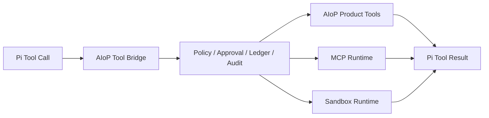
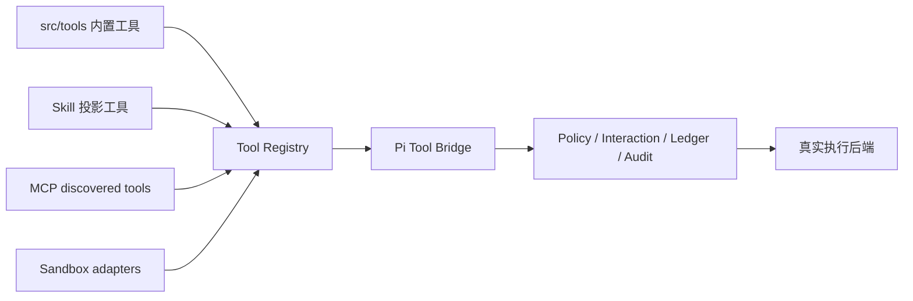

# 工具、Skill 与 MCP 设计

## 1. 统一执行链

Pi 负责 Harness 内的 schema 校验、Tool 事件和调用编排。AIoP 通过 bridge 接管真正执行，并在 `packages/pi-runtime/src/tools/` 实现产品治理、持久化事实和并发控制。

## 2. Tool Registry 与治理

- Pi adapter：`packages/pi-runtime/src/pi/tool-bridge.ts`
- 统一 registry：`packages/pi-runtime/src/tools/registry.ts`
- Governance：`packages/pi-runtime/src/tools/governance.ts`
- Policy/Approval/Ledger/Audit：同目录对应文件
- 产品工具定义：`src/tools/`
- 应用注册：`src/agent/tools.ts` 与 `src/runtime.ts`

每次调用必须绑定 tenant、actor、run、attempt、turn、tool call 和 logical call。模型提供的同名字段不具有授权效力。

### 2.1 Tool 来源如何合并

Registry 负责名字、schema、description 与 capability；Governance 负责“这一次调用是否能执行”。二者不能合并成仅按工具名分发的 Map，否则会丢失身份、幂等和恢复语义。

## 3. Skill 边界

Pi 复用范围：解析/加载 Skill resource，并把可用 Skill 加入 AgentHarness resources。

AIoP 自研范围位于 `src/skill/`：

- 产品导入、审核、启停、共享、删除、跨进程锁和 digest cache；
- tenant/user 可见性与发布治理；
- Credential 目标与运行期注入；
- Sandbox 文件同步与审计。

Skill 内容不得持久化真实 Credential。Pi loader 只接收已通过 AIoP 可见性检查的来源。

## 4. MCP Runtime

`packages/mcp-runtime` 基于官方 `@modelcontextprotocol/sdk`，负责：

- stdio/HTTP 等 client 连接；
- tenant/actor 维度的 server snapshot；
- 连接重建与过期 actor fencing；
- Credential provider；
- MCP tool 到 Pi Tool 的名称和 schema 映射。

`src/runtime.ts` 从启动配置和 tenant settings 装配 MCP；`McpRuntime` 以 tenant/actor scope 管理 server snapshot，管理员变更后写回设置。单个 Server 失败不阻断其他 Server；Tool 调用仍经过统一 Governance。

## 5. Approval 与未知副作用

- `approval`、`question`、`plan` 是 Durable Interaction，不是进程内 promise 的唯一事实源。
- resolution 必须匹配 tenant、run、interaction、tool call 和 pending state。
- 只读或确定幂等调用可按策略恢复。
- 非幂等调用在结果未知时进入 `recovery_required`，人工确认后才能继续。

## 6. 测试入口

- `tests/pi-runtime/tool-governance.test.ts`
- `tests/pi-runtime/tool-bridge.test.ts`
- `tests/pi-runtime/tool-sources.test.ts`
- `tests/durable-interaction.test.ts`
- `tests/mcp-runtime/`
- `tests/skill.test.ts`
- `tests/policy.test.ts`、`tests/rules.test.ts`、`tests/hooks.test.ts`

## 7. 新增工具的检查顺序

1. 定义稳定名称、输入 schema、输出形态与 capability。
2. 在产品注册处绑定真实 handler，不接收模型伪造的身份字段。
3. 确认 Policy/RBAC/Approval 是否覆盖写操作。
4. 为重试写定义 idempotency key 或结果查询；无法确认结果时返回 `recovery_required`。
5. 裁剪日志、Event 和 Tool result 中的 Secret、大文本与二进制内容。
6. 补 registry、governance、HTTP/direct-call 和恢复测试。
