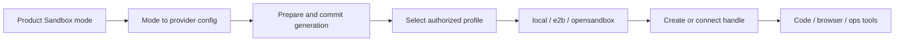

# Sandbox 与运维设计

> 状态：当前设计
> 验证基线：`b5425a0d2ae3ddc23ada4d3184d4a95e3a717bae`
> 最后核对：2026-08-03
> 适用范围：`pi-agent-platform-integration` 当前实现

## 1. 设计边界

Sandbox 是 AIoP 管理的外部执行环境。产品设置决定运行模式，内部 runtime 将其转换为 provider 配置，准备新的 Sandbox Generation，再按 profile 为 ordinary code、browser 或 privileged diagnostics 创建/连接实际环境。

Pi 不直接依赖 provider SDK；它只调用经过 Governed Tool Execution 包装的 Sandbox/Browser/Ops 工具。工具治理见[Tool、Skill 与 MCP](04-tools-skills-mcp.md)，身份与 RBAC 见[认证、安全与多租户](06-auth-security-tenancy.md)，部署操作见[部署与可观测性](10-deployment-observability.md)。

## 2. 产品 mode 与内部 provider 映射

产品持久设置使用 `mode`，内部 `SandboxConfig` 使用 `provider`。二者不能混写：

| 产品设置 `mode` | 内部 `provider` | 附加控制面 | 说明 |
| --- | --- | --- | --- |
| `local` | `local` | 无 | 本机开发/测试 provider |
| `standard_e2b` | `e2b` | 标准 E2B domain | 直接使用 E2B provider |
| `opensandbox` | `opensandbox` | OpenSandbox domain/protocol | 自建 OpenSandbox provider |
| `aios_lifecycle` | `e2b` | AIOS Lifecycle URL + placement | 产品模式是 AIOS lifecycle，但内部仍由带 AIOS adapter 的 E2B provider 执行 |

因此，`mode=aios_lifecycle` 不等于存在名为 `aios_lifecycle` 的 provider；其精确映射是 `provider=e2b` 加 `aios.lifecycleUrl/placement`。内部 provider 联合类型只有 `local | e2b | opensandbox`。

API key 与规范化远端目标绑定。切换 credential target 时不能静默复用旧 key；`local` 不接受 API key。Sandbox 设置和加密 Secret 通过 Store 原子保存，但新 generation 在保存前先准备，以减少写入不可用配置的概率。

## 3. Sandbox Generation 生命周期

一次设置或模板目录变更不会原地修改 current manager，而是生成候选 generation。其状态语义为：

```mermaid
stateDiagram-v2
  [*] --> Active: existing current generation
  [*] --> Preparing: prepare candidate
  Preparing --> Active: prepare succeeds and commit swaps current
  Preparing --> FailedCandidate: prepare or persistence fails
  FailedCandidate --> [*]: dispose candidate; current unchanged
  Active --> Active: candidate fails; keep current
  Active --> Draining: a newer generation commits or runtime is disabled
  Draining --> Disposed: pins, handles, inflight work, cleanup and desktops reach zero
  Disposed --> [*]
```



失败候选不会进入 Active：其资源经 `disposePrepared` 清理，原 current generation 保持 Active 不变。实现上的关键顺序如下：

1. **Preparing**：加载 AIOS template catalog（如适用）、解析 profiles、创建 provider/manager、可选 warm pool 与 desktop resolver。
2. **Persist before commit**：设置更新路径先准备候选，再保存设置与 Secret；保存失败时调用 `disposePrepared`。
3. **Commit**：controller 原子替换 `current`。新 generation 成为 active；旧 generation 加入 draining。
4. **Drain**：已 pin 住旧 generation 的 resolver/profile 操作可结束；最后一个 pin 释放后 manager 才 `beginDrain`，并停止 warm pool。
5. **Dispose**：旧 generation 没有 operations、active/inflight/cleanup handle 和 desktop 后，释放 generation 资源。

模板后台刷新同样先 prepare。若 catalog fingerprint 未变化，则清理候选而不切换；若变化则 commit 新 generation。准备失败不会改变 current。启动时 AIOS catalog 不可用会暴露 `catalog_unavailable`，不会伪造 active catalog。

### 3.1 晚到获取与 session disposal guard

每次 code/browser acquisition 都先 pin current，并捕获 session epoch。`disposeSession` 会递增相应 epoch、杀死匹配 desktop 并释放 session sandbox。异步 resolver、provider create/connect 或 desktop create 返回后必须再次校验：

- controller/generation 已 disposed，拒绝；
- session epoch 已变化，拒绝；
- 若 handle 已经晚到，先从 manager evict 并 kill，再返回 `sandbox session is disposed`。

该 guard 防止“会话已删除但慢请求又把 Sandbox 放回缓存”。generation pin 解决设置切换并发，session epoch 解决会话释放并发，两者职责不同。

## 4. Provider 调用模型



Provider 公共契约只保证：

```typescript
interface SandboxProvider {
  create(spec: SandboxSpec, options?: SandboxProviderOperationOptions): Promise<SandboxHandle>;
  connect(sandboxId: string, spec: SandboxSpec, options?: SandboxProviderOperationOptions): Promise<SandboxHandle>;
}
```

`SandboxHandle` 提供代码/命令、文件读取、超时续期与 kill；结构化命令、文件写入、secret file 隔离和 workspace path 是可选能力。hostPath volume 仅 OpenSandbox 路径支持，local/e2b 不应据此承诺同样挂载语义。Desktop 由独立 `DesktopProvider`/resolver 管理，也不能从 `SandboxProvider` 接口推导为必然能力。

调用路径按配置分支：

- `local`：`LocalSandboxProvider`；desktop 开启时使用 `LocalDesktopProvider`。
- `standard_e2b`：`E2bProvider`；desktop 开启时使用 `E2bDesktopProvider`。
- `opensandbox`：`OpenSandboxProvider`；desktop 开启时使用 `OpenSandboxDesktopProvider`，并复用 manager。
- `aios_lifecycle`：先从 Lifecycle catalog 生成 profiles，再创建带 placement 与 allowed template IDs 的 `E2bProvider`；browser profile 通过 `CommandDesktopProvider` 连接同一 generation manager。

Profile `id` 是稳定 selector 和资源 key 的组成部分，`name` 是显示名/兼容唯一选择。Sandbox key 绑定 tenant、user、session，并按 profile 扩展，防止跨身份或跨模板复用。

## 5. ordinary、browser 与 netdiag 权限边界

### 5.1 对比矩阵

| 类型 | profile 特征 | 平台角色 | 主要能力 | 基础设施权限边界 |
| --- | --- | --- | --- | --- |
| ordinary code sandbox | `envType=code`、`runtimeRole=sandbox-reader`、通常 `privileged=false` | 可见 profile 的普通用户/管理员 | Python、Node、shell、受控文件同步与导出 | 不应获得 hostNetwork、hostPID、特权容器或 netdiag SA；集群操作还须经过 AIoP policy/RBAC |
| browser sandbox | `envType=browser`，或非 AIOS 模式下显式 desktop code profile | 可见 profile 的普通用户/管理员 | navigate/click/type/screenshot/desktop stream | 与 code handle 分开管理；浏览器连接关闭不等于 Sandbox 释放；不继承诊断特权 |
| netdiag privileged sandbox | AIOS catalog 的 `runtimeRole=sandbox-diag` 会投影为 `privileged=true` 与 diagnostics capability；非 AIOS 手工 profile 可单独设置 `privileged=true` | 当前只有 `runtimeRole=sandbox-diag` 被限制为 `platform_admin`；手工 privileged profile 尚无同等角色门禁 | 节点/容器网络诊断、抓包、conntrack/iptables、K8s 调试 | 当前仓库是共享 OpenSandbox server 上的条件模板实验路径，不构成已验证的硬隔离 |

`visibleSandboxProfiles` 与 `findSandboxProfile` 当前只对 `runtimeRole=sandbox-diag` 执行 `platform_admin` 限制。AIOS catalog 会把该 runtime role 映射为 privileged；但非 AIOS `resolveSandboxProfiles` 将手工 profile 的 runtime role 固定为 `sandbox-reader`，即使配置 `privileged=true` 也不会触发上述角色检查。与此同时，`sandboxSpecForProfile` 会把 privileged 写入 metadata，patched OpenSandbox server 可据此合并特权模板。这是当前必须明确的授权缺口，不能把“privileged 都仅 platform_admin 可用”描述为已实现事实。

### 5.2 ordinary code sandbox

ordinary code sandbox 用于代码与命令执行。默认 profile 是 `sandbox-reader`、非 privileged。可选用户主目录挂载只适用于非 AIOS 配置，并需经过路径规范化；非法 home path 会被拒绝或跳过。带 volume 的 Sandbox 不进入 warm pool，因为 volume 必须在创建时生效。

Sandbox 内可运行命令并不授予平台权限：`kubectl` 工具还要通过 AIoP policy、RBAC 与集群 registry。文件导出和 Skill 同步使用受控路径、大小及凭据注入边界。

### 5.3 browser sandbox

browser profile 以 `envType=browser` 与 desktop capability 表达。AIOS 模式只从 catalog 中选择 browser profile；非 AIOS 模式可以选择独立 browser profile，必要时回退到显式带 desktop 的 code profile。

Desktop handle 以 generation 和 session key 缓存，并受 session epoch guard 保护。释放 session 时必须同时 kill desktop 与回收对应 Sandbox。仅断开浏览器流或页面连接不能视为释放底层执行环境。

### 5.4 netdiag privileged sandbox

Netdiag 当前是高风险部署意图与实验性路径，不是已验证的独立基础设施。仓库清单把特权 Pod 放在共享的 `opensandbox` namespace，使用全局名称 `opensandbox-batchsandbox-template`，并要求给共享 `opensandbox-server` 使用 `Dockerfile.server-netdiag` 补丁后按 metadata 条件合并模板；ordinary、browser 与 netdiag 仍可经过同一 patched server。`deploy/opensandbox/netdiag-sandbox.yaml` 展示的风险面包括：

- `hostNetwork: true`：进入节点网络命名空间，可观察或影响宿主网络。
- `hostPID: true`：可观察宿主进程命名空间。
- 容器 `securityContext.privileged: true`，并增加 `NET_ADMIN`、`NET_RAW`、`SYS_ADMIN`、`SYS_PTRACE`。
- hostPath 挂载 `/opt/cni/bin`、`/etc/cni/net.d`、`/var/run/openvswitch`、`/run/netns`、`/lib/modules`，暴露 CNI、OVS、netns 与内核模块界面。
- 专属 `aiop-netdiag` ServiceAccount 绑定高权限 ClusterRole，可读节点与工作负载，并可创建/修改/删除多类 K8s 资源、执行/attach/port-forward，甚至管理部分 RBAC 资源。
- `opensandbox` namespace 明确允许 privileged Pod，扩大了该命名空间的安全影响范围。

这些能力意味着容器逃逸、节点接管、横向移动和集群权限提升的 blast radius 显著高于 ordinary/browser。当前 patched server 的条件模板降低了误套模板的概率，但不是租户、控制面或 namespace 级硬隔离。后续实施必须满足：

1. **先修授权缺口**：实现 `privileged=true => platform_admin` 的服务端约束；在实现前禁止非 AIOS 手工 privileged profile。
2. **硬隔离控制面**：netdiag 使用独立 OpenSandbox server、独立模板 ConfigMap 名称和独立 sandbox namespace，不与 ordinary/browser 共享 patched server 或全局模板。
3. 使用专属 SA 和可审计 RBAC；能收窄到 namespace 的权限不使用 cluster scope，并移除非必要 RBAC 管理能力。
4. 继续经过 Tool policy、approval 与 audit；角色门禁不能替代 K8s 隔离。
5. 核对 OpenSandbox 实际容器名后再应用 volumeMount；模板中的 `sandbox` 是占位名。
6. 对 hostPath、抓包产物、命令输出和凭据做额外脱敏与保留期控制。
7. 生产启用前完成威胁建模、准入策略、专用节点隔离、审计告警和紧急吊销演练。

仓库清单只证明了实验性高权限模板和补丁路径的存在，不证明独立基础设施、完整授权或生产安全审查已经完成。

## 6. 工具暴露与治理

Generation commit 后，runtime 根据能力同步注册工具：

- 有 code profile：注册代码/命令、profile、ensure、导出、Skill 同步等工具。
- 只有 browser profile：保留 profile 列表，并按 desktop resolver 注册 browser 工具。
- 有 cluster 且不是 AIOS lifecycle：可注册 `kubectl`；它仍受平台 policy/RBAC。
- runtime disabled 时注销 Sandbox 工具，防止 registry 留下失效 handler。

Sandbox 工具进入 Durable Pi 时仍使用[Governed Tool Execution](04-tools-skills-mcp.md#3-governed-tool-execution)的 identity、capability、approval、resource concurrency 与 fenced ledger。Provider 成功创建环境不代表某个 actor 获得使用权限；profile 可见性和 Tool 治理都必须通过。

## 7. 资源、故障与运维约束

- handle 属于创建它的 generation；旧 generation 的 handle 必须回到旧 manager 清理。
- Abort 或命令超时会使 lease inactive、invalidate manager cache，并 kill handle；超时结果规范为 exit code 124。
- manager 的 idle sweep、warm pool drain、desktop cleanup 与 provider resource cleanup 都属于 generation 回收条件。
- 设置更新串行化，避免多个候选 generation 交错提交；runtime dispose 会先关闭更新入口，再等待更新尾部并释放全部 generation。
- AIOS template catalog 每分钟可刷新；失败保留 current，成功且 fingerprint 变化才切换。
- 通用 K8s 与开发部署边界、Secret、namespace 及回滚入口以[部署与可观测性](10-deployment-observability.md)为准；开发清单不能作为生产隔离或高可用证明。

## 8. 架构符合性检查

变更 Sandbox 或运维能力时至少确认：

1. 产品 `mode` 与内部 `provider` 是否使用正确术语，尤其 `aios_lifecycle -> e2b + aios`。
2. 是否先 prepare，再持久化/commit；失败是否清理候选并保留 current。
3. 旧 generation 是否 drain 到无 pin、handle、inflight、cleanup 和 desktop 后才 dispose。
4. late acquisition 是否经过 generation/session epoch guard，并清理晚到 handle。
5. profile 是否服务端校验角色、envType、runtimeRole 与稳定 id。
6. ordinary、browser、netdiag 是否使用清晰隔离的模板、身份和权限。
7. Provider 可选能力是否显式检测，而非从统一接口过度推断。
8. netdiag 的 hostNetwork、hostPID、privileged、hostPath 与 RBAC 风险是否单独评审和演练。
