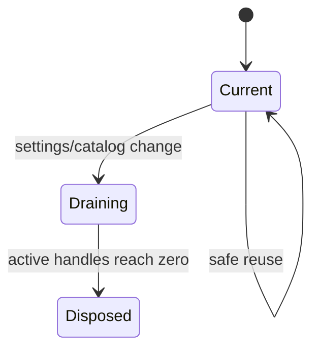

# Sandbox 与运维设计

## 1. 当前边界

Sandbox 是 AIoP 管理的扩展运行时，不由 Pi 替代。Pi 只看到经过 Governance 包装后的 Sandbox Tools。

实现集中在 `packages/sandbox-runtime`：

- `packages/sandbox-runtime/src/types.ts`、`contracts.ts`：Provider、Handle、Spec 与公共契约；
- `packages/sandbox-runtime/src/local.ts`、`e2b.ts`、`opensandbox.ts`：Provider；
- `packages/sandbox-runtime/src/aios-http.ts`、`aios-e2b.ts`、`aios-template-catalog.ts`：AIOS Lifecycle 与目录；
- `packages/sandbox-runtime/src/lifecycle.ts`、`acquisition.ts`、`runtime-controller.ts`：复用、回收和 generation；
- `packages/sandbox-runtime/src/profiles.ts`、`settings.ts`、`keys.ts`：必填 profile id/envType/runtimeRole、产品设置与资源 key；
- `packages/sandbox-runtime/src/desktop.ts` 及各 desktop provider：桌面会话；
- `packages/sandbox-runtime/src/warmpool.ts`、`userhome.ts`、`workspace-path.ts`：预热池和工作区；
- `packages/sandbox-runtime/src/tool-adapter.ts`、`output.ts`：接入 Pi Tool Governance，并限制输出形态。

应用装配和持久化设置位于 `src/runtime.ts`，产品工具位于 `src/tools/browser.ts`、`src/tools/export.ts`、`src/tools/kubectl.ts` 和 `src/tools/sandbox-profiles.ts`。

## 2. 生命周期

设置热更新创建新 generation；旧 generation 只负责归还和回收已有 handle。失效 generation 不能重新成为 current。未显式配置 profiles 时生成 `default` profile，而不是兼容旧 profile 结构。

## 3. Provider 与 AIOS

- Local：开发和单机测试。
- E2B：官方 SDK 代码/桌面沙箱。
- OpenSandbox：自建沙箱服务。
- AIOS Lifecycle：仅在 `provider=e2b` 时启用，placement 固定为 clusterId/namespace；第一阶段不支持 warm pool、用户主目录挂载或手工 privileged profile。

Provider 能力差异必须通过契约显式表达，不能假设所有 Provider 都支持 desktop、connect、template 或 user home。

### 3.1 当前能力矩阵

| 能力 | Local | E2B | OpenSandbox | AIOS Lifecycle |
| --- | --- | --- | --- | --- |
| 代码/命令执行 | 是 | 是 | 是 | 取决于模板目录 |
| Desktop/浏览器 | 本地 provider | E2B Desktop | OpenSandbox Desktop | 取决于模板与 Runtime Role |
| reconnect | 进程内 | Provider 支持 | Provider 支持 | Lifecycle/E2B 语义 |
| warm pool | 可配置 | 可配置 | 由当前实现约束 | 第一阶段不支持 |
| 用户主目录 | 支持受控挂载 | 取决于 provider | 支持配置边界 | 第一阶段不支持 |
| privileged profile | 仅开发语义 | 不应默认开放 | 由 PodTemplate/RBAC 决定 | 不允许手工配置 |

“支持”只表示 adapter 有对应路径，最终能力仍由启动配置、Profile、镜像和外部控制面决定。

## 4. Profile、路径与权限

- Profile 可见性由服务端 tenant/role 决定。
- 用户工作区路径必须经过 `workspace-path.ts` 规范化，禁止目录逃逸。
- `kubectl` 和运维命令还要经过 AIoP policy/RBAC；Sandbox 内权限不是平台授权替代品。
- 文件导出只允许受控目录和大小，并使用审计记录关联 run/tool call。

## 5. 部署边界

Staging 使用 `deploy/dev-k8s/`，namespace 为 `aiop-dev`，MySQL PVC 为 `ReadWriteOnce`。通用部署模板位于 `deploy/k8s/`，两者不可混用 namespace、Secret 名称或存储假设。

镜像、部署和回滚入口统一在根目录 `Makefile`。真实环境操作流程见[Pi Agent Platform 操作说明](../pi-agent-platform-operations.md)。

## 6. 测试入口

- `tests/sandbox.test.ts`
- `tests/runtime-sandbox-controller.test.ts`
- `tests/aios-e2b.test.ts`
- `tests/e2b.test.ts`
- `tests/opensandbox.test.ts`
- `tests/kubectl.test.ts`
- `tests/sandbox-runtime/provider-contract.test.ts`

## 7. 生命周期难点

- handle 属于创建它的 generation；设置更新后归还旧 handle 时，必须回到旧 generation 清理。
- profile 的 `id` 是稳定选择器，`name` 是展示名称；持久化和资源 key 不应回退到旧的可选字段规则。
- Sandbox key 至少包含 tenant、user、session，并按 profile/cluster 扩展，避免跨租户复用。
- Provider 超时、Abort 和进程关闭都要进入统一 dispose；只关闭浏览器连接不等于释放 Sandbox。
