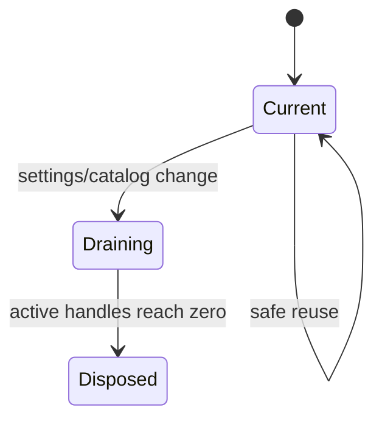

# Sandbox 与运维设计

## 1. 当前边界

Sandbox 是 AIoP 自研领域，不由 Pi `ExecutionEnv` 替代。Pi 只看到经过 Governance 包装后的 Sandbox Tools。

实现集中在 `packages/sandbox-runtime`：

- `types.ts`、`contracts.ts`：Provider、Handle、Spec 与公共契约；
- `local.ts`、`e2b.ts`、`opensandbox.ts`：Provider；
- `aios-http.ts`、`aios-e2b.ts`、`aios-template-catalog.ts`：AIOS Lifecycle 与目录；
- `lifecycle.ts`、`acquisition.ts`、`runtime-controller.ts`：复用、回收和 generation；
- `profiles.ts`、`settings.ts`、`keys.ts`：产品配置与权限；
- `desktop.ts` 及各 desktop provider：桌面会话；
- `warmpool.ts`、`userhome.ts`、`workspace-path.ts`：预热池和工作区；
- `tool-adapter.ts`：接入 Pi Tool Governance。

应用装配和持久化设置位于 `src/runtime.ts`，产品工具位于 `src/tools/browser.ts`、`src/tools/export.ts`、`src/tools/kubectl.ts` 和 `src/tools/sandbox-profiles.ts`。

## 2. 生命周期

设置热更新创建新 generation；旧 generation 只负责归还和回收已有 handle。失效 generation 不能重新成为 current。

## 3. Provider 与 AIOS

- Local：开发和单机测试。
- E2B：官方 SDK 代码/桌面沙箱。
- OpenSandbox：自建沙箱服务。
- AIOS：Lifecycle、placement、template/profile 和目录集成；其 Credential 由设置密钥服务保存，不进入 ConfigMap、日志或 Tool 输出。

Provider 能力差异必须通过契约显式表达，不能假设所有 Provider 都支持 desktop、connect、template 或 user home。

## 4. Profile、路径与权限

- Profile 可见性由服务端 tenant/role 决定。
- 用户工作区路径必须经过 `workspace-path.ts` 规范化，禁止目录逃逸。
- `kubectl` 和运维命令还要经过 AIoP policy/RBAC；Sandbox 内权限不是平台授权替代品。
- 文件导出只允许受控目录和大小，并使用审计记录关联 run/tool call。

## 5. 部署边界

Staging 只使用 `deploy/dev-k8s/`，namespace 为 `aiop-dev`，MySQL PVC 为 `ReadWriteOnce`。当前集群不使用生产 `deploy/k8s/` 的 namespace 或共享存储假设。

镜像、部署和回滚入口统一在根目录 `Makefile`。真实环境操作流程见[Pi Agent Platform 操作说明](../pi-agent-platform-operations.md)。

## 6. 测试入口

- `tests/sandbox.test.ts`
- `tests/runtime-sandbox-controller.test.ts`
- `tests/aios-e2b.test.ts`
- `tests/e2b.test.ts`
- `tests/opensandbox.test.ts`
- `tests/kubectl.test.ts`
- `tests/sandbox-runtime/provider-contract.test.ts`
