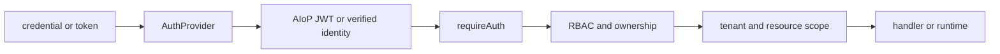
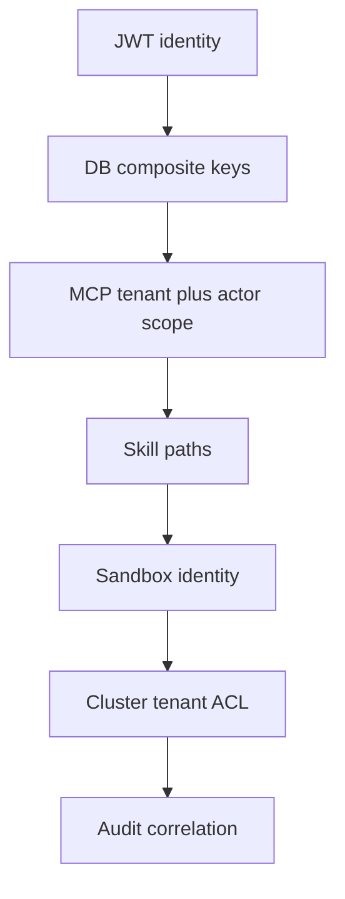
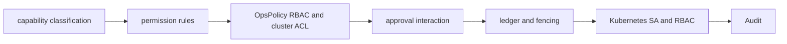

# 认证、安全与多租户设计

> 状态：当前设计
> 验证基线：`b5425a0d2ae3ddc23ada4d3184d4a95e3a717bae`
> 最后核对：2026-08-03
> 适用范围：`pi-agent-platform-integration` 当前实现

## 1. 安全边界

AIoP 以服务端验证后的 tenant、user、role 作为授权输入。客户端字段、模型输出、Tool 参数和 Sandbox 内身份都不是可信授权依据。安全控制分布在 HTTP、Store、Tool governance、Sandbox/Kubernetes 与审计层；任一单层都不能替代其他层。

当前角色固定为 `platform_admin`、`tenant_admin`、`user`。`RequestContext` 固定携带：

```typescript
interface RequestContext {
  tenantId: string;
  userId: string;
  role: 'platform_admin' | 'tenant_admin' | 'user';
}
```

## 2. 认证接口与身份模型

`AuthProvider` 提供 `login(tenantId, username, password)` 和 `authenticate(token)`。三种认证入口最终都形成 AIoP `RequestContext`：

| 入口 | 当前实现 | 身份落库与 Token |
| --- | --- | --- |
| Local | tenant + username 查询，scrypt 校验密码 | 用户来自 `users`；HS256 AIoP JWT 携带 tenant、role，`sub=userId` |
| OIDC | Authorization Code + PKCE；claims 映射 tenant、username、role | 可 JIT 创建 OIDC 用户；回调后颁发 AIoP JWT |
| AIOS exchange | userinfo 或远端 JWKS 验证 AIOS token | 按固定目标 tenant 和稳定外部 user id JIT；缓存下游凭据并颁发 AIoP JWT |

禁用用户不能登录或继续访问。OIDC/AIOS 的 JIT 映射依赖管理员配置；代码支持映射与校验，不等于任意 IdP 配置天然安全。

### 2.1 认证与授权流程



`requireAuth` 验证 Bearer Token，并再次检查用户仍为 active。RBAC 当前由 `requirePermission`、`canManageUsersOf` 以及各资源的 owner-or-admin 检查共同实现。Store 查询仍必须带 tenant/user 条件，不能只依赖 HTTP 层。

### 2.2 当前 RBAC 矩阵

| Permission | platform_admin | tenant_admin | user |
| --- | --- | --- | --- |
| `tenant:manage` | 是 | 否 | 否 |
| `user:manage:any` | 是 | 否 | 否 |
| `user:manage:own` | 是 | 是 | 否 |
| `cluster:write` | 是 | 是 | 否 |
| `approve` | 是 | 是 | 否 |
| `task:create` | 是 | 是 | 是 |
| `audit:read` | 是 | 是 | 否 |

该矩阵只说明已有 permission helper，不代表所有 HTTP 路由都统一由同一个中间件覆盖；资源 ownership 与路由级检查仍需逐接口核对。

## 3. 租户隔离分层



- JWT identity：服务端还原 tenant/user/role，拒绝客户端覆盖。
- DB composite keys：核心 Run、Session、Credential、Setting 等以 tenant 参与主键或查询条件；表结构详见[数据与持久化](07-data-and-persistence.md)。
- MCP tenant + actor scope：连接状态 key 是 `tenantId + actorId`，执行时再次比较 identity scope。
- Skill paths：用户资产按 tenant/user 路径和可见性规则处理。
- Sandbox identity：metadata/spec 携带 tenant、user、session；非平台管理员只能管理匹配自身范围的 Sandbox。
- Cluster tenant ACL：kubectl policy 检查 cluster tenant allowlist、namespace allowlist、只读属性和角色。
- Audit correlation：tenant/session/cluster/tool 等字段用于追踪，不构成独立授权边界。

这些是分层控制，不应过度推导为“所有模块均已完成强租户隔离”。例如部分运行时配置仍按进程装配，审计 `tenant_id` 也允许为空。

## 4. Durable 工具安全链



1. Tool definition 声明 `read`、`retryable_write` 或 `non_idempotent_write` 等 capability。
2. Permission rules 按 `deny > ask > allow` 判定；无条件 deny 可在注入模型前移除工具。
3. OpsPolicy 对 kubectl、危险 shell、角色、生产审批、cluster/namespace ACL 做额外检查。
4. 需要审批时写 durable Interaction 与 pending Ledger；恢复时校验 interaction、tool call、args digest、attempt/turn 绑定。
5. Tool Ledger 用 logical call、idempotency key、状态与 correlation 防止未知非幂等副作用被自动重放；Run lease token 提供 fencing。
6. 实际 Kubernetes 权限最终仍受 Sandbox/进程 ServiceAccount 和 Kubernetes RBAC 限制。
7. Policy 与 Governed Tool 执行写审计；工具审计为 best-effort，不可当作阻断控制。

### 4.1 当前限制：Hook 未接入主链

`src/agent/hooks.ts` 存在 fail-open `PreToolUse` runner，但当前 Durable Pi Governed Tool 主链没有调用它。因此它不是必经控制，也不能被用于证明 Durable Tool 已经过外部合规拦截；若未来接入，该 Hook 仍不应替代 fail-closed permission/policy、Ledger 和底层 RBAC。

### 4.2 Netdiag 授权缺口

AIOS template catalog 的 `sandbox-diag` profile 在运行时仅向 `platform_admin` 可见，并在 acquire 时复核。但仓库同时保留手工 OpenSandbox `netdiag-sandbox.yaml`：它启用 privileged、hostNetwork、hostPID、hostPath，并绑定高权限 ClusterRole。该手工 profile 的部署模板没有与 AIoP `RequestContext` 建立可验证的端到端授权绑定；若被错误挂到普通 Sandbox 全局模板，将绕过产品角色可见性。因此它只能视为受运维流程保护的高风险部署资产，不能宣称已有完整平台授权闭环。

## 5. 凭据与密钥

- 平台设置由 `SecretBox` 使用 AES-256-GCM 加密，密钥从独立的 `AIOP_SETTINGS_SECRET` 与 `platform-settings` domain 经 SHA-256 派生。
- 用户下游凭据由 `UserCredentials` 使用 AES-256-GCM 加密，但当前构造参数是 `AIOP_JWT_SECRET` 对应的 `jwtSecret`，再以 `aiop-credentials:` 前缀经 SHA-256 派生；它没有独立 credentials secret。
- 两类 envelope 均形如 `v1:<iv-base64>:<tag-base64>:<ciphertext-base64>`。其中 base64 只是二进制序列化编码，保密性和完整性来自 AES-GCM。
- `AIOP_SETTINGS_SECRET` 与 `AIOP_JWT_SECRET` 未配置时存在固定开发占位值/行为，生产必须分别注入强随机值。由于用户凭据当前复用 JWT secret，JWT secret 轮换也会使已有 `user_credentials` 无法解密，并扩大同一 secret 泄露的影响面；新增独立 credentials secret 是未来改进，不是当前事实。
- `user_credentials` 与 `setting_secrets` 保存密文 envelope；公开接口只应返回设置状态或掩码。
- `MYSQL_PASSWORD_BASE64` 只是把数据库密码做编码后由应用解码。这里使用 base64；它不提供保密性，也不是 Secret 管理替代品。Kubernetes Secret 的传输/静态保护取决于集群配置。

## 6. 网络与浏览器边界

### 6.1 SSRF

`assertPublicUrl` 仅允许 HTTP/HTTPS，DNS 解析后拒绝 loopback、IPv4 私网、链路本地/云 metadata 地址以及代码已覆盖的 IPv6 local 范围。Web Fetch 与 Hook webhook 禁止重定向，并设置超时；响应大小由具体调用方限制。

当前保护不是完整网络代理：它不提供请求阶段 DNS pinning，也没有覆盖所有特殊/保留地址类别。OIDC issuer、AIOS userinfo/JWKS、MCP URL 等管理员配置入口也不能一概宣称全部复用了相同 SSRF 校验，需按调用点审查。

### 6.2 frame ancestors 与 origin

Web `index.html` 的 CSP `frame-ancestors` 固定包含 `'self'`，并追加 `auth.aios.allowedParentOrigins`。当前该配置只进入 CSP，不进入前端 message handler：接收 `aiop:auth` 时未校验 `event.origin` 或 `event.source`，向父页面发送 `aiop:ready` 时 `targetOrigin` 也是 `*`。后端 exchange 会验证 AIOS token，但 Token 有效不能证明 postMessage 来源可信。因此当前只有 iframe 嵌入限制，没有闭环的精确 postMessage origin/source 绑定；`allowedParentOrigins` 的 schema 注释也超前于实现。

## 7. 安全变更约束

- 新 API 同时定义认证、permission、ownership、tenant 查询条件和 403/404 信息泄漏策略。
- 新 Tool 同时定义 capability、policy、approval、Ledger 幂等/恢复和底层执行身份。
- 新外部 URL 明确 SSRF、redirect、DNS、超时与响应上限。
- 新 Secret 明确加密 domain、envelope 版本、轮换失败行为、掩码与日志脱敏；用户凭据应迁移到独立 credentials secret，并设计兼容解密/重加密流程。
- privileged Sandbox 必须把平台身份到 profile、ServiceAccount、RBAC 的授权链做成可验证闭环。

## 8. 事实依据

- `src/auth/provider.ts`、`types.ts`、`local.ts`、`oidc.ts`、`aios.ts`、`session.ts`、`rbac.ts`
- `src/server/context.ts`、`src/server/http.ts`
- `src/security/secret-box.ts`、`src/auth/credentials.ts`、`src/net/ssrf.ts`
- `src/agent/policy.ts`、`src/agent/rules.ts`、`src/agent/hooks.ts`
- `packages/pi-runtime/src/tools/governance.ts`
- `packages/mcp-runtime/src/runtime.ts`
- `packages/sandbox-runtime/src/runtime-controller.ts`
- `deploy/opensandbox/netdiag-sandbox.yaml`、`deploy/k8s/secret.example.yaml`
