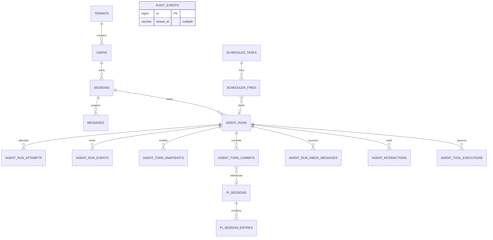
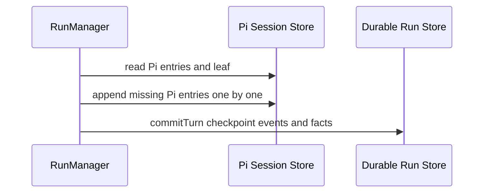
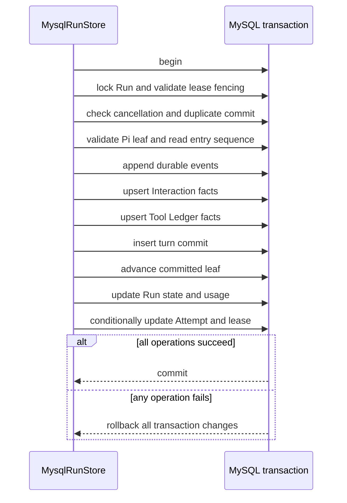
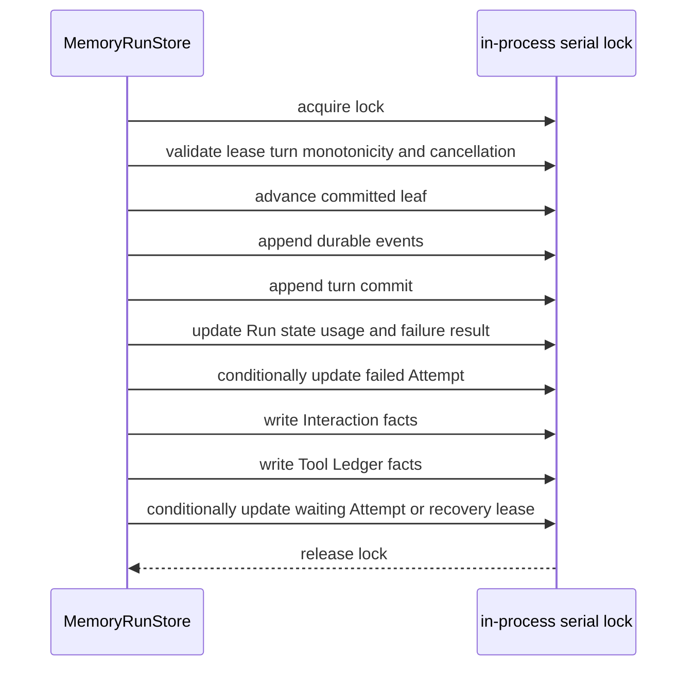

# 数据与持久化设计

> 状态：当前设计
> 验证基线：`b5425a0d2ae3ddc23ada4d3184d4a95e3a717bae`
> 最后核对：2026-08-03
> 适用范围：`pi-agent-platform-integration` 当前实现

## 1. 持久化边界

AIoP 以 MySQL 作为生产持久化前提。未配置 `MYSQL_HOST` 时会回退到 `MemoryStore`；Memory 实现用于测试和本地开发，进程重启即丢失全部状态，不支持多副本持久一致性。

当前存在两类相关事实：

- Pi Session Tree：`pi_sessions`、`pi_session_entries` 保存会话树条目与 current/committed leaf。
- AIoP 产品与 Durable Control Plane：用户、产品 Session projection、Run/Attempt/Event/Interaction/Tool Ledger、Scheduler 与 Audit。

二者通过 tenant、产品 session/run identity、`pi_session_id`、`pi_leaf_id`、`pi_entry_seq` 与 `committed_leaf_id` 对齐恢复边界。产品 `messages` 是 committed Pi path 的 projection，不是 Pi Session Tree 的替代事实源。

## 2. 核心概念模型

| 分组 | 核心表 | 当前职责 |
| --- | --- | --- |
| Identity / Tenant | `tenants`、`users`、`user_credentials`、`tenant_settings`、`setting_secrets` | 身份、角色、凭据与租户配置 |
| Product Session Projection | `sessions`、`messages` | 面向产品查询的会话与 committed 消息投影 |
| Durable Run Control Plane | `agent_runs`、`agent_run_attempts`、`agent_run_events`、`agent_turn_snapshots`、`agent_turn_commits`、`agent_run_inbox_messages`、`agent_interactions`、`agent_tool_executions` | lease/fencing、Turn 接受边界、事件、交互、工具副作用与恢复 |
| Pi Session Tree | `pi_sessions`、`pi_session_entries` | Pi 树条目、current leaf、committed leaf |
| Scheduler | `scheduled_tasks`、`scheduler_fires`、`agent_runs` | 产品任务、durable Fire 与执行历史关联；历史查询以 Fire 左连接 Run 为准 |
| Audit | `audit_events` | policy、运维和工具等结构化审计事件 |

`agent_turn_snapshots` 已存在于 baseline 与 Kysely schema，但当前未发现运行时写入或读取路径；它是已建模的预留表，不应描述为当前已工作的 Turn snapshot 流程。

## 3. 核心 ER 图

图中关系包含数据库主键关系与应用层逻辑关联；baseline 未声明外键，不能把连线理解为数据库已强制 referential integrity。

`AUDIT_EVENTS` 作为独立核心实体保留在图中。`audit_events.tenant_id` 可空且无外键，因此 ER 不画 Tenant 必属关系；tenant audit 只是可选相关性，system/global audit 可以没有 tenant。

## 4. 表、约束、索引与生命周期

### 4.1 Identity / Tenant

| 表 | 主键与逻辑关联 | 唯一约束与关键索引 | 状态与生命周期 |
| --- | --- | --- | --- |
| `tenants` | PK `id` | 无其他唯一键 | 租户根记录 |
| `users` | PK `id`；逻辑关联 tenant | unique `(tenant_id, username)` | `status`、`auth_provider`；禁用保留行，防 JIT 复活 |
| `user_credentials` | PK `(tenant_id,user_id,provider)` | 主键即隔离与去重 | encrypted `payload`、可选 `expires_at`；登录刷新、过期失效、用户禁用时清理 |
| `tenant_settings` | PK `(tenant_id,setting_key)` | 主键即设置唯一性 | JSON config 原位更新 |
| `setting_secrets` | PK `(tenant_id,setting_key)` | 主键即 secret 唯一性 | encrypted envelope，created/updated timestamp |

### 4.2 Product Session Projection

| 表 | 主键与逻辑关联 | 唯一约束与关键索引 | 状态与生命周期 |
| --- | --- | --- | --- |
| `sessions` | PK `(tenant_id,user_id,session_id)` | `(tenant_id,updated_at)`、`(tenant_id,user_id,updated_at)` | 产品会话标题与时间；按 owner 查询 |
| `messages` | AUTO PK `id`；逻辑关联 tenant/session/user | `(tenant_id,session_id,id)`、`(tenant_id,user_id,session_id,id)` | committed Pi path 的追加/重建投影；`content` 为 JSON |

`sessions` 的主键包含 user，而 `messages` 没有外键；projection 代码必须显式保持 tenant/user/session 一致性。

### 4.3 Durable Run Control Plane

| 表 | 主键与逻辑关联 | 唯一约束与关键索引 | 状态与生命周期 |
| --- | --- | --- | --- |
| `agent_runs` | PK `(tenant_id,run_id)`；绑定 user/session | session、status、lease 索引 | `queued/running/waiting/succeeded/failed/cancelled/recovery_required`；保存 usage、lease、cancel、append cutoff |
| `agent_run_attempts` | PK `(tenant_id,run_id,attempt_id)` | status/started 索引 | 每次 claim 创建；应用状态精确为 `running/succeeded/failed/cancelled/lost_lease`；保存 worker、lease token、kernel 与完成错误 |
| `agent_run_events` | AUTO PK `id`；逻辑关联 run | unique `(tenant_id,run_id,sequence)`；run/resume/attempt/correlation 索引 | 每 Run 单调 sequence 的追加事件流 |
| `agent_turn_snapshots` | PK `(tenant_id,run_id,attempt_id,turn_no)` | run/created 索引 | 模型包含 identity/model/prompt/skill/tool/policy/messages；当前无运行时写入路径 |
| `agent_turn_commits` | PK `(tenant_id,run_id,attempt_id,turn_no)` | global unique `commit_id`；run/transcript 与 Pi session/entry 索引 | 已接受 Turn；保存 Pi leaf、usage、checkpoint JSON、event high-water mark |
| `agent_run_inbox_messages` | PK `(tenant_id,run_id,message_id)` | unique idempotency、unique sequence；status/expiry 索引 | `pending/claimed/consumed`；claim 有 owner/token/expiry |
| `agent_interactions` | PK `(tenant_id,id)`；逻辑关联 run/attempt/turn/tool | pending、run、turn 索引 | kind 为 `approval/question/plan`；应用状态精确为 `pending/resolved/cancelled/expired` |
| `agent_tool_executions` | PK `(tenant_id,run_id,tool_call_id)` | unique `(tenant_id,run_id,logical_call_id)`；recovery/correlation 索引 | 应用状态精确为 `pending_approval/started/completed/unknown/recovery_required`，保护审批、重试与未知副作用 |

baseline 没有声明上述表之间的外键。上述 `status` 列均为 varchar，DDL 没有 `CHECK`；状态枚举由 TypeScript 应用合同与 Store 状态条件维护，数据库自身不会拒绝合同外字符串。lease/fencing、owner-or-admin、attempt/turn 绑定与幂等更新同样由 Store 事务和条件查询保证。

### 4.4 Pi Session Tree

| 表 | 主键与逻辑关联 | 唯一约束与关键索引 | 状态与生命周期 |
| --- | --- | --- | --- |
| `pi_sessions` | PK `(tenant_id,session_id)` | tenant/updated 索引 | `current_leaf_id` 表示工作树位置；`committed_leaf_id` 表示 Durable Run 已接受的恢复边界 |
| `pi_session_entries` | PK `(tenant_id,session_id,entry_id)` | unique entry sequence；parent 索引 | append-only tree entries；parent 与 leaf 同租户/会话校验由 Store 完成 |

`pi_session_id` 当前由 actor 与产品 session 派生，不能假定等于产品 `sessions.session_id`。

### 4.5 Scheduler

| 表 | 主键与逻辑关联 | 唯一约束与关键索引 | 状态与生命周期 |
| --- | --- | --- | --- |
| `scheduled_tasks` | AUTO PK `id`；绑定 tenant/user/session | `(enabled,deleted_at,next_run_at)`、tenant 索引 | cron、enabled、`deleted_at`、next/last run、pre-approved |
| `scheduler_fires` | PK `fire_id`；关联 task，可绑定 run | claim、lease、task/history、tenant/run 及手动幂等索引 | 应用状态精确为 `pending/claimed/bound/recovering/completed`；记录 cron/manual trigger、claim/recovery token、owner、lease、retry/error |

`scheduler_fires.state` 是 varchar，baseline 没有 `CHECK`；五态联合由 scheduler-runtime 合同和条件更新维护。`scheduler_fires.task_id` 与 `scheduler_fires.run_id` 都是逻辑关联，没有 baseline 外键。产品 Scheduler 执行历史通过 `scheduler_fires LEFT JOIN agent_runs` 查询，保留未绑定 Run 的 Fire 和软删除任务的授权历史。

### 4.6 Audit

`audit_events` 使用 AUTO PK `id`，`tenant_id` 可为空；按 `(tenant_id,session_id,id)` 与 `(tenant_id,kind,id)` 查询。它保存 kind、action、session、cluster、tool 与 JSON detail，用于相关性追踪。审计写入并非所有路径的 fail-closed 事务参与者，不能作为数据提交成功的唯一证据。

## 5. Turn 提交与原子性

### 5.1 共同前置步骤

Pi entries 由 `RunManager.syncEntries()` 在 `commitTurn()` 之前逐条写入，不属于后续 MySQL transaction 或 Memory lock 内的修改。失败可留下未 committed 的树条目；恢复读取仍以 `committed_leaf_id` 为边界。当前运行时也没有持久化 `agent_turn_snapshots`，checkpoint 实际写入 `agent_turn_commits.messages_json`。

### 5.2 MySQL Store

MySQL 只有在 transaction commit 成功后才同时暴露新的 committed leaf 与该 Turn 的 durable facts。

### 5.3 Memory Store

普通 `MemoryRunStore.commitTurn()` 直接在共享 Map 上按上述顺序修改；它不创建 overlay，也没有异常 rollback。若中途抛错，已完成的前序 Map 修改不会由 `commitTurn()` 自动恢复。串行锁只避免同进程并发交错，不提供数据库事务或跨进程持久性。

### 5.4 MySQL Store 细节

`MysqlRunStore.commitTurn()` 使用一个 Kysely/MySQL transaction：

1. `SELECT ... FOR UPDATE` 校验 Run lease/fencing 与过期时间。
2. 检查取消竞态和重复 `(tenant,run,attempt,turn)` commit。
3. 校验 checkpoint Pi leaf 属于同 tenant/session，并读取 entry sequence。
4. 追加 Run events；upsert Interaction 与 Tool Ledger。
5. 插入 `agent_turn_commits`。
6. 更新 `pi_sessions.committed_leaf_id`。
7. 更新 Run usage/status；按 waiting/failure/recovery 更新 Attempt 与 lease。
8. transaction commit；异常时回滚以上数据库修改。

Pi entries 的前置同步以及成功 Turn 后单独调用的 `complete()` 不属于该 transaction。成功路径会先 `commitTurn(status=succeeded)`，再执行一次独立的 `complete()` 来写终态/清 lease；文档不能把这两次调用合并成虚构的单一事务。

### 5.5 Memory 显式 transaction 的区别

`MemoryRunStore.transaction()` 另有 clone/overlay/restore 语义，可在显式 transaction callback 中回滚并拒绝逃逸 context；普通 `commitTurn()` 没有调用这个机制。不能用显式 transaction API 的测试结果推导 `commitTurn()` 中途异常可回滚，也不能宣称它与 MySQL 实现共享同一原子机制。两者目标是合同结果一致，但故障域与持久保证不同。

## 6. Fresh baseline 语义

当前仓库只有 `src/db/migrations/0001_baseline.sql`。

它适用于新建/重建环境，不是任意旧库的升级链。迁移器会记录已执行 version，但当前 baseline 是整套 `CREATE TABLE`，不能安全推导为对任意历史 schema 的增量转换。

历史数据库转换工具不在当前仓库范围内。存量环境必须先备份、核对实际 schema，再由独立转换方案迁移到当前 baseline；不能直接把 `0001_baseline.sql` 当作通用升级脚本重放。

## 7. 运行与恢复约束

- 生产部署和多副本 Scheduler/Worker 必须配置 MySQL；MemoryStore 仅适合测试/本地临时运行。
- Run Event sequence、Inbox sequence、Pi entry sequence 与 transcript version 是不同水位线，不能共用 cursor。
- 恢复只沿 `committed_leaf_id` 读取已接受上下文；未 committed entries 可存在但不进入 committed projection。
- 未知非幂等 Tool 副作用进入 `recovery_required`，不能仅因新 Attempt 就自动重放。
- JSON payload 需要调用层继续限制版本、类型与大小；MySQL `json` 类型不替代产品 schema 校验。
- baseline 无外键，删除、清理和 projection 重建必须由应用维护逻辑关联一致性。

## 8. 事实依据

- `src/db/migrations/0001_baseline.sql`
- `src/db/index.ts`、`src/db/schema.ts`、`src/db/store.ts`、`src/db/memory.ts`、`src/db/mysql.ts`
- `packages/pi-runtime/src/store/types.ts`、`memory.ts`、`mysql.ts`、`pi-session-mysql.ts`
- `packages/pi-runtime/src/run/manager.ts`
- `packages/pi-runtime/src/tools/governance.ts`
- `packages/scheduler-runtime/src/store.ts`、`mysql.ts`
- `tests/runtime-migrations.test.ts`
- `tests/pi-runtime/durable-run.test.ts`、`recovery.test.ts`、`mysql-session-storage.test.ts`
- `deploy/dev-k8s/mysql.yaml`、`deploy/k8s/secret.example.yaml`
