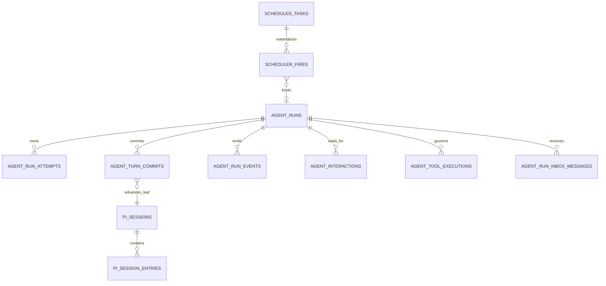

# 数据与持久化设计

## 1. 两类事实源

- Pi Session Tree：会话内 message、branch、compaction 和 session stats 的事实源。
- AIoP MySQL：产品 Run、Attempt、Lease、Turn commit、Inbox、Interaction、Tool Ledger、Scheduler、认证、设置、审计和产品查询的事实源。

两者通过 `pi_session_id`、`pi_leaf_id`、`pi_entry_seq` 和 `committed_leaf_id` 建立恢复边界，不做双 Agent loop 或双上下文写入。

## 2. Store 分层

| 数据 | 实现 |
| --- | --- |
| Durable Run/Interaction/Ledger/Inbox | `packages/pi-runtime/src/store/types.ts`、`packages/pi-runtime/src/store/memory.ts`、`packages/pi-runtime/src/store/mysql.ts` |
| Pi SessionStorage | `packages/pi-runtime/src/store/pi-session-mysql.ts` |
| Scheduler Fire | `packages/scheduler-runtime/src/store.ts`、`mysql.ts` |
| 产品用户、会话、消息、设置、审计 | `src/db/store.ts`、`src/db/memory.ts`、`src/db/mysql.ts` |
| Product message projection | `src/agent/projections.ts` |

Memory 实现用于合同测试和本地开发；生产多副本依赖 MySQL transaction、唯一键和 row locking。

## 3. 当前基线表

- `agent_runs`：状态、lease、limits、usage/cost、无人值守/预批准标志、append cutoff。
- `agent_run_attempts`：每次执行所有权和结束原因。
- `agent_turn_snapshots` / `agent_turn_commits`：Turn 输入、水位线与提交结果。
- `agent_run_events`：有序产品事件流。
- `agent_run_inbox_messages`：跨 Worker steer/follow-up。
- `agent_interactions`：approval/question/plan。
- `agent_tool_executions`：Tool Ledger 与未知副作用保护。
- `pi_sessions` / `pi_session_entries`：Pi Session Tree 持久化。
- `scheduler_fires`：调度触发、claim、bound Run、恢复和最终结果。
- `sessions` / `messages`：产品会话与 committed Pi projection。
- `scheduled_tasks` / `task_runs` / `task_agent_runs`：产品定时任务与 Run 查询关系。
- `users` / `user_credentials` / `tenant_settings` / `setting_secrets` / `audit_events`：身份、设置、Secret 与审计。

### 3.1 Durable 关系图

这些关系大多通过 tenant/run/session 等逻辑键关联，不应因为没有全部声明数据库外键就忽略应用层一致性检查。

## 4. 迁移边界

当前仓库只保留 `src/db/migrations/0001_baseline.sql`，用于新环境一次性创建 Pi-only schema。旧的增量迁移、LangGraph checkpoint 表、graph/runtime compatibility 字段已从当前代码和基线删除。

因此当前迁移器适用于空库或已由外部流程转换到相同基线的数据库；不能假设它会自动把任意历史 AIoP 数据库升级到当前结构。存量环境升级必须先核对实际 schema、备份并制定单独转换脚本，不能直接重放已删除的历史迁移。

## 5. 事务与 fencing

- Run 终态、Turn commit 和 lease 更新必须验证当前 attempt/token。
- Tool result、Interaction resolution、Inbox claim 必须使用唯一键或状态条件保证幂等。
- Memory transaction overlay 只在 active parent 中合并；失效或逃逸 transaction 返回冲突。
- MySQL transaction 失败时不能留下部分 Run/Interaction/Ledger/Event/Session 水位线状态。

### 5.1 提交与恢复顺序

1. claim Run 并生成新的 attempt/fencing token。
2. 打开 committed Pi Session path，执行一轮模型与工具。
3. 在同一提交协议中校验 fencing，写 Turn、Event、Interaction、Ledger 与 committed leaf。
4. 终态再清理 lease；waiting 保留可恢复事实，`recovery_required` 保留未知副作用事实。
5. 恢复前先读 durable facts，再决定是否允许创建新 Attempt。

禁止采用“先推进 Session leaf，后写 Run commit”的顺序，否则中途失败会让下次恢复读到未被 durable control 接受的上下文。

## 6. 设置与 Secret

非敏感设置可保存在 ConfigMap 或 tenant settings。Credential 保存到受控 Secret/Credential Store；API 返回掩码状态而不是明文。运维检查只验证 Secret 资源存在，不读取、describe、decode 或打印其内容。

## 7. 备份与恢复

备份恢复演练和 evidence 格式见[Pi Agent Platform 操作说明](../pi-agent-platform-operations.md)。准备阶段不虚构环境结果；实际证据写入仓库 `dist/`，不提交 Git。

## 8. 查询与迁移易错点

- `0001_baseline.sql` 是新环境基线，不是任意旧库的自动升级脚本。
- Run Event sequence、Inbox sequence 和 Session entry sequence 含义不同，不能共用游标。
- JSON 字段仍需版本和大小边界，不能把未知第三方对象原样持久化。
- Run Center 是跨表 projection；新增字段时要同步 Memory/MySQL、DTO 和 projection tests。
