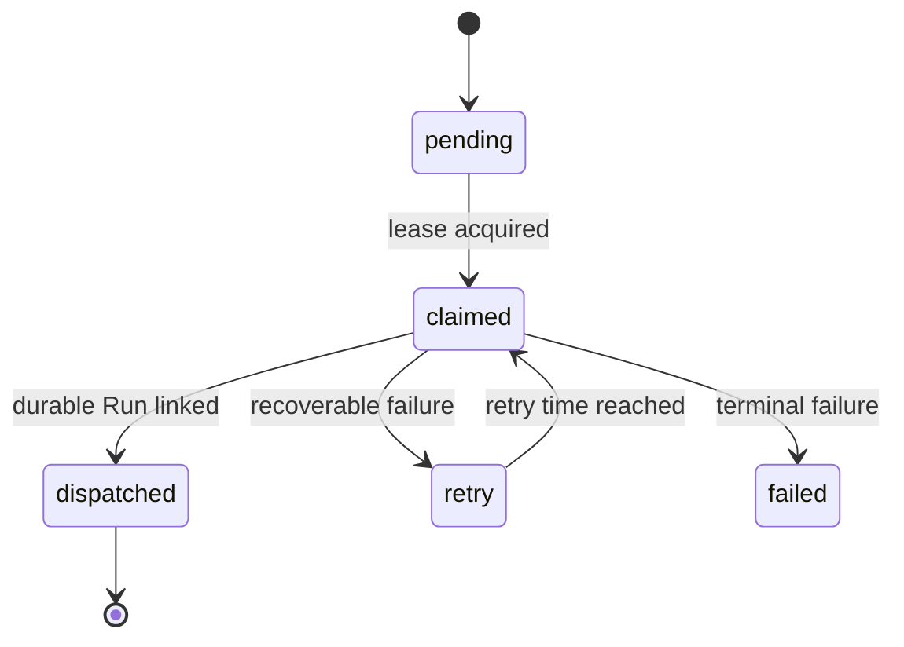

# Scheduler 设计

## 1. 当前边界

Scheduler 是 AIoP 自研控制面，不进入 Pi Agent loop。它只持久化 Fire，并通过 Durable Run dispatcher 创建或关联产品 Run；后续执行由 `packages/pi-runtime` 接管。

| 能力 | 当前路径 |
| --- | --- |
| Cron 与领域模型 | `packages/scheduler-runtime/src/cron.ts`、`domain.ts` |
| Fire Store/MySQL | `packages/scheduler-runtime/src/store.ts`、`mysql.ts` |
| Claim、dispatch 与完成 | `packages/scheduler-runtime/src/runner.ts` |
| 崩溃补偿 | `packages/scheduler-runtime/src/recovery.ts` |
| 应用装配 | `src/scheduler/runner.ts` |
| HTTP/CLI 兼容服务 | `src/scheduler/cron.ts`、`src/scheduler/ticker.ts` |

## 2. Fire 状态流

`fire_id` 是幂等关联键。Worker 在 claim 后崩溃时，recovery supervisor 可以回收过期 lease；若 Run 已创建则复用关联，不重复创建。

## 3. 身份与无人值守策略

- tenant/actor/session 来自持久化任务，不由 prompt 覆盖。
- Scheduler 创建的 Run 使用与 HTTP 相同的 Durable Pi Runtime。
- 未预批准的交互默认不能在后台无限等待；策略应拒绝或将 Run 明确置为 waiting/recovery 状态。
- Tool capability、MCP、Skill 和 Sandbox 仍经过同一治理链。

## 4. 多副本与取消

- Fire claim 使用 token、owner 和 expiry。
- 旧 supervisor 不能完成新一代 Fire。
- 调度任务禁用只阻止新 Fire；已创建的产品 Run 按 Run 取消语义处理。
- 修改 Cron 不回写历史 Fire 时间。

## 5. 测试入口

- `tests/scheduler-runtime/`
- `tests/scheduler.test.ts`
- `tests/scheduler-platform.test.ts`
- `tests/http-agent-runs.test.ts`
