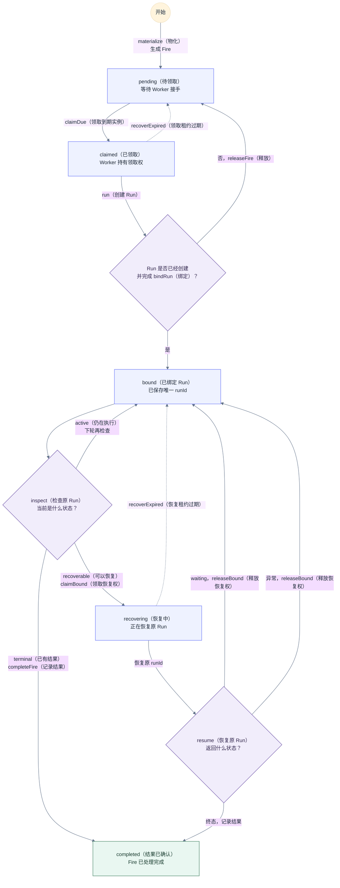
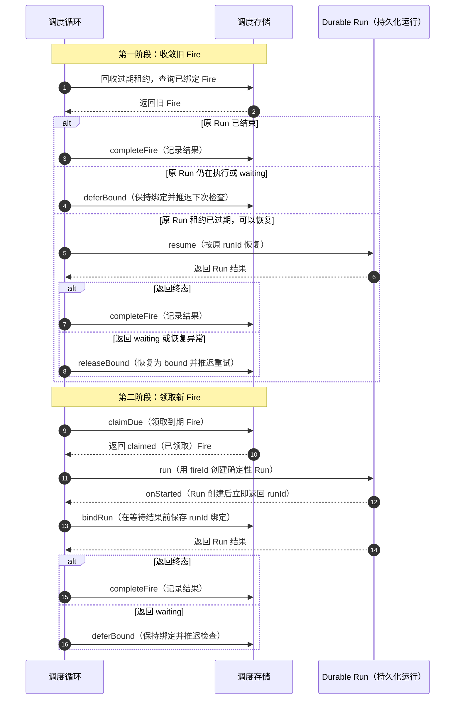
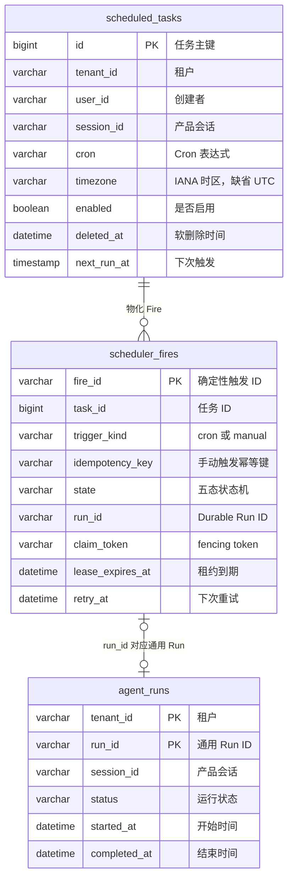

# Scheduler（调度器）定时任务设计

> 状态：当前实现与后续运维增强方案
> 版本：1.4
> 更新日期：2026-08-09
> 适用范围：`packages/scheduler-runtime`、`src/scheduler`、定时任务 HTTP API（HTTP 接口）/Tool（工具）及相关持久化

| 术语 | 中文名称 | 含义 |
| --- | --- | --- |
| Scheduled Task | 定时任务 | 持久化的 Cron、任务内容、执行身份和启用状态 |
| Fire | 触发实例 | 某个计划时间对应的一次执行单 |
| Run | 运行实例 | 一次智能体执行的持久化记录 |
| Durable Run | 持久化运行实例 | 可查询、恢复和取消的 Run |
| tick | 调度轮次 | Scheduler 收敛旧 Fire 并领取新 Fire 的一次循环 |
| claim | 领取 | Worker 临时取得 Fire 的处理权 |
| lease | 租约 | 处理权的有效期；Scheduler Fire 默认 30 秒 |
| fencing | 栅栏校验 | 使用 token 阻止旧 Worker 修改已被重新领取的 Fire |
| Cron | 周期表达式 | 定义计划时间；按任务 IANA 时区（缺省 UTC）计算 |

Scheduler 是定时任务的触发、绑定和恢复控制面。它通过 Durable Run 执行任务，不直接实现模型推理和工具调用。

## 1. 目标、边界与关键决策

### 1.1 目标与边界

- 支持定时任务的创建、查询、修改、启停、删除和立即执行。
- 使用稳定 `fireId`、MySQL 领取、租约和 fencing，避免多副本重复创建 Run。
- Worker 中断后区分“尚未绑定 Run”和“已经绑定 Run”，只恢复原 Run。
- 触发和恢复均保留 tenant（租户）、actor（操作者）、session（会话）及无人值守策略。
- Scheduler 只处理 `scheduler_fires` 绑定的 Durable Run，不负责恢复 HTTP、CLI（命令行接口）等入口创建的全部 Run。
- 删除任务采用软删除：停止后续物化，保留 Fire 与 Run 历史；已绑定 Run 不会被取消。
- 当前不提供秒级触发、节假日日历和 DAG（有向无环图）编排。

### 1.2 关键决策

| 决策 | 原因 | 影响 |
| --- | --- | --- |
| Cron Fire ID：`taskId + ":" + fireTime.toISOString()` | 为每次计划触发提供稳定幂等键 | 自动触发时 `fireId` 同时作为 Durable `runId` |
| 手动 Fire ID：`manual:${taskId}:${sha256(Idempotency-Key)}` | 同一租户、任务和幂等键在多副本下收敛为一次执行 | 不在 Fire ID、URL 或日志中暴露客户端幂等键 |
| Fire 与 Durable Run 分别维护租约 | 调度领取和智能体执行属于不同故障域 | Scheduler lease 不能代替 Durable Run lease |
| Run 创建后立即绑定 `runId` | Worker 中断后必须识别已有 Run | 已绑定 Fire 只能观察或恢复原 Run |
| 每轮先收敛旧 Fire，再领取新 Fire | 优先处理悬挂工作 | 旧 Fire 占用本轮 batch（批次配额） |
| 任务级 IANA 时区，默认 UTC | 由 `cron-parser` 在任务时区计算下一次执行 | 创建/更新时验证时区；DST 跟随 `cron-parser` 语义 |
| 生产环境只使用 MySQL Store | 多副本需要共享状态和事务领取 | Memory Store 仅用于测试 |

## 2. 程序架构

```mermaid
%%{init: {"theme":"base","flowchart":{"curve":"basis","nodeSpacing":50,"rankSpacing":70,"padding":32,"htmlLabels":true},"themeVariables":{"fontFamily":"Inter, PingFang SC, Microsoft YaHei, sans-serif","fontSize":"18px","lineColor":"#64748b","primaryTextColor":"#1e293b","clusterBkg":"#ffffff","clusterBorder":"#cbd5e1"}}}%%
flowchart LR
    subgraph Bootstrap[服务启动]
        direction TB
        Entry["<div style='width:130px'>AIoP 服务启动</div>"]
        Assembly["<div style='width:170px'>启动 Scheduler<br>内嵌模式【默认】</div>"]
        Entry -->| <div style='width:130px'>Event Loop</div> | Assembly
    end

    subgraph Scheduler[定时任务查询、调度与状态]
        direction TB
        Loop["<div style='width:250px'>调度循环<br>RuntimeSchedulerLoop</div>"]
        Runner["<div style='width:250px'>调度运行时<br>SchedulerRunner</div>"]
        SStore["<div style='width:250px'>调度存储<br>SchedulerStore<br>查询 / 领取 / 状态变更</div>"]
        Cron["<div style='width:250px'>Cron 计算下一次触发时间<br>任务 IANA 时区，缺省 UTC</div>"]
        MySQL["<div style='width:250px'>MySQL<br>任务 / Fire / Run</div>"]

        Loop -->|定时轮询：30 秒| Runner
        Runner <--> SStore
        SStore -.->|计算下次时间| Cron
        SStore -->|读写| MySQL
    end

    subgraph Execution[定时任务执行]
        direction TB
        Durable["<div style='width:260px'>DurableRunRuntime（持久化运行接口）<br>DurableRunManager（持久化运行管理器）</div>"]
        Pi["<div style='width:230px'>PiAgentSession（智能体执行会话）<br>模型推理 / 工具调用</div>"]

        Durable -->|创建或加载会话| Pi
        Pi -.->|执行结果| Durable
    end

    Assembly -->|启动调度| Loop
    Runner -->|创建或恢复 Run| Durable
    Durable -.->|Run 结果| Runner

    classDef entry fill:#eaf2ff,stroke:#6b8fc7,color:#17324d,stroke-width:1.4px;
    classDef scheduler fill:#fff5df,stroke:#b58a45,color:#493719,stroke-width:1.5px;
    classDef execution fill:#e9f7f1,stroke:#5f967b,color:#173d2e,stroke-width:1.4px;
    classDef data fill:#f1edfb,stroke:#8974b8,color:#332751,stroke-width:1.4px;
    class Entry,Assembly entry;
    class Loop,Runner,SStore,Cron scheduler;
    class Durable,Pi execution;
    class MySQL data;

    style Bootstrap fill:#f8fbff,stroke:#bfd0e7,stroke-width:1px
    style Scheduler fill:#fffcf4,stroke:#e3ca96,stroke-width:1px
    style Execution fill:#f7fcf9,stroke:#b8d8c7,stroke-width:1px
```



| 模块 | 负责 | 是否自研 |
| --- | --- | --- |
| AIoP 服务启动 / Scheduler 装配 | 在 `serve` 进程中创建并启动 Scheduler | **是。** 管理进程生命周期和依赖装配 |
| `RuntimeSchedulerLoop` | 定时 tick、防重入、停止信号和 batch | **是。** 与 AIoP 生命周期绑定 |
| `SchedulerRunner / SchedulerStore` | Fire 物化、领取、状态迁移、绑定和恢复 | **是。** 承载幂等和故障恢复语义 |
| Cron 计算 | 校验 Cron，并按任务 IANA 时区计算下一触发时间 | **否。** 使用 `cron-parser`；平台统一封装时区校验和缺省 UTC 语义 |
| `DurableRunRuntime / DurableRunManager` | 提供 `run/resume/cancel/append`，管理 Run 状态、租约和恢复 | **是。** `DurableRunRuntime` 是接口，`DurableRunManager` 是当前实现 |
| `PiAgentSession` | 模型推理和工具调用 | **部分自研。** AIoP 提供适配与治理，复用 Pi Agent 执行内核 |
| MySQL | 保存任务、Fire 和 Run | **否。** 复用事务、行锁和唯一约束；Schema 与 Store Adapter 自研 |

### 2.1 进程模型

- `npm run serve` 配合 `AIOP_EMBED_SCHEDULER=true` 时，Scheduler 运行在 HTTP 服务进程的 Node.js 事件循环中，不创建线程或子进程。
- 不再提供独立 Scheduler CLI；部署统一使用内嵌模式。
- 每个 AIoP 副本均可运行 Scheduler Worker；副本之间通过 MySQL 竞争 Fire。
- 默认每 30 秒 tick，一轮最多处理 10 个 Fire；同一实例不并发执行多个 tick。新的手动 Fire 写入后会向本进程的内嵌 Worker 发起一次 best-effort wake tick，不替代持久化与常规轮询。

### 2.2 代码落点

系统全量目录见 [01-system-overview.md](./01-system-overview.md)，这里只列 Scheduler 的直接代码边界。

```text
packages/scheduler-runtime/src/
├── cron.ts                     # Cron/IANA 时区校验与下一触发时间
├── domain.ts                   # Task、Fire、Dispatcher、Recovery 契约
├── store.ts                    # SchedulerStore 与 Memory 实现
├── mysql.ts                    # MySQL 领取、状态迁移和结果落库
├── observation.ts              # Scheduler 低基数观测事件契约
└── runner.ts                   # tick、分发、重试和恢复编排
src/
├── scheduler/runner.ts         # 生产装配、Durable Run 适配和调度循环
├── tools/schedule.ts           # Agent 定时任务 Tool
├── server/http.ts              # `/v1/schedule*` 和 Scheduler settings API
└── db/migrations/
    ├── 0001_baseline.sql       # fresh 数据库的当前 Scheduler/Durable Run 基线
    └── 0002_scheduler_schema_upgrade.sql # 已应用旧 0001 数据库的 Scheduler 增量升级
tests/
├── scheduler-runtime/          # Scheduler 包合同与 MySQL 测试
├── scheduler.test.ts           # 调度装配和循环
├── scheduler-platform.test.ts  # 产品集成
└── http.test.ts                # HTTP API
```

## 3. 任务与触发语义

### 3.1 定时任务定义

| 字段 | 语义 |
| --- | --- |
| `id` | 任务主键，也是 `fireId` 的组成部分 |
| `tenantId/userId/sessionId` | 执行身份和产品会话绑定 |
| `cron/timezone` | Cron 表达式与 IANA 时区；`timezone` 缺省 `UTC` |
| `title/task` | 展示标题和发送给智能体的输入 |
| `preApproved` | 无人值守预批准；设为 `true` 需要 `approve` 权限 |
| `enabled` | 是否继续物化新 Fire；不影响已经物化或绑定的 Fire |
| `nextRunAt/lastRunAt` | 下一次计划时间和最近一次物化时间 |

任务物化为 Fire 时，输入和身份快照写入 `scheduler_fires.input_json`。后续修改任务不会改变已有 Fire。

### 3.2 Cron 与错过触发

- 使用 `cron-parser@5.5.0`，按任务 IANA 时区计算；`timezone` 缺省 `UTC`。HTTP、Tool 与 Store 使用同一 Cron/时区校验边界，非法值稳定返回 400 或明确的 Store 错误。
- DST 直接遵循 `cron-parser` 语义；例如 `America/New_York` 的春季跳时日，缺失的当地 02:00 会顺延为当地 03:00，而不是额外补跑或跳过。
- 以持久化的 `next_run_at` 作为 `fireTime`；物化后从当前 tick 时间计算新的 `next_run_at`。停机期间最多物化一个逾期 Fire，随后将计划推进到当前时间之后，避免逐轮补齐积压。
- `scheduler_fires.fire_id` 主键保证同一任务、同一计划时间只物化一个 Cron Fire。

### 3.3 自动触发与立即执行

| 维度 | Cron 自动触发 | `POST /v1/schedule/{id}/run` |
| --- | --- | --- |
| 持久化防重 | Fire 主键、claim token、lease、确定性 Run ID | 必填 `Idempotency-Key`；唯一约束 `(tenant_id, task_id, trigger_kind, idempotency_key)` |
| Fire | 写 `scheduler_fires`，`trigger_kind=cron` | 写 `scheduler_fires`，`trigger_kind=manual` |
| 响应 | Scheduler 等待 Run 结果 | 立即返回 202 与 Fire/Run ID；新 Fire best-effort 唤醒本机内嵌 Worker |
| 多副本 | MySQL 保证同一 Fire 唯一 | MySQL 唯一约束收敛为同一 Fire/Run |

手动请求先持久化 Fire，再由 Scheduler 领取和创建 Durable Run；HTTP 不直接执行 Agent。重复幂等键返回原 Fire，并不会重复唤醒 Worker。

### 3.4 Fire 保留清理

默认不自动清理。设置 `AIOP_SCHEDULER_FIRE_RETENTION_DAYS` 为正数后，每个 tick 最多删除 `AIOP_SCHEDULER_CLEANUP_BATCH`（默认 100）条早于保留窗口且状态为 `completed` 的 Fire。清理只删除 `scheduler_fires` 行，绝不删除 `agent_runs` 或其他 Durable Run 数据；历史 API 因此只保证在 Fire 保留窗口内可查。

## 4. Fire 状态、幂等与恢复



| 状态 | 含义 | 允许的下一步 |
| --- | --- | --- |
| `pending` | Fire 已生成，尚未领取 | `claimDue → claimed` |
| `claimed` | Worker 持有 Fire 租约，准备创建 Run | `bindRun → bound`；未绑定失败或租约过期则回到 `pending` |
| `bound` | Fire 已保存唯一 `runId` | 等待结果、完成，或领取恢复权 |
| `recovering` | Worker 正在恢复原 Run | 完成，或失败/租约过期后回到 `bound` |
| `completed` | Fire 已完成；Durable Run 的结果保存在 `agent_runs` | 终态 |

核心规则：

- 首次执行异常时，只有 `bindRun` 尚未成功才调用 `releaseFire`；已经绑定则保留 `runId`。
- `recoverExpired` 不探测 Worker 进程。它根据 `leaseExpiresAt` 回收过期领取：`claimed → pending`，`recovering → bound`。
- `claimDue/claimBound` 签发新 `claimToken`；所有状态推进校验 state + token，旧 Worker 的写入失效。
- Scheduler Fire 和 Durable Run 各自维护租约。只有 Durable Run 租约失效后，Scheduler 才恢复原 Run。
- 相同 `fireId/runId` 重复完成是 no-op；不同 Run 不能覆盖已有绑定。

## 5. Tick、绑定与故障恢复



- bound Fire 优先占用本轮 batch；剩余容量才用于新 Fire。
- 已绑定 Fire 只观察或恢复原 `runId`，不得创建第二个 Run。
- `runtime.run()` 结果不明时，`ScheduledRunLookup` 只有在确认 `fireId` 对应 Run 存在且 tenant、actor、session 一致后才补做绑定。
- `waiting` Run 保持 Fire 的 `bound` 状态；Scheduler 不会自动完成、恢复或创建新 Run。只有显式 Interaction resolve/resume 流程可继续相同的 `runId`。

## 6. 数据模型与事务

下图表示当前核心模型。



### 6.1 表职责

| 表 | 性质 | 用途与关键约束 |
| --- | --- | --- |
| `scheduled_tasks` | Scheduler 核心表 | 保存任务定义与 `deleted_at`；PK `id`；`(enabled,deleted_at,next_run_at)` 支持到期查询 |
| `scheduler_fires` | Scheduler 核心表 | Fire 状态事实源；PK `fire_id`；保存 trigger、幂等键，并按 state/retry、state/lease、task/history 和 tenant/run 建索引 |
| `agent_runs` | 平台通用表 | Durable Run 主记录；PK `(tenant_id,run_id)`；保存状态、会话、租约、用量和结果 |
| `tenant_settings` | 平台通用表 | 保存 `scheduler.default.maxRunMs` 等租户配置 |

执行历史的唯一来源是 `scheduler_fires LEFT JOIN agent_runs`。尚未创建 Durable Run 的 `pending/claimed` Fire 也必须可见；授权历史查询不筛除已软删除任务。

### 6.2 执行历史与会话历史

| 数据 | 表与字段 | 说明 |
| --- | --- | --- |
| Run 主记录 | `agent_runs.run_id/status/session_id` | 通用执行历史事实源 |
| Run 与 Pi 会话关联 | `agent_turn_commits.run_id/pi_session_id/pi_leaf_id/pi_entry_seq` | 定位某轮提交使用的 Pi 会话分支 |
| Pi 会话元数据 | `pi_sessions.current_leaf_id/committed_leaf_id` | 标记当前和已提交叶节点 |
| 原始会话历史 | `pi_session_entries.entry_json` | 保存消息、工具调用等会话树内容；`entry_seq` 表示顺序 |
| 产品消息投影 | `messages.role/content` | 面向页面的扁平消息视图，不是事实源 |

产品 `sessionId` 保存在 `scheduled_tasks.session_id`、`scheduler_fires.session_id` 和 `agent_runs.session_id`。Pi 内部使用 `piSessionStorageId(actorId, sessionId)` 生成隔离后的 `pi_session_id`。

Scheduler 在 Fire 对应 Run 成功完成后调用 `projectCommittedPiSession()`，将 committed Pi 会话投影到产品 `messages`。投影失败只记录日志，不回滚 Fire 完成状态。

### 6.3 事务与迁移

当前事务边界：

- 物化 Cron Fire 与推进任务下一触发时间在同一事务完成。
- 手动 Fire 创建锁定可见且未删除的任务行，并通过 `(tenant_id,task_id,trigger_kind,idempotency_key)` 唯一约束收敛重复请求。
- `bindRun` 和 `completeFire` 只更新 `scheduler_fires`，Run 详情由 `agent_runs` 提供。
- Durable Run 与 Scheduler 表不共享事务；通过确定性 `runId`、lookup 和恢复流程收敛。

兼容表 `task_agent_runs` 与 `task_runs` 已从 fresh 基线和运行时读写中移除；不再维护双写或双读路径。已应用旧版 `0001` 的数据库升级后可能仍保留这两张物理表，当前 `0002_scheduler_schema_upgrade.sql` 不负责删除历史表。是否删除需另行确认历史数据价值和回退策略。

`0002_scheduler_schema_upgrade.sql` 为已应用旧版 `0001` 的数据库增加任务时区、软删除、手动 Fire 字段和索引，并将旧 `started` Fire 转为 `completed`。当前没有数据库外键，关联完整性由应用维护；`scheduler_fires.state` 的合法值由条件更新保证。

## 7. HTTP API

字段级模型见 [12-http-api-reference.md](./12-http-api-reference.md)。

| 方法与路径 | 用途 | 权限与当前语义 |
| --- | --- | --- |
| `GET /v1/schedule` | 查询任务 | 普通用户仅本人；管理员本租户 |
| `POST /v1/schedule` | 创建任务 | `task:create`；预批准另需 `approve`；非法 Cron 返回 400 |
| `PATCH /v1/schedule/{id}` | 修改任务 | Cron 变化时重算 `nextRunAt`；非法 Cron 返回 400 |
| `POST /v1/schedule/{id}/enable\|disable` | 启停任务 | 不存在或无权访问的任务返回 404 |
| `DELETE /v1/schedule/{id}` | 删除任务 | 软删除，停止后续 Fire；既有 Fire/Run 历史保留 |
| `GET /v1/schedule/{id}/runs` | 查询执行历史 | 返回 `scheduler_fires LEFT JOIN agent_runs` 的 Fire-first 记录 |
| `POST /v1/schedule/{id}/run` | 立即执行 | 必填 `Idempotency-Key`；202 表示 Fire 已持久化，Scheduler 异步执行 |
| `GET/POST /v1/settings/scheduler` | 查询或修改最大运行时间 | `tenant:manage`；默认 4 小时 |

## 8. 非功能设计

### 8.1 安全与租户隔离

- 自动触发始终使用任务保存的 tenant、actor 和 session，不使用 Scheduler 进程身份。
- 普通用户只能管理本人任务；管理员只能管理本租户任务。
- `preApproved=true` 需要 `approve` 权限，且不绕过 RBAC（基于角色访问控制）、工具治理和基础设施权限。
- 恢复前校验 tenant、actor、session 和 `runId` 绑定，避免恢复其他用户的 Run。
- 停用或删除任务不自动取消已经绑定的 Run。

### 8.2 性能与容量

| 项目 | 当前行为 | 风险 |
| --- | --- | --- |
| 触发延迟 | 默认 30 秒轮询 | 正常延迟约 0～30 秒，不适合实时调度 |
| 单轮容量 | 默认 batch 10，旧 Fire 与新 Fire 共用 | 大量恢复任务会推迟新任务 |
| 多副本领取 | MySQL `FOR UPDATE`，未使用 `SKIP LOCKED` | 高并发下可能串行等待，需要压测 |
| 数据保留 | 可选清理过期 `completed` Fire；尚无归档能力 | 未启用 retention 时表持续增长；启用后 Fire 历史只保证在保留窗口内可查 |

### 8.3 可观测性

当前可通过启动日志、tick error 和 `scheduler_fires.attempts/retry_at/last_error/claim_owner/lease_expires_at` 排查问题。Durable Run 另有事件、Attempt（执行尝试）、Turn（执行轮次）、usage（用量）和租约记录。

`SchedulerRunner` 已通过 `SchedulerObserver` 产生低基数 observation，并由生产适配器输出结构化日志。当前事件包括：

- `due_lag_ms`：被领取 Fire 相对计划时间的延迟；
- `state_count`：本轮观察到的 bound 数量及 claimed 事件；
- `retry`：分发或状态推进失败后的重试事件；
- `duration_ms`：单 Fire 和整轮 tick 的执行时长；
- `completion`：新领取 Fire 的完成事件；
- `backlog`：本轮实际领取的新 Fire 数量，并非数据库真实积压总数；
- `long_stuck`：bound Fire 自计划时间起的停留时长。

Fire ID 作为日志关联字段输出，并同时映射为 Scheduler 日志的 `correlationId`。Durable Run 内部仍使用独立 correlation ID，尚未实现 Fire、Run、Attempt、Turn 和 Event 的统一关联链。

当前没有指标 exporter、Dashboard 或告警规则。各状态准确聚合、数据库真实 backlog、完成率、长期停留阈值和告警演练仍属于待办。

### 8.4 配置

| 配置 | 默认值 | 说明 |
| --- | --- | --- |
| `AIOP_EMBED_SCHEDULER` | disabled | `true/1` 时在 `serve` 进程中启动 Scheduler；当前 Kubernetes 部署清单显式设为 `true` |
| `AIOP_SCHEDULER_FIRE_RETENTION_DAYS` | 未设置（关闭） | 正数天数；每轮 tick 后清理窗口外且状态为 `completed` 的 Fire，不删除 Durable Run |
| `AIOP_SCHEDULER_CLEANUP_BATCH` | 100 | 启用 retention 后单轮最多删除的 Fire 数量；非正整数回退 100 |
| `intervalMs` | 30000 | tick 间隔，仅程序化配置 |
| `batch` | 10 | 单轮最大处理量，bound Fire 与新领取 Fire 共用 |
| `leaseMs` | 30000 | Fire 领取和恢复租约 |
| `retryDelayMs` | 30000 | 失败、active 或 waiting Run 的下次观察或领取时间 |
| `scheduler.default.maxRunMs` | 4 小时 | 租户级最大运行时间 |

## 9. 开源依赖与发布

| 组件 | 版本 | 功能 | Star | License | 选择原因 | 风险与隔离方式 |
| --- | --- | --- | --- | --- | --- | --- |
| `cron-parser` | 5.5.0 | Cron 校验和下一时间计算 | 1,484（2026-08-04） | MIT | API 边界小，支持时区 | 锁定版本并通过 `cron.ts` 封装 |

构建和测试环境部署统一使用：

```bash
make image
make deploy-staging
```

部署只启用内嵌 Scheduler；独立 Scheduler CLI 已删除。

## 10. 风险与后续任务

### 10.1 已完成基线

以下能力已进入当前实现，不再列为待办：

- 任务级 IANA 时区、Cron 校验和 DST 行为测试；
- Cron 与手动 Fire 的统一持久化、手动幂等键和 Fire-first 历史；
- pending Fire 在任务软删除后仍可执行，删除只停止未来 Cron 物化；
- waiting Run 的非终态恢复，以及 bound/new Fire 共享批次容量；
- fresh baseline 移除兼容表、运行时移除旧 ticker 和独立 Scheduler CLI；
- `0002_scheduler_schema_upgrade.sql` 对旧版 schema 的增量升级；
- 可选的 completed Fire retention cleanup；
- Scheduler 低基数 observation 和结构化日志。

### 10.2 待办优先级

| 优先级 | 【待优化】事项 | 适用条件 | 验收点 |
| --- | --- | --- | --- |
| P0 | 修正批量领取后的串行阻塞和租约过期窗口 | 无条件，发布前完成 | `batch > 1` 时已领取 Fire 能在租约内完成 Run 创建和 `bindRun`，长 Run 不阻塞后续 Fire 启动；两个 Worker 下不出现未开始 Fire 的反复过期领取；并发有明确上限，Pod 退出后安全收敛 |
| P0 | 手动 Fire 真实 MySQL 端到端验证 | 无条件，发布前完成 | 通过 HTTP 创建手动 Fire，验证幂等重放、Scheduler 领取、Durable Run 绑定与完成、Fire-first 历史和租户隔离 |
| 条件 P0 | MariaDB 10.2 增量升级验证 | 升级已有生产数据库前 | 在生产同版本副本执行 `0002`，核对列、索引和旧 `started` 状态转换；执行升级前备份，并验证失败回退及升级后的数据不变量 |
| 条件 P0 | 多副本领取、fencing、权威时钟和恢复验证 | 启用多个生产 Scheduler 副本前 | 至少两个实例并发领取；同一 Fire 不重复产生有效 Run；旧 claim token 不能推进状态；实例退出后可恢复；明确租约时钟源，并验证时钟偏差、倒拨及外部副作用不会产生重复有效提交 |
| 条件 P0 | 执行身份、权限和预批准安全撤销 | 启用无人值守高风险工具前 | Run 创建前重新校验用户、租户、凭据及必要权限；紧急撤销 `preApproved` 后未启动 Fire 不再执行高风险操作；明确已绑定和 waiting Run 的继续、取消或人工处置语义，并保留审计证据 |
| P1 | waiting Interaction 生命周期收敛 | 允许 Scheduler Run 进入人工交互等待时 | Interaction 无需用户再次请求即可按截止时间过期；resolve 与过期并发只生效一次；Run 和 Fire 在规定时间内进入明确终态或隔离态；waiting 不无限占用普通批次，并具备通知、指标和告警 |
| P1 | 重试预算、毒性 Fire 隔离和数据不变量巡检 | 生产运行基线 | 区分瞬时与永久错误，设置退避和最大尝试次数；坏 JSON、缺失 Run 或错误绑定不阻塞其他 Fire；超预算记录可隔离、告警和受审计重驱；定期检查 Fire 状态、租约、Run 与租户绑定不变量 |
| P1 | Scheduler 控制面安全审计 | 生产启用任务管理和手动执行前 | HTTP 与 Tool 的创建、修改、启停、删除、预批准变更、手动触发及重驱产生统一审计事件；记录必要前后值，区分首次请求与幂等重放，不记录任务敏感正文、明文幂等键或凭据 |
| P1 | 多租户公平调度和背压 | 多个非互信租户共享 Scheduler 前 | 定义租户级 pending/bound/active 上限、全局并发和公平领取策略；单租户积压时其他租户仍满足最大等待时间；明确 Cron、手动、waiting 与 recovering 的容量预算及超限响应 |
| P1 | 指标出口、SLO 和最小告警 | 生产运维基线 | exporter 提供数据库真实 backlog、状态数量、due lag、绑定延迟、恢复延迟、重试、耗时、完成率、waiting 年龄及长期停留指标；定义 SLO/错误预算，完成 Dashboard、告警规则和故障演练 |
| P1 | Scheduler 灾备恢复合同和演练 | 承载生产无人值守任务前 | 定义 RPO/RTO；一致性备份覆盖 tasks、fires、runs、interactions、工具副作用账本和迁移版本；隔离环境恢复后不产生补跑风暴或盲目重放外部副作用，各非终态 Fire 可安全收敛 |
| P1 | 显式配置生产 Fire retention | 生产启用前 | 根据审计和排障窗口设置 retention days 与 cleanup batch；验证只清理过期 `completed` Fire，容量增长可控 |
| P2 | 统一关联标识 | 需要跨 Scheduler 和 Durable Run 排障时 | Fire、Run、Attempt、Turn、Event 和日志可通过统一 correlation ID 查询 |
| P2 | 完整归档能力 | 需要长期历史或合规留存时 | 清理前将 Fire 历史写入可查询归档；定义恢复、校验、保留和删除流程 |
| P2 | 删除升级库中的兼容物理表 | 历史价值和回退窗口确认后 | 确认 `task_runs`、`task_agent_runs` 无读写方和保留需求；备份后删除并验证回退方案 |
| P2 | 容量压测与部署拓扑评估 | 预期高并发、扩大批次/副本或引入 HPA 前 | 覆盖 `FOR UPDATE` 锁等待、dispatch/Run 并发、连接池、混合 backlog 和滚动退出；据结果确定批次、轮询间隔、资源与副本上限，并判断 HTTP 与 Scheduler 是否需要独立扩缩容 |

### 10.3 建议实施顺序

1. 发布前先修正批量领取的租约窗口，并完成手动 Fire 真实 MySQL 端到端验证。
2. 根据上线形态，完成数据库升级、多副本时钟/恢复和高风险执行安全撤销对应的条件 P0。
3. 补齐 waiting 生命周期、重试隔离、数据不变量和控制面审计，形成生产安全基线。
4. 建立多租户公平性、准确指标、SLO、告警、灾备和 retention 运维基线。
5. 根据排障、合规和规模化需求安排关联标识、归档、兼容表清理及部署拓扑演进。
