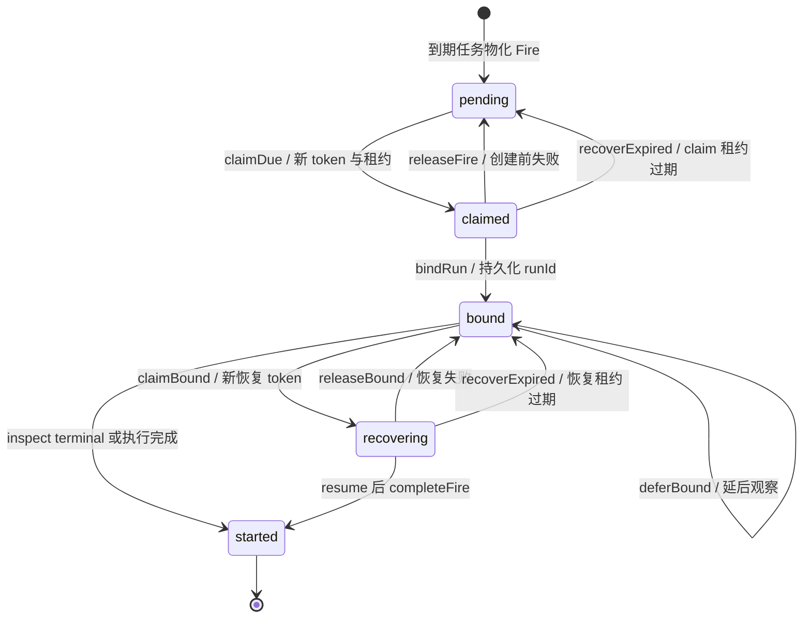
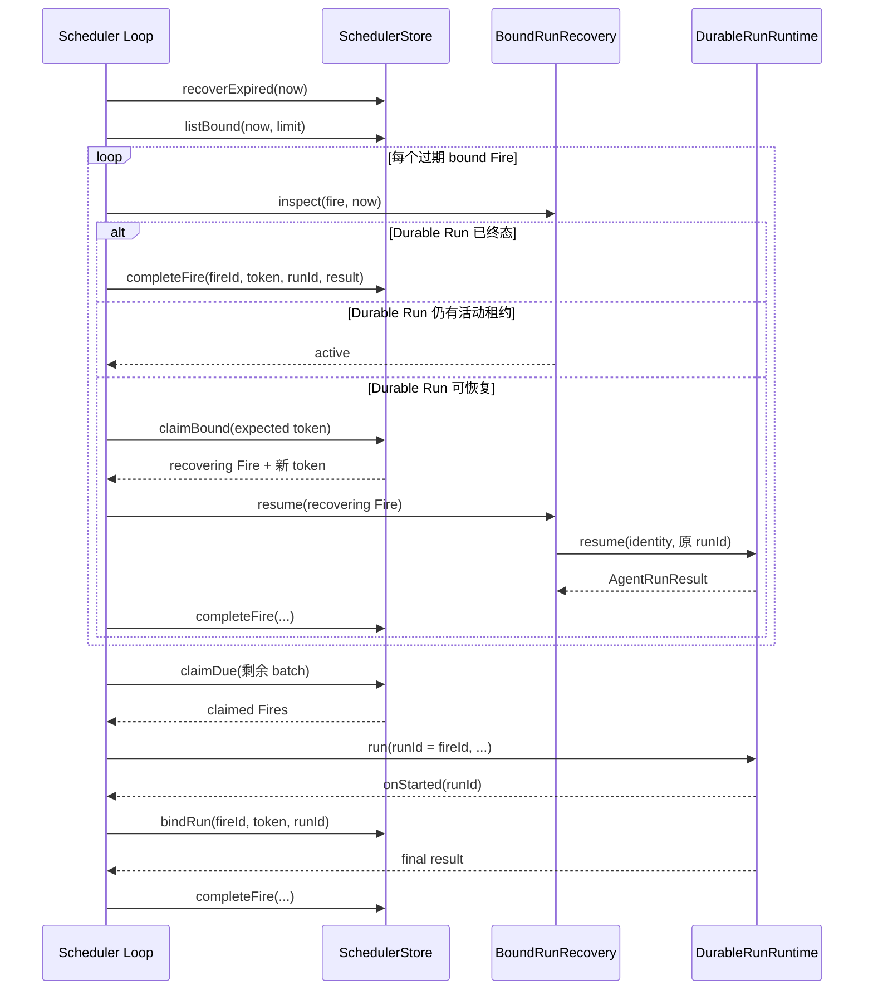

# Scheduler 设计

> 状态：当前设计
> 验证基线：`b5425a0d2ae3ddc23ada4d3184d4a95e3a717bae`
> 最后核对：2026-08-03
> 适用范围：`pi-agent-platform-integration` 当前实现

本文描述 `packages/scheduler-runtime` 与生产装配的当前实现。Scheduler 是 Durable Run 的触发与绑定控制面，不进入 Pi Agent loop。

## 1. 边界与装配

- `packages/scheduler-runtime` 定义 Cron、Fire 领域对象、Store ports、Runner 与过期租约回收。
- `src/scheduler/runner.ts` 把 Scheduler 接到 `DurableRunRuntime`，并提供 Run 查询和 bound Run 恢复适配。
- 生产装配只接受 `MysqlStore`，据此创建 `MysqlSchedulerStore`；内存 Store 和显式 `SchedulerStore` 注入用于测试。
- 调度身份、Session、输入和 `execution.unattended/preApproved` 来自持久化任务；prompt 不能覆盖这些控制字段。

## 2. 领域 ports

| Port / 类型 | 输入与输出 | 责任边界 |
| --- | --- | --- |
| `ScheduledRunInput` | task/fire 身份、`fireTime`、Identity、Session、消息、execution、limits、signal | 一次调度执行的完整输入；不持有租约 |
| `RunDispatcher.startScheduledRun` | 输入 `ScheduledRunInput`，可接收 `onStarted(runId)`；返回 `runId + AgentRunResult` | 创建或确认确定性 Durable Run；在等待最终结果前回调绑定 Run |
| `ScheduledRunLookup.findScheduledRun` | 按调度输入查询；返回已存在且有最终结果的 Run，或 `undefined` | 仅补偿“Run 创建结果未知”；不得根据异常文本猜测创建是否成功 |
| `BoundRunRecovery.inspect` | 输入过期 `bound` Fire 与当前时间；返回 `active / terminal / recoverable` | 校验 Fire 与 Durable Run 绑定，区分仍活跃、已有结果和可恢复 Run |
| `BoundRunRecovery.resume` | 输入已 fenced 的 `recovering` Fire 与 signal；返回最终结果 | 使用原 `runId` 调用 Durable resume，不创建第二个 Run |
| `SchedulerStore` | `claimDue/listBound/claimBound/bindRun/completeFire/releaseFire/deferBound/releaseBound/recoverExpired` | 原子状态迁移、租约、claim token 和陈旧写 fencing；不执行 Agent |

幂等与 fencing 规则：

- `fireId = taskId + ":" + fireTime.toISOString()`；默认 dispatcher 把 `fireId` 作为 `DurableRunRuntime.run()` 的 `runId`，因此当前生产链路中 `fireId === runId`。
- `claimDue` 增加 attempts 并签发 claim token；`bindRun`、release/defer 操作校验 Fire、状态和 token；尚未 `started` 的 `completeFire` 写入也必须匹配当前 claim token。
- Fire 已是 `started` 时，相同 `fireId/runId` 的重复 `completeFire` 直接 no-op，不校验 claim token，也不复核重复提交的 status、text、error 或 usage 内容；Run 不匹配则失败。
- Scheduler 租约只保护 Fire 的领取、观察与恢复；Durable Run 自身另有 Worker lease/fencing，两层租约不能混用。

## 3. Fire 状态机

源码状态只有 `pending | claimed | bound | recovering | started`。`deferBound`、`releaseBound` 和 `releaseFire` 是操作名，不是额外状态。

`started` 是当前存储状态名，表示绑定 Run 的最终 `AgentRunResult` 已记录，同时 MySQL Store 已写入 `task_runs`；它不是“Run 刚开始”。

## 4. Tick 与 bound Run 恢复

每轮 `SchedulerRunner.tick()` 严格先处理旧工作，再领取新 Fire：

1. `recoverExpired(now)` 把过期 `claimed` 释放回 `pending`，把过期 `recovering` 释放回 `bound`。
2. `listBound()` 枚举观察租约已到期且达到 `retryAt` 的 bound Fire。
3. `inspect()` 校验确定性 ID、tenant/actor/session binding 和 Durable Run 状态。
4. `active` 保持 `bound`；`terminal` 直接 `completeFire()`；`recoverable` 才通过 `claimBound()` 获取新 token，随后调用 `resume()`。
5. bound 观察或恢复失败时保留原 Run 绑定，并用 `deferBound/releaseBound` 延后重试。
6. 最后用剩余 batch 容量 `claimDue()`；创建 Run 后先 `bindRun()`，再等待 `handle.result()` 并完成 Fire。

`ScheduledRunLookup` 只覆盖一个窄窗口：`runtime.run()` 抛错，但确定性 Run 可能已经创建并完成。只有 lookup 证明该 `fireId` 对应的 Run 存在且 binding 一致时，dispatcher 才补做绑定并返回结果。

## 5. 能力边界

Scheduler 只恢复已经持久化为 `bound` 的 Scheduler Fire：

- 不扫描平台全部过期 Run；
- 不为 HTTP、CLI 或其他来源的 Run 提供通用 supervisor；
- 不因 HTTP/SSE 断开而取消或恢复 Run；
- 禁用或删除 ScheduledTask 不会隐式取消已绑定 Run；
- `unattended=true` 不等于自动批准写操作，只有可信创建者具备审批权限并显式设置 `preApproved` 才改变相应策略输入。

平台其他 Run 的显式恢复和 Interaction resolve 后恢复由各自入口负责，不能把 Scheduler bound recovery 外推为全局自动恢复能力。

## 6. 事实源与测试

- Domain/Store：`packages/scheduler-runtime/src/domain.ts`、`packages/scheduler-runtime/src/store.ts`、`packages/scheduler-runtime/src/mysql.ts`
- Runner/Recovery：`packages/scheduler-runtime/src/runner.ts`、`packages/scheduler-runtime/src/recovery.ts`
- 生产装配：`src/scheduler/runner.ts`
- 行为测试：`tests/scheduler-runtime/scheduler-runtime.test.ts`、`tests/scheduler-platform.test.ts`、`tests/scheduler.test.ts`
