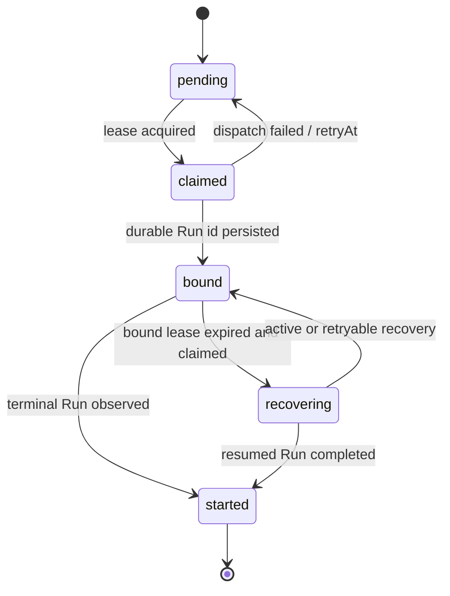

# Scheduler 设计

## 1. 当前边界

Scheduler 是 AIoP 自研控制面，不进入 Pi Agent loop。它只持久化 Fire，并通过 Durable Run dispatcher 创建或关联产品 Run；后续执行由 `packages/pi-runtime` 接管。

| 能力 | 当前路径 |
| --- | --- |
| Cron 与领域模型 | `packages/scheduler-runtime/src/cron.ts`、`packages/scheduler-runtime/src/domain.ts` |
| Fire Store/MySQL | `packages/scheduler-runtime/src/store.ts`、`packages/scheduler-runtime/src/mysql.ts` |
| Claim、dispatch 与完成 | `packages/scheduler-runtime/src/runner.ts` |
| 崩溃补偿 | `packages/scheduler-runtime/src/recovery.ts` |
| 应用装配 | `src/scheduler/runner.ts` |
| 应用循环与兼容封装 | `src/scheduler/cron.ts`、`src/scheduler/ticker.ts`、`src/scheduler/runner.ts` |

## 2. Fire 状态流

`fire_id` 由 `taskId + fireTime` 稳定生成。Run 创建后先持久化 `bound` 关系，再等待终态；Worker 崩溃后，recovery supervisor 领取过期 bound fire，检查原 Run 是 active、terminal 还是 recoverable，避免重复创建。

### 2.1 到期任务的调用链

1. `MemorySchedulerStore` 或 `MysqlSchedulerStore` 根据 task 的 `nextFireAt` 物化稳定 Fire。
2. Runner 领取 `pending` Fire，写入 claim token、worker 和 lease expiry。
3. Dispatcher 以 `fireId` 作为稳定 Run id 调用 `DurableRunRuntime.run()`。
4. `onStarted` 回调先把 Run id 持久化为 `bound`，再等待 `handle.result()`。
5. 正常完成后写 `started + result`；异常释放为 `pending + retryAt`。
6. bound lease 过期时，recovery loop 检查原 Run，必要时调用 `resume()`，不会创建第二个 Run。

## 3. 身份与无人值守策略

- tenant/actor/session 来自持久化任务，不由 prompt 覆盖。
- Scheduler 创建的 Run 使用与 HTTP 相同的 Durable Pi Runtime。
- 未预批准的交互默认不能在后台无限等待；策略应拒绝或将 Run 明确置为 waiting/recovery 状态。
- Tool capability、MCP、Skill 和 Sandbox 仍经过同一治理链。

## 4. 多副本与取消

- Fire claim 与 bound recovery 都使用 token、owner 和 expiry。
- 旧 supervisor 不能完成新一代 Fire。
- 调度任务禁用只阻止新 Fire；代码不会自动取消已绑定 Run。
- 修改 Cron 不回写历史 Fire 时间。

## 5. 测试入口

- `tests/scheduler-runtime/`
- `tests/scheduler.test.ts`
- `tests/scheduler-platform.test.ts`
- `tests/http-agent-runs.test.ts`

## 6. 容易误改的地方

- `started` 表示绑定 Run 已得到最终结果，不表示刚开始执行。
- 禁用 ScheduledTask 只影响新 Fire，不会隐式取消已经 bound 的 Run。
- `fireId` 是幂等键，不能在重试时重新随机生成。
- Scheduler 的 `execution.unattended=true` 不代表自动批准写操作；只有可信创建者显式 preApproved 才改变普通生产写策略。
