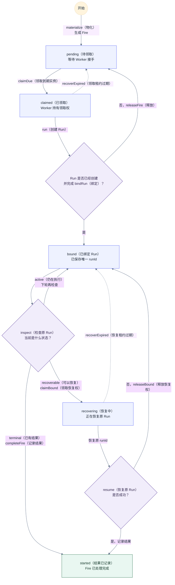
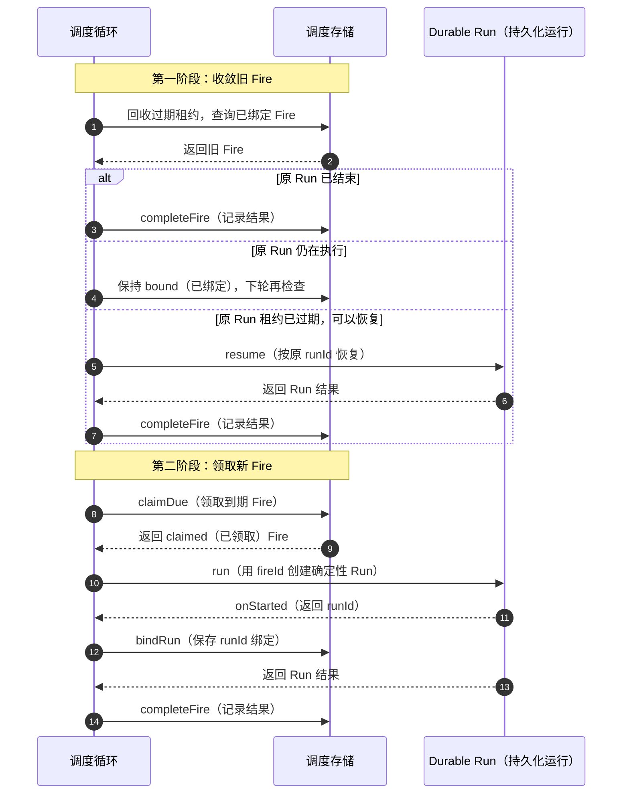
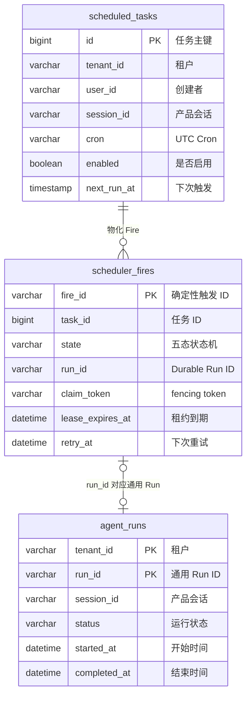

# Scheduler（调度器）定时任务设计

> 状态：当前实现与待优化方案
> 版本：1.1
> 更新日期：2026-08-05
> 适用范围：`packages/scheduler-runtime`、`src/scheduler`、定时任务 HTTP API（HTTP 接口）/Tool（工具）及相关持久化

| 术语 | 中文名称 | 含义 |
| --- | --- | --- |
| Scheduled Task | 定时任务 | 持久化的 Cron、任务内容、执行身份和启用状态 |
| Fire | 触发实例 | 某个计划时间对应的一次执行单 |
| Run | 运行实例 | 一次智能体执行的持久化记录 |
| Durable Run | 持久化运行实例 | 可查询、恢复和取消的 Run |
| tick | 调度轮次 | Scheduler 收敛旧 Fire 并领取新 Fire 的一次循环 |
| claim | 领取 | Worker 临时取得 Fire 的处理权 |
| lease | 租约 | 处理权的有效期；Scheduler Fire 默认 30 秒 |
| fencing | 栅栏校验 | 使用 token 阻止旧 Worker 修改已被重新领取的 Fire |
| Cron | 周期表达式 | 定义计划时间；当前统一按 UTC（协调世界时）计算 |

Scheduler 是定时任务的触发、绑定和恢复控制面。它通过 Durable Run 执行任务，不直接实现模型推理和工具调用。

## 1. 目标、边界与关键决策

### 1.1 目标与边界

- 支持定时任务的创建、查询、修改、启停、删除和立即执行。
- 使用稳定 `fireId`、MySQL 领取、租约和 fencing，避免多副本重复创建 Run。
- Worker 中断后区分“尚未绑定 Run”和“已经绑定 Run”，只恢复原 Run。
- 触发和恢复均保留 tenant（租户）、actor（操作者）、session（会话）及无人值守策略。
- Scheduler 只处理自身创建的 Fire，不负责恢复 HTTP、CLI（命令行接口）等入口创建的全部 Run。
- 当前不提供秒级触发、任务时区、节假日日历和 DAG（有向无环图）编排。

### 1.2 关键决策

| 决策 | 原因 | 影响 |
| --- | --- | --- |
| `fireId = taskId + ":" + fireTime.toISOString()` | 为每次计划触发提供稳定幂等键 | 自动触发时 `fireId` 同时作为 Durable `runId` |
| Fire 与 Durable Run 分别维护租约 | 调度领取和智能体执行属于不同故障域 | Scheduler lease 不能代替 Durable Run lease |
| Run 创建后立即绑定 `runId` | Worker 中断后必须识别已有 Run | 已绑定 Fire 只能观察或恢复原 Run |
| 每轮先收敛旧 Fire，再领取新 Fire | 优先处理悬挂工作 | 旧 Fire 占用本轮 batch（批次配额） |
| Cron 固定使用 UTC | 当前 `cron-parser` 显式指定 `tz: 'UTC'` | 调用方负责本地时间换算 |
| 生产环境只使用 MySQL Store | 多副本需要共享状态和事务领取 | Memory Store 仅用于测试 |

## 2. 程序架构

```mermaid
%%{init: {"theme":"base","flowchart":{"curve":"basis","nodeSpacing":50,"rankSpacing":70,"padding":32,"htmlLabels":true},"themeVariables":{"fontFamily":"Inter, PingFang SC, Microsoft YaHei, sans-serif","fontSize":"18px","lineColor":"#64748b","primaryTextColor":"#1e293b","clusterBkg":"#ffffff","clusterBorder":"#cbd5e1"}}}%%
flowchart LR
    subgraph Bootstrap[服务启动]
        direction TB
        Entry["<div style='width:130px'>AIoP 服务启动</div>"]
        Assembly["<div style='width:170px'>启动 Scheduler<br>内嵌模式【默认】</div>"]
        Entry -->| <div style='width:130px'>Event Loop</div> | Assembly
    end

    subgraph Scheduler[定时任务查询、调度与状态]
        direction TB
        Loop["<div style='width:250px'>调度循环<br>RuntimeSchedulerLoop</div>"]
        Runner["<div style='width:250px'>调度运行时<br>SchedulerRunner</div>"]
        SStore["<div style='width:250px'>调度存储<br>SchedulerStore<br>查询 / 领取 / 状态变更</div>"]
        Cron["<div style='width:250px'>Cron 计算下一次触发时间<br>UTC</div>"]
        MySQL["<div style='width:250px'>MySQL<br>任务 / Fire / Run</div>"]

        Loop -->|定时轮询：30 秒| Runner
        Runner <--> SStore
        SStore -.->|计算下次时间| Cron
        SStore -->|读写| MySQL
    end

    subgraph Execution[定时任务执行]
        direction TB
        Durable["<div style='width:260px'>DurableRunRuntime（持久化运行接口）<br>DurableRunManager（持久化运行管理器）</div>"]
        Pi["<div style='width:230px'>PiAgentSession（智能体执行会话）<br>模型推理 / 工具调用</div>"]

        Durable -->|创建或加载会话| Pi
        Pi -.->|执行结果| Durable
    end

    Assembly -->|启动调度| Loop
    Runner -->|创建或恢复 Run| Durable
    Durable -.->|Run 结果| Runner

    classDef entry fill:#eaf2ff,stroke:#6b8fc7,color:#17324d,stroke-width:1.4px;
    classDef scheduler fill:#fff5df,stroke:#b58a45,color:#493719,stroke-width:1.5px;
    classDef execution fill:#e9f7f1,stroke:#5f967b,color:#173d2e,stroke-width:1.4px;
    classDef data fill:#f1edfb,stroke:#8974b8,color:#332751,stroke-width:1.4px;
    class Entry,Assembly entry;
    class Loop,Runner,SStore,Cron scheduler;
    class Durable,Pi execution;
    class MySQL data;

    style Bootstrap fill:#f8fbff,stroke:#bfd0e7,stroke-width:1px
    style Scheduler fill:#fffcf4,stroke:#e3ca96,stroke-width:1px
    style Execution fill:#f7fcf9,stroke:#b8d8c7,stroke-width:1px
```



| 模块 | 负责 | 是否自研 |
| --- | --- | --- |
| AIoP 服务启动 / Scheduler 装配 | 在 `serve` 进程中创建并启动 Scheduler | **是。** 管理进程生命周期和依赖装配 |
| `RuntimeSchedulerLoop` | 定时 tick、防重入、停止信号和 batch | **是。** 与 AIoP 生命周期绑定 |
| `SchedulerRunner / SchedulerStore` | Fire 物化、领取、状态迁移、绑定和恢复 | **是。** 承载幂等和故障恢复语义 |
| Cron 计算 | 校验 Cron 并计算下一触发时间 | **否。** 使用 `cron-parser`，由平台封装 UTC 边界 |
| `DurableRunRuntime / DurableRunManager` | 提供 `run/resume/cancel/append`，管理 Run 状态、租约和恢复 | **是。** `DurableRunRuntime` 是接口，`DurableRunManager` 是当前实现 |
| `PiAgentSession` | 模型推理和工具调用 | **部分自研。** AIoP 提供适配与治理，复用 Pi Agent 执行内核 |
| MySQL | 保存任务、Fire 和 Run | **否。** 复用事务、行锁和唯一约束；Schema 与 Store Adapter 自研 |

### 2.1 进程模型

- **当前启用**：`npm run serve` 配合 `AIOP_EMBED_SCHEDULER=true`，Scheduler 运行在 HTTP 服务进程的 Node.js 事件循环中，不创建线程或子进程。
- **后续弃用**：`npm run scheduler` 仍可启动独立进程，但不再作为目标部署方式。
- 每个 AIoP 副本均可运行 Scheduler Worker；副本之间通过 MySQL 竞争 Fire。
- 默认每 30 秒 tick，一轮最多处理 10 个 Fire；同一实例不并发执行多个 tick。
- 一个环境只能启用内嵌或独立模式之一。

### 2.2 代码落点

系统全量目录见 [01-system-overview.md](./01-system-overview.md)，这里只列 Scheduler 的直接代码边界。

```text
packages/scheduler-runtime/src/
├── cron.ts                     # UTC Cron 校验与下一触发时间
├── domain.ts                   # Task、Fire、Dispatcher、Recovery 契约
├── store.ts                    # SchedulerStore 与 Memory 实现
├── mysql.ts                    # MySQL 领取、状态迁移和结果落库
└── runner.ts                   # tick、分发、重试和恢复编排
src/
├── scheduler/runner.ts         # 生产装配、Durable Run 适配和调度循环
├── scheduler/ticker.ts         # 旧实现，【待优化】删除
├── tools/schedule.ts           # Agent 定时任务 Tool
├── server/http.ts              # `/v1/schedule*` 和 Scheduler settings API
└── db/migrations/0001_baseline.sql # Scheduler 及 Durable Run 表
tests/
├── scheduler-runtime/          # Scheduler 包合同与 MySQL 测试
├── scheduler.test.ts           # 调度装配和循环
├── scheduler-platform.test.ts  # 产品集成
└── http.test.ts                # HTTP API
```

## 3. 任务与触发语义

### 3.1 定时任务定义

| 字段 | 语义 |
| --- | --- |
| `id` | 任务主键，也是 `fireId` 的组成部分 |
| `tenantId/userId/sessionId` | 执行身份和产品会话绑定 |
| `cron` | UTC Cron 表达式 |
| `title/task` | 展示标题和发送给智能体的输入 |
| `preApproved` | 无人值守预批准；设为 `true` 需要 `approve` 权限 |
| `enabled` | 是否继续物化新 Fire；不影响已经物化或绑定的 Fire |
| `nextRunAt/lastRunAt` | 下一次计划时间和最近一次物化时间 |

任务物化为 Fire 时，输入和身份快照写入 `scheduler_fires.input_json`。后续修改任务不会改变已有 Fire。

### 3.2 Cron 与错过触发

- 使用 `cron-parser@5.5.0`，固定按 UTC 计算。
- 以持久化的 `next_run_at` 作为 `fireTime`，再从该时间计算下一次触发，避免实际 tick 时间造成计划漂移。
- `scheduler_fires.fire_id` 主键保证同一任务、同一计划时间只物化一个 Fire。
- **【待优化】停机补偿**：当前停机期间错过多次会在后续 tick 逐次补齐；目标是只补一次，并把 `next_run_at` 推进到当前时间之后。
- **【待优化】创建校验**：`POST /v1/schedule` 当前只校验 Cron 非空，非法表达式可能在 Store 计算时间时返回 500；应与 PATCH 和 Agent Tool 统一显式校验并返回 400。

### 3.3 自动触发与立即执行

| 维度 | Cron 自动触发 | `POST /v1/schedule/{id}/run` |
| --- | --- | --- |
| 持久化防重 | Fire 主键、claim token、lease、确定性 Run ID | 仅 HTTP 进程内按 `taskId` 防重 |
| Fire | 写 `scheduler_fires` | 当前不写 |
| 响应 | Scheduler 等待 Run 结果 | 立即返回 202，后台执行 |
| 多副本 | MySQL 保证同一 Fire 唯一 | 不同副本可能重复执行 |

**【待优化】**立即执行应建立持久化的 `taskId → runId` 来源关联，并使用数据库幂等控制；这是统一查询 `agent_runs`、删除兼容历史表的前置条件。

## 4. Fire 状态、幂等与恢复



| 状态 | 含义 | 允许的下一步 |
| --- | --- | --- |
| `pending` | Fire 已生成，尚未领取 | `claimDue → claimed` |
| `claimed` | Worker 持有 Fire 租约，准备创建 Run | `bindRun → bound`；未绑定失败或租约过期则回到 `pending` |
| `bound` | Fire 已保存唯一 `runId` | 等待结果、完成，或领取恢复权 |
| `recovering` | Worker 正在恢复原 Run | 完成，或失败/租约过期后回到 `bound` |
| `started` | Run 结果已经记录 | 终态；状态名与实际语义不一致，待改为 `completed` |

核心规则：

- 首次执行异常时，只有 `bindRun` 尚未成功才调用 `releaseFire`；已经绑定则保留 `runId`。
- `recoverExpired` 不探测 Worker 进程。它根据 `leaseExpiresAt` 回收过期领取：`claimed → pending`，`recovering → bound`。
- `claimDue/claimBound` 签发新 `claimToken`；所有状态推进校验 state + token，旧 Worker 的写入失效。
- Scheduler Fire 和 Durable Run 各自维护租约。只有 Durable Run 租约失效后，Scheduler 才恢复原 Run。
- 相同 `fireId/runId` 重复完成是 no-op；不同 Run 不能覆盖已有绑定。

## 5. Tick、绑定与故障恢复



- bound Fire 优先占用本轮 batch；剩余容量才用于新 Fire。
- 已绑定 Fire 只观察或恢复原 `runId`，不得创建第二个 Run。
- `runtime.run()` 结果不明时，`ScheduledRunLookup` 只有在确认 `fireId` 对应 Run 存在且 tenant、actor、session 一致后才补做绑定。
- `waiting` 当前按错误结果完成 Fire，不会自动处理 Interaction（交互等待）后继续运行。【待优化】应由显式 resolve/resume 流程衔接。

## 6. 数据模型与事务

下图表示【待优化】后的目标核心模型。计划删除的 `task_agent_runs` 和 `task_runs` 不在图中展示。



### 6.1 表职责

| 表 | 性质 | 用途与关键约束 |
| --- | --- | --- |
| `scheduled_tasks` | Scheduler 核心表 | 保存任务定义；PK `id`；`(enabled,next_run_at)` 支持到期查询 |
| `scheduler_fires` | Scheduler 核心表 | Fire 状态事实源；PK `fire_id`；按 state/retry、state/lease、task/time 和 tenant/run 建索引 |
| `agent_runs` | 平台通用表 | Durable Run 主记录；PK `(tenant_id,run_id)`；保存状态、会话、租约、用量和结果 |
| `tenant_settings` | 平台通用表 | 保存 `scheduler.default.maxRunMs` 等租户配置 |
| `task_agent_runs` | 当前兼容表 | 与 `scheduler_fires.task_id/run_id` 重复；**【待优化】删除** |
| `task_runs` | 当前兼容表 | 与 `scheduler_fires + agent_runs` 重复；**【待优化】删除** |

### 6.2 执行历史与会话历史

| 数据 | 表与字段 | 说明 |
| --- | --- | --- |
| Run 主记录 | `agent_runs.run_id/status/session_id` | 通用执行历史事实源 |
| Run 与 Pi 会话关联 | `agent_turn_commits.run_id/pi_session_id/pi_leaf_id/pi_entry_seq` | 定位某轮提交使用的 Pi 会话分支 |
| Pi 会话元数据 | `pi_sessions.current_leaf_id/committed_leaf_id` | 标记当前和已提交叶节点 |
| 原始会话历史 | `pi_session_entries.entry_json` | 保存消息、工具调用等会话树内容；`entry_seq` 表示顺序 |
| 产品消息投影 | `messages.role/content` | 面向页面的扁平消息视图，不是事实源 |

产品 `sessionId` 保存在 `scheduled_tasks.session_id`、`scheduler_fires.session_id` 和 `agent_runs.session_id`。Pi 内部使用 `piSessionStorageId(actorId, sessionId)` 生成隔离后的 `pi_session_id`。

**【待优化】会话投影：**Scheduler 当前不会在 Run 成功后调用 `projectCommittedPiSession()`，因此 `pi_session_entries` 已有历史时，产品 `messages` 仍可能未同步。

### 6.3 事务与迁移

当前事务边界：

- 物化 Fire 与推进任务下一触发时间在同一事务完成。
- `bindRun` 与兼容表 `task_agent_runs` 写入在同一事务完成。
- `completeFire` 与兼容表 `task_runs` 写入在同一事务完成。
- Durable Run 与 Scheduler 表不共享事务；通过确定性 `runId`、lookup 和恢复流程收敛。

目标迁移顺序：

1. 立即执行补充持久化的任务来源关联，并让历史查询支持 `scheduler_fires JOIN agent_runs`。
2. 双写、双读核对后停止写入 `task_agent_runs/task_runs`。
3. 保留一个发布周期的回退窗口，再删除兼容表。

当前没有数据库外键，关联完整性由应用维护；`scheduler_fires.state` 的合法值由条件更新保证。

## 7. HTTP API

字段级模型见 [12-http-api-reference.md](./12-http-api-reference.md)。

| 方法与路径 | 用途 | 权限与当前语义 |
| --- | --- | --- |
| `GET /v1/schedule` | 查询任务 | 普通用户仅本人；管理员本租户 |
| `POST /v1/schedule` | 创建任务 | `task:create`；预批准另需 `approve`；Cron 校验待修复 |
| `PATCH /v1/schedule/{id}` | 修改任务 | Cron 变化时重算 `nextRunAt` |
| `POST /v1/schedule/{id}/enable\|disable` | 启停任务 | 当前任务不存在也返回 200，【待优化】返回 404 |
| `DELETE /v1/schedule/{id}` | 删除任务 | 当前为硬删除；关联清理不完整 |
| `GET /v1/schedule/{id}/runs` | 查询执行历史 | 当前读取兼容表 `task_runs` |
| `POST /v1/schedule/{id}/run` | 立即执行 | 202 只表示后台启动；多副本防重待优化 |
| `GET/POST /v1/settings/scheduler` | 查询或修改最大运行时间 | `tenant:manage`；默认 4 小时 |

## 8. 非功能设计

### 8.1 安全与租户隔离

- 自动触发始终使用任务保存的 tenant、actor 和 session，不使用 Scheduler 进程身份。
- 普通用户只能管理本人任务；管理员只能管理本租户任务。
- `preApproved=true` 需要 `approve` 权限，且不绕过 RBAC（基于角色访问控制）、工具治理和基础设施权限。
- 恢复前校验 tenant、actor、session 和 `runId` 绑定，避免恢复其他用户的 Run。
- 停用或删除任务不自动取消已经绑定的 Run。

### 8.2 性能与容量

| 项目 | 当前行为 | 风险 |
| --- | --- | --- |
| 触发延迟 | 默认 30 秒轮询 | 正常延迟约 0～30 秒，不适合实时调度 |
| 单轮容量 | 默认 batch 10，旧 Fire 与新 Fire 共用 | 大量恢复任务会推迟新任务 |
| 多副本领取 | MySQL `FOR UPDATE`，未使用 `SKIP LOCKED` | 高并发下可能串行等待，需要压测 |
| 数据保留 | Fire 和执行历史无归档策略 | 表容量持续增长 |

### 8.3 可观测性

当前可通过启动日志、tick error 和 `scheduler_fires.attempts/retry_at/last_error/claim_owner/lease_expires_at` 排查问题。Durable Run 另有事件、Attempt（执行尝试）、Turn（执行轮次）、usage（用量）和租约记录。

**【待优化】**增加 due lag、各 Fire 状态数量、重试次数、执行时长、完成率、积压和长期停留告警，并统一 Scheduler 与 Durable Run 的 correlation ID（关联标识）。

### 8.4 配置

| 配置 | 默认值 | 说明 |
| --- | --- | --- |
| `AIOP_EMBED_SCHEDULER` | disabled | `true/1` 时在 `serve` 进程中启动 Scheduler |
| `intervalMs` | 30000 | tick 间隔，仅程序化配置 |
| `batch` | 10 | 单轮最大处理量 |
| `leaseMs` | 30000 | Fire 领取和恢复租约 |
| `retryDelayMs` | 30000 | 失败后的下次观察或领取时间 |
| `scheduler.default.maxRunMs` | 4 小时 | 租户级最大运行时间 |

## 9. 开源依赖与发布

| 组件 | 版本 | 功能 | Star | License | 选择原因 | 风险与隔离方式 |
| --- | --- | --- | --- | --- | --- | --- |
| `cron-parser` | 5.5.0 | Cron 校验和下一时间计算 | 1,484（2026-08-04） | MIT | API 边界小，支持时区 | 锁定版本并通过 `cron.ts` 封装 |

构建和测试环境部署统一使用：

```bash
make image
make deploy-staging
```

部署只启用内嵌 Scheduler。独立 `npm run scheduler` 入口在完成兼容清理后删除。

## 10. 风险与实施顺序

### 10.1 风险清单

| 优先级 | 【待优化】事项 | 验收点 |
| --- | --- | --- |
| P0 | 创建接口未显式校验 Cron | 非法 Cron 稳定返回 400 |
| P0 | 删除任务未完整处理 Fire 和兼容关联 | 明确软删除或事务级清理；覆盖删除后查询与恢复 |
| P1 | 立即执行缺少持久化幂等 | 多副本下同一请求只创建一个 Run |
| P1 | `task_agent_runs/task_runs` 与核心表重复 | 历史查询切换到 `scheduler_fires + agent_runs` 后删除兼容表 |
| P1 | Scheduler 不同步产品会话投影 | 成功执行后 `messages` 与 committed Pi 会话一致 |
| P1 | 停机期间错过多次会逐轮补齐 | 同一任务恢复后只补一次 |
| P1 | 无任务时区、归档和 Scheduler 指标 | 支持 IANA 时区；建立保留策略和积压告警 |
| P2 | `started` 状态名、旧 ticker 和独立 CLI 增加维护成本 | 状态迁移兼容；移除无生产引用的旧入口 |

### 10.2 实施顺序

| 阶段 | 内容 | 验收与回退 |
| --- | --- | --- |
| 1. 正确性 | Cron 校验、删除语义、停机只补一次 | 单元与 MySQL 合同测试通过；无 Schema 变更，可直接回退 |
| 2. 执行统一 | 立即执行持久化幂等、会话投影、历史双读 | 自动和手动历史一致；保留兼容表作为回退 |
| 3. 清理 | 停止兼容双写、删除重复表、旧 ticker 和独立 CLI | 观察一个发布周期后执行迁移；回滚时恢复读旧表版本 |
| 4. 运维能力 | 时区、归档、指标和告警 | 压测、容量和告警演练通过 |
