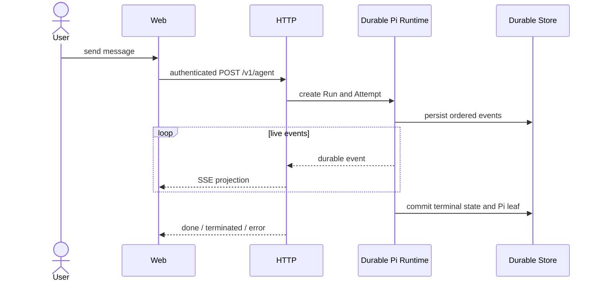

# HTTP API 与 Web 设计

本文描述当前 Pi-only Durable Run 的 HTTP/SSE 与 React Web 行为。

## 1. HTTP 服务

`src/server/http.ts` 使用 Node.js HTTP Server 提供静态资源、健康检查、认证回调、JSON API、文件下载和 Agent SSE。精确方法、路径和 DTO 以该文件、`web/src/api.ts` 与 HTTP tests 为准。

主要接口族：

| 分组 | 能力 |
| --- | --- |
| Auth | Local、OIDC、AIOS exchange 与当前用户 |
| Sessions | 会话、消息、上下文/用量、append、terminate |
| Agent | 创建 Durable Pi Run 与 SSE 事件 |
| Runs | 列表、详情、事件 replay、取消、恢复 |
| Interactions | approval/question/plan 查询与解析 |
| Skills/MCP/Sandbox | 产品扩展与运行设置 |
| Schedule | 任务 CRUD、Fire 与 Run 记录 |
| Admin/Settings/Audit | 多租户控制面 |

### 1.1 路由处理顺序

`src/server/http.ts` 当前是单一 Node HTTP handler，处理顺序对安全有影响：

1. 解析 method/path；先处理无需认证的 health、浏览器 stream view、能力下载 URL 和静态资源。
2. 处理 Local/OIDC/AIOS 登录入口。
3. 其余 API 在各分支内调用 `requireAuth()`，再做 permission/ownership 校验。
4. handler 调用 Runtime/Store/Tool 服务，统一把领域错误映射为 HTTP JSON 或 SSE event。
5. response 已销毁时停止写网络流，但不能据此取消 durable work。

新增路由时必须明确放在哪个阶段，避免把管理 API 错放到认证前分支。

`/healthz` 用于存活探针，`/readyz` 用于就绪探针。staging 的 Web 容器把 API/SSE 反向代理到同 Pod backend。

## 2. Agent SSE 与 Durable Run



SSE 客户端断开只会 detach 响应；HTTP handler 停止向已销毁 response 写数据，但 Durable Run、Pi Session 和事件持久化继续执行。断开本身不会请求取消，也不会触发 Agent AbortSignal。

只有显式 session terminate、Run cancel、deadline、shutdown 或 durable fencing 才进入取消/中止语义。断线客户端可通过 `GET /v1/agent/runs/{runId}/events`，结合 `Last-Event-ID` 或 `?after=<sequence>` 补发持久事件。该接口返回一次有限 SSE replay 后结束，不是新的 live subscription。

对应行为由 `tests/http.test.ts` 中 “detaches a closed SSE response while the durable run continues and remains replayable” 锁定。

## 3. Append、取消与恢复

- 活跃同 Worker Run 可由 Pi `steer`/`followUp` 接收 append。
- 跨 Worker append 写入 durable inbox，由当前 lease owner 领取。
- terminate/cancel 是持久状态，不依赖原 SSE 连接仍存在。
- `POST /v1/agent/runs/{runId}/resume` 创建受 fencing 保护的新 Attempt；未知非幂等副作用仍保持 `recovery_required`，需要明确处理后再恢复。
- Interaction 解析必须匹配 tenant、actor、run、interaction 与 pending state。

## 4. Web 页面

React 应用位于 `web/src/`，当前主要页面包括：

- Chat：消息、流式事件、Tool 状态、append 与 terminate；
- Runs：Attempt、Turn、Timeline、Interaction、Ledger、取消与恢复；
- Skills、MCP、Schedule、Sandbox：扩展与运维入口；
- Users、Settings：管理控制面。

Run Center 组件是 `web/src/components/run-center-page.tsx`。Markdown/Mermaid 渲染属于展示层；Tool output、终端预览和模型文本都不是审计事实。

## 5. 前端状态与安全

- 认证失败清理登录态；权限必须由服务端再次校验。
- 新 SSE 事件应允许旧前端忽略；字段变更同步更新 `web/src/types.ts`、parser 和 HTTP tests。
- 运行中心从持久化数据恢复，不能只依赖浏览器内存中的 live stream。
- API error、Tool output、MCP header、Sandbox 路径和 Credential 必须脱敏。
- 文件下载与截图使用受控 capability URL，不暴露任意文件系统路径。

### 5.1 前端数据流

```text
App state / page component
  → web/src/api.ts 统一附加 Bearer Token
  → JSON API 或 POST /v1/agent SSE
  → parser 更新消息、Tool 状态和 Run id
  → Run Center 再从 durable API 重建详情
```

live chat state 是交互优化，不是事实源。刷新页面或切换副本后，页面必须能从 Sessions、Messages 和 Run Center API 恢复可解释状态。

## 6. 测试与源码

Run Center 的当前稳定 HTTP 面：

| 方法 | 路径 | 语义 |
| --- | --- | --- |
| POST | `/v1/agent` | 创建 Durable Pi Run，并以 SSE 返回 live projection |
| GET | `/v1/agent/runs` | 按状态、session、分页查询 Run |
| GET | `/v1/agent/runs/{runId}` | 查询 Run、Attempt、Turn、Interaction、Tool 与 Timeline |
| GET | `/v1/agent/runs/{runId}/events` | 按 sequence 重放 durable event |
| POST | `/v1/agent/runs/{runId}/cancel` | 持久化取消请求 |
| POST | `/v1/agent/runs/{runId}/resume` | 恢复 waiting/failed/recovery_required Run |

- HTTP/SSE：`tests/http.test.ts`、`tests/http-agent-runs.test.ts`
- DTO projection：`tests/contracts/http-projection.test.ts`
- Web source/interaction：`tests/frontend.test.ts`、`tests/web-run-center-source.test.ts`
- Server：`src/server/http.ts`、`src/server/context.ts`、`src/server/downloads.ts`
- Web：`web/src/App.tsx`、`web/src/api.ts`、`web/src/types.ts`

## 7. API 修改联动项

- 修改请求/响应字段：同步 `web/src/types.ts`、API parser、HTTP tests 和 projection tests。
- 新增 SSE event：旧前端应能忽略；事件必须有稳定 sequence，replay 与 live projection 语义一致。
- 新增 Run 动作：同时定义可操作状态、ownership、幂等、审计和并发冲突错误。
- 新增下载/预览：使用 capability URL、过期与 containment，不开放任意静态目录。
