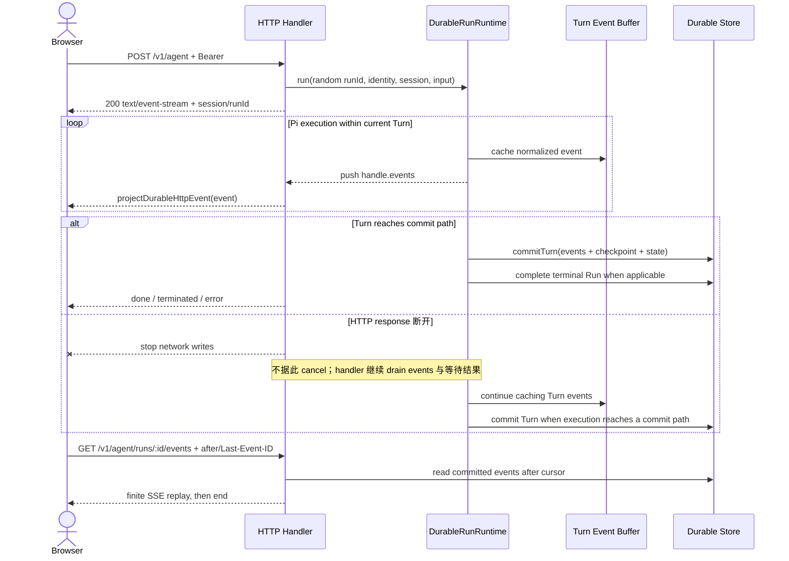
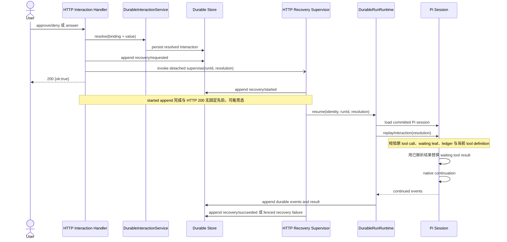

# HTTP API 与 Web 设计

> 状态：当前设计
> 验证基线：`b5425a0d2ae3ddc23ada4d3184d4a95e3a717bae`
> 最后核对：2026-08-03
> 适用范围：`pi-agent-platform-integration` 当前实现

本文是当前 HTTP/SSE 与 React Web 的架构总览，不构成独立的外部稳定版本承诺。精确方法、字段、校验与响应以 `src/server/http.ts`、Web client 和测试为准；字段级 HTTP Reference 见 `12-http-api-reference.md`。

## 1. HTTP 服务边界

`src/server/http.ts` 使用 Node.js HTTP Server，在单一 handler 中提供健康检查、认证、静态资源、JSON API、能力 URL 下载和 Agent SSE。除少数显式公开入口外，`/v1` 路由在各处理分支调用 `requireAuth()`，并继续执行 permission、tenant、owner 或资源 binding 校验。

公开入口包括 `/healthz`、`/readyz`、浏览器 stream view、签名文件下载、Web 静态资源以及 Local/OIDC/AIOS 登录流程。两个健康端点当前都只返回 `{ ok: true }`；就绪检查不探测下游组件。

错误由当前 handler 按具体分支映射为 JSON 或 SSE；虽然常见 400/401/403/404/409/5xx，异常文本和所有状态码组合不是本文承诺的稳定契约。

## 2. 当前路由分组

| 分组 | 认证 | 主要路径 | 交互语义 |
| --- | --- | --- | --- |
| health / auth | health、静态资源和部分 capability URL 无 Bearer；用户 API 需认证 | `/healthz`、`/readyz`、`/auth/login`、`/auth/oidc/*`、`/auth/aios/exchange`、`/v1/me`、`/v1/files/:token` | 同步 JSON、OIDC 回调、文件/媒体响应 |
| agent runs / Run Center | Bearer；按 tenant/owner/RBAC | `POST /v1/agent`、`/v1/agent/runs*`、`.../cancel`、`.../resume`、`.../events` | live SSE、同步查询、持久化动作；resume 返回 202 后后台监督 |
| sessions | Bearer；会话所有权 | `/v1/sessions`、`/:id/messages`、`/:id/context`、`/:id/usage`、`/:id/append`、`/:id/terminate` | 同步 JSON；append 可进入活动 Run 或 durable inbox；terminate 显式取消 Run |
| approvals / questions | Bearer；approval 另需 `approve` 权限；resolve 校验 Interaction binding | `/v1/approvals`、`/:id/approve|deny`、`/v1/questions`、`/:id/answer` | 同步 resolve，随后按条件异步恢复 Pi Run |
| skills | Bearer；管理动作按所有权和管理员角色 | `/v1/skills/import`、`/:name/files`、`review`、`share|unshare`、`enable|disable`、删除 | 同步 JSON；导入、审核与可见性由服务端治理 |
| MCP | Bearer；写操作需 tenant 管理权限 | `/v1/mcp/servers`、`/:name/reconnect`、删除 | 同步 JSON，持久化配置或连接管理 |
| tools | Bearer；服务端策略与 capability 检查 | `/v1/tools`、`POST /v1/tools/call` | 同步目录或直接调用；需要交互时返回当前 handler 定义的错误 |
| sandbox / browser | Bearer；stream view 本身是公开展示入口 | `/v1/sandboxes`、`/v1/sandbox/run-*`、`/v1/browser/*` | 同步 JSON 工具调用、浏览器预览 HTML |
| settings | Bearer；tenant/platform 管理权限按路由校验 | `/v1/settings/llm*`、`/v1/settings/sandbox*`、`/v1/settings/scheduler` | 同步读取/更新；模型测试和模板刷新可能访问下游系统 |
| schedule | Bearer；变更需 `task:create`，预批准还需 `approve` | `/v1/schedule`、`/:id/runs`、`enable|disable`、`/:id/run` | CRUD 同步 JSON；手动 run 返回 202，结果后续写 task runs |
| audit / admin | Bearer；审计和管理权限 | `/v1/audit`、`/v1/admin/tenants`、`/v1/admin/users*` | 同步 JSON；tenant/user 管理与审计查询 |

## 3. 两类 SSE

### 3.1 `POST /v1/agent`：live execution SSE

请求通过认证和同 Session 活动 Run 检查后创建随机 `runId` 的 Pi Durable Run。运行中，runtime 将规范化 event 同时加入当前 Turn 的内存待提交数组并 push 到 `handle.events`；HTTP handler 消费该 stream，投影为聊天所需的 `session`、文本/思考增量、Tool、usage、压缩、终止、错误和 done 事件。Turn 进入 succeeded、waiting、failed、cancelled 或 recovery_required 提交路径时，才通过 `commitTurn()` 把该 Turn 的 events、checkpoint、状态及相关事实批量持久化。

这是当前请求对应的 live projection。网络 response 已销毁时 `sse()` 停止写入，但 handler 仍继续 drain Run event stream 并等待结果；换言之，SSE 客户端断开只会 detach 响应，不会触发 Durable cancel 或 Agent AbortSignal。只有已成功提交的 Turn events 才保证可由 durable replay 读取，断连前已展示但尚未提交的 delta 不具备 replay 保证。显式 Run cancel、Session terminate、deadline、shutdown 或 Durable fencing 才进入相应中止语义。

### 3.2 `GET /v1/agent/runs/:id/events`：durable event replay

该接口读取已持久化的 Run events，接受 `?after=<sequence>`，缺省时也读取 `Last-Event-ID`，只返回 sequence 严格大于游标的事件。响应使用 SSE 编码和 event `id`，写完当前有限结果集后 `res.end()`。

因此它是 durable replay 接口，不是 `POST /v1/agent` 的 live 流，也不是持续等待新事件的 subscription。客户端可再次携带新游标请求后续事件。

## 4. HTTP、Durable Event 与断连

live SSE 是运行中投影，不替代 Durable Store。Run Center、断线补读和审计解释从已提交记录重建；尚未随 Turn commit 的 live delta 即使曾到达浏览器，也不保证出现在 replay 中。

## 5. Interaction resolve 与 Pi 恢复

approval/question/plan 的 HTTP resolve 先由 `DurableInteractionService` 校验 tenant、actor、session、run、interaction 和 pending/已解析状态。对于 Pi Run，新解析的 Interaction 会写入 `recovery/requested` durable event，并异步启动 `superviseDurableRecovery()`；重复 resolve 只有在 Run 已是 `recovery_required` 时才再次调度恢复。

这里的“replay”是 Pi 对已提交 waiting 分支的受校验 Interaction replay，随后才进入原生 continuation；它不是把 HTTP SSE 文本重新喂给模型。handler 会等待 `recovery/requested` 持久化，随后调用但不等待 detached supervisor，再发送 200；supervisor 内部 `recovery/started` 的 append 与 response 完成可能竞态。恢复过程持续消费 `handle.events`，防止因没有 HTTP listener 而阻塞运行时事件流。

## 6. Web 架构

Web 是 React 19.2 + TypeScript + Vite 7 SPA。`web/src/App.tsx` 维护页面和交互状态，`web/src/api.ts` 为 JSON API 统一附加 Bearer token；Agent live SSE 由 Chat 页面直接使用 `fetch()` 和流式 reader 解析。

当前一级页面以 `PageId` 和 `NAV_ITEMS` 为准：

| 页面 | 当前职责 |
| --- | --- |
| Chat | 会话历史、消息与附件、live SSE、append/terminate、问题卡片、Sandbox/浏览器侧栏 |
| Runs | Run Center 列表、筛选、轮询、Attempt/Turn/Timeline/Interaction/Tool 详情、cancel/resume |
| Skills | 技能导入、查看与治理入口 |
| MCP | MCP Server 和工具管理入口 |
| Schedule | 定时任务、启停、编辑、手动执行与运行记录 |
| Sandbox | Sandbox 实例与 profile 展示 |
| Users | 管理员用户控制面 |
| Settings | LLM、Sandbox 和 Scheduler 设置 |

### 6.1 认证与前端状态

- JWT 保存于 localStorage 的 `aiop_token`，JSON client 和 Agent SSE 请求均发送 `Authorization: Bearer <token>`。
- JSON client 或 Agent 请求遇到 401 时调用统一登录跳转，清空内存 token 与 `aiop_token`。
- 当前用户改变时，前端清理上一账号的消息缓存、Session 锚点、上下文、Interaction 和终端/浏览器状态；服务端 RBAC 仍是最终安全边界。
- live chat state 是交互缓存；会话消息和 Run Center 通过持久 API 重建，不能把浏览器内存当事实源。

### 6.2 Run Center 与内容渲染

`web/src/components/run-center-page.tsx` 使用 Run list/detail API，非终态或动作处理中每 5 秒轮询。详情展示 Attempt、Committed Turn、Timeline、Interaction 和 Tool，并只在服务端投影允许时启用 cancel/resume。

Assistant Markdown 使用 `react-markdown`，禁用原始 HTML。Mermaid 代码块由 `mermaid-diagram.tsx` 动态加载 Mermaid，以 `securityLevel: strict` 渲染；流式语法不完整时保留上次成功 SVG，尚无成功结果则回退显示源码。

## 7. Nginx 拓扑

生产 Web 容器由 Nginx 提供 SPA 静态资源，并把 `/auth/`、`/v1/`、`/healthz`、`/readyz` 代理到同 Pod 的 `127.0.0.1:8081` backend。SPA 路由使用 `try_files ... /index.html`。

`/v1/` 代理明确设置：

- `proxy_http_version 1.1`；
- `proxy_buffering off` 和 `proxy_cache off`，避免 SSE 被代理缓冲；
- `proxy_read_timeout 3600s`，支持长执行响应；
- `Connection ""`，并传递 Host 与 X-Forwarded-For；
- `client_max_body_size 128m`，后端仍按具体路由二次限制。

## 8. 事实源与变更联动

- HTTP：`src/server/http.ts`、`src/server/context.ts`、`src/server/downloads.ts`
- Web：`web/src/App.tsx`、`web/src/api.ts`、`web/src/types.ts`、`web/src/app-data.ts`
- Run Center / Mermaid：`web/src/components/run-center-page.tsx`、`web/src/components/mermaid-diagram.tsx`
- Proxy：`web/nginx.conf`
- 测试：`tests/http.test.ts`、`tests/http-agent-runs.test.ts`、`tests/contracts/http-projection.test.ts`、`tests/frontend.test.ts`、`tests/web-run-center-source.test.ts`

修改请求/响应字段时，应同步 Web types、parser、HTTP/projection tests 和 `12-http-api-reference.md`；新增 durable event 时应保持 sequence/replay 语义，并让旧前端能忽略不认识的展示事件。
