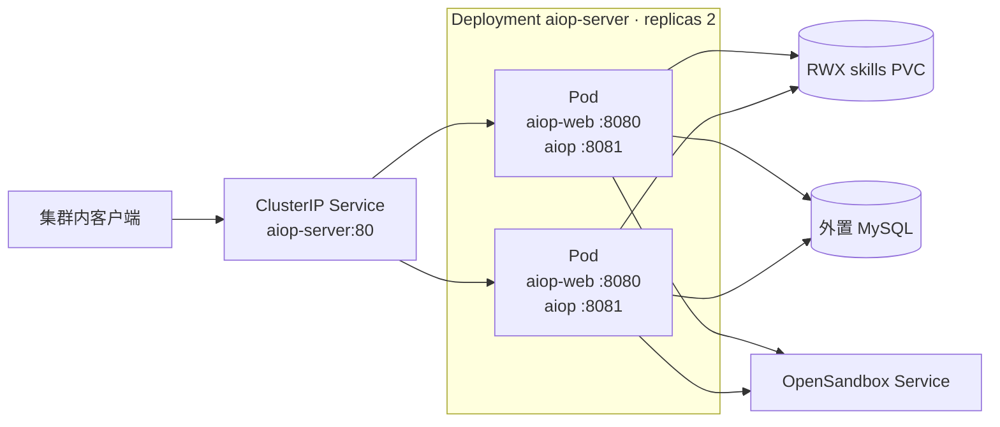
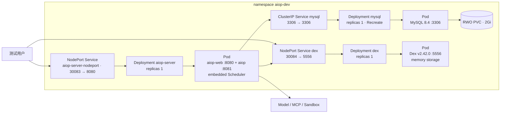

# 部署与可观测性设计

> 状态：当前设计
> 验证基线：`b5425a0d2ae3ddc23ada4d3184d4a95e3a717bae`
> 最后核对：2026-08-03
> 适用范围：`pi-agent-platform-integration` 当前实现

本文描述仓库已有的镜像、Kubernetes 清单、发布入口和观测能力。清单是部署基线，不等同于经过生产验证的高可用方案。

## 1. 镜像与进程模型

### 1.1 Backend

根目录 `Dockerfile` 使用 Node 24 slim。构建阶段安装根 workspace 依赖并执行 `npm run build:packages`，将内部 `packages/*` 构建结果带入 runtime 阶段。runtime 仍保留开发依赖，通过 `tsx` 直接执行 TypeScript，而不是运行 `tsc` 生成的应用 JavaScript。

同一镜像支持两个常驻入口：

- `npm run serve`：启动 HTTP/SSE 服务；设置 `AIOP_EMBED_SCHEDULER=true` 时在服务进程内嵌 Scheduler。
- `npm run scheduler`：启动独立 Scheduler 进程。

当前 Kubernetes 清单使用 `serve` 并内嵌 Scheduler，没有部署独立 Scheduler workload。

### 1.2 Web

`web/Dockerfile` 在 Node 24 slim 阶段执行 Vite build，再把 `web/dist` 复制到 Nginx 1.27 Alpine。Nginx 监听 8080：静态资源和 SPA fallback 由 Nginx 提供，`/auth/`、`/v1/`、`/healthz`、`/readyz` 反向代理到同 Pod 的 Backend 8081。

## 2. 通用 Kubernetes 基线

`deploy/k8s/` 面向 namespace `aiop`，部署关系如下。

当前边界：

- Deployment 声明 2 replicas；每个 Pod 同时包含 `aiop-web` 与 `aiop` 两个容器。
- Service 类型为 `ClusterIP`，只提供集群内入口。仓库没有通用 Ingress、Gateway 或外部 LoadBalancer 清单。
- 两个 Backend 副本共享 `ReadWriteMany` 的 `aiop-skills` PVC；存储系统必须提供 RWX。
- MySQL 通过 Secret 中的连接信息外置，通用清单不部署 MySQL。
- ConfigMap 默认把 Sandbox 指向集群内 OpenSandbox endpoint，但 OpenSandbox 本身不由该目录安装。
- 仓库没有 HPA。副本数固定为 2，不会按负载自动扩缩。

2 replicas 只消除了单个应用 Pod 这一处单点，不代表端到端高可用。MCP 连接、Sandbox handle、下载与部分 live 交互仍有进程本地状态；外置 MySQL、RWX 存储、OpenSandbox 和集群入口各自也需要独立的可用性设计。

## 3. dev/staging 基线

`deploy/dev-k8s/` 面向 namespace `aiop-dev`，用于当前 Makefile 的 staging 操作。

该环境的明确约束：

- `aiop-server` Deployment 为单副本；Pod 内含 `aiop-web` 8080 与 `aiop` 8081 两个容器，并通过 `AIOP_EMBED_SCHEDULER=true` 内嵌 Scheduler。
- 应用 NodePort Service 将 30083 转发到 Web 8080。
- Dex 使用 `ghcr.io/dexidp/dex:v2.42.0`，容器与 Service 端口均为 5556，NodePort 为 30084；配置使用 memory storage，没有 PVC。
- MySQL 使用 `mysql:8.4`，容器与 ClusterIP Service 端口均为 3306；单副本 Deployment 使用 `Recreate` 策略和 2Gi `ReadWriteOnce` PVC。
- dev 清单没有挂载通用环境的 RWX skills PVC，也不构成生产容量或灾备基线。

## 4. 构建、部署与回滚

根目录 Makefile 提供以下入口：

| 命令 | 当前行为 | 边界 |
| --- | --- | --- |
| `make image` | 以 Git short SHA 为默认 tag 构建 Backend 与 Web 镜像；执行内部 package import smoke 和 Node 版本校验 | 只构建本地镜像，不发布、不部署 |
| `make deploy-staging` | apply `deploy/dev-k8s/` 中 namespace、MySQL、Dex、ConfigMap、NodePort Service、RBAC；检查预置 Secret；以 `kubectl set image --local` 注入镜像并等待三个 Deployment rollout | 只面向 `aiop-dev`；不会创建 Secret |
| `make rollback-staging` | 对 `aiop-dev/deployment/aiop-server` 执行 `rollout undo`，可用 `ROLLBACK_REVISION` 指定 revision，并等待 rollout | 只回滚应用 Deployment revision |

应用 rollback 不回滚数据库。当前 `src/db/migrations/` 只有 `0001_baseline.sql`，测试把它定义为 fresh database baseline；它不是从任意历史数据库自动升级到当前 schema 的转换方案。对非空旧库发布前，必须另行完成 schema 识别、转换、备份恢复和应用兼容性验证。

`deploy/k8s/secret.example.yaml` 与 `deploy/dev-k8s/aiop-secret.example.yaml` 只用于说明部分字段，包含占位值，不应直接作为自动部署输入。尤其是通用 `deploy/k8s/secret.example.yaml` 当前没有列出 `AIOP_SETTINGS_SECRET`，但 Deployment 会通过 `envFrom: aiop-secrets` 加载该值；若生产操作者按示例原样创建 Secret，应用不会 fail-fast，而会告警后静默使用固定开发占位密钥 `dev-insecure-settings-secret` 加密持久化 Sandbox settings secret。生产部署必须在 `aiop-secrets` 中额外注入独立强随机 `AIOP_SETTINGS_SECRET`，不能把当前示例视为完整的生产 Secret 清单。

`make deploy-staging` 会执行 `kubectl get secret aiop-dev-secrets -o name`，只查询资源名称以验证 Secret 存在；它不读取或输出 Secret data、不 decode、不创建 Secret，也不 apply 示例 Secret。

## 5. 健康检查

- `GET /healthz`：当前固定返回 `{ ok: true }`，表示 HTTP handler 可响应。
- `GET /readyz`：当前同样固定返回 `{ ok: true }`。
- Nginx 将两个路径代理到 Backend；Kubernetes 的 Web 与 Backend probes 最终都依赖这些 Backend handler。

`readyz` 不检查 MySQL、Model Provider、MCP、Sandbox、Scheduler 或 RWX 存储，因此只能作为浅层进程就绪信号，不能证明依赖可用。dev MySQL 有独立的 `mysqladmin ping` readiness probe，但该结果没有汇总进应用 `readyz`。

## 6. 当前可观测性

| 能力 | 当前实现 | 能回答的问题 |
| --- | --- | --- |
| 结构化日志 | Pino，支持 `LOG_LEVEL`，各子系统创建 child logger | 进程诊断、错误和生命周期事件 |
| 审计事件 | `AuditSink` 同时写 Pino audit log 与 Store；覆盖 policy、kubectl、sandbox、usage、auth、MCP 类别 | 谁在何租户执行了受治理动作 |
| Run Center | Store 持久化并查询 Run、Attempt、Turn、Event、Interaction、Tool execution、usage、取消与人工 resume 事实 | 单个 Durable Run 的时间线、消耗、等待和恢复状态 |
| 健康端点 | `/healthz`、`/readyz` | HTTP 进程是否可响应；不覆盖依赖健康 |

日志、审计与 Run Center 是不同证据面：日志面向运行诊断，审计面向治理事实，Run Center 面向 Durable Run 的业务执行事实；三者不能互相替代。

## 7. 尚未实现的观测与恢复能力

当前仓库没有：

- Prometheus metrics endpoint 或应用指标 exporter；
- OpenTelemetry tracing 与 exporter；
- `ServiceMonitor` 或 `PodMonitor`；
- 汇总 MySQL、Model、MCP、Sandbox 等依赖状态的 readiness；
- 面向所有过期 Durable Run 的通用 lease scanner / recovery supervisor。

Scheduler 已有自己的 Fire 租约回收和 bound Run 检查，不等同于扫描所有 HTTP、CLI 与 Scheduler 来源 Run 的通用恢复器。增加指标、追踪或自动恢复前，需要先定义标签基数、租户信息脱敏、告警阈值、恢复安全分类和故障测试，不能仅凭端点或表字段宣称能力完成。

## 8. 事实依据

- 镜像与入口：`Dockerfile`、`web/Dockerfile`、`web/nginx.conf`、`package.json`、`src/index.ts`
- 通用部署：`deploy/k8s/deployment-server.yaml`、`service.yaml`、`pvc-skills.yaml`、`configmap.yaml`
- dev/staging：`deploy/dev-k8s/`、`Makefile`
- 健康与观测：`src/server/http.ts`、`src/logger.ts`、`src/audit/sink.ts`、`src/agent/run-center.ts`
- 数据基线：`src/db/migrations/0001_baseline.sql`、`tests/runtime-migrations.test.ts`
