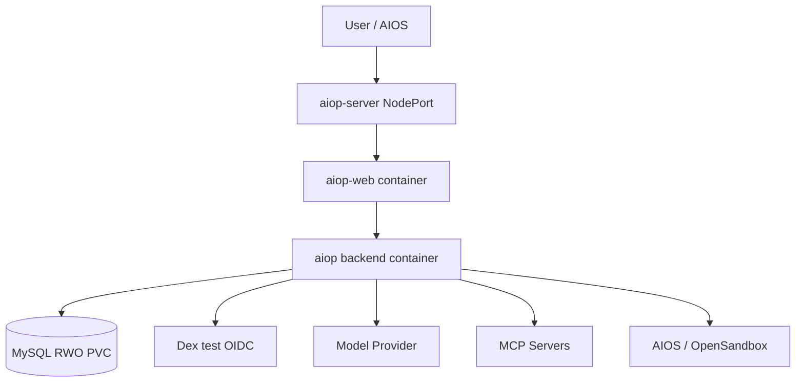

# 部署与可观测性设计

本文描述当前 Task 12 staging 发布路径。真实环境结果必须写入 `/home/opt/develop/aicoding/aiop/dist/runtime-refactor-migration-rehearsal.md`，不能由文档预先声明成功。

## 1. 当前 staging 拓扑

当前 staging manifests 位于 `deploy/dev-k8s/`，namespace `aiop-dev`。`deployment/aiop-server` 是单副本、双容器 Pod，backend 内嵌 Scheduler；MySQL 使用 `ReadWriteOnce` PVC。该环境不采用共享 RWX 存储。

## 2. 镜像与发布入口

根目录 `Makefile` 是唯一操作入口：

- `make image`：以当前 Git short SHA 构建 `aiop:<sha>` 与 `aiop-web:<sha>`，并执行 backend workspace/node smoke；
- `make deploy-staging`：只 apply `deploy/dev-k8s/` 安全 manifests，以 `-o name` 检查预置 Secret，通过一次本地 set-image apply 注入两个不可变镜像，并等待 MySQL、Dex、aiop-server Ready；
- `make rollback-staging`：对 `aiop-dev` 的 `deployment/aiop-server` 执行 rollout undo 并等待 Ready。

Makefile 不创建或读取 Secret，不应用示例 Secret，也不对 staging 使用生产 namespace/manifests。

## 3. 配置与 Secret

非敏感配置由 ConfigMap 提供。JWT、设置加密根密钥、模型/MCP/Sandbox Credential 与 MySQL 密码由预置 Kubernetes Secret 或产品 Credential Store 注入。

安全检查只验证资源名称存在。禁止读取 Secret YAML、describe、decode、输出环境变量或把密码放入探针参数。MySQL readiness 通过容器已有 `MYSQL_ROOT_PASSWORD` 设置进程环境中的 `MYSQL_PWD`，不会在命令参数或探针输出中出现密码。

## 4. 进程生命周期与 readiness

Backend 启动顺序：配置校验、Store/迁移、五包装配、外部连接、可选 Scheduler、HTTP listener。SIGINT/SIGTERM 停止接收新请求，再关闭 Scheduler、MCP、Sandbox、下载回收器和 Store。

- `/healthz`：进程存活；
- `/readyz`：是否接受新流量；
- MySQL/Dex/backend rollout status：staging 发布门禁；
- 单个模型、MCP 或 Sandbox 外部故障应体现为领域错误与告警，不泄露 Credential。

## 5. Durable 多进程边界

- Run/Attempt 使用 MySQL lease token 与 fencing；旧 Attempt 不能提交 Turn 或终态。
- 跨 Worker append 使用 durable inbox。
- recovery supervisor 通过持久状态接管过期执行，并防止旧 supervisor 完成新 Attempt。
- Scheduler Fire 使用 claim token、expiry 与 fire/run 幂等关联。
- MCP connection、Sandbox handle 和 live SSE response 是进程本地资源；权威状态仍在 MySQL。
- SSE 客户端断开只 detach，Durable Run 继续；显式取消才改变 Run 状态。

## 6. 日志、审计与指标

`pino` 输出结构化日志。Run 诊断至少关联 tenantId、runId、attemptId、turnNo、lease owner/token、tool call、fireId 和 correlationId。

数据职责：

- logs：运行诊断；
- audit events：安全与管理事实；
- durable Run events：有序执行时间线；
- Tool Ledger：副作用与恢复事实；
- Pi Session committed leaf：会话上下文提交水位线。

应观测 Run/Attempt/Turn 耗时与终态、lease loss、恢复、pending Interaction、`recovery_required`、Scheduler Fire、MCP 连接、Sandbox 生命周期和 MySQL 健康。仓库没有内置 Prometheus exporter，不能把建议指标写成已部署能力。

## 7. 灰度与回滚

当前发布只运行 Durable Pi Runtime，不存在执行引擎选择或旧运行路径灰度。灰度单位是不可变镜像 revision、环境流量和 Tool capability：

1. 构建并记录 SHA 镜像；
2. 完成不可逆迁移前的备份恢复演练；
3. 部署 staging 并执行 HTTP、Scheduler、取消、恢复、Interaction、MCP、Sandbox 验收矩阵；
4. 回滚前检查 schema、pending inbox、pending Interaction 和未知副作用兼容；
5. `make rollback-staging` 只回滚应用 revision，不撤销数据库迁移。

迁移 `src/db/migrations/0022_pi_only_runtime.sql` 不可逆。若旧应用不能安全忽略新结构或保留 pending 状态，停止应用回滚并使用已演练的数据库恢复方案。

## 8. 发布证据

代码仓只提供可执行入口和安全手册。环境操作者按[Pi Agent Platform 操作说明](../pi-agent-platform-operations.md)记录：

- Git SHA 与两个 image tag；
- 备份 ID、checksum、恢复耗时与非敏感抽样；
- Deployment revision 与 readiness；
- 验收矩阵；
- 回滚兼容检查和结果。

`dist/` evidence、SQL dump 和 checksum 不提交 Git。

## 9. 源码与清单

- `Makefile`
- `deploy/dev-k8s/namespace.yaml`
- `deploy/dev-k8s/mysql.yaml`
- `deploy/dev-k8s/oidc-test.yaml`
- `deploy/dev-k8s/aiop-deployment.yaml`
- `src/index.ts`
- `src/runtime.ts`
- `src/server/http.ts`
- `packages/pi-runtime/src/run/`
- `packages/scheduler-runtime/src/`
