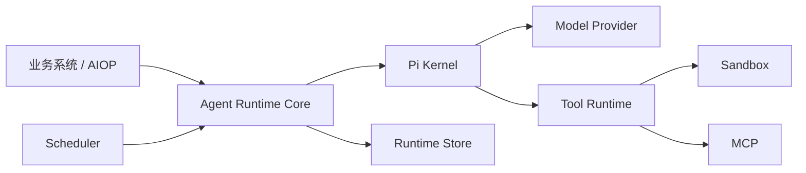

# Pi 集成与 Agent Platform 模块化方案

> 状态：拟实施。本文记录已经确认的架构决策，不表示相关代码已经完成。
>
> 关联文档：[Agent Runtime](./02-agent-runtime.md)、[模型与上下文](./03-model-and-context.md)、[工具、Skill 与 MCP](./04-tools-skills-mcp.md)、[数据与持久化](./07-data-and-persistence.md)、[部署与可观测性](./10-deployment-observability.md)。

## 1. 结论

AIOP 将使用 Pi 替换现有的通用 ReAct 循环，并把 Agent Runtime 拆成可复用的 npm 模块。

本次设计确认以下事项：

1. Pi 负责进程内的模型和工具循环。Run 状态、审批、恢复和工具幂等仍由 AIOP 管理。
2. `AgentRuntime` 改为依赖接口，不再直接依赖 AIOP 的认证、完整 `Store`、HTTP 和具体 Kernel。
3. Sandbox、Scheduler、MCP、Skill 和 ToolBroker 独立成模块，需要时再组合进来。
4. 首期使用 `pi-agent-core` 的 `agentLoop/agentLoopContinue`，不引入 `pi-coding-agent`。
5. LangGraph 只作为迁移期兼容实现。Pi 和新的恢复机制稳定后，删除 LangGraph 代码、依赖和专用表。

这不是一次简单的 Kernel 替换。当前 LangGraph 同时提供 checkpoint 和交互恢复。如果先删 LangGraph，再补恢复能力，运行中的任务会失去安全恢复路径。因此实施顺序是：先补 Runtime，再接 Pi，最后停用 LangGraph。

## 2. 当前实现和主要问题

当前 Agent 执行入口位于 `src/agent/runtime.ts`。它直接创建 `LegacyAgentKernel` 和 `LangGraphAgentKernel`，并引用 AIOP 的 `Store`、`RequestContext`、日志和 LangGraph checkpoint 类型。

现有 LangGraph 图只有三个节点：`prepare`、`model` 和 `tools`。它本质上仍是通用 ReAct 循环，没有独立的确定性业务 DAG。

LangGraph 目前还有两项实际用途：

- 保存图状态和 pending writes；
- 使用 `interrupt()` 和 `Command(resume)` 暂停、恢复审批和用户交互。

其他持久化能力已经由 AIOP 自己实现，包括 Agent Run、Lease、Interaction、Tool Ledger 和 Run Event。但这些能力还没有组成一个完整的、与 Kernel 无关的恢复协议。运行中心目前也只允许恢复 LangGraph Run。

此外，AIOP 的 `Store` 同时包含会话、用户、设置、调度、Sandbox 和 Agent Run 等多个领域。把它直接作为公共 Runtime 接口，会迫使其他团队接受 AIOP 的整套数据模型。

因此需要先拆接口，再迁移执行内核。

## 3. 目标结构



### 3.1 Runtime Core

Runtime Core 管理以下状态：

- Run、Attempt 和 Turn；
- Kernel 选择和版本锁定；
- Lease、fencing token、取消和超时；
- 每轮快照和提交记录；
- waiting、resume 和人工恢复；
- token、费用、轮数和工具调用上限。

它不处理登录、HTTP、SSE、具体数据库、模型 SDK 或 Kubernetes 权限。这些内容由接入方通过接口提供。

公共 Run 状态保持为：

```text
queued → running → succeeded
                 → waiting → running
                 → failed
                 → cancelled
                 → recovery_required
```

审批、提问和计划确认共用 `waiting`，具体原因记录在 `waitingReason` 中。

### 3.2 周边模块

Scheduler 只负责创建 Run，不参与 Agent loop。Sandbox 和 MCP 是工具执行后端，也不进入 Runtime 状态机。

依赖方向保持单向：

```text
Scheduler → Runtime → Kernel → Model / Tool Runtime → Sandbox / MCP
```

这样其他团队可以只安装 Runtime 和 Pi Kernel，也可以按需增加 MySQL、Sandbox 或 Scheduler 实现。

### 3.3 为什么不做成一个大包

把 Runtime、MySQL、RBAC、Sandbox、MCP 和 Scheduler 放进同一个包，接入最简单，但会带来两个问题：

- 使用方被迫安装不需要的 SDK 和数据库依赖；
- AIOP 的产品模型会变成公共 API，后续很难调整。

因此采用“核心接口 + 可选实现”。完整包清单放在附录 A。

## 4. Pi 接入方式

### 4.1 依赖选择

Pi `0.82.1` 要求 Node.js `>=22.19.0`。AIOP 当前 `package.json` 仍声明 Node.js `>=20`，而现有 Kysely `0.29.2` 已经要求 Node.js `>=22.0.0`。Node 基线需要先单独统一。

首期只增加两个直接依赖：

```json
{
  "@earendil-works/pi-agent-core": "0.82.1",
  "@earendil-works/pi-ai": "0.82.1"
}
```

版本使用精确值，同时提交 lockfile 并锁定 Pi 的传递依赖。

`pi-agent-core` 已公开以下能力：

- `agentLoop` 和 `agentLoopContinue`；
- Agent 事件和工具执行；
- compaction 和 token estimation；
- Skill 和输出截断辅助函数；
- `AgentHarness`。

首期不使用 `AgentHarness`。它带有 Session、本地工具和文件系统相关假设，超过了 Runtime 所需范围。也不需要为上述辅助函数引入 `pi-coding-agent`。

### 4.2 为什么使用低层 loop

审批场景需要在一轮结束后可靠停止当前进程，再由其他 Worker 恢复。Pi `Agent` 当前没有公开 `shouldStopAfterTurn` 配置，而低层 loop 提供该控制点。

AIOP 自己维护事件写入和下一轮快照，因此直接使用低层 loop 更清楚：

```text
创建 TurnSnapshot
  → 构造 Pi context 和工具
  → agentLoop / agentLoopContinue
  → 持久化本轮结果
  → 判断继续、等待或结束
```

如果后续 Pi `Agent` 提供需要的停止和持久化钩子，可以再评估是否切换。该变化不能影响 `AgentKernel` 公共接口。

### 4.3 PiAgentKernel

`PiAgentKernel` 只做协议转换：

- 把 AIOP 消息转换为 Pi `AgentMessage`；
- 把 `ModelProvider` 转换为 Pi `StreamFn`；
- 把允许使用的工具转换为 Pi Tool；
- 把 Pi 事件转换为 AIOP Run Event；
- 把 Pi 错误转换为 Runtime 错误。

Pi 工具不能直接访问 Kubernetes、Sandbox、MCP、数据库或用户凭据。所有调用都要经过 Tool Runtime。

模型路由也由接入方提供。AIOP 首期继续使用现有 `ChatModel` 和 Anthropic/OpenAI Adapter。LiteLLM 和 Langfuse 不属于 Pi 接入的前置条件。

## 5. 持久化和恢复

### 5.1 Run、Attempt 和 Turn

三个层级解决的问题不同：

- Run 是一次业务执行，可以跨请求和跨进程；
- Attempt 是某个 Worker 对 Run 的一次执行尝试；
- Turn 是一次模型请求及其工具结果。

Pi 只知道当前进程内的 loop。`agent_end` 表示本次 attempt 不再产生 Pi 事件，不代表业务 Run 已经成功。

每次模型请求前创建 `TurnSnapshot`，至少记录：

- run、attempt、turn 和 session 版本；
- tenant、actor 和角色；
- Kernel、Pi、模型、提示词和工具集版本；
- lease token、开始时间和 deadline。

恢复时以 MySQL 中已提交的 transcript、snapshot 和 Tool Ledger 为准，不依赖旧 Pi 对象。

### 5.2 数据记录

需要新增或扩展以下记录：

| 记录 | 用途 |
| --- | --- |
| `agent_run_attempts` | 记录每次 Worker 执行 |
| `agent_turn_snapshots` | 保存模型请求前的配置快照 |
| `agent_turn_commits` | 标记一轮已经完整提交 |
| `agent_tool_executions` | 增加 attempt、turn、logical call 和幂等字段 |
| `agent_run_events` | 增加单调 sequence，支持事件补发 |

Pi 不复用 LangGraph checkpoint 表。公共 Runtime 只定义仓储接口，MySQL 表结构留在 `agent-runtime-mysql` 中。

### 5.3 一轮如何提交

MySQL 实现按以下顺序提交：

1. 开启事务，检查 lease 和 fencing token；
2. 写 assistant message 和已经确认的 tool result；
3. 更新 Tool Ledger、Interaction、usage 和 Run Event；
4. 写入 turn commit 记录；
5. 提交事务，再允许前端看到对应的持久事件；
6. 创建下一轮快照。

恢复器只使用带 commit 记录的 Turn。没有完成提交的 Turn 需要检查 Tool Ledger，再决定补写、重试或转人工处理。

外部工具副作用无法和 MySQL 放在同一个事务中。这个问题依靠幂等键、外部 correlation ID 和 Tool Ledger 处理，不能用数据库事务假装解决。

### 5.4 审批和恢复

Pi 的 `terminate=true` 不是“立即停止整个工具批次”。只有同一批工具结果都设置了 `terminate=true`，Pi 才会提前结束。

因此审批按下面处理：

```text
Tool Runtime 判断需要审批
  → 创建 Interaction
  → Ledger 记录 pending_approval
  → 阻止本轮尚未执行的工具
  → 提交当前 Turn
  → shouldStopAfterTurn 返回 true
  → Run 进入 waiting
```

waiting 结果只作为内部控制消息保存，不发送给模型。审批完成后，新 Worker 读取最后一个已提交 Turn，执行或查询原工具调用，再写入唯一的模型可见 tool result，最后调用 `agentLoopContinue`。

读工具可以保守重试。支持外部幂等键的写工具可以查询后重试。无法确认结果的非幂等写操作进入 `recovery_required`，由人工处理。

## 6. Tool、Sandbox、MCP、Skill 和 Scheduler

### 6.1 Tool Runtime

Tool Runtime 是模型与外部系统之间的安全边界。执行顺序为：

```text
参数校验
  → 工具可见性和权限
  → Policy / 资源 ACL
  → Approval
  → Hook
  → Ledger / 幂等
  → Resource Lock
  → 实际执行
  → Audit
```

Pi 的 schema 校验只能证明参数格式正确，不能替代 tenant、cluster、namespace 和业务权限检查。

只读工具可以并行。Sandbox 命令、文件操作和写工具默认串行。Tool Runtime 还要限制每个 tenant、工具和资源的并发数。

如果模型响应因长度限制被截断，其中的工具调用一律不执行。截断后的参数即使能解析，也可能不完整。

### 6.2 Sandbox 和 MCP

`sandbox-core` 只定义 acquire、execute、upload、download 和 release 等接口。OpenSandbox、E2B 和 Local 分别提供实现。

Sandbox Profile、网络、CPU、内存、超时和文件限制由 Sandbox 模块执行；是否允许用户使用某个 Profile，仍由产品权限或 Tool Runtime 决定。

`mcp-runtime` 负责连接、工具发现、schema 转换、调用和超时。MCP 凭据和工具可见性由接入方提供。

### 6.3 Skill

`skill-runtime` 管理 Skill 的解析、版本、启停和提示词投影。Pi 可以提供 Skill 格式和辅助函数，但 tenant 可见性、审核和发布仍由 AIOP 或接入方管理。

### 6.4 Scheduler

Scheduler 只创建 Run：

```text
Cron 到期
  → 原子领取任务
  → 构造可信 IdentityContext
  → AgentRuntime.run()
  → 记录 task run 与 agent run 的关系
```

多副本领取由 Scheduler Store 实现。AIOP 的 MySQL 实现继续使用 `SKIP LOCKED`。

## 7. LangGraph 废弃计划

### 7.1 为什么删除

当前 LangGraph 没有独立业务 DAG，只包装了通用模型和工具循环。Pi 接入后继续保留，会让团队长期维护两套 loop、两套恢复协议和两组兼容测试。

LangGraph 不能现在就删。需要先用 Runtime 的 commit 记录和恢复器替代 checkpoint，再用 Interaction 恢复流程替代 `interrupt/Command`。

### 7.2 三个阶段

**冻结**

不再新增 LangGraph 节点、图或业务依赖。只修复安全问题、数据损坏和迁移阻塞问题。

**停流**

Pi 完成灰度后，停止创建新的 LangGraph Run。已经存在的 Run 继续恢复、取消或完成，不能中途切换 Kernel。

**移除**

存量 Run 清理完并完成回滚演练后，删除：

- `LangGraphAgentKernel`、StateGraph、state 和 registry；
- LangGraph rollout 配置和环境变量；
- Checkpoint Saver 及其 validation、parity 和 recovery 测试；
- `@langchain/langgraph`、checkpoint validation，以及不再被其他代码使用的 `@langchain/core`。

历史 Run 仍可显示 `kernel=langgraph`，但只能用于查询和审计。

### 7.3 删除前检查

删除 LangGraph 代码前，需要确认：

- Pi 已覆盖模型、工具、上下文、取消和事件行为；
- 运行中心可以恢复 Pi Run，不再只有 LangGraph 支持恢复；
- approval、question 和 plan 可以跨进程、跨副本恢复；
- Pi 写工具通过幂等和故障恢复测试；
- 已连续一个 checkpoint 保留周期没有新 LangGraph Run；
- 所有未结束的 LangGraph Run 已完成、取消或转人工处理；
- 生产灰度和回滚演练已经完成。

### 7.4 数据表

停止 LangGraph 流量后，checkpoint 表先转为只读，保留一个 checkpoint 周期和一个应用回滚窗口。

确认不再回滚后，通过新迁移删除 `langgraph_checkpoints` 和 `langgraph_checkpoint_writes`。不修改历史迁移 `0011_langgraph_checkpoints.sql`。Run Event 和审计数据继续保留。

删除表后，恢复旧 LangGraph 需要数据库备份和旧版本构建，属于灾难恢复，不再属于普通应用回滚。

## 8. 实施顺序

| 阶段 | 主要工作 | 完成标志 |
| --- | --- | --- |
| 0 | 升级 Node 基线 | CI、镜像和现有回归通过 |
| 1 | 抽取公共接口 | AIOP 行为不变，Runtime Core 不再依赖完整 Store 和 RequestContext |
| 2 | 实现 Run/Attempt/Turn 和恢复器 | 崩溃、取消和 lease loss 测试通过 |
| 3 | 接入 Pi fake provider/tool | 一次模型—工具—模型循环可以持久化和恢复 |
| 4 | 接入现有模型和只读工具 | usage、预算、并发和取消可观测 |
| 5 | 完成审批和写工具恢复 | 跨进程审批、幂等和人工恢复通过 |
| 6 | 抽取 Sandbox、MCP、Skill、Scheduler 和 MySQL 包 | 非 AIOP 示例程序可以嵌入运行 |
| 7 | Pi 灰度并停止新 LangGraph Run | 生产指标达到上线前确定的阈值 |
| 8 | 删除 LangGraph 代码和依赖 | 生产只运行 Pi/Legacy，历史 Run 可查询 |
| 9 | 回滚窗口结束后清理 checkpoint 表 | 备份验证通过，审计数据可查询 |

镜像和测试环境操作通过 Makefile 提供：

```text
make verify-node
make test-agent-platform
make image
make deploy-staging
make rollback-staging
```

## 9. 验收和回滚

### 9.1 验收重点

测试至少覆盖：

- Runtime 公共接口和内存实现；
- Pi 事件顺序、流式错误和 abort；
- 工具参数、串并行、资源锁和截断保护；
- Turn 提交中断、lease loss 和 Worker 崩溃；
- approval、question、plan 的跨进程恢复；
- Tool Ledger 幂等和非幂等写保护；
- tenant、角色和资源权限；
- Sandbox Provider、MCP 和 Scheduler 合约；
- LangGraph 停流、历史 Run 查询和依赖删除。

Shadow run 只允许 replay、dry-run 或隔离的只读工具，不能重复执行外部写操作。

灰度前先从当前 LangGraph 流量取得成功率、p95 延迟、模型成本和恢复失败率基线，再确定回滚阈值。安全指标没有容忍空间：越权、重复写和审批绕过必须为零。

### 9.2 回滚

LangGraph 删除前，可以停止新 Pi Run，并把新请求切回 Legacy 或 LangGraph。已经开始的 Pi Run 不能中途更换 Kernel。

LangGraph 代码删除后，只能回滚到与保留表结构兼容的历史构建。checkpoint 表删除后，不再提供普通 LangGraph 回滚。

数据库迁移只向前追加。旧版本需要能够忽略新表和可选字段。

## 10. 主要风险

**恢复协议比 Agent loop 更难。** Pi 接通并不代表迁移完成。没有 commit 记录、Ledger 和故障注入测试时，不能开放写工具。

**模块拆分可能扩大首期工作量。** 先抽 Runtime 使用的最小接口，Sandbox 和 Scheduler 包可以在 Pi 稳定后再迁出目录。

**公共 API 过早固化。** npm 包先发布内部预览版本。至少有一个非 AIOP 示例接入后，再承诺稳定 major 版本。

**事件持久化可能拖慢流式输出。** 状态和审计事件同步提交；文本 delta 和工具进度走有界队列并节流，不逐条写数据库。

**上游 Pi API 会变化。** 依赖锁定精确版本，每次升级执行公开 export、事件顺序、abort 和工具行为合约测试。

## 附录 A：包划分

| 包 | 内容 |
| --- | --- |
| `@aiop/agent-contracts` | 身份、Run、模型、工具、事件和错误类型 |
| `@aiop/agent-runtime-core` | Run/Attempt/Turn、Lease、取消和恢复 |
| `@aiop/agent-kernel-pi` | Pi 协议适配 |
| `@aiop/tool-runtime` | Policy、Approval、Ledger、锁和工具分发 |
| `@aiop/agent-runtime-mysql` | Runtime MySQL 表、事务和迁移 |
| `@aiop/sandbox-core` | Sandbox 公共接口 |
| `@aiop/sandbox-opensandbox` | OpenSandbox 实现 |
| `@aiop/sandbox-e2b` | E2B 实现 |
| `@aiop/sandbox-local` | 开发测试实现 |
| `@aiop/mcp-runtime` | MCP 连接和工具适配 |
| `@aiop/skill-runtime` | Skill 注册、版本和投影 |
| `@aiop/scheduler-core` | Cron、claim 和任务执行接口 |
| `@aiop/scheduler-mysql` | MySQL Scheduler Store |
| `@aiop/agent-runtime-aiop` | AIOP 认证、Store、SSE 和管理面适配 |

包使用 SemVer，发布到组织内部 npm Registry。公共包不能导出 AIOP HTTP 类型或 LangGraph 类型。

## 附录 B：核心接口草案

```ts
interface AgentRuntime {
  run(input: RunInput): Promise<RunResult>;
  resume(input: ResumeInput): Promise<RunResult>;
  cancel(input: CancelRunInput): Promise<void>;
}

interface AgentKernel {
  readonly descriptor: KernelDescriptor;
  run(context: KernelRunContext): Promise<KernelResult>;
}

interface RuntimeStore {
  runs: RunRepository;
  attempts: AttemptRepository;
  turns: TurnRepository;
  interactions: InteractionRepository;
  toolLedger: ToolLedgerRepository;
}

interface IdentityContext {
  tenantId: string;
  actorId: string;
  roles: string[];
  attributes?: Record<string, unknown>;
}
```

这些接口表达依赖方向，不作为最终 TypeScript 签名。正式签名在开发计划的接口任务中确定，并通过 API diff 管理兼容性。
