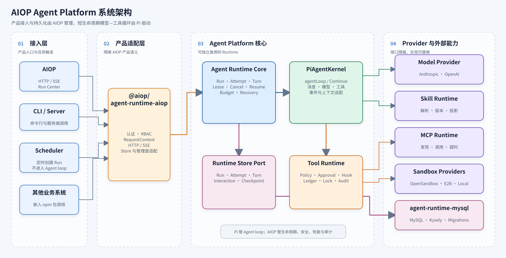
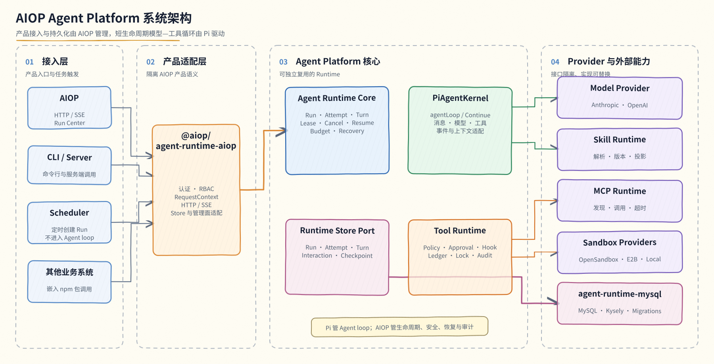
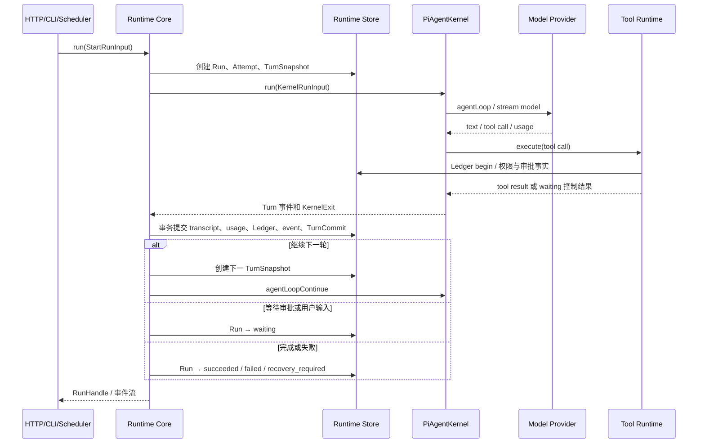
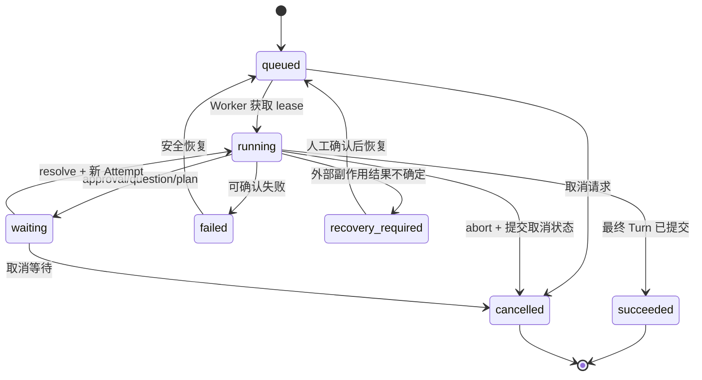
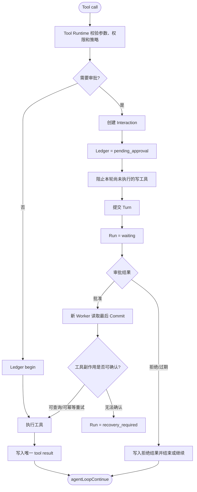
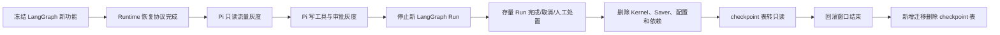
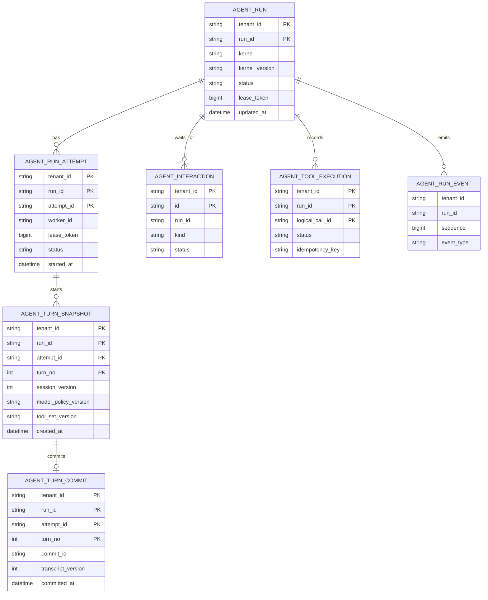

# Pi 集成与 Agent Platform 模块化设计

> 状态：仓库开发实现完成，生产迁移与窗口验证待完成。
>
> 2026-07-27 已完成阶段 0～6 的仓库实现、阶段 7 的 replay/dry-run 与灰度控制代码，以及阶段 9 的 LangGraph 运行时代码和依赖删除。真实生产灰度指标、阶段 8 的 checkpoint 保留周期、阶段 10 的备份恢复/审计查询/清表窗口仍待外部执行。当前事实以 `src/**`、`packages/**`、`src/db/migrations/**`、`package.json`、测试和[完成证据](../pi-agent-platform-completion-evidence.md)为准。
>
> 关联文档：[Agent Runtime](./02-agent-runtime.md)、[模型与上下文](./03-model-and-context.md)、[工具、Skill 与 MCP](./04-tools-skills-mcp.md)、[数据与持久化](./07-data-and-persistence.md)、[调度器](./08-scheduler.md)、[HTTP API 与 Web](./09-api-and-web.md)、[部署与可观测性](./10-deployment-observability.md)。

## 1. 概述

### 1.1 文档信息

| 项目 | 内容 |
| --- | --- |
| 文档名称 | Pi 集成与 Agent Platform 模块化设计 |
| 版本 | v1.0 |
| 更新日期 | 2026-07-27 |
| 适用范围 | AIOP Agent Runtime、Pi Kernel、Tool Runtime、持久化恢复和模块化发布 |

### 1.2 背景与现状

AIOP 当前同时维护 Legacy Kernel 和 LangGraph Kernel。LangGraph 图只有 `prepare → model ↔ tools` 三类节点，本质上仍是通用 ReAct 循环，没有独立的确定性业务 DAG。

LangGraph 目前不能直接删除，因为它还承担两项过渡能力：

- checkpoint 和 pending writes；
- `interrupt()` 与 `Command(resume)` 驱动的审批、提问和计划确认恢复。

AIOP 已经自研了 Agent Run、Lease、Interaction、Tool Ledger 和 Run Event，但这些能力还没有组成与 Kernel 无关的 Turn 提交和恢复协议。运行中心的恢复逻辑目前也明确限制为 LangGraph Run。

现有 `AgentRuntime` 直接引用完整 `Store`、`RequestContext`、具体 Kernel、日志和 LangGraph checkpoint 类型。该边界适合产品内部组装，不适合其他团队作为独立 npm 模块复用。

### 1.3 设计目标

1. 使用 Pi 提供的通用 Agent loop，停止继续自研和维护通用 ReAct 循环。
2. 将 Run、Attempt、Turn、Lease、审批、恢复和 Tool Ledger 收敛到 AIOP Durable Runtime。
3. 把 Runtime、Pi Kernel、Tool、Sandbox、MCP、Skill、Scheduler 和 MySQL 实现拆成可按需组合的 npm 包。
4. 保持 AIOP 现有 HTTP、SSE、CLI、Scheduler 和运行中心入口兼容。
5. Pi 和新的恢复协议稳定后，停止 LangGraph 新流量并删除代码、依赖和专用表。

### 1.4 非目标

- 不引入 `pi-coding-agent` 的 CLI、TUI、JSONL Session、本地 cwd 和内置生产工具。
- 不使用 Pi 内置 bash/read/edit/write 直接访问生产环境。
- 不要求复用团队使用 AIOP 的认证、MySQL Schema、RBAC、Sandbox 或 HTTP 接口。
- 不在本方案中同时完成 LiteLLM、Langfuse 或 Temporal 的生产集成。
- 不把已经开始的 Run 从一个 Kernel 中途切换到另一个 Kernel。

### 1.5 关键决策

| 编号 | 决策 | 原因 |
| --- | --- | --- |
| D-01 | 使用 `@earendil-works/pi-agent-core@0.82.1` 的 `agentLoop/agentLoopContinue` | 低层 loop 提供 Turn 边界控制，适合跨进程审批和恢复 |
| D-02 | 直接依赖 `@earendil-works/pi-ai@0.82.1` | 复用 Pi 的消息、模型和流式协议类型，不经过 deep import |
| D-03 | 首期不直接使用 `AgentHarness` | 它包含 Session、文件系统和本地工具假设；只复用 `pi-agent-core` 明确公开的 compaction、token estimation、Skill 和 truncate 辅助函数 |
| D-04 | Pi 只管理进程内 loop | Run 状态、提交、恢复、权限和外部副作用需要 AIOP 持久化控制 |
| D-05 | Runtime Core 依赖接口，不依赖完整 AIOP `Store` | 防止产品数据模型成为公共 npm API |
| D-06 | Sandbox、MCP、Skill 和 Scheduler 分包 | 接入方可以只安装所需模块，避免强制引入基础设施依赖 |
| D-07 | LangGraph 最终删除 | 长期保留两套 loop 和恢复协议会增加故障面和测试成本 |

实施顺序不能颠倒：先补 Durable Runtime，再接 Pi，最后停用 LangGraph。

## 2. 系统架构

### 2.1 整体架构

目标架构分为四层：

- 接入层：AIOP HTTP/SSE、CLI、Scheduler 和其他业务系统；
- 产品适配层：认证、RBAC、RequestContext、AIOP Store 和管理面适配；
- Agent Platform 核心：Runtime Core、Pi Kernel、Tool Runtime 和 Runtime Store Port；
- 可选实现：模型、Skill、MCP、Sandbox 和 MySQL Adapter。

依赖方向保持单向：

```text
Product / Scheduler
  → AIOP Adapter
  → Runtime Core
  → Pi Kernel
  → Model Provider / Tool Runtime
  → Sandbox / MCP / 业务工具

Runtime Core → Runtime Store Port → MySQL Adapter
```

Scheduler 只负责创建 Run，不进入 Agent loop。Sandbox 和 MCP 是工具执行后端，也不进入 Runtime 状态机。

### 2.2 技术选型

| 层次 | 技术或组件 | 使用方式 |
| --- | --- | --- |
| 运行平台 | Node.js `>=22.19.0`、TypeScript | Pi 0.82.1 的最低要求；统一 package、CI、镜像和部署基线 |
| Agent loop | `@earendil-works/pi-agent-core@0.82.1` | 使用 `agentLoop/agentLoopContinue`，不使用 deep import |
| 模型协议 | `@earendil-works/pi-ai@0.82.1` | Pi 消息、模型、stream 和 usage 类型 |
| 上下文辅助 | `@earendil-works/pi-agent-core@0.82.1` | 复用公开导出的 compaction、token estimation、Skill loader 和 truncate；由 AIOP 包装策略与持久化 |
| 模型接入 | 现有 `ChatModel` 与 Anthropic/OpenAI Adapter | 通过 `ModelProvider` 注入，不让 Pi 读取产品密钥 |
| 数据访问 | MySQL、Kysely | 实现 durable repository、事务、租约和迁移 |
| 工具协议 | AIOP Tool Runtime、MCP SDK | 统一 Policy、Approval、Ledger、锁和审计 |
| 隔离执行 | OpenSandbox、E2B、Local | 作为 `SandboxProvider` 可选实现 |
| 图表 | Mermaid、Excalidraw | 默认使用 Mermaid；本章系统架构图按评审要求使用 Excalidraw，并保留可编辑源文件 |

Pi 0.82.1 要求 Node.js `>=22.19.0`。当前 `package.json` 仍声明 `>=20`，而 Kysely 0.29.2 已要求 Node.js `>=22.0.0`。Node 基线升级是接入 Pi 的前置任务。

### 2.3 系统架构图

#### 清晰版



可编辑源文件：[pi-agent-platform-architecture.excalidraw](./assets/pi-agent-platform-architecture.excalidraw)。

#### 手绘版



可编辑源文件：[pi-agent-platform-architecture-handdrawn.excalidraw](./assets/pi-agent-platform-architecture-handdrawn.excalidraw)。

图中的边界是：Pi 负责短生命周期模型—工具循环；AIOP 负责跨请求、跨进程的持久化运行、安全、审批、恢复和产品控制面。

#### 模块职责

| 模块 | 负责 | 是否自研 |
| --- | --- | --- |
| AIOP 产品适配层 | 认证、RBAC、RequestContext、HTTP/SSE、AIOP Store 和管理面适配 | **是。** 这些能力直接依赖 AIOP 的用户、权限、接口和部署模型，不进入公共 Runtime Core，避免产品类型向复用方扩散 |
| Runtime Core | Run/Attempt/Turn 生命周期、Lease、取消、等待、恢复和预算 | **是。** 这些状态构成跨请求、跨进程执行和公共 Runtime API 的核心语义，通用 Agent loop 无法直接替代 |
| PiAgentKernel | Pi 协议转换和 Agent loop 控制 | **部分自研。** Pi 提供成熟的 `agentLoop/agentLoopContinue`、模型事件和上下文辅助能力；AIOP 自研消息、事件、工具和恢复 Adapter，隔离上游变化 |
| Tool Runtime | 参数校验、权限、审批、Hook、Ledger、资源锁和审计 | **是。** tenant 权限、工具副作用、幂等和审计决定生产写操作是否安全，必须由 AIOP 掌控 |
| Runtime Store Port | Run、Attempt、Turn、Interaction、事件和事务提交契约 | **是。** Store Port 定义 AIOP 的持久化与恢复语义，确保 Runtime 不依赖具体数据库和产品 Store |
| Model Provider | 模型选择、鉴权注入、流式响应和 usage 转换 | **部分自研。** 复用 Anthropic/OpenAI SDK 和现有 ChatModel 能力；AIOP 自研统一 Provider 接口、凭据注入和协议转换，防止模型 SDK 类型进入 Runtime |
| Skill Runtime | Skill 解析、版本、启停、tenant 可见性、审核和提示词投影 | **部分自研。** 复用 Pi Skill loader 的解析能力；版本治理、可见性、审核和投影规则属于 AIOP 产品语义 |
| MCP Runtime | MCP Server 连接、工具发现、schema 转换、调用、超时和审计 | **部分自研。** MCP TypeScript SDK 用于保持协议兼容并复用工具生态；AIOP 自研凭据、tenant 可见性、Policy、超时和审计层 |
| Sandbox Providers | 隔离环境申请、命令执行、文件传输、资源限制和释放 | **部分自研。** AIOP 自研 Provider 契约、资源策略和权限治理；OpenSandbox/E2B 提供隔离执行基础设施，Local 仅用于开发测试 |
| agent-runtime-mysql | Runtime 表、事务、租约、索引和数据库迁移 | **部分自研。** AIOP 自研 Schema、事务和迁移策略；Kysely 提供成熟的类型化 SQL 与事务访问，且不限制数据库模型 |
| Scheduler | 到期任务领取、并发 claim、创建 Run 和任务关联 | **是。** 需要适配 AIOP 任务模型、多副本调度和现有部署方式，并与 Agent loop 保持解耦 |

### 2.4 npm 包划分

| 包 | 主要职责 | 主要依赖 |
| --- | --- | --- |
| `@aiop/agent-contracts` | 身份、Run、模型、工具、事件和错误类型 | 无运行时依赖 |
| `@aiop/agent-runtime-core` | Run/Attempt/Turn、Lease、取消、预算和恢复 | contracts |
| `@aiop/agent-kernel-pi` | Pi loop、消息、模型、工具、事件和上下文辅助能力适配 | runtime-core、Pi |
| `@aiop/tool-runtime` | Policy、Approval、Hook、Ledger、锁和工具分发 | contracts |
| `@aiop/agent-runtime-mysql` | Runtime 表、事务、租约和迁移 | runtime-core、Kysely |
| `@aiop/sandbox-core` | acquire、execute、upload、download、release 契约 | contracts |
| `@aiop/sandbox-opensandbox` | OpenSandbox Provider | sandbox-core、OpenSandbox SDK |
| `@aiop/sandbox-e2b` | E2B Provider | sandbox-core、E2B SDK |
| `@aiop/sandbox-local` | 开发测试 Provider | sandbox-core |
| `@aiop/mcp-runtime` | MCP 连接、发现、schema 和调用适配 | contracts、MCP SDK |
| `@aiop/skill-runtime` | Skill 解析、版本、启停和提示词投影；可复用 Pi Skill loader | contracts、pi-agent-core |
| `@aiop/scheduler-core` | Cron、claim 和创建 Agent Run | contracts |
| `@aiop/scheduler-mysql` | MySQL 多副本 Scheduler Store | scheduler-core、Kysely |
| `@aiop/agent-runtime-aiop` | AIOP 认证、Store、HTTP/SSE 和管理面适配 | 上述按需模块 |

公共包使用 SemVer，发布到内部 npm Registry。公共 API 不导出 AIOP HTTP 类型、完整 `Store`、`RequestContext` 或 LangGraph 类型。

## 3. 功能设计

### 3.1 一次 Pi Run 的核心时序



`agent_end` 只表示当前进程内 Pi loop 结束，不直接等于业务 Run 成功。Run 的最终状态由 Runtime 在 durable commit 完成后确定。

### 3.2 Run 状态机



`waiting` 使用 `waitingReason = approval | question | plan | external` 描述原因，不为每种交互增加顶层状态。

### 3.3 审批和恢复流程



Pi 的 `terminate=true` 不能保证立即停止同一批次中的其他工具。因此审批工具不能只依赖 Pi 终止标志，Tool Runtime 还要阻止本轮尚未执行的写操作，并在 Turn 提交后停止 loop。

### 3.4 Tool Runtime 执行规则

执行顺序固定为：

```text
参数校验
  → 工具可见性和租户权限
  → Policy / 资源 ACL
  → Approval
  → Hook
  → Ledger / 幂等
  → Resource Lock
  → 实际执行
  → Audit
```

业务规则：

| 编号 | 规则 |
| --- | --- |
| BR-01 | Pi 工具不能直接访问 Kubernetes、Sandbox、MCP、数据库或用户凭据 |
| BR-02 | 模型响应因长度限制截断时，其中的工具调用一律不执行 |
| BR-03 | 只读工具可以受限并行；Sandbox 命令、文件操作和写工具默认串行 |
| BR-04 | 每个 tenant、工具和资源都要有并发限制 |
| BR-05 | 外部写操作使用 stable idempotency key 和 correlation ID |
| BR-06 | 无法确认结果的非幂等写操作进入 `recovery_required`，不得自动重放 |
| BR-07 | tenant、actor、角色和资源范围来自可信 `IdentityContext`，不得从模型消息推导 |

### 3.5 Pi 辅助能力复用边界

`@earendil-works/pi-agent-core@0.82.1` 的包根出口包含以下公共函数，首期直接复用，不在 AIOP 中复制算法：

| 能力 | Pi 公共出口 | AIOP 负责的部分 |
| --- | --- | --- |
| compaction | `prepareCompaction`、`compact`、`shouldCompact` | 阈值配置、触发时机、摘要持久化、审计和失败恢复 |
| token estimation | `estimateContextTokens`、`estimateTokens`、`calculateContextTokens` | 模型上下文上限、预算策略、指标和告警 |
| Skill | `loadSkills`、`loadSourcedSkills`、`formatSkillInvocation` | tenant 可见性、版本、审核、启停和提示词投影 |
| truncate | `truncateHead`、`truncateTail`、`truncateLine` | 不同工具的截断策略、原始结果存储位置和敏感信息处理 |

`pi-ai` 提供消息、模型、stream、usage 和 context window 等协议数据，不负责上述治理逻辑。`pi-coding-agent` 不作为生产 Runtime 依赖。

这些函数虽然位于 `pi-agent-core` 的 `harness/**` 实现目录，但已由包根 `index` 正式导出。AIOP 只从包根导入，并通过合约测试锁定导出、输入输出和边界行为；Pi 升级时若公共出口发生变化，只修改 Adapter，不把 Pi 类型扩散到 Runtime Core、HTTP API 或数据库接口。

### 3.6 LangGraph 废弃流程



冻结阶段只修复安全问题、数据损坏和迁移阻塞问题。任何阶段都不能把已创建 Run 中途切换 Kernel。

## 4. 数据库设计

### 4.1 概念模型



### 4.2 现有表处理

| 表 | 处理方式 |
| --- | --- |
| `agent_runs` | 扩展 Kernel 版本、waiting reason 和 Runtime 版本字段；保留现有状态、usage、lease 和取消字段 |
| `agent_interactions` | 保留；补充 attempt/turn 归属字段，继续承载 approval/question/plan |
| `agent_tool_executions` | 扩展为 durable Tool Ledger，增加 logical call、幂等、外部关联和执行能力字段 |
| `agent_run_events` | 增加每个 Run 单调递增的 sequence，支持断线补发和确定性排序 |
| `langgraph_checkpoints` | Pi 不复用；LangGraph 停流后转只读，回滚窗口结束再删除 |
| `langgraph_checkpoint_writes` | 与 checkpoint 表相同，不修改历史迁移 `0011_langgraph_checkpoints.sql` |

### 4.3 新增表

#### `agent_run_attempts`

记录 Worker 对 Run 的一次执行尝试。

| 字段 | 类型 | 可空 | 说明 |
| --- | --- | --- | --- |
| `tenant_id` | VARCHAR(64) | N | 租户 |
| `run_id` | VARCHAR(128) | N | Agent Run |
| `attempt_id` | VARCHAR(64) | N | Attempt ID |
| `worker_id` | VARCHAR(128) | N | 执行实例 |
| `lease_token` | BIGINT | N | 本次尝试使用的 fencing token |
| `kernel` | VARCHAR(32) | N | `pi/legacy/langgraph` |
| `kernel_version` | VARCHAR(64) | N | Kernel 与 Pi 版本绑定 |
| `status` | VARCHAR(32) | N | `running/succeeded/failed/cancelled/lost_lease` |
| `error_code` | VARCHAR(64) | Y | 归一化错误码 |
| `error_message` | TEXT | Y | 脱敏错误信息 |
| `started_at` | DATETIME(3) | N | 开始时间 |
| `completed_at` | DATETIME(3) | Y | 完成时间 |

主键：`(tenant_id, run_id, attempt_id)`。索引：`(tenant_id, status, started_at)`。

#### `agent_turn_snapshots`

在每次模型请求前保存不可变配置快照。

| 字段 | 类型 | 可空 | 说明 |
| --- | --- | --- | --- |
| `tenant_id/run_id/attempt_id/turn_no` | 组合键 | N | Turn 唯一标识 |
| `session_version` | BIGINT | N | 输入 transcript 版本 |
| `parent_commit_id` | VARCHAR(64) | Y | 上一 Turn Commit |
| `identity_json` | JSON | N | tenant、actor、角色的可信快照，不含凭据 |
| `model_binding_json` | JSON | N | provider、model、route 和 thinking 配置 |
| `prompt_version` | VARCHAR(128) | N | system prompt 版本或 digest |
| `skill_set_version` | VARCHAR(128) | Y | Skill 集合版本 |
| `tool_set_version` | VARCHAR(128) | N | 工具可见集合版本 |
| `policy_version` | VARCHAR(128) | N | Policy/ACL 版本 |
| `deadline_at` | DATETIME(3) | Y | Turn deadline |
| `created_at` | DATETIME(3) | N | 创建时间 |

主键：`(tenant_id, run_id, attempt_id, turn_no)`。快照只追加，不允许更新。

#### `agent_turn_commits`

标记一轮消息、工具结果、usage 和事件已经完整提交。

| 字段 | 类型 | 可空 | 说明 |
| --- | --- | --- | --- |
| `tenant_id/run_id/attempt_id/turn_no` | 组合键 | N | 对应 Turn |
| `commit_id` | VARCHAR(64) | N | 全局唯一 Commit ID |
| `transcript_version` | BIGINT | N | 提交后的 transcript 版本 |
| `stop_reason` | VARCHAR(64) | Y | Pi/模型停止原因 |
| `usage_json` | JSON | N | 本轮 token 和费用数据 |
| `event_sequence_end` | BIGINT | N | 本轮最后一个 durable event sequence |
| `committed_at` | DATETIME(3) | N | 提交时间 |

主键：`(tenant_id, run_id, attempt_id, turn_no)`；唯一索引：`commit_id`。恢复器只读取存在 Commit 的 Turn。

### 4.4 现有表扩展

#### `agent_tool_executions`

新增字段：

| 字段 | 说明 |
| --- | --- |
| `attempt_id`、`turn_no` | 工具调用所属 Turn |
| `logical_call_id` | 跨 Attempt 稳定的逻辑调用 ID |
| `idempotency_key` | 提供给外部系统的幂等键 |
| `capability` | `read/retryable_write/non_idempotent_write` |
| `external_correlation_id` | 外部任务、工单或请求 ID |
| `result_digest` | 结果摘要，辅助恢复核对 |
| `approved_interaction_id` | 对应审批事实 |

唯一索引：`(tenant_id, run_id, logical_call_id)`。现有 `(tenant_id, run_id, tool_call_id)` 在兼容窗口内保留。

#### `agent_run_events`

新增 `sequence BIGINT NOT NULL`，增加唯一索引 `(tenant_id, run_id, sequence)`。sequence 必须在 Runtime Store 事务内分配，不能使用进程内计数器。

### 4.5 一轮提交协议

MySQL Adapter 按以下顺序执行：

1. 开启事务，校验 lease owner 和 fencing token；
2. 写 assistant message 和已确认的 tool result；
3. 更新 Tool Ledger、Interaction、usage 和 Run Event；
4. 写 `agent_turn_commits`；
5. 提交事务；
6. 提交成功后，允许前端把 durable event 视为最终事件；
7. 需要继续时创建下一 TurnSnapshot。

外部工具副作用不能与 MySQL 组成同一个事务。系统依靠幂等键、外部 correlation ID、Tool Ledger 和人工恢复处理，不使用数据库事务掩盖该边界。

### 4.6 数据迁移

建议按独立迁移执行：

| 迁移 | 内容 |
| --- | --- |
| `0015_agent_attempts_and_turns.sql` | attempts、snapshots、commits 及 `agent_runs` 扩展 |
| `0016_agent_tool_ledger_v2.sql` | Tool Ledger 字段和唯一键 |
| `0017_agent_run_event_sequence.sql` | event sequence 与历史回填 |
| `0018_scheduler_agent_run_links.sql` | Scheduler task 与 Agent Run 的独立关联 |
| `0019_langgraph_checkpoints_read_only.sql` | 停止新 LangGraph 流量后冻结 checkpoint 表 |
| `0020_agent_run_limits.sql` | TurnSnapshot 持久化 Run 预算，跨进程恢复继续执行相同限制 |
| LangGraph 清理迁移 | 回滚窗口结束后删除 checkpoint 表；编号在实施时顺延 |

旧版本必须能忽略新表和可选字段。历史事件 sequence 回填完成并验证唯一性后，再设为强约束。

## 5. Interface 与 API 设计

### 5.1 Runtime 公共接口

```ts
interface AgentRuntime {
  run(input: StartRunInput): Promise<RunHandle>;
  resume(input: ResumeRunInput): Promise<RunHandle>;
  cancel(input: CancelRunInput): Promise<void>;
}

interface StartRunInput {
  identity: IdentityContext;
  sessionId: string;
  input: AgentInputMessage[];
  kernel?: string;
  limits?: RunLimits;
  signal?: AbortSignal;
}

interface RunLimits {
  maxAttempts?: number;
  maxTurns?: number;
  maxToolCalls?: number;
  maxInputTokens?: number;
  maxOutputTokens?: number;
  maxCostUsd?: number;
  deadlineAt?: Date;
}

interface ResumeRunInput {
  identity: IdentityContext;
  runId: string;
  resolution?: InteractionResolution;
  signal?: AbortSignal;
}

interface RunHandle {
  runId: string;
  status: AgentRunStatus;
  events: AsyncIterable<AgentRunEvent>;
  result(): Promise<AgentRunResult>;
}
```

`run()` 创建并锁定 Kernel。`resume()` 只能从最后一个已提交 Turn 恢复。`cancel()` 写 durable 取消请求，并尽力 abort 本地执行。

### 5.2 Kernel 接口

```ts
interface AgentKernel {
  readonly descriptor: KernelDescriptor;
  run(input: KernelRunInput, control: KernelControl): Promise<KernelExit>;
}

interface KernelDescriptor {
  name: string;
  version: string;
  protocolVersion: string;
}

interface KernelControl {
  emit(event: KernelEvent): Promise<void>;
  shouldStopAfterTurn(turn: KernelTurnResult): Promise<boolean>;
  guard(): Promise<void>;
}
```

`emit()` 是 awaited sink。Kernel 不能在必要事件持久化失败后继续执行下一轮。`guard()` 检查取消、deadline 和 fencing token。

### 5.3 Runtime Store 接口

```ts
interface RuntimeStore {
  transaction<T>(work: (tx: RuntimeTransaction) => Promise<T>): Promise<T>;
  runs: RunRepository;
  attempts: AttemptRepository;
  turns: TurnRepository;
  interactions: InteractionRepository;
  toolLedger: ToolLedgerRepository;
  events: RunEventRepository;
}

interface TurnRepository {
  createSnapshot(snapshot: TurnSnapshot): Promise<void>;
  getLastCommitted(run: RunIdentity): Promise<CommittedTurn | undefined>;
  commit(input: CommitTurnInput): Promise<TurnCommit>;
}
```

正式实现需要保证 `commit()` 与消息、Ledger、Interaction、usage 和 event 位于同一数据库事务。

### 5.4 Tool、Sandbox 和 Scheduler 接口

```ts
interface ToolRuntime {
  execute(call: ToolCall, context: ToolExecutionContext): Promise<ToolExecutionOutcome>;
}

interface SandboxProvider {
  acquire(input: AcquireSandboxInput): Promise<SandboxHandle>;
  execute(handle: SandboxHandle, command: SandboxCommand): AsyncIterable<SandboxOutput>;
  upload(handle: SandboxHandle, file: UploadFile): Promise<void>;
  download(handle: SandboxHandle, path: string): Promise<DownloadFile>;
  release(handle: SandboxHandle): Promise<void>;
}

interface SchedulerStore {
  claimDue(now: Date, limit: number): Promise<ClaimedTask[]>;
  recordRunLink(input: TaskAgentRunLink): Promise<void>;
}
```

Sandbox Profile、网络、CPU、内存、超时和文件限制由 Sandbox 模块执行。是否允许某个用户使用 Profile，由产品权限或 Tool Runtime 决定。

### 5.5 Context、Skill 和截断接口

```ts
interface ContextManager {
  inspect(input: ContextInspectionInput): Promise<ContextUsage>;
  shouldCompact(usage: ContextUsage, policy: CompactionPolicy): boolean;
  compact(input: CompactContextInput): Promise<CompactedContext>;
}

interface SkillResolver {
  resolve(input: ResolveSkillsInput): Promise<ResolvedSkillSet>;
  render(input: RenderSkillInput): Promise<string>;
}

interface ToolOutputLimiter {
  truncate(input: ToolOutput, policy: TruncationPolicy): Promise<TruncatedToolOutput>;
}
```

`agent-kernel-pi` 实现 `ContextManager`，内部调用 Pi 的 compaction 和 token estimation 公共函数。`skill-runtime` 实现 `SkillResolver`，对 Pi loader 的结果增加 tenant、来源和版本信息。`tool-runtime` 在工具结果进入模型上下文前调用 `ToolOutputLimiter`；原始结果是否保留、保存在哪里，由工具策略决定，不能把超长结果默认写入 Run Event。

这些接口使用 AIOP 中立类型。调用方不能直接依赖 Pi 的 `SessionTreeEntry`、`AgentMessage` 或 `TruncationResult`。

### 5.6 AIOP HTTP API

Runtime 公共包不提供 HTTP。`@aiop/agent-runtime-aiop` 继续兼容现有运行中心 API：

| 方法 | 路径 | 说明 | 迁移影响 |
| --- | --- | --- | --- |
| GET | `/v1/agent/runs` | 分页查询 Run | 增加 `kernel=pi`、attempt/turn 摘要字段 |
| GET | `/v1/agent/runs/{runId}` | Run、事件、交互和 Ledger 详情 | 增加 Pi snapshot/commit 摘要，不返回敏感结果 |
| POST | `/v1/agent/runs/{runId}/cancel` | durable cancel | 对 Pi/Legacy/LangGraph 保持相同语义 |
| POST | `/v1/agent/runs/{runId}/resume` | 恢复失败或待人工处理的 Run | 从“仅 LangGraph”扩展为 Kernel 无关恢复 |
| POST | `/v1/approvals/{id}/approve`、`/deny` | 审批决策 | resolve 后由 Runtime 创建新 Attempt |
| POST | `/v1/questions/{id}/answer` | 提问和计划确认结果 | 复用 durable Interaction，恢复新 Attempt |

错误语义保持：参数错误 `400`，资源不可见或不存在 `404`，状态冲突 `409`，异步恢复受理 `202`。普通用户只能操作自己的 Run；管理员仍受 tenant 边界限制。

### 5.7 错误模型

| 错误码 | 含义 | 是否可重试 |
| --- | --- | --- |
| `RUN_NOT_FOUND` | Run 不存在或调用方不可见 | 否 |
| `RUN_STATE_CONFLICT` | 当前状态不允许取消或恢复 | 条件满足后重试 |
| `RUN_LIMIT_EXCEEDED` | Attempt、Turn、token、费用、工具调用、deadline 或 durable event 超出 Run 限制 | 否 |
| `LEASE_LOST` | Worker 丢失 lease/fencing 权限 | 当前 Attempt 否 |
| `TURN_COMMIT_FAILED` | Turn 事务提交失败 | 恢复器检查后决定 |
| `TOOL_RESULT_UNKNOWN` | 外部副作用结果不确定 | 禁止自动重试 |
| `KERNEL_VERSION_UNAVAILABLE` | 锁定的 Kernel 版本无法加载 | 需要部署或人工处理 |
| `MODEL_PROVIDER_ERROR` | 模型服务失败 | 按 provider policy 重试 |
| `POLICY_DENIED` | 权限或策略拒绝 | 否 |

## 6. 非功能性设计

### 6.1 性能与容量

本方案不预设无依据的固定百分比。灰度前从现有 LangGraph 流量取得成功率、p95 延迟、每个成功 Run 的模型成本、waiting 收敛时间和恢复失败率基线，再确定发布阈值。

实现要求：

- 状态、Commit、审批、Ledger 和审计事件同步持久化；
- 文本 delta 和工具进度使用有界队列并节流，不逐条写数据库；
- Runtime 按 tenant、模型、工具和资源限制并发；
- Run、Attempt、Turn、token、费用、工具调用和 deadline 都有上限；
- 事件查询使用 `(tenant_id, run_id, sequence)` 顺序读取和断点补发。

### 6.2 安全

- 身份只从可信 `IdentityContext` 注入；
- Pi 工具只调用 Tool Runtime，不持有生产凭据；
- Tool Runtime 继续执行 tenant、角色、cluster、namespace 和资源 ACL；
- Snapshot 保存身份和策略版本，不保存 API key、token 或明文凭据；
- Run Center 不返回 Tool Ledger 的敏感参数和完整结果；
- Shadow run 只允许 replay、dry-run 或隔离只读工具；
- 越权、重复写和审批绕过的允许数量为零。

### 6.3 可观测性

每个事件和日志至少带：`tenantId`、`runId`、`attemptId`、`turnNo`、`kernel`、`kernelVersion` 和 trace/correlation ID。

核心指标包括：

- Run 状态、等待原因和完成耗时；
- Attempt 数量、lease loss 和 Worker 崩溃；
- Turn 延迟、模型 usage、compaction 和 stop reason；
- 工具调用、审批等待、幂等复用和 `recovery_required`；
- durable event 队列深度、提交延迟和 SSE 重连补发量。

### 6.4 可扩展性与兼容

- Kernel 通过 descriptor 和 protocol version 注册，不在 Runtime 写 Pi 特例；
- Provider 和产品 Adapter 不能被 Core 反向依赖；
- contracts 的 breaking change 发布 major version；
- 每次发布生成公共 API diff；
- npm 包先发布内部 preview，至少有一个非 AIOP 示例完成嵌入后再承诺稳定 major；
- 历史 Run 可以保留 `kernel=langgraph` 用于查询和审计，但不能重新执行。

## 7. 开源组件引用情况

以下 Star 为 2026-07-27 的 GitHub API 快照，只用于判断社区规模，不作为选型结论。License 同时参考 npm 元数据和仓库信息。

| 组件 | 建议/当前版本 | GitHub Star | License | 本方案中的功能 | 结论 |
| --- | --- | ---: | --- | --- | --- |
| `@earendil-works/pi-agent-core` | 0.82.1 | 78,590 | MIT | Agent loop、事件以及 compaction、token estimation、Skill loader、truncate 公共函数 | 新增并锁定精确版本，只从包根导入 |
| `@earendil-works/pi-ai` | 0.82.1 | 78,590 | MIT | 消息、模型、stream、usage 和 context window 协议 | 新增并锁定与 `pi-agent-core` 相同版本 |
| `@langchain/langgraph` | 1.4.8 | 3,146 | MIT | 当前 checkpoint 和 interrupt/resume 过渡实现 | 冻结新功能，最终删除 |
| Kysely | 0.29.2 | 14,074 | MIT | Runtime MySQL Adapter、事务和类型化 SQL | 继续使用；Node 要求 `>=22.0.0` |
| MCP TypeScript SDK | 1.29.0 | 12,954 | npm: MIT | MCP Server 连接、工具发现和调用 | 继续作为可选 `mcp-runtime` 依赖 |
| OpenSandbox | 0.1.9 | 12,184 | Apache-2.0 | Kubernetes/远端 Sandbox Provider | 保持可选 Provider |
| E2B Code Interpreter | 2.6.0 | 2,367 | npm: MIT；仓库 API: Apache-2.0 | 托管代码执行和桌面 Sandbox | 保持可选；发布前核对分发许可证 |

仓库与数据来源：

- Pi：[earendil-works/pi](https://github.com/earendil-works/pi)；
- LangGraph JS：[langchain-ai/langgraphjs](https://github.com/langchain-ai/langgraphjs)；
- Kysely：[kysely-org/kysely](https://github.com/kysely-org/kysely)；
- MCP SDK：[modelcontextprotocol/typescript-sdk](https://github.com/modelcontextprotocol/typescript-sdk)；
- OpenSandbox：[opensandbox-group/OpenSandbox](https://github.com/opensandbox-group/OpenSandbox)；
- E2B Code Interpreter：[e2b-dev/code-interpreter](https://github.com/e2b-dev/code-interpreter)。

Pi 每次升级都要执行公开 export、事件顺序、abort、tool result 顺序、截断保护和恢复合约测试。`package-lock.json` 与发布包 metadata 记录实际 Pi 版本。

## 8. 实施建议

### 8.1 阶段计划

| 阶段 | 主要工作 | 验收条件 |
| --- | --- | --- |
| 0 | Node 22.19+、manifest、CI、镜像和部署基线 | 现有 Legacy/LangGraph/Sandbox/MCP/OIDC/SSE 回归通过 |
| 1 | 抽取 contracts、Runtime ports 和兼容 Adapter | AIOP 行为不变，Core 不依赖完整 Store/RequestContext |
| 2 | attempts、turn snapshots、commits、event sequence 和恢复器 | 崩溃、取消、lease loss 和半提交故障注入通过 |
| 3 | Pi Kernel、fake provider/tool 和事件桥 | 模型—工具—模型循环可持久化和恢复 |
| 4 | 接入现有模型、compaction 和只读工具 | usage、预算、abort、并发和截断保护可观测 |
| 5 | 审批、写工具、Ledger v2 和人工恢复 | 跨进程审批、幂等和非幂等保护通过 |
| 6 | 抽取 Sandbox、MCP、Skill、Scheduler 和 MySQL 包 | 非 AIOP 示例可嵌入运行 |
| 7 | replay/dry-run、只读流量和写流量灰度 | 指标达到上线前确定的阈值，安全事件为零 |
| 8 | 停止新 LangGraph Run，收敛存量 | 连续一个 checkpoint 保留周期没有新 Run |
| 9 | 删除 LangGraph 代码、依赖和配置 | 生产只运行 Pi/Legacy，历史 Run 可查询 |
| 10 | 回滚窗口结束后清理 checkpoint 表 | 备份验证通过，审计数据仍可查询 |

### 8.1.1 2026-07-27 实施状态

| 阶段 | 仓库状态 | 外部状态 |
| --- | --- | --- |
| 0～6 | 已实现并通过仓库验证 | 部署环境与真实流量验证按发布流程执行 |
| 7 | replay、dry-run、只读/写流量控制与 usage comparison 已实现 | 真实灰度阈值、生产指标和安全事件窗口未执行 |
| 8 | 已禁止创建/恢复新的 LangGraph Run，checkpoint 表保持只读 | 必须等待一个真实 checkpoint 保留周期并确认没有新 Run；当前待完成 |
| 9 | LangGraph 运行时代码、依赖和配置已从当前构建删除，历史 Run 保持查询 | 生产只运行 Pi/Legacy 的发布证据未在仓库内伪造 |
| 10 | 未创建清表迁移，也未删除 checkpoint 表 | 必须先完成真实备份恢复、审计查询和回滚窗口；当前待完成 |

### 8.2 开发顺序建议

优先完成 Runtime Store 和恢复协议，再写 Pi Adapter。否则 Pi POC 虽然能运行，但无法证明审批、写工具和 Worker 崩溃后的安全性。

首个可交付版本只包含：

- Memory Runtime Store；
- fake model 和 fake tool；
- 单进程 Run/Attempt/Turn；
- awaited event sink；
- 无审批的只读工具。

随后再增加 MySQL、跨进程恢复、审批、写工具和模块拆包。Sandbox 和 Scheduler 的目录迁出不阻塞 Pi 的只读 POC。

镜像和测试环境操作统一通过 Makefile：

```text
make verify-node
make test-agent-platform
make image
make deploy-staging
make rollback-staging
```

### 8.3 测试建议

至少覆盖：

- Runtime ports 的 Memory/MySQL 合约；
- Pi 公开 export、事件顺序、tool result 顺序和 abort；
- TurnSnapshot 不可变与 TurnCommit 原子性；
- 事务提交前后 Worker 崩溃；
- lease loss、deadline、取消和 shutdown；
- approval/question/plan 跨进程恢复；
- `maxAttempts` 随 TurnSnapshot 跨进程恢复并在创建新 Attempt 前拒绝超限；
- Tool Ledger 幂等复用和非幂等写保护；
- 多 tenant、身份、Policy 和资源 ACL；
- Sandbox、MCP 和 Scheduler Provider 合约；
- LangGraph 停流、历史查询、依赖删除和表清理回滚。

## 9. 工时估算

估算单位为人日，只给出常规估算。估算基于以下假设：两名熟悉 AIOP 的后端、一名测试、前端和运维按需投入；包含开发、自测、联调和方案内测试；不包含 checkpoint 保留周期等自然等待时间；Pi API 和现有数据库不发生计划外重大变化。

| 工作包 | 主要角色 | 常规估算（人日） | 主要不确定性 |
| --- | --- | ---: | --- |
| 需求收敛、接口评审和 POC | 架构/后端 | 6 | Pi 事件和停止语义 |
| Node 基线升级 | 后端/运维 | 5 | 镜像、原生依赖和部署环境 |
| contracts 与 Runtime Core 抽取 | 后端 | 15 | 现有 Store/RequestContext 耦合 |
| Attempt/Turn/Commit 数据与恢复器 | 后端/DB | 24 | 事务、半提交和历史数据兼容 |
| Pi Kernel、模型和事件适配 | 后端 | 15 | 流式事件、abort 和 compaction |
| Tool Runtime、审批和 Ledger v2 | 后端/安全 | 18 | 外部副作用和非幂等工具 |
| Sandbox/MCP/Skill/Scheduler 分包 | 后端 | 18 | Provider 依赖和公共 API 稳定性 |
| AIOP HTTP、运行中心和 Web 适配 | 后端/前端 | 8 | 详情展示和恢复交互 |
| 合约、故障注入、安全和回归测试 | 测试/后端/安全 | 22 | 多副本和故障场景覆盖 |
| 灰度、回滚演练和 LangGraph 清理 | 运维/后端/测试 | 12 | 生产基线和存量 Run 收敛 |

总计：**143 人日**。当前估算置信度为中低；完成阶段 0～3 的 POC 后，应根据真实接口改动、迁移脚本和故障测试结果重新估算。

自然日排期取决于并行关系。按上述人员配置，阶段 0～6 的开发和验证预计需要约 10～14 周；生产灰度、存量收敛和数据清理另按发布窗口安排。

## 10. 风险、回滚和待确认事项

### 10.1 主要风险

**恢复协议比 Agent loop 更难。** Pi 接通不代表迁移完成。没有 TurnCommit、Ledger 和故障注入测试时，不能开放写工具。

**模块拆分扩大首期工作量。** 先抽 Runtime 使用的最小接口。Sandbox、Scheduler 的物理迁包可以后置。

**公共 API 过早固化。** 先发布内部 preview，由 AIOP 和一个非 AIOP 示例共同验证。

**事件持久化拖慢流式输出。** durable 事件同步提交，文本 delta 和工具进度使用有界队列。

**上游 Pi API 变化。** 锁定精确版本，通过合约测试升级，不允许未审查的版本漂移。

**开源许可证和供应链。** Pi、LangGraph、Kysely 和 MCP SDK 为 MIT；OpenSandbox 为 Apache-2.0；E2B npm 与仓库许可证标识需要发布前再次核对。

### 10.2 回滚

- LangGraph 删除前，可以停止新 Pi Run，并把新请求切回 Legacy 或 LangGraph；
- 已经开始的 Pi Run 只能继续、取消或转 `recovery_required`，不能切换 Kernel；
- LangGraph 代码删除后，只能回滚到与保留表结构兼容的历史构建；
- checkpoint 表删除后，不再提供普通 LangGraph 回滚，只能通过备份和旧构建执行灾难恢复；
- 数据库迁移只向前追加，禁止修改历史迁移。

### 10.3 待确认事项

1. 内部 npm Registry 的包命名、发布权限和支持周期；
2. Runtime 公共 API 是否需要同时支持 Node ESM 和 CommonJS；
3. Turn transcript 版本使用消息表版本号还是独立 Runtime sequence；
4. 外部写工具的 capability 和幂等等级由注册表还是 Policy 配置维护；
5. Pi 升级审批人、合约测试负责人和紧急回退版本；
6. 生产 checkpoint 保留周期和应用回滚窗口的具体时长；
7. 首个非 AIOP 复用团队及其数据库、认证和工具接入方式。

这些问题不阻塞 Runtime/Pi POC，但会影响公共 API 稳定承诺、生产灰度和最终工期。
