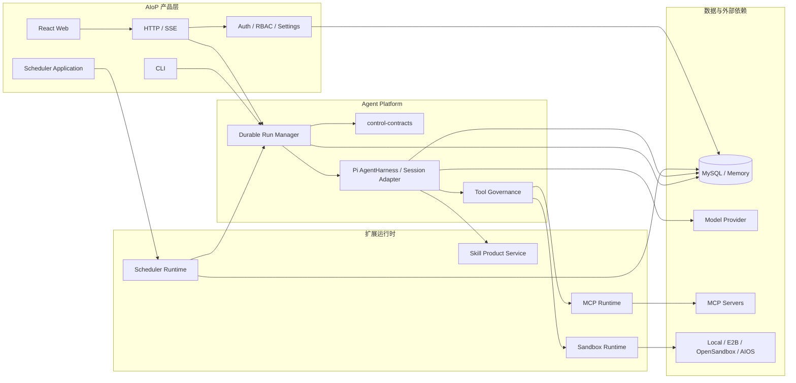
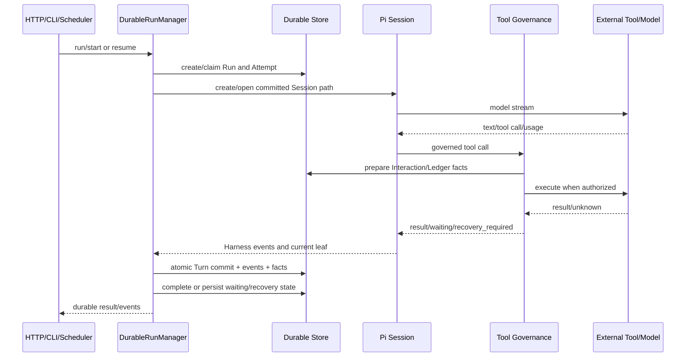
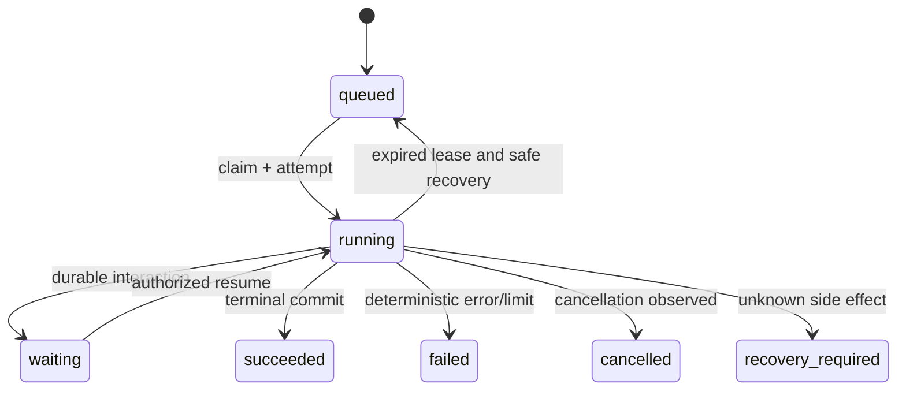

# Pi 集成与 Agent Platform 模块化设计

> 状态：当前实现基线。本文描述 2026-07-31 代码，不再描述 Legacy/LangGraph 迁移过程。历史设计与实施步骤保留在 `docs/superpowers/specs/` 和 `docs/superpowers/plans/`。

## 1. 概述

### 1.1 文档信息

| 项目 | 内容 |
| --- | --- |
| 文档名称 | Pi 集成与 Agent Platform 模块化设计 |
| 版本 | v2.0 |
| 更新日期 | 2026-07-31 |
| 适用范围 | AIoP Durable Pi Runtime、五个工作区包、产品适配与部署 |
| 状态 | 与当前代码一致；生产环境验证结果不在本文声明 |

### 1.2 当前结论

AIoP 已完成 Pi-first 收敛：当前构建只有 `DurableRunRuntime`，由 `@aiop/pi-runtime` 的 `DurableRunManager` 实现，并以 Pi 0.82.1 的 `AgentHarness`、`Agent`、`Session`、模型与 compaction 能力执行会话内循环。

旧 `AgentRuntime` 兼容接口、Legacy/LangGraph Kernel、运行时选择器、消息兼容 codec、checkpoint 表和 graph/runtime compatibility 字段均已删除。产品恢复依赖 AIoP 的 Run/Attempt/Turn/Interaction/Tool Ledger/Pi Session 协议，不依赖第二套 Agent loop。

### 1.3 设计目标

1. 复用 Pi 的 Agent loop、Session Tree、模型协议、Skill resource 与 compaction。
2. 由 AIoP 掌握 durable、多租户、审批、副作用、恢复和产品查询语义。
3. 以五个可构建、可校验的 ESM 工作区包提供稳定模块边界。
4. HTTP/SSE、CLI 与 Scheduler 使用同一 Durable Run 控制面。
5. MySQL 与 Memory 实现遵守同一核心合同，生产多进程使用 MySQL fencing。

### 1.4 非目标

- 不提供 Kernel 选择或旧 Run 执行兼容。
- 不把 Pi 的 CLI/TUI、本地 cwd 或内置生产工具直接暴露给 AIoP 用户。
- 不用 Pi Session 代替产品 Run、权限、Interaction、Tool Ledger 或审计。
- 不承诺所有进程内资源都可无状态跨副本迁移。
- 不在本文声明尚未实际执行的生产部署、备份或回滚结果。

### 1.5 关键决策

| 编号 | 决策 | 原因与影响 |
| --- | --- | --- |
| D-01 | Pi 版本固定为 0.82.1 | 通过精确版本和合约测试隔离上游行为变化 |
| D-02 | 公开控制面只有 `DurableRunRuntime` | 删除迁移期兼容接口，避免两套运行语义 |
| D-03 | Pi Session Tree 与 AIoP Durable Store 分工 | Session 保存会话树；Store 保存跨进程控制、安全和产品事实 |
| D-04 | Tool 调用统一经过 Governance | 模型、MCP、Sandbox 和产品工具不能绕过权限、审批与 ledger |
| D-05 | 新环境使用单一 baseline migration | 当前代码结构清晰；存量环境升级必须单独设计转换流程 |
| D-06 | Scheduler 先绑定 Run 再观察或恢复 | fire/run 关系可幂等恢复，避免 Worker 崩溃后重复创建 Run |

## 2. 系统架构

### 2.1 当前架构图



| 模块 | 负责 | 是否自研 |
| --- | --- | --- |
| AIoP 产品层 | HTTP/SSE、Web、CLI、认证、RBAC、设置和产品 DTO | **是。** 直接承载 AIoP 产品与租户语义 |
| control-contracts | Identity、Run、Interaction、Tool、Event 和错误契约 | **是。** 保持无运行时依赖的稳定控制接口 |
| Durable Run Manager | Run/Attempt/Turn、lease/fencing、预算、append、取消和恢复 | **是。** 负责跨请求和跨进程一致性 |
| Pi AgentHarness / Session Adapter | Pi AgentHarness、Session、模型、事件、Tool bridge 与 compaction 映射 | **部分自研。** 复用 Pi 0.82.1，自研产品适配与恢复边界 |
| Tool Governance | capability、policy、approval、ledger、audit 和并发限制 | **是。** 平台必须掌握副作用和安全判定 |
| MCP Runtime | MCP client、租户/actor 作用域、重连和 Tool adapter | **部分自研。** 复用 MCP SDK，自研作用域与治理接入 |
| Sandbox Runtime | Provider、生命周期、Profile、Desktop、输出和 Tool adapter | **部分自研。** 复用 E2B/OpenSandbox，自研统一契约与控制层 |
| Skill Product Service | 导入、审核、启停、共享、凭据目标和 Pi resource 投影 | **部分自研。** 复用 Pi Skill resource，自研产品治理 |
| Scheduler Runtime | Cron、Fire claim、Run 绑定、过期恢复和 MySQL Store | **是。** 需要稳定的无人值守和幂等语义 |
| 数据层 | Durable Store、Pi SessionStorage、产品 Store、Scheduler Store | **是。** 使用 MySQL 事务、唯一键和 fencing 保证一致性 |

### 2.2 工作区包

| 包 | 版本 | 当前职责 | 主要依赖 |
| --- | --- | --- | --- |
| `@aiop/control-contracts` | `0.1.0-preview.1` | 纯 TypeScript 控制契约与错误 | 无运行时依赖 |
| `@aiop/pi-runtime` | `0.1.0-preview.1` | Pi adapter、Durable Run、Governance、Memory/MySQL Store | control-contracts、Pi、Kysely |
| `@aiop/mcp-runtime` | `0.1.0-preview.1` | MCP client/runtime/manager 和 Tool adapter | control-contracts、pi-runtime、MCP SDK |
| `@aiop/sandbox-runtime` | `0.1.0-preview.1` | Sandbox Provider、生命周期、Desktop 与 Tool adapter | control-contracts、pi-runtime、E2B、OpenSandbox |
| `@aiop/scheduler-runtime` | `0.1.0-preview.1` | Cron、Fire、Run dispatcher/recovery 与 Store | control-contracts、cron-parser、Kysely |

所有包均为 ESM，Node.js 基线为 `>=22.19.0`，发布文件仅包含 `bin`。公共 export 由各包 `src/index.ts` 和 `scripts/check-public-api.ts` 约束。

### 2.3 产品装配边界

`src/runtime.ts` 是 composition root，负责把五个包接入产品 Store、模型设置、Skill、MCP、Sandbox、Auth、Tool 与审计。工作区包不导出 `RequestContext`、HTTP DTO、React 类型或完整产品 `Store`。

### 2.4 从接口定位实现

| 想理解的契约 | 定义 | 默认实现/装配 | 代表性测试 |
| --- | --- | --- | --- |
| Durable Run | `packages/control-contracts/src/run.ts` | `packages/pi-runtime/src/run/manager.ts`、`src/runtime.ts` | `tests/pi-runtime/durable-run.test.ts` |
| Tool Runtime | `packages/control-contracts/src/tool.ts` | `packages/pi-runtime/src/tools/governance.ts` | `tests/pi-runtime/tool-governance.test.ts` |
| Pi Session | Pi `SessionRepo` + AIoP store types | `packages/pi-runtime/src/pi/agent.ts`、`store/pi-session-mysql.ts` | `tests/pi-runtime/mysql-session-storage.test.ts` |
| MCP | `packages/mcp-runtime/src/types.ts` | `runtime.ts`、`manager.ts` | `tests/mcp-runtime/` |
| Sandbox | `packages/sandbox-runtime/src/contracts.ts` | provider、controller、tool adapter | `tests/sandbox-runtime/` |
| Scheduler | `packages/scheduler-runtime/src/domain.ts` | `runner.ts`、`recovery.ts`、`src/scheduler/runner.ts` | `tests/scheduler-runtime/` |

## 3. 功能设计

### 3.1 Run 核心时序



### 3.2 Run 状态机



`succeeded` 与 `cancelled` 不可恢复。`waiting`、`failed` 和 `recovery_required` 只能通过显式 resume 路径重新 claim；恢复仍校验 tenant、actor、lease、Interaction 与 Tool Ledger。

### 3.3 Turn 提交规则

1. 恢复只从 `committed_leaf_id` 对应路径开始。
2. 只有当前 attempt/fencing token 可以提交 Turn 或终态。
3. Turn commit 同时写 durable event、Interaction 更新、Ledger 更新和 Pi leaf 水位线。
4. 未提交 Pi 分支不能进入产品消息 projection。
5. 失租、取消或事务冲突时，迟到模型/工具结果不得改变 Run 终态。

### 3.4 Append 与 Inbox

- 同进程活跃 Session 可直接调用 Pi `steer` 或 `followUp`。
- 跨进程 append 写入 `agent_run_inbox_messages`，由 lease owner 领取。
- append 使用 `idempotency_key`、sequence、claim token 和过期时间。
- Session custom entry 记录已消费 inbox id，恢复时据此防止重复投递。
- Run 终态或 `append_closed_at` 后拒绝 append。

### 3.5 Tool 与 Interaction

Tool capability 为 `read`、`retryable_write`、`non_idempotent_write`。每次执行绑定 tenant、actor、run、attempt、turn、tool call 与 logical call。

- `approval`、`question`、`plan` 是 durable Interaction。
- `pending_approval`、`started`、`completed`、`unknown`、`recovery_required` 是 Ledger 状态。
- 可安全重试的调用可按持久结果复用。
- 非幂等调用结果未知时不能自动重放，Run 进入 `recovery_required`。
- Hook 是附加扩展，当前 fail-open，不是唯一安全边界。

### 3.6 Scheduler Fire

Scheduler 使用 `pending → claimed → bound/recovering → started` 状态。`fire_id` 由 task 与 fire time 稳定生成；Run id 在执行完成前先持久化为 bound。过期 bound fire 通过 inspection 判断原 Run active、terminal 或 recoverable，再决定等待、完成或 resume。

## 4. 数据设计

### 4.1 事实源

- Pi Session Tree：会话 message、branch、compaction 与 Session stats。
- AIoP MySQL：Run、Attempt、Turn、Event、Inbox、Interaction、Ledger、Scheduler、身份、设置、审计和产品 projection。

### 4.2 当前表组

| 表组 | 表 | 关键语义 |
| --- | --- | --- |
| Durable Run | `agent_runs`、`agent_run_attempts`、`agent_turn_snapshots`、`agent_turn_commits`、`agent_run_events` | lease/fencing、预算、提交水位线与有序事件 |
| Interaction/Tool | `agent_interactions`、`agent_tool_executions` | 等待、解析、幂等和未知副作用 |
| Append | `agent_run_inbox_messages` | 跨 Worker 消息、claim 与消费凭证 |
| Pi Session | `pi_sessions`、`pi_session_entries` | current/committed leaf 与稳定 entry sequence |
| Scheduler | `scheduled_tasks`、`scheduler_fires`、`task_runs`、`task_agent_runs` | Cron、Fire claim、Run 绑定与产品查询 |
| 产品数据 | `sessions`、`messages`、`users`、`user_credentials`、`tenant_settings`、`setting_secrets`、`audit_events` | 产品会话、身份、设置、Secret 和审计 |

### 4.3 事务与索引原则

- tenant id 是主要隔离键；用户私有数据进一步绑定 user id。
- Run、Interaction、Ledger、Inbox 与 Fire 使用业务唯一键保证幂等。
- claim/commit/complete 使用条件更新、row lock 与 fencing token 拒绝旧 Worker。
- Turn commit 内写入的 Run、Event、Interaction、Ledger 和 Session 水位线必须同成同败。
- Memory Store 只用于本地与合同测试；生产多副本使用 MySQL。

### 4.4 Migration

当前仓库只保留 `src/db/migrations/0001_baseline.sql`。它定义新环境的 Pi-only schema，不包含 LangGraph checkpoint、旧 graph 字段或历史兼容数据转换。存量数据库升级必须在部署前独立评估和演练。

## 5. Interface 与 API

### 5.1 Durable Run 公共接口

```typescript
export interface DurableRunRuntime {
  run(input: StartRunInput): Promise<RunHandle>;
  resume(input: ResumeRunInput): Promise<RunHandle>;
  cancel(input: CancelRunInput): Promise<void>;
  append(input: AppendRunMessageInput): Promise<void>;
}
```

输入身份只能来自可信服务端上下文。`append` 必须携带 mode 与 idempotency key；`RunHandle` 提供 durable event stream、Attempt 和最终结果。

### 5.2 Tool 公共接口

```typescript
export interface ToolRuntime {
  execute(call: ToolCall, context: ToolExecutionContext): Promise<ToolExecutionOutcome>;
}
```

输出显式区分 `result`、`waiting` 与 `recovery_required`。具体数据库行、产品 Store 或第三方 SDK 类型不得泄漏到 control contract。

### 5.3 HTTP Run API

| 方法 | 路径 | 说明 |
| --- | --- | --- |
| POST | `/v1/agent` | 创建 Durable Pi Run，返回 live SSE projection |
| GET | `/v1/agent/runs` | 查询当前用户可见的 Run |
| GET | `/v1/agent/runs/{runId}` | 查询 Run Center 详情 |
| GET | `/v1/agent/runs/{runId}/events` | 按 sequence 一次性重放 durable event |
| POST | `/v1/agent/runs/{runId}/cancel` | 持久化取消请求 |
| POST | `/v1/agent/runs/{runId}/resume` | 显式恢复可恢复 Run |

HTTP 层负责认证、ownership、DTO 与错误码；Runtime 负责 durable 语义。SSE 断开只 detach，不自动取消 Run。

## 6. 非功能设计

### 6.1 可靠性

- lease heartbeat 与 fencing 阻止旧 Attempt 提交。
- durable inbox 支持跨 Worker append。
- Scheduler bound Run recovery 防止重复调度。
- 非幂等未知结果进入人工恢复，不做盲目重放。
- 当前没有通用的过期 Run 自动扫描 supervisor，显式恢复与 Scheduler recovery 不能等同于完整自动接管。

### 6.2 安全

- tenant/actor/role 来自认证上下文，不信任模型或请求体中的同名字段。
- Tool Governance 统一执行 capability、RBAC、Policy、Approval、Hook 与 Audit。
- EventCodec 对 detail 限长、限深、脱敏；凭据不进入 Session 或 durable event。
- `AIOP_JWT_SECRET` 与 `AIOP_SETTINGS_SECRET` 分离；开发占位密钥不可用于生产。

### 6.3 性能与容量

- 模型与 Tool 分别有进程内并发控制。
- Run limits 支持 attempts、turns、tool calls、token、cost 与 deadline。
- 事件和 Tool detail 受大小限制，避免将完整外部输出写入时间线。
- MySQL 热点集中在 Run lease、event sequence、Inbox claim 与 Scheduler claim，扩容前需压测索引与锁等待。

### 6.4 可观测性

- `pino` 提供结构化日志。
- `agent_run_events`、`audit_events`、Tool Ledger 与 Pi committed leaf 分别承担执行、管理、副作用与上下文事实。
- 关键关联字段包括 tenantId、runId、attemptId、turnNo、toolCallId、fireId 和 correlationId。
- 仓库尚无 Prometheus exporter；指标与告警属于待实现能力。

### 6.5 兼容与回滚

- npm 包为 preview 版本，升级必须运行 public API、tarball、typecheck 与全量测试。
- 当前没有旧 Kernel 回退开关；应用回滚只能回到与 Pi-only schema 兼容的构建。
- `make rollback-staging` 只回滚 Deployment revision，不回滚数据库。
- 非空历史数据库不得直接假设与 `src/db/migrations/0001_baseline.sql` 兼容。

## 7. 开源组件引用

以下版本与 License 取自当前 lockfile/已安装 package manifest；Star 未联网复核，不作为当前设计依据。

| 组件 | 版本 | 功能 | Star（2026-07-31） | License | 选择原因 | 风险与隔离方式 |
| --- | --- | --- | --- | --- | --- | --- |
| `@earendil-works/pi-agent-core` / `pi-ai` | 0.82.1 | AgentHarness、Session、模型、事件、compaction | 未核实 | MIT | 复用完整 Agent loop 与上下文生态 | 精确锁版；adapter 与合约测试隔离上游变化 |
| `@modelcontextprotocol/sdk` | 1.29.0 | MCP client 与协议类型 | 未核实 | MIT | 保持协议兼容 | MCP Runtime 隔离租户、凭据和重连策略 |
| Kysely / mysql2 | 0.29.2 / 3.22.5 | 类型化 SQL 与 MySQL driver | 未核实 | MIT | 支持显式事务与数据库契约 | Schema/transaction 由 AIoP 掌握，禁止泄漏 driver 类型 |
| OpenSandbox | 0.1.9 | Kubernetes 隔离执行 | 未核实 | Apache-2.0 | 提供自建 Sandbox 基础设施 | Provider adapter、Profile 与 RBAC 隔离能力差异 |
| E2B code-interpreter / desktop | 2.6.0 / 2.3.1 | 托管代码与桌面沙箱 | 未核实 | MIT | 提供成熟托管 Provider | 通过 Provider 契约隔离 API、配额和网络依赖 |
| cron-parser | 5.5.0 | Cron 解析与下次触发时间 | 未核实 | MIT | 避免自研 Cron parser | `scheduler-runtime` 封装时区和 Fire 语义 |

## 8. 验证与发布

### 8.1 代码验证

```text
make verify-node
make test-agent-platform
make test-runtime-refactor
```

`npm run verify:packages` 还会校验 package build、public API 与 tarball 内容。

### 8.2 镜像与测试环境

```text
make image
make deploy-staging
make rollback-staging
```

`make deploy-staging` 只使用 `deploy/dev-k8s/`，检查预置 Secret 名称但不读取 Secret 内容。环境验收结果应写入 `dist/`，不提交 Git。

## 9. 当前风险与后续工作

1. 增加通用过期 Run 自动接管 supervisor，并区分安全恢复与人工恢复。
2. 解决直接 Tool Interaction、MCP connection、Sandbox handle 和 Download Store 的跨副本协调。
3. 明确模型/Sandbox/MCP 运行态设置是平台级还是 tenant-scoped，并修正缓存和权限语义。
4. 为 baseline 之前的存量数据库提供正式转换、dry-run、备份与回滚方案。
5. 增加标准 metrics exporter、告警和容量基线。
6. 拆分 `src/runtime.ts`、`src/server/http.ts` 与 `web/src/App.tsx`，保持现有契约测试不变。

## 10. 维护本文的规则

- 包、接口、状态或表名变更时，先改 public contract/migration 和测试，再更新本文。
- “目标设计”必须放入路线章节，不能混入当前时序和状态机。
- 任何新架构箭头都要说明是编译依赖、运行调用、事件流还是数据持久化。
- 代码示例只展示公共稳定接口；实现细节使用真实路径和测试作为入口。
- 发布、备份和恢复结果只记录可核查 evidence，不从设计推断环境已成功。
