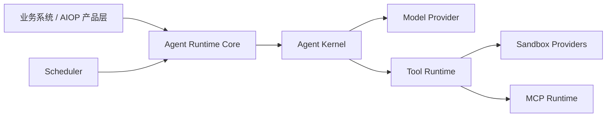

# Pi Agent Core 集成与 Agent Platform SDK 模块化方案

> 状态：拟实施方案。本文描述目标架构、模块边界和迁移计划，不代表当前已实现能力。
>
> 关联文档：[Agent Runtime](./02-agent-runtime.md)、[模型与上下文](./03-model-and-context.md)、[工具、Skill 与 MCP](./04-tools-skills-mcp.md)、[数据与持久化](./07-data-and-persistence.md)、[部署与可观测性](./10-deployment-observability.md)、[演进路线](./11-evolution-roadmap.md)。

## 1. 决策摘要

AIOP 引入 Pi 的目的，是复用成熟的通用 Agent loop，统一“模型请求 → 工具调用 → 工具结果 → 下一轮模型请求”的短生命周期编排。Pi 不替代 AIOP 的企业安全控制面、持久化运行时和产品入口。

同时，AIOP 将现有 Agent Runtime 演进为可供其他 Node.js 团队嵌入的模块化 Agent Platform SDK。Runtime、Pi Kernel、ToolBroker、Sandbox、Scheduler、MCP、Skill 和持久化实现独立发布、按需组合。

核心决策：

1. 新增 `PiAgentKernel`，保持稳定 `AgentKernel` 契约；HTTP、CLI、Scheduler 和业务系统不感知 Pi 事件与内部类型。
2. 首期使用 `@earendil-works/pi-agent-core` 的低层 `agentLoop/agentLoopContinue`。AIOP `TurnController` 负责 awaited event sink、`shouldStopAfterTurn`、durable queue 和每轮提交栅栏。
3. 直接依赖 `@earendil-works/pi-ai`，用于 Pi 模型、消息、上下文和流式协议类型。模型调用仍必须经过使用方注入的 `ModelProvider`。
4. 首期不依赖 `@earendil-works/pi-coding-agent`。Pi `0.82.1` 已从 `pi-agent-core` 顶层公开 compaction、token estimation、Skill、truncate 和 `AgentHarness`。
5. 首期不采用 `AgentHarness`。它虽然是公开 export，但包含 Session、filesystem、工具和本地运行假设，超出可复用 Runtime 的最小边界。
6. AIOP 自研并持有 Run、Attempt、Turn、Lease、恢复、审批、Tool Ledger、幂等、策略和审计等 durable 能力。
7. Agent Platform SDK 采用“核心契约 + 可选适配包”，不要求复用团队使用 AIOP 的数据库、认证、HTTP 或具体运维工具。
8. LangGraph 进入废弃流程，不再承载新增功能。Pi 和 Durable Runtime 完成替代、存量 Run 收敛后，删除 LangGraph Kernel、Checkpoint Saver、依赖和专用数据表。

## 2. 当前态、目标态与范围

### 2.1 当前态

当前仓库已经具备：

- `AgentRuntime`、Legacy Kernel 和 LangGraph Kernel；
- MySQL/Memory Store、Agent Run、Lease、Run Event；
- LangGraph Checkpoint、Durable Interaction 和 Tool Ledger；
- 自研中立模型协议、Anthropic/OpenAI Adapter 和 Model Gateway；
- ToolBroker、Policy、Approval、Hook、Sandbox、MCP 和 Scheduler；
- HTTP/SSE、CLI、Scheduler 等入口。

当前限制：

- `AgentRuntime` 直接依赖 AIOP `Store`、`RequestContext`、具体 Kernel、LangGraph 和日志实现，尚不能作为独立 npm 包复用；
- 现有 checkpoint 是 LangGraph 专用协议，不能直接作为 Pi durable checkpoint；
- Durable Interaction 的 waiter 仍为进程内状态，跨副本解析不能自动唤醒旧进程；
- 模型、Sandbox Controller 和 MCP Manager 主要是进程级实例，完整的 tenant 级运行隔离尚未实现；
- LiteLLM、Langfuse 和专用 metrics SDK 尚未集成，属于可选目标能力。

### 2.2 目标态

```text
业务系统
  ├── IdentityContext
  ├── ModelProvider
  ├── ToolProvider
  ├── RuntimeStore
  └── EventSink
        │
        ▼
Agent Platform SDK
  Run → Attempt → Turn
  Lease / Cancel / Resume
  Snapshot / Commit Barrier
  Kernel Registry
        │
        ├── PiAgentKernel
        ├── Tool Runtime ──▶ Sandbox / MCP / 业务工具
        └── Scheduler ─────▶ 创建 Agent Run
```

### 2.3 本方案范围

- 抽取稳定的 Agent Platform 公共契约和 Runtime Core；
- PiAgentKernel、Pi 模型流、工具和事件适配；
- Run、Attempt、Turn、Snapshot、Commit Barrier、取消和 lease guard；
- Tool Runtime、Sandbox、Scheduler、MCP、Skill 的独立模块边界；
- 只读工具 POC、写工具审批/resume、幂等与恢复验证；
- LangGraph 的冻结、停流、存量恢复、代码删除和数据清理。

### 2.4 非目标

- 将 AIOP Web、HTTP、认证、管理页面整体打入 Runtime Core；
- 要求复用团队使用 AIOP MySQL Schema、RBAC、Sandbox 或 MCP 配置；
- 引入 Pi coding-agent CLI、TUI、JSONL Session、`AgentSessionRuntime` 或本地 workspace/cwd；
- 使用 Pi 内置 bash/read/edit/write 工具直接访问生产环境；
- 在 Pi 和 Durable Runtime 尚未覆盖恢复能力前立即删除 Legacy Kernel 或 LangGraph Kernel；
- 在本方案中同时完成 LiteLLM、Langfuse 和 Temporal 的生产部署。

## 3. Agent Platform SDK 包设计

### 3.1 包划分

| npm 包 | 责任 | 主要依赖 |
| --- | --- | --- |
| `@aiop/agent-contracts` | 身份、模型、工具、事件、Run、错误等稳定类型 | 无运行时依赖 |
| `@aiop/agent-runtime-core` | Run/Attempt/Turn、Kernel Registry、Lease、取消、恢复编排 | contracts |
| `@aiop/agent-kernel-pi` | Pi loop、context/model/tool/event 适配 | runtime-core、Pi |
| `@aiop/tool-runtime` | Policy、Approval、Ledger、幂等、锁和工具分发框架 | contracts |
| `@aiop/sandbox-core` | Sandbox 生命周期、Profile、配额、命令和文件抽象 | contracts |
| `@aiop/sandbox-opensandbox` | OpenSandbox Provider | sandbox-core、OpenSandbox SDK |
| `@aiop/sandbox-e2b` | E2B Provider | sandbox-core、E2B SDK |
| `@aiop/sandbox-local` | 仅开发测试使用的本地 Provider | sandbox-core |
| `@aiop/scheduler-core` | Cron、任务定义、claim、并发和重试策略 | contracts |
| `@aiop/scheduler-mysql` | MySQL 多副本 claim、`SKIP LOCKED` 和任务持久化 | scheduler-core、Kysely |
| `@aiop/mcp-runtime` | MCP Server 生命周期、工具发现和调用适配 | contracts、MCP SDK |
| `@aiop/skill-runtime` | Skill 注册、版本、加载、可见性和提示词投影 | contracts |
| `@aiop/agent-runtime-mysql` | Run、Attempt、Turn、Interaction、Ledger 持久化 | runtime-core、Kysely |
| `@aiop/agent-runtime-aiop` | AIOP RequestContext、RBAC、Store、SSE 和管理面适配 | 上述按需模块 |
| `@aiop/agent-platform` | 便捷聚合导出和默认组装，不承载业务实现 | 上述按需模块 |

### 3.2 依赖方向



依赖规则：

- Scheduler 是 Runtime 的触发器，不属于 Agent loop；
- Sandbox 是工具执行基础设施，不属于 Runtime 状态机；
- Runtime 只依赖端口接口，不依赖 MySQL、HTTP、Pi、Sandbox 或 MCP 的具体实现；
- Provider 和产品适配包不得被 Core 反向依赖；
- 聚合包只负责组装，不能成为新的业务实现入口。

### 3.3 最小嵌入示例

```ts
const runtime = createAgentRuntime({
  store: runtimeStore,
  kernels: [piKernel],
  modelProvider,
  toolProvider,
  eventSink,
});

const result = await runtime.run({
  identity: {
    tenantId: "tenant-a",
    actorId: "user-a",
    roles: ["operator"],
  },
  sessionId: "session-a",
  input: [{ type: "text", text: "检查集群异常" }],
});
```

接入方可以只使用 Runtime Core 和 Pi Kernel；需要 durable、Sandbox、MCP 或 Scheduler 时再安装相应适配包。

## 4. Runtime Core 稳定契约

### 4.1 核心接口

```ts
interface AgentRuntime {
  run(input: RunInput): Promise<RunResult>;
  resume(input: ResumeInput): Promise<RunResult>;
  cancel(identity: RunIdentity): Promise<void>;
}

interface AgentKernel {
  readonly descriptor: KernelDescriptor;
  run(context: KernelRunContext): Promise<KernelResult>;
}

interface RuntimeStore {
  runs: RunRepository;
  attempts: AttemptRepository;
  turns: TurnRepository;
  interactions: InteractionRepository;
  toolLedger: ToolLedgerRepository;
}

interface IdentityContext {
  tenantId: string;
  actorId: string;
  roles: string[];
  attributes?: Record<string, unknown>;
}
```

### 4.2 Runtime Core 负责

- Run、Attempt、Turn 生命周期；
- Kernel 注册、选择、版本锁定和兼容检查；
- Lease 获取、续约、fencing、取消和 deadline；
- TurnSnapshot、提交栅栏和恢复判断；
- Interaction 等待、批准后恢复和人工恢复状态；
- 中立事件、usage、错误和 stop reason；
- 最大 turn、工具调用、token、费用和耗时限制；
- durable steering/follow-up queue 的调度语义。

### 4.3 Runtime Core 不负责

- 用户认证、JWT/OIDC 和产品 RBAC；
- HTTP、SSE、CLI 和 UI；
- MySQL/Kysely 具体实现和数据库迁移执行；
- 具体模型 SDK、模型密钥和 provider registry；
- Kubernetes、MCP、Sandbox、ITSM 的实际执行；
- AIOP 特有的 cluster/namespace ACL 和运维策略。

### 4.4 Run 状态

公共状态保持少而稳定：

```text
queued → running → succeeded
                 → waiting → running
                 → failed
                 → cancelled
                 → recovery_required
```

`waiting` 使用独立 `waitingReason = approval | question | plan | external` 描述原因，不为每类交互扩展新的顶层状态。

## 5. Pi 依赖策略

### 5.1 已核验的 Pi 0.82.1 能力

| 包 | 使用范围 | 禁止范围 |
| --- | --- | --- |
| `@earendil-works/pi-agent-core` | `agentLoop`、`agentLoopContinue`、事件、工具批处理、abort、compaction、token estimation、Skill、truncate | durable runtime、生产授权和权威 Session |
| `@earendil-works/pi-ai` | 消息、模型、context、tool call、stream 和 usage 类型 | 多租户模型控制面 |
| `@earendil-works/pi-coding-agent` | 首期不依赖 | CLI/TUI、JSONL Session、本地 cwd、内置 tools、coding-agent Runtime |

`AgentHarness` 在 `pi-agent-core@0.82.1` 中是顶层公开 export。首期不使用它，是因为其职责和依赖面超出 Runtime Core，而不是因为它属于未公开 deep import。

### 5.2 版本锁定

Pi 相关直接依赖使用精确版本：

```json
{
  "@earendil-works/pi-agent-core": "0.82.1",
  "@earendil-works/pi-ai": "0.82.1"
}
```

同时必须：

- 提交 lockfile；
- 使用 package manager overrides 锁定 Pi 传递依赖的同一版本线；
- 在发布包 metadata 中记录 Pi 版本；
- 每次升级运行独立合约、安全和故障恢复测试。

### 5.3 Node 基线

Pi `0.82.1` 要求 Node.js `>=22.19.0`。AIOP `package.json` 当前仍声明 `>=20`，但现有 Kysely `0.29.2` 已要求 Node.js `>=22.0.0`。Node 基线升级应作为独立前置工作，统一 package manifest、CI、镜像和部署环境。

## 6. PiAgentKernel 设计

### 6.1 模块布局

目标 workspace 包布局如下：

```text
packages/
  agent-contracts/
  agent-runtime-core/
  agent-kernel-pi/
    src/
      pi-agent-kernel.ts
      pi-turn-controller.ts
      pi-context-adapter.ts
      pi-model-stream-adapter.ts
      pi-tool-adapter.ts
      pi-event-bridge.ts
      pi-error-mapper.ts
      pi-tool-execution-policy.ts
      pi-types.ts
```

为减少首期改动，迁移期间允许先在 `src/agent/pi/**` 落地，待公共契约稳定后再机械迁入 workspace package。

### 6.2 Kernel 流程

```text
1. Runtime Coordinator 创建 Run 或领取已有 Run 的 lease。
2. 创建新的 Attempt，并生成首轮不可变 TurnSnapshot。
3. Context Adapter 投影模型可见消息、system prompt 和工具集。
4. Tool Adapter 创建只会调用 ToolProvider/Tool Runtime 的 Pi 工具。
5. Model Stream Adapter 创建受 ModelProvider 控制的 StreamFn。
6. TurnController 调用 agentLoop 或 agentLoopContinue。
7. awaited event sink 持久化必要事件并发布受控实时事件。
8. turn_end 后完成 commit barrier，再决定停止或创建下一轮快照。
9. attempt 收敛后由 Runtime 决定 succeeded、waiting、failed 或 recovery_required。
```

Pi attempt 与 Agent Run 不是同一个状态机。Pi `agent_end` 只表示本次进程内 loop 不再产生事件，不能直接代表业务 Run 成功。

### 6.3 TurnSnapshot

```ts
interface TurnSnapshot {
  snapshotId: string;
  runId: string;
  attemptId: string;
  turnId: string;
  tenantId: string;
  actorId: string;
  roles: string[];
  sessionVersion: number;
  parentCommitId: string | null;
  model: {
    provider: string;
    modelId: string;
    routeId: string;
    thinkingLevel: string;
    policyVersion: string;
  };
  prompt: {
    systemPromptVersion: string;
    skillSetVersion: string | null;
    contentDigest: string;
  };
  tools: {
    toolSetVersion: string;
    visibleToolNames: string[];
    policyVersion: string;
  };
  execution: {
    leaseToken: bigint;
    startedAt: string;
    deadlineAt: string | null;
  };
}
```

规则：

- identity 来自可信 `IdentityContext`，不能从模型消息或工具参数推导；
- 管理员更新模型、Skill、工具或策略后，只能在下一 TurnSnapshot 生效；
- snapshot 和版本信息必须写入 durable event；
- transcript、snapshot 和 commit record 是权威来源，Pi 内存状态允许丢弃；
- JSON/API 传输 bigint fencing token 时使用十进制字符串，内部领域类型保持 bigint。

## 7. 持久化模型与提交协议

### 7.1 新增 durable 实体

| 实体 | 作用 | 关键唯一键 |
| --- | --- | --- |
| `agent_runs` | 跨请求业务 Run 和固定 Kernel、Kernel 版本、模型策略与工具集 binding | tenant + run |
| `agent_run_attempts` | 每次进程内执行尝试 | tenant + run + attempt |
| `agent_turn_snapshots` | provider 请求前的不可变快照 | tenant + run + attempt + turn |
| `agent_turn_commits` | 一轮已完整提交的 commit marker | tenant + run + attempt + turn + commit |
| `agent_interactions` | approval/question/plan 等等待事实 | tenant + interaction |
| `agent_tool_executions` | 工具幂等、结果和恢复事实 | tenant + run + logical tool call |
| `agent_run_events` | 可重放的运行时间线 | tenant + run + sequence |

Pi checkpoint 不复用 LangGraph Saver 协议。公共 `RuntimeStore` 定义领域仓储，AIOP MySQL Adapter 再映射到具体表。

### 7.2 Turn Commit Barrier

每轮按以下顺序提交：

1. 开启事务并验证当前 lease/fencing token；
2. 写入 assistant message 和已确认的 tool result；
3. 更新 Tool Ledger；
4. 写入 usage、Run Event 和 Interaction；
5. 写入 `agent_turn_commits` commit marker；
6. 提交事务并推进 durable event 可见水位；
7. 允许创建下一 TurnSnapshot。

MySQL Adapter 应在单库场景使用一个事务，并让状态更新携带 fencing 条件。外部工具副作用无法加入数据库事务，因此必须依赖 Tool Ledger、幂等键和恢复策略解决部分成功。

恢复器只信任带 commit marker 的 turn。没有 marker 的部分写入必须通过幂等检查完成或转入 `recovery_required`。

## 8. 模型、Context 与事件适配

### 8.1 ModelProvider

Pi `StreamFn` 只负责协议适配：

```text
Pi Kernel
  → PiModelStreamAdapter
    → ModelProvider
      → AIOP ChatModel / LiteLLM / 其他实现
```

Runtime Core 不依赖 LiteLLM。AIOP 首期复用现有中立 `ChatModel` 和 Anthropic/OpenAI Adapter；LiteLLM、Langfuse 和其他模型网关通过独立 Provider 后续接入。

ModelProvider 必须：

- 从可信 RunContext 接收 tenant、actor、run、attempt、turn 和 trace 字段；
- 规范化 streaming delta、tool call、usage、cache token、stop reason 和 error；
- 将取消、lease 失效、deadline 和 worker shutdown 连接到 abort signal；
- 将 provider 失败编码为 Pi 约定的 error stream，不能抛出未处理 rejection；
- 实施模型允许列表、重试、token、费用和时间预算。

### 8.2 Context 分层

```text
持久化 Transcript：完整、可恢复、可审计的原始事实。
模型可见 Context：经过权限过滤、脱敏、裁剪和摘要的消息。
运行控制 Context：identity、lease、policy、trace、ledger 等可信内部数据。
```

Pi 可以提供 compaction、token estimation、Skill 和 truncate 算法。AIOP 或接入方仍负责：

- 预算值和模型安全余量；
- 哪些消息可见、必须保留或禁止摘要；
- Skill 版本、租户可见性和提示词投影；
- 凭据、审批标识、内部句柄和跨租户数据脱敏；
- 完整原文、摘要来源和审计关联。

### 8.3 EventSink 与背压

影响状态机或审计的事件必须 awaited；高频实时事件使用有界队列：

| Pi 事件 | Durable 动作 | 实时动作 |
| --- | --- | --- |
| `agent_start` | 创建 attempt event | 发布开始事件 |
| `message_update` | 不逐 delta 持久化 | 有界队列、节流发布 |
| `message_end` | 写 transcript、usage | 发布最终消息 |
| `tool_execution_start` | 创建/推进 Ledger | 发布工具开始 |
| `tool_execution_update` | 可选采样日志 | 有界队列、节流发布 |
| `tool_execution_end` | 更新 Ledger、审计 | 发布工具结果 |
| `turn_end` | snapshot、usage、commit barrier | 发布 turn 完成 |
| `agent_end` | attempt 收敛事件 | 发布 attempt 完成 |

实时事件不得通过无界 fire-and-forget 绕过 durable barrier。每个 durable event 具有单调 sequence，SSE 可以按 sequence 重连补发。

## 9. Tool Runtime、审批与恢复

### 9.1 ToolProvider 边界

Pi 工具唯一允许的执行入口是 ToolProvider：

```text
Pi tool call
  → 参数结构校验
  → Tool Runtime
    → 身份和工具可见性
    → Policy / RBAC / 资源 ACL
    → Approval / Interaction
    → Hook
    → Tool Ledger / idempotency
    → Resource Lock
    → Sandbox / MCP / 业务工具分发
    → Audit
  → Pi tool result
```

Pi schema 校验不是授权。Pi 工具不得绕过 Tool Runtime 直连 Kubernetes、MCP、Sandbox、shell、数据库、ITSM 或用户凭据。

### 9.2 串并行策略

| 类别 | 执行模式 | 额外限制 |
| --- | --- | --- |
| 日志、指标、资源查询、知识检索 | parallel | 读 ACL、tenant/tool 并发配额 |
| Sandbox 命令、文件上传下载 | sequential | profile、网络、资源和文件策略 |
| Kubernetes 写操作、配置变更 | sequential | 审批、resource lock、ledger、幂等键 |
| ITSM、凭据和其他外部写操作 | sequential | correlation ID、强审计、必要审批 |
| Interaction/approval | sequential | durable Run 状态机 |

Tool Runtime 仍需在 Pi 之外执行 tenant、工具、集群、namespace 和 resource 级并发控制。

### 9.3 截断和零副作用

当 assistant message 的 `stopReason === "length"` 时，禁止执行其中任何 tool call，只生成规范化错误结果。该规则不可关闭。

### 9.4 Approval 停止协议

Pi 的 `terminate=true` 只有在同批所有最终工具结果均为 `terminate=true` 时才会提前结束，不能作为单个审批结果的可靠停止机制。

因此采用以下协议：

```text
Tool Runtime 发现 approval required
  → 设置 turnStopReason = waiting
  → 后续尚未 dispatch 的工具全部阻断
  → Tool Ledger = pending_approval
  → Interaction 持久化
  → waiting 仅作为内部 Run/Interaction 事实
  → 完成当前 turn commit barrier
  → shouldStopAfterTurn 返回 true
  → Pi attempt 结束
  → Agent Run status = waiting
  → waitingReason = approval
```

waiting 结果作为内部控制消息持久化，但必须被 `convertToLlm` 过滤。`prepareNextTurn` 检测到 `turnStopReason` 后不得创建下一快照，随后由 `shouldStopAfterTurn` 结束 attempt。批准后执行或查询原 logical tool call，并以原子方式用最终结果取代内部 waiting 结果，保证模型可见 transcript 中只有一个有效 tool result。

### 9.5 Resume 和幂等

批准或用户回答后，由 Worker 创建新 attempt：

1. 读取 Run、最后 commit、Interaction 和 Tool Ledger；
2. 验证 tenant、批准状态、批准人权限、lease 和恢复策略；
3. 创建新 TurnSnapshot 和 Pi loop；
4. 从持久化 transcript 重建 context；
5. 执行、查询或复用原 logical tool call；
6. 写入唯一模型可见 tool result；
7. 使用 `agentLoopContinue` 继续模型循环。

每次工具调用至少关联：

```text
tenantId / runId / attemptId / turnId
toolCallId / logicalToolCallId
toolName / toolVersion / policyVersion
argsDigest / idempotencyKey / externalCorrelationId
```

读工具可保守重试；幂等写工具按外部 key 查询或重试；非幂等写工具默认不自动重放，进入 `recovery_required`。

## 10. Sandbox、MCP、Skill 与 Scheduler

### 10.1 Sandbox

`sandbox-core` 定义生命周期和能力契约：

- acquire、execute、upload、download、release；
- Profile、网络、CPU、内存、超时和文件限制；
- tenant/actor/run 归因；
- Provider capability 和健康状态；
- 进程退出、Run 取消和 TTL 回收。

OpenSandbox、E2B 和 Local 分别作为 Provider 包。生产授权仍由 Tool Runtime 或产品适配层决定。

### 10.2 MCP

`mcp-runtime` 负责连接生命周期、工具发现、schema 转换、调用、超时和错误归一化。MCP Server 配置、凭据和工具可见性由接入方提供。

### 10.3 Skill

`skill-runtime` 负责 Skill 解析、注册、版本、启停和 prompt projection。Pi 的 Skill 辅助能力可以复用，但 tenant 可见性、审核和发布策略由接入方持有。

### 10.4 Scheduler

Scheduler 只负责产生 Run，不直接执行 Agent loop：

```text
Cron 到期
  → Scheduler Store 原子 claim
  → 构造可信 IdentityContext 和 RunInput
  → AgentRuntime.run()
  → 保存 task run 与 agent run 关联
```

多副本 Scheduler 通过 Store Adapter 实现 claim、租约和重试。MySQL Adapter 使用 `SKIP LOCKED`；其他团队可以实现自己的数据库或消息队列 Adapter。

## 11. LangGraph 废弃与移除计划

### 11.1 废弃决策

当前 LangGraph 只实现 `prepare → model ↔ tools` 通用 ReAct 图，没有发现独立的确定性业务 DAG。它当前不可直接删除，是因为仍提供两项过渡能力：

- LangGraph Checkpoint 和 pending writes；
- `interrupt()` / `Command(resume)` 驱动的 approval、question 和 plan 恢复。

这些能力将由 Runtime Core 的 Run/Attempt/Turn、commit marker、Interaction 和恢复器接管。LangGraph 的最终状态是完全移除，不作为 Agent Platform SDK 的长期可选 Kernel。

### 11.2 三阶段废弃流程

| 阶段 | 行为 | 允许事项 | 禁止事项 |
| --- | --- | --- | --- |
| A：冻结 | 标记 deprecated，默认 Kernel 保持现状 | 修复安全、数据损坏和迁移阻塞问题 | 新增 LangGraph 节点、图、功能或业务依赖 |
| B：停流 | Pi 达到灰度门槛后停止创建新 LangGraph Run | 恢复、取消和完成存量 LangGraph Run | 新 Run 绑定 `langgraph`、扩大 LangGraph 灰度 |
| C：移除 | 存量 Run 收敛并经过回滚窗口后删除实现 | 只读保留历史 Run/Event/Audit | 加载 LangGraph Kernel、写入 LangGraph checkpoint |

任何阶段都不得将已创建 Run 中途切换到另一 Kernel。迁移只影响新 Run binding。

### 11.3 进入移除阶段的退出门槛

删除 LangGraph 代码前必须同时满足：

1. Pi 通过模型、工具、context、usage、取消和事件 parity 测试；
2. Durable Runtime 支持所有 Kernel 的崩溃恢复，运行中心不再限制“仅 LangGraph Run 支持恢复”；
3. approval、question 和 plan 均支持跨进程、跨副本 resume；
4. Pi 写工具通过审批、Tool Ledger、幂等和非幂等恢复测试；
5. 新 LangGraph Run 数量连续一个 checkpoint 保留周期为 0；
6. `running`、`waiting`、`failed` 和 `recovery_required` 的 LangGraph Run 均已完成、取消或完成人工处置；
7. Pi 灰度指标满足第 13.3 节要求，并完成一次生产回滚演练；
8. 已生成 LangGraph 存量 Run、checkpoint、interaction 和 ledger 的清理审计报告。

### 11.4 代码与依赖清理

进入移除阶段后按以下顺序执行：

1. 删除 LangGraph rollout 配置、环境变量选项和新 Run 选择逻辑；
2. 删除 `LangGraphAgentKernel`、StateGraph、state、registry 和专用 Adapter；
3. 删除 LangGraph Checkpoint Saver 及其 validation、parity 和 recovery 测试；
4. 从 Kernel 类型、Run binding 和管理接口中移除新的 `langgraph` 写入能力；
5. 删除 `@langchain/langgraph`、checkpoint validation 及仅由它们使用的 `@langchain/core` 依赖；
6. 更新 HTTP、CLI、Scheduler、运行中心和设计文档中的 LangGraph 分支；
7. 运行公共 npm API diff，确保 Agent Platform SDK 不暴露 LangGraph 类型。

历史 Run 读取模型可以继续识别 `kernel=langgraph`，但只能用于展示和审计，不能再次执行。

### 11.5 数据清理与回滚窗口

LangGraph 停流后，`langgraph_checkpoints` 和 `langgraph_checkpoint_writes` 先转为只读，至少保留“当前 checkpoint 保留周期 + 一个应用发布回滚窗口”。

回滚规则：

- 阶段 A/B 可以停止新 Pi Run，并恢复到仍包含 LangGraph Kernel 的版本；
- 阶段 C 删除代码后，只能回滚到与保留表结构兼容的历史构建；
- 删除 LangGraph 数据表后，不再支持普通应用回滚；恢复旧 LangGraph 只能通过数据库备份和旧版本构建执行灾难恢复；
- 删除表必须使用独立的向前迁移，禁止修改或重写历史迁移 `0011_langgraph_checkpoints.sql`。

确认不再需要回滚后，新增迁移删除 LangGraph checkpoint 表，并清理 `agent_runs` 中只服务于 LangGraph 的 graph name/version 写入逻辑。历史审计数据继续保留。

## 12. 实施阶段

| 阶段 | 工作内容 | 完成标准 |
| --- | --- | --- |
| 0：Node 基线 | Node 22.19+、manifest、CI、镜像、部署和现有回归 | Legacy/LangGraph/Sandbox/MCP/OIDC/SSE 全部通过 |
| 1：公共契约 | contracts、Runtime ports、兼容 Adapter、包依赖规则 | AIOP 行为不变，Runtime Core 不再依赖产品 Store/RequestContext |
| 2：Durable Core | Run/Attempt/Turn、snapshot、commit marker、lease watcher、恢复器 | 崩溃和 lease loss 故障注入通过 |
| 3：Pi 骨架 | Pi Kernel、fake provider/tool、事件和 context 合约 | prompt→fake tool→final message，可持久恢复 |
| 4：真实模型 | 接入现有 Model Gateway、abort、usage、预算和 loop guard | provider 中断、取消、费用和 deadline 可观测 |
| 5：只读 POC | 日志、指标、资源查询、知识检索、只读 MCP | Tool Runtime 强制转发，受限并行和取消通过 |
| 6：写工具闭环 | Approval、Ledger、幂等、resume、resource lock | 跨副本审批、崩溃恢复和非幂等保护通过 |
| 7：模块抽取 | Sandbox、MCP、Skill、Scheduler、MySQL Adapter 独立包 | 至少一个非 AIOP fixture 完成嵌入式集成测试 |
| 8：LangGraph 停流 | dry-run shadow、Pi 灰度、停止新 LangGraph binding | SLO 和安全指标达标，新 LangGraph Run 连续一个保留周期为 0 |
| 9：LangGraph 移除 | 存量收敛、回滚演练、删除代码/依赖、只读保留 checkpoint 表 | 生产只运行 Pi/Legacy，公共 SDK 不暴露 LangGraph 类型 |
| 10：数据清理 | 回滚窗口结束后删除 LangGraph checkpoint 表和专用字段写入 | 备份验证通过，历史 Run/Event/Audit 仍可查询 |

镜像构建和测试环境部署必须通过 Makefile 入口，例如：

```text
make verify-node
make test-agent-platform
make image
make deploy-staging
make rollback-staging
```

## 13. 测试、灰度与回滚

### 13.1 合约与安全测试

```text
公共 npm API 和 semver 合约
Runtime ports 的 fake/in-memory 实现
Pi AgentEvent 顺序与 durable barrier
Pi tool schema、参数和结果映射
parallel/sequential 与 resource lock
stopReason=length 时零工具副作用
用户取消、lease loss、deadline、worker shutdown 的 abort 传播
provider 错误、tool 错误、实时事件断连重连
approval pending / reject / approve 后跨进程 resume
Tool Ledger 幂等、崩溃恢复、非幂等写保护
多 tenant、身份、Policy、cluster/namespace ACL
context 截断、脱敏、摘要可追溯与预算限制
Scheduler 多副本 claim 和 Run 关联
Sandbox Provider 合约、配额、取消和回收
LangGraph 停流、存量识别、移除后历史 Run 只读展示
移除 LangGraph 依赖后的 typecheck、测试和包 API diff
```

Pi 版本升级必须断言 tool result source order、事件顺序、abort、queue、截断 tool call、公开 export 和字段兼容性。

### 13.2 Shadow 安全

Shadow run 只能使用以下方式：

- 对已记录模型响应和工具结果进行 replay；
- Tool Runtime dry-run，只执行 Policy、schema 和参数比较；
- 只读工具使用隔离凭据和明确配额。

Shadow 不得重复执行任何外部写操作。

### 13.3 灰度门槛

进入下一灰度阶段前必须满足：

- 越权、重复写和审批绕过事件为 0；
- 只读工具名称与参数 parity 不低于 99.5%；
- 成功率相对基线下降不超过 1 个百分点；
- p95 端到端延迟增幅不超过 20%；
- 单次成功 Run 平均模型成本增幅不超过 15%；
- 只读 Run 的 `recovery_required` 比例不超过 0.1%；
- 所有 waiting Run 都能通过批准、拒绝、过期或取消收敛。

### 13.4 回滚

1. LangGraph 移除前，停止新 Run 绑定 `pi`，新请求可回到 Legacy 或仍可用的 LangGraph Kernel；
2. 已运行的 Pi Run 不得切换 Kernel，只能继续、取消或进入 `recovery_required`；
3. 未完成工具依据 Ledger 和幂等 capability 保守处理；
4. 保留 snapshot、commit、event、trace 和 ledger 用于复盘；
5. LangGraph 代码移除后，应用回滚不得假设 LangGraph Kernel 仍然存在；
6. 数据库迁移只向前追加，旧版本必须能够忽略新表和可选字段。

## 14. 发布、版本和复用治理

- 所有公共包使用 SemVer；
- contracts 的 breaking change 必须发布 major version；
- Provider 包声明兼容的 Runtime Core 和 contracts 范围；
- 每次发布生成 API Extractor 或等价的公共 API diff；
- npm 包发布到组织内部 Registry，除非仓库另行明确开源许可证；
- AIOP 产品层通过正式 Adapter 使用公共包，禁止依赖包内未导出路径；
- 至少维护 Runtime Core 当前 major 和前一 major 的迁移说明。

## 15. 最终职责与开源边界

| 模块 | 归属 | 最终责任 |
| --- | --- | --- |
| Agent Platform contracts/runtime/tool/sandbox/scheduler 等包 | AIOP 自研；内部复用包 | 稳定契约、durable runtime 和扩展框架 |
| AIOP 产品适配层 | AIOP 自研；产品代码 | HTTP、认证、RBAC、SSE、管理体验和运维策略 |
| PiAgentKernel 与 Adapter | AIOP 自研 | Pi 协议适配、snapshot、context、模型和工具桥接 |
| `@earendil-works/pi-agent-core` | 第三方 MIT | 通用 Agent loop、事件、工具批处理和辅助算法 |
| `@earendil-works/pi-ai` | 第三方 MIT | 多模型消息和流式协议类型 |
| LiteLLM、Langfuse、Temporal | 可选外部组件 | 模型网关、LLM 观测和 durable workflow |
| OpenSandbox、E2B、MCP SDK | 第三方基础设施 | 隔离执行和外部工具协议 |
| 模型 Provider、Kubernetes、ITSM | 外部服务 | 实际模型与运维目标 |

最终边界：Pi 是可替换的短生命周期 Agent loop；Agent Platform SDK 是可复用的运行与扩展框架；AIOP 产品层持有租户、策略、审批、凭据和生产控制面的最终决定权。
