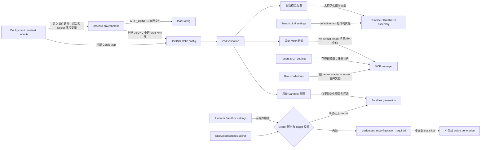

# 配置参考手册

> 状态：当前设计
> 验证基线：`b5425a0d2ae3ddc23ada4d3184d4a95e3a717bae`
> 最后核对：2026-08-03
> 适用范围：`pi-agent-platform-integration` 当前实现

本文记录当前仓库中**实际被消费**的配置。事实源以 `src/config/schema.ts`、显式环境变量读取、运行时装配、持久化 Store、镜像/部署文件和测试为准；示例值均为不可直接使用的占位符。

关联文档：认证、凭据与租户边界见 [06-auth-security-tenancy.md](./06-auth-security-tenancy.md)，持久化见 [07-data-and-persistence.md](./07-data-and-persistence.md)，Scheduler 见 [08-scheduler.md](./08-scheduler.md)，HTTP 设置接口见 [12-http-api-reference.md](./12-http-api-reference.md)。

## 1. 配置来源与真实优先级

真实规则如下：

1. `AIOP_CONFIG` 只选择 JSONC 文件；缺省 `./config.jsonc`。
2. JSONC 在解析前执行 `${UPPER_CASE_NAME}` 环境变量替换；缺失变量会保留原字符串，不会因此启动失败。环境变量不会自动覆盖同名 JSON 字段。
3. Zod 解析后，普通静态配置没有通用的“env 覆盖 JSONC”机制；只有代码显式读取的环境变量独立生效。
4. default tenant 的持久化 LLM 设置在启动装配时优先于 `models[defaultModel]`；其他租户的设置由设置 API 读写，但当前 Runtime/Durable Pi 启动装配并非按请求重建租户模型。
5. MCP 持久化租户配置只要存在（包括空对象）就完全取代启动配置；启动 `mcpServers` 只给 default tenant 做无持久化值时的 fallback。
6. 平台级 Sandbox settings 只要存在就优先于 `sandbox` JSONC；API key 存在独立加密字段中。解密失败不会回退 JSONC key，而进入 `credentials_reconfiguration_required`。
7. Deployment/ConfigMap 中的值只是注入默认，不构成代码层额外优先级。

## 2. 基础进程、日志、下载与并发

**来源**：`src/config/load.ts`、`src/index.ts`、`src/logger.ts`、`src/runtime.ts`、`src/config/schema.ts`。

| 配置键 / 环境变量 | 类型 | 必填条件 | 默认值 | 生效范围 | 敏感性 | 说明 |
| --- | --- | --- | --- | --- | --- | --- |
| `AIOP_CONFIG` | 路径字符串 | 否 | `./config.jsonc` | 进程启动 | 普通 | 选择 JSONC 文件。读取、JSON 解析或 Zod 校验失败会终止启动。 |
| `HOST` | 字符串 | 否 | `0.0.0.0` | `serve` | 普通 | HTTP 监听地址。 |
| `PORT` | 数字字符串 | 否 | `8080` | `serve` | 普通 | 经 `Number()` 转换后传给 `server.listen`；代码没有单独的正整数校验。K8s 后端容器设为 `8081`。 |
| `LOG_LEVEL` | Pino level | 否 | `info` | 主进程和 sandbox-runtime logger | 普通 | 非法值由 Pino 初始化行为决定。 |
| `AIOP_PI_MAX_CONCURRENT_MODEL_CALLS` | 正整数字符串 | 否 | `4` | Durable Pi，每 tenant + model | 普通 | 空串按缺省；非正整数导致 Runtime 启动失败。 |
| `AIOP_PI_MAX_CONCURRENT_TOOLS_PER_RESOURCE` | 正整数字符串 | 否 | `1` | governed tool resource | 普通 | 空串按缺省；非正整数导致 Runtime 启动失败。 |
| `downloads.enabled` | boolean | 否 | `true` | 文件导出/下载 | 普通 | 与 schema 注释不同，当前运行时代码未按 sandbox enabled 联动，缺省即启用。 |
| `downloads.dir` | 路径字符串 | 否 | 系统临时目录下 `aiop-downloads` | 下载中转 | 普通 | 目录初始化失败会使 Runtime 启动失败。 |
| `downloads.maxBytes` | 正整数 | 否 | `50 MiB`（`DownloadStore`） | 单文件 | 普通 | schema 只验证正整数。 |
| `downloads.ttlMs` | 正整数毫秒 | 否 | `24h`（`DownloadStore`） | 能力 URL | 普通 | 清理定时器每小时运行一次。 |

**优先级**：上述环境变量均为独立显式消费者；`downloads.*` 仅来自 JSONC。

**组合约束与行为**：下载能力 URL、认证 JWT、OIDC state 使用同一个 `AIOP_JWT_SECRET`。并发值非法为 fail-fast；下载清理失败只告警。

**非真实示例**：`AIOP_CONFIG=/config/config.jsonc PORT=8081 LOG_LEVEL=info AIOP_PI_MAX_CONCURRENT_MODEL_CALLS=4`。

## 3. 模型配置与设置持久化

**来源**：`src/config/schema.ts`、`src/runtime.ts`、`src/server/http.ts`、`src/db/store.ts`。

| 配置键 / 环境变量 | 类型 | 必填条件 | 默认值 | 生效范围 | 敏感性 | 说明 |
| --- | --- | --- | --- | --- | --- | --- |
| `models.<id>.protocol` | `anthropic` 或 `openai` | 是 | 无 | 模型条目 | 普通 | Durable Pi 分别映射到 `anthropic-messages`、`openai-completions` provider template。 |
| `models.<id>.baseURL` | 字符串 | 是 | 无 | 模型条目 | 普通 | schema 不要求 URL 格式；连接时才暴露错误。 |
| `models.<id>.apiKey` | 字符串 | 是 | 无 | 模型条目 | **Secret** | 可写 `${PROVIDER_API_KEY}`；缺失替换仍是普通字符串。 |
| `models.<id>.model` | 字符串 | 是 | 无 | 模型条目 | 普通 | 实际上游模型 ID。 |
| `models.<id>.contextWindowTokens` | 正整数 | 否 | 传统 HTTP 投影按 `200000`；Durable Pi 用 provider template 的 context window | 模型条目 | 普通 | 两条链缺省来源不同，不能视为单一固定默认值。 |
| `models.<id>.contextKeepImages` | 非负整数 | 否 | `1` | 会话上下文投影 | 普通 | `0` 表示不保留历史图片。 |
| `models.<id>.effort` | `none/low/medium/high/xhigh/max` | 否 | 缺省开启思考并使用模型默认深度 | Anthropic 传统模型链 | 普通 | `none` 关闭思考；Durable Pi 装配模型时当前未传递该字段。 |
| `models.<id>.pricing.input` | 非负数 | pricing 存在时是 | 无 | 成本估算，美元/百万 token | 普通 | Durable Pi model cost 同时使用。 |
| `models.<id>.pricing.output` | 非负数 | pricing 存在时是 | 无 | 同上 | 普通 | 同上。 |
| `models.<id>.pricing.cacheRead` | 非负数 | 否 | `pricing.input` | 同上 | 普通 | 未配时回退 input 单价。 |
| `models.<id>.pricing.cacheWrite` | 非负数 | 否 | `pricing.input` | 同上 | 普通 | 未配时回退 input 单价。 |
| `defaultModel` | 模型条目 ID | 是 | 无 | 启动 fallback | 普通 | 不存在对应条目时 Runtime 启动失败。 |
| tenant LLM setting `id/protocol/baseURL/apiKey/model/contextWindowTokens/contextKeepImages/effort` | 持久化对象 | tenant 管理员更新时 | 启动配置 fallback | 租户设置记录 | `apiKey` 为 **Secret**，其余普通 | 当前 LLM setting 整体存于普通 settings 记录；不像 Sandbox API key 使用 SecretBox。 |

**优先级与生效分叉**：

- 启动：`default` tenant 已持久化 LLM setting > `models[defaultModel]`，并据此同时创建传统 `runtime.model` 与 Durable Pi assembly。
- `POST /v1/settings/llm`：先持久化调用租户记录，再调用 `runtime.updateModel`，只替换进程级传统 `runtime.model/modelConfig`。
- Durable Pi 的 `models/model/provider/credential store/modelConcurrency` 在启动 assembly 中构建；当前更新路径没有重建或热切换 Durable Pi。因此新 Durable Run 不应被宣称立即使用页面更新后的模型，需重启后由 default tenant startup assembly 重新读取才有证据保证。
- 多租户页面可以保存各自设置，但当前进程级热更新对象不是 tenant-scoped；这是一项现状限制。
- `POST /v1/settings/llm/test` 带 body 时用临时模型测试，不持久化；空 body 测试当前 `runtime.model`。

**安全注意**：`GET/POST /v1/settings/llm` 的 `publicModelConfig` 当前响应包含完整 `api_key`，同时还返回 preview；这不是安全的“仅掩码”响应。调用方与日志系统必须按 Secret 处理，风险见 [06-auth-security-tenancy.md](./06-auth-security-tenancy.md) 和 [12-http-api-reference.md](./12-http-api-reference.md)。

**启动失败/降级**：默认模型缺失、协议对应 Pi provider template 不可用会启动失败；`${VAR}` 未替换不会校验为缺 Secret，通常延迟到模型调用失败。

**非真实示例**：`"apiKey": "<api-key>"`。

## 4. MySQL 与 Store

**来源**：`src/config/mysql.ts`、`src/db/index.ts`、`src/runtime.ts`。

| 配置键 / 环境变量 | 类型 | 必填条件 | 默认值 | 生效范围 | 敏感性 | 说明 |
| --- | --- | --- | --- | --- | --- | --- |
| `MYSQL_HOST` | 字符串 | 启用 MySQL 时 | 无 | 全进程 Store | 普通 | 空或未设置时返回 `undefined`，应用降级到 MemoryStore。 |
| `MYSQL_PORT` | 正整数字符串 | 否 | `3306` | MySQL pool | 普通 | 非正整数启动失败。 |
| `MYSQL_DATABASE` | 字符串 | 设置 `MYSQL_HOST` 时 | 无 | MySQL pool | 普通 | 缺失启动失败。 |
| `MYSQL_USER` | 字符串 | 设置 `MYSQL_HOST` 时 | 无 | MySQL pool | 普通 | 缺失启动失败。 |
| `MYSQL_PASSWORD_BASE64` | base64 字符串 | 否 | 解码为空串 | MySQL pool | **Secret** | Base64 只是编码，不是加密；无格式校验，必须由 Secret 管理系统保护。 |
| `MYSQL_SSL` | `true/1` 或其他字符串 | 否 | `false` | MySQL pool | 普通 | 仅精确 `true` 或 `1` 为真，其余值均为假。 |
| `MYSQL_POOL_SIZE` | 正整数字符串 | 否 | `10` | 主连接池 | 普通 | 非正整数启动失败；Skills 导入 permit pool 会派生独立 pool。 |

**优先级**：只读环境变量，没有 JSONC 或 settings 覆盖。

**组合约束**：Scheduler 生产装配、Durable MySQL RunStore、跨进程 Skill mutation lock 均依赖 MySQL。`skills.requireDistributedLock=true` 而 MySQL/`MysqlStore` 不可用时启动失败。独立/embedded Scheduler 在 MemoryStore 上生产装配也会失败。

**降级行为**：只有 `MYSQL_HOST` 未配置时才明确降级 MemoryStore；配置了 host 但字段缺失、端口/pool 非法、建库迁移或连接失败均是启动错误，不会再降级内存。

**非真实示例**：`MYSQL_PASSWORD_BASE64=<base64-encoded-password>`。

## 5. 认证、JWT 与设置 Secret

**来源**：`src/config/schema.ts`、`src/runtime.ts`、`src/security/secret-box.ts`、认证 providers。

| 配置键 / 环境变量 | 类型 | 必填条件 | 默认值 | 生效范围 | 敏感性 | 说明 |
| --- | --- | --- | --- | --- | --- | --- |
| `AIOP_JWT_SECRET` | 字符串 | 生产必填 | 开发占位值 | JWT、OIDC state、下载 URL、用户凭据加密 | **Secret** | 缺失只告警并继续；生产使用会导致可伪造/可解密风险。 |
| `AIOP_SETTINGS_SECRET` | 非空字符串 | 生产及持久化 Sandbox secret 时必填 | 独立开发占位值 | 平台 settings SecretBox | **Secret** | 不回退 `AIOP_JWT_SECRET`；AES-256-GCM key 由 domain + secret 哈希派生。轮换后旧密文不能解密。 |
| `auth.provider` | `local/oidc` | 否 | `local` | 主登录 provider | 普通 | `oidc` 但缺 `auth.oidc` 时当前会回退 Local，而不是 schema 组合失败。 |
| `auth.jwtTtl` | jose 时间串 | 否 | provider 默认 `12h` | 会话 token | 普通 | schema 仅要求字符串，格式错误在签发/校验路径暴露。 |
| `auth.bootstrapAdmin.tenantId` | 字符串 | bootstrap 存在时 | `default` | local 启动引导 | 普通 | 已存在用户则跳过。 |
| `auth.bootstrapAdmin.username` | 字符串 | bootstrap 存在时 | 无 | 同上 | 普通 | 仅 local provider 生效。 |
| `auth.bootstrapAdmin.password` | 字符串 | bootstrap 存在时 | 无 | 同上 | **Secret** | OIDC 模式忽略并告警；不应放在 ConfigMap。 |
| `auth.bootstrapAdmin.role` | `platform_admin/tenant_admin/user` | 否 | `platform_admin` | 同上 | 普通 | 高权限默认要求部署侧审慎控制。 |
| `auth.oidc.issuer` | 字符串 | OIDC 对象存在时 | 无 | OIDC | 普通 | 生产应 HTTPS。 |
| `auth.oidc.clientId` | 字符串 | 是 | 无 | OIDC | 普通 | — |
| `auth.oidc.clientSecret` | 字符串 | 否 | 无 | OIDC | **Secret** | 可由 JSONC `${OIDC_CLIENT_SECRET}` 注入。 |
| `auth.oidc.redirectUri` | 字符串 | 是 | 无 | OIDC callback | 普通 | 必须与 IdP client 配置一致。 |
| `auth.oidc.scopes` | string[] | 否 | provider 默认 scopes | OIDC | 普通 | — |
| `auth.oidc.allowInsecureHttp` | boolean | 否 | `false` | OIDC discovery | 安全开关 | 仅 dev/test；生产 HTTP issuer 应拒绝。 |
| `auth.oidc.mapping.tenantClaim` | 字符串 | 否 | 无 | claims 映射 | 普通 | 缺省使用 `defaultTenant`。 |
| `auth.oidc.mapping.defaultTenant` | 字符串 | tenant claim 缺失时 | 无 | claims 映射 | 普通 | 两者都不能解析 tenant 时登录失败。 |
| `auth.oidc.mapping.usernameClaim` | 字符串 | 否 | `preferred_username` | claims 映射 | 普通 | — |
| `auth.oidc.mapping.roleClaim` | 字符串 | 否 | 无 | claims 映射 | 普通 | 值可为 string/string[]。 |
| `auth.oidc.mapping.roleMap` | map | 否 | 无 | claims 映射 | 普通 | IdP 值映射本系统角色。 |
| `auth.oidc.mapping.defaultRole` | role | 否 | `user` | claims 映射 | 普通 | — |
| `auth.aios.verify` | `userinfo/jwks` | 否 | `userinfo` | AIOS token exchange | 普通 | 与 local/OIDC 并存。 |
| `auth.aios.userinfoUrl` | 字符串 | `verify=userinfo` | 无 | AIOS | 普通 | 缺失导致 schema 失败。 |
| `auth.aios.systemId` | 字符串 | 否 | `1` | userinfo 请求 | 普通 | — |
| `auth.aios.jwks.url` | 字符串 | `verify=jwks` | 无 | AIOS | 普通 | `jwks` 对象缺失导致 schema 失败。 |
| `auth.aios.jwks.issuer` / `audience` | 字符串 | 否 | 无 | 本地 JWT 校验 | 普通 | 配置时增加 issuer/audience 校验。 |
| `auth.aios.tenantId` | 字符串 | 否 | `default` | AIOS 用户落租户 | 普通 | — |
| `auth.aios.allowedParentOrigins` | string[] | 否 | `[]` | 后端直出 `index.html` 的 CSP `frame-ancestors` | 安全配置 | 仅限制哪些 origin 可嵌入后端直出的页面；不参与前端 `postMessage` 消息校验。与 Web 容器 `AIOP_FRAME_ANCESTORS` 是两个独立 CSP 配置面。 |
| `auth.aios.fields.userId` | 点路径 | 否 | `userId` | userinfo 映射 | 普通 | 应指向稳定唯一 ID。 |
| `auth.aios.fields.displayName` | 点路径 | 否 | `displayName` | userinfo 映射 | 普通 | — |
| `auth.aios.fields.roles` | 点路径 | 否 | `roles` | userinfo 映射 | 普通 | — |
| `auth.aios.adminRoles` | string[] | 否 | `[]` | AIOS role 映射 | 普通 | 命中只映射 `tenant_admin`，不会成为 `platform_admin`。 |
| `auth.aios.credentialTtlMs` | 正整数毫秒 | 否 | `12h` | AIOS 下游凭据缓存兜底 | 普通 | 仅 AIOS 未返回过期时间时使用。 |

**优先级**：AIOS 是附加登录通道，不覆盖 `auth.provider`。后端 `allowedParentOrigins` 不读取 Nginx 环境变量；Web CSP 也不读取 JSONC。两者都只配置 CSP `frame-ancestors`，不是 `postMessage` 来源白名单。

**嵌入消息边界**：当前 Web `message` listener 只检查 payload 的 `type/token`，未校验 `event.origin` 或 `event.source`；向父窗口发送 `aiop:ready` 时使用 `targetOrigin="*"`。因此 CSP 允许谁嵌入与消息接收方校验并未闭环，不能把 `allowedParentOrigins` 描述为 postMessage 安全校验。

**失败/降级**：JWT/settings secret 缺失均使用开发占位并告警，不会 fail-fast；这不是生产降级方案。通用 `deploy/k8s/secret.example.yaml` 当前没有列出 `AIOP_SETTINGS_SECRET`，因此不能按该示例原样创建生产 Secret；必须在 `aiop-secrets` 中额外注入独立强随机值，否则运行时会静默使用固定 `dev-insecure-settings-secret`。设置 secret 不一致时 Sandbox 凭据进入需重配状态。OIDC 组合不完整可能回退 Local，属于需要部署验证的风险。

**非真实示例**：`AIOP_JWT_SECRET=<password>`、`AIOP_SETTINGS_SECRET=<password>`、`clientSecret: "<password>"`。

## 6. MCP

**来源**：`src/config/schema.ts`、`src/runtime.ts`、`@aiop/mcp-runtime` 接口。

| 配置键 / 环境变量 | 类型 | 必填条件 | 默认值 | 生效范围 | 敏感性 | 说明 |
| --- | --- | --- | --- | --- | --- | --- |
| `mcpServers.<name>.transport` | `stdio/sse/http` | 是 | 无 | server | 普通 | 具体 transport 必填组合由连接阶段检查。 |
| `.command` | 字符串 | stdio | 无 | server | 普通 | 本机执行命令。 |
| `.args` | string[] | 否 | `[]`/runtime 缺省 | server | 普通 | — |
| `.url` | 字符串 | sse/http | 无 | server | 普通 | schema 不校验 URL。 |
| `.headers` | map<string,string> | 否 | 无 | tenant server 配置 | 可能敏感 | 启动/持久化配置中的静态 headers；优先避免放凭据。 |
| `.env` | map<string,string> | 否 | 无 | stdio server | 可能敏感 | 同上。 |
| `.timeoutMs` | 正整数毫秒 | 否 | MCP runtime 默认 | server | 普通 | — |
| `.reconnect.maxAttempts` | 非负整数 | 否 | MCP runtime 默认 | reconnect | 普通 | `0` 的语义由 runtime 实现。 |
| `.reconnect.backoffMs` | 非负整数毫秒 | 否 | MCP runtime 默认 | reconnect | 普通 | — |
| `.reconnect.retryOnTimeout` | boolean | 否 | MCP runtime 默认 | reconnect | 普通 | — |
| `.reconnect.retryOnDisconnect` | boolean | 否 | MCP runtime 默认 | reconnect | 普通 | — |
| `.toolCapabilities.<tool>` | `read/retryable_write/non_idempotent_write` | 否 | runtime 推断/默认 | governed tool | 安全配置 | 影响治理、审批和重试语义。 |
| user credential target `mcp:<server>` 的 `headers/env` | 加密用户凭据 | 否 | 无 | tenant + actor + server | **Secret** | 运行时按身份加载并规范化，和 server 配置合并由 MCP runtime 完成。 |

**优先级**：tenant persisted MCP config > default tenant startup `mcpServers` fallback；非 default tenant 没有 startup fallback。用户凭据是身份级补充，不是另一份 server registry。

**多副本约束**：持久化 MCP 配置与用户凭据需要 MySQL 才能跨副本共享；MemoryStore 下每副本独立。stdio 子进程、连接缓存和 manager 当前配置属于进程本地资源，Store 更新后也没有主动广播到其他副本。

**mutation 持久化语义**：新增/删除 API 先修改当前进程的 `McpManager`，随后 best-effort 调用 `setMcpServers`。持久化失败只记录错误，不回滚 manager，HTTP 响应仍可能成功；此时当前副本、数据库和其他副本会分叉。重启或其他副本按 Store/启动 fallback 重新加载时，未持久化的 mutation 可能消失。

**失败/降级**：单个租户配置读取异常被 runtime 调用处捕获为 `undefined`，default tenant 可能回退启动配置；连接错误在列工具/执行时暴露。MCP mutation persistence 是 fail-open，不提供跨副本线性一致性。

**非真实示例**：`headers: { "Authorization": "Bearer <bearer-token>" }`。

## 7. Skills

**来源**：`src/config/schema.ts`、`src/skill/registry.ts`、`src/skill/lock.ts`、`src/runtime.ts`。

| 配置键 / 环境变量 | 类型 | 必填条件 | 默认值 | 生效范围 | 敏感性 | 说明 |
| --- | --- | --- | --- | --- | --- | --- |
| `skills.dir` | 路径字符串 | 启用 Skills 时 | 无 | 可写产品 Skill root | 普通 | 配置后启动扫描；不可用会启动失败。 |
| `skills.builtinDir` | 路径字符串 | 否 | 无 | 只读内置 root | 普通 | mutations/upload 始终落 `dir`。 |
| `skills.requireDistributedLock` | boolean | 否 | `false` | 启动保护 | 普通 | true 时必须有 MySQL mutation lock，否则启动失败。 |
| `skills.pendingQuota.perUserMaxCount` | 正整数 | 否 | `20` | pending import | 普通 | — |
| `.perUserMaxBytes` | 正整数 bytes | 否 | `256 MiB` | pending import | 普通 | — |
| `.perTenantMaxCount` | 正整数 | 否 | `200` | pending import | 普通 | — |
| `.perTenantMaxBytes` | 正整数 bytes | 否 | `2 GiB` | pending import | 普通 | — |
| `.minFreeBytes` | 非负整数 bytes | 否 | `512 MiB` | 技能盘 | 普通 | 写入后剩余空间必须不低于此值。 |
| `.retentionMs` | 正整数毫秒 | 否 | `24h` | pending/staging 清理 | 普通 | — |
| `skills.sandboxEnv.<name>` | map<string,string> | 否 | 无 | 注入每个 SandboxSpec | 禁止 Secret | key 命中 password/secret/token/api-key/credential 模式时 schema 拒绝启动。 |

**多副本约束**：共享可写目录/PVC只解决文件可见性；mutation/import permit 还需要 MySQL GET_LOCK。生产多副本应同时配置共享 `skills.dir`、MySQL 和 `requireDistributedLock=true`。

**目录语义**：`_public/<name>` 为公共技能，`users/<uid>/<name>` 为个人技能；共享/私有由文件系统标记维护。`builtinDir` 不接受写入。

**非真实示例**：`skills: { dir: "/skills-data", builtinDir: "/app/skills", requireDistributedLock: true }`。

## 8. Sandbox：静态配置、持久化模式与外部前置条件

**来源**：`src/config/schema.ts`、`src/runtime.ts`、`packages/sandbox-runtime/src/settings.ts` 及 providers。

### 8.1 静态 JSONC

| 配置键 / 环境变量 | 类型 | 必填条件 | 默认值 | 生效范围 | 敏感性 | 说明 |
| --- | --- | --- | --- | --- | --- | --- |
| `sandbox.enabled` | boolean | 否 | `false` | Sandbox Runtime | 普通 | false 时不创建 active generation。 |
| `sandbox.provider` | `local/e2b/opensandbox` | 否 | `e2b` | provider | 普通 | `sandbox.aios` 仅允许 `e2b`。 |
| `sandbox.apiKey` | 字符串 | provider 需要时 | provider env fallback | provider | **Secret** | JSONC key 优先于 E2B/AIOS provider 环境 fallback。 |
| `sandbox.aios.lifecycleUrl` | HTTP(S) URL | AIOS Lifecycle | 无 | AIOS catalog/lifecycle | 普通 | 必须完整 URL。 |
| `sandbox.aios.placement.clusterId` | 非空字符串 | AIOS Lifecycle | 无 | 调度 placement | 普通 | 每个 spec 不可覆盖。 |
| `sandbox.aios.placement.namespace` | 非空字符串 | AIOS Lifecycle | 无 | 调度 placement | 普通 | 同上。 |
| `sandbox.domain` | host[:port] 字符串 | 自托管端点时 | provider 默认 | E2B/OpenSandbox | 普通 | 静态 schema 不统一校验 scheme；页面 settings 会严格规范化。 |
| `sandbox.protocol` | `http/https` | OpenSandbox 可选 | provider 默认；页面投影为 `http` | OpenSandbox | 普通 | — |
| `sandbox.defaultImage` | 字符串 | OpenSandbox 无 template 时 | provider 默认 | Sandbox image | 普通 | manifest netdiag/browser 示例依赖不同镜像能力。 |
| `sandbox.idleMs` | 正整数毫秒 | 否 | manager 默认 | 空闲回收 | 普通 | sweep 周期被限制在 30s..60s。 |
| `sandbox.timeoutMs` | 正整数毫秒 | 否 | manager/provider 默认 | 存活超时 | 普通 | — |
| `sandbox.desktop` | boolean | 否 | `false` | 浏览器/桌面工具 | 普通 | local 需 Chrome，E2B/OpenSandbox 需相应 desktop 能力。 |
| `sandbox.warmPoolSize` | 正整数 | 否 | 禁用 | 预热池 | 普通 | 配置 clusters 时忽略并告警；AIOS Lifecycle 明确禁止。 |
| `sandbox.userHomeRoot` | 路径 | 否 | 不限制前缀，仅要求绝对路径 | hostPath 用户 home | 安全配置 | AIOS Lifecycle 第一阶段禁止。生产应设置约束根。 |
| `sandbox.userHomeMountPath` | 路径 | 否 | `/home/user/host` | 容器挂载点 | 普通 | AIOS Lifecycle 只允许缺省值。 |
| `sandbox.profiles.<name>.description` | 字符串 | 否 | 无 | 模型/UI 提示 | 普通 | — |
| `.image` / `.template` | 字符串 | provider 需要时 | default profile 自动生成 | profile | 普通 | `template` 为兼容命名。 |
| `.domain` | 字符串 | 独立控制面时 | sandbox domain | profile | 普通 | — |
| `.namespace` / `.serviceAccount` | 字符串 | K8s 模板需要时 | 无 | profile | 安全配置 | 真正权限由控制面 PodTemplate/RBAC 决定。 |
| `.desktop` | boolean | 否 | 无/能力推断 | profile | 普通 | 标记浏览器/桌面适用性。 |
| `.privileged` | boolean | 否 | `false` | profile 提示 | 安全配置 | 仅展示提示，不是权限边界；AIOS 禁止手工 true。 |
| `.capabilities` | string[] | 否 | `[]` | 模型选择提示 | 普通 | — |
| `.envs` | map<string,string> | 否 | 无 | SandboxSpec | 禁止 Secret | schema 注释要求不放敏感值，API/UI 不回显。 |
| `.timeoutMs` | 正整数毫秒 | 否 | profile/provider 默认 | profile | 普通 | — |
| `E2B_API_KEY` | 字符串 | E2B 且无 `sandbox.apiKey` | 无 | E2B provider | **Secret** | provider constructor option 优先。 |
| `AIOS_SANDBOX_KEY` | 字符串 | 低层 AIOS HTTP client 且无 option key | 空串 | AIOS HTTP provider | **Secret** | 当前主 Runtime 创建 AIOS E2B provider时传 `sandbox.apiKey`；仅低层 fallback。 |
| `CHROME_BIN` | 路径 | local desktop 自定义 Chrome 时 | 常见 Chrome 路径探测 | local desktop | 普通 | 无可执行 Chrome 时桌面创建失败。 |

### 8.2 平台持久化 Sandbox settings

| 配置键 / 环境变量 | 类型 | 必填条件 | 默认值 | 生效范围 | 敏感性 | 说明 |
| --- | --- | --- | --- | --- | --- | --- |
| `enabled` | boolean | 是 | 无持久化且无静态配置时 `false` | 平台 default context | 普通 | settings schema 为 strict。 |
| `mode` | `local/standard_e2b/opensandbox/aios_lifecycle` | 是 | 无配置时 `local` | 平台 | 普通 | 映射到静态 provider 结构。 |
| `domain` | host[:port] | standard E2B/OpenSandbox 可选 | provider default | 平台 | 普通 | 禁止 scheme、路径、凭据。 |
| `protocol` | `http/https` | OpenSandbox 可选 | `http`（投影/credential target） | 平台 | 普通 | — |
| `defaultImage` | 非空字符串 | OpenSandbox 可选 | provider default | 平台 | 普通 | — |
| `lifecycleUrl` | 规范化 HTTP(S) URL | AIOS Lifecycle | 无 | 平台 | 普通 | 禁止 URL 凭据、query、fragment。 |
| `placement.clusterId/namespace` | 非空字符串 | AIOS Lifecycle | 无 | 平台 | 普通 | — |
| `api_key` update | replace/retain/clear | 启用 standard E2B/AIOS 时必须存在 | retain | 加密 secret record | **Secret** | API 不回显完整 key，只返回 `api_key_set`；与 target 绑定。 |

**优先级与 generation**：持久化 settings + 已解密 key > 静态 `sandbox`。更新顺序是：准备新 generation → Store 内原子保存普通 settings 与 encrypted secret → controller 原子切换 active generation；切换后旧 handle 由 controller 排空。MySQL Store 的 settings/secret 写入处于同一数据库事务，controller 内 generation 切换也各自原子，但 Store 事务与进程内切换不属于同一事务，跨 Store/Runtime **不是整体原子**。AIOS catalog 指纹未变化时不切 generation，后台每 60s 刷新。

**异常行为**：

- generation 准备失败：不会执行 Store 保存，原配置与旧 generation 保持不变。
- Store 保存失败：清理已准备 generation，不切换当前 generation。
- Store 保存成功而 controller commit 失败：数据库已是新 settings/secret，当前进程仍可能运行旧 generation，二者产生分叉；代码没有补偿回滚 Store。后续成功更新可重新收敛；进程重启会从新 Store 记录加载并重新准备 generation，若新配置仍无法创建则按对应启动失败/降级行为处理。
- 持久化 secret 解密失败/target 不匹配：保留非敏感 settings 状态，禁用 generation，状态为 `credentials_reconfiguration_required`；不回退静态 JSONC key。
- AIOS catalog 启动不可用：启动继续，状态 `catalog_unavailable`；普通 E2B/OpenSandbox generation 准备失败则启动失败。
- 配置 clusters 时 warm pool 被忽略；AIOS 配 warm pool、home mount 或 privileged profile 直接 schema 失败。

**Netdiag/desktop 前置条件**：Netdiag 镜像、网络 namespace/capabilities、集群网络策略和 DNS 必须由 OpenSandbox 部署提供；配置 `defaultImage` 本身不授予能力。Browser/desktop 还需镜像内 Chrome/控制端口。Local desktop 需要宿主 Chrome；E2B 需要可达 API/domain 和 key；OpenSandbox 需要可达 Lifecycle server；AIOS Lifecycle 需要 catalog API、合法模板目录、placement 对应集群/namespace 与 Runtime Role。

**非真实示例**：`api_key: "<api-key>"`。

## 9. Scheduler

**来源**：`src/index.ts`、`src/scheduler/runner.ts`、`@aiop/scheduler-runtime`、tenant scheduler settings。

| 配置键 / 环境变量 | 类型 | 必填条件 | 默认值 | 生效范围 | 敏感性 | 说明 |
| --- | --- | --- | --- | --- | --- | --- |
| `AIOP_EMBED_SCHEDULER` | 字符串布尔 | 否 | disabled | `serve` | 普通 | 仅小写化后的 `true` 或 `1` 启用。 |
| CLI `scheduler` | 入口参数 | standalone 模式 | 无 | 独立进程 | 普通 | `npm run scheduler` 总是启动 Scheduler。 |
| tenant setting `maxRunMs` / API `max_run_minutes` | 正时长 | 否 | `4h` | tenant Scheduled Run deadline | 普通 | API 最小 1 分钟，取整后持久化。 |
| loop `intervalMs` | 正常为 number option | 仅程序化注入/测试 | `30000` | Scheduler 实例 | 测试/内部 | 没有生产环境变量。 |
| loop `batch` | number option | 程序化注入/测试 | `10` | 每 tick | 测试/内部 | 没有生产环境变量。 |
| runner `workerId` | string option | 程序化注入/测试 | `scheduler-<uuid>` | lease owner | 测试/内部 | 没有生产环境变量。 |
| runner `leaseMs/retryDelayMs` | number option | 程序化注入/测试 | scheduler-runtime 默认 | lease/retry | 测试/内部 | 不应虚构为 env 配置。 |

**组合约束**：生产 Scheduler assembly 要求 `MysqlStore`；MemoryStore 仅可通过测试显式注入 `SchedulerStore`。通用 K8s manifest 将 embedded=true 且 server replicas=2，这会启动两个竞争 lease 的 Scheduler；持久化/lease 正确性依赖 MySQL。dev/aiop manifest 当前 replicas=1。

**失败/降级**：embedded/standalone 在非 MysqlStore 下创建 Scheduler 会失败；tick 错误记录日志并等待下一 tick。重复 tick 在同实例内被合并。

**非真实示例**：`AIOP_EMBED_SCHEDULER=true`。

## 10. Cluster、OpsPolicy、Permissions、SSRF 与 Hooks

**来源**：`src/config/schema.ts`、`src/config/clusters.ts`、`src/agent/policy.ts`、`src/tools/webfetch.ts`、`src/agent/hooks.ts`、`src/runtime.ts`。

| 配置键 / 环境变量 | 类型 | 必填条件 | 默认值 | 生效范围 | 敏感性 | 说明 |
| --- | --- | --- | --- | --- | --- | --- |
| `clusters.<name>.e2bControl` | 字符串 | 动态集群 sandbox 时 | 无 | cluster | 普通 | 控制面地址。 |
| `.template` | 字符串 | 集群 sandbox 时 | 无 | cluster | 普通 | 应包含 kubectl 与绑定 SA。 |
| `.namespace` / `.serviceAccount` | 字符串 | 部署需求决定 | 无 | cluster | 安全配置 | K8s RBAC 是最终边界。 |
| `.access` | `ro/rw` | 否 | `ro` | kubectl policy | 安全配置 | ro 拒绝所有写操作。 |
| `.allowNamespaces` | string[] | 否 | 不限制 | kubectl policy | 安全配置 | 配置后禁止 all-namespaces，并要求显式 `-n`。 |
| `.production` | boolean | 否 | `false` | approval policy | 安全配置 | 生产写操作需审批，除非角色/预批准/allow rule/已批准计划满足规则。 |
| `.tenants` | string[] | 否 | 空=全部租户 | cluster ACL | 安全配置 | 非空时按 tenant ID 限制。 |
| `permissions.allow/deny/ask` | string[] | 否 | 空规则 | 全工具规则 | 安全配置 | `deny` 最高；`ask` 进入审批；allow 不能绕过危险命令/ACL/ro。 |
| `webFetch.enabled` | boolean | webFetch 对象存在时 | `true`；对象缺失时运行时也启用 | web_fetch 注册 | 普通 | schema 注释称“不配置不注册”，但当前 `config.webFetch?.enabled ?? true` 实际缺省注册。 |
| `webFetch.allowedDomains` | string[] | 否 | 公网域名不限制 | web_fetch | 安全配置 | 支持子域；SSRF 防护仍生效。 |
| `webFetch.allowPrivate` | boolean | 否 | `false` | web_fetch | 高风险开关 | true 允许解析到私网目标。 |
| `webFetch.timeoutMs` | 正整数毫秒 | 否 | `15000` | web_fetch | 普通 | 响应最多读 2MB，文本最多 40000 字符；禁止 redirect。 |
| `hooks.preToolUse[].type` | `command/webhook` | hook 存在时 | 无 | HookRunner | 安全配置 | command 本机执行；webhook HTTP POST。 |
| command `.command` | 字符串 | command hook | 无 | HookRunner | 高风险 | 以 `sh -c` 运行。 |
| webhook `.url` | 字符串 | webhook hook | 无 | HookRunner | 普通 | URL 在调用时做 SSRF 校验。 |
| `.headers` | map | 否 | 无 | webhook | 可能为 **Secret** | 静态 JSONC 会持有值。 |
| `.tools` | string[] | 否 | 全工具 | matcher | 普通 | 支持末尾 `*` 前缀匹配。 |
| `.timeoutMs` | 正整数毫秒 | 否 | `5000` | hook | 普通 | — |
| `hooks.allowPrivateWebhook` | boolean | 否 | `false` | webhook SSRF | 高风险开关 | 仅内网自建系统时考虑。 |

**策略装配**：存在 clusters 或任意 permissions rule 时使用 `OpsPolicy`，否则 `AllowAllPolicy`。危险 shell guard 当前不可通过 JSONC 单独关闭。

**Hook 当前限制**：Runtime 会构造并暴露 `HookRunner`，但仓库 `src/`、`packages/` 中没有 `runtime.hooks.preTool(...)`/`HookRunner.preTool(...)` 的 Durable 主链调用证据。故 hooks 是“配置与实现存在、当前 Durable 执行主链未接入”，不能宣称已拦截工具。Hook 实现本身为 fail-open：处理器异常告警并放行；显式 deny/非 2xx/command 非零才拒绝（前提是未来调用链接入）。

**非真实示例**：`headers: { "Authorization": "Bearer <bearer-token>" }`。

## 11. Web、Nginx、镜像与 Make

### 11.1 Web/Vite/Nginx

**来源**：`web/vite.config.ts`、`web/nginx.conf`、`web/Dockerfile`。

| 配置键 / 环境变量 | 类型 | 必填条件 | 默认值 | 生效范围 | 敏感性 | 说明 |
| --- | --- | --- | --- | --- | --- | --- |
| Vite dev host | 固定值 | — | `0.0.0.0` | 开发服务器 | 普通 | 当前不是环境变量。 |
| Vite dev port | 固定值 | — | `5173` | 开发服务器 | 普通 | 当前不是环境变量。 |
| Vite proxy target | 固定 URL | — | `http://127.0.0.1:8080` | `/auth /v1 /healthz /readyz` | 普通 | 当前无 `VITE_*` 配置。 |
| Nginx listen | 固定端口 | — | `8080` | Web 容器 | 普通 | — |
| Backend proxy | 固定 URL | — | `http://127.0.0.1:8081` | Web sidecar 到后端 | 普通 | 要求两个容器同 Pod；不能跨独立 Pod 自动发现。 |
| `AIOP_FRAME_ANCESTORS` | CSP source-list 片段 | 否 | 空，仅 `'self'` | Nginx envsubst | 安全配置 | 未做应用级解析；值必须是合法 CSP source，不能带 header 注入内容。 |
| `/v1` body limit | 固定值 | — | `128m` | Nginx | 普通 | 后端按路由再限制。 |
| `/v1` read timeout | 固定值 | — | `3600s` | SSE/长请求 | 普通 | proxy buffering/cache 均关闭，Connection header 清空。 |

### 11.2 Docker

| 配置键 / 环境变量 | 类型 | 必填条件 | 默认值 | 生效范围 | 敏感性 | 说明 |
| --- | --- | --- | --- | --- | --- | --- |
| backend `NODE_ENV` | Docker `ENV` | — | `production` | Node 运行时/依赖 | 普通 | Dockerfile 唯一显式 ENV；仓库业务代码无直接读取。 |
| backend exposed port | 固定 | — | `8080` | image metadata | 普通 | K8s 实际后端通过 `PORT=8081` 监听；EXPOSE 不改变监听。 |
| backend command | 固定 | — | `npm run serve` | container | 普通 | Scheduler 可用 command 覆盖为 `npm run scheduler`。 |
| web base image | 固定 | — | `nginx:1.27-alpine` | image | 普通 | Nginx 官方 entrypoint 对 templates 做 envsubst。 |
| Docker `ARG` | — | — | 当前无 | build | — | 两个主 Dockerfile 都没有 ARG。 |

### 11.3 Make 参数与真实 target

**来源**：根 `Makefile`。

| 配置键 /环境变量 | 类型 | 必填条件 | 默认值 | 生效范围 | 敏感性 | 说明 |
| --- | --- | --- | --- | --- | --- | --- |
| `IMAGE_TAG` | Make var | 否 | 当前 git short SHA | image/publish | 普通 | — |
| `IMAGE` | image ref | 否 | `aiop:$(IMAGE_TAG)` | `image/deploy-staging` | 普通 | — |
| `WEB_IMAGE` | image ref | 否 | `aiop-web:$(IMAGE_TAG)` | `image/deploy-staging` | 普通 | — |
| `IMAGE_PREFIX` | registry prefix | 否 | `deploy.bocloud.k8s:40443/aios` | publish | 普通 | — |
| `PUBLISH_IMAGE` | image ref | 否 | `$(IMAGE_PREFIX)/aiop:$(IMAGE_TAG)` | `pipeline/deploy-aiop` | 普通 | — |
| `PUBLISH_WEB_IMAGE` | image ref | 否 | `$(IMAGE_PREFIX)/aiop-web:$(IMAGE_TAG)` | 同上 | 普通 | — |
| `PLATFORMS` | CSV | 否 | `linux/amd64,linux/arm64` | `pipeline` | 普通 | buildx 多架构。 |
| `KUBECTL` | command | 否 | `kubectl` | staging targets | 普通 | — |
| `AIOP_KUBECONFIG` | 路径 | 否 | `/home/lb/.kube/config-10.241.0.166` | aiop targets | 可能敏感 | 本机路径默认不可移植。 |
| `AIOP_NAMESPACE` | 字符串 | 否 | `aios-system` | aiop targets | 普通 | — |
| `ROLLBACK_REVISION` | 整数/空 | 否 | 空 | rollback targets | 普通 | 空时 `kubectl rollout undo` 回退上一 revision。 |
| `AIOP_KUBECTL` | 派生 Make var | — | `$(KUBECTL) --kubeconfig ...` | aiop targets | 普通 | 用 `=` 延迟展开，不是 `?=` 可覆盖默认项。 |
| `ROLLBACK_TO_REVISION` | 派生 Make var | — | 空或 `--to-revision=$(ROLLBACK_REVISION)` | rollback targets | 普通 | 由 `ROLLBACK_REVISION` 是否为空派生。 |

目标精确清单：`verify-node`、`test-agent-platform`、`test-runtime-refactor`、`verify-runtime-refactor`、`image`、`pipeline`、`deploy-staging`、`rollback-staging`、`deploy-aiop`、`rollback-aiop`。镜像构建分别使用根 `Dockerfile` 与 `web/Dockerfile`；部署通过 `kubectl set image --local` 渲染后 apply。

## 12. Kubernetes manifest defaults 与第三方容器项

这些值是部署样例/默认注入，不是新的代码级配置优先级。

| 配置键 / 环境变量 | 类型 | 必填条件 | 默认值 | 生效范围 | 敏感性 | 说明 |
| --- | --- | --- | --- | --- | --- | --- |
| `AIOP_CONFIG=/config/config.jsonc` | env | manifest 部署 | manifest 固定 | backend | 普通 | ConfigMap 挂载。 |
| `PORT=8081` | env | sidecar topology | manifest 固定 | backend | 普通 | 与 Nginx loopback 一致。 |
| `AIOP_EMBED_SCHEDULER=true` | env | 当前 manifests | manifest 固定 | backend | 普通 | 通用/dev/aiop deployment 均设置。 |
| ConfigMap provider key placeholder | 任意 `${NAME}` | 对应模型调用 | 通用为 `ANTHROPIC_API_KEY`，dev/aiop 为 `OPENAI_API_KEY` | JSONC 替换 | **Secret** | 这些名称不是模型代码的直接 env 消费者。 |
| `AIOP_FRAME_ANCESTORS` | Web env | 嵌入时 | dev 空、aiop manifest 有环境特定值、通用未设置 | Nginx | 安全配置 | 应与 `auth.aios.allowedParentOrigins` 同步维护。 |
| `MYSQL_ROOT_PASSWORD` | env | dev MySQL 容器 | Secret | 第三方 MySQL | **Secret** | AIoP 应用不读取。 |
| `MYSQL_PASSWORD` | env | dev MySQL 容器 | Secret | 第三方 MySQL | **Secret** | AIoP 应用读取的是另行编码的 `MYSQL_PASSWORD_BASE64`。 |
| `MYSQL_DATABASE/MYSQL_USER` | env | MySQL 初始化与 AIoP | manifest/Secret | 双方 | 普通 | 同名但消费方不同；值必须一致。 |
| Dex `issuer/staticClients/staticPasswords` | ConfigMap fields | OIDC 测试 | dev 固定测试配置 | 第三方 Dex | 测试 Secret | 仅 dev/test，不是 AIoP schema。 |

**生产注意**：仓库 `secret.example.yaml` 中的固定值仅为历史示例，不应复制；请使用 `<password>`、`<api-key>`、`<base64-encoded-password>` 等占位符替换后由 Secret 管理系统注入。通用 manifest `replicas: 2`、Skills PVC、MySQL 和 distributed lock 必须作为一个组合审查。

## 13. 测试专用、内部派生和非配置变量

| 名称 | 分类 | 说明 |
| --- | --- | --- |
| Scheduler `intervalMs/batch/workerId/leaseMs/retryDelayMs/now/store` | 程序化测试/装配 option | 没有生产 env 消费者。 |
| `AIOP_USER_HOME` | 运行时派生 | 用户 home mount 成功时注入 SandboxSpec；不是部署输入。 |
| `AIOP_SYNC_OK`、`AIOP_CRED_OK` | 测试数据 | Skill 工具测试中的临时 env 名。 |
| `AIOP_URL__*`、`AIOP_SCREENSHOT__*` | provider 内部协议 | Command desktop 与 sandbox 测试使用的内部变量前缀，不是平台配置。 |
| `MYSQL_PWD` | 第三方 CLI/probe | dev MySQL readiness shell 临时设置。 |
| `MYSQL_ROOT_PASSWORD`、`MYSQL_PASSWORD` | 第三方 MySQL | 见上节；不纳入 AIoP 产品 env 计数。 |
| Dex ConfigMap keys | 第三方 IdP | 仅 OIDC dev fixture。 |

## 14. 废弃或无运行时消费者

| 名称 | 仍出现位置 | 当前证据 | 处理建议 |
| --- | --- | --- | --- |
| `AIOP_PI_MODE` | `deploy/dev-k8s/aiop-deployment.yaml`、`deploy/aiop/deployment.yaml`、`tests/pi-delivery-baseline.test.ts` | 对 `src/`、`packages/` 的环境变量消费搜索无命中；所有新 Run 已由 Durable Pi 主链执行 | 不列入有效配置；删除 manifest/test 遗留前先更新 baseline 测试。 |
| `AIOP_AGENT_KERNEL` | `tests/pi-delivery-baseline.test.ts` 仅断言 manifest 不包含 | `src/`、`packages/` 无消费者 | 保持不配置。 |

## 15. 来源与完整性边界

本文以以下当前实现为事实源：`src/config/schema.ts`、`src/config/load.ts`、`src/config/mysql.ts`、`src/runtime.ts`、`src/index.ts`、`src/server/http.ts`、Store/认证/策略/Scheduler/Skills 源码、`packages/sandbox-runtime/src`、根与 Web Dockerfile、Nginx/Vite、Makefile、通用/dev/AIOS manifests 及相关测试。

完整性核对同时覆盖：主源码显式 env 消费、Zod 字段、持久化 settings/secrets/user credentials、Make 输入和派生变量、Docker `ENV/ARG`、Kubernetes container env/`envFrom`/Secret examples/ConfigMap placeholders、Nginx envsubst。测试专用、运行时派生、第三方容器和废弃项均与产品配置分组处理；不把 `node_modules`、`dist` 或编译 `bin` 重复项作为独立事实源。

本文是字段级 Reference，不承诺当前未接入的 Hook、postMessage 来源校验、跨 Store/Runtime 的 Sandbox 整体原子性、MCP mutation 跨副本一致性或 per-tenant Durable 模型热切换能力。详细收集计数、差集和扫描结果记录在本任务实施报告中。
