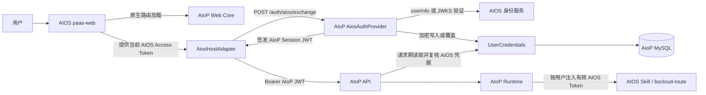
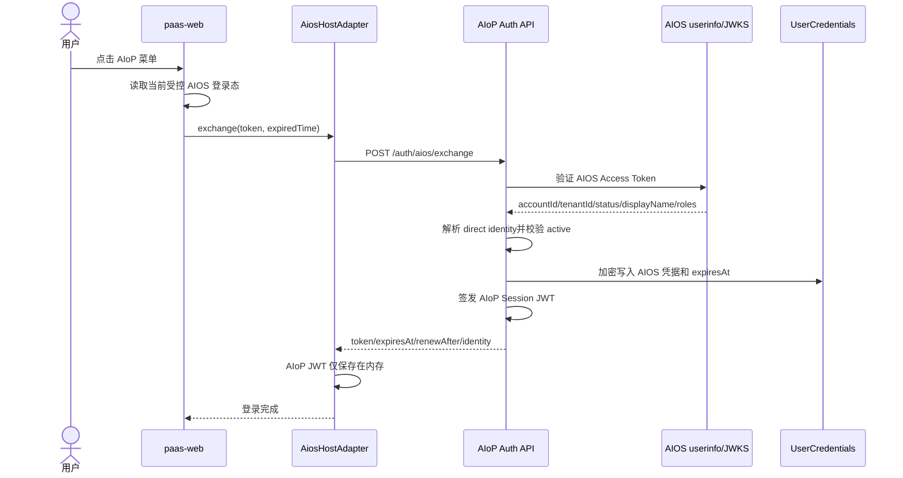
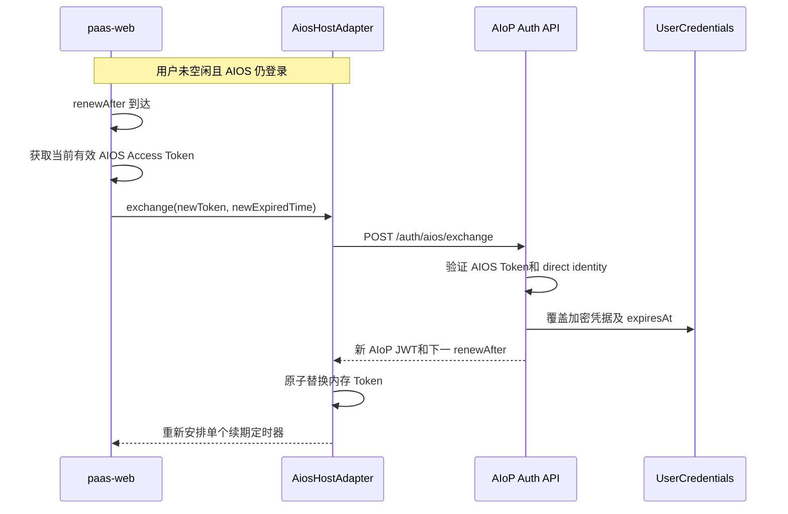
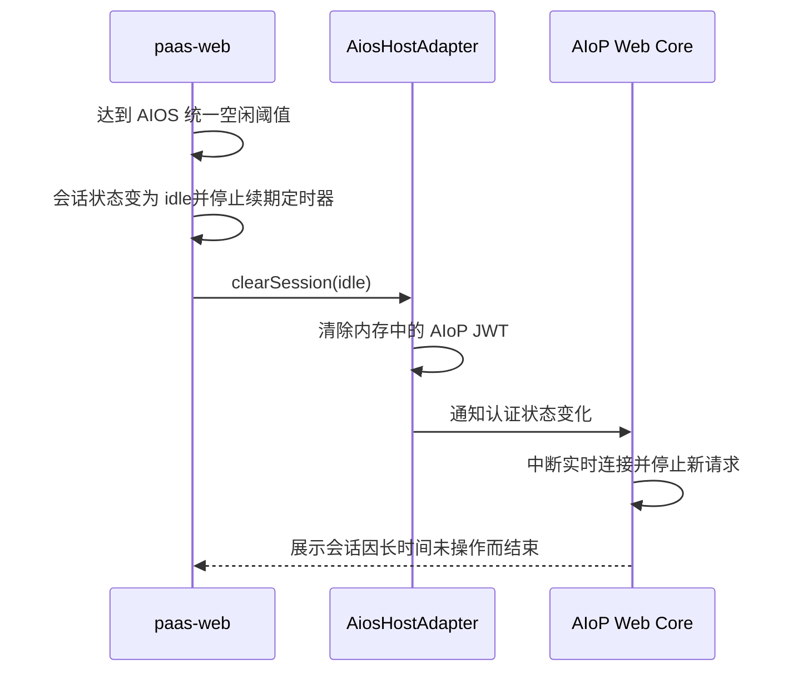
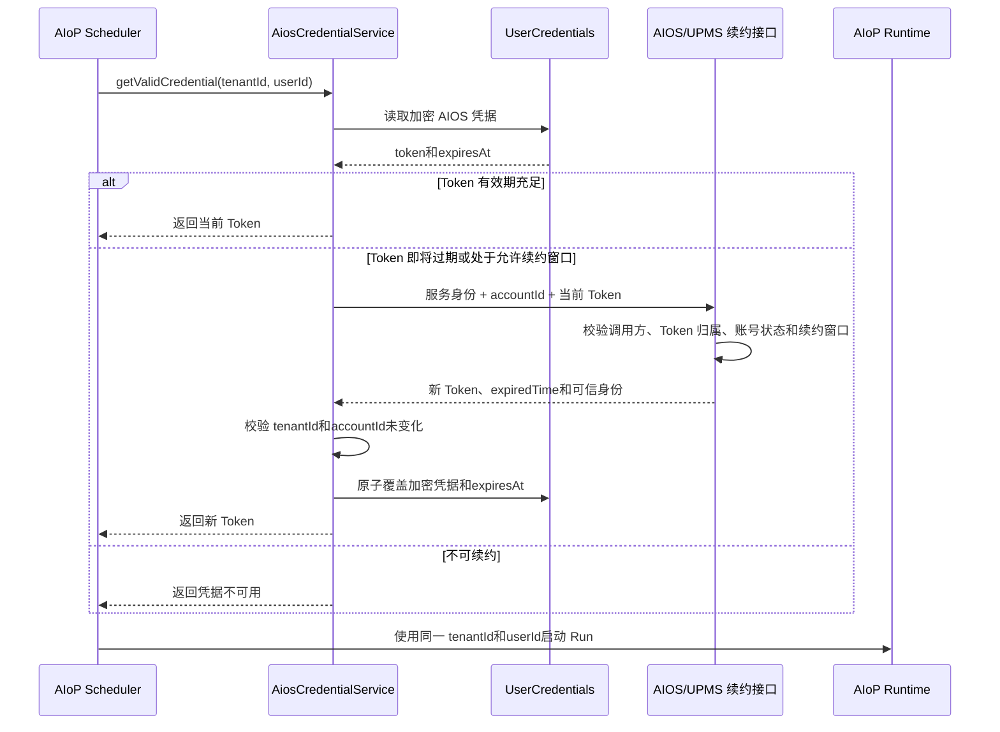

# AIOS 统一认证与会话设计

> 状态：目标设计（部分基础能力已实现）
>
> 初始设计日期：2026-08-04
>
> 最近修订：2026-08-12
>
> 适用范围：AIOS `paas-web`、AIoP Web Core、AIoP Auth/Store/Runtime
>
> 约束：本文只描述概要设计，不代表相关能力均已实现

## 1. 背景与目标

AIoP 支持 `standalone` 和 `aios-integrated` 两种部署模式。本文只描述 `aios-integrated`：AIOS `paas-web` 注册原生 AIoP 页面和菜单，加载 AIoP 提供的 Web Core，并复用当前 AIOS 登录态。用户从 AIOS 菜单进入 AIoP 聊天页面时无需再次输入账号和密码。

集成模式采用 AIOS direct identity，不创建或同步 AIoP 本地影子用户。AIoP 从经过可信验证的 AIOS 用户信息或 JWT Claims 中取得稳定的 `accountId`、`tenantId`、账号状态、显示名和角色，直接形成请求身份：

```text
tenantId = 可信 AIOS tenantId
userId   = 可信 AIOS accountId
provider = aios
role     = tenant_admin | user
```

AIoP 会话和 AIOS 下游凭据分离：

- AIOS Access Token 由 `paas-web` 从受控平台登录态取得，通过 HTTPS 请求体交给 AIoP Token Exchange；AIoP 后端验证后使用 AES-256-GCM 加密存入 `UserCredentials`。
- AIoP Session JWT 由 AIoP 后端签发，只在 AIoP Web 内存中保存，用于访问 AIoP API。
- Refresh Token 不传递给 AIoP Web，不写入 AIoP 浏览器存储，也不作为本方案的续期依赖。

本设计实现以下目标：

1. 从 AIOS 菜单进入 AIoP 时自动完成 Token Exchange，无二次登录。
2. 使用 AIOS `accountId` 作为直接身份，不创建本地 `users/tenants` 影子数据。
3. 加密保存当前用户的 AIOS Access Token，供请求期身份复核和 AIOS Skill 调用。
4. 通过 `paas-web` 定时重新执行现有 Exchange，实现简单的 AIoP 会话无感续期。
5. 空闲超时与 AIOS 平台保持一致；达到平台统一空闲阈值后停止续期并清除 AIoP 页面会话。
6. AIOS Token、账号状态或身份映射失效时 fail closed，不使用服务账号绕过用户权限。

## 2. 关键决策

| 决策 | 结论 |
| --- | --- |
| 页面集成 | `paas-web` 注册原生 AIoP 页面并消费 AIoP Web Core；目标方案不依赖 iframe 和 `postMessage` |
| 主认证源 | `aios-integrated` 模式下 `auth.provider=aios`，AIOS 是用户身份权威源 |
| 身份模型 | 使用可信正整数 `accountId` 作为 AIoP `userId`，不创建影子用户 |
| Token 传递 | `paas-web` 将 AIOS Access Token 和过期时间放入 `/auth/aios/exchange` 的 HTTPS JSON 请求体；禁止放入 URL |
| Token 校验 | AIoP 后端使用 AIOS userinfo 或远端 JWKS 验证 Token，并取得可信身份字段 |
| 角色模型 | AIOS 管理员角色白名单映射为 `tenant_admin`，其余映射为 `user`；AIOS 用户不映射 `platform_admin` |
| 凭据存储 | AIOS Access Token 使用 AES-256-GCM 加密后，以 `tenantId + userId + provider=aios` 写入 `UserCredentials` |
| AIoP 会话 | 后端签发短期 AIoP JWT；Web 只在内存保存，不写 `localStorage` |
| 无感续期 | `paas-web` 在用户未空闲且 AIOS 仍登录时，定时获取当前有效 AIOS Access Token，并重新调用同一个 Exchange |
| 空闲退出 | 使用 AIOS 平台统一空闲阈值和判定结果；空闲后停止续期、清除 AIoP JWT并终止页面实时连接 |
| Refresh Token | 不向 AIoP Web 暴露；本方案不新增 AIoP Refresh Token 流程 |
| 离线任务 | 在受控的服务端用户 Token 续约能力完成前，AIOS 集成模式不承诺 Token 过期后的离线定时执行 |

## 3. 现状依据与设计边界

### 3.1 当前已具备的能力

- `src/auth/aios.ts`：AIOS Token Exchange、userinfo/JWKS 校验、direct identity 映射、凭据缓存和 AIoP JWT 签发。
- `src/auth/credentials.ts`：AIOS 用户凭据 AES-256-GCM 加密存储和过期读取保护。
- `src/auth/session.ts`：AIoP Session JWT 签发与校验。
- `src/server/http.ts`：`POST /auth/aios/exchange`、Bearer 认证和 `/v1/me`。
- `web/src/web-core.tsx`：可由外部宿主消费的 AIoP Web Core。
- `web/src/aios-host-adapter.ts`：Exchange、内存 Token 保存、Token 订阅和 401 处理基础能力。
- `deploy/aiop/configmap-aios-integrated.yaml`：`aios-integrated + auth.provider=aios` 配置模板。

### 3.2 当前仍需跨仓库完成的能力

- `paas-web` 中的 AIoP 菜单、原生路由和 Web Core 接入。
- `paas-web` 从受控 AIOS 登录态取得当前 Access Token 的适配器。
- `/aiop-api` 同源反向代理及 SSE、上传和超时配置。
- Exchange 续期定时器和 AIOS 平台空闲状态联动。
- AIOS 退出、账号切换和平台空闲时清除 AIoP 页面会话。
- Exchange 响应增加明确的 `expiresAt` 和 `renewAfter`，避免宿主自行猜测 AIoP JWT 有效期。

### 3.3 明确移除的旧设计

以下内容不再属于目标方案：

- iframe `postMessage ready/auth` 作为主要登录通道；
- AIoP 本地影子用户 JIT 创建；
- 按小时读取 UPMS 数据库同步影子用户；
- `external_id`、`external_roles`、`status_reason`、同步水位等影子用户字段；
- 通过影子用户状态维护 AIOS 用户生命周期；
- 实时页面依赖 AIoP 后端调用 UPMS 内部接口续约 Access Token。

账号状态、显示名和角色以 AIOS userinfo/JWT Claims 的可信结果为准。AIoP 请求认证期间复核 AIOS 凭据和身份一致性，不依赖本地用户表。

## 4. 总体架构



系统边界如下：

- `paas-web` 负责判断用户在 AIOS 中是否仍应保持登录，以及何时因平台空闲或退出而停止 AIoP 续期。
- AIoP Web Core 和 `AiosHostAdapter` 负责交换并维护当前页面的 AIoP JWT。
- AIoP 后端负责验证 AIOS Token、加密更新用户凭据、签发和校验 AIoP JWT。
- AIOS 身份服务负责 AIOS Token、账号状态和平台登录会话的最终权威判断。

## 5. 首次进入与用户凭据入库

### 5.1 首次登录流程



### 5.2 Exchange 请求

`paas-web` 从 AIOS 平台受控登录态获取当前有效凭据，然后调用 AIoP Web Core 提供的 Host Adapter：

```typescript
await host.exchange({
  token: aiosAccessToken,
  expiredTime: aiosAccessTokenExpiresAt,
});
```

对应 HTTP 请求：

```http
POST /auth/aios/exchange
Content-Type: application/json

{
  "token": "AIOS_ACCESS_TOKEN",
  "expiredTime": "2026-08-12T18:00:00+08:00"
}
```

要求：

- `token` 必填；只能放在 HTTPS 请求体，不得进入 URL、日志、埋点或错误响应。
- `expiredTime` 由宿主作为凭据过期信息传入；非法或已过期时 Exchange 失败。
- 不传 Refresh Token。现有兼容字段后续应废弃，不应由 `paas-web` 使用。
- 身份、状态和角色必须来自后端验证结果，不能信任浏览器自报字段。

### 5.3 Direct identity

AIoP 后端从可信响应提取：

- `accountId`：稳定正整数用户 ID；
- `tenantId`：用户所属租户；
- `status`：必须为 `active`；
- `displayName`：页面展示名；
- `roles`：用于映射 AIoP 角色。

AIOS 角色命中 `auth.aios.adminRoles` 时映射为 `tenant_admin`，否则为 `user`。该身份直接用于会话、Run、定时任务和业务数据归属，不读写本地 `users/tenants` 行。

### 5.4 UserCredentials 写入

AIOS Token 验证和身份解析成功后，AIoP 必须先更新 `UserCredentials`，再签发 AIoP JWT：

```text
key        = tenantId + userId + provider='aios'
payload    = AES-256-GCM({ token, expiredTime })
expires_at = AIOS Access Token 过期时间
```

相同用户再次进入或无感续期时覆盖同一条凭据记录，不创建重复记录。明文 Token 不落库、不进日志；凭据过期、缺失或无法解密时视为无有效凭据。

### 5.5 Exchange 响应

目标响应增加 AIoP 会话时间信息：

```json
{
  "token": "AIOP_SESSION_JWT",
  "expiresAt": "2026-08-12T20:00:00Z",
  "renewAfter": "2026-08-12T19:30:00Z",
  "tenantId": "tenant-1",
  "userId": "1001",
  "role": "user",
  "displayName": "张三"
}
```

- `expiresAt`：AIoP JWT 的绝对过期时间。
- `renewAfter`：宿主建议发起下一次 Exchange 的时间，必须早于 `expiresAt`。
- `paas-web` 不解析 AIoP JWT，也不自行读取 AIoP 后端 TTL 配置。

## 6. 简化的无感续期

### 6.1 设计原则

无感续期不新增 `/refresh` 接口，不引入浏览器 Refresh Token，也不在实时页面链路中建设后端 `AiosTokenService`。它只是由 `paas-web` 在合适时间使用当前有效 AIOS Access Token，重新调用现有 `/auth/aios/exchange`。

每次 Exchange 同时完成：

1. 重新验证当前 AIOS Token和账号状态；
2. 覆盖更新服务端 `UserCredentials` 中的 AIOS Token 与 `expires_at`；
3. 签发新的 AIoP Session JWT；
4. 由 `AiosHostAdapter` 原子替换内存中的旧 AIoP JWT。

### 6.2 续期流程



### 6.3 paas-web 职责

- 持有 AIOS 登录态权威接口，能够取得当前有效 Access Token 和过期时间。
- 根据 Exchange 返回的 `renewAfter` 维护一个 AIoP 续期定时器。
- 续期前确认平台会话仍是 `authenticated`，且用户未达到 AIOS 统一空闲阈值。
- 同一页面同一时刻最多运行一个 Exchange；重复触发应合并或忽略。
- Exchange 成功后使用新的 `renewAfter` 重新安排定时器。
- AIOS Token 获取失败、平台退出或空闲时停止定时器，不向 AIoP 提供 Refresh Token。

### 6.4 AIoP Web 职责

- 通过 `AiosHostAdapter.exchange()` 调用 Exchange。
- AIoP JWT 仅保存在 Adapter/React 内存中。
- Exchange 成功时原子替换 Token并通知 Web Core继续使用新 Token。
- Exchange 失败时保留仍未过期的旧 AIoP JWT只用于当前错误处理；不得无限重试或延长其有效期。
- 收到平台空闲、退出或账号切换通知后，停止发起新请求并清除 AIoP JWT。

### 6.5 AIoP 后端职责

- 对每次 Exchange 执行完整 AIOS Token 验证，不把“续期”视为弱校验路径。
- 先更新 `UserCredentials`，再签发新 AIoP JWT。
- 返回 `expiresAt` 和 `renewAfter`，并可加入小范围抖动，避免客户端集中续期。
- 不负责实时页面的 AIOS Access Token刷新，不保存浏览器 Refresh Token。

### 6.6 失败处理

- 获取 AIOS Token 临时失败：允许在旧 AIoP JWT 尚未到期时执行有限退避重试，但不得超过 `expiresAt`。
- Exchange 返回 401：立即停止续期并清除 AIoP JWT，交由 `paas-web` 按 AIOS 登录状态决定重新认证。
- Exchange 返回 5xx 或网络错误：有限重试；旧 AIoP JWT 到期后必须退出。
- AIoP API 返回 401：清除当前 AIoP JWT，停止续期并通知宿主重新确认 AIOS 登录态。
- AIoP API 返回 403：展示权限不足，不通过换账号或服务身份自动重试。

## 7. AIOS 统一空闲退出

### 7.1 权威边界

空闲时长和空闲判定以 AIOS 平台为唯一权威，AIoP 不配置独立的 15、30 或 60 分钟阈值。`paas-web` 负责汇总平台页面、多标签页和 AIoP 页面中的有效用户活动，并按 AIOS 统一策略产生 `authenticated`、`idle`、`logged_out` 或 `account_changed` 状态。

后台行为不应被视为用户活动，包括：

- SSE 或 Agent 输出；
- 轮询和自动刷新；
- Token Exchange；
- 后台 API 请求；
- React 渲染和定时器执行。

### 7.2 空闲退出流程



空闲后不得自动再次 Exchange，否则会抵消空闲退出。用户主动点击“重新进入”时：

- AIOS 平台会话仍有效：`paas-web` 取得当前 Token并重新 Exchange，无需输入密码；
- AIOS 平台会话已退出：进入 AIOS 平台登录流程。

### 7.3 服务端凭据处理

页面空闲退出时，第一阶段不立即删除 `UserCredentials`：

- 单个页面空闲不等价于所有标签页和运行任务都已结束；
- 凭据已有 `expires_at`，到期后读取自动失败；
- AIoP 请求期仍会通过 AIOS userinfo/JWKS复核 Token 和账号状态。

AIOS 明确退出后，第一阶段同样可以依赖 Token 撤销和 `expires_at` 自然失效。后续如 AIOS 能提供可靠的全局注销事件，可新增受认证的凭据清理接口；该增强不阻塞本方案。

## 8. 请求期认证和下游凭据

### 8.1 AIoP API认证

后续聊天、会话、Run 和设置 API 使用：

```http
Authorization: Bearer <AIOP_SESSION_JWT>
```

AIoP 后端认证至少执行：

1. 验证 AIoP JWT 签名和 `exp`；
2. 确认 `provider=aios` 且角色不是 `platform_admin`；
3. 根据 `tenantId + userId + provider=aios` 读取并解密 `UserCredentials`；
4. 检查凭据 `expires_at`；
5. 使用已存 AIOS Token调用 userinfo 或 JWKS复核身份；
6. 确认当前 `tenantId`、`accountId` 和角色与 AIoP JWT 一致。

任一步失败均返回 401。该请求期校验是后端安全边界，不因前端无感续期或空闲退出而省略。

### 8.2 AIOS Skill调用

需要调用 AIOS API 的 Runtime/Skill 只能取得当前 Run 所属 `tenantId + userId` 的凭据。Token 只注入当前受控执行环境，不得写入：

- Run 事件或 Transcript；
- Tool 参数回显或结果；
- 应用日志和审计 detail；
- 下载链接、URL、前端埋点或错误消息。

`bocloud-route` 返回 401 时，本次执行失败并要求用户重新建立凭据；返回 403 时直接返回权限不足。不得改用平台服务账号绕过用户权限。

### 8.3 定时任务 Token 续约

宿主定时 Exchange 只解决用户页面在线期间的 AIoP 会话续期。页面关闭或用户离线后，`paas-web` 无法继续提供新的 AIOS Access Token；为了让已经创建的定时任务继续以原用户身份执行，需要独立的服务端 Token 续约能力。

该能力不复用浏览器续期定时器，不要求保存 Refresh Token。AIOS/UPMS 需要提供受控的内部续约接口，允许 AIoP 后端在严格绑定用户身份的前提下，使用当前或处于允许续约窗口内的过期 Access Token 换取新 Token。

#### 8.3.1 执行流程



概要流程：

1. Scheduler 从定时任务记录中取得原始 `tenantId + userId`，不得替换为创建任务的管理员或平台服务账号。
2. 统一的 `AiosCredentialService` 按 `tenantId + userId + provider=aios` 读取 `UserCredentials`。
3. Token 剩余有效期大于安全窗口时直接返回；安全窗口由服务端统一配置，避免任务执行过程中 Token 到期。
4. Token 即将过期或处于 AIOS 允许的过期续约窗口时，调用 AIOS/UPMS 内部续约接口。
5. 续约请求必须同时绑定 AIoP 服务身份、用户 `accountId` 和当前或刚过期的用户 Access Token；服务身份不能单独签发任意用户 Token。
6. AIOS/UPMS 校验 Token 签名、签发方、受众、用户归属、账号状态、会话撤销状态和绝对续约窗口。
7. AIoP 校验续约响应中的 `accountId`、`tenantId` 与定时任务原身份一致。
8. 新 Token 使用 AES-256-GCM 加密并原子覆盖 `UserCredentials`，然后才启动 Run。
9. Runtime 只向当前用户的受控 Skill 执行环境注入 Token，不写入事件、日志或工具输出。
10. Token 不可续约时，本次 Fire 明确失败或进入等待用户重新登录状态，不使用服务账号绕过。

#### 8.3.2 内部续约接口边界

目标接口可采用以下抽象契约，具体路径和服务认证方式由 AIOS/UPMS 团队确认：

```http
POST /internal/auth/token/renew
Authorization: Bearer <AIOP_SERVICE_CREDENTIAL>
Content-Type: application/json

{
  "accountId": "1001",
  "tenantId": "tenant-1",
  "token": "CURRENT_OR_RECENTLY_EXPIRED_ACCESS_TOKEN"
}
```

成功响应至少包含：

```json
{
  "token": "NEW_ACCESS_TOKEN",
  "expiredTime": "2026-08-13T10:00:00+08:00",
  "accountId": "1001",
  "tenantId": "tenant-1"
}
```

接口必须满足：

- 只允许经过认证和授权的 AIoP 后端服务访问，浏览器、Web Core和 Skill 不得直接调用；
- 已过期 Token 只能在配置的绝对续约窗口内续约，超过窗口必须要求用户重新登录；
- 用户已退出、会话已撤销、账号禁用或身份不匹配时拒绝续约；
- 不允许通过直接读写 UPMS 会话表、复制签名密钥或模拟用户登录实现续约；
- 续约请求和结果需要在 AIOS 与 AIoP 双侧记录安全审计，但不得记录原始 Token。

#### 8.3.3 并发与失败处理

- 同一 `tenantId + userId + provider` 同一时刻只允许一个续约请求；可使用数据库短租约或分布式锁。
- 获得锁后必须重新读取凭据；若其他实例已经完成续约，则直接使用新 Token。
- 更新凭据使用版本号或 compare-and-swap，防止较旧的续约响应覆盖较新的 Token。
- AIOS/UPMS 网络错误只进行有限重试；不确定续约是否成功时重新读取凭据后再决定是否重试。
- 续约接口返回 401、用户退出、会话撤销或超过续约窗口时，将本次 Fire 标记为凭据不可用并等待用户重新登录。
- 续约接口返回账号禁用时，拒绝后续执行；不得仅依靠缓存中的旧 AIoP JWT继续运行。
- `bocloud-route` 返回 401 时，可在确认当前凭据版本未更新的情况下触发一次强制续约并重试；再次 401 后终止。
- `bocloud-route` 返回 403 时不续约、不重试，直接返回权限不足。

#### 8.3.4 实施前置条件和降级

定时任务 Token 续约依赖 AIOS/UPMS 提供上述受控接口。在接口、服务认证、撤销语义和续约窗口尚未确认前：

- AIOS Token 仍有效时，定时任务可以在其剩余有效期内执行；
- AIOS Token 已过期或进入安全窗口时，不启动依赖 AIOS API 的新执行；
- Fire 应记录明确的凭据不可用状态，等待用户重新进入 AIoP 完成 Exchange；
- 不得使用平台服务账号、管理员 Token 或跨用户共享 Token 代替原用户执行。

该服务端能力与第 6 章的在线无感续期相互独立：在线页面继续采用 `paas-web` 定时 Exchange；离线定时任务只通过受控的服务端续约接口更新 `UserCredentials`。

## 9. 组件职责汇总

| 组件 | 负责 | 不负责 |
| --- | --- | --- |
| `paas-web` | AIOS 登录态、当前 Access Token、平台统一空闲判定、续期定时器、退出/账号切换通知 | 验证或解析 AIoP JWT、持久化 AIoP Token、直接写 AIoP 凭据表 |
| `AiosHostAdapter` | 调用 Exchange、内存保存和替换 AIoP JWT、Token 变化通知、清除页面会话 | 读取 AIOS localStorage、保存 Refresh Token、决定平台是否空闲 |
| AIoP Web Core | 使用 AIoP JWT访问 API、展示认证等待/空闲退出状态、中断实时连接 | 管理 AIOS 登录会话、验证 AIOS Access Token |
| AIoP Auth API | 验证 AIOS Token、direct identity 映射、更新 `UserCredentials`、签发 AIoP JWT | 创建影子用户、刷新浏览器 AIOS Token |
| `UserCredentials` | 加密存储 AIOS Access Token和过期时间、过期和解密失败保护 | 保存 AIoP JWT、决定用户角色 |
| AIOS userinfo/JWKS | Token 真伪、账号状态和身份字段权威验证 | 管理 AIoP Session JWT |
| `AiosCredentialService` | 为离线定时任务读取有效凭据、调用受控服务端续约接口、校验身份并原子更新 `UserCredentials` | 向浏览器暴露 Token、脱离原用户凭据签发 Token |
| AIoP Runtime/Skill | 按 Run 用户身份取得并注入有效 AIOS Token | 自行读取数据库、自行续约 Token或使用服务账号替代用户 |

## 10. 配置设计

继续复用现有配置：

```jsonc
{
  "deploymentMode": "aios-integrated",
  "auth": {
    "provider": "aios",
    "jwtTtl": "2h",
    "aios": {
      "verify": "userinfo",
      "userinfoUrl": "${AIOS_USERINFO_URL}",
      "systemId": "${AIOS_SYSTEM_ID}",
      "tenantId": "default",
      "fields": {
        "userId": "accountId",
        "tenantId": "tenantId",
        "status": "status",
        "displayName": "displayName",
        "roles": "roles"
      },
      "adminRoles": ["tenant_admin"]
    }
  }
}
```

概要设计不新增 UPMS 数据库同步或影子用户同步配置。目标实现需要补充以下服务端策略：

- `auth.jwtTtl`：AIoP Session JWT 有效期；
- `renewAfter`：由后端根据 JWT 到期时间计算并直接返回，不要求单独配置；
- AIOS 平台空闲阈值：由 `paas-web` 的平台会话能力提供，AIoP 配置中不重复定义；
- `auth.aios.tokenRenewUrl`：可选的 AIOS/UPMS 内部用户 Token 续约接口，仅供离线定时任务使用；
- `auth.aios.tokenRenewWindowMs`：允许已过期 Token 续约的绝对窗口，必须与 AIOS/UPMS 服务端策略一致；
- `auth.aios.tokenRenewSafetyWindowMs`：定时任务执行前触发续约的安全窗口；
- 续约服务凭据：必须由 Kubernetes Secret 注入，不写入 ConfigMap。

生产环境必须通过 Kubernetes Secret 提供 `AIOP_JWT_SECRET`。当前凭据加密密钥由该 Secret 派生；如后续需要独立轮换，应单独设计凭据密钥版本和迁移流程。

## 11. 错误处理与降级

| 场景 | 行为 |
| --- | --- |
| 未启用 AIOS Auth | Exchange 返回 400 |
| AIOS Token 缺失、无效或过期 | Exchange 返回 401，不写凭据、不签发 AIoP JWT |
| `accountId`、`tenantId` 或状态字段非法 | Exchange 返回 401，fail closed |
| 账号状态为 `disabled` | Exchange 或请求期认证返回 401 |
| 角色缺失或未命中管理员白名单 | 映射为 `user` |
| UserCredentials 写入失败 | Exchange 失败，不签发 AIoP JWT |
| AIoP JWT过期 | 下一次 API 请求返回 401；宿主停止续期并重新确认 AIOS 登录态 |
| 定时 Exchange 网络失败 | 在旧 AIoP JWT 到期前有限退避重试；到期后退出 |
| AIOS 平台进入 idle | 停止续期、清除内存 JWT、中断实时连接，不自动重新 Exchange |
| AIOS 主动退出或账号切换 | 停止续期并清除 AIoP 页面会话；重新进入时使用新的平台身份 |
| `bocloud-route` 返回 401 | 当前执行失败并要求重新建立 AIOS 凭据 |
| `bocloud-route` 返回 403 | 返回权限不足，不续期、不切换服务身份 |
| 页面关闭且 AIOS Token 进入安全窗口 | 若已配置受控服务端续约接口则按原用户身份续约；否则 Fire 进入凭据不可用状态 |
| 定时任务 Token 续约失败 | 本次 Fire 失败或等待用户重新登录，不使用服务账号、管理员 Token或跨用户 Token |

## 12. 安全设计

### 12.1 Token 边界

- AIOS Access Token 只允许出现在受控宿主内存、Exchange HTTPS 请求体、AIoP 后端加密凭据和当前受控 Skill 执行环境中。
- AIoP Session JWT 只保存在 AIoP Web 内存中，不写 `localStorage`、URL 或日志。
- 不向 AIoP Web 传递 Refresh Token；现有兼容字段不得成为新集成依赖。
- AIOS 凭据使用 AES-256-GCM 加密后存储，明文不得进入数据库、审计、备份导出或管理页面。
- Exchange、续期和请求期复核均不得在日志中记录原始 Token。

### 12.2 身份与授权

- `accountId`、`tenantId`、状态和角色只能来自可信 userinfo/JWT Claims。
- AIoP direct identity 不依赖请求方自报用户名或本地影子用户。
- AIOS 用户只映射为 `tenant_admin` 或 `user`，不通过该路径获得 `platform_admin`。
- 每次 AIoP API认证都复核已存 AIOS 凭据和身份一致性，角色变化无需等待旧 AIoP JWT自然到期后才发现。
- AIOS 下游服务继续对具体推理、训练等操作执行最终鉴权。

### 12.3 会话安全

- 无感续期只在 AIOS 平台状态为已认证且未空闲时执行。
- 空闲退出后禁止后台定时器自动恢复会话；必须由用户主动重新进入。
- 同一页面同一时刻只允许一个 Exchange，防止旧响应覆盖新 Token。
- 续期失败不得无限重试；旧 JWT 到期后必须 fail closed。
- 前端空闲退出是会话管理和用户体验机制，不能替代后端 JWT、凭据过期和 AIOS 身份复核。

## 13. 验收要点

1. 用户从 AIOS 菜单进入 AIoP，无二次登录，页面身份的 `userId` 等于可信 AIOS `accountId`。
2. Exchange 不创建或更新 AIoP 本地 `users/tenants` 行。
3. Exchange 成功后，`UserCredentials` 中存在对应 `tenantId + userId + aios` 的加密凭据，数据库中不出现明文 Token。
4. 定时重新 Exchange 后，同一凭据记录被覆盖更新，浏览器内存中的 AIoP JWT被替换。
5. 用户持续操作且 AIOS 登录有效时，跨越一个 AIoP JWT TTL仍可不中断使用。
6. 达到 AIOS 平台统一空闲阈值后，不再续期，AIoP JWT被清除，实时连接终止。
7. 空闲后后台轮询、SSE 和 Agent 输出不会自动恢复登录。
8. AIOS Token 失效、账号禁用、身份或角色不一致时，AIoP API返回 401。
9. AIOS Access Token、AIoP JWT和 Refresh Token均不会进入 URL、日志、埋点或前端持久化存储。
10. 页面关闭后，定时任务能通过受控服务端接口按原用户身份续约并原子更新 `UserCredentials`；接口不可用或续约失败时不会改用服务账号继续调用 AIOS API。
11. 同一用户并发定时任务只产生一次有效续约，旧续约响应不会覆盖较新的 Token。
