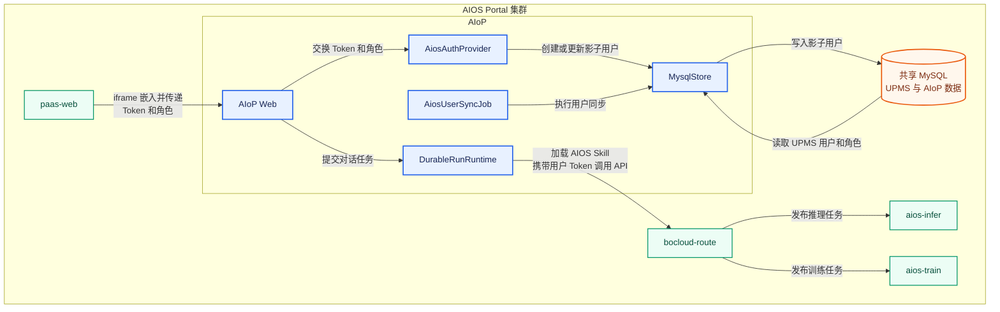
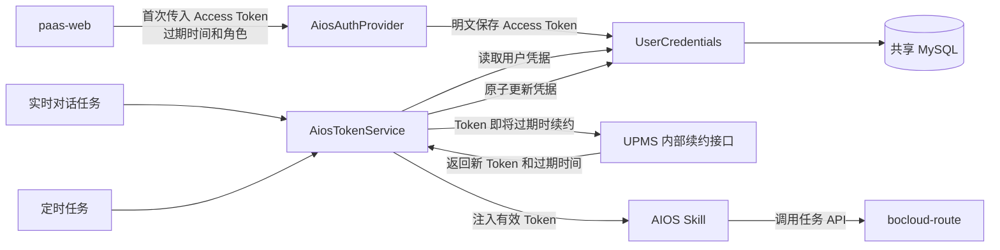
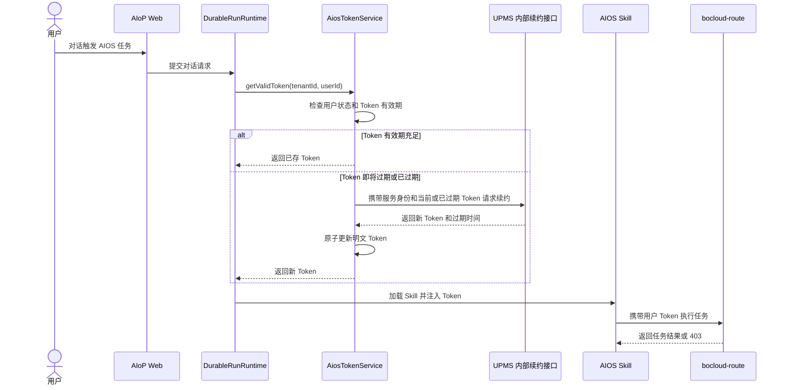
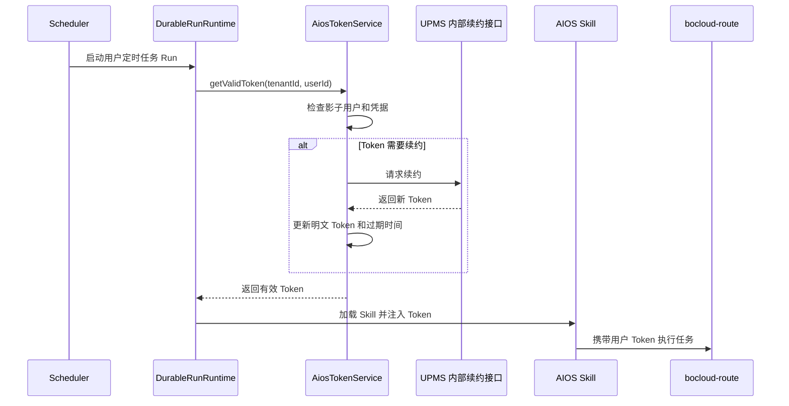
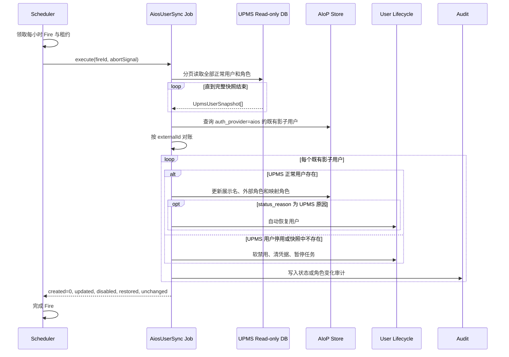

# AIOS 嵌入体系设计

> 状态：目标设计
> 设计日期：2026-08-04
> 适用范围：AIOS `paas-web`、AIoP Web/Auth/Store/Scheduler、UPMS MySQL
> 约束：本文只描述设计，不代表相关能力均已实现

## 1. 背景与目标

AIOS `paas-web` 是宿主前端页面，AIoP Web 作为 iframe 嵌入其中。`paas-web` 将当前用户的 AIOS Token 和权限角色传给 AIoP，用户无需重复登录。

AIoP 为访问过系统的 AIOS 用户创建影子用户，保存 AIoP 内部身份、角色、状态及业务数据归属。用户通过对话要求创建推理、训练等任务时，AIoP 智能体通过 Skill 携带该用户的 AIOS Token 调用 `bocloud-route` API，由 AIOS 对 Token 和操作权限进行最终校验。

本设计实现四个目标：

1. `paas-web` 将当前用户的 AIOS Token 和角色传给 AIoP Web，实现单点登录。
2. AIoP 按平台管理员、租户管理员、普通用户三类角色创建或更新影子用户。
3. AIoP 智能体通过 Skill 使用用户的 AIOS Token 调用 `bocloud-route` API，AIOS 是下游操作权限的最终判定方。
4. AIoP 每小时读取 UPMS 数据库，维护既有影子用户，同步用户删除、停用、改名和角色变更。

本设计不预创建全部 UPMS 用户。只有实际访问过 AIoP 的用户才通过即时创建（Just-In-Time Provisioning，JIT）进入 AIoP 用户表。

## 2. 已确认的关键决策

| 决策 | 结论 |
| --- | --- |
| 嵌入方式 | AIoP Web 作为 iframe 嵌入 AIOS `paas-web` |
| 登录态传递 | `postMessage` 传递 AIOS Access Token、过期时间和角色，不传递 Refresh Token |
| Token 校验 | AIoP 后端校验 AIOS Token；登录时不查询 UPMS 数据库 |
| 初始角色 | `paas-web` 传递平台管理员、租户管理员或普通用户；缺失、未知或格式错误时按普通用户处理 |
| 角色模型 | AIOS 平台管理员、租户管理员、普通用户分别映射为 AIoP `platform_admin`、`tenant_admin`、`user` |
| 下游权限 | 智能体通过 Skill 携带用户 Token 调用 `bocloud-route`；AIOS 对推理、训练等操作执行最终鉴权 |
| Token 续约 | `paas-web` 首次传入的 Access Token 暂以明文存库；实时和定时任务执行前由 `AiosTokenService` 通过 UPMS 内部接口按需续约 |
| 用户来源 | 后台复用 AIoP 的共享 MySQL 连接，通过 `MYSQL_UPMS_DATABASE` 指定的库读取 UPMS 用户和角色 |
| 同步范围 | 查询 UPMS 全部正常用户，不依赖 AIoP `system_id` 或 Label |
| 影子用户范围 | 只维护已经登录过的 `auth_provider='aios'` 用户 |
| 同步周期 | 固定每小时一次 |
| 用户失效 | 软禁用、清除 AIOS 凭据、暂停定时任务，保留业务与审计数据 |
| 用户恢复 | 仅同步任务造成的禁用可自动恢复；人工禁用不自动恢复 |
| 请求期授权 | 每次请求使用影子用户中的最新状态和角色，不等待旧 JWT 过期 |
| 调度方式 | 复用 AIoP Scheduler 的租约、领取、重试和多副本互斥能力 |

## 3. 现状依据

### 3.1 AIoP 当前能力

当前代码已经具备以下基础：

- `src/auth/aios.ts`：AIOS Token Exchange、userinfo/JWKS 校验、JIT 用户创建、角色映射和 AIOS 凭据缓存。
- `src/server/http.ts`：`POST /auth/aios/exchange`、iframe CSP `frame-ancestors`、请求期用户状态检查。
- `web/src/App.tsx`：iframe `ready/auth` 握手、Token Exchange、AIoP Token 保存和到期前重新请求授权。
- `src/auth/lifecycle.ts`：用户软删除、禁用、恢复、凭据清理、定时任务暂停和审计。
- `packages/scheduler-runtime` 与 `src/scheduler`：多副本 Fire 领取、租约、claim token、失败重试和停止控制。

当前实现仍有需要由本设计补齐的差距：

- AIoP Web 接收 `postMessage` 时尚未严格校验 `event.origin` 和 `event.source`。
- Token Exchange 尚未接收 `roles`。
- AIOS 影子用户没有外部用户 ID、外部角色、禁用原因和同步水位等字段。
- 当前 AIoP JWT 携带角色，请求期状态检查不会用数据库最新角色替换 JWT 角色。
- 当前没有 UPMS 数据库适配器和影子用户同步任务。

## 4. 总体架构



系统包含三条相互配合的链路：

- **影子用户链路**：`paas-web` 将 Token 和角色传给 `AIoP Web`，由 `AiosAuthProvider` 完成交换，并通过 `MysqlStore` 创建或更新影子用户。
- **后台同步链路**：`AiosUserSyncJob` 通过 `MysqlStore` 读取共享 MySQL 中的 UPMS 用户和角色，并更新同一数据库中的既有影子用户。
- **任务执行链路**：实时或定时 Run 调用 AIOS Skill 前，通过 `AiosTokenService` 读取已存 Access Token，并按需调用 UPMS 内部接口续约。Runtime 将有效 Token 注入 `aios-infer` 或 `aios-train` Skill，再通过 `bocloud-route` 调用对应服务。

## 5. Token 续约

AIOS Access Token 存在有效期，本设计将 Token 持久化，并在每次执行 AIOS 任务前通过 UPMS 内部接口自动续约。

本章解决两个场景：

1. **定时任务**：用户不在线、iframe 已关闭时，Scheduled Task 仍需取得有效用户 Token。
2. **实时对话任务**：用户在 AIoP 页面发送消息并触发推理、训练等任务时，需要在调用 `bocloud-route` 前取得有效 Token。

### 5.1 总体方案

1. `paas-web` 加载 AIoP iframe 后，主动通过 `postMessage` 传递 Access Token、过期时间和角色；AIoP Web 不发起 Token 请求，也不接收 Refresh Token。
2. AIoP 验证 Token，创建或更新影子用户，并将 Access Token 暂以明文存入共享 MySQL 的用户凭据表。
3. 实时对话任务或定时任务执行前，统一调用 `AiosTokenService.getValidToken()`。
4. Token 剩余有效期充足时直接返回已存 Token。
5. Token 已过期或即将过期时，AIoP 后端携带服务身份、用户 `accountId` 和当前 Access Token，调用 UPMS 内部续约接口取得新 Token。该接口必须支持已过期 Access Token 的受控续约。
6. 新 Token 原子覆盖旧 Token 后，再注入 AIOS Skill；Skill 携带新 Token 调用 `bocloud-route`。
7. 续约失败时不使用过期 Token，也不改用服务账号绕过用户权限。



### 5.2 首次 Token 入库

`paas-web` 创建并加载 AIoP iframe 后，主动向 iframe 发送当前用户的 Token、过期时间和角色。首次入库流程不依赖 AIoP Web 发送 `aiop:ready` 或其他 Token 请求。

`paas-web` 发送：

```json
{
  "type": "aiop:auth",
  "protocolVersion": 1,
  "token": "AIOS_ACCESS_TOKEN",
  "expiredTime": "TOKEN_EXPIRED_TIME",
  "roles": ["platform_admin"]
}
```

字段要求：

| 字段 | 必填 | 说明 |
| --- | --- | --- |
| `token` | 是 | 当前用户 AIOS Access Token |
| `expiredTime` | 是 | Access Token 过期时间，统一转换为 UTC 时间存储 |
| `roles` | 否 | 平台管理员、租户管理员或普通用户；缺失时按普通用户处理 |

`paas-web` 应在 iframe 的 `load` 事件后发送消息；如果 AIoP Web 尚未完成监听，可在短时间内按固定上限重发，AIoP 后端以用户和凭据版本保证幂等。AIoP Web 不主动请求 Token。

AIoP Web 只接受 `event.source === window.parent` 且 `event.origin` 命中白名单的消息。Token 不得出现在 URL、query、fragment、日志或错误响应中。

`AiosAuthProvider` 完成以下操作：

1. 验证 Access Token，并从已验证身份中取得 `accountId`、登录名和显示名。
2. 根据 `paas-web` 传入的角色创建或更新影子用户。
3. 将 `{ token, expiredTime }` 交给 `UserCredentials`。
4. `UserCredentials` 暂时以明文保存 Access Token，并以 `tenantId + userId + provider='aios'` 为唯一键写入共享 MySQL。数据库字段和访问权限仍按敏感凭据管理。
5. 再次进入 AIoP 时，以最新 Token 覆盖旧 Token，不创建重复记录。

### 5.3 有效 Token 获取服务

所有需要调用 AIOS API 的执行路径必须使用统一的 `AiosTokenService`，不能由 Skill 直接读取数据库或自行续约。

建议接口：

```typescript
interface AiosTokenService {
  getValidToken(
    tenantId: string,
    userId: string,
    signal?: AbortSignal,
  ): Promise<AiosTokenData>;
}
```

`getValidToken()` 的处理规则：

1. 读取当前用户已存的 Access Token 和过期时间。
2. 用户不存在、已禁用或没有 Token 时立即失败。
3. Token 剩余有效期大于安全窗口时直接返回。安全窗口建议为 5 分钟，并允许配置。
4. Token 已过期或进入安全窗口时，调用 UPMS 内部续约接口。
5. 校验续约响应中的用户身份，必须与影子用户 `external_id` 一致。
6. 将新 Access Token 和过期时间原子写回凭据表。
7. 只将 Token 注入当前 Skill 进程或沙箱，不写入 Run 事件、Transcript 或工具输出。

### 5.4 UPMS 内部续约接口

UPMS 内部续约接口属于高敏感能力。该接口一旦被滥用，调用方可代表用户执行 AIOS 操作，因此必须采用比普通内部 HTTP 接口更严格的控制。

* 该接口需要支持已过期的token续约

目标接口契约示例：

```http
POST /internal/auth/token/renew
Content-Type: application/json
Authorization: Bearer <AIoP_SERVICE_CREDENTIAL>

{
  "accountId": "AIOS_ACCOUNT_ID",
  "token": "CURRENT_OR_EXPIRED_ACCESS_TOKEN"
}
```

成功响应：

```json
{
  "token": "NEW_ACCESS_TOKEN",
  "expiredTime": "NEW_EXPIRED_TIME",
  "accountId": "AIOS_ACCOUNT_ID"
}
```

接口安全要求：

- 仅允许 AIoP 后端服务调用，浏览器和 Skill 不得直接访问。
- 该接口需要对调用方进行身份验证。
- 请求必须同时携带当前或已过期的用户 Access Token；服务身份不能脱离该 Token 任意签发用户 Token。
- UPMS 必须校验 Access Token 的签名和用户归属。允许忽略过期状态仅用于本续约接口，其他签名、签发方、受众和用户绑定校验不能跳过。
- UPMS 必须校验用户未删除、状态正常，并返回与请求一致的 `accountId`。
- 续约事件写入 UPMS 和 AIoP 双侧审计，至少包含用户、调用方、时间、结果和关联 ID。

如果 UPMS 当前没有满足以上要求的内部续约能力，不能通过直接读写 UPMS 会话表、复制签名密钥或模拟用户登录实现续约。应先补充受控续约接口。

### 5.5 实时对话任务



实时任务不依赖前端再次传 Token。`paas-web` 首次传入并落库后，后端在每次 AIOS Skill 调用前保证 Token 可用。

### 5.6 定时任务



定时任务必须保留明确的 `tenantId` 和 `userId` 归属。用户被 UPMS 同步禁用、人工禁用、凭据不存在或续约失败时，本次 Run 失败，不得改用创建任务的管理员或系统服务账号。

### 5.7 并发与失败处理

同一用户可能同时触发多个实时任务或定时任务。为避免使用同一 Access Token 重复并发续约，需要：

1. 按 `tenantId + userId + provider` 建立短租约或数据库互斥。
2. 获得锁后重新读取凭据；如果其他请求已完成续约，直接使用新 Token。
3. 更新凭据时使用版本号或 compare-and-swap，旧版本不能覆盖新版本。
4. 续约请求设置较短连接和响应超时，并只对明确的瞬时错误执行有限重试。
5. UPMS 返回 401 时将凭据标记为不可续约，要求用户重新进入 AIoP 建立新凭据。
6. UPMS 返回用户停用或删除时，禁用影子用户、暂停其定时任务并清除凭据。
7. `bocloud-route` 返回 401 时，允许强制续约后重试一次；再次返回 401 则终止任务。
8. `bocloud-route` 返回 403 时不续约、不重试，直接返回权限不足。
9. UPMS 续约接口不可用时 fail closed：不使用过期 Token，不执行 AIOS 任务。

### 5.8 数据保护与审计

- 当前阶段只保存 Access Token，不保存 Refresh Token；Access Token 暂以明文存储。
- Token 字段必须与普通业务字段隔离，数据库账号遵循最小权限，非 AIoP 后端服务不得查询该字段。
- 数据库查询输出、备份导出、管理工具展示、应用日志、Run 事件、Transcript、Skill 参数和工具结果均不得包含完整 Token。
- 生产数据库和备份介质应启用静态加密，AIoP 与 MySQL 之间应启用 TLS；这些措施不能替代后续应用层加密。
- 用户禁用、删除、重新登录或 Token 续约被拒绝时清除已存 Token。
- 审计记录 Token 首次入库、续约成功、续约失败、凭据清除和强制重新登录，但只记录凭据指纹或末尾摘要。
- 指标至少包括续约次数、续约失败数、续约耗时、并发合并次数和因凭据问题失败的任务数。
- 明文存储是阶段性方案。后续引入独立凭据密钥后，应迁移为 AES-256-GCM 应用层加密。

## 6. 影子用户模型

### 6.1 字段设计

影子用户仍存入 AIoP `users`，并以 `auth_provider='aios'` 标识外部托管身份。目标模型需要增加以下同步元数据：

| 字段 | 类型 | 说明 |
| --- | --- | --- |
| `external_id` | string | UPMS `accountId`，稳定且不可由浏览器自报 |
| `external_roles` | JSON/string[] | 最近一次登录或同步得到的 AIOS 角色 |
| `status_reason` | enum/null | `manual`、`upms_missing`、`upms_disabled` 或空 |
| `last_seen_at` | timestamp/null | 最近一次完整 UPMS 同步看到该用户的时间 |
| `last_synced_at` | timestamp/null | 最近一次成功处理该影子用户的时间 |
| `auth_version` | integer | 状态或角色变化时递增，用于缓存失效和审计关联 |

字段所有权如下：

| 数据 | 权威方 |
| --- | --- |
| `external_id` | AIOS Token / UPMS，不允许本地修改 |
| `username`、`display_name` | AIOS/UPMS 可更新 |
| `external_roles` | 登录时由 `paas-web` 初始化，后台由 UPMS 覆盖 |
| `role` | AIoP 根据角色映射规则计算 |
| `status`、`status_reason` | AIoP 生命周期服务维护 |
| 会话、Skill、Run、定时任务、用户目录 | AIoP 自主管理，用户失效时保留 |

### 6.2 身份匹配

影子用户必须通过 `tenant_id + auth_provider + external_id` 唯一匹配。不得只使用显示名或可修改的登录名匹配。

对当前已经以 AIOS 登录名作为 `username` 创建、但没有 `external_id` 的存量用户，首次成功 Token Exchange 或首次同步时按以下顺序补齐：

1. 在同一租户内查找 `auth_provider='aios'` 且 `username=sub` 的唯一用户；
2. 唯一命中时绑定 `external_id=accountId`；
3. 未命中时创建新影子用户；
4. 多个候选或 ID 冲突时拒绝自动合并并写安全审计。

## 7. 后台同步设计

### 7.1 调度模型

同步任务是内部系统任务，不是用户创建的 Agent 定时任务，也不进入 Pi Agent loop。目标设计在 Scheduler 中注册固定类型的系统任务：

- `job_key = aios-user-sync`；
- 默认 Cron：每小时一次；
- 使用 UTC 计算 Fire；
- `fire_id = job_key + ":" + fire_time`；
- 使用共享 MySQL Store 领取 Fire；
- 使用 lease、owner 和 claim token 防止多副本重复执行；
- 失败后按 Scheduler retry 语义重试；
- 停止时响应 `AbortSignal` 并释放资源。

不得通过裸 `setInterval`、永久阻塞线程或 `replicas=1` 假设实现正确性。

### 7.2 同步流程



每轮执行以下步骤：

1. 生成同步运行标识，并记录开始时间。
2. 分页读取 UPMS 全部正常用户和角色。
3. 校验分页完整性、记录数和字段格式。
4. 查询 AIoP 全部既有 AIOS 影子用户。
5. 按 `external_id` 对账，不创建从未登录过 AIoP 的用户。
6. UPMS 用户存在且正常：
   - 更新用户名、展示名和外部角色；
   - 重新计算 `platform_admin/tenant_admin/user`；
   - 如果因 `upms_missing` 或 `upms_disabled` 被禁用，则自动恢复；
   - 如果因 `manual` 被禁用，则保持禁用。
7. UPMS 用户不存在或停用：
   - 设置 `status='disabled'`；
   - 设置对应 `status_reason`；
   - 清除 AIOS 凭据；
   - 暂停该用户的定时任务；
   - 保留会话、Skill、Run、文件归属和审计记录。
8. 记录汇总并完成 Scheduler Fire。

### 7.3 防误禁用护栏

同步任务只有在获得完整、可信快照后才能执行禁用阶段。出现以下任一情况时，本轮只能更新已经明确读取到的用户，不能按“未出现”禁用用户：

- 任一分页查询失败或超时；
- 数据库连接中断；
- 行扫描或角色聚合失败；
- 返回数量异常下降并触发安全阈值；
- 同步被取消；
- 无法确认快照结束。

建议提供两个配置化护栏：

- **最小快照比例**：本轮正常用户数量相对上次成功轮次下降超过阈值时停止禁用；
- **单轮最大禁用数**：超过阈值时将 Fire 标记失败并告警。

首次运行没有上次成功水位时，只更新匹配用户，不因快照缺失禁用影子用户。首次完整成功后才建立禁用基线。

### 7.4 幂等性

同一 Fire 重试或因租约接管再次执行时必须得到相同结果：

- 用户匹配使用稳定 `external_id`；
- 状态和角色更新采用目标值覆盖；
- 已禁用用户再次禁用不重复改变业务数据；
- 已暂停任务再次暂停无副作用；
- 审计事件使用 `fire_id + user_id + action` 作为去重关联键，或明确记录重复尝试；
- 只有当前 claim token 的持有者可以提交 Fire 完成状态。

## 8. 配置设计

### 8.1 配置载体

复用当前项目的 `aiop-config` 和 `config.jsonc`，不为 AIOS 认证、Token 续约或用户同步新增独立 ConfigMap。配置分工如下：

- JSON 结构化配置继续写入 `aiop-config` 的 `config.jsonc`；
- MySQL 数据库名等非敏感环境变量也作为 `aiop-config.data` 的键统一维护；
- Deployment 继续挂载 `config.jsonc`，并增加对同一个 `aiop-config` 的 `configMapRef`，将其中的环境变量注入容器；
- 数据库密码、JWT Secret 等敏感值继续由现有 Kubernetes Secret 注入，不写入 ConfigMap。

### 8.2 复用现有配置

以下配置已经存在，直接复用：

- `MYSQL_HOST`、`MYSQL_PORT`、`MYSQL_USER`、`MYSQL_PASSWORD_BASE64`、`MYSQL_SSL` 和 `MYSQL_POOL_SIZE`：继续提供共享 MySQL 的连接信息；
- `MYSQL_DATABASE`：继续作为 AIoP 业务数据库名；
- `auth.aios.verify`、`userinfoUrl`、`systemId`、`tenantId`、`allowedParentOrigins`、`fields` 和 `credentialTtlMs`：继续用于 AIOS Token Exchange 和嵌入登录；
- `auth.aios.adminRoles`：兼容现有配置，迁移后由更明确的两类管理员角色配置替代。

### 8.3 新增配置

新增配置遵循当前环境变量大写下划线和 `auth.aios` 驼峰字段的命名方式：

```yaml
apiVersion: v1
kind: ConfigMap
metadata:
  name: aiop-config
data:
  MYSQL_UPMS_DATABASE: "upms"
  config.jsonc: |
    {
      // 保留现有 AIoP 配置
    }
```

```jsonc
{
  "auth": {
    "aios": {
      // 复用现有字段
      "allowedParentOrigins": ["http://10.241.0.166:30001"],

      // 新增字段
      "platformAdminRoles": ["Platform_Admin"],
      "tenantAdminRoles": ["Tenant_Admin"],
      "tokenRenewUrl": "http://upms/internal/auth/token/renew"
    }
  }
}
```

| 配置 | 说明 |
| --- | --- |
| `MYSQL_DATABASE` | 复用现有配置，指向 AIoP 业务数据库 |
| `MYSQL_UPMS_DATABASE` | 新增，指向同一 MySQL 实例中的 UPMS 数据库 |
| `auth.aios.platformAdminRoles` | 新增，映射为 AIoP `platform_admin` 的 AIOS 角色白名单 |
| `auth.aios.tenantAdminRoles` | 新增，映射为 AIoP `tenant_admin` 的 AIOS 角色白名单 |
| `auth.aios.tokenRenewUrl` | 新增，UPMS 内部 Token 续约接口地址 |

用户同步固定每小时执行，不新增 Cron、分页大小、查询超时、禁用阈值、独立数据库账号或独立连接池配置。除敏感值外，以上配置均归入现有 `aiop-config`；AIoP Deployment 统一加载该 ConfigMap。

## 9. 错误处理与降级

| 场景 | 行为 |
| --- | --- |
| iframe 来源不在白名单 | 忽略消息并记录安全日志，不调用 Exchange |
| AIOS Token 无效或过期 | Exchange 返回 401，不创建影子用户 |
| 角色缺失或未知 | 映射为 `user` |
| 人工禁用用户登录 | 返回 401，不自动恢复 |
| UPMS 连接失败 | 当前 Fire 失败并重试；不禁用任何用户 |
| 部分页读取失败 | 当前快照无效；不执行缺失用户禁用 |
| 单轮禁用超过阈值 | 中止禁用、Fire 失败并告警 |
| 同步过程中进程退出 | 由 Scheduler 租约过期后接管，同一 Fire 幂等重试 |
| 角色映射配置错误 | 未识别角色降级为 `user`，并记录配置告警 |
| `bocloud-route` 返回 401 | 标记用户 Token 失效，要求 `paas-web` 重新传递 Token |
| `bocloud-route` 返回 403 | 返回权限不足，不使用服务账号绕过 |
| AIoP 数据库更新失败 | 当前用户变更回滚或标记失败；Fire 不宣告成功 |

对安全敏感操作采用 fail closed：Token 校验、origin 校验、管理员角色识别和人工禁用都不能在异常时放行。对 UPMS 同步采用 fail safe：源快照不完整时保留现有用户状态，不能批量误禁用。

## 10. 安全设计

### 10.1 威胁与控制

| 威胁 | 控制 |
| --- | --- |
| 非 AIOS 页面伪造 `postMessage` | CSP `frame-ancestors`、origin 白名单、`event.source` 校验、精确 `targetOrigin` |
| 浏览器伪造用户身份 | 身份只来自后端验证后的 AIOS Token claims |
| 浏览器伪造管理员角色 | 仅可信父页面可传角色、两类管理员角色白名单、未知角色降级、UPMS 周期覆盖 |
| 普通或租户用户提升为平台管理员 | 只有明确命中平台管理员白名单才能产生 `platform_admin` |
| AIoP 越权创建 AIOS 任务 | Skill 调用 `bocloud-route` 时携带用户 Token，由 `bocloud-route` 执行最终权限校验 |
| 用户 Token 被跨用户复用 | Token 按 `tenantId + userId + provider` 隔离存储；`AiosTokenService` 按当前 Run 的用户身份读取，注入后仅用于单次 Skill 调用 |
| 已降权用户继续使用旧 JWT | 每次请求读取影子用户最新角色 |
| 已停用用户继续访问 | 每次请求读取最新状态；同步禁用后下一请求返回 401 |
| UPMS 查询故障导致批量封禁 | 只有完整快照可执行缺失用户禁用，另加比例和数量护栏 |
| 多副本重复同步 | Scheduler Fire 唯一键、共享租约、claim token 和 fencing |
| 数据库凭据泄露 | 数据库密码通过 Secret 注入，限制 AIoP 数据库账号的使用范围，日志脱敏，可用时启用 TLS |
| 用户删除破坏审计链 | 只软禁用，不硬删除影子用户和关联数据 |

### 10.2 剩余风险

初始角色没有被 AIOS Token 签名保护，仍依赖可信 `paas-web` 正确传递。origin 校验能阻止其他站点发消息，但不能防止可信 AIOS 页面自身被攻陷或脚本供应链被篡改。

该风险由平台/租户管理员白名单、未知角色降级、请求期最新角色和每小时 UPMS 覆盖降低，但不能完全消除。对于创建推理、训练等 AIOS 操作，AIOS 仍会使用用户 Token 做最终鉴权，因此 `paas-web` 角色声明不能绕过 AIOS 的下游权限检查。长期最优方案是让 AIOS Token 携带签名角色，或提供 AIoP 后端可调用的角色验证接口。

## 11. 测试与验收

### 11.1 单元测试

- AIOS Token claims 到 `external_id/username/display_name` 的映射；
- 空角色、未知角色、管理员角色和恶意超长角色输入；
- 三类 AIOS 角色到 `platform_admin/tenant_admin/user` 的映射；
- 未知角色不能生成管理员权限；
- 只保存 Access Token，并按租户、用户和 provider 隔离；验证数据库中暂存的明文 Token 不会进入日志、审计和普通查询输出；
- `AiosTokenService` 的有效期判断、续约、并发合并和身份一致性校验；
- `manual/upms_missing/upms_disabled` 状态转换；
- 快照完整性与禁用护栏；
- 同一 Fire 重试的幂等性；
- 用户改名和登录名回收场景。

### 11.2 HTTP 与浏览器测试

- 白名单父页面可以完成 `ready/auth` 握手；
- 非白名单 origin、非父窗口和错误协议版本被拒绝；
- Token 不进入 URL；
- 角色缺失时登录为 `user`；
- AIOS 平台管理员、租户管理员和普通用户分别映射到对应 AIoP 角色；
- 对话任务经过 Agent Runtime 和对应 AIOS Skill；
- Skill 调用 `bocloud-route` 时使用当前用户 AIOS Token；
- `bocloud-route` 返回 401 时要求重新获取 Token，返回 403 时展示权限不足；
- 人工禁用用户无法通过有效 AIOS Token 恢复；
- 同步降权后，旧 JWT 的下一次请求立即按新角色返回结果；
- 同步禁用后，旧 JWT 的下一次请求返回 401。

### 11.3 同步集成测试

- 多页 UPMS 快照完整读取；
- 中间页失败时不禁用缺失用户；
- 正常用户更新展示名和角色；
- UPMS 删除/停用触发软禁用、凭据清理和任务暂停；
- UPMS 恢复触发自动启用；
- 人工禁用不自动恢复；
- 两个 Scheduler Worker 只允许一个领取同一 Fire；
- Worker 中途退出后由其他 Worker 接管；
- 单轮禁用数和快照比例护栏生效。

### 11.4 验收标准

1. `paas-web` 能嵌入 AIoP，用户无需再次登录。
2. 平台管理员、租户管理员和普通用户分别获得对应 AIoP 角色。
3. 角色缺失或未知时只能获得普通用户权限。
4. 对话中的推理、训练等任务由智能体通过对应 Skill 执行。
5. Skill 使用当前用户 Token 调用 `bocloud-route`，后者执行最终鉴权；401 和 403 不得通过服务账号绕过。
6. 后台任务默认每小时完成一次 UPMS 对账。
7. 从未访问过 AIoP 的 UPMS 用户不会被预创建。
8. UPMS 删除或停用用户只被软禁用，历史数据完整保留。
9. UPMS 恢复后，非人工禁用用户自动恢复。
10. 同步后的状态和角色在下一次请求生效，不等待 JWT 过期。
11. UPMS 查询不完整时不会批量误禁用用户。
12. 多副本环境中同一小时 Fire 只产生一次有效提交。

