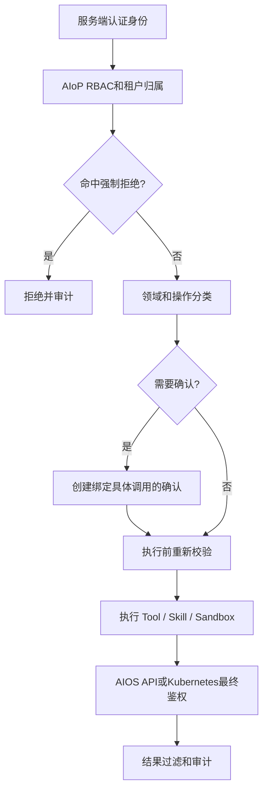
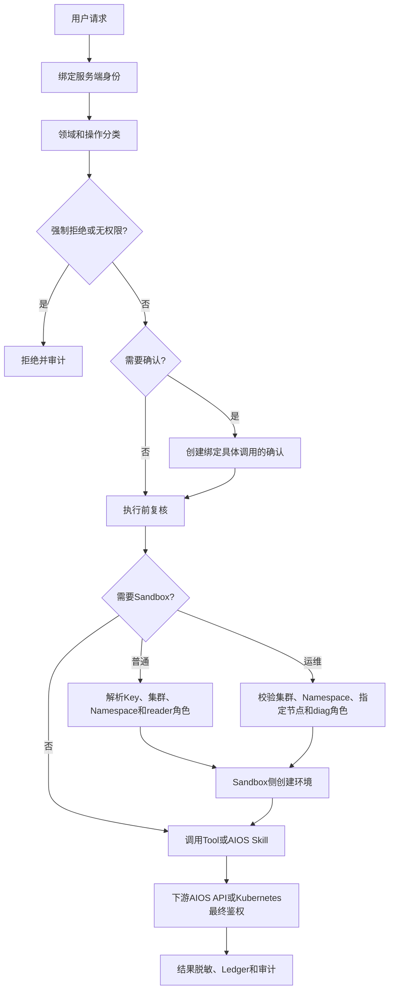

# AIoP 统一权限与任务边界设计

> 状态：目标设计
>
> 设计日期：2026-08-06
>
> 最近修订：2026-08-12
>
> 适用范围：AIoP Web/Auth/Agent Runtime/Scheduler、AIOS Skill、Sandbox Runtime 与下游 AIOS/Kubernetes
>
> 约束：本文是概要设计，不代表相关能力均已实现

## 1. 背景与目标

AIoP 用户可以通过聊天查询资源、创建任务、调用 AIOS Skill，并在 Sandbox 中运行命令。权限控制必须覆盖回答、计划、工具调用和外部副作用，不能只依赖页面菜单或模型判断。

本设计目标：

1. 所有授权绑定服务端验证的当前身份，不信任 Prompt、模型输出或客户端自报身份。
2. 区分回答、只读查询、内部写入、外部写入和高权限操作。
3. AIOS API 与 Kubernetes RBAC继续执行最终对象级鉴权。
4. 发布、删除和高权限操作在执行前完成与具体调用绑定的确认。
5. Token、Secret、私钥和跨租户数据属于不可放宽的强制拒绝项。
6. 普通 Sandbox使用最小权限；运维 Sandbox实行专门授权、指定节点和底层隔离。
7. 授权、确认、执行和结果过滤形成可审计的完整链路。

## 2. 设计原则

1. **回答权与执行权分离。** 可以回答不代表可以执行，可以生成计划不代表可以产生外部副作用。
2. **认证、授权与确认分离。** 用户确认只表达操作意愿，不能授予用户原本没有的权限。
3. **身份由运行时绑定。** `tenantId`、`userId`、角色和用户 Token 只能来自可信运行时。
4. **只读默认便利，写操作明确治理。** 授权范围内的查询直接执行，发布、删除和高权限操作需要确认。
5. **强制安全策略不可关闭。** 敏感凭据、跨租户访问、身份伪造和权限绕过始终拒绝。
6. **下游鉴权不可替代。** AIoP 放行后，AIOS API、Sandbox ServiceAccount 和 Kubernetes RBAC仍需最终鉴权。
7. **未知操作保守处理。** 无法可靠分类的操作不得按只读放行。
8. **先授权，后副作用。** 权限检查和确认必须发生在外部资源变化之前。
9. **策略变更可审计。** 策略版本、修改人、变更内容和生效时间必须记录。

## 3. 权限模型

### 3.1 可信授权上下文

每个请求、Run、Tool Call、Skill 调用和 Sandbox 创建都绑定服务端生成的上下文：

```typescript
interface AuthorizationContext {
  tenantId: string;
  userId: string;
  role: 'platform_admin' | 'tenant_admin' | 'user';
  sessionId?: string;
  runId?: string;
  policyVersion: string;
}
```

以下内容不能作为权限依据：

- 用户或模型声明的租户、用户、角色和“已批准”文字；
- 客户端提交的 ServiceAccount、RBAC、SecurityContext 或特权标志；
- Tool、Skill、MCP Server 或 Sandbox 进程返回的授权指令；
- 请求参数中用于替换当前用户身份的字段。

AIOS 集成模式使用可信 `accountId` direct identity，不依赖本地影子用户，详见 [AIOS 统一认证与会话设计](14-aios-unified-auth.md)。

### 3.2 平台角色

| 角色 | AIoP 平台范围 |
| --- | --- |
| `platform_admin` | 管理平台设置、全局权限策略和高权限 Sandbox 能力 |
| `tenant_admin` | 管理本租户范围内的用户和资源，不能放宽平台强制策略 |
| `user` | 管理本人会话、任务和资产，在下游授权范围内操作资源 |

平台角色不直接决定用户可访问的 AIOS 项目、任务或集群对象。下游权限仍由当前用户 AIOS Token 和对应 API判定。

### 3.3 判定顺序



优先级固定为：

```text
强制拒绝
  > 身份、RBAC、租户和资源归属
  > 当前策略
  > 用户确认
  > 模型计划和工具选择
```

## 4. 回答与领域边界

### 4.1 默认允许

在当前用户可访问范围内，默认允许：

- AIOS 平台功能、配置和运行状态；
- 纳管集群资源、事件、日志和健康状态；
- 推理、训练和调度任务的列表、详情与失败原因；
- 基于已授权数据的总结、解释和建议；
- AIoP 会话、Run、计划和等待交互状态。

只读不等于无数据权限。AIOS API 或 Kubernetes RBAC 返回的可见范围是 AIoP 回答内容的上限。

### 4.2 强制拒绝

以下内容不能通过普通策略、管理员角色或用户确认放行：

- 密码、验证码、Access Token、Refresh Token、API Key、Secret 和私钥；
- Kubernetes Secret 原文、ServiceAccount Token、数据库密码和云凭据；
- 其他租户、用户或未授权项目的私有数据；
- 身份伪造、认证绕过和权限提升；
- 未经明确授权的漏洞探测、利用和横向移动。

工具结果包含疑似凭据时，必须脱敏或阻断，不能直接进入模型上下文、Transcript 或下载内容。

### 4.3 默认领域

AIoP 默认处理：

1. AIOS 平台；
2. AIOS 纳管 Kubernetes 集群；
3. 与上述范围相关的推理、训练、调度、诊断和运维任务；
4. 为完成这些任务所需的 AIoP 内部计划、Run 和 Sandbox 工作。

领域外请求可以进行必要的低风险只读识别和内部计划，但默认不能产生外部写操作。平台管理员可以扩展领域范围，但不能关闭强制拒绝、租户隔离、操作确认和下游鉴权。

## 5. Tool、Skill 与定时任务

### 5.1 操作分类

| 类别 | 示例 | 默认行为 |
| --- | --- | --- |
| `read` | 列表、详情、日志和指标查询 | 直接执行，仍需下游鉴权和结果过滤 |
| `internal_write` | 创建 AIoP 计划、Run、草稿和等待交互 | 直接执行，不得产生外部业务副作用 |
| `publish` | 发布推理/训练任务、提交运行和部署 | 执行前确认 |
| `delete` | 删除任务、资源或产物 | 执行前确认 |
| `external_write` | 修改配置、扩缩容、重启和远端资源变更 | 执行前确认，可由策略拒绝 |
| `privileged` | 运维 Sandbox、节点诊断和 RBAC 变更 | 专门权限、确认和底层强制控制 |
| `unknown` | 未声明或无法可靠判断 | 默认确认，高风险时拒绝 |

操作类别由服务端 Tool/Skill Registry决定，不能由 Skill 自述或模型参数降低风险级别。

### 5.2 用户确认

确认必须绑定：

- 操作类别和 Tool 名称；
- 目标类型和目标标识；
- 关键参数摘要；
- 当前 Run、Attempt 和有效期。

目标、参数或 Tool 变化时必须重新确认。确认后仍需复核用户状态、策略和下游权限。非幂等调用结果未知时进入人工恢复，不自动重放。

### 5.3 AIOS 下游调用

- Runtime 只注入当前用户的 AIOS Token，Skill 不接受替代用户 Token。
- AIOS API对租户、项目、任务和资源归属执行最终鉴权。
- 下游返回 401 时按 Token 生命周期处理；返回 403 时直接报告权限不足。
- 不得使用平台服务账号、管理员账号或任务创建者账号绕过当前用户权限。

Token Exchange、在线续期和定时任务 Token 续期见 [AIOS 统一认证与会话设计](14-aios-unified-auth.md)。

### 5.4 定时任务

创建或修改包含外部写操作的定时任务时，需要对固化的任务定义和目标范围进行一次确认。关键参数变化时重新确认。

每次 Fire 仍需检查：

- 当前身份和策略版本；
- 任务定义和目标范围；
- 用户凭据和 AIOS 下游权限；
- Sandbox profile、目标集群和运行角色。

第一期建议禁止定时删除和 `privileged` 操作。凭据失效、策略收紧或下游返回 403 时停止执行，不能改用服务身份。

## 6. 权限策略管理

系统设置提供“权限策略”入口，第一期仅 `platform_admin` 可修改。策略包括：

- 默认领域和允许的扩展领域；
- 各操作类别的 `allow / ask / deny` 行为；
- 可用 Sandbox profiles 和运维 Sandbox 开关；
- 运维 Sandbox允许的集群、Namespace 和节点范围；
- 当前策略版本、修改历史和审计记录。

平台强制规则：

- `publish`、`delete` 和 `privileged` 不能配置为无确认执行；
- 敏感信息、跨租户访问、身份替换和服务账号绕过不可关闭；
- 未知字段或非法策略导致整次更新失败；
- 新 Tool Call 使用最新策略，等待确认的调用恢复时重新检查强制策略；
- 策略放宽不自动恢复已经拒绝或失败的调用。

## 7. Sandbox 权限设计

### 7.1 资源、位置与权限分离

Sandbox 创建由三个相互独立的维度决定：

```text
Sandbox Key       → CPU、内存和资源规格
Placement         → 目标集群、Namespace；运维 Sandbox还包括目标节点
Runtime Role      → ServiceAccount、RBAC、Pod安全和系统挂载
```

调用方不能通过 Metadata 或任意 PodSpec 覆盖 ServiceAccount、RBAC、SecurityContext、hostPath 和特权标志。

Sandbox Key分为：

| 类型 | 用途 | 位置约束 |
| --- | --- | --- |
| Resource Key | 使用目标算力集群已有资源组和规格 | 目标集群必须与 Key绑定集群一致 |
| Generic Key | 使用平台预设 CPU/内存规格 | 每次创建必须指定 `placement.clusterId` |

服务端解析 Key、Placement 和 Runtime Role 后再创建 Sandbox。任一资源、位置或权限校验失败都不能继续创建。

### 7.2 普通 Sandbox

普通 Sandbox用于当前会话中的代码、命令和文件处理，默认采用 `sandbox-reader`：

- 允许在隔离工作目录中运行常规命令和处理临时文件；
- 不允许 hostNetwork、hostPID、特权容器或任意 hostPath；
- 不读取其他用户目录、租户资产和未注入 Secret；
- Kubernetes 查询仍受目标集群 ServiceAccount 和 RBAC限制；
- 外部发布、删除和资源修改重新进入对应操作分类。

普通 Sandbox 不要求指定节点，由 Sandbox 调度器按资源和集群策略选择节点。

### 7.3 运维 Sandbox

运维 Sandbox对应 `sandbox-diag`，用于节点网络、CNI、OVS、iptables、抓包和宿主级诊断。该能力风险高于普通 Sandbox，必须同时满足：

1. 平台已启用运维 Sandbox；
2. 当前用户具有专门权限，第一期仅 `platform_admin`；
3. 每次启动前完成与诊断目的和目标绑定的确认；
4. **明确指定目标集群、Namespace(默认aios-system)和目标节点；**
5. 目标集群、Namespace和节点在管理员允许范围内；
6. 专用 ServiceAccount、RBAC、Pod安全和审计准备成功；
7. 使用独立控制面或等价的硬隔离，不能与普通 Sandbox共享高权限模板边界。

目标 Placement 至少包含：

```typescript
interface OpsSandboxPlacement {
  clusterId: string;
  namespace: string;
  nodeName: string;
}
```

`nodeName` 为运维 Sandbox必填字段。缺失、节点不存在、节点不属于目标集群或不在允许范围时，拒绝创建。AIoP 不自动选择“任意可用节点”，避免诊断任务落到错误节点。

> **跨系统依赖：** 指定节点创建运维 Sandbox需要 aios-sandbox 侧配合开发。Sandbox API、Placement 模型、Provider 和实际 Pod调度链路必须支持并强制校验目标节点。AIoP 只能传递经过授权的 `nodeName`，不能仅靠前端字段或普通 metadata 保证落点。在 Sandbox 侧能力完成并通过联调前，运维 Sandbox节点指定视为未实现，生产环境不得开放该能力。

运维 Sandbox禁止暖池，必须按目标节点冷启动。节点、集群、Namespace、诊断目的、确认人和生命周期都需要审计。

### 7.4 底层安全边界

运维 Sandbox可以按固定模板启用诊断所需的 `privileged`、`hostNetwork`、`hostPID` 和受控系统挂载，但必须满足：

- 只允许内置、审核过的模板和挂载路径；
- 能使用 Namespace级权限时不得扩大到集群级；
- 集群级 RBAC修复通过独立受控代理或再次授权；
- 业务挂载不能覆盖角色强制挂载；
- Pod Security、RBAC 或挂载准备失败时不创建 Sandbox；
- 用户确认不能把普通 Sandbox临时升级为运维 Sandbox。

## 8. 端到端执行流程



## 9. 错误处理

| 场景 | 行为 |
| --- | --- |
| 身份无效 | 返回 401，停止执行 |
| 平台或租户权限不足 | 返回 403；不可见资源可按接口策略返回 404 |
| 请求敏感凭据或未经授权的攻击操作 | 拒绝，不调用相关工具 |
| 发布、删除或高权限操作未确认 | 进入等待状态，不执行副作用 |
| 确认目标或参数不一致 | 拒绝恢复并重新确认 |
| AIOS API返回 403 | 报告权限不足，不绕过 |
| Tool操作类别未知 | 默认确认，高风险时拒绝 |
| Sandbox Key和目标集群不匹配 | 拒绝创建 |
| 运维 Sandbox未指定节点 | 返回 `target_node_required`，不创建 Sandbox |
| 指定节点不存在或不允许 | 返回目标节点错误，不自动改选其他节点 |
| Sandbox侧尚不支持指定节点 | 明确返回能力不可用，生产环境不降级为随机调度 |
| 运维 Sandbox未授权或未确认 | 拒绝创建 |
| RBAC、Pod安全或挂载准备失败 | 不创建 Sandbox |
| 结果包含疑似 Secret | 脱敏或阻断，不进入模型上下文 |

所有安全相关异常均 fail closed。服务暂时不可用时可以返回可重试错误，但不能扩大数据范围、切换身份或跳过鉴权。

## 10. 审计与可观测性

必须审计：

- 策略创建、更新、回滚和加载失败；
- 强制拒绝、领域拒绝、RBAC拒绝和下游 403；
- 发布、删除、外部写和高权限操作的确认结果；
- AIOS Skill调用的操作类别、目标摘要和结果；
- Sandbox Key、目标集群、Namespace、Runtime Role和创建结果；
- 运维 Sandbox的目标节点、诊断目的、确认人和生命周期；
- Token取得、续期、失效和清除事件，但不记录原始 Token；
- 结果过滤发现并阻断敏感信息的事件。

指标至少包括：

- 各操作类别的允许、确认和拒绝数量；
- AIOS API 401/403 和 Token续期失败数；
- 确认的等待、批准、拒绝和过期数量；
- 普通/运维 Sandbox创建数和失败原因；
- 运维 Sandbox节点指定失败和 Sandbox侧能力不可用次数；
- 策略版本分布和策略加载失败数。

审计失败不能把拒绝变成放行。发布、删除和高权限操作的确认与执行事实必须进入 Durable Ledger。

## 11. 安全威胁与控制

| 威胁 | 控制 |
| --- | --- |
| Prompt要求忽略权限 | 身份和策略由 Runtime绑定，Prompt不参与授权优先级 |
| 模型伪造用户、租户或角色 | 忽略参数中的身份字段，使用服务端上下文 |
| 通过只读查询读取 Secret | 强制敏感信息分类、字段限制和结果过滤 |
| MCP或自定义 Skill绕过领域限制 | 外部执行前统一重新分类和授权 |
| 一次确认复用于其他操作 | 绑定 Tool、目标、参数摘要、Run和有效期 |
| AIoP使用服务账号绕过 AIOS 403 | 强制使用当前用户 Token，403不降级 |
| 普通 Sandbox请求特权参数 | 服务端禁止透传 PodSpec、SA、RBAC、hostPath和privileged |
| 运维 Sandbox落到错误节点 | `nodeName`必填，AIoP与Sandbox两侧共同校验并审计 |
| 运维 Sandbox被普通用户使用 | 专门权限、策略开关、确认、隔离控制面、RBAC和Pod安全复核 |
| 日志或Transcript泄露Token | Token不进入模型参数，统一日志和结果脱敏 |

## 12. 验收要点

1. Tool参数、Prompt或模型输出不能替换服务端身份。
2. 只读查询在下游授权范围内直接执行，发布和删除必须确认。
3. 敏感凭据、跨租户数据和未经授权的攻击操作始终拒绝。
4. AIOS API返回 403 时不使用服务账号重试。
5. 普通 Sandbox不能获得运维角色、特权参数和任意宿主挂载。
6. 运维 Sandbox必须同时指定目标集群、Namespace和节点。
7. 缺少或非法目标节点时，不创建 Sandbox且不自动选择其他节点。
8. Sandbox侧未完成指定节点能力前，生产环境不能开放运维 Sandbox。
9. 运维 Sandbox的节点、目的、确认和生命周期可完整审计。
10. 授权、确认、下游鉴权和结果过滤任一失败都不会产生外部副作用。

## 13. 相关设计

- [Tool、Skill 与 MCP 设计](04-tools-skills-mcp.md)
- [Sandbox 与运维设计](05-sandbox-and-ops.md)
- [认证、安全与多租户设计](06-auth-security-tenancy.md)
- [AIOS 统一认证与会话设计](14-aios-unified-auth.md)

本文是 AIoP 权限概要设计。子系统详细设计不得放宽本文定义的身份绑定、强制拒绝、用户确认、运维 Sandbox节点指定和下游最终鉴权原则。
