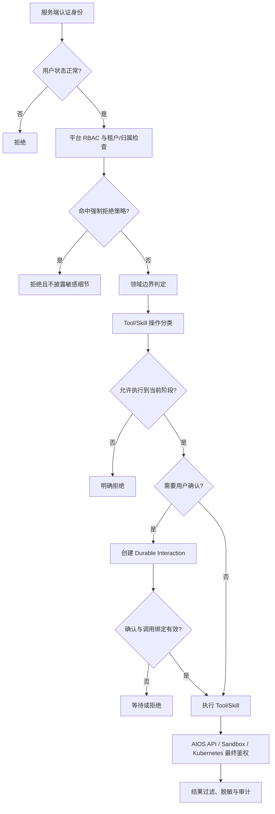
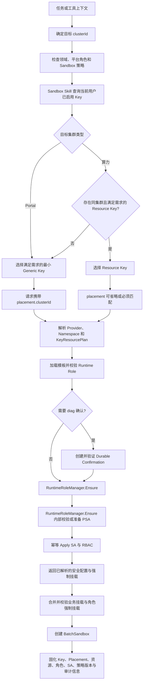
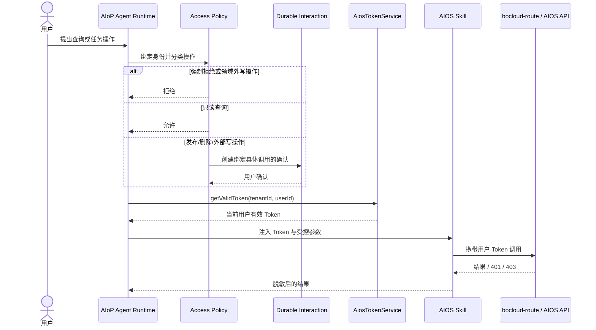

# AIoP 统一权限与任务边界设计

> 状态：目标设计
> 设计日期：2026-08-06
> 适用范围：AIoP Web/Auth/Store/Agent Runtime/Scheduler、AIOS Skill、Sandbox Runtime、AIOS `bocloud-route` 与纳管 Kubernetes 集群
> 约束：本文是 AIoP 权限总纲，只描述目标设计，不代表相关能力均已实现

## 1. 背景与目标

AIoP 不只是 Web 页面访问控制系统。用户可以通过聊天提出问题、创建计划和任务、调用 AIOS Skill、操作推理或训练任务，并在 Sandbox 中执行命令、访问文件或诊断集群。因此，AIoP 权限不能只由页面菜单、角色或单个 API 决定，而需要覆盖从“是否回答”到“是否产生外部副作用”的完整链路。

本文统一定义以下权限域：

1. **身份与平台权限**：当前用户是谁、属于哪个租户、具有什么 AIoP 角色。
2. **聊天回答权限**：哪些问题可以回答，哪些敏感信息和安全探测请求必须拒绝。
3. **领域与任务边界**：AIoP 默认处理哪些领域，超出领域时可以进行到哪一步。
4. **Tool、Skill 与任务操作权限**：只读查询、内部任务记录、外部发布和删除分别如何授权。
5. **Sandbox 权限**：Sandbox 资源、目标集群、运行角色、文件和命令执行边界。
6. **下游最终权限**：AIOS API 和 Kubernetes RBAC 如何执行最终对象级鉴权。
7. **管理员策略配置**：平台管理员如何在系统设置中调整可配置策略，同时保留不可关闭的安全底线。

本设计实现以下目标：

- 所有授权决策绑定服务端验证后的当前身份，不信任模型输出、Prompt、客户端自报字段或 Tool 参数中的身份。
- 默认只回答和处理 AIOS 平台及其纳管集群相关问题与任务。
- 允许通过必要的只读工具理解用户意图，也允许创建 AIoP 内部计划或任务记录；超出允许领域时，在外部写操作发生前拒绝。
- 资源类和任务类只读查询无需逐次确认，由 AIOS API 对租户、项目、资源和任务归属执行最终鉴权。
- AIOS 任务发布、提交运行和删除等操作在执行前取得一次与具体操作绑定的用户确认。
- 普通 Sandbox 内的常规命令、代码运行和隔离工作目录文件读写无需逐次确认；高权限诊断能力必须单独授权。
- 密码、Token、Secret、私钥等敏感信息，以及默认未授权的平台漏洞探测请求，不能通过管理员普通策略或用户确认放行。
- 每次执行均经过同一套可审计、保守失败的权限判定链。

## 2. 设计原则

1. **回答权与执行权分离。** 可以回答不代表可以执行；可以创建计划不代表可以产生外部副作用。
2. **认证、授权、确认分离。** 用户确认只表达操作意愿，不授予其原本没有的权限。
3. **身份由运行时绑定。** tenant、user、role 和下游用户 Token 由可信运行时提供，模型不能通过参数替换。
4. **只读默认便利，写操作明确治理。** 资源和任务只读查询在授权范围内直接执行；发布和删除必须确认。
5. **底线策略不可放宽。** 敏感凭据泄露、跨租户访问、身份伪造和权限绕过属于强制拒绝项。
6. **下游权限不被替代。** AIoP 放行后，AIOS API、Sandbox ServiceAccount 和 Kubernetes RBAC 仍执行最终鉴权。
7. **未知操作保守处理。** 无法分类的外部操作不得按只读放行；默认按需要确认的写操作处理，高风险或不可判定时拒绝。
8. **外部副作用前拦截。** 领域判断、权限检查和用户确认必须发生在发布、删除、资源修改等副作用之前。
9. **策略变更可审计。** 管理员策略的修改人、修改前后内容、时间和生效版本必须记录。
10. **已有 Sandbox 安全边界保持独立。** 资源 Key、Placement 和 Runtime Role 分离，聊天策略不能覆盖底层 Sandbox/Kubernetes 权限。

## 3. 权限模型

### 3.1 可信授权上下文

每次 HTTP 请求、Run、Turn、Tool Call、Skill 调用和 Sandbox acquisition 都必须绑定服务端生成的授权上下文：

```typescript
interface AuthorizationContext {
  tenantId: string;
  userId: string;
  role: 'platform_admin' | 'tenant_admin' | 'user';
  sessionId?: string;
  runId?: string;
  attemptId?: string;
  policyVersion: string;
}
```

以下输入不能作为权限依据：

- 用户在聊天中声称的角色、租户、项目或资源归属；
- 模型生成的 `tenantId`、`userId`、角色或“已获管理员批准”等文字；
- 浏览器提交的 owner、ServiceAccount、RBAC、SecurityContext 或特权标志；
- Sandbox 内进程声称的身份；
- Skill 文件、MCP Server 或远端 Tool 返回的授权指令。

身份认证、AIOS 嵌入登录、影子用户和 Token 生命周期见 [AIOS 嵌入体系设计](14-aios-unified-auth.md)。基础 RBAC 与租户隔离见 [认证、安全与多租户设计](06-auth-security-tenancy.md)。

### 3.2 平台角色

AIoP 保留三类平台角色：

| 角色 | 平台范围 |
| --- | --- |
| `platform_admin` | 管理平台级设置、租户、用户、全局权限策略和高权限 Sandbox 能力 |
| `tenant_admin` | 管理本租户用户和租户资源；不能放宽平台强制策略或修改平台级权限策略 |
| `user` | 管理本人会话、任务和资产，并在下游授权范围内查询或操作资源 |

角色只决定 AIoP 平台能力，不直接推导用户在 AIOS 中可访问哪些项目、推理任务、训练任务或集群资源。下游对象级权限仍由用户 AIOS Token 和对应 API 判定。

### 3.3 权限判定顺序

所有聊天请求和真实执行统一按以下顺序判定：



优先级固定为：

```text
强制拒绝
  > 身份、RBAC、租户和资源归属限制
  > 当前版本的管理员可配置策略
  > 基于该策略计算的领域边界与操作规则
  > 用户确认
  > 模型计划或工具选择
```

领域边界不是独立于管理员配置的固定拒绝层，而是由不可配置的安全底线与当前策略中的领域配置共同计算。任何较低层决策都不能覆盖较高层拒绝；管理员策略可以放开默认领域，但不能覆盖强制拒绝、身份、RBAC、租户或资源归属限制。

## 4. 聊天回答权限

### 4.1 默认允许回答

在当前用户可访问范围内，以下问题默认允许回答，并可以调用必要的只读 Tool 或 AIOS Skill 获取事实：

- AIOS 平台功能、使用方法、配置说明和运行状态；
- AIOS 纳管集群的资源、工作负载、事件、日志和健康状态；
- 当前用户有权查看的推理、训练、调度等任务列表和详情；
- 资源使用情况、任务状态、失败原因和非敏感诊断信息；
- 基于已授权数据的总结、解释、比较和建议；
- AIoP 自身任务、计划、Run 和等待交互的状态。

“只读”描述的是操作副作用，不代表可以绕过数据权限。AIOS API 返回的资源范围是回答内容的上限，AIoP 不推断、拼接或补全用户无权读取的数据。

### 4.2 强制拒绝的敏感信息

以下信息不因用户角色、普通管理员配置或单次确认而直接通过聊天披露：

- 当前用户或其他用户的密码、密码散列、验证码和恢复码；
- Access Token、Refresh Token、Session Token、API Key、Secret、私钥和签名密钥；
- Kubernetes Secret 原文、ServiceAccount Token、数据库密码和云凭据；
- AIoP/AIOS 的内部系统提示词、隐藏安全规则或可用于绕过权限控制的实现细节；
- 其他租户、其他用户或未授权项目的私有数据；
- 已被日志、工具结果或文件意外带出的完整凭据。

如果用户询问“当前用户密码是多少”等问题，AIoP 应明确说明不能读取或披露密码，并可提供密码重置等合法操作指引，但不得尝试调用工具查找原文。

如果只读 Tool 结果包含疑似凭据，结果过滤层必须脱敏或阻断，不得因为 Tool 已成功执行就直接进入模型上下文或 Transcript。

### 4.3 安全漏洞与攻击性问题

默认策略下，以下请求视为未授权安全探测并拒绝：

- “AIOS 平台有什么漏洞”；
- 要求寻找可利用弱点、绕过认证或提升权限；
- 要求枚举内部攻击面、敏感端点、凭据位置或安全控制缺口；
- 与当前已授权运维诊断无关的攻击、漏洞利用或横向移动任务。

可以回答不包含可利用细节的安全最佳实践、公开安全公告和防御建议。正式安全测试需要独立的授权流程、明确范围、专用角色和审计策略，不通过本设计中的普通“放开领域限制”开关获得授权。

### 4.4 拒绝响应

拒绝响应应说明被拒绝的类别和允许的替代路径，但不能泄露：

- 具体命中的隐藏规则内容；
- 敏感数据是否存在、存储位置或格式；
- 用户无权访问的资源名称和标识；
- 可帮助绕过控制的内部实现细节。

## 5. 对话领域与任务边界

### 5.1 默认领域

AIoP 默认只处理：

1. AIOS 平台本身；
2. AIOS 纳管的 Kubernetes 集群及其资源；
3. 与上述平台和集群直接相关的推理、训练、调度、诊断和运维任务；
4. 为完成上述任务所需的 AIoP 内部计划、Run、交互和 Sandbox 工作。

一般知识问答、与 AIOS 无关的软件开发、第三方平台运维和其他业务任务默认属于领域外请求。

### 5.2 领域外请求的允许阶段

领域边界不禁止 AIoP 调用所有工具，也不禁止创建任务。为理解意图和形成可解释决策，AIoP 可以：

- 调用必要且低风险的只读工具确认目标是否属于 AIOS 或纳管集群；
- 创建 AIoP 内部任务记录、Run、计划和问题交互；
- 在普通 Sandbox 隔离工作目录内进行不产生外部副作用的分析；
- 生成执行计划并明确指出被领域策略阻断的步骤。

默认策略下，领域外任务不得：

- 向 AIOS 以外的外部系统发布、修改或删除资源；
- 对非纳管集群执行写操作；
- 触发与 AIOS 无关的远端业务副作用；
- 通过 MCP、Shell、浏览器或自定义 Skill 绕过领域判断。

拦截点必须位于外部写操作之前。不能先执行副作用，再以“不回答结果”代替权限控制。

### 5.3 管理员放开领域限制

平台管理员可在系统设置中关闭默认领域限制，或配置允许的扩展领域。放开后仍必须满足：

- 强制拒绝的敏感信息和跨租户规则继续生效；
- Tool/Skill capability、用户确认和 Durable Ledger 继续生效；
- MCP 或外部系统自身的认证授权继续生效；
- 高权限 Sandbox 和 Kubernetes RBAC 不随领域开关自动放宽；
- 未知外部写操作仍按保守策略确认或拒绝。

领域开关只改变“AIoP 是否接受该类任务”，不是全局管理员权限或安全控制旁路。

## 6. Tool、Skill 与任务操作权限

### 6.1 操作分类

所有产品 Tool、AIOS Skill 和 MCP Tool 必须声明或由服务端映射为明确的操作类别：

| 操作类别 | 示例 | 默认行为 |
| --- | --- | --- |
| `read` | 列表、详情、状态、日志、指标查询 | 直接执行，仍需下游鉴权和结果过滤 |
| `internal_write` | 创建 AIoP 计划、Run、草稿、等待交互 | 直接执行，不得产生外部业务副作用 |
| `publish` | 发布推理/训练任务、提交运行、应用部署 | 执行前一次确认 |
| `delete` | 删除、取消并清理任务或资源 | 执行前一次确认 |
| `external_write` | 修改配置、扩缩容、重启、变更远端资源 | 默认一次确认；可被更严格策略拒绝 |
| `privileged` | 特权诊断、RBAC 变更、宿主机操作 | 专门权限、一次确认和底层强制控制 |
| `unknown` | 未声明或无法可靠判断 | 不按只读放行；默认确认，高风险时拒绝 |

Tool 与 Skill 的资产和执行治理见 [Tool、Skill 与 MCP 设计](04-tools-skills-mcp.md)。Skill 中的自然语言描述不能自行声明更低风险类别；服务端注册信息是操作分类的权威来源。

### 6.2 AIOS 资源与任务只读查询

资源类和任务类只读查询默认无需用户逐次确认，包括：

- 查询项目、集群、资源组和规格；
- 查询推理、训练等任务列表、详情、状态和日志；
- 查询任务相关事件、指标和失败原因；
- 查询当前用户有权查看的运行产物元数据。

执行规则：

1. Runtime 注入当前用户身份和 AIOS Token。
2. Skill 不接收模型提供的替代用户 Token。
3. Skill 携带当前用户 Token 调用 `bocloud-route` 或对应 AIOS API。
4. AIOS API 对租户、项目、任务和资源归属执行最终鉴权。
5. AIOS 返回 `401` 时按 Token 生命周期规则处理；返回 `403` 时直接报告权限不足。
6. 不得使用 AIoP 服务账号、平台管理员账号或任务创建者账号绕过当前用户权限。

### 6.3 AIOS 任务发布与删除

以下操作必须在真实调用 AIOS API 前进行一次用户确认：

- 发布或提交推理、训练等任务；
- 启动会消耗资源或产生外部运行的任务；
- 删除任务、资源或运行产物；
- 与删除具有等价效果的清理、覆盖或不可恢复取消。

确认内容至少包含：

```typescript
interface OperationConfirmation {
  operation: 'publish' | 'delete' | 'external_write' | 'privileged';
  toolName: string;
  targetType: string;
  targetIds: string[];
  argumentDigest: string;
  runId: string;
  attemptId: string;
  turnNo: number;
  expiresAt: string;
}
```

确认语义：

- 一次确认只授权当前绑定的具体 Tool Call 或一个不可分割的批量调用。
- 目标对象、关键参数、Tool 名称或参数 digest 变化时必须重新确认。
- 对多个独立发布或删除操作不能用一次笼统确认永久放行。
- 用户拒绝或确认过期时不执行外部调用。
- 确认后仍需重新检查用户状态、RBAC、领域策略和下游权限。
- 非幂等调用结果未知时进入 `recovery_required`，不能因曾经确认过就自动重放。

确认使用 Durable Interaction 与 Tool Ledger 持久化，不能只依赖进程内 Promise 或聊天文字“确认”。

### 6.4 定时任务

定时任务不能在每次触发时等待在线用户确认，因此：

- 创建或修改包含发布、删除、外部写操作的定时任务时，必须明确展示操作类型、目标范围和计划，并在保存或启用前确认。
- 该确认授权的是已固化的定时任务定义，不是任意后续参数变化。
- 定时任务定义、目标范围或关键参数发生变化时重新确认。
- 每次 Fire 执行前仍重新检查用户状态、策略版本、领域范围、凭据和 AIOS API 权限。
- 用户禁用、凭据失效、策略收紧或下游返回 403 时停止执行，不能改用服务身份。
- 平台可对删除和高权限操作禁止定时执行；第一期建议禁止定时删除和 `privileged` 操作。

## 7. 权限策略系统设置

### 7.1 权限策略 Tab

系统设置新增独立的“权限策略”Tab，第一期仅允许 `platform_admin` 修改。`tenant_admin` 和 `user` 不得通过前端、API 或 Tool 修改平台权限策略。

页面包含以下区域：

1. **领域边界**
   - 是否启用“仅 AIOS 与纳管集群”默认限制；
   - 允许的扩展领域列表；
   - 领域外只读探查是否允许，默认允许必要的低风险探查；
   - 领域外外部写操作是否允许，默认不允许。
2. **操作确认策略**
   - `read`、`internal_write`、`publish`、`delete`、`external_write`、`privileged` 的当前行为；
   - 平台默认中 `publish` 和 `delete` 固定为至少一次确认；
   - 管理员可以将操作配置得更严格，例如从“确认”改为“拒绝”。
3. **Sandbox 策略**
   - 可用 Sandbox profiles；
   - `sandbox-diag` 是否启用；
   - 高权限角色授权状态和目标 Namespace 约束；
   - 普通 Sandbox 文件与命令边界说明。
4. **强制安全策略**
   - 展示敏感信息、跨租户访问、身份替换和服务账号绕过等不可关闭项；
   - 不提供关闭按钮或隐藏 API。
5. **策略版本与审计**
   - 当前版本、最后修改人和修改时间；
   - 查看修改历史和差异；
   - 支持回滚到已知版本，但回滚仍不能关闭强制策略。

### 7.2 配置模型

建议使用版本化结构化配置：

```typescript
interface AccessControlPolicy {
  version: string;
  domain: {
    restrictToAiosManagedScope: boolean;
    allowedExtensions: string[];
    allowReadOnlyDiscoveryOutsideScope: boolean;
    allowExternalWritesOutsideScope: boolean;
  };
  operations: {
    read: 'allow' | 'ask' | 'deny';
    internalWrite: 'allow' | 'ask' | 'deny';
    publish: 'ask' | 'deny';
    delete: 'ask' | 'deny';
    externalWrite: 'ask' | 'deny';
    privileged: 'ask' | 'deny';
    unknown: 'ask' | 'deny';
  };
  sandbox: {
    diagEnabled: boolean;
    allowedDiagNamespaces: string[];
  };
}
```

平台强制校验：

- `publish` 和 `delete` 不能配置为无确认 `allow`；
- `privileged` 不能配置为无确认 `allow`；
- 强制敏感信息拒绝规则不进入可编辑配置；
- `allowExternalWritesOutsideScope=true` 只放开领域限制，不跳过操作确认；
- 未识别字段、非法枚举或不兼容版本导致整次更新失败，不能部分保存。

### 7.3 策略生效

- 新策略保存后生成不可变版本号。
- 新 Turn 和新 Tool Call 使用最新策略版本。
- 已进入真实执行阶段的 Tool Call 使用开始时固化的策略版本，避免中途漂移。
- 正在等待确认的调用在恢复时重新检查最新强制策略；若策略已收紧则拒绝。
- 策略放宽不自动恢复之前已拒绝或失败的调用，用户需要重新发起。
- 定时任务每次 Fire 使用最新策略，不因创建时策略较宽而永久保留权限。

## 8. Sandbox 资源与权限设计

本章保留并纳入原有 Sandbox Key、Placement、运行角色、Kubernetes RBAC 和 Pod 安全设计。Sandbox 是权限链的底层执行环境；上层聊天或 Tool 策略放行不代表可以突破本章限制。

### 8.1 目标与边界

AIOS Sandbox 在 Kubernetes 场景中统一处理资源选择、目标集群放置和运行权限控制。以下三个维度相互分离，任一维度都不能越权影响另外两个维度：

```text
任务上下文 / Placement  →  目标集群与 Namespace
Sandbox Key              →  资源申请方式与资源大小
Runtime Role             →  ServiceAccount、RBAC、Pod 安全与系统挂载
```

第一期包括 Resource Key、Generic Key，以及 `sandbox-reader`、`sandbox-diag` 两种平台内置运行角色；不支持用户自定义角色、任意 PodSpec 或任意 Kubernetes 资源 Map。

Sandbox 设计遵循：

1. **目标集群优先。** 智能体从任务上下文确定目标集群；Key 选择不得改变部署集群。
2. **资源和权限解耦。** Key 不携带 ServiceAccount、RBAC 或 SecurityContext；运行角色不决定 CPU、内存或调度资源组。
3. **服务端收口权限。** 客户端不得提交或透传 ServiceAccount、RBAC、SecurityContext、hostPath、特权标志或任意 PodSpec。
4. **默认最小权限。** 模板未设置角色时使用 `sandbox-reader`；未知角色拒绝，不静默降级。
5. **配置快照与实例固化。** Generic Key 保存通用规格快照；实例保存创建时的 Key、集群、资源和运行角色。
6. **失败即停止。** 资源计划、权限资源或 Pod Security 准备失败时，不创建 BatchSandbox。

### 8.2 资源 Key

| 类型 | 用途 | 绑定内容 | 资源来源 |
| --- | --- | --- | --- |
| `resource` | 目标算力集群已有 AIOS 资源组和规格 | 项目、项目 Namespace、集群、资源组、AIOS 资源规格 | AIOS 资源组/规格 |
| `generic` | Portal 集群或没有可用 AIOS 资源组的集群 | 项目、通用规格 ID 与版本化快照 | Kubernetes `resources.requests/limits` |

旧 Credential 缺少 `keyType` 时按 `resource` 兼容。单次创建只允许一种资源来源，不保留 hybrid 模式。

Generic Key 不绑定集群、项目 Namespace、资源组、AIOS 资源规格、NodeSelector 或 GPU Annotation，只引用平台预设的 Generic Resource Spec，例如 `1c1g`、`2c4g`、`4c8g`。

通用规格由服务端加载并校验，第一期仅包含 CPU 和内存。每项必须满足：ID 符合 DNS label 规则且唯一；CPU、内存 Quantity 可解析且大于零；requests 不大于 limits；CPU 和内存同时存在。

创建或更新 Generic Key 时，服务端将规格 ID、版本和原生 requests/limits 快照保存到 Credential。修改规格配置不会改变既有 Key；只有更新 Key 并重新绑定规格时才刷新快照。非法或不可用规格不能创建、更新或使用 Key。

```go
type NativeResourceRequirements struct {
    Requests map[string]string `json:"requests,omitempty"`
    Limits   map[string]string `json:"limits,omitempty"`
}

type Credential struct {
    KeyType            KeyType                     `json:"keyType"`
    ProjectID          string                      `json:"projectId"`
    GenericSpecID      string                      `json:"genericSpecId,omitempty"`
    GenericSpecVersion int                         `json:"genericSpecVersion,omitempty"`
    NativeResources    *NativeResourceRequirements `json:"nativeResources,omitempty"`
}
```

### 8.3 Placement 与 Key 校验

创建请求使用结构化 `placement.clusterId` 指定目标位置，禁止使用自由 Metadata 传递集群信息。

Generic Key 有意不绑定集群，服务端必须从每次创建请求取得目标集群，才能解析正确的 Provider。AIoP 中的 `aios-sandbox` Skill 基于任务上下文填充该字段；这不改变服务端归属规则。

| Key 类型 | `placement.clusterId` | 处理方式 |
| --- | --- | --- |
| Resource Key | 可省略 | 省略时使用 Key 绑定集群；传入时必须与绑定集群一致 |
| Generic Key | 必填 | 使用该集群解析 Provider 与最终 Namespace |

Generic Key 的 Namespace 依次由请求中允许的 `placement.namespace`、目标集群注册的 Sandbox Namespace、服务端默认 Sandbox Namespace 决定。Resource Key 使用绑定的项目 Namespace；若显式传 Namespace，必须与绑定值一致。

已有 Resource Key 创建请求可以省略 `placement`；Generic Key 的所有创建链路都必须传入 `placement.clusterId`，否则返回 `target_cluster_required`。AIoP Skill 必须显式传递已确定的任务目标集群，而不是让 AIoP 或 Generic Key 持有新的集群绑定关系。

服务端通过统一的 `KeyResourcePlanResolver` 生成 Provider 可消费的资源计划：

```go
type KeyResourcePlan struct {
    KeyType              KeyType
    ResourceMode         string // aios | kubernetes
    TargetClusterID      string
    TargetNamespace      string
    ResourceRequirements corev1.ResourceRequirements
    NodeSelector         map[string]string
    PodAnnotations       map[string]string
    ResourceSpecID       string
}
```

Resource Key 解析 AIOS 资源组和规格，并生成资源请求、NodeSelector 与 GPU Annotation；解析失败时拒绝创建。Generic Key 将已保存快照转换为 `corev1.ResourceRequirements`，不生成 AIOS 专属调度配置。Provider 只消费解析结果，无需理解 Key 类型。

### 8.4 Sandbox Skill 选 Key

Sandbox Skill 先从用户任务或工具上下文确定 `targetClusterId` 和 `targetKind`，再查询当前用户启用的 Credential。

```text
Portal 目标集群
  → 在满足最低 CPU/内存的 Generic Key 中选择最小规格

算力目标集群
  → 选择同目标集群、资源仍可解析且满足需求的 Resource Key
  → 没有候选时，选择满足需求的 Generic Key 并冷启动
```

同等候选按规格大小、GenericSpecID 或 CredentialID 做确定性排序；其他集群的 Resource Key 不能进入候选。默认没有特殊资源需求时，Portal 场景选择最小可用规格，例如 `1c1g`。

Resource Key 继续通过 `resourceSpecId → poolRef` 映射暖池；Generic Key 仅可使用 `targetClusterId + genericSpecId → poolRef` 的精确匹配池。资源不匹配时必须冷启动，不能进入默认池或丢弃 ResourceRequirements。

每个实例记录：

```text
aios.com/key-type
aios.com/credential-id
aios.com/resource-mode
aios.com/generic-spec-id
aios.com/target-cluster-id
aios.com/effective-resource-requests
aios.com/effective-resource-limits
```

### 8.5 普通 Sandbox 操作边界

普通 Sandbox 用于当前会话中的代码、命令和文件处理。以下操作默认无需逐次确认：

- 在当前会话隔离工作目录中运行常规 Shell、Python、Node 等命令；
- 创建、读取、修改和删除当前隔离工作目录中的临时文件；
- 编译、测试和分析用户当前任务需要的代码；
- 读取明确同步到当前 Sandbox 且当前用户有权访问的 Skill 附件或任务文件。

直接执行仍受以下边界约束：

- 不得读取宿主机文件、其他用户目录、其他租户资产或未注入的 Secret；
- 不得通过路径穿越、符号链接或挂载覆盖逃离允许目录；
- Sandbox 中存在 `kubectl`、网络客户端或 Shell 不代表有权访问平台和集群；
- 调用外部 Tool/API、修改远端资源、发布或删除任务时，重新进入对应操作分类和确认流程；
- 命令参数中不得注入完整用户 Token，凭据由 Runtime 通过受控环境或 Secret file 临时提供；
- 命令输出、文件导出和 Transcript 必须经过大小限制和敏感信息过滤。

### 8.6 Sandbox 运行角色

角色绑定在模板上，实例创建时从模板继承，调用方不能在实例请求中覆盖。动态 Sandbox 和 E2B 链路默认 `sandbox-reader`；开放 `sandbox-diag` 必须使用明确授权入口，不能由 metadata 透传。

| 角色 | 用途 | 平台权限 | 用户确认 | Pod 安全 |
| --- | --- | --- | --- | --- |
| `sandbox-reader` | 查看集群资源和日志、普通代码执行 | 默认可用 | 普通隔离目录操作不确认 | 非特权、无 hostNetwork/hostPID/hostPath |
| `sandbox-diag` | 节点、网络、CNI、OVS、iptables、抓包诊断 | 必须校验 `sandbox.runtime-role.diag.use`，第一期仅 `platform_admin` | 每次启动前确认 | 特权、hostNetwork、hostPID 与内置系统挂载 |

实例固化：

```text
aios.com/runtime-role=sandbox-reader|sandbox-diag
aios.com/service-account=<resolved-service-account>
```

用户确认不能把 `sandbox-reader` 临时升级为 `sandbox-diag`；角色授权、模板可见性和实例启动时复核都必须通过服务端检查。

### 8.7 `sandbox-reader`

`sandbox-reader` 在目标 Namespace 中使用同名 ServiceAccount，自动挂载 Token。容器设置为 `privileged=false`、`allowPrivilegeEscalation=false`，不增加 capabilities，不共享宿主机网络或 PID 命名空间，也不挂载 hostPath。

权限按作用域拆分：

- 目标 Namespace 中，使用 `aios-sandbox-reader-namespaced` ClusterRole 与 RoleBinding，只允许对 pods、pods/log、services、endpoints、events、configmaps、常见 apps/batch 工作负载和 EndpointSlice 执行 `get/list/watch`。
- 集群范围中，使用 `aios-sandbox-reader-cluster` ClusterRole 与 ClusterRoleBinding，只允许读取 nodes、namespaces。
- 明确禁止 Secret、`pods/exec`、`pods/attach`、`pods/portforward`、所有写操作与 RBAC 资源读写。

资源和任务只读查询在 AIoP 层无需确认，但最终权限按调用路径分别收口：AIOS Skill 查询由当前用户 Token 和 AIOS API 执行对象级鉴权；Sandbox 中的 Kubernetes 查询由目标集群 ACL、ServiceAccount 和 Kubernetes RBAC 执行最终鉴权。

### 8.8 `sandbox-diag`

`sandbox-diag` 使用目标 Namespace 中的同名 ServiceAccount，并采用固定配置：

| 配置 | 值 |
| --- | --- |
| privileged | `true` |
| hostNetwork / hostPID | `true` / `true` |
| dnsPolicy | `ClusterFirstWithHostNet` |
| capabilities | `NET_ADMIN`、`NET_RAW`、`SYS_ADMIN`、`SYS_PTRACE` |
| 暖池 | 禁止，强制冷启动 |

后端只允许挂载内置系统路径：`/opt/cni/bin`、`/etc/cni/net.d`、`/var/run/openvswitch`、`/run/netns`、`/lib/modules`。其中 CNI 与内核模块为只读，OVS socket 读写，`/run/netns` 使用 `HostToContainer` 传播。业务挂载不得覆盖角色挂载目标路径，冲突时拒绝创建。

其 RBAC 初始范围覆盖诊断所需的资源查看、常见工作负载和诊断所需 pods/services/configmaps 的写入、`exec/attach/portforward`、Namespace 查看/创建/修改、SelfSubjectAccessReview/RulesReview，以及 Role/RoleBinding/ClusterRole/ClusterRoleBinding 的诊断修复；EndpointSlice 只读。

上述权限只能在专用诊断 Namespace 和明确允许的目标范围内生效。能使用 Role/RoleBinding 表达的权限不得提升为集群级；Namespace 或 ClusterRole/ClusterRoleBinding 等集群级修复操作必须经过独立受控代理或再次授权，不能把通用集群级写权限直接授予 Sandbox ServiceAccount。准入策略还必须阻止诊断 Sandbox 操作允许列表以外的 Namespace，避免仅靠实例启动时检查目标范围。

该角色是高危能力，必须同时满足：

1. 系统设置启用 `sandbox-diag`；
2. 当前用户具有 `sandbox.runtime-role.diag.use`；
3. 模板对当前身份可见；
4. 每次实例启动前完成与目标集群、Namespace 和诊断目的绑定的用户确认；
5. 目标 Namespace 在管理员允许列表中；
6. Pod Security Admission 和 Kubernetes RBAC 准备成功；
7. Tool policy、Ledger、审计和结果脱敏正常工作。

平台角色和用户确认不能替代专用 Namespace、ServiceAccount、RBAC 和 Pod 安全控制。

### 8.9 Kubernetes 权限资源管理

服务端通过 `RuntimeRoleManager` 在最终目标集群和 Namespace 中幂等准备角色资源：

```go
type RuntimeRoleManager interface {
    Ensure(ctx context.Context, provider ClusterAccess, namespace, role string) (*ResolvedRuntimeRole, error)
}
```

该组件负责生成并校验创建 Pod 所需的 ServiceAccount、安全配置和强制挂载；Provider 只能消费已解析结果，不能自行决定用户是否有角色权限。

固定 ClusterRole 名称：

```text
aios-sandbox-reader-namespaced
aios-sandbox-reader-cluster
aios-sandbox-diag
```

命名空间内固定资源名称为 `ServiceAccount/sandbox-reader|sandbox-diag` 及对应的 `RoleBinding/aios-sandbox-reader|sandbox-diag`。ClusterRoleBinding 名称使用 `aios-sandbox-<role>-<namespace-hash>`，其中 hash 为原始 Namespace 名称 SHA-256 的前 10 位小写十六进制，避免不同 Namespace 的 ServiceAccount subject 冲突。

所有资源带有 `app.kubernetes.io/managed-by: aios-sandbox-server`、`aios.com/runtime-role`、`aios.com/target-namespace` 标签。使用固定 field manager 的 Server-Side Apply 或等价幂等机制，只管理自身字段；同一集群、Namespace、角色的并发 Ensure 使用 keyed lock 或 singleflight 合并。第一期不自动回收共享 SA/RBAC 资源。

对于 diag，Ensure 还必须检查目标 Namespace 的 Pod Security Admission 标签：已是 privileged 时继续；部署允许自动管理时写入 `pod-security.kubernetes.io/{enforce,audit,warn}: privileged`；否则返回可操作错误。生产环境优先路由到专用诊断 Namespace，避免降低共享业务 Namespace 的准入保护。

### 8.10 端到端 Sandbox 创建流程



Generic Key 缺失 `placement.clusterId` 时，在解析 Provider 前返回 `target_cluster_required`；Resource Key 显式集群与绑定集群不一致时立即拒绝。

角色资源准备成功但 BatchSandbox 创建失败时，不回滚共享 SA/RBAC；后续请求可安全复用。任何资源解析、角色授权、确认、RBAC apply、PSA 或挂载校验失败，均不得继续创建 BatchSandbox。

### 8.11 Sandbox 非目标

第一期不提供 Hybrid Key、任意自定义 Generic 资源 Map、Generic GPU/RDMA/HugePages、自动创建 Generic 暖池、用户自定义运行角色、实例级临时换角色、通用 YAML/PodSpec 输入、SA/RBAC 自动垃圾回收，以及 `sandbox-diag` 暖池。

## 9. AIOS Skill、Token 与最终鉴权

AIOS Skill 的授权链如下：



关键规则：

- Token 只由 `AiosTokenService` 获取和注入，Skill 不直接查询数据库。
- Token 不进入 URL、Prompt、Run 事件、Transcript、Tool 参数或普通日志。
- 用户不存在、禁用、凭据缺失或 Token 无法续约时 fail closed。
- AIOS 返回 401 时，可按 Token 规则强制续约后重试一次；再次 401 则终止。
- AIOS 返回 403 时不续约、不重试、不改用服务账号。
- 用户确认不能覆盖 AIOS API 的 403。
- AIOS API 的返回结果仍要经过敏感信息和租户泄漏过滤。

## 10. 错误处理与降级

| 场景 | 行为 |
| --- | --- |
| 身份无效、用户禁用 | 返回 401，停止回答和执行 |
| 平台 RBAC 不满足 | 返回 403；不可见资源按接口策略返回 404 |
| 请求敏感凭据 | 拒绝，不调用用于查找凭据的工具 |
| 请求默认未授权漏洞探测 | 拒绝，可提供防御性替代建议 |
| 资源/任务只读查询 | 直接调用当前用户范围内的 AIOS API |
| AIOS API 返回 403 | 报告权限不足，不绕过 |
| 发布或删除未确认 | 进入 waiting，不执行外部调用 |
| 确认绑定或参数 digest 不一致 | 拒绝恢复，重新发起确认 |
| 领域外只读意图确认 | 可执行必要的低风险探查 |
| 领域外内部计划或任务创建 | 允许，但不得产生外部副作用 |
| 领域外外部写操作 | 默认在执行前拒绝 |
| 权限策略加载失败 | 使用内置强制策略和保守默认，不按宽松缓存放行 |
| Tool 操作类别未知 | 默认确认；疑似高风险时拒绝 |
| 非幂等调用结果未知 | `recovery_required`，不自动重放 |
| Sandbox Key 或 Placement 不匹配 | 拒绝创建 Sandbox |
| `sandbox-diag` 未授权或未确认 | 拒绝创建特权 Sandbox |
| RBAC/PSA/挂载准备失败 | 不创建 BatchSandbox |
| Tool 结果包含疑似 Secret | 脱敏或阻断结果，不进入模型上下文 |

安全控制采用 fail closed。只读下游服务暂时不可用时可以返回可重试错误，但不能通过扩大查询范围、切换服务身份或跳过鉴权实现降级。

## 11. 审计与可观测性

### 11.1 必须审计的事件

- 权限策略创建、更新、回滚和校验失败；
- 强制拒绝、领域拒绝、RBAC 拒绝和下游 403；
- 发布、删除、外部写操作和 privileged 操作的确认、拒绝、过期与恢复失败；
- AIOS Skill 调用的操作类别、目标类型、结果和关联 ID；
- Sandbox Key、Placement、Runtime Role、ServiceAccount 和实例创建结果；
- `sandbox-diag` 的目标集群、Namespace、诊断目的、确认人和生命周期；
- Token 取得、续约、失效和清除事件，但不记录完整 Token；
- 结果过滤发现并阻断疑似敏感信息的事件。

审计字段至少包含：

```text
tenant_id
user_id
role
session_id
run_id
attempt_id
turn_no
policy_version
operation_class
tool_name
target_type
target_ids_or_digest
confirmation_id
result
reason_code
external_correlation_id
created_at
```

### 11.2 指标

至少提供：

- 各操作类别调用数、允许数、确认数和拒绝数；
- 领域外请求与外部写操作拦截数；
- 敏感信息和安全探测拒绝数；
- AIOS API 401/403 数和 Token 续约失败数；
- pending/approved/rejected/expired confirmation 数；
- 非幂等 `recovery_required` 数；
- `sandbox-reader`/`sandbox-diag` 创建数和失败原因；
- RBAC、PSA、Placement 和挂载冲突数；
- 策略版本分布和策略加载失败数。

审计写入失败不能把拒绝变成放行。对于发布、删除和 privileged 操作，执行事实和确认绑定必须进入 Durable Ledger；普通 best-effort 审计不能替代该事实链。

## 12. 安全威胁与控制

| 威胁 | 控制 |
| --- | --- |
| Prompt 要求忽略权限 | 身份和策略由 Runtime 绑定，Prompt 不参与授权优先级 |
| 模型伪造用户、租户或角色 | 忽略 Tool 参数中的身份字段，使用 `AuthorizationContext` |
| 通过只读查询读取 Secret | 强制敏感信息分类、下游字段控制、结果过滤 |
| 通过“安全分析”枚举平台漏洞 | 默认拒绝未授权漏洞探测；正式测试走独立授权流程 |
| 领域外任务通过 MCP 产生副作用 | 外部执行前重新检查领域与操作类别 |
| 一次确认被复用于其他删除 | 绑定 tool、target、args digest、run/attempt/turn 和有效期 |
| 确认后用户被禁用或降权 | 执行前重新检查身份、状态和最新策略 |
| AIoP 使用服务账号绕过 AIOS 403 | 强制使用当前用户 Token，403 不降级 |
| Skill 自报为只读 | 服务端 registry 决定 capability 和操作类别 |
| Sandbox 内命令取得平台权限 | Tool governance、集群 ACL、ServiceAccount 和 RBAC 分层限制 |
| 普通 Sandbox 请求特权参数 | 服务端禁止透传 PodSpec、SA、RBAC、hostPath 和 privileged |
| `sandbox-diag` 被普通用户使用 | 专门 permission、平台设置、模板可见性、确认、PSA 与 RBAC 复核 |
| 策略加载异常导致宽松放行 | 内置强制策略和保守默认，版本校验失败即拒绝更新 |
| 日志或 Transcript 泄露 Token | 凭据不进入模型参数，统一日志和结果脱敏 |

## 13. 与其他设计文档的关系

- [Tool、Skill 与 MCP 设计](04-tools-skills-mcp.md)：定义 Governed Tool Execution、Skill 资产治理、MCP identity scope 和 Durable outcome。
- [Sandbox 与运维设计](05-sandbox-and-ops.md)：定义当前 Sandbox Runtime、generation、provider、profile 和已知实现边界。
- [认证、安全与多租户设计](06-auth-security-tenancy.md)：定义 RequestContext、平台 RBAC、租户隔离和凭据安全。
- [AIOS 嵌入体系设计](14-aios-unified-auth.md)：定义 AIOS Token Exchange、影子用户、Token 续约和 UPMS 同步。

本文是权限决策总纲。其他文档描述具体子系统实现时，不得放宽本文的强制拒绝、用户确认、当前身份绑定和下游最终鉴权原则。
