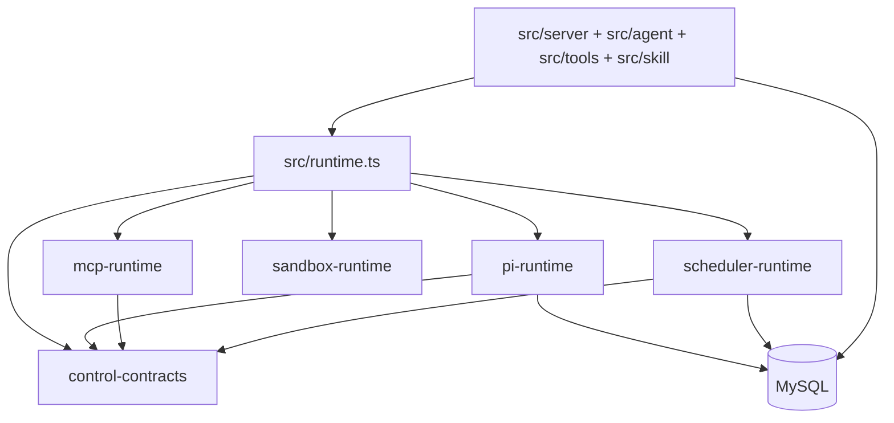

# AIoP 代码走读：从启动到 Durable Pi Run

本文只描述当前 Pi-first 实现。历史设计文档可用于理解迁移原因，但旧执行路径和旧目录不能作为修改入口。

## 1. 最快阅读路线

按以下顺序可在一小时内建立主链路：

1. `src/index.ts`：进程入口。
2. `src/runtime.ts`：composition root。
3. `packages/pi-runtime/src/run/manager.ts`：Durable Run 主流程。
4. `packages/pi-runtime/src/pi/agent.ts`：Pi Agent 薄适配。
5. `packages/pi-runtime/src/tools/governance.ts`：Tool 安全与副作用边界。
6. `packages/pi-runtime/src/store/types.ts`：Durable Store 合同。
7. `src/server/http.ts`：HTTP/SSE、append、cancel、recover。
8. `src/agent/projections.ts`：Pi Session 到产品消息的投影。
9. `src/scheduler/runner.ts`：Scheduler 如何只创建 Durable Run。

## 2. 开发与验证命令

```bash
npm run typecheck
npm test
make test-agent-platform
npm --prefix web run build
```

镜像、staging 部署与回滚通过根目录 `Makefile`，环境操作前先阅读[操作说明](../pi-agent-platform-operations.md)。日常源码验证不要执行部署 target。

## 3. 当前目录地图

| 路径 | 职责 |
| --- | --- |
| `packages/control-contracts` | 跨包身份、Run、Interaction、Tool、Event、错误类型 |
| `packages/pi-runtime` | Pi 薄适配、Durable Run、Tool Governance、Store |
| `packages/mcp-runtime` | MCP client、actor snapshot、连接、凭据、Tool mapping |
| `packages/sandbox-runtime` | Provider、生命周期、Profile、Desktop、Warm Pool、AIOS |
| `packages/scheduler-runtime` | Cron、Fire、claim、dispatch、recovery |
| `src/server` | HTTP/SSE 与 API 授权 |
| `src/agent` | 产品协调、Run Center、Interaction/Ledger 兼容和 Projection |
| `src/tools` | AIoP 产品工具 |
| `src/skill` | Skill 产品导入、可见性、凭据和 Sandbox 同步 |
| `src/scheduler` | scheduler package 的应用装配 |
| `src/db` | 产品 Store、MySQL 与迁移 |
| `web/src` | React Web |
| `deploy/dev-k8s` | 当前 staging manifests |

## 4. 五包如何协作



关键约束：Pi runtime 可以依赖 control contracts；应用负责把 MCP、Sandbox 和产品 Tool 组装进统一 registry。不要在五包之外再创建第二套 Agent loop、Tool runtime 或 Session context。

## 5. 第一条主线：进程启动

`src/index.ts` 识别三种入口：

- `serve`：启动 HTTP Server，可通过 `AIOP_EMBED_SCHEDULER` 内嵌 Scheduler；
- `seed-admin`：Local Auth 初始化管理员；
- 其他参数：CLI Agent。

所有入口先加载 `src/config/`，再调用 `buildRuntime()`。退出时关闭 scheduler、MCP、Sandbox generation、Store 和 Server。

## 6. 第二条主线：Runtime 装配

`src/runtime.ts` 是当前最大的装配文件，阅读时按下面分块：

### 6.1 Store 与 Durable Pi Runtime

`createDefaultDurableRunRuntime()` 根据产品 Store 选择：

- `createMemoryDurablePiRuntime()`；
- `createMysqlDurablePiRuntime()`。

两者都来自 `packages/pi-runtime/src/run/`。MySQL 装配还提供 `PiSessionStore`，用于 Session tree 和 committed leaf。

### 6.2 模型与 Pi adapter

运行时把配置转换为 Pi `Model`、`Provider` 和 Credential Store，然后将其传给 `packages/pi-runtime/src/pi/agent.ts`。消息、事件、compaction 和 Tool bridge 都在同包 `pi/` 目录，不在应用层复制转换逻辑。

### 6.3 Tool、Skill、MCP 与 Sandbox

`src/agent/tools.ts` 汇集 registry；`src/tools/` 提供产品工具；`src/skill/` 先做可见性和凭据治理，再交给 Pi Skill loader。

`packages/mcp-runtime` 管理 MCP actor snapshot。`packages/sandbox-runtime` 管理 Provider 和 generation。两类 Tool 最终都进入 `packages/pi-runtime/src/tools/governance.ts`。

### 6.4 Auth 与产品服务

Local/OIDC/AIOS Auth、用户凭据、审计、租户设置和 HTTP handlers 仍在应用层。Pi 不负责产品身份或 RBAC。

## 7. 第三条主线：一次 HTTP Run

在 `src/server/http.ts` 搜索 `/v1/agent` 和 `/v1/agent/runs`：

1. HTTP 层认证请求并建立 tenant/actor context。
2. 校验 session、权限、请求模式和幂等字段。
3. Durable runtime 创建 Run/Attempt 并获取 lease。
4. Pi adapter 启动 Agent Turn。
5. 事件写入 durable event stream，同时通过 SSE 发给客户端。
6. Tool call 经过 policy、approval、ledger、audit 后执行。
7. Turn 成功后提交 Pi leaf 和 Durable Turn。
8. `src/agent/projections.ts` 更新产品 messages/session usage。

Run Center 查询入口在 `src/agent/run-center.ts`。append/cancel/recover 由同一个 Durable Run API 处理，不能绕过 Store 直接操作活跃 Pi session。

## 8. 第四条主线：Durable Run 内部

从 `packages/pi-runtime/src/run/manager.ts` 开始，再分别进入：

| 需求 | 文件 |
| --- | --- |
| Attempt 生命周期 | `attempt.ts` |
| Lease/fencing | `lease.ts` |
| 取消 | `cancellation.ts` |
| 跨 Worker append | `inbox.ts` |
| Run/token/cost/attempt 限制 | `limits.ts` |
| Worker 丢失恢复 | `recovery.ts` |
| SSE durable sequence | `event-stream.ts` |
| Memory/MySQL 装配 | `memory-assembly.ts`、`mysql-assembly.ts` |

排查并发问题时同时记录 tenantId、runId、attemptId、turnNo、leaseOwner、leaseToken 和 correlationId。

## 9. 第五条主线：Pi Session 与 Projection

`packages/pi-runtime/src/pi/session.ts` 定义 AIoP 使用 Pi Session 的边界；`packages/pi-runtime/src/store/pi-session-mysql.ts` 持久化 Session Tree。

必须区分：

- current leaf：当前 Attempt 正在工作的分支；
- committed leaf：最后成功提交的 Durable Turn；
- product messages：由 committed path 生成的兼容视图。

恢复只读取 committed path。未提交 branch、迟到 Tool result 或失租 Attempt 不能进入产品消息。

## 10. 第六条主线：Tool Governance

阅读顺序：

1. `packages/pi-runtime/src/tools/registry.ts`
2. `packages/pi-runtime/src/tools/adapter.ts`
3. `packages/pi-runtime/src/tools/governance.ts`
4. `policy.ts`、`approval.ts`、`ledger.ts`、`audit.ts`
5. `concurrency.ts`

Pi 负责基础 schema/dispatch；AIoP wrapper 负责 tenant/actor 权限、Durable Interaction、非幂等副作用、审计和并发。看到 status=`started` 的写 Tool 时不要自动重放；先确认是否已有确定结果，否则转 `recovery_required`。

## 11. 第七条主线：Skill、MCP、Sandbox

### 11.1 Skill

产品入口是 `src/skill/service.ts` 和 `src/skill/registry.ts`。导入/升级锁在 `import.ts`、`lock.ts`；可见性在 `visibility.ts`；凭据在 `credentials.ts`；Sandbox 同步在 `sandbox-sync.ts`。

Pi loader 只处理已批准的 Skill 来源和 prompt 格式，不决定租户可见性。

### 11.2 MCP

从 `packages/mcp-runtime/src/manager.ts` 读 actor snapshot 和 fencing，再读 `runtime.ts`、`client.ts`。MCP Tool 名称映射后仍通过统一 Governance。

### 11.3 Sandbox

从 `packages/sandbox-runtime/src/types.ts`、`runtime-controller.ts`、`lifecycle.ts` 开始，再按实际 Provider 阅读 `local.ts`、`e2b.ts`、`opensandbox.ts` 或 AIOS 文件。设置热更新必须创建新 generation，不能原地改变活跃 handle 的安全上下文。

## 12. 第八条主线：Scheduler

`src/scheduler/runner.ts` 创建 `packages/scheduler-runtime` 的 Store、Runner 和 Recovery。Scheduler 只做：

1. 持久化/领取到期 Fire；
2. 通过 dispatcher 创建或复用 Durable Run；
3. 记录 fire/run 关联；
4. 补偿过期 claim。

它不直接调用 Pi Agent loop。`fire_id` 是崩溃恢复和防重复创建的关键幂等键。

## 13. 第九条主线：MySQL 与迁移

先读 `src/db/store.ts`，再读 `src/db/memory.ts` 与 `src/db/mysql.ts`。Durable Pi Store 的额外合同在 `packages/pi-runtime/src/store/types.ts`。

当前项目以 `src/db/migrations/0001_baseline.sql` 作为新环境基线；其中包含 Pi-only Runtime、Scheduler Fire、Durable Run 控制面以及手动 Fire 幂等索引。基线已不包含旧的 Scheduler 兼容历史表。

基线重建会丢失数据；生产升级必须使用经批准的迁移计划，不能将重建基线当作回滚手段。

## 14. 常见需求修改入口

| 需求 | 首选路径 | 同步验证 |
| --- | --- | --- |
| Pi message/event 映射 | `packages/pi-runtime/src/pi/` | `tests/pi-runtime/` |
| Durable Run/恢复 | `packages/pi-runtime/src/run/` | durable/recovery/HTTP tests |
| Tool policy/ledger | `packages/pi-runtime/src/tools/` | governance/interaction tests |
| 产品 Tool | `src/tools/`、`src/runtime.ts` | policy、HTTP、Tool integration |
| MCP | `packages/mcp-runtime` | `tests/mcp-runtime/` |
| Sandbox Provider | `packages/sandbox-runtime` | sandbox contract/provider tests |
| Scheduler | `packages/scheduler-runtime`、`src/scheduler/` | scheduler runtime/integration tests |
| 产品消息/usage | `src/agent/projections.ts` | projection/HTTP tests |
| Schema | `src/db/migrations/` | Memory/MySQL contract、backup/rollback plan |
| Web | `web/src/` | frontend tests、Web build |

## 15. 测试地图

| 领域 | 测试 |
| --- | --- |
| Durable Run/Store | `tests/pi-runtime/durable-run.test.ts` |
| 恢复/fencing | `tests/pi-runtime/recovery.test.ts` |
| Pi Codec/Session/Compaction | `tests/pi-runtime/` |
| HTTP Run Center | `tests/http-agent-runs.test.ts` |
| MCP | `tests/mcp-runtime/` |
| Sandbox | `tests/sandbox.test.ts`、`tests/runtime-sandbox-controller.test.ts` |
| Scheduler | `tests/scheduler-runtime/`、`tests/scheduler.test.ts` |
| Skill | `tests/skill.test.ts` |
| Staging source boundary | `tests/runtime-refactor-rollout.test.ts` |
| Web | `tests/frontend.test.ts` |

## 16. 新人常见误区

1. 把 Pi 当作 Durable Run/租户治理实现；这些仍由 AIoP 负责。
2. 在应用层新增另一套 message codec 或 Agent loop。
3. 把 current leaf 当 committed leaf 投影。
4. 失租后仍提交终态或 Tool result。
5. 自动重放未知非幂等副作用。
6. 让 Scheduler 直接运行 Agent，而不是创建 Durable Run。
7. 只修改 MySQL Store，漏掉 Memory 合同测试。
8. 从 Secret、日志或 Tool 参数输出读取凭据。
9. 使用 `deploy/k8s/` 代替当前 staging 的 `deploy/dev-k8s/`。
10. 手写部署命令而绕过 Make target。

## 17. 延伸阅读

- [系统总览](../design/01-system-overview.md)
- [Agent Runtime](../design/02-agent-runtime.md)
- [模型与上下文](../design/03-model-and-context.md)
- [工具、Skill 与 MCP](../design/04-tools-skills-mcp.md)
- [Sandbox 与运维](../design/05-sandbox-and-ops.md)
- [数据与持久化](../design/07-data-and-persistence.md)
- [Scheduler](../design/08-scheduler.md)
- [Pi Agent Platform 操作说明](../pi-agent-platform-operations.md)
