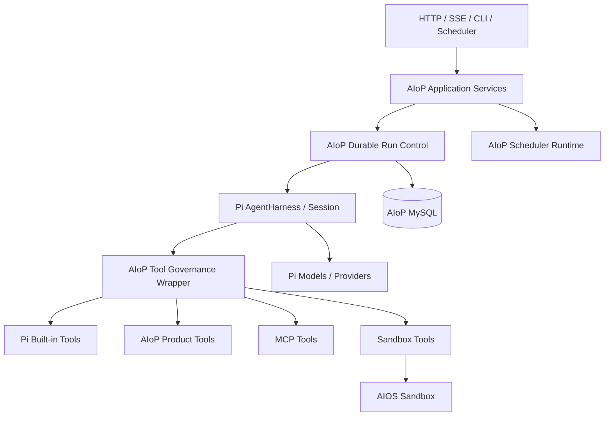
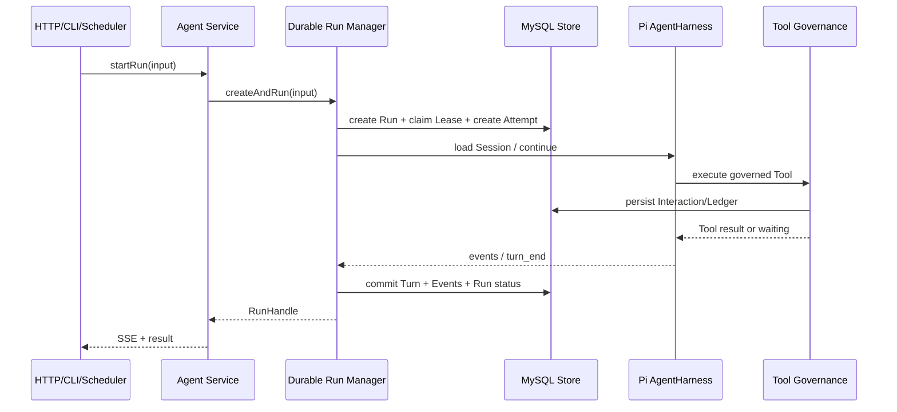

# Pi 优先的 AIoP Runtime 收敛 Implementation Plan

> **For agentic workers:** REQUIRED SUB-SKILL: Use superpowers:subagent-driven-development (recommended) or superpowers:executing-plans to implement this plan task-by-task. Steps use checkbox (`- [ ]`) syntax for tracking.

**Goal:** 在不改变现有 HTTP API、MySQL 产品数据和 Web 行为的前提下，以 Pi 0.82.1 替代 AIoP 重复实现的 Agent 会话内能力，并将剩余自研代码收敛为清晰的产品化、分布式和治理模块。

**Architecture:** Pi 负责模型调用、Agent Loop、Turn、Session、Context Compaction、Tool 基础执行和 Skill 加载；AIoP 只通过 Pi 公开 API 做适配，并自研 Durable Run、Lease、Attempt、恢复、治理、MCP、Sandbox、Scheduler、认证和产品 API。重构采用兼容适配、双路径对照、逐包迁移、删除旧实现的顺序，每一阶段都可独立验证和回滚。

**Tech Stack:** TypeScript 6、Node.js 22、`@earendil-works/pi-agent-core` 0.82.1、`@earendil-works/pi-ai` 0.82.1、Kysely/MySQL、官方 MCP TypeScript SDK、Vitest、React/Vite。

**文档状态：** 草案，待评审后实施。

## Global Constraints

- 不修改或 Fork `earendil-works/pi`；仅使用其公开 API，在 AIoP 中增强 Pi 不支持的能力。
- 只有在 Pi 能完整替代且不降低功能、安全、多租户隔离和故障恢复能力时，才删除 AIoP 实现。
- 保持现有 HTTP API 路径、主要 DTO、MySQL 产品数据和 Web 用户行为兼容。
- `@aiop/*` 包尚未正式发布，本次允许直接改名、删除和调整公共 API；不保留 deprecated shim。
- Durable Run、Attempt、Lease/Fencing、跨进程取消、非幂等工具恢复、审批、RBAC、审计由 AIoP 保留。
- AIOS Sandbox 集成由 AIoP 自研；不为适配 Pi 强制改造成 Pi `ExecutionEnv`。
- MCP 优先使用官方 `@modelcontextprotocol/sdk`；第三方 Pi MCP Adapter 仅做隔离 POC，不作为默认依赖。
- 新增临时文件和测试截图放 `dist/`；编译输出迁移到各包 `bin/`。
- 镜像构建和测试环境部署只通过 Make target 执行。
- 实施过程中保留用户已有工作树改动，不清理、不覆盖无关文件。
- 每次 Git 提交正文末尾必须包含 `Co-authored-by: AIOS <noreply@bocloud.com>`，提交后执行 `git show -s --format=%B HEAD` 验证。

---

## 1. 决策摘要

### 1.1 改什么

当前 Agent 平台拆成了 `agent-kernel-pi`、`agent-runtime-core`、`agent-runtime-mysql`、`agent-runtime-aiop`、`tool-runtime` 和 `skill-runtime` 等多个包，其中一部分代码重复实现 Pi 已提供的 Agent Loop、消息转换、上下文压缩、Tool 基础调度和 Skill 加载。

本方案将这些包收敛为一个 `pi-runtime`，同时将 Sandbox 包和 Scheduler 包分别合并为 `sandbox-runtime`、`scheduler-runtime`。`agent-contracts` 更名为语义更准确的 `control-contracts`。

### 1.2 为什么改

- 降低 AIoP 与 Pi 双重 Runtime 演进产生的行为差异。
- 避免重复维护模型、Turn、Session、Tool 和 Skill 基础设施。
- 将自研边界限定为 Pi 明确不支持的产品化和分布式能力。
- 减少包数量、转换层和公共 API 面积，缩短故障定位路径。

### 1.3 采用什么方案

采用“Pi 优先的分层收敛”：



Pi 是单次会话内执行事实源；AIoP MySQL 是产品 Run、跨进程协调、治理记录和兼容查询的事实源。两者通过稳定 Codec 和 Projection 连接，不再维护第二套 Agent Loop。

### 1.4 不在本次范围

- 不修改 Pi 上游代码或发布私有 Pi 分支。
- 不重做 Run Center UI。
- 不改变现有认证、租户和权限产品语义。
- 不引入新的消息队列、工作流引擎或可观测平台。
- 不用 Pi 替代 AIOS Sandbox、Scheduler 或服务端 MCP 管理。

### 1.5 最大风险和实施顺序

最大风险是 Session/Message 投影、Tool 非幂等恢复和跨 Worker 追加消息的兼容性。实施顺序必须是：先冻结兼容契约，再引入薄适配层，然后切换 Pi Session/Tool/Skill，最后合包并删除旧实现。

---

## 2. 当前事实与代码依据

以下判断基于 2026-07-28 工作区代码和已安装依赖。

| 事实 | 代码依据 | 结论 |
| --- | --- | --- |
| 当前 Pi Kernel 仍手工转换消息、Tool 和上下文 | `packages/agent-kernel-pi/src/index.ts`、`src/agent/pi/kernel.ts` | 收敛到 Pi Harness 和统一 Codec |
| Durable Run、Attempt、Lease、Turn Commit 已存在 | `packages/agent-runtime-core/src/runtime.ts`、`src/db/migrations/0012_agent_durable_runtime.sql` 至 `0022_pi_only_runtime.sql` | 保留领域语义，迁移到 `pi-runtime/run` 和 `store` |
| Tool Runtime 同时包含治理和 Pi 已支持的校验、输出处理 | `packages/tool-runtime/src/index.ts` | 删除基础执行重复，只保留治理差异 |
| Skill Runtime 已调用 Pi Loader，但仍形成独立包装包 | `packages/skill-runtime/src/index.ts` | 删除独立包，产品治理留在 `src/skill` |
| HTTP 追加消息仍经过内存 pending queue | `src/server/http.ts`、`src/agent/pi/kernel.ts` | 同 Worker 使用 Pi `steer/followUp`，跨 Worker保留持久化路由 |
| Model Gateway 有自研重试 | `src/agent/services/model-gateway.ts` | 使用 Pi Provider retry 和事件 |
| Context 和 Session Committer 重复维护执行上下文 | `src/agent/context.ts`、`src/agent/services/session-committer.ts` | Pi Session 为执行事实，AIoP只做兼容投影 |
| Sandbox 实现包含 AIOS 生命周期、模板、预热池和用户目录 | `src/sandbox/`、`packages/sandbox-*` | Pi 无等价能力，合并后继续自研 |
| Scheduler 独立创建和补偿 Run | `src/scheduler/`、`packages/scheduler-*` | Scheduler 不进入 Agent Loop，合并后继续自研 |

Pi 公开声明已确认提供：

- `AgentHarness`、`agentLoop()`、`agentLoopContinue()`；
- `steer()`、`followUp()`、`nextTurn()`、`appendMessage()`、`abort()`；
- `setModel()`、`setThinkingLevel()`、`setTools()`、`setResources()`；
- Session、SessionStorage、Session Tree、Compaction、Branch Summary 和 SessionStats；
- Tool 参数校验、串并行、`beforeToolCall`、`afterToolCall`、Tool 事件和输出截断；
- `loadSkills()`、`loadSourcedSkills()`、`formatSkillInvocation()`、`formatSkillsForSystemPrompt()`。

声明来源为 `node_modules/@earendil-works/pi-agent-core/dist/**/*.d.ts`。

---

## 3. 最终目录树

下面是重构完成后的源码目录。`bin/` 为生成物，不纳入手工源码职责说明。

```text
aiop/
├── packages/
│   ├── control-contracts/
│   │   └── src/
│   │       ├── identity.ts
│   │       ├── run.ts
│   │       ├── interaction.ts
│   │       ├── tool.ts
│   │       ├── events.ts
│   │       ├── errors.ts
│   │       └── index.ts
│   │
│   ├── pi-runtime/
│   │   └── src/
│   │       ├── pi/
│   │       │   ├── models.ts
│   │       │   ├── agent.ts
│   │       │   ├── session.ts
│   │       │   ├── compaction.ts
│   │       │   ├── skills.ts
│   │       │   ├── tool-bridge.ts
│   │       │   ├── message-codec.ts
│   │       │   ├── event-codec.ts
│   │       │   └── compatibility.ts
│   │       ├── run/
│   │       │   ├── manager.ts
│   │       │   ├── attempt.ts
│   │       │   ├── lease.ts
│   │       │   ├── recovery.ts
│   │       │   ├── cancellation.ts
│   │       │   ├── inbox.ts
│   │       │   ├── limits.ts
│   │       │   └── event-stream.ts
│   │       ├── tools/
│   │       │   ├── governance.ts
│   │       │   ├── policy.ts
│   │       │   ├── approval.ts
│   │       │   ├── ledger.ts
│   │       │   ├── concurrency.ts
│   │       │   └── adapter.ts
│   │       ├── store/
│   │       │   ├── types.ts
│   │       │   ├── memory.ts
│   │       │   ├── mysql.ts
│   │       │   └── pi-session-mysql.ts
│   │       └── index.ts
│   │
│   ├── mcp-runtime/
│   │   └── src/
│   │       ├── config.ts
│   │       ├── client.ts
│   │       ├── connection-manager.ts
│   │       ├── visibility.ts
│   │       ├── tool-adapter.ts
│   │       ├── audit.ts
│   │       └── index.ts
│   │
│   ├── sandbox-runtime/
│   │   └── src/
│   │       ├── domain/
│   │       ├── providers/
│   │       │   ├── local/
│   │       │   ├── e2b/
│   │       │   ├── opensandbox/
│   │       │   └── aios/
│   │       ├── lifecycle/
│   │       ├── profiles/
│   │       ├── templates/
│   │       ├── warm-pool/
│   │       ├── user-home/
│   │       ├── desktop/
│   │       ├── tool-adapter/
│   │       └── index.ts
│   │
│   └── scheduler-runtime/
│       └── src/
│           ├── domain/
│           ├── cron/
│           ├── store/
│           ├── runner/
│           ├── recovery/
│           └── index.ts
│
├── src/
│   ├── index.ts
│   ├── runtime.ts
│   ├── agent/
│   │   ├── service.ts
│   │   ├── run-center.ts
│   │   ├── interactions.ts
│   │   └── projections.ts
│   ├── tools/
│   │   ├── ask-user/
│   │   ├── change-plan/
│   │   ├── kubectl/
│   │   ├── browser/
│   │   ├── webfetch/
│   │   ├── schedule/
│   │   ├── todo/
│   │   ├── skill/
│   │   ├── registry.ts
│   │   └── index.ts
│   ├── skill/
│   │   ├── import.ts
│   │   ├── service.ts
│   │   ├── visibility.ts
│   │   ├── credentials.ts
│   │   ├── sandbox-sync.ts
│   │   └── audit.ts
│   ├── scheduler/
│   │   ├── service.ts
│   │   └── run-dispatcher.ts
│   ├── auth/
│   ├── security/
│   ├── server/
│   ├── db/
│   │   └── migrations/
│   ├── audit/
│   ├── net/
│   ├── ops/
│   └── config/
│
├── web/src/
├── tests/
│   ├── contracts/
│   ├── pi-runtime/
│   ├── mcp-runtime/
│   ├── sandbox-runtime/
│   ├── scheduler-runtime/
│   └── integration/
├── scripts/
├── deploy/
├── docs/
├── dist/
├── bin/
├── Makefile
└── package.json
```

### 3.1 删除的包和目录

| 当前路径 | 最终去向 |
| --- | --- |
| `packages/agent-contracts` | 更名并收敛到 `packages/control-contracts` |
| `packages/agent-kernel-pi` | 合并到 `packages/pi-runtime/src/pi` |
| `packages/agent-runtime-core` | Durable 部分进入 `pi-runtime/run`，重复 Loop 删除 |
| `packages/agent-runtime-mysql` | 合并到 `pi-runtime/store/mysql.ts` |
| `packages/agent-runtime-aiop` | 产品装配进入根应用层，必要的 DTO 转换进入 `pi-runtime/pi/compatibility.ts` |
| `packages/tool-runtime` | 治理部分进入 `pi-runtime/tools`，基础执行删除 |
| `packages/skill-runtime` | 删除；Pi Loader 直接由 `pi-runtime/pi/skills.ts` 调用 |
| `packages/sandbox-core`、`sandbox-local`、`sandbox-e2b`、`sandbox-opensandbox` | 合并为 `packages/sandbox-runtime` |
| `packages/scheduler-core`、`scheduler-mysql` | 合并为 `packages/scheduler-runtime` |
| `src/model` | 删除；模型和 Provider 统一使用 Pi |
| `src/mcp` | 合并到 `packages/mcp-runtime` |
| `src/sandbox` | 合并到 `packages/sandbox-runtime` |
| `src/agent/pi` | 合并到 `packages/pi-runtime/src/pi` |

旧 `@aiop/*` 包没有正式发布，因此目标包可在对应迁移任务中直接替换旧包。每个任务必须在同一个变更中完成 import、构建脚本、公共 API 快照和测试更新，不能在主分支留下不可构建的中间状态。

---

## 4. 每个顶层目录的功能

| 目录 | 功能 | 边界 |
| --- | --- | --- |
| `packages/` | 可独立构建、具有稳定 Interface 的后端子系统 | 不包含 HTTP Handler 和具体页面逻辑 |
| `src/` | AIoP 产品应用层、服务装配、API、安全和数据库迁移 | 不重新实现 Pi Agent Runtime |
| `web/src/` | Web 控制台和 Run Center | 只通过现有 API 访问后端 |
| `tests/` | 单元、合约、集成、故障恢复和迁移测试 | 测试按目标模块归档 |
| `scripts/` | 构建、公共 API 快照、包校验和迁移辅助脚本 | 不承载运行时业务逻辑 |
| `deploy/` | Kubernetes 等部署清单 | 构建和部署由 Make target 调用 |
| `docs/` | 当前设计、运维文档、公共 API 快照和实施计划 | 历史文档明确标注状态 |
| `dist/` | 临时数据、测试截图、迁移演练输出 | 可清理，不作为编译发布物 |
| `bin/` | 编译产物 | 不手工编辑 |

---

## 5. 自研模块及模块功能

### 5.1 复用等级

| 等级 | 定义 |
| --- | --- |
| Pi 复用 | 直接调用 Pi，不在 AIoP 复制算法或状态机 |
| 薄适配 | AIoP只做类型、身份、事件和兼容 DTO 转换 |
| AIoP 自研 | Pi 没有等价能力，AIoP保留完整领域实现 |

### 5.2 模块清单

| 模块 | 复用等级 | 功能 |
| --- | --- | --- |
| `control-contracts` | AIoP 自研 | 定义产品 Run、Identity、Interaction、治理事件和错误契约；不复制 Pi 内部消息类型 |
| `pi-runtime/pi` | Pi 复用 + 薄适配 | 创建 Harness、使用 Pi Model/Session/Compaction/Skill API，完成兼容 Codec |
| `pi-runtime/run` | AIoP 自研 | Durable Run、Attempt、Lease/Fencing、恢复、取消、限制和 Durable Event Stream |
| `pi-runtime/tools` | AIoP 自研治理 + Pi 基础执行 | RBAC/Policy、审批、Ledger、非幂等恢复、跨资源并发和审计包装 |
| `pi-runtime/store` | AIoP 自研 | Run/Attempt/Lease/Interaction/Ledger 的 Memory 和 MySQL Store |
| `mcp-runtime` | AIoP 自研集成 | 基于官方 MCP SDK 管理多租户连接、重连、Tool 可见性、超时和审计 |
| `sandbox-runtime` | AIoP 自研集成 | Local/E2B/OpenSandbox/AIOS Sandbox 生命周期、Profile、模板、预热池、用户目录和 Desktop |
| `scheduler-runtime` | AIoP 自研 | Cron 解析、到期任务领取、幂等触发、补偿和 Run 创建；不进入 Agent Loop |
| `src/agent` | AIoP 自研应用层 | Run 用例、Run Center 查询、Interaction 用例和 Pi Session 到产品表的 Projection |
| `src/tools` | AIoP 自研产品 Tool | Ask User、Change Plan、kubectl、browser、webfetch、schedule、todo、skill 等具体 Tool |
| `src/skill` | AIoP 自研产品管理 | ZIP 安全导入、版本、审核、可见性、凭据元数据、Sandbox 同步和审计 |
| `src/auth`、`src/security` | AIoP 自研 | OIDC/AIOS/本地身份、RBAC、Credential 和密钥保护 |
| `src/server` | AIoP 自研 | HTTP、SSE、下载和兼容 DTO；不维护 Agent 内部 pending queue |
| `src/db` | AIoP 自研 | 产品 Schema、连接、事务、迁移和 Projection 数据 |
| `web/src` | AIoP 自研 | 会话、运行中心、审批和管理 UI |

---

## 6. 每个源码目录的职责

### 6.1 `packages/control-contracts/src`

该目录只导出跨包稳定契约。内部实现类型、Pi SDK 类型、Kysely 类型和 HTTP Request/Response 不得穿透到这里。

| 文件 | 职责 |
| --- | --- |
| `identity.ts` | `IdentityContext`、租户、用户、角色和资源范围 |
| `run.ts` | Run/Attempt/Lease 输入输出、状态、限制和恢复命令 |
| `interaction.ts` | Approval、Question、Plan 的等待和解决契约 |
| `tool.ts` | Tool capability、治理上下文、Ledger 更新和执行结果 |
| `events.ts` | Durable Run Event 和 SSE 投影事件 |
| `errors.ts` | Run、Lease、Policy、Recovery 领域错误；Pi 错误不重复定义 |
| `index.ts` | 明确 re-export 公共契约，不包含实现代码 |

目标契约示例：

```ts
export interface DurableRunRuntime {
  run(input: StartRunInput): Promise<RunHandle>;
  resume(input: ResumeRunInput): Promise<RunHandle>;
  cancel(input: CancelRunInput): Promise<void>;
  append(input: AppendRunMessageInput): Promise<void>;
}

export interface AppendRunMessageInput {
  identity: IdentityContext;
  runId: string;
  message: AgentInputMessage;
  mode: 'steer' | 'follow_up';
  idempotencyKey: string;
}
```

### 6.2 `packages/pi-runtime/src/pi`

该目录是 Pi 的薄接入层，不得形成第二套 Agent Runtime。

| 文件 | 职责 | 主要复用 |
| --- | --- | --- |
| `models.ts` | 解析产品模型配置并获得 Pi `Model`；不重试模型调用 | Pi Models/Providers |
| `agent.ts` | 创建、缓存和关闭 `AgentHarness`，调用 `continue/abort/steer/followUp` | `AgentHarness` |
| `session.ts` | 创建或加载 Pi Session，将其作为会话内执行事实源 | Pi Session/Storage |
| `compaction.ts` | 配置并调用 Pi Compaction，投影压缩事件 | Pi Compaction API |
| `skills.ts` | 调用 Pi Loader，接收产品层过滤后的 Skill Source | Pi Skill API |
| `tool-bridge.ts` | 将受治理 Tool 转成 Pi `AgentTool` 并注册 | Pi Tool API |
| `message-codec.ts` | 旧 HTTP/数据库消息与 Pi `AgentMessage` 双向兼容转换 | Pi message types |
| `event-codec.ts` | Pi Harness Event 到 Durable Event/SSE 的投影 | Pi Harness events |
| `compatibility.ts` | 旧包名和旧调用接口的短期兼容适配；不得新增业务逻辑 | AIoP compatibility |

### 6.3 `packages/pi-runtime/src/run`

该目录是 AIoP 保留的分布式运行控制层。

| 文件 | 职责 |
| --- | --- |
| `manager.ts` | Run 创建、执行、等待、完成和事务编排；调用 Pi Harness，不执行 Agent Loop |
| `attempt.ts` | Worker 每次执行尝试的创建、完成、失败和重试计数 |
| `lease.ts` | Claim、续租、释放和 fencing token 校验 |
| `recovery.ts` | Worker 故障恢复、未决 Interaction 和不确定 Tool 副作用对账 |
| `cancellation.ts` | 持久化跨进程取消请求，并在执行 Worker 调用 Pi `abort()` |
| `inbox.ts` | 跨 Worker `steer/followUp` 消息的持久化、领取、确认、超时重领和幂等消费 |
| `limits.ts` | Run/Turn/Tool/Token/Cost/Deadline 产品限制 |
| `event-stream.ts` | 事务提交后的有序 Durable Event 和 SSE 订阅 |

关键接口：

```ts
export interface RunStore {
  create(input: CreateRunRecord): Promise<RunRecord>;
  claim(input: ClaimRunInput): Promise<ClaimedRun | null>;
  renewLease(input: RenewLeaseInput): Promise<void>;
  commitTurn(input: CommitTurnInput): Promise<void>;
  requestCancellation(input: RequestCancellationInput): Promise<void>;
  complete(input: CompleteRunInput): Promise<void>;
}
```

`renewLease`、`commitTurn` 和 `complete` 必须校验 fencing token。Token 不匹配返回 `LeaseLostError`，执行 Worker随后调用 Pi `abort()`，不得继续提交结果。

### 6.4 `packages/pi-runtime/src/tools`

该目录只实现 Pi 缺少的产品治理，不重复实现 Tool 参数校验、普通调度和输出截断。

| 文件 | 职责 |
| --- | --- |
| `governance.ts` | 按固定顺序组合 Policy、Approval、Ledger、Concurrency 和 Audit |
| `policy.ts` | RBAC、租户、资源和 Tool capability 决策 |
| `approval.ts` | 创建 Durable Interaction，暂停 Run，恢复后校验解决记录 |
| `ledger.ts` | logical call identity、幂等键、执行状态、结果摘要和副作用恢复 |
| `concurrency.ts` | 跨 Run、租户、Tool 和资源的并发限制 |
| `adapter.ts` | 包装 Pi Tool、AIoP Tool、MCP Tool 和 Sandbox Tool，使其统一进入治理链 |

统一注册链路：

```text
Tool Sources
  -> name/capability normalization
  -> RBAC and Policy
  -> Approval
  -> Durable Ledger
  -> Cross-run Concurrency
  -> Audit
  -> Pi AgentHarness.setTools()
```

同名 Tool 默认拒绝启动，不能依赖数组顺序覆盖。Tool 使用稳定的 `source:name` 内部标识，对模型暴露的名称由注册表显式决定。

### 6.5 `packages/pi-runtime/src/store`

| 文件 | 职责 |
| --- | --- |
| `types.ts` | Run、Attempt、Lease、Turn、Event、Interaction 和 Ledger Repository Interface |
| `memory.ts` | 单元测试和本地无数据库运行；语义必须与 MySQL Store 一致 |
| `mysql.ts` | Kysely/MySQL 实现、事务、锁、fencing 和查询投影 |
| `pi-session-mysql.ts` | 实现 Pi 公开 `SessionStorage` Interface，持久化 Session Entry、Leaf 和 SessionStats |

Pi Session 使用 AIoP 自定义的 MySQL `SessionStorage`，但它不替代产品 Run Store。Pi Session Entry 是 Agent 会话上下文事实源；Run Store 仍负责跨 Worker Lease、Attempt、Turn Commit、Interaction、Tool Ledger 和产品查询。

### 6.6 `packages/mcp-runtime/src`

| 文件 | 职责 |
| --- | --- |
| `config.ts` | 租户 MCP Server 配置、Credential 引用和版本兼容 |
| `client.ts` | 官方 MCP SDK Client 的创建、调用、超时和关闭 |
| `connection-manager.ts` | 按租户/Server 复用连接、健康检查、退避重连和热更新 |
| `visibility.ts` | 将 Server/Tool 配置映射为当前身份可见 Tool 集合 |
| `tool-adapter.ts` | MCP Tool 到受治理 Pi Tool 的转换 |
| `audit.ts` | 连接、配置、调用和失败审计 |
| `index.ts` | 对外 Runtime Interface 和工厂函数 |

第三方 `pi-mcp-adapter` 仅允许在独立 POC 中验证 SDK 模式。若不能满足多租户数据库配置、跨 Session 连接复用、Credential 注入和服务端审计，则不引入生产依赖。

### 6.7 `packages/sandbox-runtime/src`

| 目录 | 职责 |
| --- | --- |
| `domain/` | Sandbox、Profile、Template、Acquisition 和生命周期领域类型 |
| `providers/local/` | 本地进程和文件系统 Sandbox |
| `providers/e2b/` | E2B Code Interpreter/Desktop 接入 |
| `providers/opensandbox/` | OpenSandbox 接入 |
| `providers/aios/` | AIOS Lifecycle HTTP、Provider、Placement 和错误映射 |
| `lifecycle/` | acquire/start/stop/release/reconcile 状态编排 |
| `profiles/` | 租户 Profile、资源限制和 Provider 选择 |
| `templates/` | AIOS Template Catalog、校验和缓存 |
| `warm-pool/` | 预热池补充、领取、回收和失效清理 |
| `user-home/` | 用户工作目录挂载、权限和清理 |
| `desktop/` | Desktop 命令、截图、浏览器和输出归一化 |
| `tool-adapter/` | 将 Sandbox 文件、Shell、Desktop 能力包装为受治理 Pi Tool |

Pi `ExecutionEnv` 只在 POC 证明可无损覆盖某个 Provider 时使用；它不是 AIOS Sandbox 生命周期的强制抽象。

### 6.8 `packages/scheduler-runtime/src`

| 目录 | 职责 |
| --- | --- |
| `domain/` | ScheduledTask、Trigger、Execution 和状态规则 |
| `cron/` | Cron 表达式解析和下一次触发时间计算 |
| `store/` | MySQL 领取、幂等键、状态更新和查询 |
| `runner/` | 扫描到期任务，创建产品 Run，不直接调用 Pi Agent Loop |
| `recovery/` | Worker 中断后的超时任务回收、补偿和漏触发处理 |

Scheduler 的输出是 `StartRunInput`。实际执行仍经过 `pi-runtime/run/manager.ts`，确保定时 Run 与 HTTP/CLI Run 使用同一治理和恢复链路。

### 6.9 `src/agent`

| 文件 | 职责 |
| --- | --- |
| `service.ts` | HTTP/CLI/Scheduler 共用的 Run 应用服务和事务边界 |
| `run-center.ts` | Run 列表、详情、取消资格和恢复资格查询 |
| `interactions.ts` | Approval/Question/Plan 的查询与解决用例 |
| `projections.ts` | Pi Session/Events 到现有 messages、timeline 和 SSE DTO 的兼容投影 |

该目录不再包含 `kernel.ts`、`context.ts`、`model-gateway.ts`、`tool-broker.ts` 或 `session-committer.ts` 形式的第二套 Runtime。

### 6.10 `src/tools`

这里是 AIoP 自定义 Tool，不是通用 Tool Runtime。每个子目录包含 Tool 定义和产品服务，最后统一适配为 Pi `AgentTool`。

| 目录 | Tool 功能 |
| --- | --- |
| `ask-user/` | 创建问题 Interaction，等待用户回答后恢复 Run |
| `change-plan/` | 提交计划变更并等待用户确认 |
| `kubectl/` | 在授权 Cluster/Namespace 范围内执行 Kubernetes 操作 |
| `browser/` | 产品浏览器自动化入口，绑定 Sandbox/Profile |
| `webfetch/` | 受 SSRF 和响应大小限制的 HTTP 获取 |
| `schedule/` | 创建、查询和管理定时任务 |
| `todo/` | 当前会话任务列表 Tool |
| `skill/` | 查询和调用当前身份可见 Skill |
| `registry.ts` | 汇总产品 Tool，检查名称冲突和 capability 声明 |
| `index.ts` | 导出产品 Tool 工厂，不导出通用执行引擎 |

Pi 内置 Tool、AIoP Tool、MCP Tool 和 Sandbox Tool 都通过 `pi-runtime/tools/adapter.ts` 进入同一治理链，然后交给 Pi 调度。

### 6.11 `src/skill`

| 文件 | 职责 |
| --- | --- |
| `import.ts` | ZIP 路径穿越、软链接、文件数量、大小和扩展名安全校验 |
| `service.ts` | 上传、版本、启停、审核和删除产品用例 |
| `visibility.ts` | public/private/shared、tenant/user 可见性 |
| `credentials.ts` | Credential 引用元数据；不把明文密钥写入 Skill 文件 |
| `sandbox-sync.ts` | 将已授权 Skill 内容同步到目标 Sandbox |
| `audit.ts` | 导入、发布、授权和使用审计 |

`SKILL.md` 的发现、frontmatter 解析、加载和 Prompt 格式化直接使用 Pi。

### 6.12 其他 `src` 目录

| 目录 | 职责 |
| --- | --- |
| `src/scheduler/` | 将产品 ScheduledTask 请求和 `scheduler-runtime` 连接到 Run Service |
| `src/auth/` | 本地、OIDC、AIOS 身份，Session、RBAC 和 Credential 生命周期 |
| `src/security/` | Secret 加解密和安全基础能力 |
| `src/server/` | HTTP Router、SSE、下载和请求上下文 |
| `src/db/` | 产品数据库 Schema、迁移、连接和根应用 Store 装配 |
| `src/audit/` | 统一审计 Sink |
| `src/net/` | SSRF、地址和网络访问限制 |
| `src/ops/` | 错误分类和运维辅助逻辑 |
| `src/config/` | 配置 Schema、加载、覆盖顺序和敏感配置引用 |

---

## 7. 核心运行流程

### 7.1 创建和执行 Run



Turn 的生成和会话上下文由 Pi 负责；AIoP只在事务中提交 Durable Envelope。

### 7.2 运行中追加消息

- 同 Worker：Run Router 定位活动 Harness，调用 `steer()` 或 `followUp()`。
- 跨 Worker：先以 `idempotencyKey` 写入独立的 `agent_run_inbox_messages` 表，再由持有 Run Lease 的 Worker 领取并调用 Pi API。
- 调用 Pi 后在 Session 中追加 `aiop.inbox_consumed` Custom Entry，再将 Inbox 标记为 `consumed`。
- Worker 在 Pi 接收消息后、Inbox 确认前崩溃时，新 Attempt 通过 Custom Entry 对账并补写 `consumed`，不重复投递。
- HTTP 层不再维护 `pendingMessages` 队列。
- Worker 崩溃后，未消费的持久化消息由新 Attempt 继续处理。

### 7.3 取消

AIoP先持久化 cancel request。持有 Lease 的 Worker观察到请求后调用 Pi `abort()`；之后以当前 fencing token 提交 `cancelled`。如果 Lease 已转移，旧 Worker不能提交终态。

### 7.4 恢复

恢复流程先 Claim 新 Lease 和 Attempt，再加载 Pi Session，随后对账未完成 Interaction 和 Tool Ledger。可重试读操作允许重新执行；已确认完成的操作复用 Ledger 结果；结果不确定的非幂等写操作进入 `recovery_required`，不得自动重放。

---

## 8. 数据、事务与兼容策略

### 8.1 数据原则

- 现有 Run、Attempt、Turn、Event、Interaction 和 Tool Ledger 表继续使用，不做破坏性重建。
- 新增 `pi_sessions` 和 `pi_session_entries`，由 AIoP MySQL `SessionStorage` 实现 Pi Session 公开契约。
- 新增 `agent_run_inbox_messages`，独立承载跨 Worker `steer/followUp` 命令，不复用 Run Event 或 Interaction。
- Pi Session Entry 是 Agent 会话上下文事实源；现有 message API 继续读取兼容 Projection，产品消息表不再反向修改执行上下文。
- 每个跨租户查询都包含 `tenant_id` 条件。
- Run claim、lease renewal、turn commit、tool ledger 更新和终态提交校验 fencing token。
- 事件仅在业务事务提交后对 SSE 可见。

### 8.2 Pi Session MySQL Storage

`pi_sessions` 保存 Session 元数据、当前 Leaf 和已提交 Leaf：

```text
tenant_id
session_id
current_leaf_id
committed_leaf_id
next_entry_seq
created_at
updated_at
```

`pi_session_entries` 保存 Pi `SessionTreeEntry`：

```text
tenant_id
session_id
entry_id
entry_seq
parent_id
entry_type
entry_json
created_at
```

核心约束：

```text
PRIMARY KEY (tenant_id, session_id, entry_id)
UNIQUE (tenant_id, session_id, entry_seq)
INDEX (tenant_id, session_id, parent_id)
```

`createEntryId()` 生成全局不可预测 ID；`appendEntry()` 只追加，不覆盖历史 Entry；`setLeafId()` 只能指向同租户同 Session 已存在的 Entry。SessionStats 从 Entry 聚合或维护可重建缓存，不作为控制面事实。

### 8.3 Committed Leaf 一致性水位线

Pi 的 `SessionStorage` 是逐方法调用 Interface，不能假设整个 Pi Turn 与 AIoP Run Commit 自动共享同一个数据库事务。为避免 Worker 崩溃后把未提交消息带入恢复上下文，使用 committed leaf 水位线：

```text
Pi 执行 Turn
→ 追加 Session Entries，更新 current_leaf_id
→ 得到 Turn 最终 leafId / entrySeq
→ AIoP事务提交 Turn、Event、Ledger、Interaction
→ 同一事务更新 committed_leaf_id
→ Projection 只处理 committed leaf 可达的 Entries
```

如果 Worker 在 Durable Commit 前崩溃，新增 Entry 保留为未提交分支。新 Attempt 从 `committed_leaf_id` 构建上下文，忽略未提交分支；后台清理任务可在保留期后删除不可达 Entry。`agent_turns` 保存 `pi_session_id`、`pi_leaf_id` 和 `pi_entry_seq`，用于恢复、审计和 Projection 幂等。

### 8.4 Durable Inbox

`agent_run_inbox_messages` 使用以下字段：

```text
id
tenant_id
run_id
sequence_no
idempotency_key
message_mode          # steer | follow_up
payload_json
status                # pending | claimed | consumed | cancelled
claimed_by
claim_token
claim_expires_at
consumed_attempt_id
created_at
consumed_at
```

核心约束：

```text
UNIQUE (tenant_id, run_id, idempotency_key)
UNIQUE (tenant_id, run_id, sequence_no)
INDEX (tenant_id, run_id, status, sequence_no)
INDEX (status, claim_expires_at)
```

只有持有当前 Run Lease 的 Worker 可以领取消息。领取使用短期 claim token；重复 HTTP 请求按 `idempotency_key` 返回同一记录；同一 Run 按 `sequence_no` 顺序消费。Inbox 是待执行命令，Run Event 是已发生事实，Interaction 是人机等待状态，三者不共表。

### 8.5 Session 和 Message 兼容

`message-codec.ts` 必须满足：

1. 旧数据库文本、图片、Assistant Tool Call 和 Tool Result 可转换为 Pi Message；
2. Pi 新消息可投影回现有 HTTP DTO；
3. 未识别的新 Pi Content Block 记录为版本化扩展字段，旧 Web 可安全忽略；
4. Codec round-trip 测试不丢失 role、文本、图片 MIME、toolCallId 和 usage；
5. Projection 重放具有幂等键 `(tenantId, sessionId, piEntryId, projectionVersion)`。

### 8.6 数据兼容窗口

迁移期按以下顺序处理：

1. 新代码可读取旧数据；
2. 新执行路径同时写 Durable 数据和兼容 Projection；
3. 对照新旧查询结果；
4. 切换读路径到 Projection；
5. 停止旧写入；
6. 至少完成一次生产数据备份和恢复演练后，删除旧 Runtime 实现；旧 `@aiop/*` 包与仓库内引用在对应迁移任务中直接删除。

---

## 9. 开源组件引用情况

查询日期：2026-07-28。版本和许可证来自当前安装包的 `package.json`；本次未查询动态 Star 和最近提交数据。

| 组件 | 当前/建议版本 | 使用范围 | 官方仓库 | License | 结论 |
| --- | --- | --- | --- | --- | --- |
| `@earendil-works/pi-agent-core` | 0.82.1 | Harness、Session、Compaction、Tool、Skill | `https://github.com/earendil-works/pi` | MIT | 核心复用，不修改上游 |
| `@earendil-works/pi-ai` | 0.82.1 | Model、Provider、Message、Usage、Stream | 同上 | MIT | 替代 AIoP 通用 Model Gateway |
| `@modelcontextprotocol/sdk` | 1.29.0 | MCP Client 和协议 | `https://github.com/modelcontextprotocol/typescript-sdk` | MIT | 保留官方 SDK |
| `@e2b/code-interpreter` | 2.6.0 | E2B Sandbox Provider | `https://github.com/e2b-dev/code-interpreter` | MIT | 由 `sandbox-runtime` 封装 |
| `@alibaba-group/opensandbox` | 0.1.9 | OpenSandbox Provider | `https://github.com/alibaba/OpenSandbox` | Apache-2.0 | 由 `sandbox-runtime` 封装并保留 NOTICE/License 义务 |

Pi 的退出策略是保持 `control-contracts`、Run Store 和产品 API 不直接暴露 Pi 类型。升级 Pi 时运行 Codec、Session、Tool Governance、恢复和公共 API 合约测试；升级失败可在兼容窗口内回滚应用版本，而不回滚产品数据。

---

## 10. 实施阶段与任务

### Task 1: 冻结兼容基线和 Pi 复用边界

**Files:**
- Create: `tests/contracts/runtime-compatibility.test.ts`
- Create: `tests/contracts/pi-capabilities.test.ts`
- Modify: `package.json`
- Modify: `Makefile`

**Interfaces:**
- Consumes: 当前 HTTP DTO、数据库 Store、Pi 0.82.1 声明。
- Produces: 后续迁移共同依赖的兼容测试和 `make test-runtime-refactor`。

- [ ] **Step 1: 写兼容失败测试**

覆盖现有 Run 创建、SSE event name、Session Message DTO、取消、恢复、Interaction 和 Tool Ledger 查询结构。测试固定字段而不是整对象快照，允许增加向后兼容字段。

```ts
expect(run).toMatchObject({ id: expect.any(String), status: 'running' });
expect(event).toMatchObject({ type: expect.any(String), runId: run.id });
expect(message).toMatchObject({ role: expect.stringMatching(/user|assistant|tool/) });
```

- [ ] **Step 2: 写 Pi 能力合约测试**

通过 TypeScript 编译和轻量运行测试确认 Harness 支持 `steer`、`followUp`、`abort`、`setTools`，并确认 Skill Loader 和 Session API 可导入。

- [ ] **Step 3: 增加统一验证入口**

```make
.PHONY: test-runtime-refactor
test-runtime-refactor:
	npm run typecheck
	npx vitest run tests/contracts tests/pi-runtime tests/integration
	npm run verify:packages
```

- [ ] **Step 4: 运行基线**

Run: `make test-runtime-refactor`

Expected: 当前兼容测试和 Pi 能力测试全部 PASS，形成后续任务不得破坏的绿色基线。

- [ ] **Step 5: 提交基线**

```bash
git add tests/contracts package.json Makefile
git commit -m "test: freeze pi runtime refactor contracts" -m "Co-authored-by: AIOS <noreply@bocloud.com>"
git show -s --format=%B HEAD
```

### Task 2: 建立 `control-contracts` 并直接替换旧契约包

**Files:**
- Create: `packages/control-contracts/src/*.ts`
- Create: `packages/control-contracts/package.json`
- Modify: 仓库内所有 `@aiop/agent-contracts` import 和 package dependency
- Modify: `package.json` 和引用旧契约包的各 package manifest
- Delete: `packages/agent-contracts`
- Delete: `docs/public-api/agent-contracts.d.ts`
- Modify: `scripts/build-packages.ts`
- Modify: `scripts/check-public-api.ts`
- Test: `tests/contracts/control-contracts.test.ts`

**Interfaces:**
- Consumes: 当前 `@aiop/agent-contracts` 公共类型。
- Produces: `@aiop/control-contracts`；仓库不再构建或引用旧包。

- [ ] **Step 1: 写公共契约导入失败测试**

```ts
import type { DurableRunRuntime, RunStore, IdentityContext } from '@aiop/control-contracts';

it('exports stable control-plane contracts', () => {
  const identity: IdentityContext = { tenantId: 't1', actorId: 'u1', roles: [] };
  expect(identity.tenantId).toBe('t1');
});
```

- [ ] **Step 2: 拆分契约文件并保持字段兼容**

`AgentMessage` 等 Pi 已有类型不得进入新契约；产品 API 需要的 `AgentInputMessage` 保留为独立 DTO。随后一次性替换仓库内 import、package dependency 和测试夹具，并删除 `packages/agent-contracts`，不创建 re-export shim。

- [ ] **Step 3: 更新构建和公共 API 快照**

构建列表加入 `control-contracts`。编译输出改为包内 `bin/`，package `main/types/files` 同步修改。

- [ ] **Step 4: 验证**

Run: `npm run build:packages && npm run check:public-api -- --update && npm run typecheck`

Expected: `@aiop/control-contracts` 可导入；生产源码、package manifest、构建列表和公共 API 快照均不存在 `@aiop/agent-contracts`。

- [ ] **Step 5: 提交并验证 Attribution**

```bash
git add packages src tests scripts docs/public-api package.json
git commit -m "refactor: introduce control contracts package" -m "Co-authored-by: AIOS <noreply@bocloud.com>"
git show -s --format=%B HEAD
```

### Task 3: 建立 Pi Harness、Session 和 Codec 薄层

**Files:**
- Create: `packages/pi-runtime/src/pi/*.ts`
- Create: `packages/pi-runtime/src/index.ts`
- Create: `packages/pi-runtime/package.json`
- Test: `tests/pi-runtime/pi-agent.test.ts`
- Test: `tests/pi-runtime/message-codec.test.ts`
- Test: `tests/pi-runtime/event-codec.test.ts`

**Interfaces:**
- Consumes: Pi 0.82.1、`@aiop/control-contracts`。
- Produces: `PiAgentSessionFactory`、`MessageCodec`、`EventCodec`。

- [ ] **Step 1: 写 Codec round-trip 失败测试**

覆盖文本、图片、Tool Call、Tool Result、Usage 和未知扩展字段。

```ts
const restored = codec.fromPi(codec.toPi(original));
expect(restored).toEqual(original);
```

- [ ] **Step 2: 定义 Harness 工厂**

```ts
export interface PiAgentSessionFactory {
  create(input: CreatePiAgentSessionInput): Promise<PiAgentSession>;
  load(input: LoadPiAgentSessionInput): Promise<PiAgentSession>;
}

export interface PiAgentSession {
  steer(message: AgentInputMessage): Promise<void>;
  followUp(message: AgentInputMessage): Promise<void>;
  continue(signal?: AbortSignal): AsyncIterable<AgentRunEvent>;
  abort(): Promise<void>;
  close(): Promise<void>;
}
```

- [ ] **Step 3: 使用 Pi Session/Compaction/Skill API 实现薄适配**

不得把 `agentLoop()` 复制进 AIoP；不得保留自研 token 裁剪算法。产品安全 Prompt 可以保留，Skill 块使用 `formatSkillsForSystemPrompt()`。

- [ ] **Step 4: 验证 Pi 会话行为**

Run: `npx vitest run tests/pi-runtime/pi-agent.test.ts tests/pi-runtime/message-codec.test.ts tests/pi-runtime/event-codec.test.ts`

Expected: PASS。

- [ ] **Step 5: 提交**

```bash
git add packages/pi-runtime tests/pi-runtime
git commit -m "refactor: add thin pi harness integration" -m "Co-authored-by: AIOS <noreply@bocloud.com>"
git show -s --format=%B HEAD
```

### Task 4: 迁移 Durable Run、Store 和跨 Worker 控制

**Files:**
- Create: `packages/pi-runtime/src/run/*.ts`
- Create: `packages/pi-runtime/src/store/*.ts`
- Create: `src/db/migrations/0023_pi_session_and_run_inbox.sql`
- Modify: `src/db/schema.ts`
- Modify: `src/agent/run-coordinator.ts`
- Modify: `src/server/http.ts`
- Test: `tests/pi-runtime/durable-run.test.ts`
- Test: `tests/pi-runtime/recovery.test.ts`
- Test: `tests/pi-runtime/append-message.test.ts`
- Test: `tests/pi-runtime/mysql-session-storage.test.ts`
- Test: `tests/runtime-migrations.test.ts`

**Interfaces:**
- Consumes: Task 2 Control Contracts、Task 3 `PiAgentSessionFactory`。
- Produces: `DurableRunManager`、`RunStore`、MySQL Pi SessionStorage、独立 Durable Inbox、跨 Worker append/cancel/recovery。

- [ ] **Step 1: 移植现有 Run Store 测试到新 Interface**

同一测试套件分别运行 Memory 和 MySQL Store，校验 Claim、续租、失租、Turn Commit、取消和终态。

- [ ] **Step 2: 实现 Durable Run Manager**

Run Manager 只协调 Pi Session：

```ts
const claimed = await store.claim(input);
const session = await sessions.load({ run: claimed.run, attempt: claimed.attempt });
for await (const event of session.continue(signal)) {
  await eventStream.append(claimed.lease, event);
}
```

- [ ] **Step 3: 新增 Pi Session 和 Inbox 数据迁移**

迁移创建 `pi_sessions`、`pi_session_entries` 和 `agent_run_inbox_messages`，并给 `agent_turns` 增加可空的 `pi_session_id`、`pi_leaf_id`、`pi_entry_seq`。迁移只新增表、字段和索引，不删除现有数据；旧应用可忽略新结构。

- [ ] **Step 4: 实现 MySQL Pi SessionStorage 和 committed leaf**

实现 Pi `SessionStorage` 的全部公开方法。恢复时从 `committed_leaf_id` 构建上下文；Turn Durable Commit 与 `committed_leaf_id` 更新处于同一 AIoP 数据库事务。未提交分支不进入 Projection。

- [ ] **Step 5: 替换内存 pending queue**

活动 Worker 和非活动 Worker 的 HTTP append 都先写 `agent_run_inbox_messages`。持有 Lease 的 Worker按 `sequence_no` 领取，调用 `steer/followUp` 后追加 `aiop.inbox_consumed` Custom Entry，再确认 Inbox。恢复时先用 Custom Entry 对账，避免重复投递。

- [ ] **Step 6: 实现取消和恢复故障测试**

覆盖失租后旧 Worker提交、取消与 Turn Commit 竞争、非幂等 Tool 结果未知、未决 Interaction、重复恢复请求、Pi Entry 已写但 Turn 未提交、Pi 已接收 Inbox 但确认前崩溃。

- [ ] **Step 7: 验证**

Run: `npx vitest run tests/pi-runtime/durable-run.test.ts tests/pi-runtime/recovery.test.ts tests/pi-runtime/append-message.test.ts tests/pi-runtime/mysql-session-storage.test.ts tests/durable-runtime.test.ts tests/runtime-migrations.test.ts`

Expected: PASS；现有 HTTP Run 行为不变。

- [ ] **Step 8: 提交**

```bash
git add packages/pi-runtime src/db src/agent/run-coordinator.ts src/server/http.ts tests
git commit -m "refactor: run pi sessions through durable control" -m "Co-authored-by: AIOS <noreply@bocloud.com>"
git show -s --format=%B HEAD
```

### Task 5: 将 Tool Runtime 缩减为治理包装

**Files:**
- Create: `packages/pi-runtime/src/tools/*.ts`
- Modify: `src/tools/**`
- Modify: `src/agent/pi/tool-runtime.ts`
- Test: `tests/pi-runtime/tool-governance.test.ts`
- Test: `tests/pi-runtime/tool-sources.test.ts`

**Interfaces:**
- Consumes: Pi `AgentTool`、Run Store、Interaction Store、现有产品 Tool。
- Produces: `GovernedToolFactory` 和统一 Tool 注册表。

- [ ] **Step 1: 写四类 Tool 共存测试**

```ts
expect(registry.names()).toEqual(expect.arrayContaining([
  'read', 'ask_user', 'mcp_example', 'sandbox_exec',
]));
```

测试同名冲突必须失败，Policy 拒绝时原始 Tool 不执行，Approval 等待后可恢复，完成的 Ledger 结果不会重复执行。

- [ ] **Step 2: 移植治理能力**

只迁移 Policy、Approval、Ledger、跨资源 Concurrency 和 Audit。删除自研参数校验、普通串并行、通用 hook、abort 和输出截断，使用 Pi 对应能力。

- [ ] **Step 3: 将 `src/tools` 改为 Pi Tool 定义**

每个 Tool 显式声明名称、描述、参数 Schema、capability 和 execute；业务服务与 Tool 定义分离。

- [ ] **Step 4: 验证**

Run: `npx vitest run tests/pi-runtime/tool-governance.test.ts tests/pi-runtime/tool-sources.test.ts tests/ask-user.test.ts tests/change-plan.test.ts tests/kubectl.test.ts`

Expected: Pi、AIoP、MCP、Sandbox Tool 可同时注册并经过治理。

- [ ] **Step 5: 提交**

```bash
git add packages/pi-runtime src/tools src/agent/pi/tool-runtime.ts tests
git commit -m "refactor: keep only aiop tool governance" -m "Co-authored-by: AIOS <noreply@bocloud.com>"
git show -s --format=%B HEAD
```

### Task 6: 删除 Skill Runtime，直接使用 Pi Skill API

**Files:**
- Modify: `src/skill/*.ts`
- Modify: `src/tools/skill/**`
- Modify: `packages/pi-runtime/src/pi/skills.ts`
- Test: `tests/pi-runtime/skills.test.ts`
- Test: `tests/skill.test.ts`

**Interfaces:**
- Consumes: Pi Skill Loader、AIoP Skill 产品记录和可见性规则。
- Produces: 当前身份可用的 Pi `Skill[]`。

- [ ] **Step 1: 写产品过滤与 Pi 加载组合测试**

验证未审核、已禁用、其他租户和无权访问的 Skill 不传入 Pi Loader；通过过滤的 Skill 使用 Pi 格式化结果。

- [ ] **Step 2: 拆分 `src/skill/registry.ts`**

将 ZIP 安全、产品元数据、Visibility、Credential 和 Sandbox Sync 拆到目标文件；删除目录扫描、frontmatter 解析和 Prompt 格式化实现。

- [ ] **Step 3: 直接调用 Pi**

```ts
const loaded = await loadSourcedSkills(env, visibleSources);
const prompt = formatSkillsForSystemPrompt(loaded.skills.map(({ skill }) => skill));
```

- [ ] **Step 4: 验证**

Run: `npx vitest run tests/pi-runtime/skills.test.ts tests/skill.test.ts tests/skill-tools.test.ts`

Expected: 产品治理兼容，Skill 加载和格式化由 Pi 完成。

- [ ] **Step 5: 提交**

```bash
git add packages/pi-runtime/src/pi/skills.ts src/skill src/tools/skill tests
git commit -m "refactor: use pi skill loading directly" -m "Co-authored-by: AIOS <noreply@bocloud.com>"
git show -s --format=%B HEAD
```

### Task 7: 收敛 Session、Prompt、Model 和 Event 重复实现

**Files:**
- Modify: `src/agent/services/prompt.ts`
- Modify: `src/agent/services/session-committer.ts`
- Modify: `src/server/http.ts`
- Delete after cutover: `src/agent/context.ts`
- Delete after cutover: `src/agent/services/context-service.ts`
- Delete after cutover: `src/agent/services/model-gateway.ts`
- Delete after cutover: `src/model/**`
- Test: `tests/pi-runtime/session-projection.test.ts`
- Test: `tests/contracts/http-projection.test.ts`

**Interfaces:**
- Consumes: Pi Session、SessionStats、Harness Events、Task 3 Codec。
- Produces: 兼容 messages/timeline/SSE Projection。

- [ ] **Step 1: 写 Projection 幂等和兼容测试**

同一 Pi Entry 重放两次只能生成一条产品 Message；旧 HTTP DTO 字段保持；Pi Usage 映射到现有 token/cost 字段。

- [ ] **Step 2: 将 Session Committer 改为 Projection**

Session Committer 不再 append/replace 执行上下文，只消费 Pi Session Entry 并写现有产品表。

- [ ] **Step 3: 切换 Prompt、Context、Model 和 Event**

保留产品安全规则；Skill Prompt 和通用模板交给 Pi。删除自研 provider retry、context token 裁剪、model retry event 和重复消息类型。

- [ ] **Step 4: 验证**

Run: `npx vitest run tests/pi-runtime/session-projection.test.ts tests/contracts/http-projection.test.ts tests/http.test.ts tests/http-agent-runs.test.ts tests/pi-observability.test.ts`

Expected: API、SSE 和 Run Center 数据保持兼容。

- [ ] **Step 5: 提交**

```bash
git add src/agent src/model src/server packages/pi-runtime tests
git commit -m "refactor: project pi sessions into aiop views" -m "Co-authored-by: AIOS <noreply@bocloud.com>"
git show -s --format=%B HEAD
```

### Task 8: 收敛 MCP Runtime

**Files:**
- Create/Modify: `packages/mcp-runtime/src/*.ts`
- Delete after cutover: `src/mcp/**`
- Test: `tests/mcp-runtime/multi-tenant.test.ts`
- Test: `tests/mcp-runtime/reconnect.test.ts`
- Test: `tests/mcp-runtime/tool-adapter.test.ts`

**Interfaces:**
- Consumes: 官方 MCP SDK、Tool Governance Adapter。
- Produces: 按身份解析的 Governed MCP Tools。

- [ ] **Step 1: 写多租户和连接生命周期测试**

验证不同租户不能共享 Credential/Tool；同租户同 Server 可复用连接；配置变更关闭旧连接；超时和断线按策略重连。

- [ ] **Step 2: 合并根 MCP 实现到包**

保留官方 SDK，移动配置、Client、Manager、Visibility 和 Audit。MCP Tool 只通过治理 Adapter 注册给 Pi。

- [ ] **Step 3: 执行第三方 Adapter 隔离 POC**

POC 结果写入 `dist/pi-mcp-adapter-poc.md`，只评估 SDK 模式、多租户、连接共享、Credential 和审计。不修改生产依赖；不满足任一强约束即结束 POC。

- [ ] **Step 4: 验证**

Run: `npx vitest run tests/mcp-runtime tests/mcp.test.ts tests/mcp-runtime-platform.test.ts`

Expected: 多租户隔离、重连、Tool 适配和审计通过。

- [ ] **Step 5: 提交**

```bash
git add packages/mcp-runtime src/mcp tests/mcp-runtime tests/mcp*.test.ts
git commit -m "refactor: consolidate mcp runtime" -m "Co-authored-by: AIOS <noreply@bocloud.com>"
git show -s --format=%B HEAD
```

### Task 9: 合并 Sandbox Runtime

**Files:**
- Create: `packages/sandbox-runtime/src/**`
- Delete after cutover: `packages/sandbox-core`
- Delete after cutover: `packages/sandbox-local`
- Delete after cutover: `packages/sandbox-e2b`
- Delete after cutover: `packages/sandbox-opensandbox`
- Delete after cutover: `src/sandbox/**`
- Test: `tests/sandbox-runtime/**`

**Interfaces:**
- Consumes: 当前 Local/E2B/OpenSandbox/AIOS 实现和 Tool Governance Adapter。
- Produces: 一个 `@aiop/sandbox-runtime` 包和 Provider-neutral Sandbox API。

- [ ] **Step 1: 建立跨 Provider 合约测试**

同一套测试验证 acquire、execute、stop、release、timeout、abort 和输出归一化。AIOS 额外覆盖 Profile、Template Catalog、Warm Pool、Placement 和 User Home。

- [ ] **Step 2: 定义统一接口**

```ts
export interface SandboxRuntime {
  acquire(input: AcquireSandboxInput): Promise<SandboxLease>;
  execute(input: ExecuteSandboxInput): Promise<SandboxExecutionResult>;
  release(input: ReleaseSandboxInput): Promise<void>;
  reconcile(input: ReconcileSandboxInput): Promise<ReconcileSandboxResult>;
}
```

- [ ] **Step 3: 按目标目录移动实现**

先移动不改行为，再切换 import。AIOS HTTP 错误、模板、预热池和用户目录保持独立文件，避免聚合成单一大文件。

- [ ] **Step 4: 接入 Pi Tool 治理**

Sandbox Tool 适配只负责把命令、文件和 Desktop 调用转换成 Pi Tool；Sandbox 生命周期仍由 `sandbox-runtime` 控制。

- [ ] **Step 5: 验证**

Run: `npx vitest run tests/sandbox-runtime tests/sandbox*.test.ts tests/e2b.test.ts tests/opensandbox.test.ts tests/aios-*.test.ts`

Expected: 所有 Provider 和 AIOS 特性行为不变。

- [ ] **Step 6: 提交**

```bash
git add packages/sandbox-runtime packages/sandbox-* src/sandbox tests
git commit -m "refactor: consolidate sandbox runtime" -m "Co-authored-by: AIOS <noreply@bocloud.com>"
git show -s --format=%B HEAD
```

### Task 10: 合并 Scheduler Runtime

**Files:**
- Create: `packages/scheduler-runtime/src/**`
- Modify: `src/scheduler/**`
- Delete after cutover: `packages/scheduler-core`
- Delete after cutover: `packages/scheduler-mysql`
- Test: `tests/scheduler-runtime/**`

**Interfaces:**
- Consumes: `DurableRunRuntime.run()`、当前 Scheduler Store/Cron 语义。
- Produces: `@aiop/scheduler-runtime`，只创建产品 Run。

- [ ] **Step 1: 写到期领取和幂等测试**

覆盖多 Worker 同时扫描、相同 fire time 重复触发、Run 创建失败、Worker 崩溃和恢复补偿。

- [ ] **Step 2: 合并 Core 和 MySQL 实现**

Domain、Cron、Store、Runner 和 Recovery 放入同一包，但保持文件边界。Runner 通过注入的 `RunDispatcher` 创建 Run：

```ts
export interface RunDispatcher {
  startScheduledRun(input: ScheduledRunInput): Promise<{ runId: string }>;
}
```

- [ ] **Step 3: 验证 Scheduler 不进入 Pi Loop**

测试断言 Scheduler 只调用 `RunDispatcher`，不直接 import `@earendil-works/pi-agent-core`。

- [ ] **Step 4: 验证**

Run: `npx vitest run tests/scheduler-runtime tests/scheduler.test.ts tests/scheduler-platform.test.ts`

Expected: 定时任务、补偿和 Run 关联保持兼容。

- [ ] **Step 5: 提交**

```bash
git add packages/scheduler-runtime packages/scheduler-* src/scheduler tests
git commit -m "refactor: consolidate scheduler runtime" -m "Co-authored-by: AIOS <noreply@bocloud.com>"
git show -s --format=%B HEAD
```

### Task 11: 切换根应用装配并删除旧包

**Files:**
- Modify: `src/runtime.ts`
- Modify: `src/index.ts`
- Modify: `src/server/http.ts`
- Modify: `package.json`
- Modify: `scripts/build-packages.ts`
- Modify: `scripts/check-public-api.ts`
- Modify: `Makefile`
- Delete: 已完成迁移的旧包、旧源码和旧公共 API 快照
- Test: `tests/integration/runtime-assembly.test.ts`

**Interfaces:**
- Consumes: Tasks 2-10 的目标包。
- Produces: 只装配五个目标包的 AIoP 后端。

- [ ] **Step 1: 写依赖边界失败测试**

扫描生产源码，禁止重新出现已退休包和重复 Runtime：

```ts
expect(source).not.toMatch(/@aiop\/(agent-kernel-pi|agent-runtime-core|tool-runtime|skill-runtime)/);
expect(source).not.toMatch(/src\/model\//);
```

- [ ] **Step 2: 切换 Runtime 装配**

根 Runtime 依次构造 Store、Sandbox、MCP、Tool Sources、Governance、Pi Session Factory、Durable Run Manager、Scheduler 和 HTTP Server。依赖只向内注入，不允许包 import 根 `src/`。

- [ ] **Step 3: 删除剩余旧包和旧实现**

确认 `rg` 无生产引用后删除剩余旧目录、旧 package manifest、旧 public API snapshot 和生成物。由于 `@aiop/*` 尚未正式发布，不保留包级 shim；数据表和 HTTP 兼容层不删除。

- [ ] **Step 4: 更新 Make targets**

`make image` 中的 workspace import 改为 `@aiop/pi-runtime`。保留 `make deploy-staging` 和 `make rollback-staging`，新增重构验收 target：

```make
.PHONY: verify-runtime-refactor
verify-runtime-refactor: test-runtime-refactor
	npm --prefix web run build
	$(MAKE) image
```

- [ ] **Step 5: 全量验证**

Run: `make verify-runtime-refactor`

Expected: Typecheck、后端测试、目标包构建、公共 API、前端 production build 和镜像验证全部 PASS。

- [ ] **Step 6: 提交**

```bash
git add src packages scripts docs/public-api package.json Makefile tests
git commit -m "refactor: complete pi first runtime consolidation" -m "Co-authored-by: AIOS <noreply@bocloud.com>"
git show -s --format=%B HEAD
```

### Task 12: 文档、灰度、回滚和测试环境验证

**Files:**
- Modify: `docs/design/01-system-overview.md`
- Modify: `docs/design/02-agent-runtime.md`
- Modify: `docs/design/03-model-and-context.md`
- Modify: `docs/design/04-tools-skills-mcp.md`
- Modify: `docs/design/05-sandbox-and-ops.md`
- Modify: `docs/design/07-data-and-persistence.md`
- Modify: `docs/design/08-scheduler.md`
- Modify: `docs/design/README.md`
- Modify: `docs/guide/code-walkthrough.md`
- Modify: `docs/pi-agent-platform-operations.md`

**Interfaces:**
- Consumes: 最终代码和测试结果。
- Produces: 与实现一致的当前设计、运维、开发者文档和部署证据。

- [ ] **Step 1: 更新设计和代码导览**

架构图标明 Pi 复用、AIoP 薄适配、AIoP 自研和外部系统。每个模块引用最终真实路径，删除已退休包的“当前架构”描述。

- [ ] **Step 2: 执行数据库备份和恢复演练**

记录备份标识、恢复耗时和抽样校验结果到 `dist/runtime-refactor-migration-rehearsal.md`。本次方案不删除产品表，但必须验证新旧应用读取兼容。

- [ ] **Step 3: 构建镜像并部署测试环境**

Run: `make image`

Run: `make deploy-staging`

Expected: Deployment Ready，新建 HTTP Run、定时 Run、取消、恢复、审批、MCP Tool 和 AIOS Sandbox Tool 均通过。

- [ ] **Step 4: 执行回滚演练**

Run: `make rollback-staging`

Expected: 旧应用版本可以读取兼容数据；未消费 append message、未决 Interaction 和 recovery-required Run 不丢失。

- [ ] **Step 5: 提交文档和验证证据索引**

```bash
git add docs
git commit -m "docs: document pi first runtime architecture" -m "Co-authored-by: AIOS <noreply@bocloud.com>"
git show -s --format=%B HEAD
```

---

## 11. 灰度与回滚

### 11.1 灰度顺序

1. 开发环境运行 Memory/MySQL 双 Store 合约测试。
2. 测试环境只切换内部 Pi Session 和 Codec，API 读路径保持旧 Projection。
3. 开启新 Tool Governance，先允许只读 Tool，再允许可重试写 Tool。
4. 验证 Approval 和非幂等恢复后，开放非幂等写 Tool。
5. 切换 Skill、MCP、Sandbox 和 Scheduler 的目标包装配。
6. 停止旧包写入并观察一个完整业务周期。
7. 删除旧 Runtime 源码和过渡读写路径。

### 11.2 回滚原则

- 包级 API 允许破坏性调整；每个旧包必须在同一任务中完成仓库内 import 更新、构建调整和删除，保证每次合入后仓库可构建。
- 数据写入保持旧版本可忽略新字段，不在首轮迁移中删除表或字段。
- Tool Ledger 状态只允许向前迁移；回滚后遇到未知状态时阻止自动重放，进入人工恢复。
- Pi Session Projection 通过版本号和 `committed_leaf_id` 重建，不直接修改历史消息；未提交分支不会进入恢复上下文。
- Durable Inbox 保留未消费记录，应用回滚后不得把 Inbox Event 化或 Interaction 化；旧版本不能消费时保持 pending，重新升级后继续处理。
- 应用回滚使用 `make rollback-staging`；数据库问题使用演练过的备份恢复流程。

---

## 12. 测试与验收标准

### 12.1 功能验收

- HTTP、CLI、Scheduler 都能创建使用 Pi 的 Run。
- 同 Worker `steer/followUp` 和跨 Worker Durable Append 均可用。
- Run Center 列表、详情、Attempt、Turn、Timeline、Interaction、Tool Ledger、取消和恢复行为兼容。
- Pi 内置、AIoP 自定义、MCP 和 Sandbox Tool 可同时注册、授权和执行。
- Skill 产品权限由 AIoP 控制，加载与 Prompt 格式化由 Pi 完成。
- AIOS Sandbox Profile、Template、Warm Pool、User Home 和 Desktop 行为不回退。
- Scheduler 只创建 Run，不直接运行 Agent Loop。

### 12.2 故障与安全验收

- Worker 失租后无法提交 Turn 或终态。
- 重复恢复请求不会创建冲突 Attempt。
- 非幂等 Tool 结果不确定时不自动重放。
- 租户之间不能看到彼此的 Tool、Skill、MCP、Sandbox 或 Run 数据。
- Approval Resolution 必须匹配 tenant、run、interaction、toolCall 和 pending state。
- SSRF、Credential、Sandbox 路径和 ZIP 导入安全测试通过。

### 12.3 工程验收

- `make test-runtime-refactor` PASS。
- `npm run typecheck` PASS。
- `npm run verify:packages` PASS。
- `npm --prefix web run build` PASS。
- `make image` PASS。
- 测试环境部署和回滚演练完成。
- 生产源码不存在退休包 import、自研 Agent Loop、重复 Model Gateway、重复 Context Compaction 和独立 Skill Runtime。

---

## 13. 工时估算

估算基于当前代码规模、现有测试基础和保持 API/数据兼容的约束，包含开发、自测、评审和问题修复，不包含外部测试环境排队时间。置信度为中等；跨 Worker append 和 Pi Session Projection POC 完成后可提高。

| 工作包 | 角色 | 乐观 | 常规 | 保守 | 主要风险 |
| --- | --- | ---: | ---: | ---: | --- |
| 兼容基线、Contracts 和构建调整 | 后端 | 3 | 5 | 7 | 公共 API 发布兼容 |
| Pi Harness、Session、Codec | 后端 | 5 | 8 | 12 | Pi Session 与现有消息语义差异 |
| Durable Run、Store、Append、恢复 | 后端 | 8 | 13 | 20 | 跨 Worker 竞态和 fencing |
| Tool Governance 和产品 Tool 迁移 | 后端/安全 | 6 | 10 | 15 | Approval 与非幂等副作用 |
| Skill 和 Session Projection 收敛 | 后端 | 4 | 7 | 10 | 历史数据 round-trip |
| MCP Runtime 收敛及 POC | 后端 | 3 | 5 | 8 | 连接共享和 Credential |
| Sandbox Runtime 合并 | 后端/平台 | 6 | 10 | 15 | 多 Provider 和 AIOS 外部接口 |
| Scheduler Runtime 合并 | 后端 | 3 | 5 | 8 | 多 Worker 重复触发 |
| 应用装配、旧包删除、前端兼容 | 全栈 | 4 | 7 | 10 | 隐式 import 和公共快照 |
| 测试、故障注入、安全验证 | 测试/安全 | 6 | 10 | 15 | 外部 Sandbox/MCP 环境 |
| 文档、灰度、部署和回滚演练 | 后端/运维 | 3 | 5 | 8 | 环境等待和备份恢复 |
| **合计** |  | **51 人日** | **85 人日** | **128 人日** | 可并行，不等于自然日 |

关键路径为 Pi Session/Codec → Durable Run/Tool Governance → 应用装配 → 故障恢复和测试环境演练。Sandbox、MCP、Scheduler 可在 Contracts 稳定后并行实施。

---

## 14. 风险、假设和已确认决策

### 风险

- Pi 0.82.1 的 SessionStorage 以多个独立方法追加 Entry 和更新 Leaf，Turn 与 Run Commit 不天然原子；必须依赖 `committed_leaf_id` 水位线和恢复对账。
- Durable Inbox 在 Pi 接收消息与数据库确认之间存在崩溃窗口；必须使用 `aiop.inbox_consumed` Custom Entry 形成可恢复的消费凭证。
- 包编译输出从 `dist` 改为 `bin` 会影响 Dockerfile、包校验和内部引用，必须同一阶段完成。
- AIOS Sandbox、MCP Server 和 MySQL 的外部环境稳定性会影响集成测试耗时。

### 假设

- Pi 0.82.1 在本次重构期间锁定版本，不同时进行 Pi 大版本升级。
- `@aiop/*` 包尚未正式发布，不存在需要兼容的正式外部 API，允许直接删除、改名和调整类型。
- 现有 HTTP API 和数据库 Schema 可以增加兼容字段或新增表，但不能破坏已有字段语义。
- 当前 Run Center 不依赖已删除包名，只依赖 HTTP DTO。
- 测试环境允许执行数据库备份恢复、MCP 连接和 AIOS Sandbox 生命周期测试。

### 已确认决策

- 旧 `@aiop/*` 包不保留 deprecated shim，在对应迁移任务中直接替换并删除。
- 跨 Worker Durable Inbox 使用独立的 `agent_run_inbox_messages` 表，不复用 Run Event 或 Interaction。
- Pi Session 使用 AIoP 自定义 MySQL `SessionStorage`；Pi Session Entry 是会话上下文事实源，现有 messages/timeline 是产品 Projection。
- 产品 Run Store 保持 AIoP 自研，并通过 `committed_leaf_id`、`pi_leaf_id` 和 `pi_entry_seq` 与 Pi Session 建立恢复边界。

---

## 15. 自检结果

- 目标目录树、删除映射、自研模块、复用等级和每个源码目录职责已覆盖。
- Pi Tool、AIoP Tool、MCP Tool 和 Sandbox Tool 的统一注册及治理链路已定义。
- Durable Run、Lease、Attempt、Turn Envelope、取消、恢复、Interaction 和 Tool Ledger 的边界闭合。
- 现有 API、MySQL 数据、Web 行为、灰度和回滚要求已进入实施任务和验收标准。
- 开源依赖只记录当前本地可验证版本和许可证，没有虚构 Star、活跃度或安全数据。
- 工时为范围估算，包含角色、假设、风险和关键路径。
- 文档不包含未完成标记或未定义的实施占位步骤。
