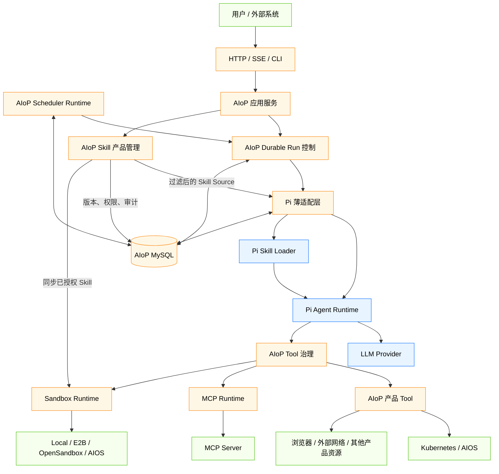
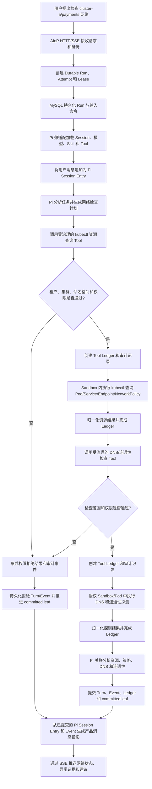
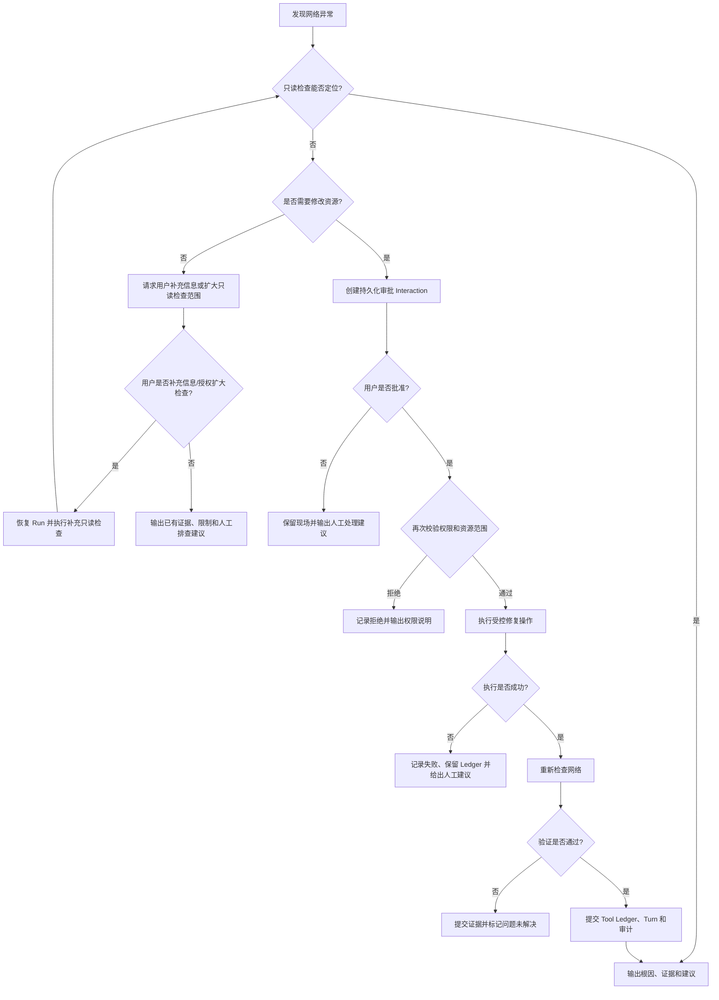

# AIoP Pi 优先 Runtime 重构概要设计

> 本文是《[Pi 优先的 AIoP Runtime 收敛 Implementation Plan](../plans/2026-07-28-pi-first-runtime-refactoring.md)》的简化概设版本，重点说明目标架构、模块边界、典型流程和实施规模，不展开逐文件开发步骤。

**文档状态：** 待评审  
**编写日期：** 2026-07-29  
**目标版本：** Pi 0.82.1

## 1. 背景与目标

当前 AIoP 同时维护 Pi Runtime 和自研 Agent Runtime，模型调用、Agent Loop、会话、上下文压缩、Tool 基础执行及 Skill 加载存在重复实现，增加了维护成本和行为差异。

本次重构采用 **Pi 优先、AIoP 增强** 的原则：

- Pi 负责单次 Agent 会话内的通用执行能力。
- AIoP 保留产品化、分布式运行、治理和基础设施集成能力。
- 不修改或 Fork Pi，只使用其公开 API。
- 保持现有 HTTP API、主要 DTO、MySQL 产品数据和 Web 行为兼容。
- 将现有分散包收敛为职责清晰的 Runtime 包，删除重复实现。

## 2. 设计范围

### 2.1 本次建设内容

1. 引入 Pi Harness、Session、Compaction、Tool 和 Skill 能力作为 Agent 执行核心。
2. 保留 AIoP Durable Run、Attempt、Lease/Fencing、恢复、取消和事件流。
3. 统一 Pi、AIoP、MCP、Sandbox 四类 Tool 的治理和注册链路。
4. 合并现有 Sandbox、Scheduler 和 MCP 实现。
5. 将 Pi Session 投影为现有消息、时间线、SSE 和 Run Center 数据。
6. 删除自研 Agent Loop、重复 Model Gateway、上下文压缩和独立 Skill Runtime。

### 2.2 不在本次范围

- 不修改 Pi 上游源码或维护私有分支。
- 不重做 Run Center 页面。
- 不改变现有认证、租户、权限和审批语义。
- 不引入消息队列、工作流引擎或新的可观测平台。
- 不使用 Pi 替代 AIOS Sandbox、服务端 MCP 管理或 Scheduler。

## 3. Pi 调研

### 3.1 项目信息

查询日期：2026-07-29。

| 项目 | 信息 |
| --- | --- |
| GitHub 仓库 | [earendil-works/pi](https://github.com/earendil-works/pi) |
| 主要维护组织 | Earendil Works（公告署名主体：Earendil Inc. & Contributors） |
| GitHub Star | 80,123（动态数据，以查询时为准） |
| Fork | 9,866（动态数据，以查询时为准） |
| 许可证 | MIT |
| 当前使用版本 | `@earendil-works/pi-agent-core` 0.82.1、`@earendil-works/pi-ai` 0.82.1 |
| Node.js 要求 | `>=22.19.0` |
| 引用原则 | 不 Fork、不修改上游；通过公开 API 集成，并使用薄适配隔离 Pi 类型。 |

Star 和 Fork 来自 GitHub Repository API；版本、许可证和 Node.js 要求来自当前安装包的 `package.json`。

### 3.2 引用模块及功能

| Pi 模块/能力 | AIoP 使用方式 | 替代或减少的自研实现 |
| --- | --- | --- |
| `@earendil-works/pi-ai` Model/Provider | 统一模型定义、Provider 配置、消息、Usage 和流式响应 | 自研 Model Gateway、Provider 适配和通用模型重试逻辑 |
| `AgentHarness` | AIoP 直接使用的单次 Agent 会话统一控制入口 | 自研 Kernel/Harness 编排 |
| `agentLoop()`、`agentLoopContinue()` | 由 `AgentHarness` 内部复用以执行模型与 Tool 循环；AIoP 不直接编排或建立第二条执行路径 | AIoP 第二套 Agent Loop |
| `steer()`、`followUp()`、`appendMessage()` | 运行中追加用户消息和后续指令 | HTTP 层内存 pending queue |
| `abort()` | 响应持久化取消、失租和超时 | 自研会话内取消编排 |
| Session、SessionStorage、Session Tree | 管理消息历史、分支、Leaf 和会话状态 | 自研执行上下文和消息状态机 |
| Compaction、Branch Summary、SessionStats | 管理长上下文压缩、分支摘要和统计 | 自研 Token 裁剪与压缩实现 |
| Tool 参数校验和执行调度 | 校验 Tool 参数、执行调用、产生事件和截断输出 | 通用 Tool Runtime 的重复基础执行能力 |
| `beforeToolCall`、`afterToolCall`、Tool Event | 补充事件、指标和可观测性；真实执行仍由 AIoP `Governed Tool Wrapper` 包围 | 自研通用 Hook/Event 编排 |
| `loadSkills()`、`loadSourcedSkills()` | 发现和加载通过 AIoP 权限过滤后的 Skill | 独立 Skill Runtime 的扫描和加载逻辑 |
| `formatSkillInvocation()`、`formatSkillsForSystemPrompt()` | 生成标准 Skill 调用和 System Prompt 内容 | 自研 Skill Prompt 格式化 |

### 3.3 许可证影响

Pi 使用 MIT License，允许商业使用、修改、分发和私有使用。AIoP 集成时需要：

- 在发行物或第三方许可证清单中保留 Pi 的版权和 MIT License 声明。
- 不暗示 Pi 官方为 AIoP 提供背书。
- 版本升级前检查许可证和依赖树是否发生变化。
- AIoP 自研代码仍使用项目自身许可证，不因引用 Pi 自动变更许可证。

## 4. 总体架构



### 4.1 职责边界

| 层次 | 主要职责 | 实现方式 |
| --- | --- | --- |
| Pi Agent Runtime | 模型调用、Agent Loop、Turn、Session、上下文压缩、Tool 基础执行、Skill 加载 | 引用 Pi |
| Pi 薄适配层 | Harness 创建、消息和事件转换、Session Storage 接入、Skill Loader 调用、兼容投影 | AIoP 薄适配 |
| Durable Run 控制 | Run、Attempt、Lease/Fencing、跨 Worker 消息、取消、恢复和限制 | AIoP 自研 |
| Tool 治理 | RBAC、审批、审计、幂等 Ledger、非幂等恢复和跨 Run 并发 | AIoP 自研 |
| Skill 产品管理 | 导入、版本、审核、启停、可见性、Credential、审计和 Sandbox 同步 | AIoP 自研 |
| 基础设施 Runtime | MCP、Sandbox、Scheduler 及外部平台接入 | AIoP 自研集成 |
| 产品应用层 | HTTP/SSE、Run Center、认证、安全和 Web 控制台 | AIoP 自研 |

### 4.2 核心原则

- **Pi Session 是会话执行事实源**：Agent 消息、上下文分支和压缩由 Pi 管理。
- **AIoP MySQL 是产品控制事实源**：Run、Lease、Attempt、审批、Tool Ledger 和审计由 AIoP 管理。
- **治理先于执行**：所有 Tool 在交给 Pi 前必须经过权限、审批、Ledger、并发和审计包装。
- **提交后可见**：只有完成 Durable Commit 的 Turn 和 Event 才能投影到 SSE 与 Run Center。
- **失租即停止**：Worker 丢失 Lease 后必须终止 Pi 执行，不能继续提交结果。

## 5. 模块设计

| 模块 | 是否自研 | 功能概述 |
| --- | --- | --- |
| `control-contracts` | 是 | 定义身份、Run、Interaction、Tool 治理、事件和领域错误等跨包稳定契约。 |
| `pi-runtime/pi` | 部分；Pi 复用 + AIoP 薄适配 | 创建 Pi Harness，接入模型、Session、Compaction、Tool、Skill，并完成消息和事件 Codec。 |
| `pi-runtime/run` | 是 | 管理 Durable Run、Attempt、Lease/Fencing、跨 Worker 消息、取消、恢复和运行限制。 |
| `pi-runtime/tools` | 部分；治理自研、基础执行复用 Pi | 统一 Policy、审批、Ledger、并发、审计，并将四类 Tool 注册给 Pi。 |
| `pi-runtime/store` | 是 | 提供 Memory/MySQL Store，并实现 Pi Session 的 MySQL 持久化。 |
| `mcp-runtime` | 是 | 基于官方 MCP SDK 管理多租户连接、重连、可见性、Credential、Tool 转换和审计。 |
| `sandbox-runtime` | 是 | 统一 Local、E2B、OpenSandbox、AIOS Sandbox 生命周期和 Tool 接入。 |
| `scheduler-runtime` | 是 | 管理 Cron、任务领取、幂等触发、补偿和 Run 创建，不直接执行 Agent Loop。 |
| `src/agent` | 是 | 提供 Run 应用服务、Run Center、Interaction 和 Pi 数据投影。 |
| `src/tools` | 是 | 实现集群、浏览器、网络、计划、定时任务等产品 Tool。 |
| `src/skill` | 是 | 管理 Skill 导入、版本、安全、权限、凭据和 Sandbox 同步；Pi 的加载、解析和 Prompt 格式化统一由 `pi-runtime/pi` 调用。 |
| `src/auth`、`src/security` | 是 | 认证、租户身份、RBAC、Credential 和密钥保护。 |
| `src/server`、`web/src` | 是 | 提供 HTTP/SSE API、兼容 DTO 和 Web 控制台。 |

## 6. 最终目录树

> “是否自研”说明该目录的主要实现归属；“部分”表示同时包含 Pi 复用和 AIoP 适配或治理代码。

```text
aiop/
├── packages/                                      # 自研：稳定后端子系统
│   ├── control-contracts/                         # 是：控制面跨包契约
│   │   └── src/
│   │       ├── identity.ts                        # 是：租户、用户、角色、资源身份
│   │       ├── run.ts                             # 是：Run/Attempt/Lease 契约
│   │       ├── interaction.ts                     # 是：审批、提问、计划交互契约
│   │       ├── tool.ts                            # 是：Tool capability 与治理契约
│   │       ├── events.ts                          # 是：Durable Event 与 SSE 事件
│   │       ├── errors.ts                          # 是：控制面领域错误
│   │       └── index.ts                           # 是：公共导出
│   ├── pi-runtime/                                # 部分：Pi 接入与 AIoP 分布式增强
│   │   └── src/
│   │       ├── pi/                                # 部分：Pi Harness/Session/Codec 薄适配
│   │       ├── run/                               # 是：Durable Run、Lease、恢复、取消
│   │       ├── tools/                             # 部分：自研治理 + Pi 基础执行
│   │       ├── store/                             # 是：Run Store 与 Pi Session MySQL Storage
│   │       └── index.ts                           # 是：Runtime 公共入口
│   ├── mcp-runtime/                               # 是：多租户 MCP 连接和 Tool 适配
│   │   └── src/
│   │       ├── config.ts                          # 是：MCP 配置和 Credential 引用
│   │       ├── client.ts                          # 是：官方 MCP Client 封装
│   │       ├── connection-manager.ts              # 是：连接复用、健康检查、重连
│   │       ├── visibility.ts                      # 是：租户与用户可见性
│   │       ├── tool-adapter.ts                    # 是：MCP Tool 转 Pi Tool
│   │       ├── audit.ts                           # 是：配置、连接、调用审计
│   │       └── index.ts                           # 是：公共入口
│   ├── sandbox-runtime/                           # 是：统一 Sandbox Runtime
│   │   └── src/
│   │       ├── domain/                            # 是：Sandbox 领域模型
│   │       ├── providers/                         # 是：Local/E2B/OpenSandbox/AIOS Provider
│   │       ├── lifecycle/                         # 是：申请、启动、停止、释放、对账
│   │       ├── profiles/                          # 是：租户资源和 Provider 策略
│   │       ├── templates/                         # 是：AIOS 模板目录
│   │       ├── warm-pool/                         # 是：预热池管理
│   │       ├── user-home/                         # 是：用户目录挂载和清理
│   │       ├── desktop/                           # 是：桌面、截图和浏览器能力
│   │       ├── tool-adapter/                      # 是：Sandbox 能力转 Pi Tool
│   │       └── index.ts                           # 是：公共入口
│   └── scheduler-runtime/                         # 是：定时任务 Runtime
│       └── src/
│           ├── domain/                            # 是：任务和触发领域模型
│           ├── cron/                              # 是：Cron 解析
│           ├── store/                             # 是：任务领取和状态持久化
│           ├── runner/                            # 是：到期扫描并创建 Run
│           ├── recovery/                          # 是：超时回收和漏触发补偿
│           └── index.ts                           # 是：公共入口
├── src/                                           # 是：AIoP 产品应用层
│   ├── index.ts                                   # 是：程序入口
│   ├── runtime.ts                                 # 是：Runtime 装配
│   ├── agent/                                     # 是：Run、Interaction、Projection
│   ├── tools/                                     # 是：kubectl/browser/webfetch 等产品 Tool
│   ├── skill/                                     # 是：Skill 产品管理；Pi 加载由 pi-runtime/pi 调用
│   ├── scheduler/                                 # 是：产品定时任务应用服务
│   ├── auth/                                      # 是：认证与身份
│   ├── security/                                  # 是：RBAC、Credential、密钥保护
│   ├── server/                                    # 是：HTTP、SSE、下载和兼容 DTO
│   ├── db/                                        # 是：Schema、迁移、连接和投影数据
│   ├── audit/                                     # 是：统一审计
│   ├── net/                                       # 是：SSRF 和网络访问限制
│   ├── ops/                                       # 是：错误分类和运维能力
│   └── config/                                    # 是：配置加载和敏感引用
├── web/src/                                       # 是：会话、运行中心、审批和管理 UI
├── tests/                                         # 是：合约、单元、集成、恢复与安全测试
├── scripts/                                       # 是：构建、API 快照和迁移辅助脚本
├── deploy/                                        # 是：部署清单；由 Make target 调用
├── docs/                                          # 是：设计、运维、开发和实施文档
├── dist/                                          # 非源码：临时数据、截图和演练结果
├── bin/                                           # 非源码：编译产物
├── Makefile                                       # 是：构建、镜像、部署、回滚入口
└── package.json                                   # 是：工作区和依赖配置
```

### 6.1 收敛后删除的主要实现

| 当前实现 | 最终处理 |
| --- | --- |
| `agent-kernel-pi`、`agent-runtime-*` | 收敛到 `pi-runtime`，重复 Agent Loop 删除。 |
| `tool-runtime` | 仅治理能力进入 `pi-runtime/tools`，通用执行交给 Pi。 |
| `skill-runtime` | 删除，Skill 加载和格式化直接调用 Pi。 |
| `sandbox-*`、`src/sandbox` | 合并为 `sandbox-runtime`。 |
| `scheduler-*` | 合并为 `scheduler-runtime`。 |
| `src/model`、自研 Model Gateway | 删除，统一使用 Pi Model/Provider。 |
| `src/agent/context.ts` 等自研上下文实现 | 删除，统一使用 Pi Session/Compaction。 |

## 7. 核心数据与运行机制

### 7.1 双事实源

| 数据类型 | 事实源 | 说明 |
| --- | --- | --- |
| Agent 会话、消息树、上下文、压缩结果 | Pi Session | 决定下一次模型调用使用的会话上下文。 |
| Run、Attempt、Lease、Turn Commit | AIoP MySQL | 支持多 Worker 调度、故障恢复和产品查询。 |
| Approval、Question、Plan | AIoP MySQL | 支持持久化等待和跨进程恢复。 |
| Tool Ledger、审计、非幂等恢复状态 | AIoP MySQL | 防止写操作被重复执行。 |
| Web 消息、Timeline、SSE | AIoP Projection | 从已提交的 Pi Session Entry 和 Durable Event 生成。 |

### 7.2 一致性机制

Pi Session 的写入和 AIoP Turn Commit 不能假定天然处于同一事务，因此引入 `committed_leaf_id`：

```text
Pi 执行 Turn
→ 写入 Session Entry 并得到最新 leaf
→ AIoP 提交 Turn、Event、Interaction 和 Tool Ledger
→ 同一事务推进 committed_leaf_id
→ Projection 只读取 committed leaf 可达数据
```

Worker 在 Durable Commit 前退出时，新 Session Entry 视为未提交分支；恢复时从 `committed_leaf_id` 继续，避免未提交消息进入上下文。

### 7.3 Tool 治理链

Tool 注册和每次调用都必须经过明确边界：注册阶段完成名称、能力和 Wrapper 装配；调用阶段由 Wrapper 包围真实执行，Hook/Event 只补充事件和可观测性。

```mermaid
flowchart LR
    Sources[Pi / AIoP / MCP / Sandbox Tool]
    Normalize[名称与 Capability 归一化]
    Wrap[装配 Governed Tool Wrapper]
    Register[Pi AgentHarness.setTools]
    PiCall[Pi 发起 Tool Call]
    Policy[租户、RBAC、资源 Policy]
    Approval[人工审批]
    Ledger[Durable Tool Ledger]
    Limit[跨 Run 并发控制]
    Raw[执行原始 Tool]
    Finish[记录结果/异常与审计]
    Result[Tool Result 返回 Pi]
    PiReceive[Pi 接收结果并继续 Agent Loop]

    Sources --> Normalize --> Wrap --> Register
    Register --> PiCall --> Policy --> Approval --> Ledger --> Limit --> Raw
    Raw --> Finish --> Result --> PiReceive
```



- 同名 Tool 默认拒绝注册，不允许隐式覆盖。
- Tool 治理以 `Governed Tool Wrapper` 为执行边界，确保 Policy、审批和 Ledger 覆盖真实调用。
- 已完成的 Tool 调用优先复用 Ledger 结果。
- 结果不确定的非幂等写操作进入人工恢复，不自动重放。
- Pi Hook 和 Tool Event 仅用于补充事件、指标和审计上下文，不代替治理 Wrapper。
- 所有 Tool 均携带租户、用户、Run 和资源范围上下文。

## 8. 典型场景：AI 助手检查集群网络

### 8.1 场景说明

用户请求：“检查生产集群 `cluster-a` 中 `payments` 命名空间的网络情况。”

AI 助手需要读取集群资源、检查 Pod/Service/Endpoint、执行连通性和 DNS 检查，然后汇总结论。所有操作必须受租户、集群、命名空间和 Tool 权限约束；可能影响业务的写操作必须单独审批。

### 8.2 主流程图



### 8.3 异常和审批分支



### 8.4 场景中的模块分工

| 模块 | 作用 |
| --- | --- |
| Pi | 理解用户意图、制定检查步骤、选择 Tool、分析结果并生成报告。 |
| Durable Run | 保证任务可跟踪、可取消、可恢复，并防止失租 Worker 提交结果。 |
| Tool Governance | 校验用户是否可以访问目标集群和命名空间，管理审批、Ledger、并发和审计。 |
| kubectl/网络 Tool | 执行资源查询、DNS 和连通性检查；不负责自主决策。 |
| Sandbox Runtime | 为需要隔离执行的诊断命令提供受控环境。 |
| MySQL/Projection | 保存运行记录并向 Run Center、Timeline 和 SSE 提供兼容数据。 |

## 9. 工时预估

### 9.1 估算口径

- 单位为人日，包含设计细化、开发、自测、评审和缺陷修复。
- 不包含外部测试环境排队和跨团队审批等待时间。
- 估算基于现有实现可迁移、HTTP API 和数据兼容要求不变。
- 推荐至少配置 2 名后端、1 名测试，平台/安全和前端按阶段参与。

### 9.2 工作量

| 工作包 | 主要角色 | 常规人日 | 可并行性 | 主要风险 |
| --- | --- | ---: | --- | --- |
| 兼容基线、Contracts、构建调整 | 后端 | 5 | 低 | 公共契约遗漏 |
| Pi Harness、Session、Codec | 后端 | 8 | 低 | Pi 与现有消息语义差异 |
| Durable Run、Store、跨 Worker 消息和恢复 | 后端 | 13 | 低 | Fencing、崩溃窗口和竞态 |
| Tool Governance 与产品 Tool 迁移 | 后端/安全 | 10 | 中 | 审批和非幂等副作用 |
| Skill、Model、Context、Projection 收敛 | 后端 | 7 | 中 | 历史消息兼容 |
| MCP Runtime 收敛 | 后端 | 5 | 高 | 多租户连接和 Credential |
| Sandbox Runtime 合并 | 平台/后端 | 10 | 高 | 多 Provider 和 AIOS 外部接口 |
| Scheduler Runtime 合并 | 后端 | 5 | 高 | 多 Worker 重复触发 |
| 应用装配、旧实现删除、前端兼容 | 全栈 | 7 | 低 | 隐式依赖遗漏 |
| 测试、安全、部署与回滚演练 | 测试/安全/运维 | 15 | 中 | 外部环境稳定性 |
| **合计** |  | **85 人日** |  | 不等于自然日 |

### 9.3 周期建议

| 团队配置 | 预计自然周期 | 说明 |
| --- | --- | --- |
| 1 名后端为主 | 16～20 周 | 并行能力有限，关键人员风险高，不推荐。 |
| 2 名后端 + 1 名测试 | 8～10 周 | 推荐配置；MCP、Sandbox、Scheduler 可在契约稳定后并行。 |
| 3 名后端 + 1 名测试 + 平台支持 | 6～8 周 | 需要明确模块负责人和统一集成窗口。 |

关键路径：

```text
兼容契约
→ Pi Session/Codec
→ Durable Run/Tool Governance
→ Projection 与应用装配
→ 故障、安全、部署和回滚验收
```

## 10. 风险与应对

| 风险 | 影响 | 应对措施 |
| --- | --- | --- |
| Pi Session 与 AIoP Turn 提交不天然原子 | 崩溃后可能读取未提交上下文 | 使用 `committed_leaf_id` 水位线，恢复只读取已提交分支。 |
| Pi 接收追加消息后 Worker 崩溃 | 消息可能重复投递 | 使用 Durable Inbox、幂等键和 Session 消费标记对账。 |
| 非幂等 Tool 结果不确定 | 重试可能造成重复变更 | 使用 Durable Tool Ledger；不确定状态进入人工恢复。 |
| 多 Worker 同时执行同一 Run | 重复提交和数据覆盖 | Lease、续租和所有提交均校验 fencing token。 |
| Pi 升级引入接口或行为变化 | Runtime 兼容性回退 | 锁定版本，维护 Codec、Session、Tool、恢复和公共 API 合约测试。 |
| Sandbox/MCP 外部环境不稳定 | 集成验证周期延长 | 使用 Provider 合约测试、Mock 和独立环境验收。 |
| 合包删除遗漏隐式依赖 | 构建或运行失败 | 每阶段同步修改 import、构建脚本、公共 API 快照和测试。 |

## 11. 验收标准

### 11.1 功能验收

- HTTP、CLI、Scheduler 均通过同一 Durable Run 链路调用 Pi。
- Run Center、消息、Timeline、SSE、取消、恢复和审批行为保持兼容。
- Pi、AIoP、MCP、Sandbox Tool 可同时注册并经过统一治理。
- 集群网络检查等只读诊断任务可完整执行并输出证据化结论。
- 写操作必须经过权限判断和审批，非幂等不确定结果不会自动重放。
- Skill 权限和产品管理由 AIoP 控制，加载和格式化由 Pi 完成。

### 11.2 故障和安全验收

- Worker 失租后无法提交 Turn、Tool Ledger 或 Run 终态。
- Worker 崩溃后可从 committed leaf、Durable Inbox 和 Tool Ledger 恢复。
- 租户间不能读取或调用彼此的 Run、Tool、Skill、MCP、Sandbox 和 Credential。
- Approval Resolution 必须匹配租户、Run、Interaction、Tool Call 和等待状态。
- SSRF、Sandbox 路径、Skill ZIP 和 Credential 安全测试通过。

### 11.3 工程验收

- TypeScript 类型检查、后端测试、公共 API 检查和 Web Production Build 通过。
- 镜像通过 `make image` 构建。
- 测试环境通过 Make target 部署和回滚。
- 生产源码中不存在退休包引用、自研 Agent Loop、重复 Model Gateway、重复 Compaction 和独立 Skill Runtime。

## 12. 结论

重构后，AIoP 不再维护第二套通用 Agent Runtime。Pi 负责会话内智能执行，AIoP 聚焦 Durable Run、分布式恢复、权限治理、产品 Tool、MCP、Sandbox、Scheduler 和产品体验。

该架构在降低重复建设的同时保留 AIoP 的企业级能力，并通过薄适配、双事实源、Tool Ledger、Lease/Fencing 和兼容 Projection 控制迁移与运行风险。
