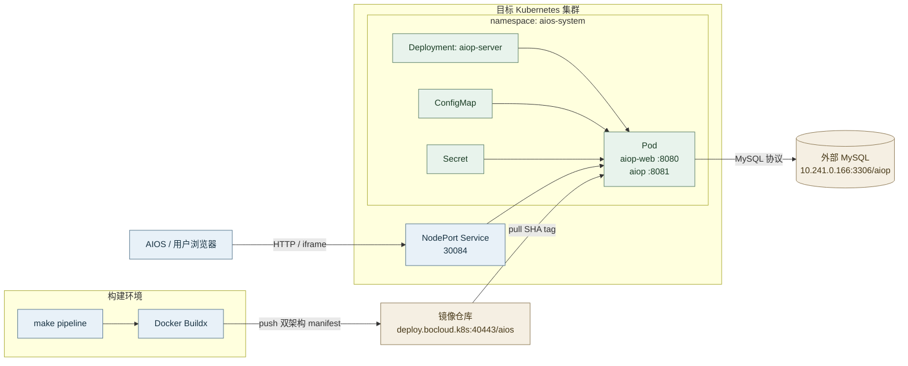
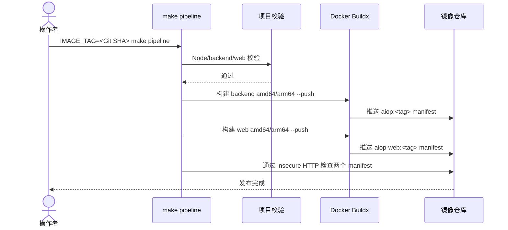
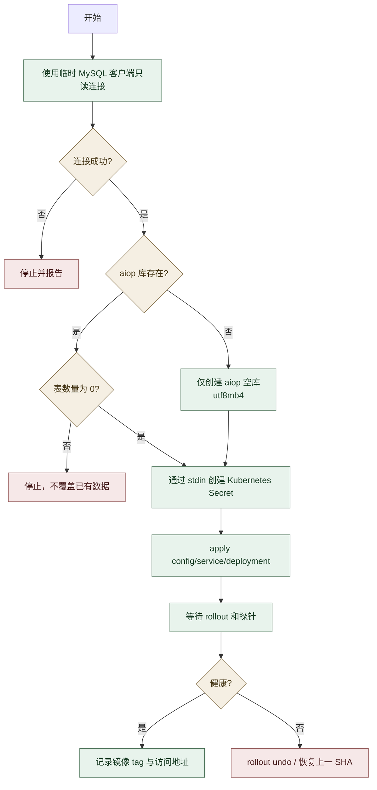

# AIOP 多架构镜像与 10.241.0.166 集群部署设计

## 1. 概述

### 1.1 文档信息

| 项目 | 内容 |
| --- | --- |
| 名称 | AIOP 多架构镜像与外部 MySQL 部署设计 |
| 版本 | v1.0 |
| 日期 | 2026-08-03 |
| 适用范围 | AIOP backend/web 镜像构建、推送及 `10.241.0.166` 集群部署 |
| 状态 | 待确认，尚未实施 |

### 1.2 背景与现状

- `Makefile` 的 `image` 目标只构建本机架构镜像，不推送仓库。
- `deploy/dev-k8s` 面向 `aiop-dev`，会部署内置 MySQL 和 Dex；数据库名仍为 `ai_ops`，NodePort `30083` 已被目标集群占用。
- 后端在设置 `MYSQL_HOST` 后使用 `MysqlStore` 并在启动时串行执行 `src/db/migrations/0001_baseline.sql`；未设置时使用内存存储。
- 目标集群当前只有 amd64 节点；部署使用现有 `aios-system` namespace，当前未发现 AIOP 工作负载；镜像仓库以 HTTP/insecure registry 提供服务。
- 外部 MySQL `10.241.0.166:3306` TCP 可达，但尚未执行登录、建库、迁移或数据写入。

### 1.3 设计目标与非目标

目标：

1. `make pipeline` 一次构建并推送 backend/web 的 amd64、arm64 镜像。
2. 默认数据库名统一为 `aiop`，生产部署连接外部 MySQL。
3. 使用指定 kubeconfig 将不可变版本部署到目标集群，并验证 rollout 和健康检查。
4. 数据库操作遵循“只读预检、空库初始化、已有数据停止”的保护策略。
5. 所有构建、部署和回滚入口通过 Make 命令提供。

非目标：

- 不改造 AIOP 业务表结构或迁移内容。
- 不在本次创建 MySQL 专用业务账号或调整远端 MySQL 权限。
- 不部署内置 MySQL、Dex、Ingress、TLS 或高可用副本。
- 不在本次实现 AIOS JWT/用户体系对接；该内容由独立设计覆盖。

### 1.4 关键决策

| 决策 | 原因 | 影响 |
| --- | --- | --- |
| namespace 使用 `aios-system` | AIOP 将作为 AIOS 平台内嵌组件部署，由用户明确指定 | 与现有 AIOS 组件共享 namespace，资源统一使用 `aiop-*` 前缀避冲突 |
| NodePort 使用 `30084` | `30083` 已被占用，`30084` 当前未发现冲突 | 访问地址拟为 `http://10.241.0.166:30084/` |
| 镜像 tag 默认 Git short SHA | 可追踪、可回滚，避免只依赖可变 `latest` | 部署必须使用同一个明确 tag |
| `pipeline` 使用 buildx `--push` | 多架构 manifest 需要由 registry 汇聚 | 构建机须支持 buildx、QEMU 和仓库登录 |
| 生产部署只使用外部 MySQL | 避免集群内重复维护数据库 | 不 apply `deploy/dev-k8s/mysql.yaml` |
| 数据库有表时停止初始化 | 防止误覆盖已有库 | 需人工确认后才能继续迁移/复用 |
| Secret 不落盘 | 避免凭据进入 Git、shell 历史和临时文件 | 通过环境变量和 stdin 创建/更新 |

## 2. 系统架构

### 2.1 技术选型

| 技术 | 版本/基线 | 使用方式 | 前置条件 |
| --- | --- | --- | --- |
| Docker Buildx | 当前环境 v0.30.1 | 构建 `linux/amd64,linux/arm64` 并直接 push | builder 支持两种平台；daemon 已配置 insecure registry |
| Kubernetes | 目标集群实际版本以部署前只读检查为准 | Deployment、Service、ConfigMap、Secret | 使用指定 kubeconfig，账号具有必要权限 |
| MariaDB/MySQL | 目标实际为 MariaDB 10.2.33 | AIOP 持久化存储，schema 为 `aiop` | baseline 使用兼容的 `utf8mb4_unicode_ci`；凭据由部署环境注入 |
| Node.js | 镜像基线 Node 24 | backend 与 web 构建阶段 | 基础镜像提供 amd64/arm64 manifest |
| nginx | 镜像基线 1.27-alpine | web 静态资源和 backend 反向代理 | 基础镜像提供 amd64/arm64 manifest |

### 2.2 部署架构图



| 模块 | 负责 | 是否自研 |
| --- | --- | --- |
| `make pipeline` | 统一校验、构建 backend/web 双架构镜像并推送 | **是。** 固化项目发布规则、镜像命名和失败语义 |
| Docker Buildx | 跨架构构建和 OCI manifest 发布 | **否。** 复用 Docker 官方构建能力 |
| 镜像仓库 | 保存 AIOP 镜像及 manifest | **否。** 使用现有企业镜像仓库 |
| `aiop-server` Deployment | 编排 web/backend 容器、探针、资源和配置 | **是。** 承载 AIOP 的部署边界和运行约束 |
| 外部 MySQL | 持久化 AIOP 业务数据 | **部分自研。** MySQL 为外部组件，表结构和 Store/迁移由 AIOP 维护 |

### 2.3 部署单元划分

- `aiop-web`：nginx 容器，对外监听 8080，提供静态页面并代理 backend。
- `aiop`：Node.js 容器，对内监听 8081，负责 API、SSE、调度器和数据库迁移。
- `aiop-server`：单 Pod 双容器 Deployment，保持当前 localhost 代理模型。
- `aiop-server-nodeport`：将 web 8080 暴露为节点端口 30084。
- `aiop-skills`：使用 `nfs-csi` 的 5Gi RWX PVC，保存上传和治理后的技能数据。
- 外部 MySQL：不属于 Kubernetes namespace 生命周期，不由 AIOP 清单创建或删除。

### 2.4 目录树与变更标记

```text
aiop/
├── Dockerfile                         # backend 多阶段镜像
├── Makefile                           # 【修改】增加 pipeline、部署、回滚入口
├── deploy/                            # Kubernetes/OpenSandbox 部署资源
│   ├── dev-k8s/                       # 开发环境清单
│   │   ├── aiop-secret.example.yaml   # 【修改】默认数据库名改为 aiop
│   │   └── mysql.yaml                 # 【修改】开发 MySQL 默认库名改为 aiop
│   ├── k8s/                           # 通用生产清单
│   │   └── secret.example.yaml        # 【修改】默认数据库名改为 aiop
│   └── aiop/                          # 【新增】10.241.0.166 目标部署清单
│       ├── configmap.yaml             # 【新增】运行配置
│       ├── deployment.yaml            # 【新增】双容器 Deployment
│       ├── pvc-skills.yaml             # 【新增】技能持久化 RWX PVC
│       ├── service-nodeport.yaml      # 【新增】NodePort 30084
│       └── README.md                  # 【新增】Secret、部署和回滚说明
├── docs/                              # 产品和工程文档
│   └── superpowers/
│       ├── specs/                     # 【新增】本设计文档
│       └── plans/                     # 【新增】本次开发计划
├── packages/                          # workspace 运行时与契约包
├── scripts/                           # 构建、校验和运维脚本
├── skills/                            # 内置技能
├── src/                               # backend 源码、Store 与迁移
│   └── db/migrations/0001_baseline.sql # 现有空库基线，不修改
├── tests/                             # backend 与部署契约测试
└── web/
    ├── Dockerfile                     # web 多阶段镜像
    └── src/                           # 前端源码
```

## 3. 核心流程

### 3.1 构建与发布时序



任一步失败即返回非零；不执行 Kubernetes 部署。默认不推送 `latest`，避免不可变发布证据被覆盖。

### 3.2 数据库保护与部署流程



### 3.3 业务规则

1. 禁止执行 `DROP DATABASE`、`DROP TABLE`、`TRUNCATE` 和无范围数据更新。
2. 数据库不存在时只创建 `aiop`；存在且有表时停止，由用户决定复用、备份或换库。
3. AIOP 只允许对空库自动执行当前 baseline migration。
4. 数据库密码不写入 YAML、设计文档、`dist`、命令输出或 Git。
5. 部署前检查 tag 对应的 backend/web 多架构 manifest 均存在。
6. rollout 失败不变更数据库 schema；应用回滚到上一镜像版本。首次部署失败则删除/缩容 AIOP 工作负载，不删除 `aios-system` namespace、Secret 或数据库。

## 4. 数据库与配置设计

本次不新增或修改业务表。`src/db/migrations/0001_baseline.sql` 仍是空库唯一 schema 来源。

| 配置 | 目标值/来源 | 说明 |
| --- | --- | --- |
| `MYSQL_HOST` | `10.241.0.166` | 外部 MySQL 地址 |
| `MYSQL_PORT` | `3306` | MySQL 端口 |
| `MYSQL_DATABASE` | `aiop` | 新默认数据库名 |
| `MYSQL_USER` | Kubernetes Secret | 当前按用户指定账号注入，后续建议改为最小权限账号 |
| `MYSQL_PASSWORD` | Kubernetes Secret | 只从进程环境读取 |
| `MYSQL_SSL` | 部署前核实；内网暂按 `false` | 若服务端支持 TLS，应改为 `true` |
| `MYSQL_POOL_SIZE` | `10` | 延续当前示例默认值 |

迁移事务边界沿用现有实现：应用启动获取连接级 advisory lock，逐个执行未记录 migration，并写入 `schema_migrations`。目标服务实际为 MariaDB 10.2.33，因此 fresh baseline 的表级排序规则使用 MySQL/MariaDB 均支持的 `utf8mb4_unicode_ci`。建库不与应用 migration 放在同一事务中；建库成功但应用启动失败时保留空库，禁止自动删除。

## 5. Interface 与命令设计

### 5.1 Make 命令

| 命令 | 主要参数 | 说明 |
| --- | --- | --- |
| `make pipeline` | `IMAGE_TAG`、`IMAGE_PREFIX`、`PLATFORMS` | 校验、构建并推送双架构 backend/web 镜像 |
| `make deploy-aiop` | `KUBECONFIG`、`IMAGE_TAG` | 使用明确 tag 部署到目标集群 |
| `make rollback-aiop` | `KUBECONFIG`、`ROLLBACK_REVISION` | 回滚 Deployment 并等待稳定 |

默认变量：

```make
IMAGE_PREFIX ?= deploy.bocloud.k8s:40443/aios
IMAGE_TAG ?= $(shell git rev-parse --short HEAD)
PLATFORMS ?= linux/amd64,linux/arm64
KUBECONFIG ?= /home/lb/.kube/config-10.241.0.166
```

`pipeline` 的目标镜像为：

- `deploy.bocloud.k8s:40443/aios/aiop:<IMAGE_TAG>`
- `deploy.bocloud.k8s:40443/aios/aiop-web:<IMAGE_TAG>`

### 5.2 Kubernetes 配置契约

Deployment 只引用 `aios-system/aiop-secrets`，不声明 `stringData`。部署前由操作者通过 stdin 创建 Secret，最少包含数据库连接、JWT 密钥、设置加密密钥和模型 API key。配置缺失时 Deployment 应失败而不是回退到内存存储。

本次不新增 HTTP API。对外入口仍是 NodePort Service 的 HTTP 80，backend API 由 web 容器反向代理。

## 6. 非功能设计

- **安全：** Secret 不落盘、不打印；部署日志只显示 Secret 名。当前 root 数据库账号是用户指定的过渡配置，投产前建议创建仅对 `aiop.*` 有必要 DDL/DML 权限的账号。
- **可靠性：** 使用不可变 SHA tag、readiness/liveness probe、Deployment rollout history 和显式回滚命令。
- **可观测性：** 记录构建 tag、manifest 平台、rollout 状态、Pod 状态和 `/healthz`、`/readyz` 结果；不记录敏感环境变量。
- **容量：** 首期单副本、backend 1 CPU/1 GiB、web 200m/128 MiB，沿用现有开发基线。并发和容量测试后再调整。
- **兼容性：** 双架构镜像必须同时包含 amd64/arm64；目标集群实际拉取 amd64。基础镜像任一架构缺失时 pipeline 失败。
- **回滚：** 应用可回滚镜像；数据库 baseline 建表属于前向操作，不自动删除。若未来 migration 不向后兼容，必须先备份并单独设计数据库回滚。

## 7. 开源组件引用情况

本次不新增应用依赖，仅使用现有基础设施工具。

| 组件 | 版本 | 功能 | Star | License | 选择原因 | 风险与隔离方式 |
| --- | --- | --- | --- | --- | --- | --- |
| Docker Buildx | v0.30.1（当前环境） | 多架构构建与 manifest 推送 | 待核实（2026-08-03） | Apache-2.0 | 当前 Docker 原生构建插件 | 锁定构建机版本并检查 manifest |
| Kubernetes | 集群版本部署前核实 | 工作负载编排与回滚 | 不适用 | Apache-2.0 | 目标运行平台 | 清单限制 namespace，写操作前 diff |
| MySQL | 服务端版本部署前核实 | 持久化 | 不适用 | GPL-2.0-only（Community） | 项目现有 `mysql2`/Kysely 实现 | 外部托管、备份、最小权限、禁止破坏性 SQL |

## 8. 实施建议

1. 先修改 Makefile、默认数据库名和独立部署清单，运行静态测试与镜像单架构冒烟。
2. 执行 `make pipeline`，检查两个镜像均含 amd64/arm64 manifest。
3. 对 MySQL 只读预检；仅当 `aiop` 不存在时创建空库，存在且有表则停止。
4. 使用 stdin 创建 Secret，执行 `make deploy-aiop`，验证 rollout、探针和 NodePort。
5. 记录部署 tag 和验证结果；失败时执行 `make rollback-aiop`，不删除数据库。

## 9. 工时估算

| 工作包 | 主要角色 | 常规估算（人日） | 估算说明 |
| --- | --- | --- | --- |
| Makefile 与多架构流水线 | 开发 | 0.5 | 含 buildx 参数、manifest 校验和本地验证 |
| Kubernetes 清单与外部 MySQL 配置 | 开发/运维 | 0.5 | 含 Secret 契约、NodePort 和探针 |
| 构建、推送、部署与验收 | 开发/测试 | 0.5 | 含数据库安全预检、rollout 和回滚演练 |

合计 1.5 人日。包含开发、自测、镜像构建、测试集群部署和一次回滚验证；不包含镜像上传和集群调度的自然等待时间。置信度中等，复估节点为 MySQL 版本/库状态预检完成后。

## 10. 风险、回滚与待确认事项

- namespace 已按用户要求确定为 `aios-system`；NodePort 默认采用当前未发现冲突的 `30084`。
- 远端 MySQL 的版本、`aiop` 库状态、字符集和账号权限尚未核实；实施阶段先只读检查。
- 仓库为 HTTP/insecure registry；构建机已配置，但新增节点需同步配置。
- 若数据库已有业务表，实施必须暂停，不能直接启动 AIOP migration。
- 若首次部署失败，无历史 revision 可回滚，则保留资源并将 Deployment 缩容为 0 或修复后重发；不得删除数据库。
