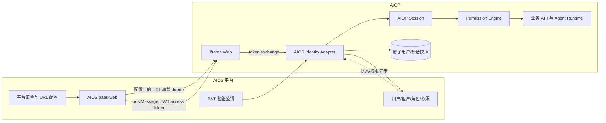
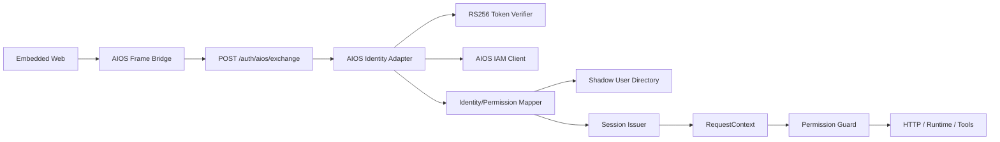
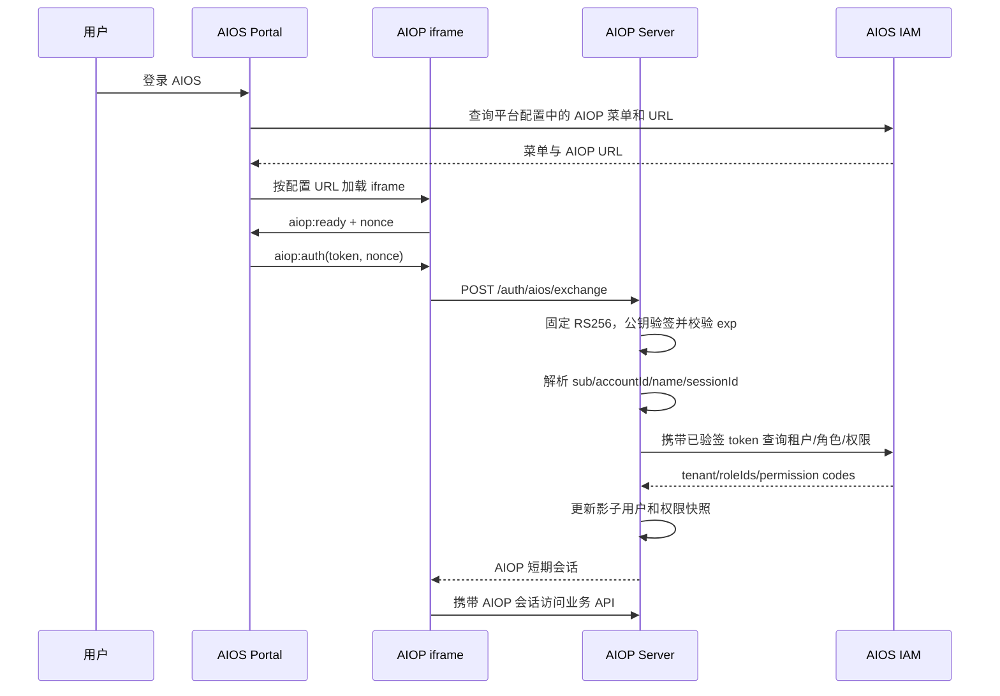
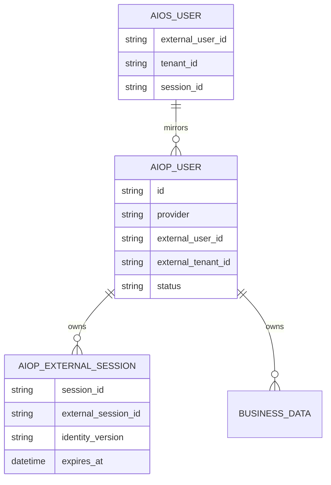

# AIOS 统一身份与 iframe 集成设计

## 1. 概述

### 1.1 文档信息

| 项目 | 内容 |
| --- | --- |
| 名称 | AIOS 统一身份与 iframe 集成设计 |
| 版本 | v0.1 |
| 日期 | 2026-08-03 |
| 状态 | 待评审 |
| 范围 | AIOS 宿主、AIOP iframe、认证、用户、租户、角色、权限、会话与退出 |

### 1.2 结论

AIOS 应作为 AIOP 的唯一身份、用户状态、租户、角色和权限权威源。AIOP 只保留业务数据关联所需的“影子用户”，不再提供生产环境本地建号、改角色、禁用或删除用户的能力。

嵌入入口和登录方式按 AIOS 现有机制对接：AIOS 前端从平台配置查询 AIOP 菜单与 URL，加载 AIOP iframe，并把当前用户的 AIOS JWT access token 传递给 AIOP。AIOP 服务端固定按 `RS256` 验签并解析 `sub`、`accountId`、`name`、`sessionId`、`exp`，再签发短期 AIOP 会话。token 只通过受控的 `postMessage` 消息和 HTTPS 请求体传递，不进入 URL，也不传递 refresh token。

现有代码已有 AIOS token exchange、JIT 用户、iframe CSP 和凭据加密能力，可以复用，但现有设计仍把 AIOS 当作 Local/OIDC 之外的附加登录渠道，并把 AIOS 角色压缩为 `tenant_admin/user`。这与“整个用户体系使用 AIOS”不一致，需要调整权威边界和授权模型。

### 1.3 已核对事实

#### AIOP 当前实现

- `src/auth/aios.ts`：接收 AIOS token，通过 userinfo/JWKS 校验，JIT 创建本地用户，再签发 AIOP JWT。
- `src/config/schema.ts`：`auth.provider` 仍为 `local/oidc`，`auth.aios` 是附加通道；AIOS 角色只按 `adminRoles` 映射为 `tenant_admin/user`。
- `src/auth/rbac.ts`：授权只依赖 `platform_admin/tenant_admin/user` 三种本地角色。
- `src/auth/admin.ts`、`src/auth/lifecycle.ts`、`/v1/admin/users`：AIOP 仍可本地建号、改用户状态和软删除用户。
- `web/src/App.tsx`：iframe 使用 `postMessage` 传递 token，但发送目标是 `*`，接收端未校验 `event.origin` 和 `event.source`；AIOP JWT 写入 `localStorage`。
- `users` 表仍保存 `password_hash`、本地 `role/status`；可继续作为业务外键锚点，但不能继续作为 AIOS 用户权威数据。
- 运行态部分设置仍以 `default` 租户单实例加载，多 AIOS 租户接入前必须明确一期是否单租户。

#### AIOS 现场只读核对

- 登录流程：`POST /paas-web/upmstreeapi/login` 返回一次性 code，再由 `GET /paas-web/upmstreeapi/accessToken?code=...` 返回 `token`、`refreshToken`、`expiredTime` 和 `sessionId`。
- 用户信息包含稳定数字 id、登录名和显示名；当前账号为 `id=1`、登录名 `boc`、显示名 `bocAdmin`。
- `GET /paas-web/upmstreeapi/tenants/account` 返回租户、账号和 `roleIds`；当前上下文为租户 `id=0`、名称 `Platform`、`roleIds=[1]`。
- `GET /paas-web/upmstreeapi/bocPortal/getMenus?roleIds=...` 返回角色对应菜单树；浏览器还维护资源权限集合，当前账号约 253 个权限项。
- AIOS 已使用 `/bcc/#/external/frame/...` 承载外部 iframe 菜单，可由 AIOS 侧注册 AIOP 入口。

#### AIOS JWT 参考实现核对

- 参考项目：`/opt/develop/aios/aios-common-server/pkg/common/jwt.go`。
- JWT header 使用 `RS256`；payload 字段为 `sub`、`accountId`、`name`、`sessionId`、`exp`。
- `sub` 是登录账号，`accountId` 是稳定用户 id，`name` 是显示名，`sessionId` 是 AIOS 登录会话，`exp` 是秒级过期时间。
- 参考项目当前默认 `ParseAuthToken` 只解析 JWT 三段，源码明确写有 `Check signature // skip ...`，且没有完成可信的过期校验。
- AIOP 只参考其 claims 结构，不能复制“仅 Base64 解码”的安全语义；AIOP 必须固定 `alg=RS256`、使用 AIOS 可信公钥验签并校验 `exp`。
- 当前 JWT 不包含 tenant、roleIds 或 permission codes；这些信息仍需由 AIOP 使用已验签 token 调用 AIOS 正式接口获取，或由 AIOS 后续扩展可信 claims。

### 1.4 目标与非目标

目标：

1. 用户只登录 AIOS，进入 AIOP iframe 时无感完成认证。
2. 用户、租户、角色、权限和账号状态均以 AIOS 为准，AIOP 不产生冲突的管理入口。
3. AIOP 业务数据仍稳定关联用户，AIOS 展示名或角色变化不破坏历史数据。
4. AIOS 会话退出、过期、禁用或权限变化能在可控时间内作用于 AIOP。
5. iframe、token、消息来源和跨系统调用具备明确安全边界与审计。

非目标：

- 不改造 AIOS 自身账号、角色和权限中心。
- 不让 AIOP 直接写 AIOS 用户或角色数据。
- 不在本方案中实现代码、部署或 AIOS 菜单注册。
- 不把 AIOS 的全部菜单资源原样复制为 AIOP 权限；只映射 AIOP 需要的能力。

### 1.5 关键决策

| 决策 | 选择 | 原因与影响 |
| --- | --- | --- |
| 身份权威 | AIOS 唯一权威 | AIOP 用户表降级为影子目录和业务外键锚点 |
| 嵌入认证 | AIOS 前端传递当前 JWT access token | 符合 AIOS 已确定机制；AIOP 验签后换发自身短会话 |
| JWT 校验 | RS256 公钥验签 | 仅解析 payload 不能证明 token 由 AIOS 签发 |
| AIOP 会话 | AIOP 签发短期会话 | 业务 API 不必每次直连 AIOS，同时保留短时失效边界 |
| 授权 | AIOS 权限映射到 AIOP permission | 不再只依赖粗粒度三角色；保留派生 role 兼容现有代码 |
| 用户同步 | 登录时同步为主，事件/定时同步为辅 | 首期可落地，后续可缩短禁用和权限变更传播时间 |
| 用户管理 UI | AIOS 模式隐藏写操作并跳转 AIOS 权限中心 | 避免双写和权威冲突 |
| 生产登录 | 禁用 Local/OIDC 正常入口 | 仅保留默认关闭、受审计的运维破窗机制 |

## 2. 系统架构

### 2.1 系统架构图



| 模块 | 负责 | 是否自研 |
| --- | --- | --- |
| AIOS paas-web | 查询 AIOP 菜单/URL、加载 iframe、传递当前 JWT 和处理退出 | **否。** AIOS 现有能力；AIOP 只约定接入协议 |
| AIOS IAM | 用户、租户、角色、权限和账号状态权威数据 | **否。** AIOS 现有能力；禁止 AIOP 双写 |
| AIOS Identity Adapter | JWT 验签、claims 解析、身份拉取、字段规范化和权限映射 | **是。** 属于 AIOP 与 AIOS 的稳定隔离层 |
| AIOP Session | 短期会话签发、续期、撤销和 AIOS session 绑定 | **是。** 负责 AIOP API 的认证与失效边界 |
| Permission Engine | AIOS 权限到 AIOP permission 的映射和服务端鉴权 | **是。** AIOP 必须掌握自身业务动作语义 |
| 影子用户目录 | 保存外部稳定 id、显示快照、同步版本和业务外键 | **是。** 只缓存，不成为身份权威 |
| 业务 API 与 Runtime | 按身份上下文隔离会话、技能、任务、沙箱和审计 | **是。** 延续现有 AIOP 业务边界 |

### 2.2 程序架构图



### 2.3 代码落点目录树

以下为本次范围内的完整相关目录，不展开无关 Agent 内核和 Sandbox Provider：

```text
src/
├── auth/                              # 认证、会话、用户生命周期和授权
│   ├── aios.ts                       # 【修改】改为 AIOS 唯一身份 Adapter
│   ├── provider.ts                   # 【修改】明确生产 provider=aios
│   ├── session.ts                    # 【修改】绑定 AIOS session/identity version
│   ├── types.ts                      # 【修改】增加 external identity 与 permissions
│   ├── rbac.ts                       # 【修改】从角色矩阵迁移为 permission guard
│   ├── admin.ts                      # 【修改】AIOS 模式禁止本地用户写操作
│   ├── lifecycle.ts                  # 【修改】只处理 AIOS 同步结果和业务善后
│   └── credentials.ts                # 【修改】仅按 exp 加密缓存 access token，不接收 refresh token
├── config/
│   └── schema.ts                     # 【修改】AIOS 权威模式与端点/映射配置
├── db/
│   ├── migrations/0001_baseline.sql  # 【修改】影子用户和外部会话字段
│   ├── schema.ts                     # 【修改】数据库类型
│   ├── store.ts                      # 【修改】身份快照与会话 Port
│   ├── memory.ts                     # 【修改】内存实现
│   └── mysql.ts                      # 【修改】MySQL 实现
├── server/
│   ├── context.ts                    # 【修改】权限上下文与会话状态校验
│   └── http.ts                       # 【修改】exchange、logout、用户只读接口
└── runtime.ts                        # 【修改】装配 AIOS-only provider
web/
├── src/
│   ├── App.tsx                       # 【修改】严格 origin 的 iframe 握手与退出
│   ├── api.ts                        # 【修改】会话仅内存持有/失效处理
│   └── types.ts                      # 【修改】permissions 和只读用户模型
└── nginx.conf                        # 【修改】CSP 与嵌入响应头
tests/
└── aios-integration.test.ts          # 【修改】AIOS-only、权限、失效和消息来源测试
deploy/
├── dev-k8s/                          # 【修改】测试环境 AIOS 配置
└── k8s/                              # 【修改】生产 CSP、Secret 和配置示例
docs/
├── design/06-auth-security-tenancy.md # 【修改】同步最终设计
└── superpowers/
    ├── specs/                         # 本设计文档
    └── plans/                         # 对应开发计划
```

## 3. 核心流程

### 3.1 推荐登录时序



规则：

- `postMessage` 必须校验 `event.origin`、`event.source === window.parent`、消息 nonce 和协议版本。
- AIOS 父页面和 AIOP iframe 都使用精确 `targetOrigin`，禁止 `*`。
- AIOS JWT 只能放消息体和 `/auth/aios/exchange` 的 HTTPS 请求体，禁止放 query、fragment、cookie、日志或错误信息。
- AIOP Web 不保存 AIOS refresh token；AIOP JWT 优先只放内存，刷新页面后重新握手。
- AIOP JWT 过期时间不得晚于 AIOS JWT 的 `exp`，建议最长 15～30 分钟；续期时重新向 AIOS 父页面请求当前 token。

### 3.2 JWT 解析与校验规则

参考 `aios-common-server/pkg/common/jwt.go` 定义以下 claims：

| claim | AIOP 用途 | 校验规则 |
| --- | --- | --- |
| `sub` | AIOS 登录账号快照 | 必填，但不作为业务主键 |
| `accountId` | AIOS 稳定用户 id | 必填，作为影子用户外部唯一标识 |
| `name` | 用户显示名快照 | 可空，不参与授权 |
| `sessionId` | AIOS 登录会话 id | 必填，用于审计、续期和撤销关联 |
| `exp` | AIOS JWT 过期时间 | 必填，必须晚于当前时间并限制时钟偏差 |

AIOP 必须使用 `jose.jwtVerify` 完成以下检查：

1. JWT 必须恰好三段，header 的 `alg` 必须为 `RS256`；拒绝 `none`、HMAC、算法降级和未知 `crit`。
2. 使用 AIOS 官方提供并由运维配置的 RSA 公钥或 JWKS 验签；公钥轮换期间允许当前、下一把公钥并存。
3. 校验 `exp`，建议只允许不超过 60 秒的时钟偏差；缺少或过期直接返回 401。
4. 校验 `accountId`、`sub`、`sessionId` 的类型与非空约束；不信任浏览器额外传入的用户字段。
5. 若 AIOS 能提供 `iss`、`aud`，同时强制校验；当前参考 token 未包含这两个字段，应列入平台后续增强项。

参考项目的 `ParseAuthTokenByBase64` 只能用于说明 payload 字段，不能作为 AIOP 的认证实现。其 `ParseAuthTokenBySignature` 也不能直接移植：RS256 验签需要 RSA 公钥，不能使用源码中的普通 `[]byte TokenSecret`。

### 3.3 权限变化与退出

- 登录和续期时重新拉取角色/权限，权限快照不得仅在首次建号时固定。
- AIOP 高风险动作在执行前可按 `identityVersion` 或权限快照 TTL 做二次校验。
- AIOS 父页面发送 `aiop:logout` 后，iframe 清理内存会话并调用 AIOP logout/revoke。
- AIOP 会话记录绑定 AIOS `sessionId`；AIOS 提供 webhook 或 session introspection 后，可主动撤销同 session 的全部 AIOP 会话。
- 没有主动通知能力时，以短 AIOP JWT TTL 作为最大失效窗口，建议不超过 30 分钟。

## 4. 身份、角色与权限模型

### 4.1 核心 Interface

```typescript
export interface ExternalIdentity {
  provider: 'aios';
  externalUserId: string;
  loginName: string;
  displayName: string;
  tenantId: string;
  tenantName?: string;
  projectId?: string;
  roleIds: string[];
  permissionCodes: string[];
  sessionId: string;
  identityVersion: string;
  expiresAt: Date;
}

export interface AiosJwtClaims {
  sub: string;
  accountId: string;
  name?: string;
  sessionId: string;
  exp: number;
}

export interface AiosIdentityPort {
  verifyAndResolve(input: { token: string }, signal?: AbortSignal): Promise<ExternalIdentity>;
  introspect?(sessionId: string, signal?: AbortSignal): Promise<'active' | 'revoked'>;
}

export interface AuthorizationContext {
  tenantId: string;
  userId: string;
  externalUserId: string;
  role: 'platform_admin' | 'tenant_admin' | 'user';
  permissions: ReadonlySet<string>;
  identityVersion: string;
  externalSessionId: string;
}
```

### 4.2 权限映射

AIOS 的 `roleIds` 用于角色归属和审计，实际 AIOP 授权优先使用 AIOS 资源权限码映射。建议新增显式配置，不按菜单中文名判断：

```json
{
  "auth": {
    "provider": "aios",
    "aios": {
      "permissionMap": {
        "aiop.user.read": ["user:read"],
        "aiop.settings.manage": ["tenant:manage"],
        "aiop.ops.write": ["cluster:write", "approve"],
        "aiop.audit.read": ["audit:read"]
      },
      "roleMap": {
        "1": "platform_admin"
      }
    }
  }
}
```

最终权限以服务端 permission guard 为准。派生 `role` 只兼容现有菜单和少量角色判断，不再作为唯一授权依据。未映射权限默认拒绝。

### 4.3 用户管理边界

- AIOP 用户列表可保留为只读“已使用 AIOP 的 AIOS 用户”视图。
- 新建、修改角色、禁用、恢复、删除按钮在 AIOS 模式移除；提供“前往 AIOS 权限中心”链接。
- AIOS 用户被禁用或删除后，AIOP 将影子状态同步为 disabled、撤销会话、清除下游凭据、暂停其定时任务，但保留历史会话和审计归属。
- AIOS 同一稳定 user id 再次启用时复用原 AIOP `user_id`；不得以可变显示名作为关联键。

## 5. 数据库设计

### 5.1 概念模型



#### 表名：users（影子用户，调整）

| 字段名 | 类型 | 可空 | 默认值 | 说明 |
| --- | --- | --- | --- | --- |
| id | VARCHAR(64) | N | - | AIOP 内部稳定主键，业务表继续引用 |
| tenant_id | VARCHAR(64) | N | - | AIOP 隔离键，取 AIOS tenant id 的规范化值 |
| auth_provider | VARCHAR(16) | N | aios | 生产固定为 aios |
| external_user_id | VARCHAR(128) | N | - | AIOS 稳定用户 id |
| username | VARCHAR(128) | N | - | AIOS 登录名快照，仅展示/检索 |
| display_name | VARCHAR(128) | Y | NULL | AIOS 显示名快照 |
| role | VARCHAR(32) | N | user | 兼容用派生角色，不是权威源 |
| status | VARCHAR(16) | N | active | AIOS 状态镜像 |
| identity_version | VARCHAR(128) | N | - | 权限/身份快照版本 |
| last_synced_at | DATETIME(3) | N | - | 最近同步时间 |

| 索引名 | 类型 | 字段 | 说明 |
| --- | --- | --- | --- |
| uq_users_external | 唯一 | auth_provider, external_tenant_id, external_user_id | 防止同一 AIOS 用户重复 JIT |
| idx_users_tenant_status | 普通 | tenant_id, status | 用户只读列表和状态检查 |

`password_hash` 在新基线中改为可空或删除；AIOS 用户不再写哨兵口令。若必须兼容短期过渡，字段保留但生产路径不得读取。

#### 表名：external_auth_sessions（新增）

| 字段名 | 类型 | 可空 | 默认值 | 说明 |
| --- | --- | --- | --- | --- |
| id | VARCHAR(64) | N | - | AIOP 会话 id |
| tenant_id | VARCHAR(64) | N | - | 租户隔离键 |
| user_id | VARCHAR(64) | N | - | AIOP 影子用户 id |
| provider | VARCHAR(16) | N | aios | 外部认证源 |
| external_session_id | VARCHAR(128) | N | - | AIOS sessionId |
| identity_version | VARCHAR(128) | N | - | 会话签发时身份版本 |
| permission_snapshot | JSON | N | - | 规范化后的 AIOP 权限快照 |
| expires_at | DATETIME(3) | N | - | 会话过期时间 |
| revoked_at | DATETIME(3) | Y | NULL | 主动撤销时间 |
| last_verified_at | DATETIME(3) | N | - | 最近与 AIOS 核验时间 |

| 索引名 | 类型 | 字段 | 说明 |
| --- | --- | --- | --- |
| idx_external_session | 普通 | provider, external_session_id, revoked_at | AIOS 登出/撤销传播 |
| idx_user_active_session | 普通 | tenant_id, user_id, revoked_at, expires_at | 用户会话检查 |

事务边界：AIOS JWT 验签、过期校验及租户/权限解析成功后，在一个数据库事务中 upsert 影子用户并创建外部会话记录；事务成功后才签发 AIOP JWT。同一 AIOS `sessionId + accountId` 可重复进入 iframe，但不得生成相互冲突的用户身份。

## 6. HTTP 与消息契约

| 接口 | 方法 | 认证 | 说明 |
| --- | --- | --- | --- |
| `/auth/aios/exchange` | POST | AIOS JWT + nonce | RS256 验签、解析身份并签发 AIOP 会话 |
| `/auth/logout` | POST | AIOP 会话 | 撤销当前 AIOP 会话并清理用户临时凭据 |
| `/v1/me` | GET | AIOP 会话 | 返回影子用户、AIOS tenant/roleIds 和 AIOP permissions 摘要 |
| `/v1/admin/users` | GET | `user:read` | 只读列出已进入 AIOP 的 AIOS 用户 |
| `/v1/admin/users/*` | 写方法 | - | AIOS 模式返回 405/409，并指引 AIOS 权限中心 |

父子页面消息：

```typescript
type AiosToAiopMessage =
  | { type: 'aiop:auth'; token: string; nonce: string }
  | { type: 'aiop:logout'; sessionId: string }
  | { type: 'aiop:context'; tenantId: string; projectId?: string };

type AiopToAiosMessage =
  | { type: 'aiop:ready'; nonce: string; protocolVersion: 1 }
  | { type: 'aiop:auth-required'; reason: 'expired' | 'revoked' }
  | { type: 'aiop:height'; height: number };
```

消息传递当前 AIOS JWT access token 和非敏感上下文，不传 refresh token、用户角色或权限集合。AIOP Web 只负责转交 token，用户身份必须由 AIOP 服务端验签解析；tenant、roleIds 和 permissions 必须由可信 AIOS 接口补充。

## 7. 非功能设计

### 7.1 安全

- `Content-Security-Policy: frame-ancestors 'self' http://10.241.0.166:30001`；生产 HTTPS 地址启用后同步替换，禁止宽泛通配。
- 同时配置 `frame-src`、`connect-src` 和 `Referrer-Policy: no-referrer`；AIOS 与 AIOP 均禁止把 token 放 URL。
- AIOP exchange 端点按 IP、AIOS session 和 user 限流；签名无效、算法错误、claims 缺失和过期统一返回 401。
- AIOS RSA 公钥通过 Secret 或可信 JWKS 配置，禁止写入浏览器配置；记录 key id，不记录密钥内容。
- permission 映射采用默认拒绝；高风险权限变更写审计，日志不记录 token、refreshToken 或完整权限快照。
- 生产关闭本地登录。破窗账号若保留，必须默认禁用、独立入口、短时启用、双人审批并完整审计。

### 7.2 可用性与性能

- JWT 本地验签应在毫秒级完成；租户/权限接口总超时建议 5 秒，AIOS 不可达时不创建匿名或本地降级用户。
- 权限快照缓存 5～10 分钟；高风险动作可要求快照不超过 1 分钟或实时核验。
- AIOS 接口短暂失败时，已签发且未过期的 AIOP 会话可继续低风险读操作；写操作是否 fail-close 由 permission 风险等级决定，默认 fail-close。
- 所有调用携带 `correlationId`，记录 JWT 验签耗时、AIOS 权限查询耗时、错误码、身份同步结果和撤销传播延迟。

### 7.3 多租户与项目

- `tenantId` 必须来自 AIOS `/tenants/account` 或正式身份接口，不再固定为 `default`。
- `projectId` 是资源上下文，不等同于 tenant；切换项目时由 AIOS 发 context 消息，AIOP 服务端校验该用户对项目的访问权。
- 一期若只支持 AIOS Platform 单租户，配置中必须显式锁定允许的 tenant id，并对其他 tenant 拒绝登录；不得静默归入 default。
- 在开放多租户前，AIOP 当前按 default 租户加载的模型、MCP 和 Sandbox 设置必须改为请求上下文感知。

### 7.4 兼容、灰度与回滚

- 先增加 `aios_authoritative` 模式，不立即删除 Local/OIDC 代码；生产只启用 AIOS，开发测试可保留 Local。
- 灰度期对 AIOS 身份执行影子比对：记录旧三角色判定与新 permission 判定差异，但不记录敏感原始 token。
- 回滚只切回旧认证入口，不回滚已创建的影子用户和业务数据；新字段均允许旧版本忽略。
- 用户管理写 API 在切换到 AIOS 权威后不可重新开放，否则形成双写冲突。

## 8. 开源组件引用

本方案不新增开源组件。

| 组件 | 版本 | 功能 | Star | License | 选择原因 | 风险与隔离方式 |
| --- | --- | --- | --- | --- | --- | --- |
| jose | 6.2.3 | AIOS RS256 JWT 与 AIOP 会话 JWT 校验 | 7,731（2026-08-03） | MIT | 仓库已使用，支持 PEM/JWK/JWKS、算法和 claims 校验 | 锁定版本；公钥轮换使用 kid/JWKS 或双公钥窗口 |
| zod | 4.4.3 | 配置和响应边界校验 | 43,389（2026-08-03） | MIT | 仓库已使用，统一运行时校验 | 外部响应先规范化，禁止第三方 DTO 泄漏到业务层 |

## 9. 实施建议

1. 先与 AIOS 团队冻结契约：菜单/URL 配置、JWT 传递消息、RSA 公钥/JWKS、claims、租户/项目、roleIds、permission codes 和退出通知。
2. 再调整 AIOP 身份数据模型和 permission guard，保持业务 Store 的 `tenantId/userId` 隔离语义。
3. 完成严格 iframe bridge、安全头、短会话和用户管理只读化。
4. 做双账号、双角色、禁用、退出、权限变化、跨租户、JWT 伪造和过期联调。
5. 使用 `make image` 构建镜像，使用 `make deploy-staging` 部署测试环境；正式实施时补充 AIOS 专用的可审计 Make 目标。

## 10. 常规工时估算

| 工作包 | 主要角色 | 常规估算（人日） | 估算说明 |
| --- | --- | --- | --- |
| AIOS 契约确认与联调样例 | 架构/后端/AIOS | 3 | 包含菜单配置、JWT、公钥、身份、权限、退出和错误码契约 |
| AIOP 身份与会话改造 | 后端 | 5 | Adapter、影子用户、短会话、撤销和迁移 |
| Permission 授权改造 | 后端 | 4 | 权限模型、映射、现有 API/工具守卫迁移 |
| iframe 与用户界面调整 | 前端 | 3 | 严格消息来源、内存会话、只读用户页和跳转 |
| 配置、部署与安全头 | 后端/运维 | 2 | Config、Secret、CSP、Make 目标和灰度开关 |
| 自动化测试与现场联调 | 测试/研发 | 5 | 合约、集成、安全、双用户、禁用、退出和回归 |
| 合计 | - | 22 | 含开发、自测、测试和测试环境部署，不含 AIOS 团队排期等待 |

估算前提：AIOS 提供稳定的 AIOP 菜单/URL 配置、RS256 公钥或 JWKS，以及用户租户/权限读取接口，不新增复杂审批流。置信度中等；在公钥分发、permission code 和退出机制冻结后复估。

## 11. 风险与待确认事项

1. **JWT 公钥来源与轮换**：必须由 AIOS 提供 RSA 公钥、JWKS 或受控 Secret 分发方式，并明确 `kid`、轮换周期和双钥窗口；不能采用只解码不验签。
2. **token 传递协议**：需明确 AIOS paas-web 使用 `postMessage` 传递 JWT，固定消息类型、nonce、协议版本和精确 targetOrigin；禁止 query 参数传 token。
3. **用户信息字段**：已确认 `accountId/sub/name/sessionId/exp`，仍需正式说明账号状态，以及 token 对应的租户和角色查询接口。
4. **权限标识**：需为 AIOP 注册稳定 permission code，不能长期复用 AIOS 菜单中文名或菜单 id 猜权限。
5. **平台管理员映射**：必须明确哪个 AIOS role id 或 permission code 可获得 AIOP `platform_admin`；不应按账号名硬编码。
6. **租户范围**：确认一期只接 `Platform(id=0)`，还是同时支持普通租户和项目切换。
7. **退出与禁用时效**：确认 AIOS 是否支持 logout 消息、session introspection 或用户变更事件；否则最大失效窗口由 AIOP JWT TTL 决定。
8. **部署地址**：需要 AIOP 最终 HTTPS origin，供 AIOS 配置菜单 URL、CSP 和精确 `postMessage targetOrigin`。

上述事项不影响方案方向，但第 1、2、4、6、8 项必须在进入开发前冻结。
