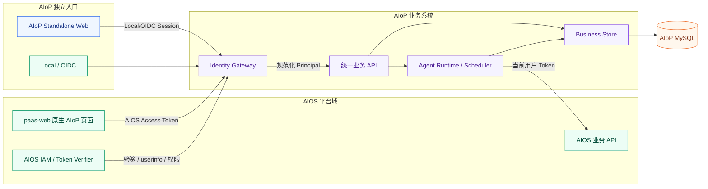
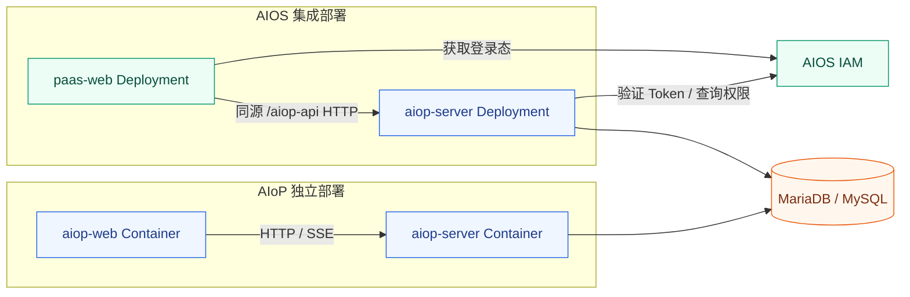
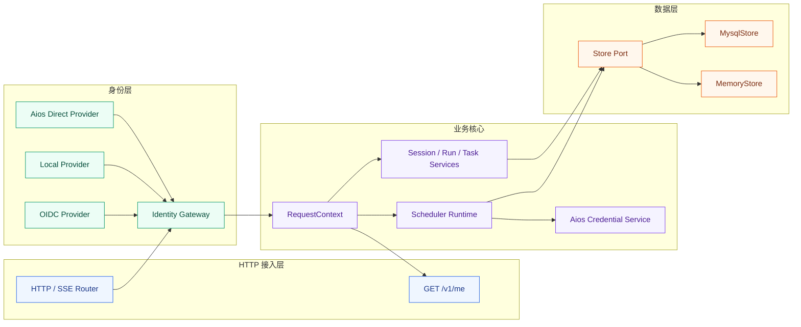
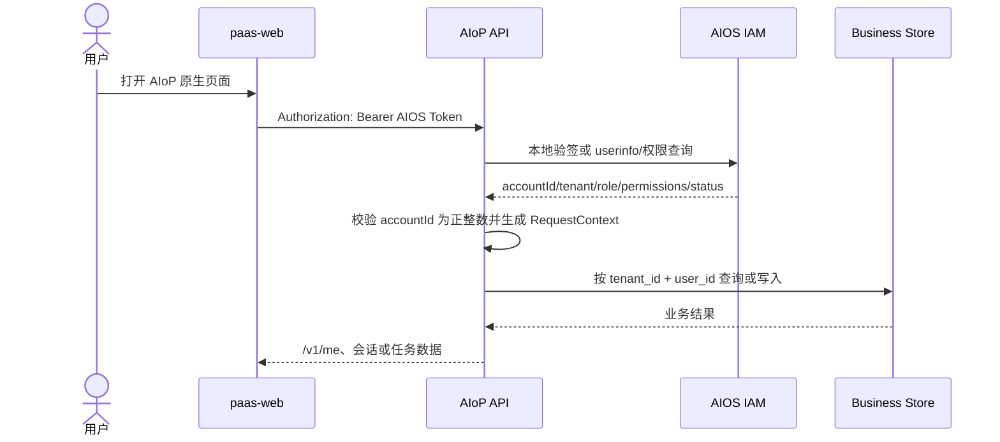
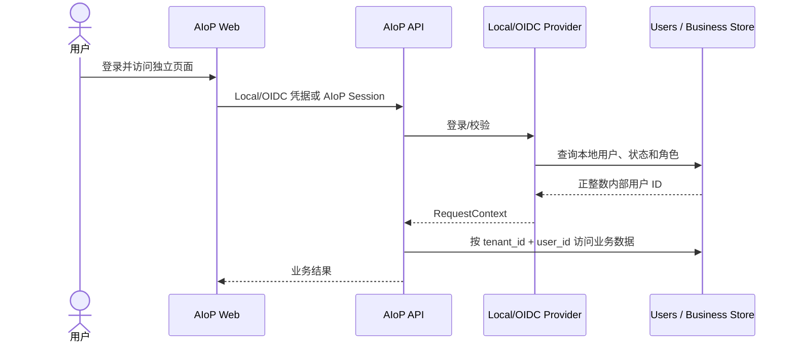
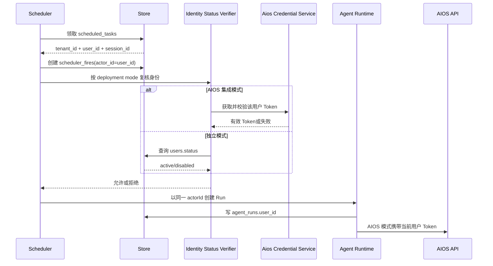
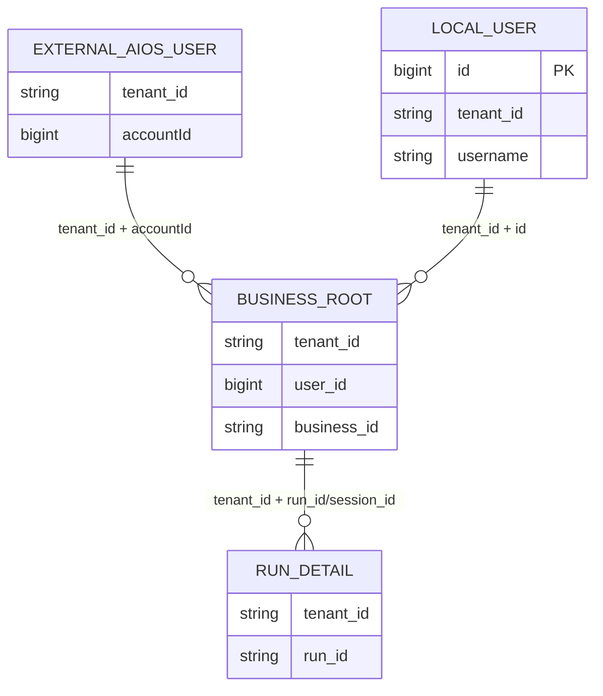

# AIoP 双部署与 AIOS 直连身份详细设计

> 状态：待评审
> 日期：2026-08-09
> 范围：AIoP Auth/Web/API/Store/Scheduler、AIOS paas-web

## 1. 概述

### 1.1 背景与现状

AIoP 当前同时存在 Local/OIDC 主认证和附加 AIOS Token Exchange 通道。AIOS 通道验证 Token 后，会按外部标识查询或 JIT 创建本地 `users` 行，再签发以本地用户 ID 为 `sub` 的 AIoP JWT，见 `src/auth/aios.ts:112-123,180-209` 和 `src/auth/session.ts:4-15`。业务数据已统一通过 `RequestContext.tenantId + userId` 隔离，但 `userId` 当前是 AIoP 字符串内部 ID，见 `src/auth/types.ts:4-9`。

测试环境数据库的实际结构与 `src/db/migrations/0001_baseline.sql` 一致：`sessions`、`messages`、`scheduled_tasks`、`agent_runs`、`agent_interactions`、`user_credentials` 保存 `user_id`，`scheduler_fires` 保存 `actor_id`；数据库没有用户外键。2026-08-09 只读核验时，`users` 有 1 条本地用户，以上业务关联表均为空，因此测试环境迁移风险较低，但其他部署仍必须采用可重复迁移。

目标同时覆盖两种部署：

1. **AIOS 集成部署**：页面由 `paas-web` 原生承载；AIoP 验证 AIOS Token 后直接使用正整数 `accountId`，不创建影子用户。
2. **AIoP 独立部署**：继续部署现有 AIoP Web，保留 Local/OIDC 登录和本地用户管理。

现有 `docs/design/14-aios-unified-auth.md` 和 `docs/superpowers/specs/2026-08-03-aios-identity-integration-design.md` 以 iframe 和影子用户为目标设计。本设计评审通过后，应以本设计替代其中的影子用户和 iframe 结论；权限底线继续遵循 `docs/design/15-aiop-access-control.md`。

### 1.2 设计目标

1. AIOS 集成模式不写 `users` 表，任务、会话、Run、定时任务和凭据直接关联服务端验证后的 AIOS `accountId`。
2. 独立模式的 Local/OIDC 登录、AIoP Web 和用户管理保持可用，业务 API 不复制实现。
3. 两种模式共用规范化身份、Store、Runtime、Scheduler 和权限链，客户端自报的用户、租户和角色永不成为授权依据。
4. 用户 ID 在数据库中统一为 `BIGINT UNSIGNED`；TypeScript/JSON 中使用无前导零的正整数十进制字符串，避免 JavaScript 大整数精度损失。
5. 数据迁移可验证、发布可灰度、应用版本可回滚；回滚期间不得产生新旧 ID 语义混写。

### 1.3 关键决策

| 决策 | 结论 | 原因与影响 |
| --- | --- | --- |
| 部署模式 | `standalone` 与 `aios-integrated` | 明确装配边界，禁止按是否存在 `users` 行猜模式 |
| Web 宿主 | 独立模式使用 AIoP Web；集成模式使用 paas-web 原生页面 | 删除 iframe 与 `postMessage` 依赖，但保留独立产品入口 |
| AIOS 用户关联 | 直接使用已验证的 `accountId` | 不创建、不同步影子用户；历史数据通过 `tenant_id + user_id` 归属 |
| 独立用户关联 | Local 使用 AIoP 自增正整数 ID；OIDC 首期保留本地 JIT 目录 | 保持现有独立部署能力，OIDC 直连不纳入本期 |
| ID 表示 | DB 为 `BIGINT UNSIGNED`，应用/API 为 decimal string | 同时满足正整数约束和 JS 精度安全 |
| 身份源组合 | 单实例只配置一个主认证源 | 首期不支持同一业务库混用 AIOS 与 Local/OIDC，避免 ID 空间碰撞 |
| 用户状态 | AIOS 模式由 Token/可信 AIOS 接口判定；独立模式查询 `users` | 修复当前“无本地用户即默认 active”的隐式语义 |
| 前端复用 | 提取可构建的 AIoP Web Core，分别由 Standalone Shell 和 paas-web Shell 承载 | 避免复制聊天、Run、任务页面和 API Client |
| 定时任务身份 | 一期保留 Task/Fire/Run 的用户归属，但 AIOS 集成模式禁用离线执行 | 用户 Token 续约作为后续 TODO；在安全续约能力完成前禁止服务账号代跑 |
| 数据库外键 | AIOS 业务表不指向 `users` | 集成用户不存在本地行；依靠认证边界、组合索引和一致性检查 |

## 2. 架构设计

### 2.1 系统架构



### 2.2 部署架构



集成部署和独立部署是不同实例形态，不要求共享同一个业务库。测试环境当前 `paas-web` 为 `kube-system/paas-web` Deployment，AIoP 为 `aios-system/aiop-server` Deployment；最终路由由 paas-web Nginx 或平台网关配置。

### 2.3 程序架构



### 2.4 模块职责

| 模块 | 负责 | 是否自研 |
| --- | --- | --- |
| paas-web 原生 AIoP 页面 | 集成模式页面宿主、菜单和当前 AIOS Token提供 | **部分自研。** 复用 paas-web 登录态和导航，自研 AIoP Host Adapter；不承担服务端身份判定 |
| AIoP Standalone Web | 独立登录、导航与 AIoP Web Core 宿主 | **是。** 保留独立部署产品能力 |
| AIoP Web Core | 聊天、会话、Run、定时任务和 API Client | **是。** 两种宿主共享同一业务 UI，避免功能分叉 |
| Identity Gateway | 按配置装配 Provider并生成可信 `RequestContext` | **是。** 掌握身份规范化、模式边界和失败语义 |
| Aios Direct Provider | 验证 Token，解析正整数 accountId、租户和角色/权限 | **部分自研。** 复用 `jose`/userinfo，自研 AIOS 契约 Adapter |
| Local/OIDC Provider | 独立部署认证及本地用户生命周期 | **部分自研。** 复用 `openid-client`/`jose`，保留现有 Store 语义 |
| 统一业务 API / Runtime | 会话、任务、Run、Tool、Scheduler 和审计 | **是。** 两种部署共享业务与权限语义 |
| Business Store | 持久化正整数身份键和业务历史 | **部分自研。** 复用 Kysely/mysql2，自研事务和隔离规则 |
| AIOS IAM / API | 用户、租户、权限权威及下游最终鉴权 | **否。** 属于外部 AIOS 平台，AIoP 不复制其用户目录和权限数据 |

### 2.5 代码落点

```text
aiop/
├── src/                                      # AIoP 服务端
│   ├── auth/                                 # 认证与授权
│   │   ├── types.ts                          # 【修改】Principal/RequestContext 正整数 ID 约束
│   │   ├── provider.ts                       # 【修改】统一 Provider 契约与模式能力
│   │   ├── aios.ts                           # 【修改】移除 JIT，改为 AIOS 直连 Provider
│   │   ├── local.ts                          # 【修改】适配自增正整数用户 ID
│   │   ├── oidc.ts                           # 【修改】兼容新用户 ID 类型
│   │   └── session.ts                        # 【修改】会话绑定 provider/身份版本
│   ├── config/schema.ts                      # 【修改】deploymentMode/auth.provider 配置约束
│   ├── db/
│   │   ├── migrations/                       # 【新增】正整数用户 ID 在线迁移
│   │   ├── schema.ts                         # 【修改】BIGINT 读写类型
│   │   ├── store.ts                          # 【修改】身份与用户目录能力分离
│   │   ├── memory.ts                         # 【修改】新语义内存实现
│   │   └── mysql.ts                          # 【修改】自增用户、业务关联及 /me 快照
│   ├── server/
│   │   ├── context.ts                        # 【修改】认证入口
│   │   └── http.ts                           # 【修改】/auth、/v1/me、用户管理模式门禁
│   ├── scheduler/                            # 【修改】Fire 身份复核与 AIOS 凭据加载
│   └── runtime.ts                            # 【修改】按模式装配 Provider/Web 能力
├── packages/
│   ├── pi-runtime/                           # 【修改】actorId 正整数字符串契约
│   ├── scheduler-runtime/                    # 【修改】actorId 持久化与恢复契约
│   └── control-contracts/                    # 【修改】公共身份类型
├── web/                                      # AIoP 独立 Web Shell
│   └── src/                                  # 【修改】提取 Host Adapter 和共享 Web Core
├── deploy/                                   # 【修改】双模式配置与工作负载清单
├── scripts/                                  # 【新增】迁移前检查和数据一致性验证
├── tests/                                    # 【修改】身份、Store、Runtime、前端和部署矩阵
├── Makefile                                  # 【修改】构建、迁移检查、双模式测试部署目标
└── docs/                                     # 【修改】最终认证、API 与部署说明

paas-web/（独立仓库，路径待确认）
├── src/...                                   # 【修改】AIoP 路由、Shell 和 AIOS Host Adapter
└── nginx/...                                 # 【修改】/aiop-api 同源反向代理
```

## 3. 功能设计

### 3.1 AIOS 集成请求



规则：

- 页面不提交可信 `userId`、`tenantId` 或角色；AIoP 只使用已验证 Token和可信 AIOS 响应。
- AIOS 模式不调用 `Store.getUser()` 判断 active，不创建 `users` 行。
- `/v1/me` 返回当前验证结果；显示名可来自 Token/userinfo，历史记录只以稳定 ID 鉴权。
- 集成模式关闭 Local 登录和本地用户写 API。

### 3.2 独立部署请求



独立模式继续提供用户管理，但 Local 用户创建改为数据库自增 ID。OIDC 首期继续 JIT 到 `users`，其用户同样使用内部自增 ID，避免把不稳定或非数字 claim 写入业务关联列。

### 3.3 定时任务执行



定时任务、Fire 和 Run 必须保持相同 `tenant_id + user_id`。一期仅保证历史归属和独立部署模式的调度能力；`aios-integrated` 模式下，离线 Fire 在受控 Token 续约能力完成前不得启动外部执行，返回明确的 `aios_offline_scheduling_unavailable` 状态或错误。不得改用平台服务账号。

> **P2 TODO：AIOS 集成模式离线定时任务 Token。** 后续补充加密凭据、受控续约接口、按用户续约互斥/CAS、用户状态复核、401 单次续约重试、403 直接失败以及审计。该 TODO 不阻塞一期 AIOS 实时请求、任务历史关联和独立部署定时任务。

## 4. 数据结构与核心接口

### 4.1 核心数据结构

```typescript
type PrincipalId = string; // 仅接受 ^[1-9][0-9]*$
type DeploymentMode = 'standalone' | 'aios-integrated';
type AuthProviderKind = 'local' | 'oidc' | 'aios';

interface VerifiedPrincipal {
  tenantId: string;
  userId: PrincipalId;
  provider: AuthProviderKind;
  role: 'platform_admin' | 'tenant_admin' | 'user';
  displayName?: string;
  externalSessionId?: string;
  permissions?: ReadonlySet<string>;
  expiresAt?: Date;
}

interface RequestContext {
  tenantId: string;
  userId: PrincipalId;
  provider: AuthProviderKind;
  role: 'platform_admin' | 'tenant_admin' | 'user';
}
```

`userId` 在应用层保持字符串。所有认证 Provider 都必须产出规范形式；`"0"`、负数、小数、指数形式、空字符串和前导零均拒绝。

### 4.2 核心 Interface

```typescript
interface IdentityProvider {
  authenticate(token: string, signal?: AbortSignal): Promise<VerifiedPrincipal | undefined>;
  login?(
    tenantId: string,
    username: string,
    password: string,
    signal?: AbortSignal,
  ): Promise<string | undefined>;
}

interface IdentityStatusVerifier {
  assertActive(principal: Pick<VerifiedPrincipal, 'tenantId' | 'userId' | 'provider'>): Promise<void>;
}

interface AiosCredentialService {
  getValidToken(
    identity: { tenantId: string; userId: PrincipalId },
    signal?: AbortSignal,
  ): Promise<{ token: string; expiresAt: Date }>;
}

interface WebHostAdapter {
  getAccessToken(): Promise<string>;
  getApiBaseUrl(): string;
  onAuthenticationRequired(handler: () => void): () => void;
}
```

责任边界：

- `IdentityProvider` 负责 Token真实性和身份规范化，不访问业务 Store。
- `IdentityStatusVerifier` 按模式复核状态：AIOS 查询可信状态或校验当前 Token，独立模式查询 `users`。
- `AiosCredentialService` 是 P2 TODO 的稳定边界；一期不实现 AIOS 离线续约，集成模式离线 Fire 必须拒绝执行。
- `WebHostAdapter` 只适配宿主，不参与授权。

## 5. 数据库设计

### 5.1 关联模型



`EXTERNAL_AIOS_USER` 是外部概念实体，不在 AIoP 建表。业务根表直接保存 AIOS ID；Run 明细继续通过 `tenant_id + run_id` 间接关联 `agent_runs.user_id`。

### 5.2 列变更

| 表 | 列 | 目标类型 | 说明 |
| --- | --- | --- | --- |
| `users` | `id` | `BIGINT UNSIGNED AUTO_INCREMENT` | 独立模式本地/OIDC 内部用户主键 |
| `sessions` | `user_id` | `BIGINT UNSIGNED` | 联合主键成员 |
| `messages` | `user_id` | `BIGINT UNSIGNED` | 消息归属 |
| `scheduled_tasks` | `user_id` | `BIGINT UNSIGNED` | 定时任务归属 |
| `scheduler_fires` | `actor_id` | `BIGINT UNSIGNED` | 创建 Fire 时从任务复制 |
| `agent_runs` | `user_id` | `BIGINT UNSIGNED` | Run 所属身份 |
| `agent_interactions` | `user_id` | `BIGINT UNSIGNED` | 交互所属身份 |
| `agent_interactions` | `resolved_by` | `BIGINT UNSIGNED NULL` | 用户解决人；系统解决需另用类型字段时再扩展 |
| `user_credentials` | `user_id` | `BIGINT UNSIGNED` | AIOS 凭据可不存在对应 users 行 |

相关组合索引必须保留或补齐：

- `sessions(tenant_id, user_id, session_id)` 主键；
- `messages(tenant_id, user_id, session_id, id)`；
- `agent_runs(tenant_id, user_id, session_id, created_at)`；
- `scheduled_tasks(tenant_id, user_id, id)`；
- `user_credentials(tenant_id, user_id, provider)` 主键。

不建立业务 `user_id → users.id` 外键，因为 AIOS 集成用户没有本地行。Store 必须始终同时过滤 `tenant_id` 和 `user_id`。

### 5.3 迁移策略

采用“映射、回填、切换、收口”迁移，禁止直接把现有 `varchar` 强转为数字：

1. 新建 `user_id_migration_map(old_id VARCHAR(128), new_id BIGINT UNSIGNED, tenant_id, provider)` 临时映射表或等价受控迁移结构。
2. 为现有 `users` 分配新自增正整数；同一事务批次回填所有直接关联列。
3. 校验每张表总数、非空数、distinct 归属、孤儿数以及 `scheduled_tasks.user_id = scheduler_fires.actor_id`、`agent_runs.user_id` 链路。
4. 重建主键和索引后切换应用；迁移完成且观察期结束再删除旧列和临时映射。
5. AIOS 集成模式首次启用后直接写 `accountId`，不得再调用 JIT。

测试环境当前关联表为空，可以简化实际回填，但迁移脚本不能假设所有环境为空。

### 5.4 事务与一致性

- Local/OIDC 创建用户时，由数据库生成 ID，并在插入成功后返回 decimal string。
- 创建 scheduled fire 时复制任务的 `tenant_id + user_id`；创建 Run 时再次绑定同一身份。
- 定时执行身份复核失败时，不创建或不启动 Run，并记录明确失败原因。
- P2 实现 AIOS 离线 Token 后，凭据更新按 `tenant_id + user_id + provider` 使用事务锁或 CAS，避免并发续约覆盖新 Token；一期不启用该写入路径。

## 6. API 设计

| 接口 | 方法 | 模式 | 认证与行为 |
| --- | --- | --- | --- |
| `/auth/login` | POST | standalone/local | 保留；集成模式返回 404 或 405 |
| `/auth/oidc/*` | GET/POST | standalone/oidc | 保留现有 OIDC 流程 |
| `/auth/aios/exchange` | POST | 过渡兼容 | 移除 JIT；如 paas-web 不能直接携带 Token，则换发短期 AIoP Session |
| `/v1/me` | GET | 两种 | 返回当前 `tenantId/userId/provider/role/displayName`，不强依赖 users 行 |
| `/v1/admin/users` | GET/写 | standalone | Local/OIDC 按现有权限开放；AIOS 集成模式关闭 |
| `/v1/*` | 多种 | 两种 | 共用业务 API，服务端从 Token 建立身份，不接受身份覆盖字段 |

优先让 paas-web 通过同源代理向 AIoP API携带 AIOS Access Token。若浏览器安全策略或现有登录组件无法提供每请求 Token，则保留无 JIT 的 Exchange 作为兼容方式。两者只能配置启用一种，避免双会话语义漂移。

错误约定：

- `401`：Token 无效、过期、用户状态不可确认或凭据失效；
- `403`：身份有效但无权限；
- `409`：部署模式与接口不兼容，或迁移状态不允许写入；
- `422`：AIOS accountId 不是规范正整数。

## 7. 非功能设计

### 7.1 安全

- AIOS Token 必须由后端固定算法验签或通过可信 userinfo 验证；前端提供的 ID、角色和租户仅作非可信输入。
- paas-web 使用同源反向代理时应采用 HttpOnly 会话或受控请求注入；不得把 Token 放 URL、日志、错误响应或持久化前端埋点。
- 所有业务查询强制 `tenant_id + user_id`，管理员跨用户查询必须走显式 permission guard。
- AIOS 403 不重试、不降级到服务身份。用户确认不能扩展下游权限。

### 7.2 性能与可用性

- JWKS 本地验签优先；userinfo 模式设置超时、有限缓存和 fail closed。
- 身份状态缓存键包含 `provider/tenantId/userId`，避免不同模式或租户碰撞。
- BIGINT 热点索引按现有访问模式建立，不增加无条件全表身份查询。

### 7.3 可观测性

日志和指标包含 `deployment_mode`、`auth_provider`、`tenant_id`、脱敏 `user_id`、`run_id`、验证来源和错误码；禁止记录 Token。迁移需输出每表行数、映射数、孤儿数和校验摘要。

### 7.4 开源组件

本方案不新增开源依赖。继续使用仓库锁定的 `jose 6.2.3`、`openid-client 6.8.4`、`kysely 0.29.2`、`mysql2 3.22.5`；License、Star 和供应链策略沿用项目现有依赖治理，本次不重新选型。

## 8. 兼容、迁移与回滚

### 8.1 发布顺序

1. 冻结 AIOS accountId、tenant、角色/权限、Token 验证和 paas-web Token 提供契约。
2. 先发布兼容读取新旧 ID 的服务版本和迁移前检查，不切流量。
3. 备份后执行数据库迁移，完成一致性门禁。
4. 发布支持双模式的新 AIoP 服务，先验证 standalone 回归。
5. 发布 paas-web 原生页面和同源代理，小范围启用 `aios-integrated`。
6. 观察认证失败率、跨用户隔离、Run/Fire 归属和 AIOS 401/403，再扩大流量。
7. 稳定后删除 AIOS JIT/iframe 路径及迁移兼容列。

镜像和测试环境操作统一使用 Make 目标：

```bash
make test-dual-auth
make check-user-id-migration
make migrate-user-id-staging
make image
make deploy-standalone-staging
make deploy-aios-integrated-staging
```

`migrate-user-id-staging` 是停写迁移目标，只允许对明确确认的 staging Deployment 使用。调用方必须同时提供已校验备份、`MIGRATION_NAMESPACE`、`MIGRATION_DEPLOYMENT` 和当前 `MIGRATION_EXPECTED_REPLICAS`；目标会核对副本数，按“备份校验 → 停写前只读预检 → scale 0 并等待 rollout → 确认无匹配 Pod并执行停写后最终预检 → 迁移 → 迁移后检查 → 恢复原副本并等待 rollout”执行。恢复由 `EXIT/INT/TERM` trap 保证，迁移成功或失败都会执行；不得把同一数据库的其他写入方排除在所确认的 Deployment 之外。

仅检查命令展开、不连接集群或数据库时使用：

```bash
make -n migrate-user-id-staging \
  CONFIRM_USER_ID_MIGRATION=staging \
  USER_ID_MIGRATION_BACKUP=/verified/backup.sql \
  MIGRATION_NAMESPACE=aiop-dev MIGRATION_DEPLOYMENT=aiop-server MIGRATION_EXPECTED_REPLICAS=2 \
  DEPLOYMENT_MODE=standalone AUTH_PROVIDER=oidc \
  MYSQL_HOST=db.example MYSQL_DATABASE=aiop MYSQL_USER=aiop
```

实际运行会缩容共享环境并迁移外部数据库，必须走独立变更审批；普通验证和 CI 只能执行上述 dry-run 与静态契约测试。

### 8.2 回滚

- 数据库扩展阶段只加列/映射，不删除旧列，应用可回滚到兼容版本。
- paas-web 可关闭 AIoP 菜单或切回旧入口；AIoP 独立 Web 不受影响。
- 一旦新版本开始写入仅新 ID 可表达的数据，不能直接回滚到只认识旧字符串 ID 的版本；必须先停止写入并反向校验映射。
- 删除旧列、JIT 和 iframe 代码属于最后不可逆收口步骤，需独立确认。

## 9. 风险与待确认事项

1. **accountId 范围和唯一性**：确认是全局唯一还是租户内唯一，以及最大值是否落在 `BIGINT UNSIGNED`。
2. **租户来源**：Token 当前可能不含 tenant；需冻结可信查询接口和一期租户范围。
3. **paas-web 源码与构建边界**：当前仓库不包含 paas-web 源码，需确认仓库路径、路由框架、共享包发布方式和 Nginx 配置归属。
4. **Token 传递方式**：确认 paas-web 能否安全地为每个 API 请求提供 Token；否则采用无 JIT Exchange。
5. **AIOS 状态与权限接口**：确认管理员映射、permission code、用户禁用和退出传播机制。
6. **P2 TODO：AIOS 离线定时任务 Token**：一期明确禁用 AIOS 集成模式离线外部执行；后续确认受控续约接口后单独设计和开发，不作为一期门禁。
7. **OIDC 范围**：本期默认保留 OIDC JIT 到本地 `users`；若要求 OIDC 也无影子用户，需要独立扩展复合身份域设计。
8. **同库混合模式**：本期禁止。若未来需要同时启用 AIOS 和 Local，应把业务身份键扩展为 `tenant_id + provider + user_id`。
9. **`resolved_by` 语义**：确认是否只存用户，还是还可能存系统/worker 标识；后者需拆成 actor type 与 actor id。
