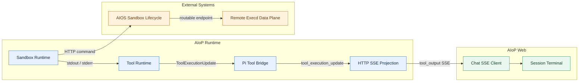
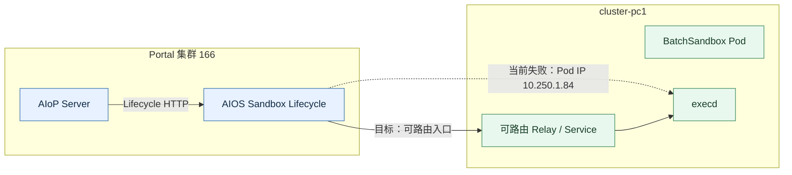
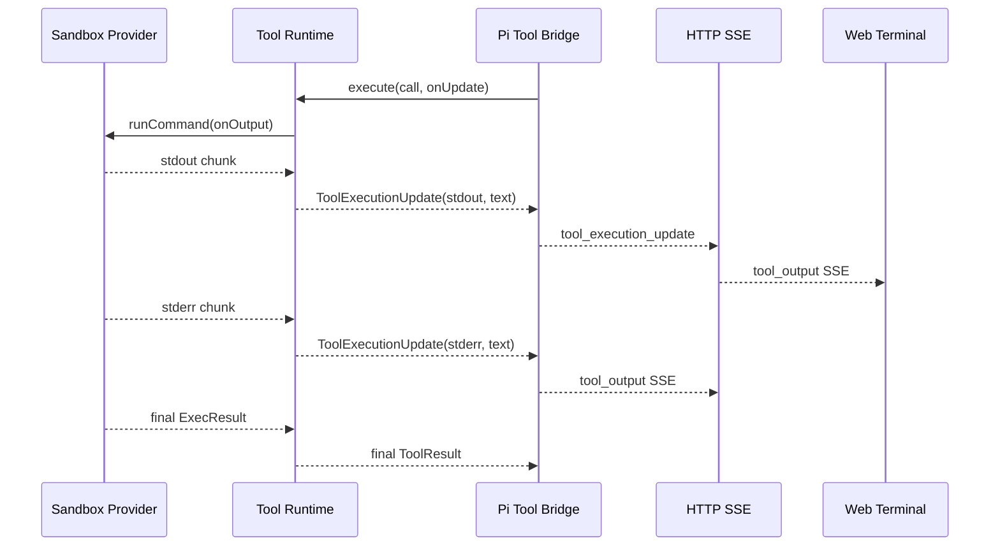

# 沙箱浏览器中文、终端输出与跨集群连接修复设计

## 1. 概述

### 1.1 文档信息

- 版本：v1
- 更新日期：2026-08-14
- 状态：待确认

### 1.2 背景与现状

当前存在三个可独立复现的问题：

1. `aiop-sandbox:latest` 基于 `node:24-slim`，安装 Chromium 和 Xvfb，但未安装 CJK 字体。浏览器页面包含中文时出现方框或乱码。
2. 沙箱 Provider 能通过 `OutputSink` 产生 stdout/stderr；Web 端也能消费 `tool_output` SSE。但 durable Pi 工具桥接忽略 `onUpdate`，且 durable runtime 未把逐段输出注入工具上下文，导致右侧终端只有命令或完全没有执行日志。
3. 2026-08-14 18:54 在 `cluster-pc1` 创建的沙箱 `e2b-00f6ada2881f429abb6b` 已达到 `Ready=1`，但 166 上的 AIOS Sandbox Lifecycle 直接访问远端 Pod 地址 `10.250.1.84:44772`，返回 `no route to host` / `i/o timeout`，最终命令接口返回 HTTP 503。该问题发生在 AIOS Sandbox 跨集群数据面，不是镜像拉取或 Kubernetes 调度失败。

### 1.3 设计目标

1. Chromium 在浏览器预览和截图中正确渲染简体中文、繁体中文及常见 Emoji。
2. `sandbox_run_command`、`sandbox_run_code` 和 `sbx__*` 执行期间的 stdout/stderr 能实时显示在会话右侧终端，并保持 stdout/stderr 类型。
3. durable Run、直接工具调用及非沙箱工具保持兼容，不改变现有工具最终结果和 Ledger 语义。
4. cluster-pc1 的跨集群沙箱命令链路不再依赖 Portal 集群直接访问远端 Pod IP；在数据面未修复前，AIoP 至少展示 Lifecycle 返回的可诊断错误。

### 1.4 关键决策

| 决策 | 原因 | 影响 |
| --- | --- | --- |
| 镜像安装 `fonts-noto-cjk`、`fonts-noto-color-emoji` 和 `fontconfig` | Chromium 使用系统字体；无需修改网页或浏览器自动化代码 | 沙箱镜像体积增加，构建检查增加中文字体断言 |
| 在 durable 工具执行上下文增加结构化输出回调 | 避免通过全局回调或可变 Map 关联并发工具，工具调用 ID 由桥接层天然持有 | 修改 control contract、Pi bridge 和 AIoP tool runtime，需补契约测试 |
| stdout/stderr 作为临时运行事件，不写入工具 Ledger | Ledger 保存最终结果；逐段日志可能体积大且重复 | SSE 断线后不保证回放全部中间日志，最终工具结果仍持久化 |
| 跨集群 execd 使用可路由数据面入口 | Portal 到计算集群 Pod CIDR 通常不可直达 | 需要 AIOS Sandbox 服务或集群网络侧修改，AIoP 仓库只负责错误透传和验证 |

## 2. 架构与模块边界

### 2.1 程序架构图



| 模块 | 负责 | 是否自研 |
| --- | --- | --- |
| Sandbox Runtime | 调用 Lifecycle、执行命令、产出 stdout/stderr | **是。** 承担 Provider 兼容、超时和输出语义 |
| Tool Runtime | 将沙箱输出绑定到当前 governed tool 调用 | **是。** 承担身份、策略、Ledger 和事件边界 |
| Pi Tool Bridge | 将工具增量输出转换为 Pi `tool_execution_update` | **部分自研。** 复用 Pi agent core，自研 durable/governed 适配层 |
| HTTP SSE Projection | 将 durable Run 事件投影为前端 SSE | **是。** 承担产品 HTTP 契约和兼容性 |
| Session Terminal | 按会话展示命令与 stdout/stderr | **是。** 使用 React 状态管理和现有输出格式化器 |
| AIOS Sandbox Lifecycle | 创建跨集群沙箱并提供可达的 execd 入口 | **否。** 外部 AIOS 平台服务；AIoP 通过 HTTP Adapter 隔离 |

### 2.2 跨集群部署链路



目标方案优先使用 AIOS Sandbox 已支持的数据面 Relay、Gateway 或按集群可达的 Service 地址。只有在网络团队确认 Portal 与计算集群 Pod CIDR 建立受控路由后，才允许直接访问 Pod IP。

### 2.3 目录与变更范围

```text
aiop/
├── deploy/opensandbox/                         # 沙箱镜像与部署资产
│   └── Dockerfile.allinone                     # 【修改】安装并验证 CJK/Emoji 字体
├── packages/
│   ├── control-contracts/src/tool.ts           # 【修改】定义 ToolExecutionUpdate 回调契约
│   ├── pi-runtime/src/pi/tool-bridge.ts         # 【修改】传递 Pi onUpdate
│   └── sandbox-runtime/src/
│       ├── aios-e2b.ts                         # 【修改】保持输出类型和 Lifecycle 错误信息
│       └── aios-http.ts                        # 【修改】受限读取错误响应详情
├── src/
│   ├── agent/tools.ts                          # 【修改】把执行期输出注入 ToolContext
│   ├── tools/governance.ts                     # 【修改】连接 governed context 与 OutputSink
│   └── server/http.ts                          # 【修改】验证 durable 事件到 SSE 的投影
├── web/src/
│   ├── App.tsx                                 # 原有终端消费逻辑，原则上不改或仅修边界
│   └── sandbox-output.ts                       # 原有 stdout/stderr 格式化
└── tests/
    ├── pi-runtime/tool-bridge.test.ts           # 【修改】增量输出桥接测试
    ├── contracts/http-projection.test.ts        # 【修改】SSE 投影测试
    ├── aios-e2b.test.ts                         # 【修改】Lifecycle 错误详情与输出测试
    └── frontend.test.ts                         # 【修改】终端会话归属回归测试
```

## 3. 功能设计

### 3.1 终端实时输出时序



业务规则：

- 每个增量事件必须带当前 `toolCallId`，禁止依赖全局当前工具。
- 空文本不发送；stdout/stderr 不互相合并。
- buffered Lifecycle Provider 只能在命令结束后一次性发出 stdout/stderr；接口具备真正流式能力后可无兼容破坏地逐段发送。
- 增量输出失败不得改变工具最终执行结果；SSE 连接取消时应沿现有 AbortSignal 中止工具。
- 最终 ToolResult 继续进入 Ledger；增量日志不进入 Ledger 和数据库。

### 3.2 中文字体

- 安装 Noto CJK 与 Emoji 字体，并运行 `fc-cache`。
- 镜像构建检查使用 `fc-list :lang=zh` 验证至少存在一个中文字体。
- 保持 Chromium 启动参数、Xvfb 分辨率和现有截图逻辑不变。

### 3.3 cluster-pc1 503

已确认链路：沙箱创建成功，`Ready=1`；Lifecycle 随后探测 `http://10.250.1.84:44772/ping`，出现 `no route to host` 和超时并返回 503。

修复分两层：

1. AIOS Sandbox：为远端 execd 返回 Portal 可达的 Relay/Service 地址，或部署每集群数据面代理；不得把不可路由 Pod IP 作为跨集群控制面入口。
2. AIoP：解析 Lifecycle 的受限错误响应，将 `execd readiness failed`、目标集群和 correlation/request ID 展示给用户，同时保持密钥及内部响应大小限制。

## 4. 核心数据结构与 Interface

```ts
export interface ToolExecutionUpdate {
  stream: 'stdout' | 'stderr';
  text: string;
}

export interface ToolExecutionContext {
  // 现有身份、Run、取消字段省略
  onUpdate?: (update: ToolExecutionUpdate) => void;
}
```

职责边界：

- Sandbox Provider 只产出 `OutputSink`。
- AIoP Tool Runtime 将 `OutputSink` 映射为 `ToolExecutionUpdate`。
- Pi bridge 将 `ToolExecutionUpdate` 映射为 Pi partial result；不引用 Sandbox 类型。
- HTTP 层只投影 durable event，不感知 Provider。

## 5. 数据库设计

不涉及数据库表或迁移。增量日志不持久化，避免扩大 Run 事件表和工具 Ledger。

## 6. API 设计

现有 `/v1/agent` SSE 增加/恢复既有事件语义，不新增路径：

```text
event: tool_output
data: { "toolId": "...", "stream": "stdout|stderr", "text": "..." }
```

兼容性：旧前端会忽略未知事件；当前前端已支持该事件。Lifecycle HTTP 错误仍抛出同一错误类型，仅增加经过长度限制和脱敏的服务端消息。

## 7. 非功能设计

- 性能：增量事件按 Provider chunk 转发，不做逐字符事件；单个错误响应继续受 `maxResponseBytes` 限制。
- 安全：错误详情不得包含 API Key、Authorization、Secret 或完整请求体；跨集群入口必须经过现有认证边界。
- 可观测性：保留 `toolCallId`、runId、sandboxId、clusterId/name 和 Lifecycle request ID；对 503 区分调度失败、沙箱未 Ready 和 execd 不可达。
- 回滚：AIoP Server 与沙箱镜像可独立回滚；跨集群数据面变更先灰度 cluster-pc1，再扩大范围。

## 8. 开源组件引用

不新增 npm 开源依赖。镜像增加 Debian 官方字体包 `fonts-noto-cjk`、`fonts-noto-color-emoji` 和 `fontconfig`，许可证随 Debian 包元数据管理；发布前由镜像扫描流程复核 License 与 CVE。

## 9. 实施建议

1. 先补 ToolExecutionUpdate 契约和 Pi bridge 单元测试，再修改运行时映射。
2. 增加镜像字体及构建检查，通过 `make sandbox-image`、`make sandbox-image-check`、`make sandbox-image-push` 发布。
3. 增强 Lifecycle 错误详情并运行 sandbox/http/frontend 回归。
4. 通过 AIOS Sandbox 数据面修复 cluster-pc1 路由，使用同一浏览器任务做端到端验收。
5. 使用现有 166 测试环境 Make 目标部署 AIoP；若缺少目标，新增明确的 `make deploy-166` 包装现有发布脚本。

## 10. 风险与待确认事项

- AIoP 仓库不能单独修复 cluster-pc1 的 Pod CIDR 不可达；需要 AIOS Sandbox 服务或网络侧配合。
- 当前工作区已有未提交修改，实施时只追加最小变更，不覆盖既有编辑。
- Lifecycle 当前命令接口为 buffered response，因此第一阶段只能做到“命令结束后输出出现在终端”；真正逐行实时输出需要 AIOS Lifecycle 提供流式命令接口。
