### 算法开发

#### 任务管理

**功能说明：**平台支持根据IDE模板创建算法开发任务，算法开发模块支持Pycharm、IDEA、WebStorm、VS Code、Jupyter、Visual Studio、ComfyUI在线开发工具,管理员可以新增工具，用户根据工具创建开发任务，并且用户能够查看、编辑、删除、启动、终止已创建的在线开发任务。
**操作说明：**点击左侧【BMP】，点击【算法开发】，点击【任务】，可查看用户个人的开发任务
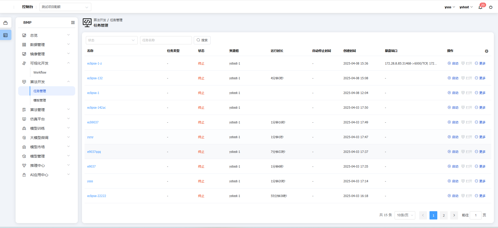
点击数据行末【启动】按钮，可启动IDE任务
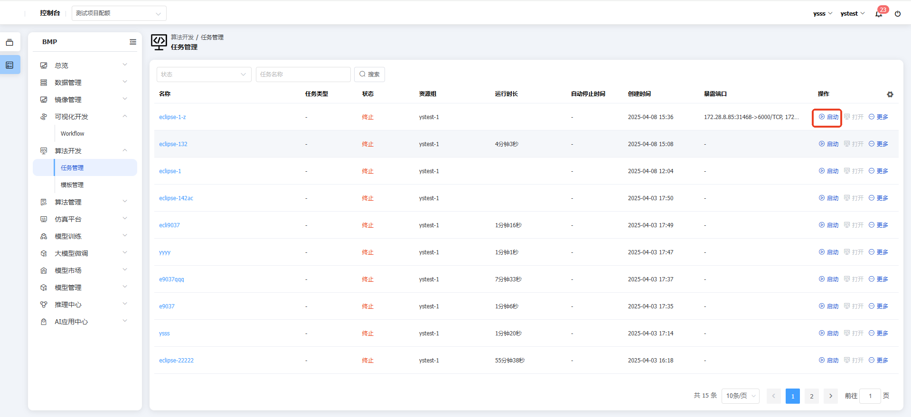
点击数据行末【打开】按钮，可支持打开IDE环境
点击数据行末【SSH】按钮，可支持通过SSH链接本地IDE进行开发
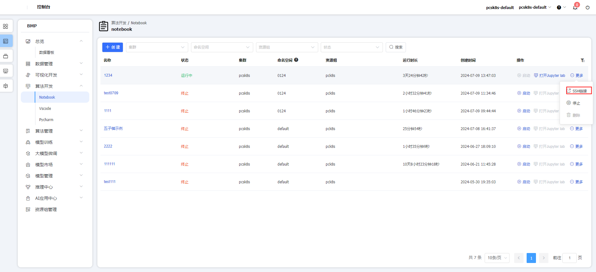
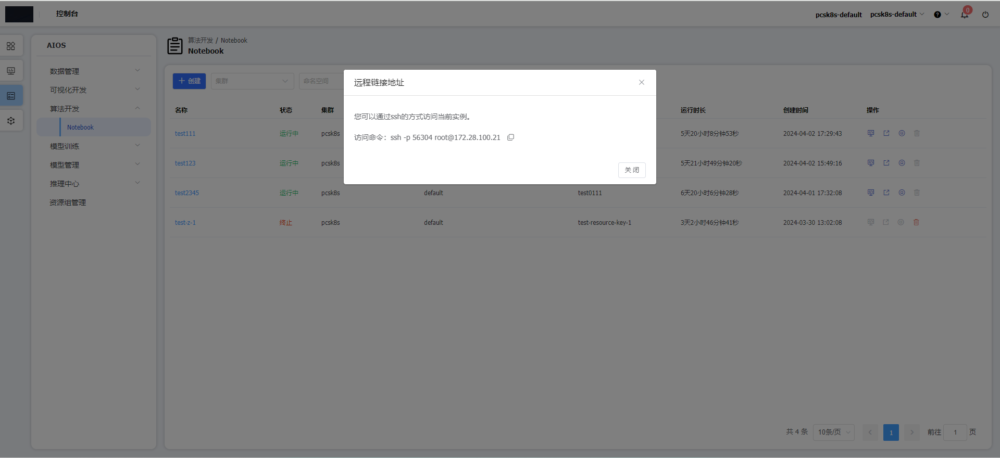
点击数据行末【停止】按钮，任务将停止运行
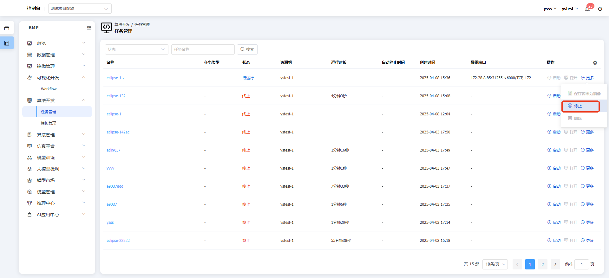
点击数据行末【删除】按钮，任务将被删除，仅支持已经停止的任务
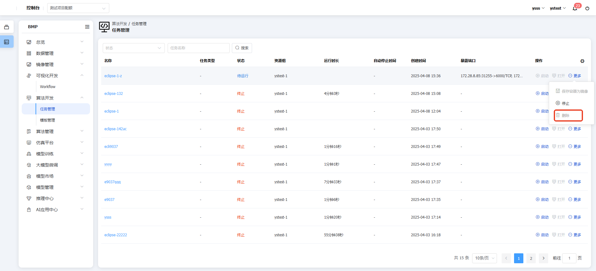

点击数据行末【保持容器为镜像】按钮，将任务保存为容器镜像
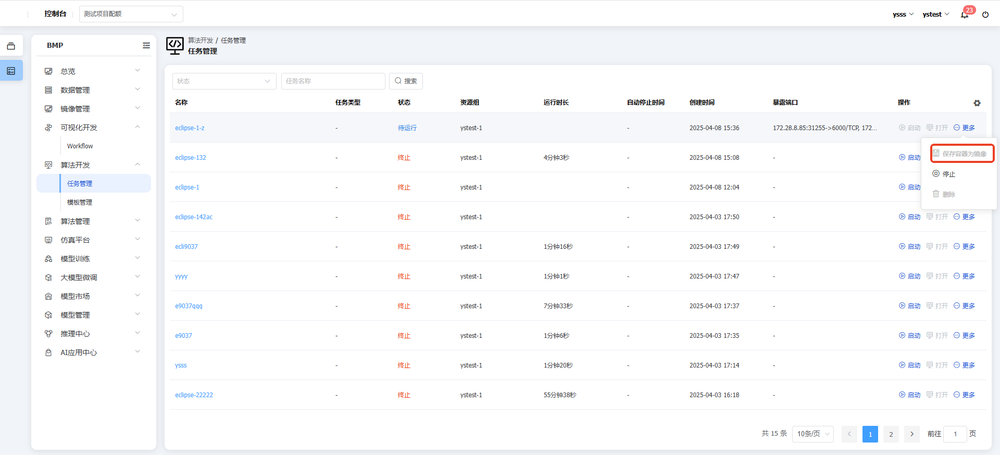
点击任务名称，可查看详情信息
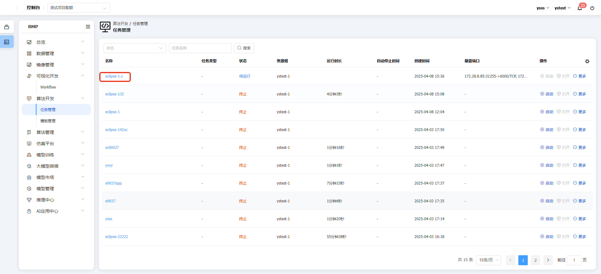
查看任务基本信息
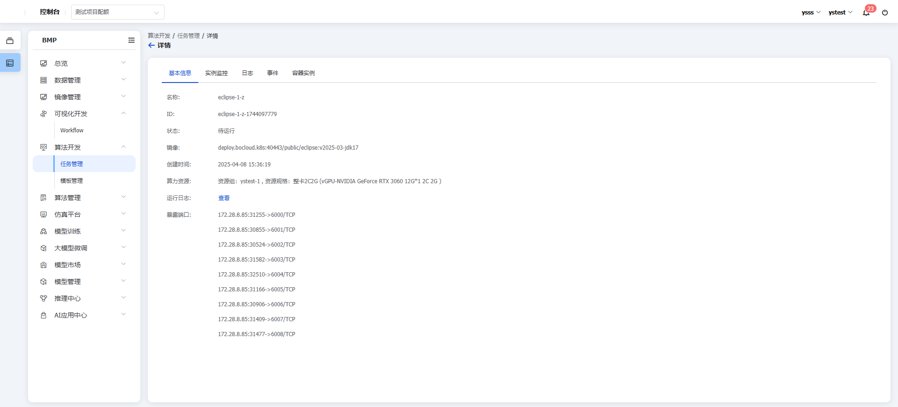
查看任务监控
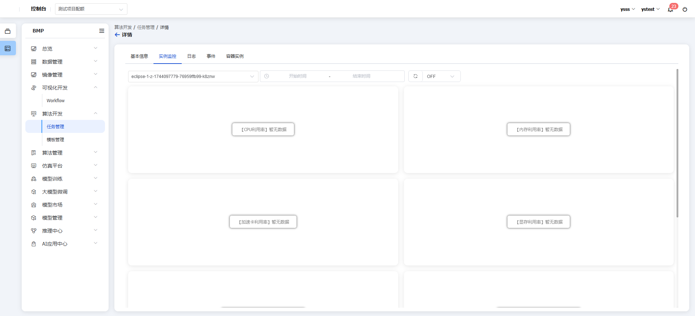
查看任务日志
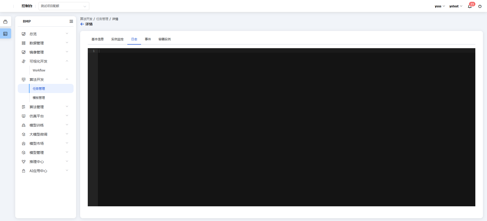
查看任务事件
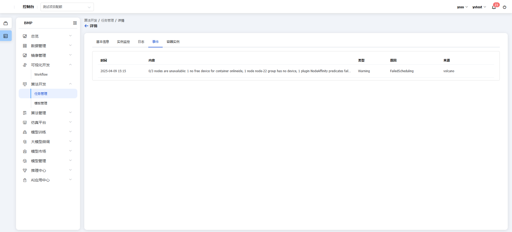
查看任务容器实例
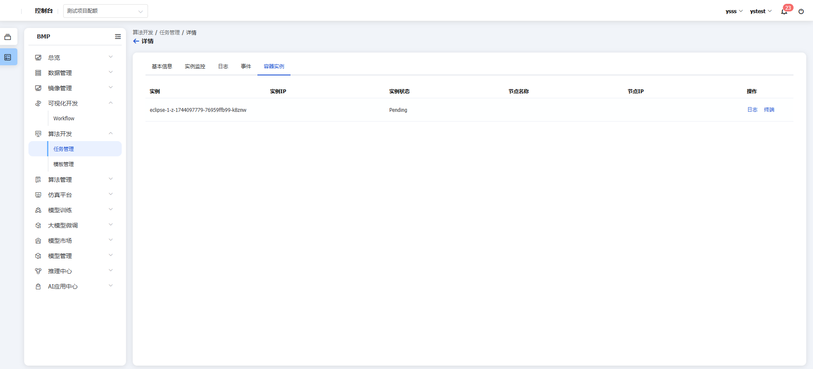
#### 模版管理

**功能说明：**算法开发模块支持Pycharm、IDEA、WebStorm、VS Code、Jupyter、Visual Studio、ComfyUI，用户可以根据模版直接创建算法开发任务。
**操作流程：**点击左侧【BMP】，点击【算法开发】，点击【模板管理】，可查看/管理用户个人的开发环境模板
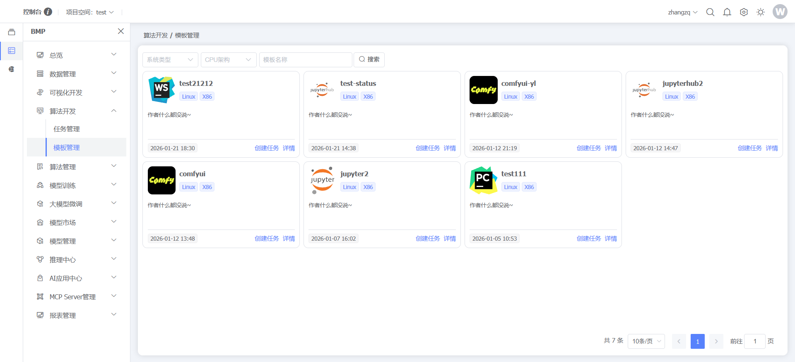
点击【创建】按钮，可创建IDE任务
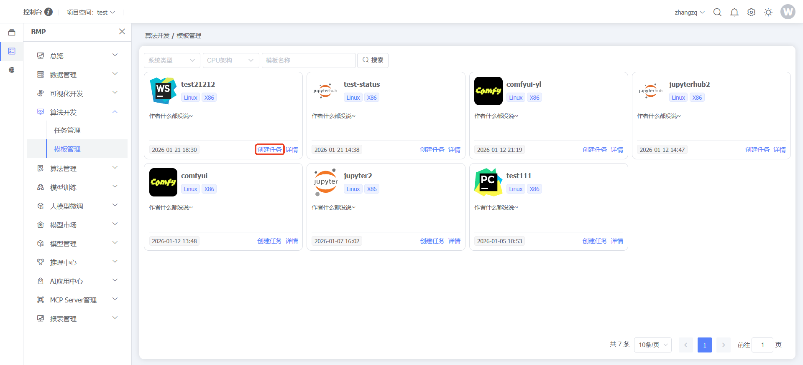
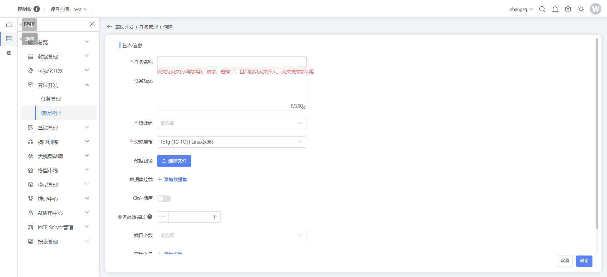
点击【详情】按钮，可查看IDE详情
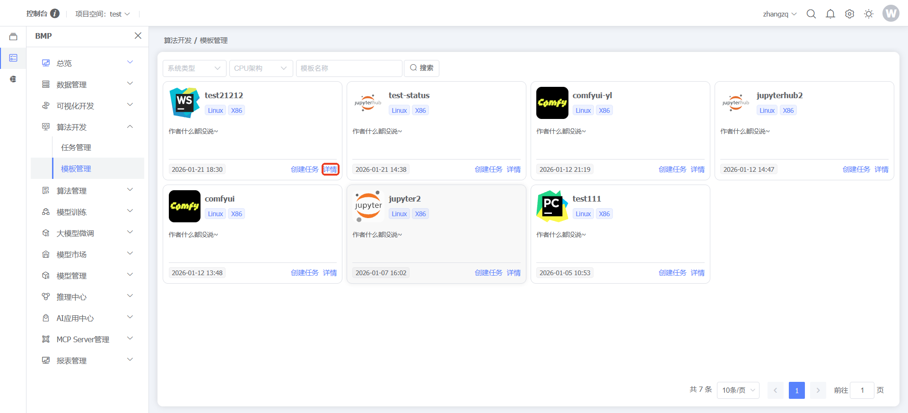
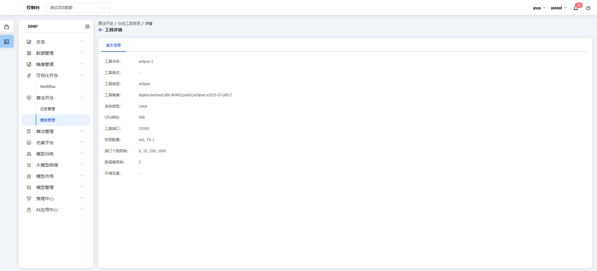

