### 算法管理

#### 算法管理

**功能说明：**用户在本地或使用其他工具开发的算法，支持上传至BMP算法管理模块中统一管理。算法库当中内置部分主流算法，支持在BMP中迅速创建训练作业，来获取用户想要的模型。支持在本地创建和Git仓库拉取，Git仓库代码更新，平台支持代码同步，确保算法仓库里代码和Git仓库保持一致。
**操作说明：**点击左侧【BMP】，点击【算法管理】，点击【算法管理】，可查看/管理用户个人的算法
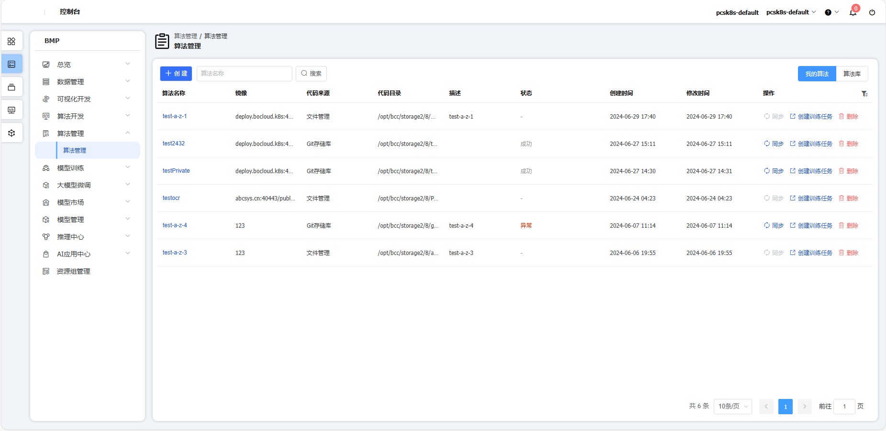
点击【创建】按钮，可创建算法
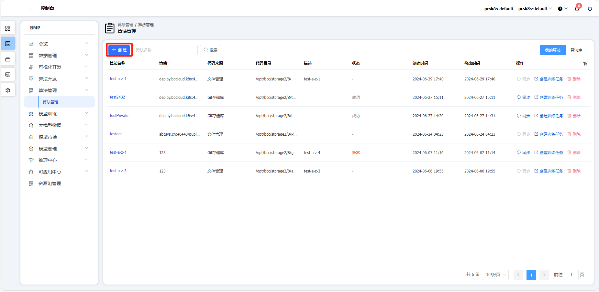
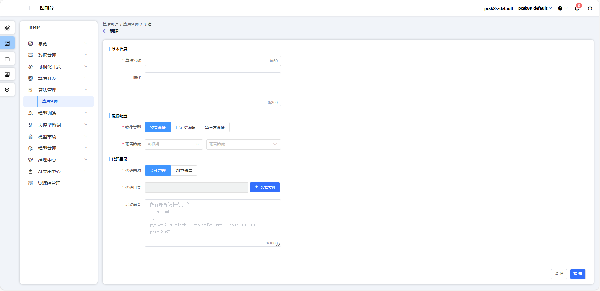
点击【Git存储库】按钮，可从Git存储库导入算法
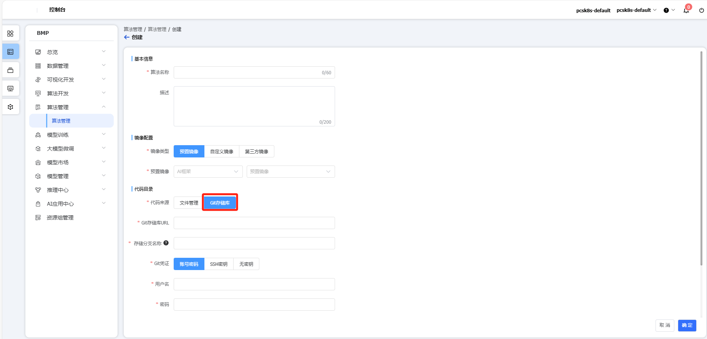
点击【同步】按钮，可同步Git库中代码到算法管理
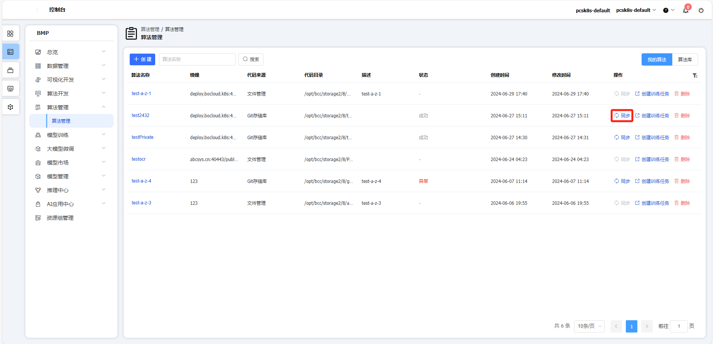
点击【创建训练任务】按钮，可同步Git库中代码到算法管理
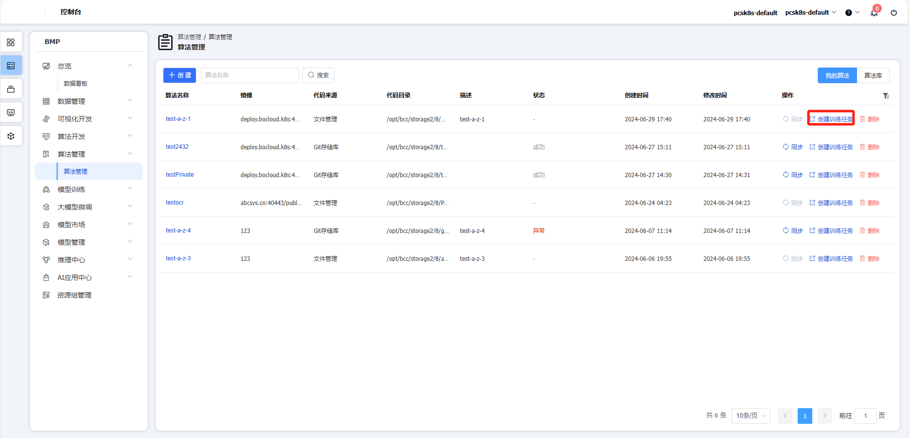
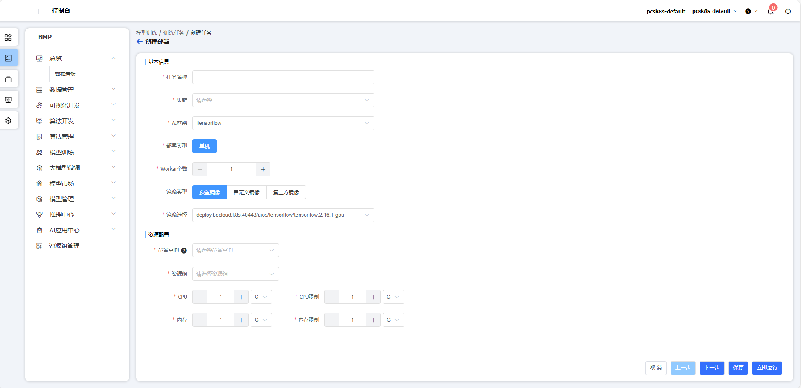
点击【删除】按钮，可删除对应算法
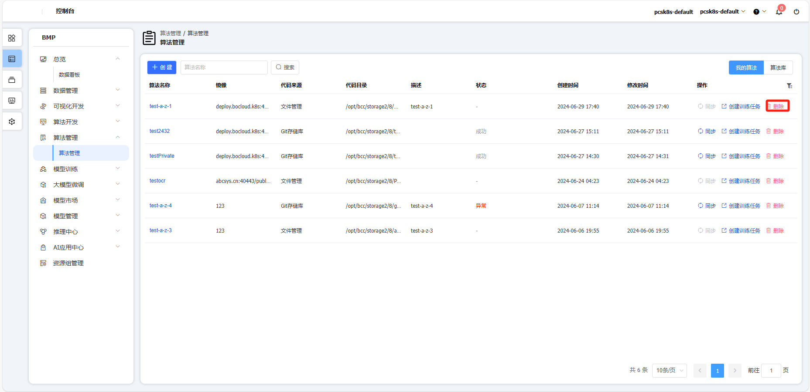
点击【算法库】按钮，可查看对应算法
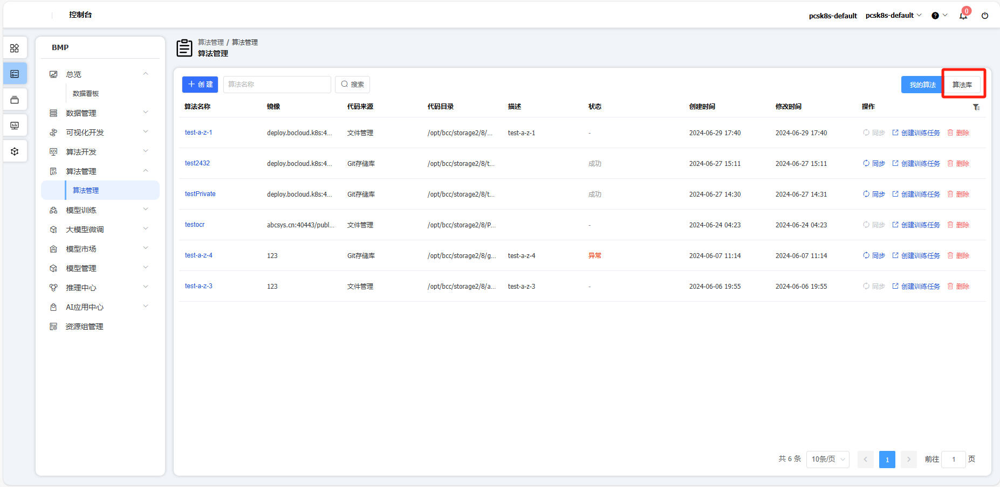
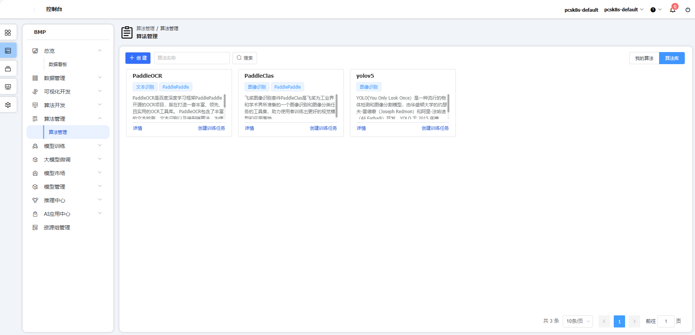
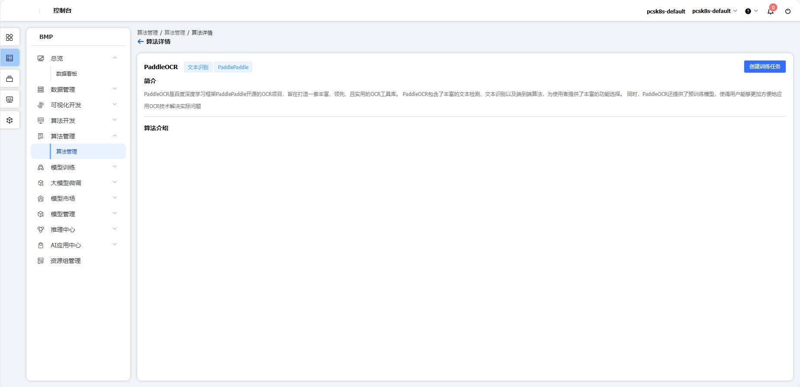
#### 模板管理

**功能说明：**平台内置主流算法，可以一键启动IDE工具进行定制开发，也可以创建任务进行训练，大幅度降低算法开发的门槛。
**操作说明：**点击左侧【BMP】，点击【算法管理】，点击【模板管理】，可查看算法模板
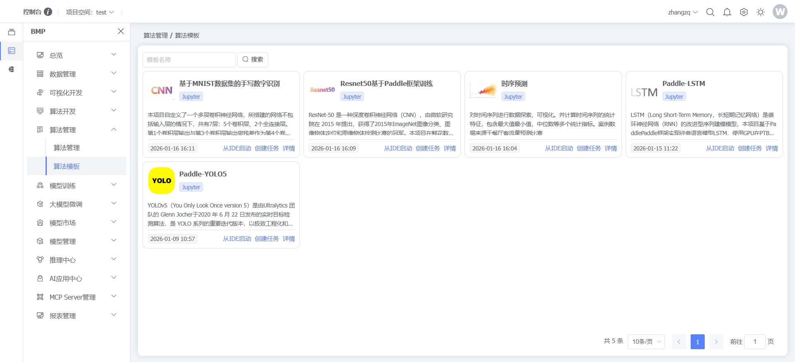
点击【从IDE启动】按钮，可创建IDE任务
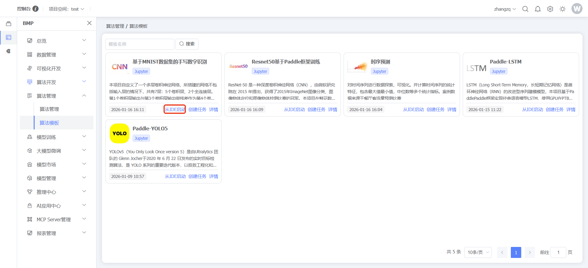
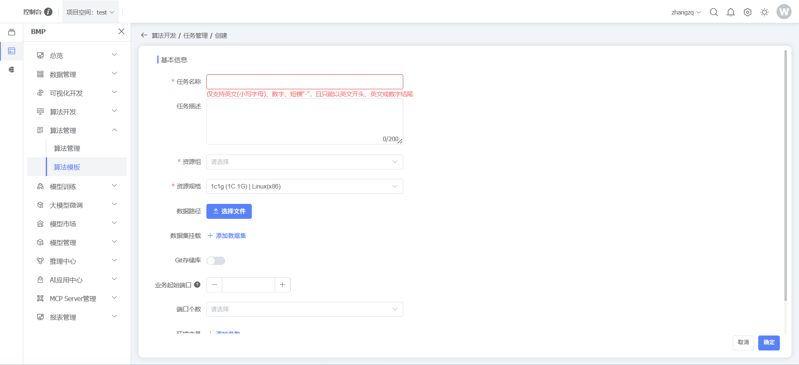
点击【创建】按钮，可创建训练任务
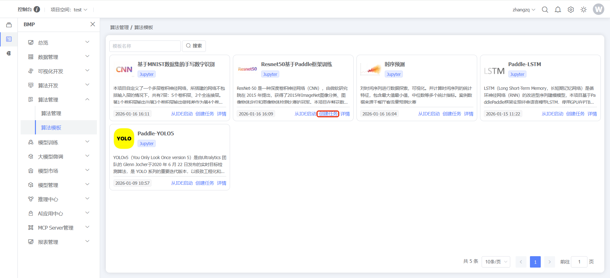
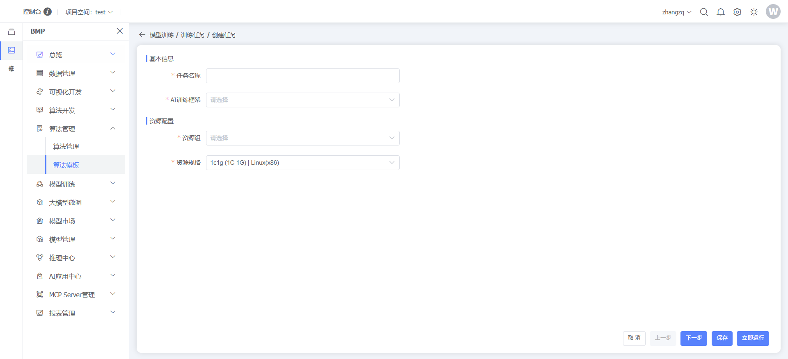
点击【详情】按钮，可查看算法模板详情
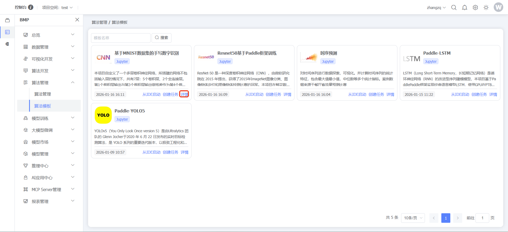
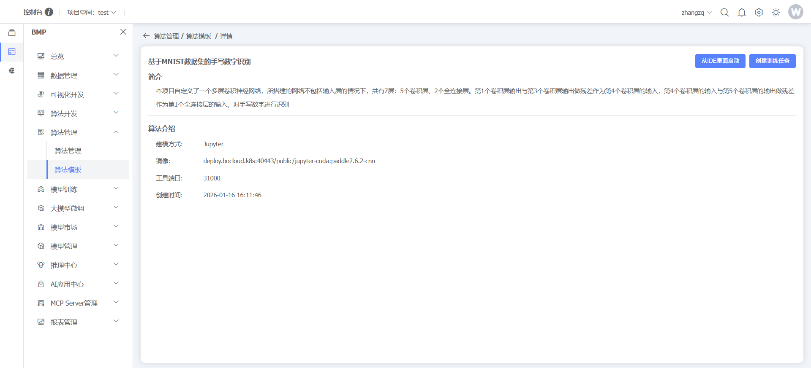

