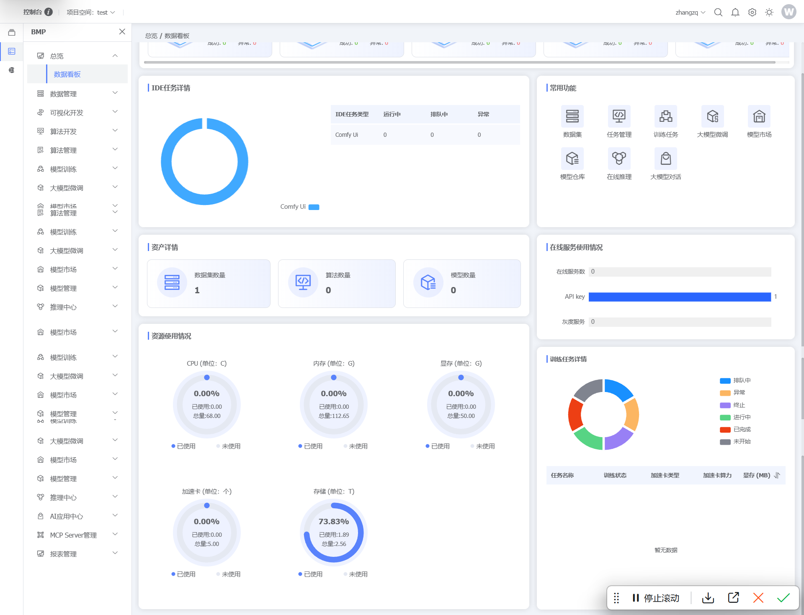
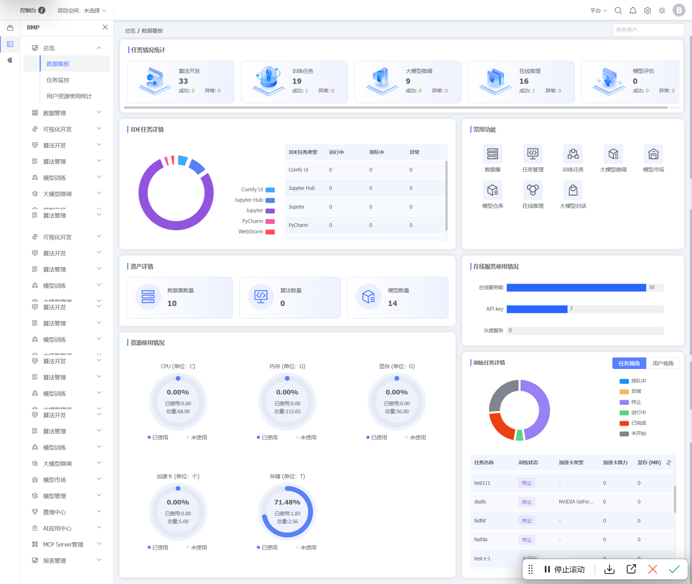
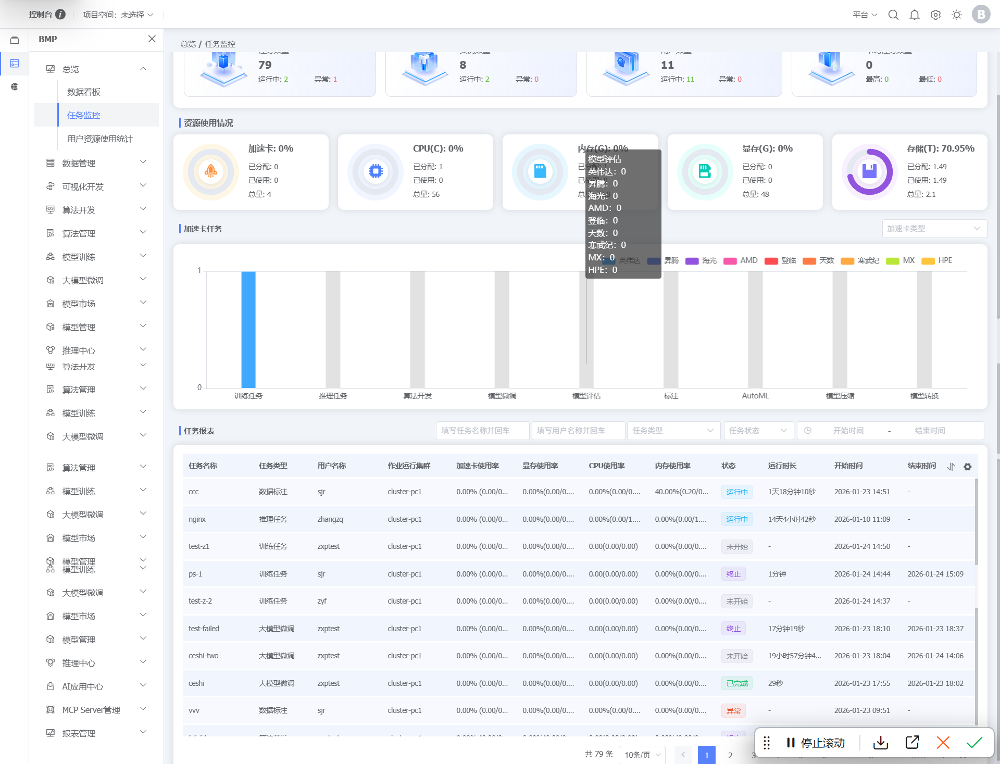
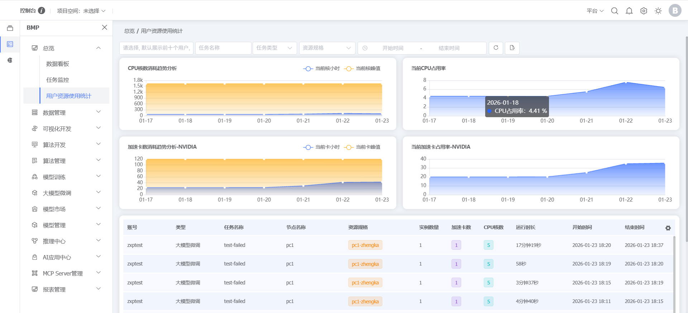

### 总览

#### 数据看板

**功能说明**：数据看板主要展示平台任务数量统计，IDE任务类型、资产详情，常用功能快捷入口，在线服务使用情况、资源使用情况。并且机器学习任务的执行情况，例如训练任务，资源池使用情况等，用户侧主要展示用户维度的数据看板的数据。
**操作说明：**点击左侧菜单【BMP】，点击【总览】，点击【数据看板】，可查看数据信息

---

## 管理员补充操作

### 总览

#### 数据看板

**功能说明：**数据看板主要展示平台任务数量统计，IDE任务类型、资产详情，常用功能快捷入口，在线服务使用情况、资源使用情况。并且机器学习任务的执行情况，例如训练任务，资源池使用情况等，平台侧主要展示平台维度的数据看板的数据。
**操作说明：**点击左侧菜单【BMP】，点击【总览】，点击【数据看板】，可查看任务统计信息

#### 任务监控

**功能说明：**任务监控主要监控平台任务运行情况，包括任务数量、实例数量、用户数量、卡钧任务统计，任务资源使用情况，包含GPU、CPU、内存、显存、存储使用情况，GPU任务数量、平台任务列表详情。
**操作说明：**点击左侧菜单【BMP】，点击【总览】，点击【任务监控】，可查看任务监控信息

#### 用户资源使用情况统计

**功能说明：**查看平台资源使用情况，包括CPU、加速卡以及不同任务占用的资源情况。
**操作说明：**点击左侧菜单【BMP】，点击【总览】，点击【用户资源使用情况统计】，可查看资源使用情况统计信息

