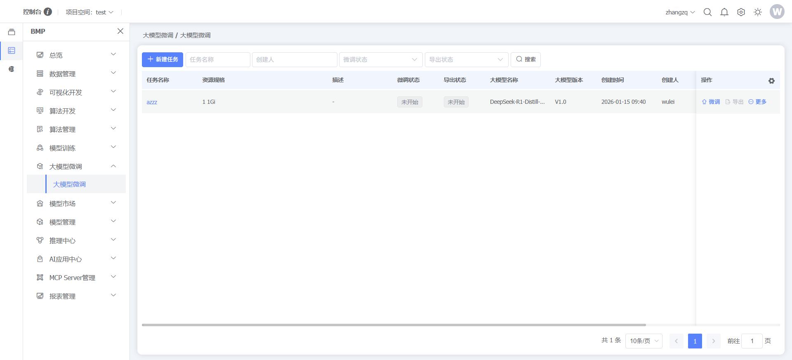
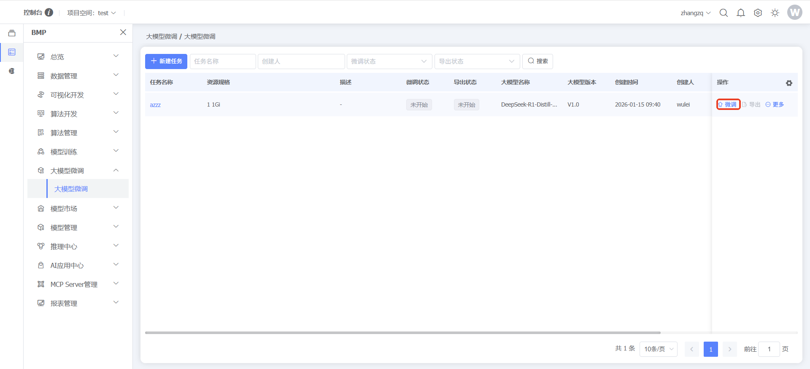
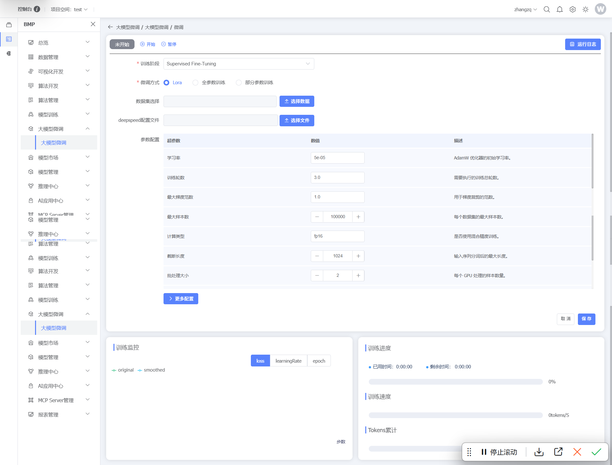
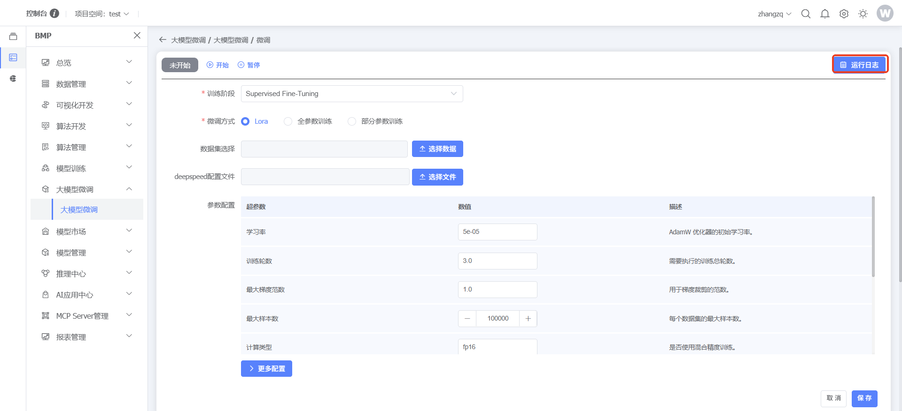
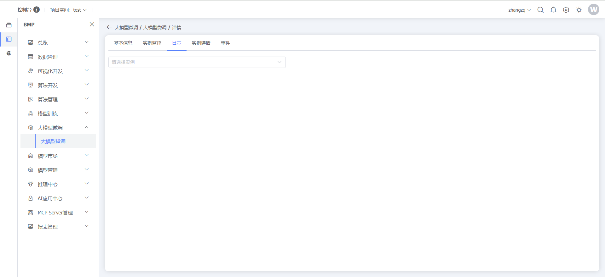
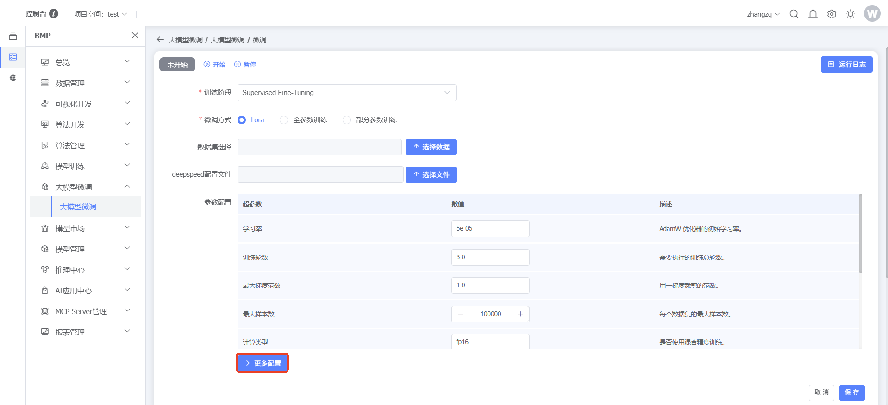
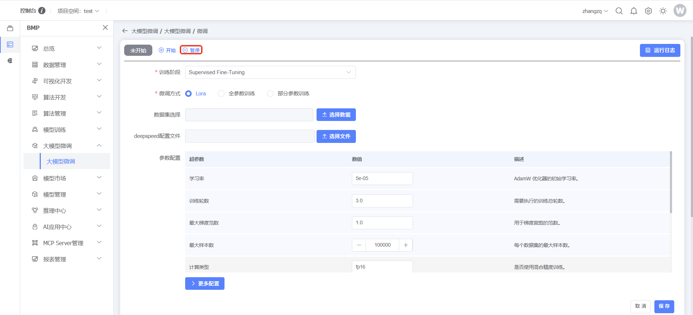
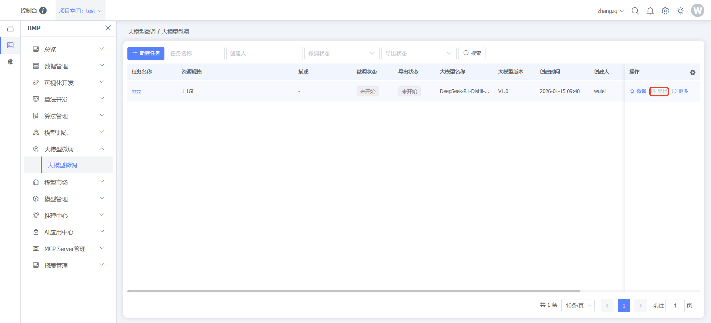
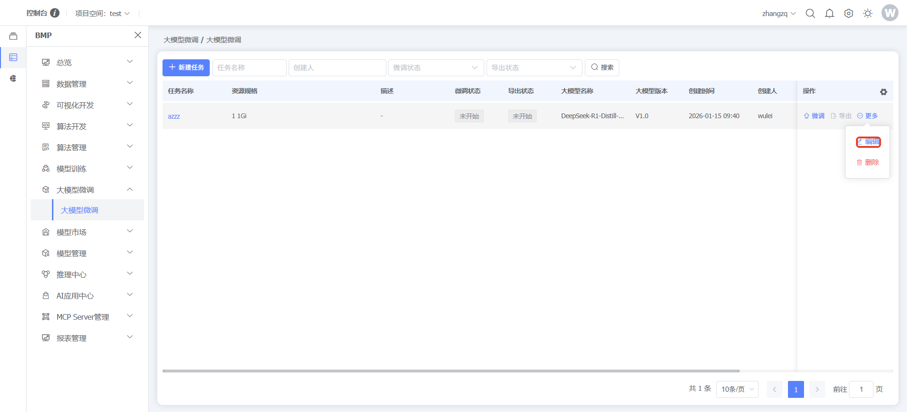

### 大模型微调

#### 大模型微调

**功能说明：**大模型微调（Fine-tuning）是指在预训练大模型的基础上，通过特定领域的数据集对模型进行进一步训练，使其适应特定任务需求的技术手段。微调的核心价值在于能将通用大模型转化为专用模型，弥合预训练目标与下游任务之间的差距。与全量训练相比，微调能显著减少计算资源和训练时间，同时避免过拟合风险，是目前行业大模型落地的主流技术路径。
**操作说明：**点击左侧【BMP】，点击【大模型微调】，点击【大模型微调】，可查看查看/管理用户大模型微调

点击数据行末【微调】按钮，进入大模型微调面板

点击【运行日志】按钮，查看大模型微调日志

点击【更多配置】按钮，查看其他参数配置

点击【开始】按钮，开始微调任务

点击【暂停】按钮，暂停微调任务

点击【导出】按钮，可导出模型到模型仓库

点击【编辑】按钮，可编辑微调任务

点击【删除】按钮，可删除微调任务

