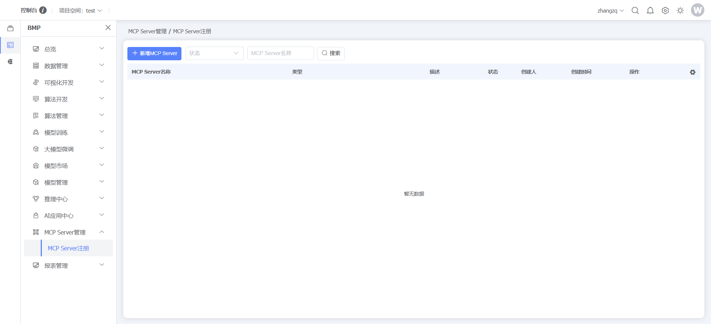
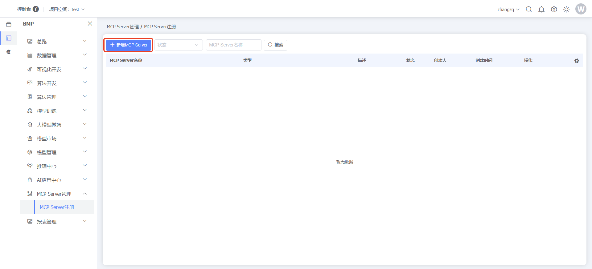
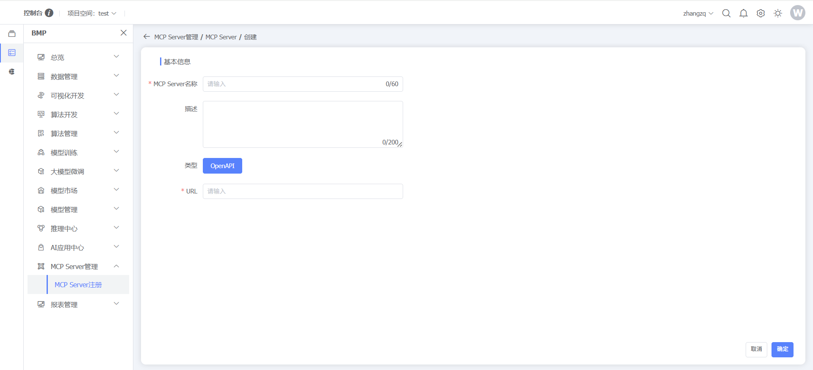
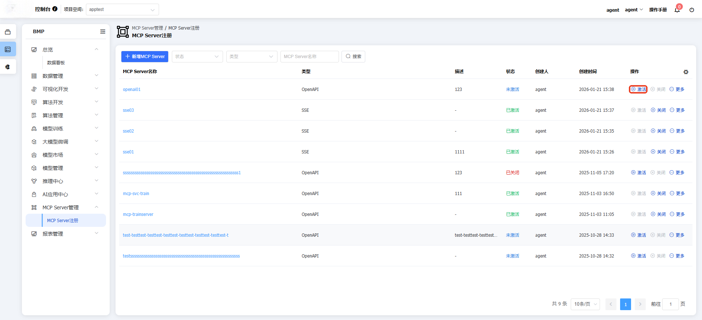
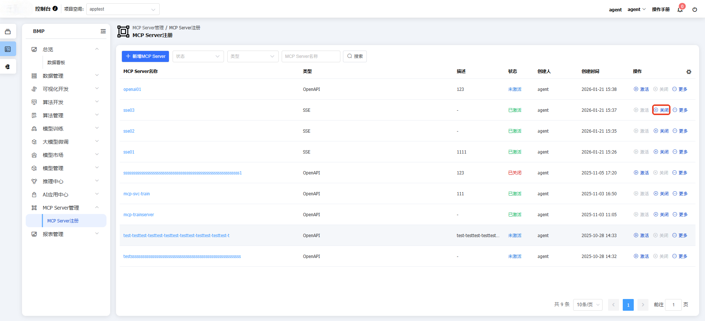
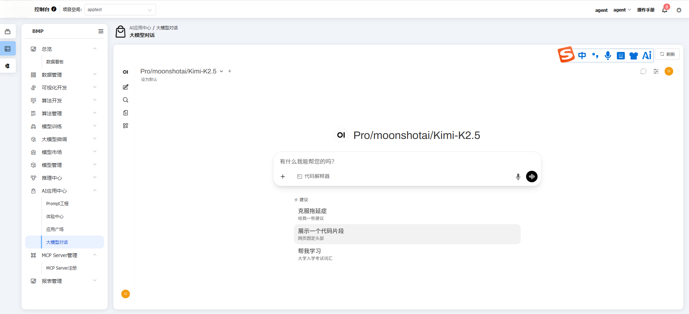
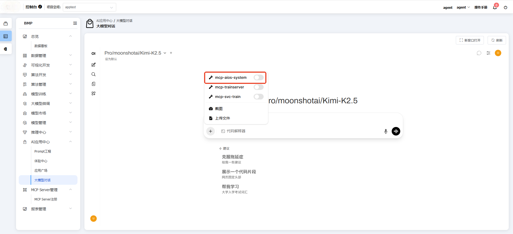

### MCP sever管理

#### MCP Server注册

**功能说明：**平台提供完整的MCP（Model Control Protocol）服务管理功能，支持MCP服务的注册、部署和调用全流程操作，用户可以通过标准化的协议接口实现模型服务的快速上线和统一管控，确保模型服务的高效运行和便捷调用。
**操作说明：**点击左侧【BMP】，点击【MCP sever管理】，点击【MCP Server注册】，可查看/管理MCP sever

点击【新增MCP sever】按钮，增加MCP sever

#### MCP Server激活

**功能说明：**MCP 服务器激活是指在使用 Claude Desktop、Cursor 或其他支持 MCP 的客户端时，启动并连接外部工具和服务的过程。激活后，这些工具就像 AI 模型的“扩展技能包”，让 AI 能够执行更多操作。
**操作说明：**点击左侧【BMP】，点击【MCP sever管理】，选择MCP sever，点击【激活】，激活MCP sever

激活完成，即可调用MCP sever，如果需要关闭MCP sever，点击【关闭】按钮，即可关闭MCP sever

#### 调用MCP服务

**功能说明：**调用MCP服务功能让 AI 能够与外部系统进行双向交互，实现更智能的工具调用和上下文感知。
**操作说明：**点击左侧【BMP】，点击【AI应用中心】，选大模型对话，点击【+】按钮，选择MCP sever

