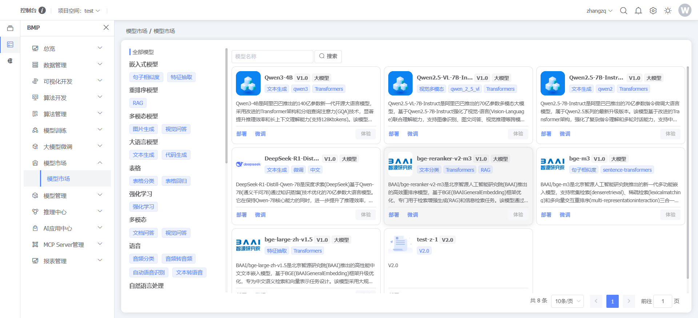
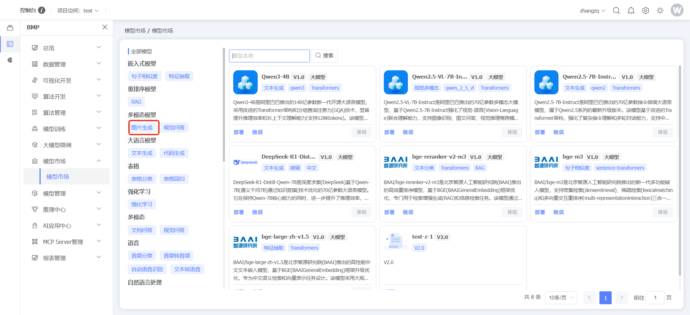
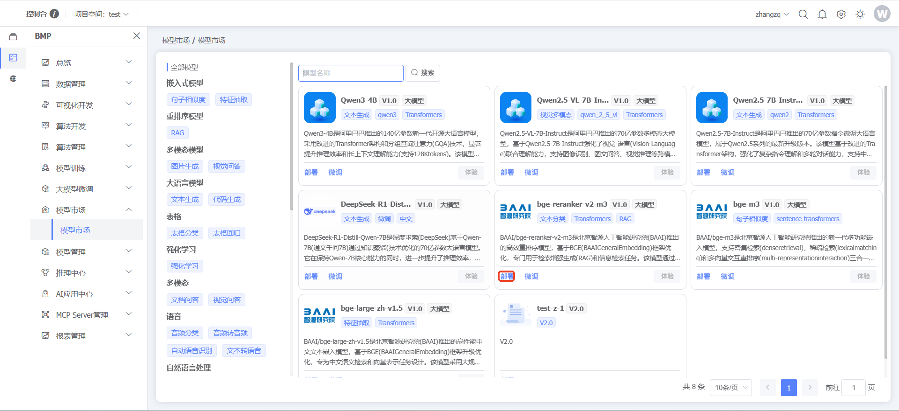
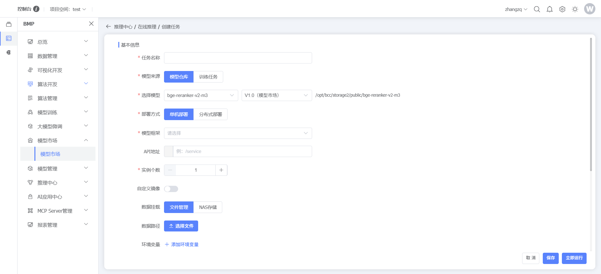
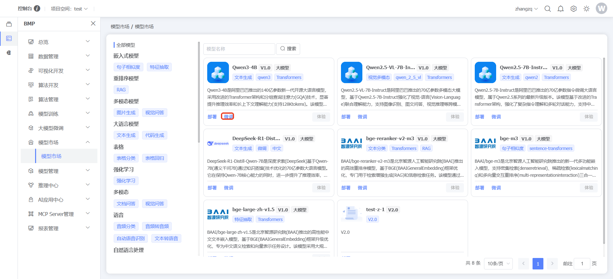
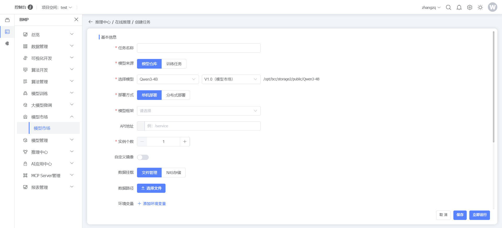
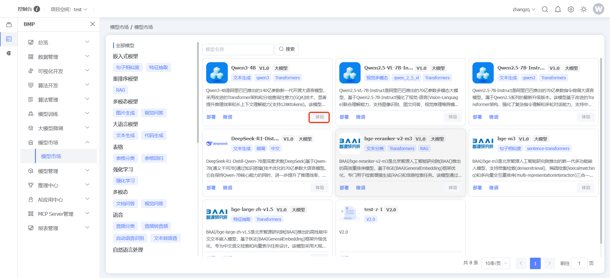
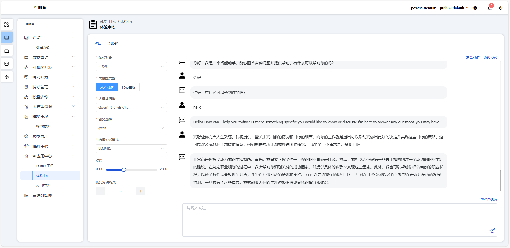
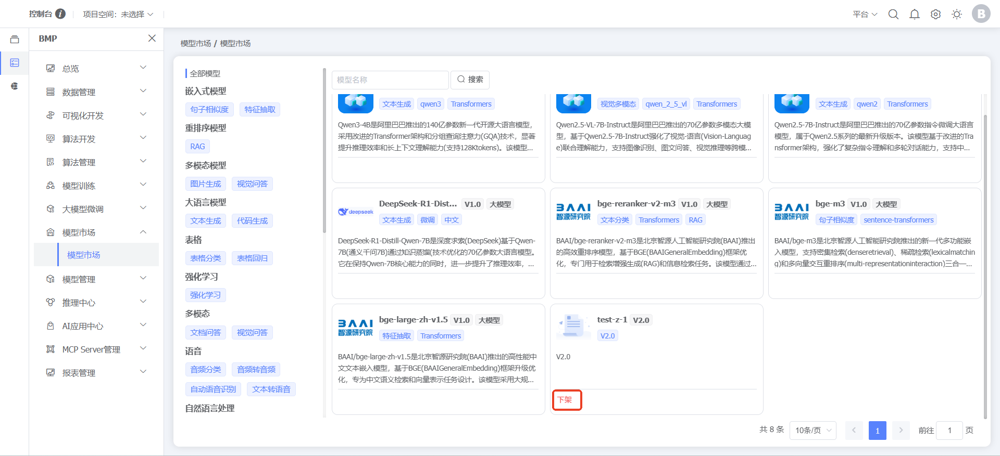
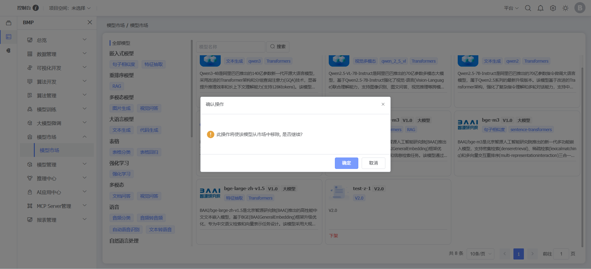

### 模型市场

#### 模型市场

**功能说明：**模型市场是博云BMP大模型管理模块，汇集了当前主流的各类大模型，提供模型展示、体验、微调及部署的一站式服务。它通过统一的界面让用户可以自由查看、对比和测试不同模型在语言、图像、语音等多领域的能力。
**操作说明：**点击左侧【BMP】，点击【模型市场】，点击【模型市场】，可查看公开模型

点击模型类型，搜索对应模型

点击【部署】按钮，部署模型到在线服务

点击【微调】按钮，对大模型进行微调

点击【体验】按钮，跳转到体验中心对大模型进行问答体验，未部署模型不支持体验

点击【下架】按钮，对模型市场进行下架，仅支持用户发布模型，已部署模型不支持下架

