### 模型训练

#### 训练任务

**功能说明：**平台支持单机训练和分布式训练；简化模型开发和全流程训练管理，方案支持Standard、TensorFlow、Pytorch、MindSpore、PaddlePaddle、Horovod、Deepspeed、MPI模型训练框架，如果框架版本不兼容训练任务，可以将新框架版本打包成镜像导入镜像仓库进行使用。
**操作说明：**点击左侧【BMP】，点击【模型训练】，点击【训练任务】，可查看/管理用户个人的任务
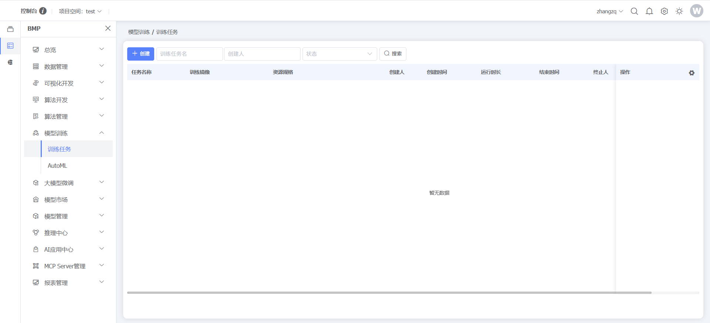
点击【创建】按钮，可创建训练任务
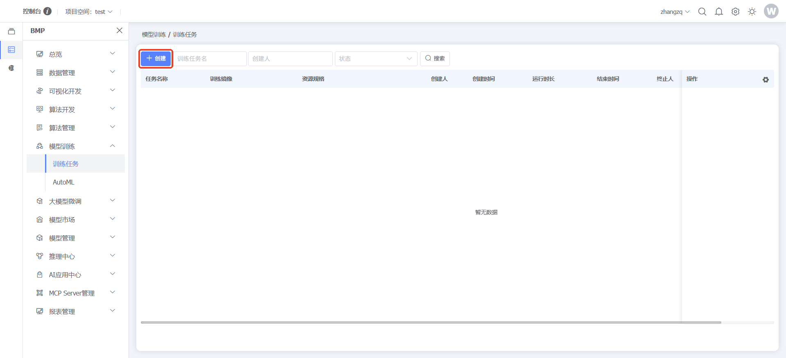
点击数据行末【编辑】按钮，编辑对应训练任务
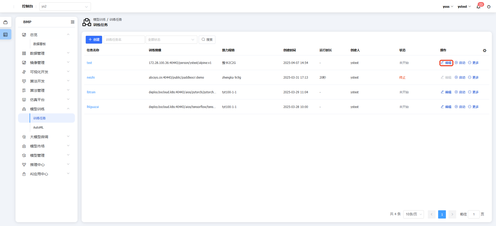
点击数据行末【启动】按钮，启动对应训练任务
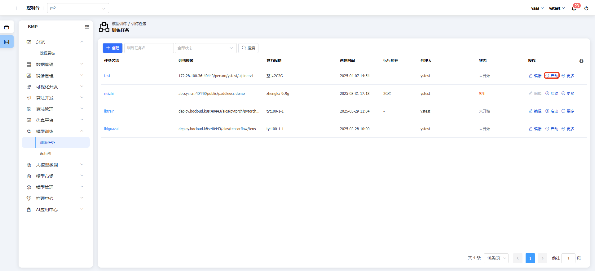
点击数据行末【终止】按钮，终止对应训练任务
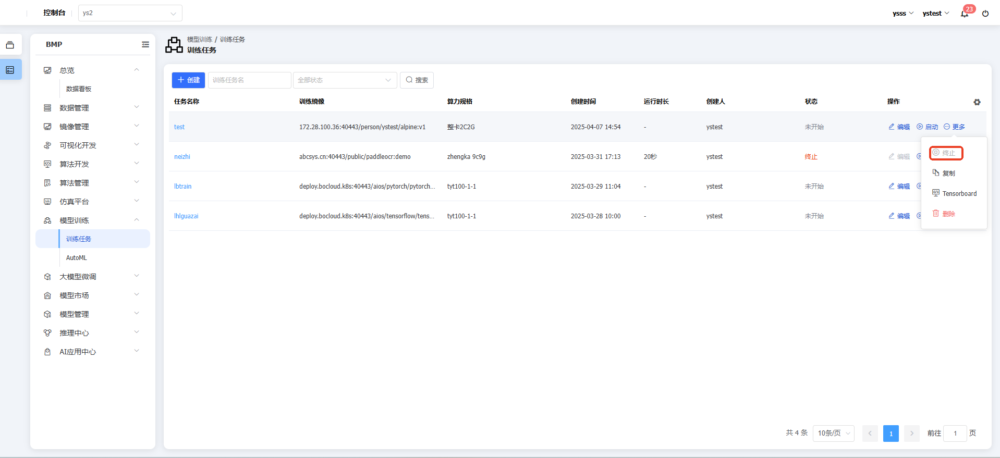
点击数据行末【删除】按钮，删除对应训练任务
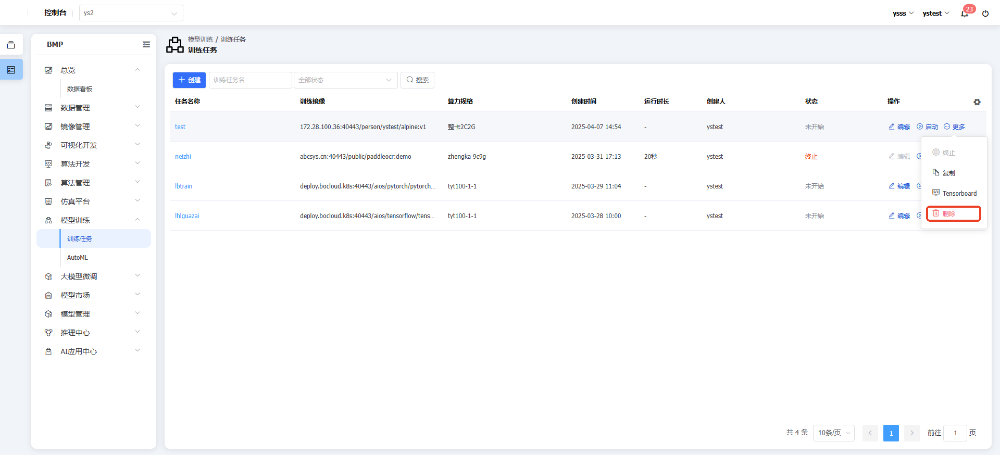
点击数据行末【复制】按钮，复制对应训练任务
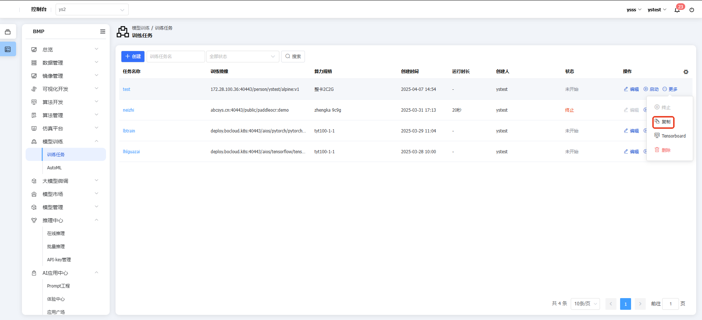
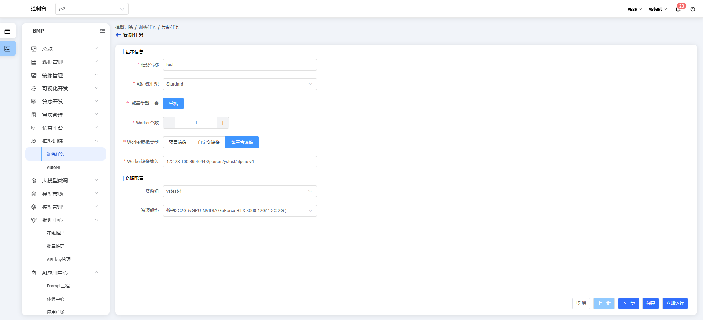
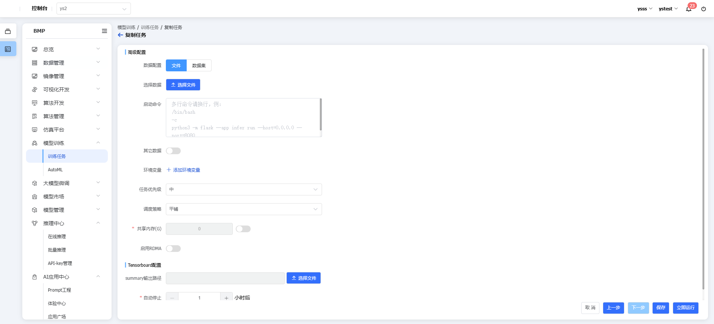
点击训练任务名称，可查看详情信息
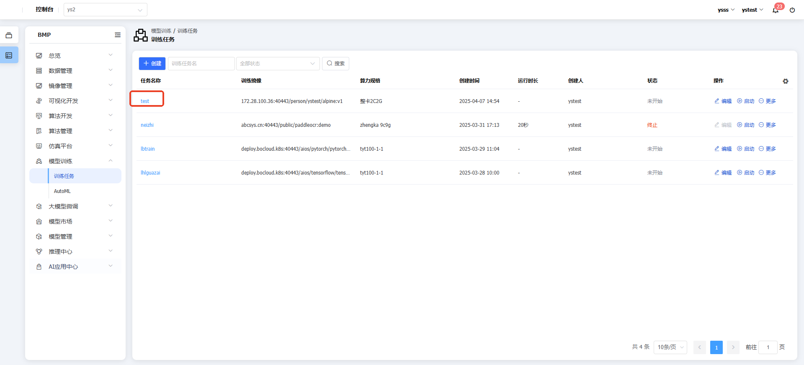
点击数据行末【Tensorboard】按钮，启动Tensorboard
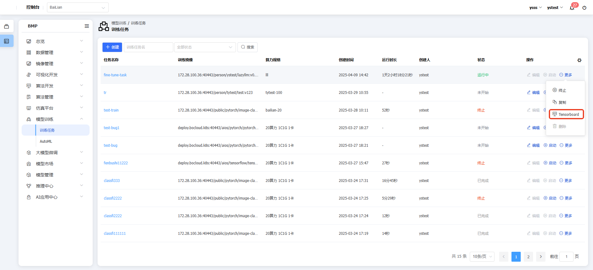
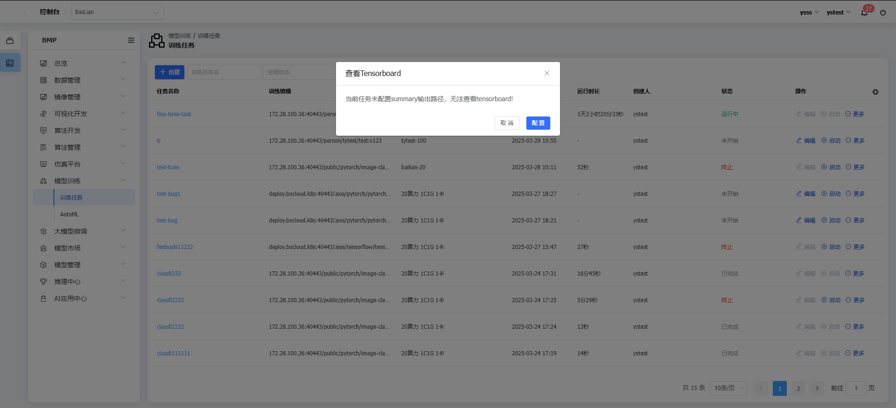
#### AutoML

**功能说明：**AutoML是BMP的提供的自动寻找超参组合的机器学习增强型服务。AutoML（自动机器学习）是一种旨在简化和自动化机器学习模型开发过程的技术。其核心优势体现在三个方面：一是通过自动化工具大幅降低算法工程师的调参时间；二是集成多种优化算法能够有效查找到最优超参数组合，训练出精度更高的模型；三是通过持续评估机制节省计算资源，可能不需要评估所有组合就能找到最优解。
**操作说明：**点击左侧【BMP】，点击【模型训练】，点击【AutoML】，可查看/管理用户个人的作业
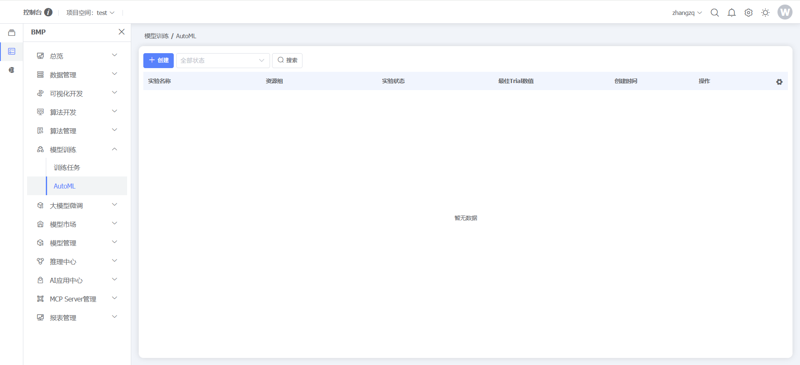
点击【创建】按钮，创建AutoML任务
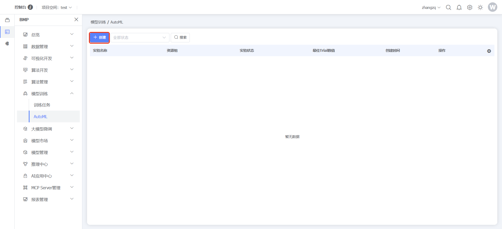
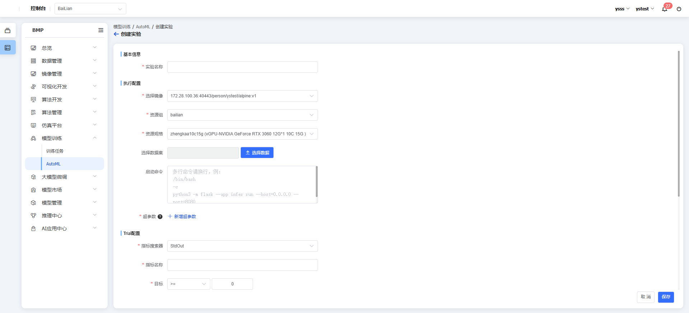
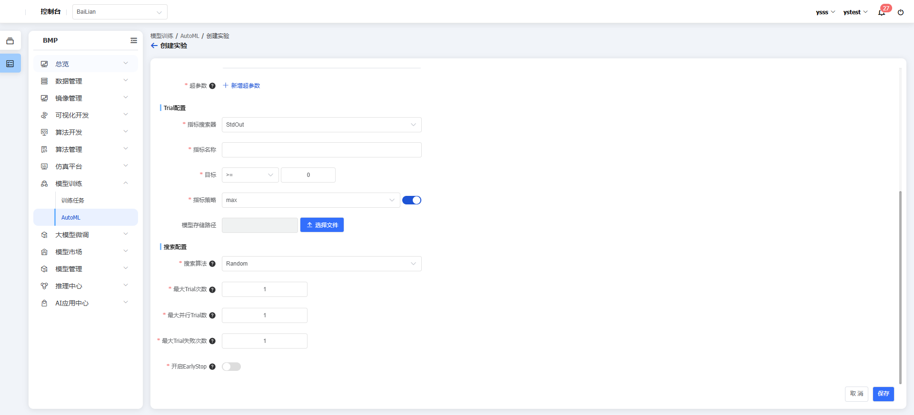
点击数据行末【修改】按钮，可支持修改最大Trial数、最大并行Trial数、最大失败Tria数
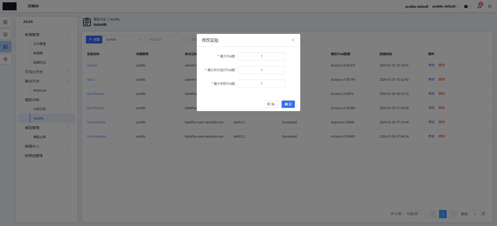
点击数据行实验名称，支持查看实验结果和实验详情
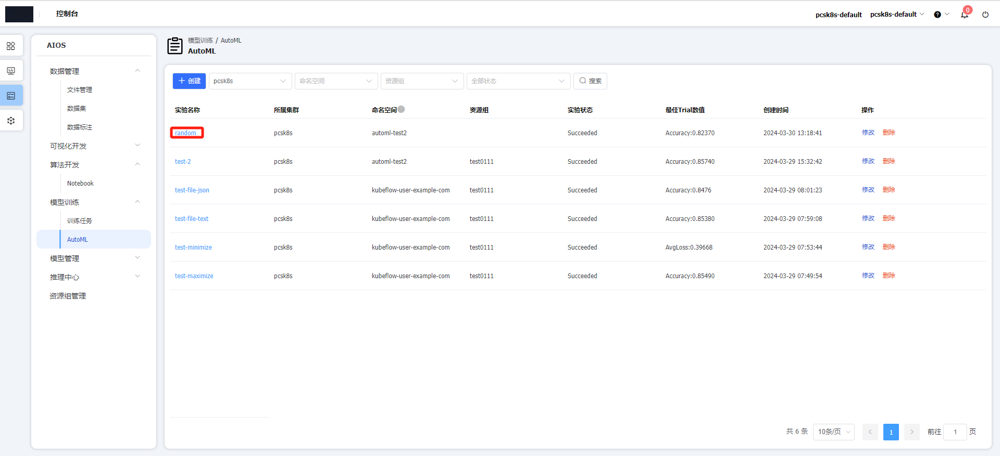
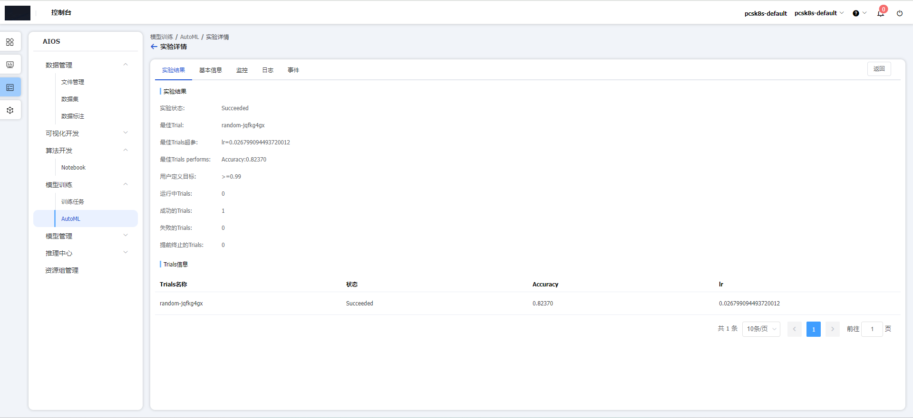

