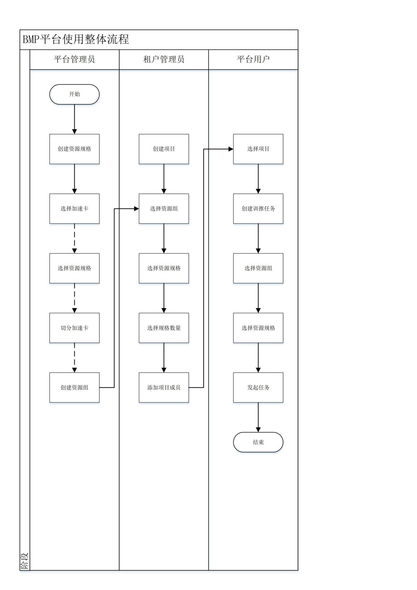

# 引言

## 编写目的

本文档的编写目的是对使用本系统的用户进行指导性的操作说明，帮助用户理解系统功能和操作步骤。
## 预期读者

本文档的预期读者为使用本系统的管理员和用户，这里的用户指的是产品经理、开发经理、开发人员、测试人员、运维人员等角色。
## 术语、定义和缩写

# 系统概述

## 系统简介

博云AI模型推平台面向人工提供大规模智算融合深度学习训练平台，帮助客户针对自身业务场景快速定制专属大模型。通过高性能异构算力底座，加速模型训练速度，降低机器学习训练门槛与模型训练成本。
数据管理、算法开发、模型训练、模型管理、推理部署都可以在博云模型推平台上完成，支持一站式模型服务。从技术上看，博云模型推平台底层支持各种异构计算资源，开发者可以根据需要灵活选择使用，而不需要关心底层的技术。同时，博云模型推平台支持Tensorflow、PyTorch、Mpi、PaddlePaddle、MindSpore等主流开源的AI开发框架，也支持开发者使用自研的算法框架，匹配用户使用习惯。
## 系统运行环境

浏览器：firefox、chrome等
## 平台交互流程

# 业务场景流程说明

| 序号 | 术语名称 | 术语定义 |
| --- | --- | --- |
| 1 | 集群 | 一组计算节点的集合，计算节点可以没有GPU资源，一个集群使用一套Kubernetes进行集群资源管理和调度编排。 |
| 2 | 节点 | 物理GPU服务器节点，一个台服务器为一个节点 |
| 3 | 资源组 | 资源组是单一集群下跨多个节点的同一品牌的一组GPU加速卡的集合。资源组包含物理整卡和切分后的VGPU卡，管理员创建资源组后，需要手动分配给租户，租户才能使用资源组的资源，一个资源组可以分配给一个租户或多个租户。 |
| 4 | 加速卡切分 | 根据不同类型加速卡，管理员可以选择任意一张加速卡并指定整卡或切分模式。 |
| 5 | 资源规格 | 资源规格一般包含CPU、内存、GPU型号及数量、GPU算力、GPU显存等部分，CPU、内存必须设置、GPU算力、GPU显存推荐设置（部分服务不需要GPU即可启动）。 |
| 6 | 项目 | 多个用户在项目空间下利用计算资源发布多种计算任务用以完成业务目标，一个项目可以使用多个K8S集群的资源组。 |
| 7 | 用户目录 | 文件管理中用户的私人目录，其内文件仅当前用户可见，其他用户不可见。 |
| 8 | 项目目录 | 文件管理中项目成员内可见的共享目录，项目成员可访问。 |
| 9 | 共享目录 | 文件管理中平台级公共目录，所有用户均可见。 |
| 10 | 数据集 | 结构化数据集合，可用于训练、标注、推理等，支持创建、分享、发布版本、下载等操作。 |
| 11 | 标注任务 | 对数据集进行人工或自动标注的操作任务，支持图片分类、目标检测等类型，可启动、提交审核、导出为 JSON 格式。 |
| 12 | 协同标注 | 多个用户共同参与的标注任务，支持团队创建、任务平均分配、成员管理。 |
| 13 | 模型仓库 | 存储用户训练或导入模型的地方，支持版本管理、导入、发布到模型市场、在线推理。 |
| 14 | 模型市场 | 公开模型的展示与分发平台，支持部署、微调、体验、下架操作。 |
| 15 | 在线推理 | 模型部署为实时推理服务的功能，支持预测、体验（大模型对话）、API 鉴权、扩容。 |
| 16 | API Key | 用于调用在线推理服务的身份鉴权密钥，支持创建、复制、删除。 |
| 17 | 灰度发布 | 逐步放量发布推理服务的策略，支持配置流量比例、复制访问地址。 |
| 18 | MCP sever | MCP Server（Model Context Protocol Server）是MCP协议架构中的关键组件，它作为被调用方提供后端服务支撑，包含各类核心功能模块。MCP Server遵循客户端－服务器架构，通过标准化协议为AI模型（如LLM）提供上下文数据、工具接口和操作能力，实现模型与外部数据源及工具的安全交互。 |
| 19 | 全参数微调 | 对大模型所有参数进行微调，需高显存（如 A100 80GB），学习率更低，适合数据充足的复杂任务。 |
| 20 | 部分参数微调 | 仅微调模型顶层参数，冻结底层，收敛快，适合小数据集。 |
| 21 | AutoML | 自动化机器学习功能，自动搜索最优模型，支持设置最大 Trial 数、并行数等。 |
| 22 | 公共数据集 | 由平台管理员创建，所有用户均可访问的数据集。 |
| 23 | 项目数据集 | 由项目成员创建，仅项目内可见的数据集。 |
| 24 | 标注团队 | 管理员创建的协同标注用户组，支持添加/删除成员、批量操作。 |
| 25 | 标注审核 | 审核员对标注结果进行质量检查的任务，支持启动审核、进入审核面板。 |
